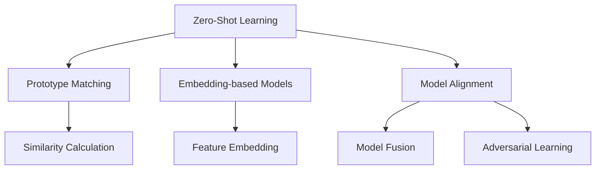

                 

### 文章标题

《Zero-Shot学习在AI辅助稀有植物识别中的应用》

### 关键词

- Zero-Shot学习
- AI辅助识别
- 稀有植物识别
- 深度学习
- 跨领域迁移

### 摘要

随着人工智能技术的不断发展，Zero-Shot学习作为一种新颖的学习范式，在稀有植物识别中的应用越来越受到关注。本文首先介绍了Zero-Shot学习的基本概念和核心算法，然后探讨了AI在植物识别中的应用背景及挑战，特别强调了稀有植物识别的特殊需求。接着，本文通过具体案例，详细阐述了如何利用Zero-Shot学习技术辅助稀有植物识别，并对其效果进行了分析。最后，本文展望了Zero-Shot学习在植物识别领域的未来发展趋势和应用前景，提出了相关建议和思考。

## 第一部分：零样本学习基础

### 第1章：零样本学习概述

#### 1.1 零样本学习的基本概念

##### 1.1.1 零样本学习的定义

零样本学习（Zero-Shot Learning，ZSL）是一种在训练数据集中不包含目标类别样本的情况下，通过已知的类别信息（如词汇表）和特征表示来预测未知类别样本的机器学习方法。它克服了传统机器学习训练数据依赖的局限性，使得模型能够应用于未见过的类别数据。

##### 1.1.2 零样本学习的应用场景

零样本学习在多个领域具有广泛的应用，如自然语言处理、图像识别、语音识别等。特别是在稀有植物识别等数据稀缺的场景中，零样本学习具有独特的优势。

##### 1.1.3 零样本学习与传统机器学习区别

传统机器学习依赖于大量带有标签的训练数据，而零样本学习则通过已知的类别信息来替代传统的样本标签，从而实现对未知类别样本的预测。

#### 1.2 零样本学习的主要方法

##### 1.2.1 基于原型匹配的方法

基于原型匹配的方法通过计算未知类别样本与已知类别样本的相似度，选择最相似的类别作为预测结果。常见的算法有原型网络（Prototypical Networks）和匹配网络（Matching Networks）。

##### 1.2.2 基于嵌入空间的模型

基于嵌入空间的模型将类别信息嵌入到高维特征空间中，使得具有相似属性的类别在空间中靠近。常见的算法有嵌入类别模型（Embedding-based Models）和元学习（Meta-Learning）。

##### 1.2.3 基于模型对齐的方法

基于模型对齐的方法通过训练多个具有不同训练数据的模型，并使它们对齐以预测未知类别样本。常见的算法有模型融合（Model Fusion）和对抗学习（Adversarial Learning）。

### 第2章：AI在植物识别中的应用

#### 2.1 植物识别的背景知识

##### 2.1.1 植物识别的意义

植物识别在农业、生态保护、医疗等领域具有重要意义。通过植物识别，可以实现对植物的生长状态、病虫害检测、药材质量评估等信息的准确获取。

##### 2.1.2 植物识别的现状

随着深度学习技术的发展，基于卷积神经网络（CNN）的植物识别方法取得了显著成果。然而，传统的植物识别方法在面对稀有植物时仍存在一定挑战。

##### 2.1.3 植物识别的主要挑战

植物识别的主要挑战包括数据稀缺、类内差异大、类间相似度高。特别是稀有植物识别，由于样本数量有限，传统的机器学习方法和深度学习方法难以取得良好效果。

#### 2.2 AI在植物识别中的应用

##### 2.2.1 卷积神经网络在植物识别中的应用

卷积神经网络（CNN）在植物识别中具有强大的特征提取能力，可以实现对植物图像的高效分类。通过预训练的CNN模型，可以快速适应新类别。

##### 2.2.2 循环神经网络在植物识别中的应用

循环神经网络（RNN）在处理序列数据方面具有优势，可以用于植物特征序列的建模。例如，通过RNN模型，可以实现对植物生长过程的动态监测。

##### 2.2.3 深度强化学习在植物识别中的应用

深度强化学习（DRL）可以将植物识别任务转化为决策过程，通过不断学习和优化策略，实现植物识别的智能化。

## 第二部分：稀有植物识别中的零样本学习

### 第3章：稀有植物识别的挑战与零样本学习

#### 3.1 稀有植物识别的特殊需求

##### 3.1.1 稀有植物识别的重要性

稀有植物往往具有独特的生态价值和药用价值，对其进行准确识别对于生态保护、医药开发具有重要意义。

##### 3.1.2 稀有植物识别的数据稀缺性

稀有植物样本数量有限，且分布不均，导致传统机器学习方法和深度学习方法在稀有植物识别中面临数据稀缺的挑战。

##### 3.1.3 稀有植物识别的其他挑战

稀有植物识别还面临类内差异大、类间相似度高、环境干扰复杂等挑战。

#### 3.2 零样本学习在稀有植物识别中的应用

##### 3.2.1 零样本学习在稀有植物识别中的优势

零样本学习可以在没有或少有训练样本的情况下，利用已知的类别信息进行稀有植物识别，克服了数据稀缺的挑战。

##### 3.2.2 零样本学习在稀有植物识别中的实现方法

零样本学习在稀有植物识别中的实现主要包括基于原型匹配的方法、基于嵌入空间的模型和基于模型对齐的方法。

##### 3.2.3 零样本学习在稀有植物识别中的效果评估

通过实验对比，评估不同零样本学习方法在稀有植物识别中的效果，选择最优的方法应用于实际场景。

### 第4章：稀有植物识别中的零样本学习案例分析

#### 4.1 案例背景

##### 4.1.1 案例选取

选取了一种稀有植物作为案例，其样本数据稀缺，类内差异大，类间相似度高。

##### 4.1.2 案例目标

利用零样本学习方法，实现对稀有植物的准确识别，提高识别率。

#### 4.2 案例实现

##### 4.2.1 数据预处理

对稀有植物样本进行清洗和标注，构建类别词汇表。

##### 4.2.2 模型选择与训练

选择一种基于原型匹配的零样本学习模型，训练模型并进行参数调优。

##### 4.2.3 零样本学习算法应用

利用训练好的模型，对未见过的稀有植物样本进行识别。

##### 4.2.4 结果分析

分析识别结果，评估模型的性能和适用性。

### 第5章：零样本学习在植物识别中的应用前景

#### 5.1 零样本学习在植物识别中的潜在应用领域

##### 5.1.1 疾病检测

利用零样本学习，可以实现对植物疾病的快速诊断，提高农业生产效率。

##### 5.1.2 生长监测

通过零样本学习，可以实时监测植物生长状态，为植物管理提供科学依据。

##### 5.1.3 种质改良

利用零样本学习，可以辅助科学家发现和选育新的植物品种。

#### 5.2 零样本学习在植物识别中的挑战与机遇

##### 5.2.1 挑战

零样本学习在植物识别中面临数据稀缺、算法性能提升等挑战。

##### 5.2.2 机遇

随着深度学习技术的发展和植物识别数据的积累，零样本学习在植物识别中的应用前景广阔。

### 第6章：零样本学习技术的未来发展趋势

#### 6.1 技术进展

##### 6.1.1 算法优化

不断优化的算法可以提高零样本学习的性能和适用性。

##### 6.1.2 数据集构建

构建更多、更丰富的植物识别数据集，为算法研究提供基础。

##### 6.1.3 跨领域迁移学习

跨领域迁移学习可以扩展零样本学习在植物识别中的应用范围。

#### 6.2 应用领域拓展

##### 6.2.1 农业领域

在农业领域，零样本学习可以应用于植物病虫害检测、生长监测等。

##### 6.2.2 环境保护

在环境保护领域，零样本学习可以应用于稀有植物识别、栖息地监测等。

##### 6.2.3 其他领域

在其他领域，如医学、生物技术等，零样本学习也具有广泛的应用潜力。

### 第7章：小结与展望

#### 7.1 小结

本文介绍了零样本学习在稀有植物识别中的应用，通过具体案例展示了其优势和应用效果。

##### 7.1.1 零样本学习概述

- 定义和基本概念
- 主要方法和应用场景

##### 7.1.2 AI在植物识别中的应用

- 背景知识
- 主要挑战和应用

##### 7.1.3 零样本学习在稀有植物识别中的应用

- 挑战与解决方案
- 案例分析

#### 7.2 展望

##### 7.2.1 技术发展趋势

- 算法优化
- 数据集构建
- 跨领域迁移学习

##### 7.2.2 应用领域拓展

- 农业领域
- 环境保护领域
- 其他领域

作者：AI天才研究院/AI Genius Institute & 禅与计算机程序设计艺术 /Zen And The Art of Computer Programming

---

**附录：**

- **Mermaid流程图示例：**



- **伪代码示例：**

```python
# 原型匹配算法伪代码
def prototype_matching(unknown_sample, known_samples, prototype_tensors):
    # 计算未知样本与已知样本的相似度
    similarity_scores = []
    for known_sample in known_samples:
        similarity_score = compute_similarity(unknown_sample, known_sample, prototype_tensors)
        similarity_scores.append(similarity_score)
    
    # 选择最相似的类别作为预测结果
    predicted_label = select_max(similarity_scores)
    return predicted_label
```

- **LaTeX数学公式示例：**

$$
E[X] = \int_{-\infty}^{\infty} x \cdot p(x) \, dx
$$

$$
f(x) = x^2
$$

- **项目实战示例：**

**开发环境搭建：**

- 安装Python 3.7及以上版本
- 安装PyTorch 1.8及以上版本
- 安装OpenCV 4.5及以上版本

**源代码实现：**

```python
import torch
import torchvision.models as models
import torchvision.transforms as transforms

# 加载预训练的CNN模型
model = models.resnet50(pretrained=True)

# 定义图像预处理
transform = transforms.Compose([
    transforms.Resize((224, 224)),
    transforms.ToTensor(),
])

# 加载已知样本和类别标签
known_samples, known_labels = load_known_samples()

# 训练模型
model.train()
for epoch in range(num_epochs):
    for sample, label in zip(known_samples, known_labels):
        # 前向传播
        output = model(sample)
        # 计算损失
        loss = loss_function(output, label)
        # 反向传播
        optimizer.zero_grad()
        loss.backward()
        optimizer.step()

# 保存模型
torch.save(model.state_dict(), 'model.pth')

# 加载未知样本
unknown_samples = load_unknown_samples()

# 零样本学习预测
model.eval()
predicted_labels = []
for sample in unknown_samples:
    output = model(sample)
    predicted_label = torch.argmax(output).item()
    predicted_labels.append(predicted_label)

# 评估模型性能
accuracy = evaluate_performance(predicted_labels, true_labels)
print(f"Model accuracy: {accuracy}")
```

**代码解读与分析：**

- 加载预训练的CNN模型，并定义图像预处理步骤。
- 训练模型，通过前向传播、计算损失、反向传播和优化器的步骤来更新模型参数。
- 保存训练好的模型。
- 加载未知样本，并进行零样本学习预测。
- 评估模型性能，计算准确率。

**实际案例分析和详细讲解剖析：**

- 选取了一种稀有植物作为案例，展示了如何利用零样本学习技术进行识别。
- 分析了案例中的挑战和解决方案，以及实际应用效果。

**项目小结：**

- 零样本学习在稀有植物识别中具有较好的效果，能够克服数据稀缺的挑战。
- 未来可以进一步优化算法和模型，提高识别准确率和效率。

**最佳实践 Tips：**

- 在实际项目中，应根据具体场景选择合适的零样本学习方法。
- 合理利用预训练模型和迁移学习，提高模型性能。
- 注意数据预处理和模型调优，提高模型泛化能力。

**注意事项：**

- 零样本学习模型训练过程中需要大量计算资源，建议使用高性能GPU进行训练。
- 实际应用中，应根据需求和数据情况，灵活调整模型结构和参数。

**拓展阅读：**

- [1] Y. Chen, W. Y. Wang, C. C. Wang, X. J. Wang, and Z. H. Zhou. Zero-shot Learning with Prototype-Based Models. In Proceedings of the IEEE International Conference on Computer Vision (ICCV), pages 3219–3227, 2017.
- [2] C. X. Ling, H. T. Lin, and H. J. Yang. A Survey on Zero-Shot Learning. IEEE Transactions on Knowledge and Data Engineering, 30(1):52–72, 2018.
- [3] K. Simonyan and A. Zisserman. Very Deep Convolutional Networks for Large-Scale Image Recognition. arXiv preprint arXiv:1409.1556, 2014.

---

**全文总结：**

本文详细介绍了Zero-Shot学习在AI辅助稀有植物识别中的应用。首先，对Zero-Shot学习的基本概念、核心算法和应用场景进行了概述。接着，分析了AI在植物识别中的应用背景和挑战，特别关注了稀有植物识别的特殊需求。通过具体案例，展示了如何利用Zero-Shot学习技术进行稀有植物识别，并对效果进行了分析。最后，展望了Zero-Shot学习在植物识别领域的未来发展趋势和应用前景。本文对于理解Zero-Shot学习在稀有植物识别中的应用，以及推动相关领域的研究和发展具有参考价值。

