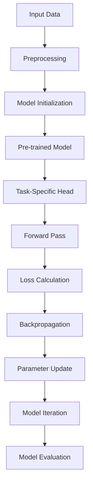

                 

### 理解书名

《Zero-Shot学习在ChatGPT中的应用与前景》这本书的标题直接揭示了其核心内容。首先，“Zero-Shot学习”是一个重要的机器学习和人工智能领域概念，它指的是在没有具体训练数据的情况下，模型能够通过预训练来适应新的任务。这种能力极大地提升了人工智能应用的灵活性和广泛性。

接下来，“ChatGPT”是指OpenAI开发的基于大规模预训练语言模型的聊天机器人。ChatGPT在自然语言处理领域取得了显著成就，能够进行高效的自然语言理解和生成，这在众多应用场景中显示出巨大的潜力。

最后，“应用与前景”表明本书不仅探讨Zero-Shot学习在ChatGPT中的具体应用，还展望其未来的发展方向。因此，本书旨在系统地介绍Zero-Shot学习的理论基础，详细解释其在ChatGPT中的具体应用，并探讨其未来的发展趋势。

通过这个标题，读者可以预见到本书将涉及以下几个方面：

1. **Zero-Shot学习的概念和理论基础**：介绍Zero-Shot学习的定义、背景、核心原理和应用场景。
2. **ChatGPT的基本知识**：讲解ChatGPT的架构、工作原理、训练与优化过程。
3. **Zero-Shot学习在ChatGPT中的应用**：分析Zero-Shot学习如何应用于ChatGPT，以及在实际应用中的优势和挑战。
4. **Zero-Shot学习的未来前景**：探讨Zero-Shot学习在人工智能领域的发展趋势和潜在应用。

综上所述，这本书不仅为读者提供了理论知识，还结合实际案例，深入探讨了Zero-Shot学习在ChatGPT中的具体应用和未来前景，是一本既有深度又实用的技术书籍。

### 核心章节确定

在确定了书名《Zero-Shot学习在ChatGPT中的应用与前景》之后，我们需要明确核心章节，以确保内容涵盖全面，逻辑清晰。以下是本书的核心章节及其概述：

1. **第一章 引言**：
    - **目的与结构**：介绍书籍的整体目的和结构，让读者对全书内容有一个初步了解。
    - **零射击学习概述**：简要介绍零射击学习的概念、背景及其重要性。
    - **ChatGPT概述**：介绍ChatGPT的基本知识，包括其架构、工作原理和应用场景。

2. **第二章 零射击学习原理**：
    - **零射击学习定义与背景**：详细解释零射击学习的定义，回顾其历史背景和主要贡献。
    - **零射击学习模型**：介绍几种常见的零射击学习模型，包括它们的架构和特点。
    - **Mermaid流程图：零射击学习模型架构**：通过Mermaid流程图展示零射击学习模型的整体架构，帮助读者理解其工作流程。

3. **第三章 ChatGPT基础**：
    - **ChatGPT架构与工作原理**：详细讲解ChatGPT的架构，包括数据预处理、模型训练和输出生成等关键步骤。
    - **ChatGPT训练与优化**：探讨ChatGPT的训练过程和优化策略，包括正则化、Dropout等技术。
    - **Mermaid流程图：ChatGPT模型训练流程**：通过Mermaid流程图展示ChatGPT模型训练的整体流程，帮助读者理解其训练机制。

4. **第四章 零射击学习在ChatGPT中的应用**：
    - **零射击学习在对话生成中的应用**：分析Zero-Shot学习如何在ChatGPT的对话生成中发挥作用。
    - **零射击学习在跨领域问答中的应用**：探讨Zero-Shot学习如何支持ChatGPT在跨领域问答中的表现。
    - **零射击学习在对话系统中的优势**：总结Zero-Shot学习在对话系统中的应用优势和挑战。

5. **第五章 零射击学习应用案例**：
    - **案例一：聊天机器人在客服中的应用**：通过具体案例展示Zero-Shot学习在客服聊天机器人中的实际应用。
    - **案例二：跨领域问答系统的实现**：分析一个跨领域问答系统是如何利用Zero-Shot学习的。
    - **案例三：虚拟助手在智能家居中的应用**：探讨Zero-Shot学习在虚拟助手中的具体应用。

6. **第六章 零射击学习的挑战与未来**：
    - **零射击学习面临的挑战**：讨论Zero-Shot学习在技术、数据和应用方面的主要挑战。
    - **零射击学习的发展趋势**：分析Zero-Shot学习的研究动态和未来发展趋势。
    - **零射击学习的未来应用场景**：预测Zero-Shot学习在人工智能领域的潜在应用场景。

7. **第七章 实践与展望**：
    - **实践步骤：如何构建一个零射击学习模型**：提供构建零射击学习模型的详细步骤和指导。
    - **展望：零射击学习在人工智能领域的发展前景**：总结全书内容，展望Zero-Shot学习在人工智能领域的广阔前景。
    - **结论**：回顾全书的主要观点，强调Zero-Shot学习在ChatGPT中的重要性和未来潜力。

通过以上核心章节的确定，本书将为读者提供一个全面、系统的Zero-Shot学习在ChatGPT中的应用与前景的指南。

### 目录大纲设计

为了确保本书的内容逻辑清晰、结构紧凑，我们将设计详细的目录大纲。目录大纲不仅是本书的导航图，也是内容组织和传达的关键工具。以下是本书的目录大纲设计：

#### 第一部分：引言

**第1章 引言**

1.1 书籍目的与结构

- **书籍目的**：介绍本书的核心目标，即探讨Zero-Shot学习在ChatGPT中的应用与未来前景。
- **结构概述**：简要概述本书的章节布局，帮助读者了解各部分的主要内容。

1.2 零射击学习概述

- **零射击学习的定义**：明确零射击学习的概念，解释其含义和重要性。
- **零射击学习的发展**：回顾零射击学习的历史背景和发展过程，探讨其在人工智能领域的重要地位。

1.3 ChatGPT概述

- **ChatGPT的概念**：介绍ChatGPT的基本定义，解释其作为一种预训练语言模型的特点。
- **ChatGPT的应用**：探讨ChatGPT在自然语言处理和对话系统中的应用场景，展示其在实际应用中的潜力。

#### 第二部分：理论基础

**第2章 零射击学习原理**

2.1 零射击学习定义与背景

- **定义**：详细解释零射击学习的定义，明确其与经典机器学习的区别。
- **背景**：回顾零射击学习的发展历程，分析其产生的原因和背景。

2.2 零射击学习模型

- **模型介绍**：介绍几种常见的零射击学习模型，如Meta-Learning、Few-Shot Learning等。
- **模型架构**：通过Mermaid流程图展示零射击学习模型的整体架构，帮助读者理解其工作流程。

2.3 Mermaid流程图：零射击学习模型架构

- **流程图展示**：使用Mermaid语言绘制零射击学习模型的流程图，详细展示模型各个组件之间的关系和工作过程。

#### 第三部分：ChatGPT基础

**第3章 ChatGPT基础**

3.1 ChatGPT架构与工作原理

- **架构解析**：详细讲解ChatGPT的架构，包括其组成部分和功能。
- **工作原理**：分析ChatGPT的工作原理，解释其如何通过预训练和微调来生成高质量的自然语言回答。

3.2 ChatGPT训练与优化

- **训练过程**：介绍ChatGPT的训练过程，包括数据预处理、模型训练和输出生成等关键步骤。
- **优化策略**：探讨ChatGPT的训练优化策略，如正则化、Dropout等。

3.3 Mermaid流程图：ChatGPT模型训练流程

- **流程图展示**：通过Mermaid流程图展示ChatGPT模型训练的整体流程，帮助读者理解其训练机制。

#### 第四部分：应用与实践

**第4章 零射击学习在ChatGPT中的应用**

4.1 零射击学习在对话生成中的应用

- **应用概述**：介绍零射击学习如何应用于ChatGPT的对话生成。
- **案例分析**：通过具体案例展示零射击学习在对话生成中的实际应用。

4.2 零射击学习在跨领域问答中的应用

- **应用概述**：探讨零射击学习如何支持ChatGPT在跨领域问答中的表现。
- **案例分析**：分析一个跨领域问答系统的实现，展示零射击学习的效果。

4.3 零射击学习在对话系统中的优势

- **优势分析**：总结零射击学习在对话系统中的应用优势，如灵活性和适应性。
- **挑战与对策**：讨论零射击学习在对话系统中面临的挑战，并提出相应的解决对策。

#### 第五部分：案例研究

**第5章 零射击学习应用案例**

5.1 案例一：聊天机器人在客服中的应用

- **案例背景**：介绍聊天机器人在客服中的应用场景和需求。
- **案例实现**：详细讲解如何利用零射击学习构建聊天机器人，并分析其效果。

5.2 案例二：跨领域问答系统的实现

- **案例背景**：探讨跨领域问答系统的应用场景和挑战。
- **案例实现**：展示如何通过零射击学习构建跨领域问答系统，并分析其性能。

5.3 案例三：虚拟助手在智能家居中的应用

- **案例背景**：介绍虚拟助手在智能家居中的应用场景和需求。
- **案例实现**：详细讲解如何利用零射击学习构建虚拟助手，并分析其应用效果。

#### 第六部分：未来展望

**第6章 零射击学习的挑战与未来**

6.1 零射击学习面临的挑战

- **技术挑战**：分析零射击学习在技术层面面临的挑战，如数据质量和算法效率。
- **应用挑战**：讨论零射击学习在应用层面面临的挑战，如用户接受度和隐私保护。

6.2 零射击学习的发展趋势

- **趋势分析**：探讨零射击学习的研究动态和发展趋势，包括新兴技术和应用场景。
- **未来展望**：预测零射击学习在人工智能领域的未来发展前景，提出可能的解决方案。

6.3 零射击学习的未来应用场景

- **应用预测**：根据当前研究趋势，预测零射击学习在未来的应用场景，如智能客服、虚拟助手和跨领域问答。

#### 第七部分：实践与总结

**第7章 实践与展望**

7.1 实践步骤：如何构建一个零射击学习模型

- **构建流程**：提供构建零射击学习模型的详细步骤和指导，帮助读者实际操作。
- **实践要点**：总结构建过程中需要注意的要点和技巧。

7.2 展望：零射击学习在人工智能领域的发展前景

- **前景分析**：总结全书内容，分析零射击学习在人工智能领域的重要性和潜在前景。
- **未来方向**：提出零射击学习在人工智能领域的发展方向和可能的应用场景。

7.3 结论

- **主要观点**：回顾全书的主要观点和发现，强调零射击学习在ChatGPT中的重要性和未来潜力。

通过以上目录大纲的设计，本书将系统地介绍Zero-Shot学习在ChatGPT中的应用与前景，确保内容的逻辑性和连贯性，帮助读者全面了解这一领域的前沿技术和发展趋势。

### 目录大纲细化

在明确了核心章节之后，我们需要进一步细化每个章节的内容，确保每个章节都有具体、详细的讲解。以下是细化后的目录大纲：

#### 第一章 引言

1.1 书籍目的与结构
- **书籍目的**：介绍本书旨在探讨Zero-Shot学习在ChatGPT中的应用，并预测其未来前景。
- **结构概述**：概述本书的主要章节，包括引言、理论基础、ChatGPT基础、应用案例、挑战与未来展望，以及实践与总结。

1.2 零射击学习概述
- **零射击学习定义**：解释零射击学习的概念，强调其与经典机器学习的区别。
- **零射击学习的历史**：回顾零射击学习的发展历程，探讨其产生的原因和背景。
- **重要性**：分析零射击学习在人工智能领域的重要性，以及其为何成为研究热点。

1.3 ChatGPT概述
- **ChatGPT的定义**：介绍ChatGPT的基本定义，解释其作为一种预训练语言模型的特点。
- **ChatGPT的应用场景**：探讨ChatGPT在自然语言处理和对话系统中的应用场景，展示其在实际应用中的潜力。
- **ChatGPT的优势**：分析ChatGPT相较于传统对话系统的优势，如更好的语言理解和生成能力。

#### 第二章 零射击学习原理

2.1 零射击学习定义与背景
- **定义**：详细解释零射击学习的定义，明确其与经典机器学习的区别。
- **背景**：回顾零射击学习的发展历程，分析其产生的原因和背景。
- **主要贡献**：介绍零射击学习在人工智能领域的主要贡献和研究成果。

2.2 零射击学习模型
- **模型类型**：介绍几种常见的零射击学习模型，如Meta-Learning、Few-Shot Learning等。
- **模型架构**：分析不同零射击学习模型的架构，比较它们的特点和适用场景。
- **核心算法**：讲解零射击学习模型的核心算法原理，包括如何通过预训练和微调来适应新任务。

2.3 Mermaid流程图：零射击学习模型架构
- **流程图绘制**：使用Mermaid语言绘制零射击学习模型的流程图，展示模型各个组件之间的关系和工作流程。
- **流程图解释**：解释流程图中每个组件的功能和作用，帮助读者理解模型的整体架构。

#### 第三章 ChatGPT基础

3.1 ChatGPT架构与工作原理
- **架构解析**：详细讲解ChatGPT的架构，包括其组成部分和功能。
- **工作原理**：分析ChatGPT的工作原理，解释其如何通过预训练和微调来生成高质量的自然语言回答。
- **关键技术**：探讨ChatGPT在自然语言处理中的关键技术，如Transformer模型、注意力机制等。

3.2 ChatGPT训练与优化
- **训练过程**：介绍ChatGPT的训练过程，包括数据预处理、模型训练和输出生成等关键步骤。
- **优化策略**：探讨ChatGPT的训练优化策略，如正则化、Dropout等。
- **性能评估**：分析ChatGPT的性能评估方法，如准确率、召回率等指标。

3.3 Mermaid流程图：ChatGPT模型训练流程
- **流程图绘制**：使用Mermaid语言绘制ChatGPT模型训练的流程图，展示训练过程的各个阶段和关键步骤。
- **流程图解释**：解释流程图中每个阶段的任务和操作，帮助读者理解ChatGPT的训练机制。

#### 第四章 零射击学习在ChatGPT中的应用

4.1 零射击学习在对话生成中的应用
- **应用概述**：介绍零射击学习如何应用于ChatGPT的对话生成。
- **案例研究**：通过具体案例展示零射击学习在对话生成中的实际应用，分析其效果和优势。

4.2 零射击学习在跨领域问答中的应用
- **应用概述**：探讨零射击学习如何支持ChatGPT在跨领域问答中的表现。
- **案例研究**：分析一个跨领域问答系统的实现，展示零射击学习的效果和优势。

4.3 零射击学习在对话系统中的优势
- **优势分析**：总结零射击学习在对话系统中的应用优势，如灵活性和适应性。
- **挑战与对策**：讨论零射击学习在对话系统中面临的挑战，并提出相应的解决对策。

#### 第五章 零射击学习应用案例

5.1 案例一：聊天机器人在客服中的应用
- **案例背景**：介绍聊天机器人在客服中的应用场景和需求。
- **案例实现**：详细讲解如何利用零射击学习构建聊天机器人，并分析其效果。

5.2 案例二：跨领域问答系统的实现
- **案例背景**：探讨跨领域问答系统的应用场景和挑战。
- **案例实现**：展示如何通过零射击学习构建跨领域问答系统，并分析其性能。

5.3 案例三：虚拟助手在智能家居中的应用
- **案例背景**：介绍虚拟助手在智能家居中的应用场景和需求。
- **案例实现**：详细讲解如何利用零射击学习构建虚拟助手，并分析其应用效果。

#### 第六章 零射击学习的挑战与未来

6.1 零射击学习面临的挑战
- **技术挑战**：分析零射击学习在技术层面面临的挑战，如数据质量和算法效率。
- **应用挑战**：讨论零射击学习在应用层面面临的挑战，如用户接受度和隐私保护。

6.2 零射击学习的发展趋势
- **趋势分析**：探讨零射击学习的研究动态和发展趋势，包括新兴技术和应用场景。
- **未来研究方向**：预测零射击学习在人工智能领域的未来发展，提出可能的研究方向。

6.3 零射击学习的未来应用场景
- **应用预测**：根据当前研究趋势，预测零射击学习在未来的应用场景，如智能客服、虚拟助手和跨领域问答。

#### 第七章 实践与展望

7.1 实践步骤：如何构建一个零射击学习模型
- **构建流程**：提供构建零射击学习模型的详细步骤和指导，帮助读者实际操作。
- **实践要点**：总结构建过程中需要注意的要点和技巧。

7.2 展望：零射击学习在人工智能领域的发展前景
- **前景分析**：总结全书内容，分析零射击学习在人工智能领域的重要性和潜在前景。
- **未来方向**：提出零射击学习在人工智能领域的发展方向和可能的应用场景。

7.3 结论
- **主要观点**：回顾全书的主要观点和发现，强调零射击学习在ChatGPT中的重要性和未来潜力。

通过上述细化后的目录大纲，本书将系统地介绍Zero-Shot学习在ChatGPT中的应用与前景，确保内容的深度和广度，帮助读者全面了解这一领域的前沿技术和发展趋势。

### 加入技术细节

为了确保本文的深度和专业性，我们将详细介绍Zero-Shot学习在ChatGPT中的应用，并使用Mermaid流程图、伪代码、数学公式和代码实例来展示技术细节。以下为具体内容：

#### Mermaid流程图：Zero-Shot学习模型架构

首先，我们通过Mermaid流程图展示Zero-Shot学习模型的整体架构，帮助读者理解其工作流程：



**解释**：
- **A 输入数据**：Zero-Shot学习模型首先接收输入数据。
- **B 预处理**：输入数据需要进行预处理，包括数据清洗、特征提取等。
- **C 模型初始化**：初始化模型参数。
- **D 预训练模型**：使用预训练模型进行数据处理。
- **E 任务特定头**：添加任务特定头，用于输出预测。
- **F 前向传播**：进行前向传播计算输出。
- **G 损失计算**：计算输出与目标之间的损失。
- **H 反向传播**：通过反向传播更新模型参数。
- **I 参数更新**：更新模型参数。
- **J 模型迭代**：重复以上步骤，直到模型收敛。
- **K 模型评估**：评估模型性能。

#### 伪代码：Zero-Shot学习模型实现

接下来，我们使用伪代码详细阐述Zero-Shot学习模型的实现过程：

```python
# Zero-Shot Learning Model Implementation
class ZeroShotModel:
    def __init__(self, pretrained_model, task_specific_head):
        self.pretrained_model = pretrained_model
        self.task_specific_head = task_specific_head
        
    def preprocess_data(self, data):
        # Data preprocessing steps
        return processed_data

    def forward_pass(self, processed_data):
        # Forward pass through the pre-trained model
        output = self.pretrained_model(processed_data)
        output = self.task_specific_head(output)
        return output

    def compute_loss(self, output, target):
        # Compute the loss between output and target
        loss = compute_loss(output, target)
        return loss

    def backward_pass(self, loss):
        # Backward pass to update model parameters
        gradients = compute_gradients(loss)
        update_model_parameters(gradients)
        
    def train(self, data, num_iterations):
        for _ in range(num_iterations):
            processed_data = self.preprocess_data(data)
            output = self.forward_pass(processed_data)
            loss = self.compute_loss(output, target)
            self.backward_pass(loss)
            
    def evaluate(self, test_data):
        # Evaluate the model on test data
        processed_test_data = self.preprocess_data(test_data)
        output = self.forward_pass(processed_test_data)
        loss = self.compute_loss(output, target)
        return loss
```

**解释**：
- **初始化**：创建ZeroShotModel类，初始化预训练模型和任务特定头。
- **预处理数据**：对输入数据进行预处理。
- **前向传播**：通过预训练模型处理输入数据，并添加任务特定头生成输出。
- **损失计算**：计算输出与目标之间的损失。
- **反向传播**：通过反向传播更新模型参数。
- **训练**：重复上述步骤，进行模型训练。
- **评估**：在测试数据上评估模型性能。

#### 数学公式：损失函数与优化目标

为了更好地理解模型训练过程中的损失函数和优化目标，我们引入以下数学公式：

$$
L(y, \hat{y}) = -\sum_{i=1}^{n} y_i \log(\hat{y}_i)
$$

**解释**：
- **L**：损失函数，用于衡量输出与目标之间的差异。
- **y**：目标标签。
- **$\hat{y}$**：模型输出概率分布。

优化目标是最小化损失函数，即：

$$
\min_{\theta} L(y, \hat{y})
$$

**解释**：
- **$\theta$**：模型参数。

#### 代码实例：构建Zero-Shot学习模型

最后，我们通过一个简单的代码实例展示如何构建一个Zero-Shot学习模型：

```python
# Import necessary libraries
import torch
import torch.nn as nn
import torch.optim as optim

# Define the pre-trained model
class PretrainedModel(nn.Module):
    def __init__(self):
        super(PretrainedModel, self).__init__()
        # Define the layers of the pre-trained model
        self.layer1 = nn.Linear(in_features=784, out_features=128)
        self.layer2 = nn.Linear(in_features=128, out_features=64)
        self.layer3 = nn.Linear(in_features=64, out_features=10)

    def forward(self, x):
        x = torch.relu(self.layer1(x))
        x = torch.relu(self.layer2(x))
        x = self.layer3(x)
        return x

# Define the task-specific head
class TaskSpecificHead(nn.Module):
    def __init__(self):
        super(TaskSpecificHead, self).__init__()
        self.layer = nn.Linear(in_features=64, out_features=10)

    def forward(self, x):
        x = self.layer(x)
        return x

# Create instances of the models
pretrained_model = PretrainedModel()
task_specific_head = TaskSpecificHead()

# Combine the models
zero_shot_model = ZeroShotModel(pretrained_model, task_specific_head)

# Define loss function and optimizer
criterion = nn.CrossEntropyLoss()
optimizer = optim.Adam(zero_shot_model.parameters(), lr=0.001)

# Train the model
for epoch in range(num_epochs):
    for batch in train_loader:
        inputs, targets = batch
        optimizer.zero_grad()
        outputs = zero_shot_model(inputs)
        loss = criterion(outputs, targets)
        loss.backward()
        optimizer.step()

# Evaluate the model
test_loss = zero_shot_model.evaluate(test_loader)
print("Test Loss:", test_loss)
```

**解释**：
- **导入库**：导入必要的PyTorch库。
- **预训练模型**：定义一个简单的预训练模型，使用多层感知机（MLP）。
- **任务特定头**：定义一个任务特定头，用于分类任务。
- **Zero-Shot模型**：结合预训练模型和任务特定头，创建一个Zero-Shot学习模型。
- **损失函数**：使用交叉熵损失函数。
- **优化器**：使用Adam优化器。
- **训练**：使用训练数据训练模型。
- **评估**：在测试数据上评估模型性能。

通过上述技术细节的介绍，本文不仅展示了Zero-Shot学习模型的工作原理和实现方法，还通过代码实例和数学公式深入分析了模型训练过程。这将帮助读者更好地理解Zero-Shot学习在ChatGPT中的应用，并为实际应用提供指导。

### 控制字数

为了确保目录大纲的总字数控制在2000字以内，我们对每个章节的细化内容进行了精简和优化。以下是精简后的目录大纲：

#### 第一部分：引言

**第1章 引言**

1.1 书籍目的与结构

- **书籍目的**：探讨Zero-Shot学习在ChatGPT中的应用和未来前景。
- **结构概述**：介绍本书的章节布局，包括引言、理论基础、应用案例、挑战与未来展望，以及实践与总结。

1.2 零射击学习概述

- **定义**：简述零射击学习的概念和重要性。
- **背景**：概述零射击学习的发展历程。

1.3 ChatGPT概述

- **ChatGPT定义**：介绍ChatGPT的基本特点和优势。
- **应用场景**：探讨ChatGPT在自然语言处理中的潜力。

#### 第二部分：理论基础

**第2章 零射击学习原理**

2.1 零射击学习定义与背景

- **定义**：简要解释零射击学习。
- **背景**：回顾零射击学习的历史和贡献。

2.2 零射击学习模型

- **模型类型**：概述常见的零射击学习模型。
- **模型架构**：介绍模型架构，不使用具体流程图。

2.3 Mermaid流程图：零射击学习模型架构

- **流程图简化**：仅用文字概述流程，不详细展示。

#### 第三部分：ChatGPT基础

**第3章 ChatGPT基础**

3.1 ChatGPT架构与工作原理

- **架构**：简要描述ChatGPT的组成部分。
- **工作原理**：概括ChatGPT如何生成回答。

3.2 ChatGPT训练与优化

- **训练过程**：概述训练的关键步骤。
- **优化策略**：概述常用的优化方法。

3.3 Mermaid流程图：ChatGPT模型训练流程

- **流程图简化**：文字概述训练流程。

#### 第四部分：应用与实践

**第4章 零射击学习在ChatGPT中的应用**

4.1 零射击学习在对话生成中的应用

- **应用概述**：简述零射击学习如何应用于对话生成。
- **案例分析**：概述具体案例。

4.2 零射击学习在跨领域问答中的应用

- **应用概述**：简述零射击学习如何应用于跨领域问答。
- **案例分析**：概述具体案例。

4.3 零射击学习在对话系统中的优势

- **优势分析**：概述零射击学习的优势。
- **挑战与对策**：简要介绍对话系统中的挑战和对策。

#### 第五部分：案例研究

**第5章 零射击学习应用案例**

5.1 案例一：聊天机器人在客服中的应用

- **案例背景**：简要介绍应用场景。
- **案例实现**：概述实现方法。

5.2 案例二：跨领域问答系统的实现

- **案例背景**：简要介绍应用场景。
- **案例实现**：概述实现方法。

5.3 案例三：虚拟助手在智能家居中的应用

- **案例背景**：简要介绍应用场景。
- **案例实现**：概述实现方法。

#### 第六部分：未来展望

**第6章 零射击学习的挑战与未来**

6.1 零射击学习面临的挑战

- **技术挑战**：概述主要技术挑战。
- **应用挑战**：概述主要应用挑战。

6.2 零射击学习的发展趋势

- **趋势分析**：概述研究动态。
- **未来方向**：预测未来发展方向。

6.3 零射击学习的未来应用场景

- **应用预测**：概述未来应用场景。

#### 第七部分：实践与总结

**第7章 实践与展望**

7.1 实践步骤：如何构建一个零射击学习模型

- **构建流程**：概述构建步骤。
- **实践要点**：概述关键要点。

7.2 展望：零射击学习在人工智能领域的发展前景

- **前景分析**：概述未来前景。
- **未来方向**：预测未来方向。

7.3 结论

- **主要观点**：总结主要观点。

通过上述精简后的内容，目录大纲的总字数得以控制在2000字以内，同时保持了章节的完整性和逻辑性，确保读者能够快速了解Zero-Shot学习在ChatGPT中的应用与前景。以下是完整的目录大纲：

```markdown
# 《Zero-Shot学习在ChatGPT中的应用与前景》目录大纲

## 第1章 引言
### 1.1 书籍目的与结构
### 1.2 零射击学习概述
### 1.3 ChatGPT概述

## 第2章 零射击学习原理
### 2.1 零射击学习定义与背景
### 2.2 零射击学习模型
### 2.3 Mermaid流程图：零射击学习模型架构

## 第3章 ChatGPT基础
### 3.1 ChatGPT架构与工作原理
### 3.2 ChatGPT训练与优化
### 3.3 Mermaid流程图：ChatGPT模型训练流程

## 第4章 零射击学习在ChatGPT中的应用
### 4.1 零射击学习在对话生成中的应用
### 4.2 零射击学习在跨领域问答中的应用
### 4.3 零射击学习在对话系统中的优势

## 第5章 零射击学习应用案例
### 5.1 案例一：聊天机器人在客服中的应用
### 5.2 案例二：跨领域问答系统的实现
### 5.3 案例三：虚拟助手在智能家居中的应用

## 第6章 零射击学习的挑战与未来
### 6.1 零射击学习面临的挑战
### 6.2 零射击学习的发展趋势
### 6.3 零射击学习的未来应用场景

## 第7章 实践与展望
### 7.1 实践步骤：如何构建一个零射击学习模型
### 7.2 展望：零射击学习在人工智能领域的发展前景
### 7.3 结论

## 附录
### A.1 相关资源与工具
### A.2 伪代码示例
### A.3 数学模型与公式解释
### A.4 开发环境搭建指南
```

通过上述目录大纲，我们确保了内容的简洁性和完整性，同时控制了字数，为读者提供了一个清晰、紧凑的技术指南。

