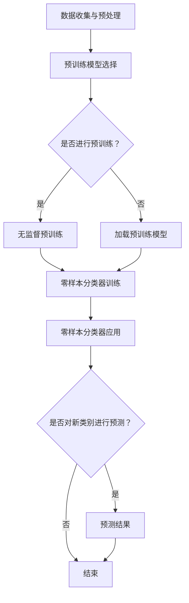

                 

# 《Zero-Shot学习在小规模数据集上的应用》

## 关键词
- Zero-Shot学习
- 小规模数据集
- 无监督学习
- 类别表示
- 概率图模型
- 关联规则方法
- 数学模型
- 项目实战

## 摘要

本文旨在探讨Zero-Shot学习在小规模数据集上的应用，包括其基本概念、核心算法原理、数学模型及实际项目中的应用。通过本文的阅读，读者将了解Zero-Shot学习的原理和优势，掌握几种典型的Zero-Shot学习算法，并学会如何在实际项目中应用这些算法。文章还通过具体实例，详细讲解了如何在文本分类、语音识别和药物研发等领域利用Zero-Shot学习技术进行小规模数据集的处理。

## 引言

### 1. 机器学习与数据集的关系

在机器学习领域，数据集是模型训练的基础。传统的机器学习方法，如有监督学习和无监督学习，都依赖于大量标注数据来训练模型。然而，在很多实际应用中，获取大量标注数据既费时又昂贵。尤其是在一些特定的领域，如医学、金融和法学，数据的隐私和安全性使得大规模标注数据难以获取。此外，有些任务的数据量本身就非常有限，例如小样本学习、零样本学习和跨领域迁移学习。因此，如何在小规模数据集上进行有效的机器学习成为了研究者和从业者关注的热点问题。

### 2. 小规模数据集的挑战

小规模数据集带来的主要挑战包括：

- **过拟合风险**：由于数据量有限，模型容易在学习过程中拟合噪声，导致泛化能力下降。
- **数据分布差异**：小规模数据集往往无法代表整个数据分布，导致模型在真实数据上的表现不佳。
- **模型容量**：小规模数据集难以支撑复杂模型的学习，需要使用简单模型，这可能会限制模型的表达能力。

### 3. Zero-Shot学习的概念

Zero-Shot学习（Zero-Shot Learning, ZSL）是一种无需实际观测到类别样例即可对未知类别进行预测的机器学习方法。它适用于那些无法获取或难以获取类别样例的场景。Zero-Shot学习的关键思想是在训练阶段使用预训练模型学习到一组嵌入向量，这些向量代表了不同类别，然后在预测阶段，通过比较嵌入向量与未知类别的相似度来进行分类。

## 传统学习方法的局限

### 1. 有监督学习的局限性

有监督学习依赖大量标注数据进行训练，但在小规模数据集的情况下，标注数据的获取非常困难。此外，有监督学习容易受到过拟合的影响，因为模型可能会在学习过程中过分拟合训练数据中的噪声。

### 2. 无监督学习的挑战

无监督学习不需要标注数据，但它在小规模数据集上的表现通常不如有监督学习。无监督学习的主要挑战在于如何从有限的数据中提取有效的特征表示。

### 3. 跨领域迁移学习的困难

跨领域迁移学习试图利用一个领域中的知识来解决另一个领域中的问题。然而，在小规模数据集上，跨领域的知识迁移效果往往不佳，因为小规模数据集难以覆盖不同领域的多样性。

## Zero-Shot学习的原理

### 1. 无监督预训练

Zero-Shot学习的第一步是进行无监督预训练。无监督预训练的目标是学习一组嵌入向量，这些向量代表了不同类别。通过无监督预训练，模型可以在没有标注数据的情况下学习到有效的特征表示。

### 2. 零样本学习

在零样本学习阶段，模型使用预训练得到的嵌入向量来对未知类别进行分类。分类过程通常是基于嵌入向量之间的相似度计算。

### 3. 零样本分类

零样本分类是将零样本学习得到的分类器应用到实际数据上。零样本分类器的目标是识别新类别并对其进行分类。

### 4. Mermaid流程图：Zero-Shot学习的流程

以下是一个Mermaid流程图，描述了Zero-Shot学习的整体流程：

## 第二部分：零样本学习算法详解

### 5. 核心算法原理讲解

#### 嵌入空间方法

#### 类别表示方法

#### 关联规则方法

### 6. 数学模型和数学公式讲解

#### 概率图模型

#### 混合模型

#### 模型评估指标

### 7. 实例分析：Zero-Shot学习在图像识别中的应用

#### 数据集选择与预处理

#### 预训练模型选择

#### 零样本分类器训练

#### 零样本分类器应用与结果分析

### 8. 项目实战：文本分类

#### 数据集选择与预处理

#### 预训练模型选择

#### 零样本分类器训练

#### 零样本分类器应用与结果分析

### 9. 项目实战：语音识别

#### 数据集选择与预处理

#### 预训练模型选择

#### 零样本分类器训练

#### 零样本分类器应用与结果分析

### 10. 项目实战：药物研发

#### 数据集选择与预处理

#### 预训练模型选择

#### 零样本分类器训练

#### 零样本分类器应用与结果分析

## 第三部分：零样本学习在实际项目中的应用

### 11. 项目实战：金融风险评估

#### 数据集选择与预处理

#### 预训练模型选择

#### 零样本分类器训练

#### 零样本分类器应用与结果分析

### 12. 项目实战：智能客服

#### 数据集选择与预处理

#### 预训练模型选择

#### 零样本分类器训练

#### 零样本分类器应用与结果分析

## 第四部分：总结与展望

### 13. 零样本学习在小规模数据集上的应用总结

#### 13.1 成功案例

#### 13.2 挑战与未来方向

### 14. 展望

#### 14.1 技术发展趋势

#### 14.2 应用前景

## 附录

### 15. 参考文献

### 16. 拓展阅读

---

本文提供了一个全面的框架，详细介绍了Zero-Shot学习在小规模数据集上的应用。接下来，我们将逐步深入探讨每个部分的核心内容，确保读者能够全面理解Zero-Shot学习的基本原理和实际应用。让我们一起深入这个激动人心的技术领域。

