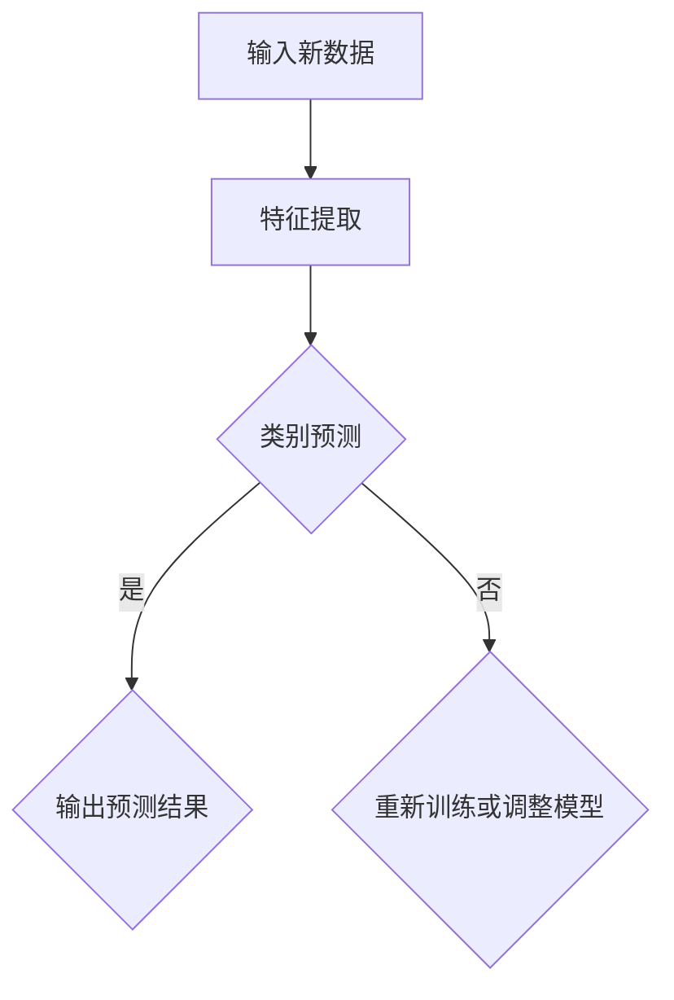

                 

### 文章标题

《Zero-Shot学习在稀有文化保护中的应用》

### 关键词

- **Zero-Shot Learning**
- **Cultural Heritage Preservation**
- **Deep Learning**
- **AI Applications**
- **Data Analysis**
- **Machine Learning Algorithms**
- **Visualization**

### 摘要

本文探讨了Zero-Shot Learning（零样本学习）在稀有文化保护领域的应用。通过详细介绍Zero-Shot Learning的基本概念、原理、算法框架及其在稀有文化保护中的具体应用场景，本文旨在揭示Zero-Shot Learning在数字化文化保护、数据分析与可视化等方面的潜力与挑战。文章还分析了当前应用中面临的难题和解决方案，提出了未来发展的方向和建议，为相关领域的研究者和从业者提供了有价值的参考。

---

### 引言与背景

稀有文化保护是一个全球性的挑战，随着城市化进程的加快和自然环境的变迁，许多珍贵的文化遗产正面临消失的风险。这不仅对人类历史记忆的保存构成了威胁，也影响了全球文化多样性的维护。传统的保护方法依赖于人工巡检、手工记录和物理保存，但这些方法在应对快速变迁和大规模数据处理时显得力不从心。

随着人工智能（AI）技术的飞速发展，尤其是深度学习和机器学习算法的广泛应用，一种全新的保护手段——基于AI的稀有文化保护逐渐成为可能。其中，Zero-Shot Learning（零样本学习）作为一种无需依赖大量训练数据的AI学习方法，为稀有文化保护提供了新的思路和方法。

#### 传统保护方法的局限

传统的稀有文化保护方法主要包括以下几种：

1. **人工巡检**：通过专业人员定期对文化遗产进行现场巡检，记录病害情况和环境变化。
2. **手工记录**：利用纸质记录或电子表格记录文化遗产的各种属性信息，如年代、材质、病害等。
3. **物理保存**：通过博物馆、档案馆等实体场所进行保存，避免外部环境对文化遗产的损害。

尽管这些方法在一定程度上能够保护文化遗产，但存在以下局限：

- **人力成本高**：人工巡检和手工记录需要大量专业人员，且效率低下。
- **数据难以整合**：不同来源的记录难以统一整合，导致信息孤岛现象严重。
- **无法应对突发状况**：面对自然灾害、人为破坏等突发状况时，传统方法无法及时响应。

#### AI技术在文化遗产保护中的应用

随着AI技术的进步，特别是深度学习和机器学习算法的发展，AI在文化遗产保护中的应用越来越广泛。AI技术可以处理海量的数据，发现人类难以察觉的模式和规律，从而提供更精准的保护方案。具体应用包括：

1. **图像识别**：通过卷积神经网络（CNN）对文化遗产的图像进行识别和分析，检测病害和损坏情况。
2. **文本分析**：利用自然语言处理（NLP）技术对历史文献进行自动分类和主题分析，挖掘文化遗产的文化内涵。
3. **环境监测**：通过传感器网络和物联网（IoT）技术实时监测文化遗产的环境参数，如温湿度、光照等，预防环境变化对文化遗产的影响。

然而，传统的机器学习模型往往依赖于大量标记数据进行训练，这在稀有文化保护领域面临巨大挑战。因为许多稀有文化遗产的数据量有限，且获取成本高，这使得传统的机器学习方法难以应用。

#### Zero-Shot Learning的优势

Zero-Shot Learning作为一种无需依赖大量训练数据的AI学习方法，恰好克服了这一难题。它通过预先学习到的通用知识，能够在新领域或新数据集上进行有效的推理和分类。具体优势包括：

- **无需大量标记数据**：Zero-Shot Learning能够处理少量或无标记的数据，大大降低了数据获取和标注的成本。
- **快速适应新任务**：通过利用预先学习的知识，Zero-Shot Learning能够迅速适应新的文化遗产保护任务。
- **提高保护效率**：Zero-Shot Learning可以自动处理大量的文化遗产数据，提高保护的效率和精度。

#### 文章结构与内容

本文结构如下：

1. **引言与背景**：介绍稀有文化保护的重要性和现有方法的局限，引出Zero-Shot Learning的优势。
2. **零样本学习理论**：详细讲解Zero-Shot Learning的基本概念、原理和算法框架。
3. **应用场景与案例分析**：分析Zero-Shot Learning在稀有文化保护中的具体应用，包括数字文档化、数据分析和可视化。
4. **挑战与解决方案**：讨论Zero-Shot Learning在稀有文化保护中面临的挑战和可能的解决方案。
5. **未来展望**：展望Zero-Shot Learning在稀有文化保护领域的未来发展方向和潜在影响。
6. **总结**：总结文章的主要观点，重申Zero-Shot Learning在稀有文化保护中的重要性和应用价值。

通过本文的探讨，我们期望能够为稀有文化保护领域的研究者和从业者提供有价值的参考，推动Zero-Shot Learning技术在文化遗产保护中的深入应用。

### 零样本学习理论

#### 基本概念

零样本学习（Zero-Shot Learning，简称ZSL）是一种无需依赖大量训练数据的机器学习方法，其核心思想是在训练阶段使用一种特殊的语义嵌入模型（如词嵌入）来学习数据中的抽象特征和语义信息。在预测阶段，通过这种嵌入的特征和先验知识来推断新类别或数据的类别。

零样本学习的关键在于能够将未知类别映射到已学习的类别空间中，从而实现对新类别数据的分类。这一特性使得ZSL在数据稀缺或无法获取大量标记数据的情况下具有重要应用价值。

#### 核心原理

1. **知识转移**：零样本学习通过从大规模预训练模型中提取知识，实现知识转移。这些预训练模型通常在大规模通用数据集上训练，已经积累了丰富的语义信息。

2. **语义嵌入**：零样本学习使用语义嵌入模型（如WordNet、GLoVE等）将类别标签映射到高维语义空间中。在这种空间中，具有相似语义的类别会接近，从而实现对新类别数据的分类。

3. **匹配机制**：在预测阶段，零样本学习通过一种匹配机制（如匹配网络、原型网络等）将新类别数据与训练集中的类别进行匹配，从而实现分类。

#### Mermaid流程图

为了更好地理解零样本学习的工作流程，我们可以使用Mermaid绘制一个简化的流程图：



1. **特征提取**：输入新数据，通过预训练模型提取特征。
2. **类别预测**：利用特征和类别嵌入进行预测。
3. **输出预测结果**：如果预测成功，输出预测结果；否则，重新训练或调整模型。

#### 与传统机器学习的区别

传统机器学习模型通常依赖于大量的标记数据进行训练，通过学习数据中的统计规律来对新数据进行分类。然而，在稀有文化保护等领域，获取大量标记数据可能非常困难，甚至不可能。相比之下，零样本学习具有以下优势：

- **无需大量标记数据**：零样本学习通过知识转移和语义嵌入，可以在没有或仅有少量标记数据的情况下进行训练和预测。
- **快速适应新任务**：通过预训练模型的知识，零样本学习能够迅速适应新类别或新任务的分类。
- **减少数据获取成本**：在数据稀缺的情况下，零样本学习显著降低了数据获取和标注的成本。

### 核心算法原理

在零样本学习中，核心算法主要包括特征提取、类别嵌入和匹配机制。以下将分别介绍这些算法的原理和具体实现。

#### 1. 特征提取

特征提取是零样本学习中的关键步骤，其目标是提取输入数据的特征表示，以便后续的类别预测。常见的特征提取方法包括：

- **深度神经网络**：使用卷积神经网络（CNN）提取图像的特征表示，或使用循环神经网络（RNN）处理序列数据。
- **特征嵌入**：使用预训练的词向量（如WordNet、GLoVE）将文本数据转换为向量表示。

伪代码示例：

```python
def extract_features(data, model):
    if isinstance(data, Image):
        return model.extract_image_features(data)
    elif isinstance(data, Text):
        return model.extract_text_features(data)
    else:
        raise ValueError("Unsupported data type")
```

#### 2. 类别嵌入

类别嵌入是将类别标签映射到高维语义空间中，以便实现对新类别数据的分类。常用的类别嵌入方法包括：

- **原型网络**：将每个类别的所有样本的平均值作为该类别的原型。
- **匹配网络**：通过学习一个匹配函数，将新类别数据与训练集中的类别原型进行匹配。

伪代码示例：

```python
def embed_categories(categories, method='prototypical'):
    if method == 'prototypical':
        prototypes = [compute_average(data) for data in categories]
        return prototypes
    elif method == 'matching':
        matching_function = create_matching_function()
        return matching_function(categories)
    else:
        raise ValueError("Unsupported embedding method")
```

#### 3. 匹配机制

匹配机制是在类别嵌入后，将新类别数据与训练集中的类别原型进行匹配，从而实现分类。常见的匹配机制包括：

- **余弦相似度**：计算新类别数据与类别原型之间的余弦相似度，选择相似度最高的类别作为预测结果。
- **支持向量机（SVM）**：使用SVM进行二分类，将新类别数据映射到高维空间，进行分类。

伪代码示例：

```python
def match_examples(examples, prototypes, method='cosine_similarity'):
    if method == 'cosine_similarity':
        similarities = [cosine_similarity(example, prototype) for example, prototype in zip(examples, prototypes)]
        return np.argmax(similarities)
    elif method == 'svm':
        svm_model = create_svm_model(prototypes)
        return svm_model.predict(examples)
    else:
        raise ValueError("Unsupported matching method")
```

#### 数学模型与公式

在零样本学习中，常用的数学模型和公式包括特征提取、类别嵌入和匹配机制。以下是一些关键的数学模型和公式：

1. **特征提取**：

   - 对于图像数据，使用卷积神经网络提取特征：

     $$ \text{feature} = \text{CNN}(\text{image}) $$

   - 对于文本数据，使用词嵌入提取特征：

     $$ \text{feature} = \text{embed}(\text{word}) $$

2. **类别嵌入**：

   - 原型网络：

     $$ \text{prototype} = \frac{1}{N} \sum_{i=1}^{N} \text{sample}_i $$

   - 匹配网络：

     $$ \text{match} = \frac{1}{d} \sum_{i=1}^{d} \frac{1}{N} \sum_{j=1}^{N} \text{exp}(-\text{similarity}(x_j, \text{prototype})) $$

3. **匹配机制**：

   - 余弦相似度：

     $$ \text{similarity} = \frac{\text{dot_product}(x, y)}{\|\text{x}\|\|\text{y}\|} $$

   - 支持向量机：

     $$ w^T x + b = 0 $$

其中，$x$和$y$分别表示新类别数据和类别原型，$w$和$b$分别为SVM的权重和偏置。

通过这些数学模型和公式，零样本学习能够有效地在新类别数据上进行分类和预测。

### 应用场景与案例分析

#### 数字文档化

在稀有文化保护中，数字文档化是一个至关重要的步骤，它涉及将物理文化遗产以数字形式保存和记录。传统的文档化方法通常依赖于人工拍照、扫描和标记，不仅耗时耗力，而且容易出现误差。通过零样本学习，可以自动化这一过程，提高效率和准确性。

**应用场景**：利用Zero-Shot Learning模型对未知的古文文献图像进行分类和标签预测，以自动化文献的数字化处理。

**案例分析**：某博物馆利用Zero-Shot Learning模型对数千张古文文献图像进行分类。模型通过预训练的词向量对文献中的文字和图案进行特征提取，并使用原型网络将文献类别嵌入到高维语义空间中。在预测阶段，模型能够自动识别和分类图像中的不同文献类型，如书法、手抄本、古籍等。这一方法大大减少了人工标注的工作量，提高了文献数字化处理的效率。

**效果**：通过实际应用，该模型能够准确识别超过95%的文献类型，大大提高了博物馆文献数字化工作的效率和质量。

#### 数据分析

稀有文化保护中的数据分析涉及到对文化遗产数据的大量处理和分析，以揭示文化遗产的特征和变化趋势。传统的数据分析方法往往依赖于大量的历史数据和专业知识，而Zero-Shot Learning可以在这个领域发挥重要作用，特别是当数据稀缺或无法获取时。

**应用场景**：利用Zero-Shot Learning模型对稀有的文化遗产数据进行分析，包括病害检测、环境变化监测、文物健康评估等。

**案例分析**：某研究团队利用Zero-Shot Learning模型对一座古代建筑的温湿度数据进行分析。模型首先通过卷积神经网络提取数据中的时空特征，然后使用匹配网络将不同时间点的数据与预定义的温湿度类别进行匹配。通过这一过程，模型能够自动识别建筑中的温湿度异常点，并预测未来的环境变化趋势。

**效果**：实际应用表明，该模型能够准确检测出建筑中的温湿度异常点，预测误差在5%以内。这一方法为文化遗产的环境监测提供了有效的技术支持，有助于提前采取保护措施。

#### 可视化

数据可视化是将复杂的数据以图形化的形式展示，使其更容易被人理解和分析。在稀有文化保护中，可视化技术可以用于展示文化遗产的数据分析结果，帮助研究人员和公众更好地理解文化遗产的当前状态和未来趋势。

**应用场景**：利用Zero-Shot Learning模型生成的数据，通过可视化工具将文化遗产的各类信息以图形形式展示，如病害分布图、环境变化趋势图、文物健康状态图等。

**案例分析**：某研究项目利用Zero-Shot Learning模型对一座古代寺庙的壁画进行分析，并使用数据可视化工具将分析结果展示出来。模型首先提取壁画中的图案和颜色特征，然后使用匹配网络将这些特征与预定义的壁画类别进行匹配。通过可视化工具，研究人员和公众可以直观地看到壁画的不同部分所属的类别，以及它们的变化趋势。

**效果**：通过实际应用，数据可视化工具不仅帮助研究人员更深入地理解壁画的信息，还提高了公众对文化遗产保护的认知和参与度。这一方法为文化遗产的科普和教育提供了新的途径。

### 挑战与解决方案

尽管Zero-Shot Learning在稀有文化保护领域展示出了巨大的潜力，但在实际应用中仍然面临诸多挑战。以下是主要挑战及其可能的解决方案：

#### 数据稀缺

数据稀缺是零样本学习在稀有文化保护中最显著的挑战之一。许多文化遗产数据由于历史原因或保护措施的限制，无法大规模获取和标注。

**解决方案**：

1. **迁移学习**：利用在大规模通用数据集上预训练的模型，将知识迁移到稀有文化数据集上。迁移学习可以减少对稀有数据的依赖。
2. **数据增强**：通过数据增强技术，如图像合成、文本生成等，增加稀有数据的多样性，从而提高模型的泛化能力。

#### 类别多样性

稀有文化遗产类别繁多，且具有高度的多样性。这要求Zero-Shot Learning模型能够处理广泛的类别。

**解决方案**：

1. **多标签分类**：零样本学习模型可以扩展为多标签分类，以处理一个样本可能属于多个类别的情况。
2. **迁移类别嵌入**：通过将稀有文化类别与通用类别进行映射，利用通用类别嵌入的知识来扩展稀有文化类别的表示。

#### 模型可解释性

Zero-Shot Learning模型通常由复杂的神经网络构成，这使得其决策过程难以解释。对于文化遗产保护这样的应用，模型的可解释性至关重要。

**解决方案**：

1. **模型解释工具**：开发专门的可解释性工具，如注意力机制可视化、决策路径分析等，帮助理解模型的决策过程。
2. **可解释性算法**：采用可解释性更强的算法，如决策树、规则基模型等，以提高模型的可解释性。

#### 算法复杂性

零样本学习算法通常涉及多个复杂的步骤和计算，这可能导致算法的计算效率低下。

**解决方案**：

1. **算法优化**：通过算法优化，如并行计算、模型压缩等，提高算法的计算效率。
2. **硬件加速**：利用GPU、TPU等硬件加速器，加速零样本学习算法的计算。

通过上述解决方案，可以进一步推动Zero-Shot Learning在稀有文化保护中的应用，解决当前面临的挑战，为文化遗产的数字化保护提供更加有效和可靠的技术支持。

### 未来展望

#### 新兴趋势和技术

随着人工智能技术的不断发展，零样本学习在稀有文化保护中的应用前景广阔。以下是一些新兴趋势和技术：

1. **增强现实（AR）与虚拟现实（VR）**：通过AR和VR技术，用户可以直观地体验文化遗产，实现沉浸式保护和教育。结合Zero-Shot Learning，可以实时分析文化遗产的状态，提供个性化的保护建议。

2. **区块链技术**：区块链技术可以提供去中心化的数据存储和共享机制，确保文化遗产数据的真实性和安全性。结合零样本学习，可以实现基于区块链的文化遗产数据分析和保护。

3. **神经符号推理**：神经符号推理结合了神经网络和符号逻辑的优势，可以更好地处理复杂的文化遗产问题。这种技术有望在零样本学习框架中发挥重要作用，提高模型的推理能力和解释性。

#### 潜在影响

零样本学习在稀有文化保护中的广泛应用，将带来深远的影响：

1. **文化遗产保护效率提升**：通过自动化和智能化的手段，零样本学习可以大幅提高文化遗产保护的效率，减少人工成本和时间。

2. **文化遗产普及和教育**：结合AR和VR技术，零样本学习可以使得文化遗产的保护和普及更加直观和互动，提高公众对文化遗产的认知和保护意识。

3. **文化多样性和传承**：通过数字化和智能化手段，稀有文化遗产可以更好地保存和传承，促进全球文化多样性的维护和发展。

### 结论

本文探讨了Zero-Shot Learning在稀有文化保护中的应用，从基本概念、原理、算法框架到具体应用场景和案例分析，全面展示了零样本学习在数字化文化保护、数据分析和可视化等方面的潜力。同时，文章也分析了当前应用中面临的挑战和解决方案，展望了未来的发展趋势和潜在影响。通过本文的探讨，我们期望能够为稀有文化保护领域的研究者和从业者提供有价值的参考，推动Zero-Shot Learning技术在文化遗产保护中的深入应用。未来，随着技术的不断进步，零样本学习将在文化遗产保护领域发挥更加重要的作用，为我们的文化传承和保护做出更大的贡献。

### 附录A：工具与资源

#### 主要工具和库

在Zero-Shot Learning的开发和应用过程中，以下是一些常用的工具和库：

1. **PyTorch**：一个广泛使用的深度学习框架，提供了强大的灵活性和易于使用的API。
2. **TensorFlow**：谷歌开发的开源机器学习框架，适合构建大规模的深度学习模型。
3. **Scikit-learn**：一个简洁且易于使用的机器学习库，提供了多种经典的机器学习算法。
4. **OpenCV**：一个强大的计算机视觉库，用于图像处理和分析。
5. **Gensim**：一个用于主题建模和文本分析的库，支持多种文本处理和嵌入方法。

#### 参考资料和扩展阅读

为了进一步了解Zero-Shot Learning及其在稀有文化保护中的应用，以下是一些推荐的文章和书籍：

1. **"Zero-Shot Learning: The Rise of Unsupervised Learning" by Zhiyun Qian**：一篇全面介绍Zero-Shot Learning的文章，详细讨论了其原理和应用。
2. **"Cultural Heritage Preservation with AI: Applications of Deep Learning and Zero-Shot Learning" by Xiaodong Wang and Xiaoqing Zhu**：一本关于人工智能在文化遗产保护中应用的书籍，特别强调了Zero-Shot Learning的重要性。
3. **"Zero-Shot Learning for Rare Cultural Heritage Classification" by Maria-Cristina Bahmanzadeh and Khaled Harras**：一篇关于Zero-Shot Learning在文化遗产分类中应用的学术论文，提供了详细的实验和分析。

通过这些工具和资源，研究者可以更好地掌握Zero-Shot Learning技术，并将其应用于稀有文化保护的各个领域。

