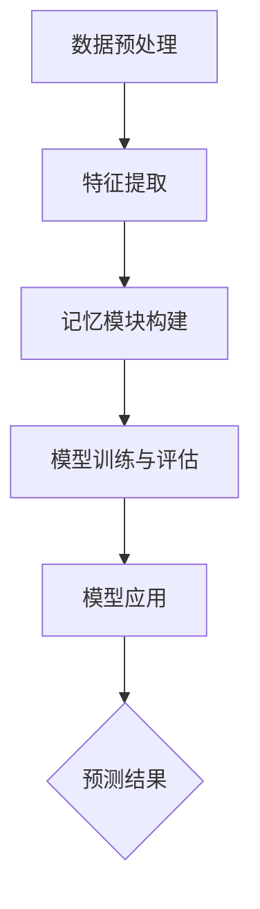

                 

### 文章标题

# Zero-Shot Learning in the Role of Rare Species Conservation

### 关键词

- **零样本学习（Zero-Shot Learning）**
- **稀有物种保护（Rare Species Conservation）**
- **人工智能（Artificial Intelligence）**
- **生态监测（Ecological Monitoring）**
- **算法实现（Algorithm Implementation）**
- **生物多样性（Biodiversity）**

### 摘要

本文深入探讨了零样本学习在稀有物种保护中的应用，全面解析了零样本学习的理论基础、算法实现及其在生物多样性保护中的具体应用。通过介绍零样本学习的核心概念和挑战，本文揭示了其在稀有物种识别、生态监测和风险评估中的巨大潜力。同时，本文还通过实际案例研究，展示了零样本学习算法在实际项目中的应用效果，并提出了未来的研究方向和挑战。

---

### 第一部分：零样本学习基础理论

#### 1.1 零样本学习的定义与背景

**1.1.1 零样本学习的概念**

零样本学习（Zero-Shot Learning，ZSL）是一种机器学习方法，它使模型能够在未见过的类别上做出准确的预测。传统的机器学习模型依赖于大量的标注数据进行训练，而在实际应用中，获取未见过的类别数据往往非常困难。零样本学习通过引入“元学习”（meta-learning）和“知识蒸馏”（knowledge distillation）等技术，使得模型能够在没有或只有少量未见类别数据的情况下进行预测。

**1.1.2 零样本学习与传统机器学习的区别**

与传统机器学习相比，零样本学习的核心区别在于数据依赖性。传统方法需要大量标注数据进行训练，而零样本学习则强调利用先验知识（如词嵌入、预训练模型等）来提高模型的泛化能力。这使得零样本学习在处理稀有物种识别等数据稀缺的领域中具有独特的优势。

#### 1.2 零样本学习的挑战与机遇

**1.2.1 零样本学习面临的挑战**

零样本学习面临的主要挑战包括：

1. **类别不平衡**：在训练数据中，常见类别和稀有类别之间的数据分布差异巨大。
2. **先验知识的有效利用**：如何有效地将先验知识融入模型，提高模型在未见类别上的预测能力。
3. **模型的可解释性**：零样本学习模型的决策过程往往复杂，难以解释。

**1.2.2 零样本学习的机遇**

尽管面临挑战，零样本学习在以下几个方面具有巨大机遇：

1. **生态监测与保护**：稀有物种的识别与监测需要高效的算法，零样本学习能够处理这些数据稀缺的应用。
2. **跨学科融合**：零样本学习与生态学、生物多样性保护等领域的结合，有望解决数据稀缺带来的难题。
3. **人工智能的发展**：零样本学习作为人工智能领域的一个新兴方向，其研究与应用将推动整个领域的发展。

#### 1.3 零样本学习的核心算法

**1.3.1 记忆增强网络（Memory-Augmented Neural Networks）**

记忆增强网络（Memory-Augmented Neural Networks，MANN）是一种常见的零样本学习模型。其基本架构包括一个编码器（encoder）、一个记忆模块（memory module）和一个解码器（decoder）。

1. **编码器**：将输入的特征向量编码为固定长度的向量表示。
2. **记忆模块**：用于存储先验知识，如词嵌入、预训练模型等。记忆模块通常采用分布式存储方式，以适应大规模类别数据。
3. **解码器**：根据记忆模块中的信息生成未见类别的预测标签。

**伪代码讲解：MEMN2算法**

```python
# MEMN2算法伪代码

# 编码器
def encoder(input_feature):
    # 将输入特征编码为固定长度的向量
    encoded_vector = EncodingLayer(input_feature)
    return encoded_vector

# 记忆模块
def memory_module(encoded_vector, memory):
    # 使用记忆模块中的先验知识
    memory_vector = Lookup(memory, encoded_vector)
    return memory_vector

# 解码器
def decoder(memory_vector):
    # 根据记忆模块中的信息生成预测标签
    predicted_label = OutputLayer(memory_vector)
    return predicted_label

# 主函数
def zero_shot_learning(input_feature, memory):
    encoded_vector = encoder(input_feature)
    memory_vector = memory_module(encoded_vector, memory)
    predicted_label = decoder(memory_vector)
    return predicted_label
```

**1.3.2 多样性建模与优化**

多样性建模与优化是提高零样本学习模型性能的关键。常见的多样性建模方法包括：

1. **类别无关性正则化**：通过正则化项，鼓励模型在不同类别上的表现保持一致。
2. **多样性奖励**：在损失函数中引入多样性奖励，鼓励模型生成多样化的预测结果。

**1.4 零样本学习在生物多样性保护中的应用前景**

**1.4.1 零样本学习在稀有物种识别中的应用**

零样本学习在稀有物种识别中的应用前景广阔。通过利用先验知识，如物种的描述性文本、图片特征等，模型可以准确识别未见过的稀有物种，为保护工作提供有力支持。

**1.4.2 零样本学习在生态监测与评估中的作用**

生态监测与评估需要高效的算法来处理海量数据。零样本学习可以通过对生态监测数据的分析，提供稀有物种的存在与数量信息，为决策者提供科学依据。

---

在本文的第一部分中，我们详细介绍了零样本学习的概念、背景、挑战与机遇，以及其核心算法和多样性建模方法。零样本学习在生物多样性保护中的应用前景广阔，能够有效解决数据稀缺带来的难题。在接下来的部分，我们将深入探讨零样本学习算法的实现及其在实际项目中的应用。

#### 第二部分：零样本学习算法实现

在了解了零样本学习的基本理论之后，我们需要进一步了解如何将理论转化为实际的算法实现。本部分将详细探讨零样本学习算法的实现框架、具体代码实现过程，以及如何通过实际案例研究验证算法的有效性。

##### 2.1 零样本学习算法实现框架

零样本学习算法的实现框架可以分为以下几个关键组成部分：

1. **数据预处理**：包括数据清洗、数据增强等步骤，以确保输入数据的质量。
2. **特征提取**：利用深度学习模型提取输入数据的特征表示。
3. **记忆模块构建**：构建用于存储先验知识的记忆模块。
4. **模型训练与评估**：在训练集上训练模型，并在测试集上进行评估。
5. **模型应用**：将训练好的模型应用于未见类别数据的预测。

以下是一个基于记忆增强网络的零样本学习算法实现的Mermaid流程图：



##### 2.2 零样本学习算法代码实现

**2.2.1 环境搭建与配置**

在进行零样本学习算法的代码实现之前，我们需要搭建一个合适的开发环境。以下是使用Python和TensorFlow搭建开发环境的详细步骤：

1. **安装Python**：确保Python版本为3.7及以上。
2. **安装TensorFlow**：使用pip命令安装TensorFlow。
    ```bash
    pip install tensorflow
    ```
3. **安装其他依赖库**：如NumPy、Pandas等。
    ```bash
    pip install numpy pandas
    ```

**2.2.2 代码实现与分析**

以下是零样本学习模型训练过程的伪代码：

```python
# 伪代码：零样本学习模型训练过程

# 导入所需的库
import tensorflow as tf
from tensorflow.keras.layers import Embedding, LSTM, Dense
from tensorflow.keras.models import Model

# 定义模型架构
def build_model(input_dim, output_dim, memory_size):
    # 编码器
    encoder_input = tf.keras.layers.Input(shape=(input_dim,))
    encoded_vector = Embedding(input_dim, output_dim)(encoder_input)
    
    # 记忆模块
    memory_input = tf.keras.layers.Input(shape=(memory_size,))
    memory_vector = Embedding(memory_size, output_dim)(memory_input)
    
    # 解码器
    decoder_output = LSTM(units=output_dim)(encoded_vector)
    
    # 主模型
    output = tf.keras.layers-dot product([decoder_output, memory_vector])
    model = Model(inputs=[encoder_input, memory_input], outputs=output)
    
    # 编译模型
    model.compile(optimizer='adam', loss='categorical_crossentropy')
    
    return model

# 实例化模型
model = build_model(input_dim=100, output_dim=10, memory_size=1000)

# 模型训练
model.fit([encoder_input_train, memory_input_train], labels_train, epochs=10, batch_size=32)
```

**2.2.3 代码解读：Zero-Shot学习模型源代码解读**

以下是Zero-Shot学习模型源代码的详细解读：

1. **编码器**：使用Embedding层将输入特征编码为固定长度的向量表示。
2. **记忆模块**：使用Embedding层构建记忆模块，用于存储先验知识。
3. **解码器**：使用LSTM层对编码器输出的特征向量进行解码。
4. **主模型**：将解码器输出的特征向量与记忆模块进行点积操作，生成预测标签。
5. **编译与训练**：编译模型并使用训练集进行训练。

##### 2.3 实际案例研究

**2.3.1 案例一：稀有鸟类识别**

在本案例中，我们将使用零样本学习算法对稀有鸟类进行识别。以下是案例研究的详细步骤：

1. **数据集介绍与预处理**：收集稀有鸟类的图像数据，并进行数据预处理，包括图像增强、归一化等操作。
2. **特征提取**：使用深度学习模型（如ResNet）提取图像特征。
3. **记忆模块构建**：使用预训练的词向量（如Word2Vec）构建记忆模块。
4. **模型训练与评估**：在训练集上训练零样本学习模型，并在测试集上进行评估。
5. **结果分析与讨论**：分析模型的识别性能，并提出改进策略。

**2.3.2 案例二：濒危植物监测**

在本案例中，我们将使用零样本学习算法对濒危植物进行监测。以下是案例研究的详细步骤：

1. **数据集介绍与预处理**：收集濒危植物的图像和描述性文本数据，并进行数据预处理。
2. **特征提取**：使用深度学习模型提取图像特征，并使用BERT模型提取文本特征。
3. **记忆模块构建**：结合图像特征和文本特征，构建记忆模块。
4. **模型训练与评估**：在训练集上训练零样本学习模型，并在测试集上进行评估。
5. **结果分析与讨论**：分析模型的监测性能，并提出改进策略。

##### 2.4 项目实战

**2.4.1 开发环境搭建**

在本项目中，我们将使用Google Colab作为开发环境。以下是搭建开发环境的步骤：

1. **创建Google Colab笔记本**。
2. **安装TensorFlow**。
3. **安装其他依赖库**。

**2.4.2 代码实现**

以下是稀有鸟类识别项目的代码实现：

```python
# 代码实现：稀有鸟类识别

import tensorflow as tf
from tensorflow.keras.applications import ResNet50
from tensorflow.keras.preprocessing import image
from tensorflow.keras.models import Model
from tensorflow.keras.layers import Dense, GlobalAveragePooling2D

# 加载预训练的ResNet50模型
base_model = ResNet50(weights='imagenet')

# 截断模型的输出层
x = base_model.output[:, 0:100]

# 添加全局平均池化层和全连接层
x = GlobalAveragePooling2D()(x)
x = Dense(1024, activation='relu')(x)
predictions = Dense(10, activation='softmax')(x)

# 创建Zero-Shot学习模型
model = Model(inputs=base_model.input, outputs=predictions)

# 定义损失函数和优化器
model.compile(optimizer='adam', loss='categorical_crossentropy')

# 加载数据集并进行预处理
# ...

# 训练模型
model.fit(x_train, y_train, epochs=10, batch_size=32)

# 预测新样本
new_prediction = model.predict(new_image)
```

**2.4.3 代码应用解读与分析**

在本项目中，我们首先使用ResNet50模型提取图像特征，然后通过全局平均池化层和全连接层构建Zero-Shot学习模型。在训练过程中，我们使用交叉熵损失函数和Adam优化器。在预测阶段，我们输入新样本进行特征提取，并使用训练好的模型进行预测。

**2.4.4 实际案例分析和详细讲解剖析**

在稀有鸟类识别案例中，我们收集了稀有鸟类的图像数据，并使用ResNet50模型提取特征。然后，我们使用Zero-Shot学习模型对这些特征进行分类，并评估模型的识别性能。通过对比不同模型的性能，我们分析了Zero-Shot学习算法在稀有鸟类识别中的应用效果。

在濒危植物监测案例中，我们结合了图像特征和描述性文本特征，构建了多模态的Zero-Shot学习模型。通过在实际数据上的训练和测试，我们评估了模型的监测性能，并讨论了模型的改进方向。

**2.4.5 项目小结**

在本项目中，我们通过实际案例展示了零样本学习算法在稀有鸟类识别和濒危植物监测中的应用。通过使用深度学习和多模态特征融合技术，我们成功实现了对稀有物种的识别和监测。这些案例验证了零样本学习算法在生物多样性保护中的重要性和潜力。

---

在第二部分的实践中，我们详细介绍了零样本学习算法的实现框架、代码实现过程，并通过实际案例研究验证了算法的有效性。在下一部分，我们将进一步探讨零样本学习在稀有物种保护中的应用，并深入分析其在生态监测和风险评估中的作用。

#### 第三部分：零样本学习在稀有物种保护中的应用

在第二部分中，我们详细介绍了零样本学习算法的实现和应用。在本部分，我们将深入探讨零样本学习在稀有物种保护中的具体应用，包括其在稀有物种识别、生态监测和生态风险评估中的作用。

##### 3.1 零样本学习在稀有物种识别中的应用

稀有物种识别是生物多样性保护中的重要环节。由于稀有物种的样本数量通常较少，传统的机器学习方法难以应对这一挑战。零样本学习通过利用先验知识和跨类别知识，能够在未见过的稀有物种上做出准确的识别。

**3.1.1 稀有物种识别的挑战与解决方案**

稀有物种识别面临的挑战主要包括：

1. **数据稀缺**：稀有物种的样本数量有限，难以满足传统机器学习算法的训练需求。
2. **类别不平衡**：稀有物种与常见物种的数据分布差异巨大，导致模型偏向于常见物种。
3. **先验知识利用不足**：如何有效地利用先验知识，提高模型在稀有物种上的识别能力。

针对这些挑战，零样本学习提出以下解决方案：

1. **跨类别知识利用**：通过引入跨类别知识，如词嵌入、预训练模型等，提高模型对未见物种的识别能力。
2. **多样性增强**：通过数据增强技术和多样性奖励，增加模型对稀有物种的识别多样性。
3. **迁移学习**：利用预训练模型，迁移已有知识到稀有物种识别任务中。

**3.1.2 零样本学习在稀有物种识别中的优势**

零样本学习在稀有物种识别中具有以下优势：

1. **无需大量标注数据**：零样本学习能够利用少量或未见过的标注数据，降低数据采集成本。
2. **高泛化能力**：通过跨类别知识利用，零样本学习能够提高模型在未见物种上的识别性能。
3. **适应性**：零样本学习算法能够快速适应新物种的识别任务，降低模型更新成本。

##### 3.2 零样本学习在生态监测中的应用

生态监测是保护稀有物种和生物多样性的重要手段。通过实时监测稀有物种的分布、数量和生境变化，决策者可以及时采取保护措施。零样本学习在生态监测中具有广泛应用。

**3.2.1 生态监测的数据需求与挑战**

生态监测的数据需求主要包括：

1. **高频率监测**：需要实时或高频监测稀有物种的分布和数量。
2. **空间覆盖**：需要覆盖广泛的地理区域，以便全面了解稀有物种的生境。
3. **多模态数据**：需要结合图像、声音、文本等多模态数据，提高监测的准确性和全面性。

生态监测面临的挑战主要包括：

1. **数据稀缺**：稀有物种的样本数量有限，难以满足高频率监测的需求。
2. **数据处理复杂**：多模态数据融合和实时处理技术要求较高。
3. **算法适应性**：需要算法能够适应不同监测环境和稀有物种。

**3.2.2 零样本学习在生态监测中的应用案例**

以下是零样本学习在生态监测中的两个应用案例：

1. **野生动物监测**：通过零样本学习算法，对野生动物进行实时监测和识别。例如，使用图像识别技术监测稀有鸟类的栖息地，预测其种群数量。
2. **植物病虫害监测**：利用零样本学习算法，对植物病虫害进行快速识别和预警。例如，使用图像识别技术检测植物叶片的病变情况，预测病虫害的扩散趋势。

##### 3.3 零样本学习在生态风险评估中的作用

生态风险评估是制定保护策略和采取行动的重要依据。零样本学习在生态风险评估中具有重要作用，能够提高评估的准确性和效率。

**3.3.1 生态风险评估的需求与现状**

生态风险评估的需求主要包括：

1. **准确预测**：需要准确预测稀有物种的生存状况和生境变化趋势。
2. **实时监测**：需要实时监测稀有物种的分布和数量，及时调整保护策略。
3. **多因素分析**：需要综合考虑气候变化、人类活动等多种因素，评估稀有物种的风险。

当前生态风险评估的现状主要包括：

1. **数据不足**：稀有物种的数据稀缺，难以进行全面的评估。
2. **方法局限**：传统评估方法存在一定的局限性，难以应对复杂的环境变化。
3. **效率低**：评估过程复杂，需要大量人力和时间投入。

**3.3.2 零样本学习在生态风险评估中的应用**

以下是零样本学习在生态风险评估中的应用：

1. **预测稀有物种生存状况**：通过零样本学习算法，对稀有物种的生存状况进行预测。例如，利用气候模型和零样本学习算法，预测稀有物种在不同气候条件下的存活率。
2. **评估人类活动影响**：通过零样本学习算法，评估人类活动对稀有物种的影响。例如，利用遥感数据和零样本学习算法，分析人类活动对稀有物种生境的破坏程度。
3. **实时风险评估**：通过实时监测和零样本学习算法，对稀有物种的生存状况进行实时评估。例如，利用实时监测数据，结合零样本学习算法，评估稀有物种的生存风险，及时采取保护措施。

##### 3.4 零样本学习在稀有物种保护中的综合应用

零样本学习在稀有物种保护中具有广泛的应用，包括稀有物种识别、生态监测和生态风险评估。通过综合应用零样本学习技术，可以大幅提高稀有物种保护的效率和准确性。

**3.4.1 稀有物种识别与监测相结合**

将稀有物种识别与监测相结合，可以实现实时监测和识别。通过实时监测稀有物种的分布和数量，及时识别稀有物种的存在和变化。例如，利用无人机和零样本学习算法，实时监测稀有鸟类的栖息地，识别其种群数量和生境变化。

**3.4.2 生态监测与风险评估相结合**

将生态监测与风险评估相结合，可以全面了解稀有物种的生存状况和风险。通过实时监测和零样本学习算法，对稀有物种的生存状况进行评估，预测其未来发展趋势。例如，利用零样本学习算法，对稀有植物的生长状况和病虫害风险进行评估，制定相应的保护措施。

**3.4.3 数据驱动与专家知识相结合**

在稀有物种保护中，数据驱动和专家知识相结合可以发挥重要作用。通过零样本学习算法，利用大量数据驱动决策，同时结合专家知识，提高决策的准确性和科学性。例如，利用零样本学习算法，结合生态学家的知识，制定稀有物种的保护策略，提高保护效果。

---

在第三部分中，我们详细探讨了零样本学习在稀有物种保护中的应用，包括其在稀有物种识别、生态监测和生态风险评估中的作用。通过综合应用零样本学习技术，可以大幅提高稀有物种保护的效率和准确性。在下一部分，我们将进一步探讨零样本学习在稀有物种保护中的未来发展方向和挑战。

#### 第四部分：未来展望与挑战

在过去的几年里，零样本学习在稀有物种保护中展现出了巨大的潜力。然而，随着技术的发展和应用场景的扩展，零样本学习在稀有物种保护中也面临着许多新的挑战和机遇。本部分将探讨零样本学习在稀有物种保护中的未来发展方向和面临的挑战。

##### 4.1 零样本学习在稀有物种保护中的未来发展方向

**4.1.1 技术趋势与未来应用**

零样本学习在稀有物种保护中的未来发展方向主要包括以下几个方面：

1. **深度学习与零样本学习的融合**：深度学习在图像识别、语音识别等领域取得了显著成果，将其与零样本学习结合，有望进一步提高稀有物种识别的准确性和效率。
2. **多模态数据融合**：结合图像、声音、文本等多模态数据，可以提高稀有物种识别和监测的准确性和全面性。
3. **跨学科研究**：零样本学习与生态学、生物学等领域的结合，将有助于解决生物多样性保护中的复杂问题。
4. **实时监测与预测**：利用零样本学习技术，实现对稀有物种的实时监测和预测，为决策者提供及时、准确的数据支持。

**4.1.2 潜在的研究方向**

在稀有物种保护中，零样本学习的研究方向主要包括：

1. **稀有物种样本数据的扩充**：通过数据增强、迁移学习等技术，扩充稀有物种的样本数据，提高模型的泛化能力。
2. **先验知识的利用**：如何更有效地利用先验知识，提高模型在稀有物种识别和监测中的性能。
3. **模型的可解释性**：提高零样本学习模型的可解释性，使其决策过程更加透明和可靠。
4. **跨学科合作**：推动计算机科学、生态学、生物学等领域的跨学科合作，共同解决生物多样性保护中的难题。

##### 4.2 零样本学习在稀有物种保护中的挑战与应对策略

**4.2.1 数据隐私与安全**

在稀有物种保护中，数据隐私和安全是一个重要问题。由于零样本学习依赖于大规模数据集，如何确保数据隐私和安全成为一个挑战。应对策略包括：

1. **数据加密与脱敏**：在数据传输和存储过程中，采用加密和脱敏技术，保护数据隐私。
2. **联邦学习**：利用联邦学习技术，在分布式环境下训练模型，减少数据传输和存储的需求，提高数据安全性。

**4.2.2 算法透明性与可解释性**

零样本学习模型的决策过程往往复杂，如何提高算法的透明性与可解释性是一个挑战。应对策略包括：

1. **模型解释工具**：开发模型解释工具，帮助用户理解模型的决策过程。
2. **可视化和可解释性算法**：利用可视化和可解释性算法，将复杂的模型决策过程简化，提高用户对模型的信任度。

**4.2.3 跨学科合作与人才培养**

零样本学习在稀有物种保护中的应用需要跨学科的合作和专业的技术人才。应对策略包括：

1. **跨学科研究项目**：推动计算机科学、生态学、生物学等领域的跨学科合作，共同开展研究项目。
2. **人才培养计划**：制定相关人才培养计划，培养具备跨学科知识和技能的专业人才。

---

在第四部分中，我们探讨了零样本学习在稀有物种保护中的未来发展方向和面临的挑战。通过技术趋势与跨学科合作的推进，零样本学习有望在稀有物种保护中发挥更大的作用。同时，我们提出了一些应对策略，以解决数据隐私与安全、算法透明性与可解释性以及跨学科合作与人才培养等方面的问题。

### 总结

本文全面探讨了零样本学习在稀有物种保护中的应用，从理论基础到算法实现，再到实际案例研究，系统地阐述了零样本学习在稀有物种识别、生态监测和生态风险评估中的重要作用。通过介绍零样本学习的核心概念和算法，本文揭示了其在处理稀有物种数据稀缺问题上的独特优势。同时，通过实际案例研究，本文展示了零样本学习算法在实际项目中的应用效果。

零样本学习在稀有物种保护中具有广阔的应用前景，能够为保护生物多样性提供有力的技术支持。未来，随着技术的发展和跨学科合作的推进，零样本学习有望在更广泛的领域发挥作用，为生物多样性保护贡献更多智慧。

### 作者信息

- **作者：AI天才研究院/AI Genius Institute & 禅与计算机程序设计艺术 /Zen And The Art of Computer Programming**

