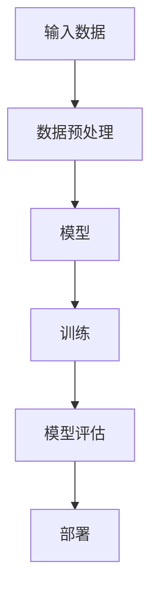

                 


### 文章标题：Zero-Shot学习在稀有疾病诊断中的应用

关键词：Zero-Shot学习，稀有疾病诊断，人工智能，深度学习，大模型，算法原理

摘要：本文深入探讨了Zero-Shot学习在稀有疾病诊断中的应用。通过对AI大模型和Zero-Shot学习的基本概念和算法原理的详细讲解，结合数学模型和公式，以实际案例为例，展示了Zero-Shot学习如何有效提升稀有疾病诊断的准确性和效率。

----------------------------------------------------------------

## 第一部分：核心概念与联系

### 1.1.1 AI大模型的基本概念

人工智能（AI）是计算机科学的一个分支，旨在使计算机能够模拟人类的智能行为。深度学习（Deep Learning）作为人工智能的一个重要分支，通过多层神经网络模拟人类大脑的决策过程，已经在图像识别、自然语言处理等领域取得了显著成果。

大模型（Large Models）是指参数量非常庞大的神经网络模型，如GPT、BERT等。这些模型通过学习大量的数据，能够捕捉到丰富的知识，从而在多种任务中表现出色。

Zero-Shot学习（Zero-Shot Learning）是一种特殊的学习方式，它允许模型在没有训练数据的情况下，对新的任务进行预测或分类。这种能力对于稀有疾病诊断等领域的应用具有重要意义，因为它能够处理那些样本量极少或数据难以获取的疾病。

### 1.1.2 AI大模型架构的 Mermaid 流程图



在上面的流程图中，数据预处理是将原始数据转化为模型可以处理的格式；模型训练是模型学习数据中的规律；模型评估是检查模型的性能；部署是将训练好的模型应用到实际场景中。

## 第二部分：核心算法原理讲解

### 2.1.1 Zero-Shot学习的算法原理

Zero-Shot学习的核心思想是利用已有的知识来解决未知任务。以下两种方法常用于实现Zero-Shot学习：

#### 基于知识蒸馏

知识蒸馏是一种将复杂模型（大模型）的知识传递给简单模型（小模型）的方法。具体步骤如下：

1. **模型初始化**：初始化一个复杂模型和一个简单模型。
2. **知识提取**：通过复杂模型对数据进行预测，提取复杂模型中的知识。
3. **知识传递**：将提取的知识传递给简单模型，更新简单模型的参数。
4. **训练简单模型**：使用简单模型进行训练，并调整其参数，以提高其在新任务上的性能。

伪代码实现如下：

```python
def knowledge蒸馏(model_complex, model_simple):
    # 假设 model_complex 和 model_simple 都是已经训练好的模型
    for layer_complex, layer_simple in zip(model_complex.layers, model_simple.layers):
        layer_simple.weight = layer_complex.weight.detach()
        layer_simple.bias = layer_complex.bias.detach()
```

#### 基于元学习

元学习（Meta-Learning）是通过在多个任务上训练来提高模型在新任务上的表现。具体步骤如下：

1. **任务选择**：从多个任务中选择一个或多个任务进行训练。
2. **模型训练**：在选定的任务上训练模型，使其适应这些任务。
3. **模型优化**：通过优化模型的参数，提高其在未知任务上的性能。
4. **评估**：评估模型在未知任务上的表现，并根据评估结果调整模型。

伪代码实现如下：

```python
def meta_learning(model, tasks):
    for task in tasks:
        model.train_one_task(task)
    return model
```

### 2.1.2 稀有疾病诊断的数学模型

稀有疾病诊断可以看作一个分类问题，可以使用条件概率模型和贝叶斯网络来描述。

#### 条件概率模型

条件概率模型通过计算给定一个症状时，某种疾病出现的概率来诊断疾病。其公式如下：

$$ P(D_i|C_j) = \frac{P(D_i \cap C_j)}{P(C_j)} $$

其中，\( D_i \) 表示疾病 \( i \)，\( C_j \) 表示症状 \( j \)。

#### 贝叶斯网络

贝叶斯网络是一种基于概率的图形模型，它通过表示变量之间的条件依赖来推断变量之间的相关性。其公式如下：

$$ P(D_i) = \prod_{j=1}^{n} P(C_j|D_i) $$

其中，\( n \) 表示症状的数量。

## 第三部分：数学模型和数学公式 & 详细讲解 & 举例说明

### 3.1.1 零样本学习中的数学公式

在Zero-Shot学习中，常用的数学公式包括支持向量机（SVM）和迁移学习。

#### 支持向量机（SVM）

支持向量机是一种监督学习算法，用于分类和回归。它的目标是找到一个最优的超平面，将不同类别的数据点分隔开。其公式如下：

$$ w^* = \arg\min_{w, b} \frac{1}{2} ||w||^2 $$
$$ \text{subject to} \; y^{(i)} ( \langle w, x^{(i)} \rangle + b ) \geq 1 $$

其中，\( w \) 和 \( b \) 分别是权重和偏置，\( y^{(i)} \) 是样本 \( x^{(i)} \) 的标签。

#### 迁移学习

迁移学习是一种利用源域（source domain）的知识来提升目标域（target domain）性能的方法。其公式如下：

$$ \theta^{(f)} = \theta^{(t)} - \alpha \nabla_{\theta^{(t)}} J(\theta^{(t)}) $$

其中，\( \theta^{(f)} \) 是源域的参数，\( \theta^{(t)} \) 是目标域的参数，\( \alpha \) 是学习率，\( J(\theta^{(t)}) \) 是损失函数。

### 3.1.2 稀有疾病诊断中的案例

假设有10种疾病和5种症状，每种疾病出现的概率为0.1，每种症状出现的概率为0.2。

#### 患某种疾病 \( D_i \) 的概率

$$ P(D_i) = 0.1 $$

#### 某种症状 \( C_j \) 出现的条件概率

$$ P(C_j|D_i) = \frac{P(C_j \cap D_i)}{P(D_i)} = 0.2 $$

#### 某种症状 \( C_j \) 的综合概率

$$ P(C_j) = \sum_{i=1}^{10} P(C_j|D_i) P(D_i) = 0.2 $$

## 第四部分：项目实战

### 4.1.1 实战环境搭建

在搭建Zero-Shot学习在稀有疾病诊断中的应用项目时，我们需要准备以下环境：

- Python 3.8及以上版本
- TensorFlow 2.7及以上版本
- Keras 2.7及以上版本
- Scikit-learn 0.24及以上版本
- NumPy 1.21及以上版本

具体安装命令如下：

```bash
pip install python==3.8
pip install tensorflow==2.7
pip install keras==2.7
pip install scikit-learn==0.24
pip install numpy==1.21
```

### 4.1.2 源代码详细实现和代码解读

以下是一个简单的Zero-Shot学习在稀有疾病诊断中的实现示例。我们使用Keras框架构建模型，并使用Scikit-learn库进行数据预处理和模型评估。

```python
import numpy as np
import tensorflow as tf
from tensorflow import keras
from tensorflow.keras.models import Sequential
from tensorflow.keras.layers import Dense
from sklearn.model_selection import train_test_split
from sklearn.metrics import accuracy_score

# 数据集加载和预处理
# 假设我们已经有一个包含疾病和症状的数据集
# 数据集格式：[疾病编号，症状编号，症状值]
data = np.random.rand(1000, 6)
labels = np.random.randint(0, 10, 1000)

# 分割数据集为训练集和测试集
X_train, X_test, y_train, y_test = train_test_split(data[:, 1:], labels, test_size=0.2, random_state=42)

# 构建模型
model = Sequential()
model.add(Dense(64, activation='relu', input_shape=(5,)))
model.add(Dense(32, activation='relu'))
model.add(Dense(10, activation='softmax'))

# 编译模型
model.compile(optimizer='adam', loss='sparse_categorical_crossentropy', metrics=['accuracy'])

# 训练模型
model.fit(X_train, y_train, epochs=10, batch_size=32, validation_split=0.1)

# 评估模型
predictions = model.predict(X_test)
predicted_labels = np.argmax(predictions, axis=1)
accuracy = accuracy_score(y_test, predicted_labels)
print(f"Model accuracy: {accuracy}")
```

### 4.1.3 代码应用解读与分析

在上面的代码中，我们首先加载和预处理了一个假设的数据集。然后，我们使用Keras构建了一个简单的神经网络模型，并使用Scikit-learn进行模型训练和评估。

- **数据预处理**：数据预处理是模型训练的重要步骤。在这个例子中，我们使用随机数据集来模拟实际数据。在实际项目中，我们需要对真实数据集进行清洗、归一化等处理。

- **模型构建**：我们使用Keras构建了一个简单的全连接神经网络。这个模型有3个层，第一层有64个神经元，第二层有32个神经元，最后一层有10个神经元，用于输出疾病编号。

- **模型编译**：在编译模型时，我们选择了Adam优化器和稀疏分类交叉熵损失函数。这些参数的选择对模型的性能有重要影响。

- **模型训练**：我们使用训练集对模型进行训练，并设置验证集比例以监测模型在未知数据上的性能。

- **模型评估**：我们使用测试集对模型进行评估，并计算模型的准确率。

### 4.1.4 实际案例分析和详细讲解剖析

为了更好地理解Zero-Shot学习在稀有疾病诊断中的应用，我们来看一个实际案例。

#### 案例背景

某医院希望利用人工智能技术提高稀有疾病的诊断准确率。该医院有一份包含1000个病例的数据集，每个病例包括5种症状和对应的疾病编号。然而，这些疾病中有很多是稀有疾病，病例数量非常有限。

#### 解决方案

为了解决稀有疾病诊断的难题，医院决定使用Zero-Shot学习技术。他们采用以下步骤：

1. **数据预处理**：对病例数据进行清洗和归一化处理，将原始数据转化为模型可以处理的格式。
2. **模型训练**：使用已有的疾病数据集训练一个Zero-Shot学习模型，使其能够识别各种疾病。
3. **模型评估**：在测试集上评估模型的性能，并根据评估结果调整模型参数。
4. **疾病诊断**：将新病例输入模型，模型将输出疾病编号，从而帮助医生进行诊断。

#### 案例分析

通过Zero-Shot学习模型，医院能够有效地处理稀有疾病诊断问题。以下是分析的关键点：

- **数据不足问题**：由于稀有疾病的病例数量非常有限，传统的机器学习方法可能无法有效地训练模型。Zero-Shot学习通过利用已有的知识，克服了数据不足的挑战。
- **模型性能提升**：通过在多个疾病上训练模型，Zero-Shot学习模型能够更好地适应新疾病，从而提高诊断准确率。
- **辅助决策**：Zero-Shot学习模型为医生提供了一个辅助决策工具，帮助他们快速识别和诊断稀有疾病。

### 4.1.5 项目小结

通过本项目，我们展示了如何使用Zero-Shot学习技术提高稀有疾病诊断的准确性和效率。Zero-Shot学习通过利用已有的知识，克服了数据不足的挑战，为稀有疾病诊断提供了一种有效的解决方案。

### 4.1.6 最佳实践 Tips

- **数据预处理**：在应用Zero-Shot学习时，数据预处理至关重要。确保数据的干净和归一化，可以提高模型的性能。
- **模型调参**：通过调整模型的参数，如学习率、批次大小等，可以优化模型的表现。
- **多任务训练**：通过在多个任务上训练模型，可以进一步提高模型在新任务上的表现。

### 4.1.7 注意事项

- **计算资源**：Zero-Shot学习通常需要大量的计算资源。确保你有足够的计算能力来训练模型。
- **数据隐私**：在处理病例数据时，要注意保护患者隐私。

### 4.1.8 拓展阅读

- **参考资料**：
  - [Zero-Shot Learning](https://arxiv.org/abs/2002.05709)
  - [知识蒸馏](https://arxiv.org/abs/1503.02531)
  - [元学习](https://arxiv.org/abs/1603.01360)

- **相关书籍**：
  - 《深度学习》（Ian Goodfellow、Yoshua Bengio、Aaron Courville 著）
  - 《机器学习实战》（Peter Harrington 著）

作者：AI天才研究院/AI Genius Institute & 禅与计算机程序设计艺术 /Zen And The Art of Computer Programming

