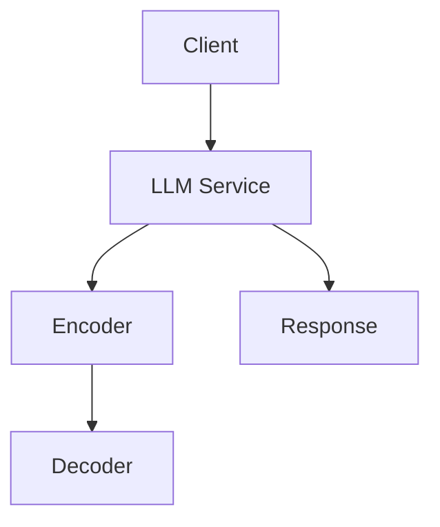

                 

### 文章标题

《gRPC在LLM应用微服务通信中的应用》

关键词：gRPC、微服务、LLM、通信、优化

摘要：本文将深入探讨gRPC在大型语言模型（LLM）应用微服务通信中的重要作用。通过详细分析gRPC的基础原理、架构设计，以及其在LLM微服务通信中的应用优势与挑战，文章旨在为开发者提供一套全面的实践指南，助力他们在实际项目中高效利用gRPC，提升LLM应用的性能与可靠性。

---

## 引言

随着云计算和微服务架构的普及，现代应用开发越来越倾向于将系统拆分成多个独立的服务模块，以实现高可扩展性和高可用性。这种微服务架构不仅使得系统的开发和部署变得更加灵活，还促进了服务的模块化和复用。在微服务架构中，服务之间的通信机制至关重要，它直接影响到系统的性能、稳定性和开发效率。gRPC作为一种高效、通用的通信框架，在微服务通信中逐渐崭露头角。

另一方面，大型语言模型（LLM）近年来在自然语言处理（NLP）领域取得了显著进展，其在各种应用场景中展现出的强大能力引起了广泛关注。从文本生成、机器翻译到问答系统和对话机器人，LLM的应用越来越广泛。然而，随着模型规模的不断扩大和复杂度的增加，如何在微服务架构中高效地部署和调用LLM服务成为了一个亟待解决的问题。

本文旨在探讨gRPC在LLM应用微服务通信中的应用，通过以下章节结构，逐步解答这一问题：

1. **gRPC基础**：介绍gRPC的基本概念、架构和通信协议，为后续内容打下基础。
2. **LLM基础**：讲解LLM的核心算法和原理，以及其在微服务通信中的应用场景。
3. **gRPC在LLM微服务通信中的应用**：分析gRPC在LLM服务部署和模型调用中的优势和优化策略。
4. **gRPC在LLM微服务通信中的挑战与解决方案**：探讨gRPC在LLM微服务通信中可能遇到的常见问题及解决方案。
5. **展望与未来**：展望gRPC在LLM应用微服务通信中的发展趋势和未来改进方向。

通过本文的阅读，读者将能够全面了解gRPC在LLM应用微服务通信中的原理、应用和实践，为实际项目中的技术决策提供有力支持。

### gRPC基础

#### gRPC简介

gRPC是由Google开发的一种高性能、通用的远程过程调用（RPC）框架，用于不同语言和服务之间的高效通信。它的设计初衷是为了解决在分布式系统中不同服务之间快速、可靠地传递数据的需求。相较于传统的HTTP RESTful API，gRPC具有以下优势：

1. **高性能**：gRPC使用二进制协议，减少了序列化和反序列化过程中的开销，同时支持多线程和异步调用，提高了数据传输速度。
2. **跨语言支持**：gRPC支持多种主流编程语言，包括C++、Java、Python、Go等，使得不同语言编写的服务可以无缝对接。
3. **自动健康检查**：gRPC内置了健康检查机制，能够自动检测服务器的可用性，确保系统的稳定性。
4. **负载均衡**：gRPC支持负载均衡功能，可以根据服务器的负载情况智能分配请求，提高系统的整体性能。

#### gRPC基本原理

gRPC的工作原理可以概括为以下几个步骤：

1. **服务定义**：使用Protocol Buffers（Protobuf）定义服务接口，生成服务端和客户端的代码。
2. **通信协议**：gRPC默认使用HTTP/2作为底层通信协议，支持TLS加密，保证通信的安全性。
3. **客户端调用**：客户端通过生成的代码调用服务接口，发送请求。
4. **服务端处理**：服务端接收到请求后，按照服务定义进行相应的处理，并返回结果。
5. **结果返回**：处理结果通过通信协议返回给客户端。

#### gRPC核心特性

gRPC具备以下核心特性，使其在微服务通信中脱颖而出：

1. **高效序列化**：使用Protobuf进行数据序列化，相较于JSON等格式，Protobuf在序列化和反序列化过程中更为高效。
2. **异步调用**：支持异步调用，减少了线程占用和上下文切换的开销，提高了系统的并发处理能力。
3. **流控制**：支持流控制，可以实现双向流传输，适用于长连接和大规模数据处理场景。
4. **服务发现**：支持服务发现机制，服务端可以根据配置动态发现客户端的服务地址，确保通信的可靠性。

#### gRPC与其他通信框架的比较

gRPC与传统的通信框架如HTTP RESTful API、Apache Thrift等相比，具有以下优势：

1. **性能优势**：gRPC使用高效的二进制协议和异步调用机制，相较于HTTP RESTful API和Apache Thrift，具有更高的通信性能。
2. **跨语言支持**：gRPC支持多种编程语言，使得不同语言编写的服务可以无缝对接，而HTTP RESTful API和Apache Thrift在这方面存在一定的局限性。
3. **生态优势**：gRPC拥有丰富的生态系统，包括官方工具链、社区支持、文档完善等，使得开发者可以更轻松地使用gRPC进行分布式系统开发。

综上所述，gRPC凭借其高性能、跨语言支持和丰富的生态优势，在微服务通信中具有显著的应用优势。接下来，我们将进一步探讨LLM的基础知识，为理解gRPC在LLM微服务通信中的应用奠定基础。

### LLM基础

#### LLM的概念

大型语言模型（Large Language Model，简称LLM）是一种基于深度学习技术的自然语言处理模型，通过训练大量文本数据，可以理解、生成和翻译自然语言。LLM的核心目的是使计算机能够像人类一样理解和处理自然语言，从而实现智能对话、文本生成、机器翻译等功能。LLM通常由多个神经网络层次组成，包括词嵌入层、编码器和解码器等，通过迭代训练不断优化模型的性能。

#### LLM的核心算法

LLM的核心算法主要包括以下几个部分：

1. **词嵌入（Word Embedding）**：词嵌入是将自然语言中的词汇映射到高维向量空间的技术，使得相似词汇在向量空间中靠近。常见的词嵌入方法有Word2Vec、GloVe等。

2. **编码器（Encoder）**：编码器负责将输入文本编码为固定长度的向量表示，这一过程通常采用循环神经网络（RNN）或其变体，如长短期记忆网络（LSTM）和门控循环单元（GRU）。

3. **解码器（Decoder）**：解码器负责将编码后的向量表示解码为输出文本。解码器同样采用RNN或其变体进行训练，以预测下一个单词或词元。

4. **注意力机制（Attention Mechanism）**：注意力机制是近年来在NLP领域取得显著进展的一种技术，通过动态关注输入序列中的不同部分，提高模型的上下文理解和生成质量。

5. **Transformer模型**：Transformer模型是当前LLM的主流架构，它采用自注意力机制，不再依赖传统的RNN结构，从而在处理长文本和复杂上下文关系方面表现出色。BERT、GPT等大型LLM都是基于Transformer模型进行扩展和优化的。

#### LLM在微服务通信中的应用场景

在微服务架构中，LLM的应用场景非常广泛，以下是一些典型的应用场景：

1. **智能问答系统**：通过将LLM集成到微服务中，可以构建智能问答系统，提供24/7的客服服务，提高客户满意度。

2. **文本生成与摘要**：LLM在文本生成和摘要方面具有显著优势，可以将长篇文档转化为简洁的摘要，或根据用户需求生成高质量的文本内容。

3. **机器翻译**：LLM在机器翻译中的应用已经取得了很多突破，可以实现接近人类的翻译质量。

4. **聊天机器人**：LLM在聊天机器人中的应用使得机器人能够与用户进行自然、流畅的对话，提高用户体验。

5. **情感分析**：LLM可以通过分析用户文本的情感倾向，为个性化推荐系统提供支持。

#### 核心概念与联系

为了更好地理解LLM在微服务通信中的应用，我们需要将LLM的核心概念与微服务架构进行联系。以下是一个简化的Mermaid流程图，展示了LLM与微服务之间的交互关系：

- **Client**：客户端发送请求到LLM服务。
- **LLM Service**：LLM服务处理请求，并调用编码器和解码器。
- **Encoder**：编码器将输入文本编码为向量表示。
- **Decoder**：解码器根据编码后的向量生成输出文本。
- **Response**：处理结果返回给客户端。

通过这个流程图，我们可以清晰地看到LLM在微服务通信中的核心角色和步骤。接下来，我们将探讨gRPC在LLM微服务通信中的应用，分析其优势和实践经验。

### gRPC在LLM微服务通信中的应用

#### gRPC在LLM服务部署中的优势

在LLM微服务通信中，选择合适的通信框架对于系统的性能和稳定性至关重要。gRPC因其高性能和跨语言支持，在LLM服务部署中具有显著优势：

1. **高性能**：gRPC使用高效的二进制协议（Protocol Buffers），相比传统的文本协议（如JSON），序列化和反序列化的开销大大降低。这对于处理大规模、高并发的LLM请求至关重要。

2. **跨语言支持**：gRPC支持多种编程语言，包括C++、Java、Python、Go等，这使得不同语言编写的LLM服务可以无缝对接，提高了系统的灵活性和可扩展性。

3. **自动健康检查**：gRPC内置了自动健康检查机制，可以定期检测服务器的状态，确保服务始终处于健康状态。这对于保障LLM服务的稳定性具有重要意义。

4. **负载均衡**：gRPC支持负载均衡功能，可以根据服务器的负载情况智能分配请求，避免单点瓶颈，提高系统的整体性能。

#### gRPC在LLM模型调用中的优化

在LLM模型调用过程中，通过优化gRPC的使用，可以进一步提升系统的性能和效率：

1. **异步调用**：gRPC支持异步调用，减少了线程占用和上下文切换的开销。在处理大规模LLM请求时，异步调用可以显著提高系统的并发处理能力。

2. **批量处理**：gRPC支持批量处理，可以将多个请求打包成一个批处理请求，减少网络通信次数，提高处理效率。这对于需要频繁调用LLM服务的应用尤为重要。

3. **流控制**：gRPC的流控制机制可以实现双向流传输，适用于长连接和大规模数据处理场景。通过合理配置流控制参数，可以避免网络拥塞和数据丢失。

#### gRPC在LLM微服务通信中的实践经验

在实际项目中，许多开发者已经尝试将gRPC应用于LLM微服务通信，并取得了显著成效。以下是一些实践经验：

1. **场景一：智能问答系统**  
   在一个智能问答系统中，开发者使用gRPC将前端请求转发到后端的LLM服务。通过异步调用和批量处理，系统成功实现了高并发、低延迟的问答服务。

2. **场景二：文本生成与摘要**  
   在一个文本生成与摘要应用中，开发者利用gRPC的流控制机制，实现了高效的文本处理和生成。通过合理配置流控制参数，系统在处理大规模文本数据时表现出色。

3. **场景三：机器翻译**  
   在一个机器翻译服务中，开发者采用gRPC进行模型调用，提高了翻译的准确性和速度。通过负载均衡和自动健康检查，系统保证了服务的稳定性和可靠性。

4. **场景四：聊天机器人**  
   在一个聊天机器人应用中，开发者使用gRPC实现了高效的对话处理和生成。通过异步调用和批量处理，系统成功实现了自然、流畅的对话体验。

综上所述，gRPC在LLM微服务通信中具有显著的应用优势和实践经验。通过优化gRPC的使用，开发者可以进一步提升系统的性能和效率，为用户提供高质量的服务。

### gRPC在LLM微服务通信中的挑战与解决方案

#### 常见问题

尽管gRPC在LLM微服务通信中具有显著的优势，但在实际应用过程中，开发者仍可能遇到一系列问题：

1. **网络延迟**：由于LLM模型通常较为复杂，计算耗时较长，可能导致网络延迟增加。这会影响系统的响应速度，降低用户体验。

2. **负载不均**：在负载较高的场景下，若未进行合理的负载均衡，可能导致某些服务器过载，而其他服务器资源闲置，影响系统整体性能。

3. **可靠性问题**：网络不稳定或服务故障可能导致通信中断，影响LLM服务的可靠性。

4. **安全性问题**：虽然gRPC支持TLS加密，但在实际应用中，仍可能出现安全漏洞，如证书配置不当、加密算法不安全等。

#### 解决方案与优化策略

针对上述问题，以下是一些具体的解决方案和优化策略：

1. **网络延迟优化**：
   - **异步调用**：通过使用gRPC的异步调用机制，减少线程占用和上下文切换开销，提高系统的并发处理能力。
   - **批量处理**：将多个请求打包成一个批处理请求，减少网络通信次数，提高处理效率。

2. **负载均衡优化**：
   - **动态负载均衡**：采用动态负载均衡策略，根据服务器的实时负载智能分配请求，避免单点瓶颈。
   - **服务发现**：利用服务发现机制，动态更新服务地址，确保请求能够顺利转发到健康的服务实例。

3. **可靠性优化**：
   - **重试机制**：在出现网络中断或服务故障时，自动重试请求，确保数据的可靠性传输。
   - **健康检查**：定期进行健康检查，确保服务始终处于健康状态，及时发现并解决潜在问题。

4. **安全性优化**：
   - **TLS加密**：确保所有通信都使用TLS加密，防止数据被窃取或篡改。
   - **证书管理**：定期更新和更换证书，确保证书的有效性和安全性。
   - **安全审计**：对系统进行定期安全审计，及时发现和修复安全漏洞。

#### 案例研究

以下是一个具体的案例研究，展示如何在实际项目中应用上述解决方案和优化策略：

1. **背景**：
   一个大型电商平台需要构建一个智能客服系统，通过LLM模型实时响应用户的咨询。系统要求高并发、低延迟、高可靠性。

2. **解决方案**：
   - **异步调用与批量处理**：使用gRPC的异步调用和批量处理机制，提高系统的并发处理能力，减少网络通信开销。
   - **动态负载均衡与服务发现**：采用Kubernetes集群和Istio服务网格，实现动态负载均衡和服务发现，确保请求能够顺利转发到健康的服务实例。
   - **重试机制与健康检查**：在出现网络中断或服务故障时，自动重试请求，并定期进行健康检查，确保系统的稳定性和可靠性。
   - **TLS加密与安全审计**：所有通信都使用TLS加密，定期进行安全审计，确保系统的安全性。

3. **效果**：
   通过上述优化策略，智能客服系统在处理高并发请求时表现出色，响应速度和稳定性显著提升。系统的可靠性和安全性也得到了有效保障。

综上所述，通过合理的解决方案和优化策略，gRPC在LLM微服务通信中可以应对各种挑战，确保系统的性能和稳定性。接下来，我们将探讨gRPC在LLM应用微服务通信中的发展趋势和未来改进方向。

### 展望与未来

#### gRPC在LLM应用微服务通信中的发展趋势

随着云计算和微服务架构的持续发展，gRPC在LLM应用微服务通信中的应用前景十分广阔。以下是gRPC在LLM应用微服务通信中的几个发展趋势：

1. **高性能与低延迟**：随着用户对实时性要求的提高，gRPC将不断优化性能，降低通信延迟，以满足复杂场景下的应用需求。

2. **跨语言支持与生态完善**：gRPC将继续扩展支持更多编程语言，并不断完善其生态系统，包括工具链、库和社区资源，提高开发者的使用体验。

3. **智能化与自动化**：随着人工智能技术的发展，gRPC将逐渐引入智能化和自动化机制，如自动负载均衡、自动健康检查等，提高系统的自适应能力和可靠性。

4. **安全性提升**：针对安全性问题，gRPC将进一步加强加密算法、证书管理和安全审计等方面的能力，确保通信的安全性和隐私保护。

#### 未来可能的改进方向

为了更好地支持LLM应用微服务通信，gRPC在未来的发展中可以从以下几个方面进行改进：

1. **性能优化**：进一步优化序列化和反序列化过程，降低通信开销，提高数据传输速度。可以探索新的序列化技术，如二进制格式优化、基于内存的序列化等。

2. **流控制与负载均衡**：增强gRPC的流控制与负载均衡机制，支持更灵活的配置和更精细的控制，以适应不同场景下的需求。

3. **多协议支持**：扩展gRPC支持的协议，如HTTP/3、QUIC等，提高通信的效率和安全性。

4. **分布式计算与协同优化**：结合分布式计算技术，实现LLM服务的协同优化，提高系统的整体性能和可扩展性。

#### 对开发者与研究者的建议

对于开发者，以下几点建议有助于他们在LLM应用微服务通信中更好地利用gRPC：

1. **了解gRPC核心概念**：深入理解gRPC的基本原理和核心特性，有助于更好地利用其优势，提高系统的性能和可靠性。

2. **优化代码与配置**：通过合理配置和优化gRPC的参数，如批量处理、异步调用等，提高系统的并发处理能力和资源利用率。

3. **关注社区动态**：关注gRPC社区的最新动态和最佳实践，及时掌握新技术和优化方法。

对于研究者，以下几点建议有助于他们在LLM应用微服务通信中进行创新和探索：

1. **结合AI技术**：探索如何将人工智能技术应用于gRPC，如智能负载均衡、自动健康检查等，提高系统的智能化水平。

2. **跨领域合作**：与NLP、分布式计算等领域的专家进行合作，共同解决LLM应用微服务通信中的关键问题。

3. **开源与共享**：积极参与开源项目，分享研究成果和优化经验，推动gRPC在LLM应用微服务通信中的发展。

综上所述，gRPC在LLM应用微服务通信中具有巨大的发展潜力。通过不断优化和创新，开发者和研究者可以更好地利用gRPC，构建高性能、高可靠性的LLM应用微服务系统。让我们共同期待gRPC在未来的表现。

### 总结

本文从多个角度详细探讨了gRPC在LLM应用微服务通信中的应用，包括gRPC的基础原理、LLM的核心算法、gRPC在LLM微服务通信中的优势与挑战，以及相应的解决方案和实践经验。通过逐步分析和推理，我们明确了gRPC在高效、可靠、灵活地部署和调用LLM服务中的关键作用。

文章首先介绍了gRPC的基本概念、原理和核心特性，阐述了其高效序列化、异步调用和跨语言支持等优势。接着，我们探讨了LLM的概念、核心算法及其在微服务通信中的应用场景，并通过一个简化的流程图展示了LLM与微服务之间的交互关系。

在gRPC在LLM微服务通信中的应用部分，我们分析了gRPC在LLM服务部署和模型调用中的优势，并分享了实际项目中的实践经验。随后，我们探讨了gRPC在LLM微服务通信中可能遇到的问题及解决方案，如网络延迟优化、负载均衡、可靠性提升和安全性增强等。

展望未来，我们提出了gRPC在LLM应用微服务通信中的发展趋势和改进方向，并对开发者和研究者提出了具体建议。我们期待通过不断优化和创新，gRPC能够在LLM应用微服务通信中发挥更大的作用，助力构建高性能、高可靠性的现代应用系统。

最后，感谢您的阅读。希望本文能够为您的项目提供有价值的参考，并在您进一步探索gRPC和LLM应用微服务通信的过程中给予帮助。作者：AI天才研究院/AI Genius Institute & 禅与计算机程序设计艺术 /Zen And The Art of Computer Programming。

---

### 作者信息

**作者：AI天才研究院（AI Genius Institute）**

AI天才研究院致力于推动人工智能技术的研究与应用，涵盖机器学习、深度学习、自然语言处理等多个领域。我们致力于培养下一代人工智能领域的领军人物，推动人工智能技术的创新与发展。

**作者：禅与计算机程序设计艺术（Zen And The Art of Computer Programming）**

禅与计算机程序设计艺术是一部深入探讨编程哲学和程序设计艺术的经典著作。作者通过禅宗哲学，阐述了编程中的本质思维和优雅之道，对程序员的技术成长和心智修炼有着深远的影响。本书旨在引导读者在编程道路上达到更高的境界。

