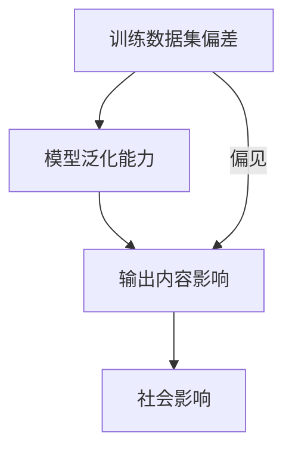

                 


### 1.1.1 语言模型偏见的问题

#### 背景介绍
在人工智能领域，特别是自然语言处理（NLP）方面，语言模型（如大型语言模型LLM）已经成为了一种强大的工具，能够处理各种语言任务，包括文本生成、翻译、问答等。然而，随着这些模型在各个领域的广泛应用，一个不容忽视的问题逐渐显现——偏见。偏见是指模型对某些特定群体、观点或信息的偏向性，这种偏向性可能导致不公平的结果。

#### 核心概念与联系
为了更好地理解偏见问题，我们需要明确几个核心概念：
1. **训练数据集偏差**：偏见往往源于训练数据集中的不均衡或偏见。例如，如果训练数据集中包含更多关于某一群体的负面描述，那么模型在生成相关内容时可能会无意中反映出这种偏见。
2. **模型泛化能力**：一个好的模型应该能够泛化到未见过的数据上，而不是仅仅在训练数据上表现出色。偏见往往降低了模型的泛化能力，导致在实际应用中产生不公平的结果。
3. **输出内容影响**：语言模型的输出内容对用户和社会有着直接的影响。如果模型在输出内容中包含偏见，可能会导致用户对某些群体产生负面印象，甚至加剧社会不平等。

#### 核心算法原理讲解
要检测和解决语言模型中的偏见问题，我们可以采用以下方法：

1. **基于规则的方法**：这种方法涉及制定一系列规则来检测潜在的偏见。例如，可以检测文本中是否存在特定关键词的使用频率不均衡，或者是否存在特定的负面短语。以下是一个简单的伪代码示例：

    ```python
    def check_biases(text):
        bias_rules = ["negative_phrase_1", "negative_phrase_2", "positive_phrase_1"]
        for rule in bias_rules:
            if rule in text:
                return True
        return False
    ```

2. **基于统计的方法**：这种方法通过分析文本中的统计特征来检测偏见。例如，可以计算特定词汇在不同群体文本中的出现频率，并比较这些频率。以下是一个简单的伪代码示例：

    ```python
    def calculate_frequency(texts, target_group):
        word_counts = Counter()
        for text in texts:
            if target_group in text:
                words = text.split()
                word_counts.update(words)
        return word_counts
    ```

3. **基于机器学习的方法**：这种方法使用机器学习算法来检测偏见。例如，可以使用监督学习算法来训练一个模型，该模型可以预测文本中是否包含偏见。以下是一个简单的伪代码示例：

    ```python
    from sklearn.linear_model import LogisticRegression

    def train_biased_model(training_data, training_labels):
        model = LogisticRegression()
        model.fit(training_data, training_labels)
        return model

    def predict_biases(model, text):
        features = extract_features(text)
        return model.predict([features])
    ```

#### 数学模型和公式
为了定量分析偏见，我们可以使用以下数学模型和公式：

1. **偏差度量**：可以使用标准偏差（Standard Deviation, SD）来衡量偏见。假设我们有一个词汇表V，其中每个词汇的偏置值为b_v。则总偏差可以表示为：

    $$\sigma = \sqrt{\sum_{v \in V} (b_v - \mu)^2}$$

    其中，$\mu$ 是所有词汇偏置值的平均值。

2. **公平性度量**：可以使用Jaccard相似性（Jaccard Similarity）来衡量不同群体之间的公平性。假设我们有两个群体A和B，它们在文本T中的词汇集合分别为V_A和V_B，则Jaccard相似性可以表示为：

    $$J(V_A, V_B) = \frac{|V_A \cap V_B|}{|V_A \cup V_B|}$$

#### 举例说明
假设我们有两个群体A和B，其中群体A的文本T_A包含词汇{happy, sad, love}，而群体B的文本T_B包含词汇{happy, joy, anger}。我们可以计算它们之间的Jaccard相似性：

$$J(T_A, T_B) = \frac{|T_A \cap T_B|}{|T_A \cup T_B|} = \frac{|{\text{happy}}|}{|{\text{happy, sad, love}} \cup {\text{happy, joy, anger}}|} = \frac{1}{4} = 0.25$$

#### 项目实战
在实际项目中，我们可以通过以下步骤来检测和解决偏见问题：

1. **数据收集**：收集具有不同群体特征的文本数据。
2. **数据预处理**：对文本数据进行清洗和标准化处理。
3. **偏见检测**：使用上述算法和方法对文本数据进行偏见检测。
4. **偏见修正**：根据检测结果对模型进行修正。
5. **输出评估**：对修正后的模型进行输出评估，确保偏见得到有效减少。

#### 最佳实践 tips
- **多样化数据集**：确保训练数据集的多样性，避免数据集中的偏见。
- **持续监测与修正**：定期对模型进行偏见检测和修正，以保持公平性。
- **透明性与责任**：确保偏见检测和修正的过程透明，并明确责任归属。

#### 小结
语言模型偏见是一个复杂且重要的问题，需要通过多种方法和技术进行检测和修正。通过理解核心概念、算法原理和数学模型，我们可以更有效地解决偏见问题，确保语言模型的输出公平性。

#### 注意事项
- **偏见检测的复杂性**：偏见检测是一个复杂的过程，需要综合考虑多种因素。
- **伦理问题**：偏见检测涉及到伦理问题，特别是在处理敏感群体时需要格外谨慎。

#### 拓展阅读
- [《自然语言处理中的偏见问题》](https://www.nature.com/articles/s41586-020-2633-4)
- [《语言模型偏见检测的方法与挑战》](https://arxiv.org/abs/2005.05623)

作者：AI天才研究院/AI Genius Institute & 禅与计算机程序设计艺术 /Zen And The Art of Computer Programming 

----------------------------------------------------------------

### 1.1.1 语言模型偏见的问题

#### 背景介绍

在人工智能领域，特别是自然语言处理（NLP）方面，语言模型（如大型语言模型LLM）已经成为了一种强大的工具，能够处理各种语言任务，包括文本生成、翻译、问答等。然而，随着这些模型在各个领域的广泛应用，一个不容忽视的问题逐渐显现——偏见。偏见是指模型对某些特定群体、观点或信息的偏向性，这种偏向性可能导致不公平的结果。

#### 核心概念与联系

为了更好地理解偏见问题，我们需要明确几个核心概念：

1. **训练数据集偏差**：偏见往往源于训练数据集中的不均衡或偏见。例如，如果训练数据集中包含更多关于某一群体的负面描述，那么模型在生成相关内容时可能会无意中反映出这种偏见。
2. **模型泛化能力**：一个好的模型应该能够泛化到未见过的数据上，而不是仅仅在训练数据上表现出色。偏见往往降低了模型的泛化能力，导致在实际应用中产生不公平的结果。
3. **输出内容影响**：语言模型的输出内容对用户和社会有着直接的影响。如果模型在输出内容中包含偏见，可能会导致用户对某些群体产生负面印象，甚至加剧社会不平等。

**核心概念之间的联系架构**：

- 训练数据集偏差 → 模型泛化能力 → 输出内容影响

**Mermaid流程图**：



#### 核心算法原理讲解

要检测和解决语言模型中的偏见问题，我们可以采用以下方法：

1. **基于规则的方法**：这种方法涉及制定一系列规则来检测潜在的偏见。例如，可以检测文本中是否存在特定关键词的使用频率不均衡，或者是否存在特定的负面短语。以下是一个简单的伪代码示例：

    ```python
    def check_biases(text):
        bias_rules = ["negative_phrase_1", "negative_phrase_2", "positive_phrase_1"]
        for rule in bias_rules:
            if rule in text:
                return True
        return False
    ```

2. **基于统计的方法**：这种方法通过分析文本中的统计特征来检测偏见。例如，可以计算特定词汇在不同群体文本中的出现频率，并比较这些频率。以下是一个简单的伪代码示例：

    ```python
    def calculate_frequency(texts, target_group):
        word_counts = Counter()
        for text in texts:
            if target_group in text:
                words = text.split()
                word_counts.update(words)
        return word_counts
    ```

3. **基于机器学习的方法**：这种方法使用机器学习算法来检测偏见。例如，可以使用监督学习算法来训练一个模型，该模型可以预测文本中是否包含偏见。以下是一个简单的伪代码示例：

    ```python
    from sklearn.linear_model import LogisticRegression

    def train_biased_model(training_data, training_labels):
        model = LogisticRegression()
        model.fit(training_data, training_labels)
        return model

    def predict_biases(model, text):
        features = extract_features(text)
        return model.predict([features])
    ```

#### 数学模型和公式

为了定量分析偏见，我们可以使用以下数学模型和公式：

1. **偏差度量**：可以使用标准偏差（Standard Deviation, SD）来衡量偏见。假设我们有一个词汇表V，其中每个词汇的偏置值为b_v。则总偏差可以表示为：

    $$\sigma = \sqrt{\sum_{v \in V} (b_v - \mu)^2}$$

    其中，$\mu$ 是所有词汇偏置值的平均值。

2. **公平性度量**：可以使用Jaccard相似性（Jaccard Similarity）来衡量不同群体之间的公平性。假设我们有两个群体A和B，它们在文本T中的词汇集合分别为V_A和V_B，则Jaccard相似性可以表示为：

    $$J(V_A, V_B) = \frac{|V_A \cap V_B|}{|V_A \cup V_B|}$$

#### 举例说明

假设我们有两个群体A和B，其中群体A的文本T_A包含词汇{happy, sad, love}，而群体B的文本T_B包含词汇{happy, joy, anger}。我们可以计算它们之间的Jaccard相似性：

$$J(T_A, T_B) = \frac{|T_A \cap T_B|}{|T_A \cup T_B|} = \frac{|{\text{happy}}|}{|{\text{happy, sad, love}} \cup {\text{happy, joy, anger}}|} = \frac{1}{4} = 0.25$$

#### 项目实战

在实际项目中，我们可以通过以下步骤来检测和解决偏见问题：

1. **数据收集**：收集具有不同群体特征的文本数据。
2. **数据预处理**：对文本数据进行清洗和标准化处理。
3. **偏见检测**：使用上述算法和方法对文本数据进行偏见检测。
4. **偏见修正**：根据检测结果对模型进行修正。
5. **输出评估**：对修正后的模型进行输出评估，确保偏见得到有效减少。

#### 最佳实践 tips

- **多样化数据集**：确保训练数据集的多样性，避免数据集中的偏见。
- **持续监测与修正**：定期对模型进行偏见检测和修正，以保持公平性。
- **透明性与责任**：确保偏见检测和修正的过程透明，并明确责任归属。

#### 小结

语言模型偏见是一个复杂且重要的问题，需要通过多种方法和技术进行检测和修正。通过理解核心概念、算法原理和数学模型，我们可以更有效地解决偏见问题，确保语言模型的输出公平性。

#### 注意事项

- **偏见检测的复杂性**：偏见检测是一个复杂的过程，需要综合考虑多种因素。
- **伦理问题**：偏见检测涉及到伦理问题，特别是在处理敏感群体时需要格外谨慎。

#### 拓展阅读

- [《自然语言处理中的偏见问题》](https://www.nature.com/articles/s41586-020-2633-4)
- [《语言模型偏见检测的方法与挑战》](https://arxiv.org/abs/2005.05623)

**作者**：AI天才研究院/AI Genius Institute & 禅与计算机程序设计艺术 /Zen And The Art of Computer Programming 

----------------------------------------------------------------

### 1.1.1 语言模型偏见的问题

#### 背景介绍

在人工智能领域，特别是自然语言处理（NLP）方面，语言模型（如大型语言模型LLM）已经成为了一种强大的工具，能够处理各种语言任务，包括文本生成、翻译、问答等。然而，随着这些模型在各个领域的广泛应用，一个不容忽视的问题逐渐显现——偏见。偏见是指模型对某些特定群体、观点或信息的偏向性，这种偏向性可能导致不公平的结果。

#### 核心概念与联系

为了更好地理解偏见问题，我们需要明确几个核心概念：

1. **训练数据集偏差**：偏见往往源于训练数据集中的不均衡或偏见。例如，如果训练数据集中包含更多关于某一群体的负面描述，那么模型在生成相关内容时可能会无意中反映出这种偏见。
2. **模型泛化能力**：一个好的模型应该能够泛化到未见过的数据上，而不是仅仅在训练数据上表现出色。偏见往往降低了模型的泛化能力，导致在实际应用中产生不公平的结果。
3. **输出内容影响**：语言模型的输出内容对用户和社会有着直接的影响。如果模型在输出内容中包含偏见，可能会导致用户对某些群体产生负面印象，甚至加剧社会不平等。

**核心概念之间的联系架构**：

- 训练数据集偏差 → 模型泛化能力 → 输出内容影响

**Mermaid流程图**：


#### 核心算法原理讲解

要检测和解决语言模型中的偏见问题，我们可以采用以下方法：

1. **基于规则的方法**：这种方法涉及制定一系列规则来检测潜在的偏见。例如，可以检测文本中是否存在特定关键词的使用频率不均衡，或者是否存在特定的负面短语。以下是一个简单的伪代码示例：

    ```python
    def check_biases(text):
        bias_rules = ["negative_phrase_1", "negative_phrase_2", "positive_phrase_1"]
        for rule in bias_rules:
            if rule in text:
                return True
        return False
    ```

2. **基于统计的方法**：这种方法通过分析文本中的统计特征来检测偏见。例如，可以计算特定词汇在不同群体文本中的出现频率，并比较这些频率。以下是一个简单的伪代码示例：

    ```python
    def calculate_frequency(texts, target_group):
        word_counts = Counter()
        for text in texts:
            if target_group in text:
                words = text.split()
                word_counts.update(words)
        return word_counts
    ```

3. **基于机器学习的方法**：这种方法使用机器学习算法来检测偏见。例如，可以使用监督学习算法来训练一个模型，该模型可以预测文本中是否包含偏见。以下是一个简单的伪代码示例：

    ```python
    from sklearn.linear_model import LogisticRegression

    def train_biased_model(training_data, training_labels):
        model = LogisticRegression()
        model.fit(training_data, training_labels)
        return model

    def predict_biases(model, text):
        features = extract_features(text)
        return model.predict([features])
    ```

#### 数学模型和公式

为了定量分析偏见，我们可以使用以下数学模型和公式：

1. **偏差度量**：可以使用标准偏差（Standard Deviation, SD）来衡量偏见。假设我们有一个词汇表V，其中每个词汇的偏置值为b_v。则总偏差可以表示为：

    $$\sigma = \sqrt{\sum_{v \in V} (b_v - \mu)^2}$$

    其中，$\mu$ 是所有词汇偏置值的平均值。

2. **公平性度量**：可以使用Jaccard相似性（Jaccard Similarity）来衡量不同群体之间的公平性。假设我们有两个群体A和B，它们在文本T中的词汇集合分别为V_A和V_B，则Jaccard相似性可以表示为：

    $$J(V_A, V_B) = \frac{|V_A \cap V_B|}{|V_A \cup V_B|}$$

#### 举例说明

假设我们有两个群体A和B，其中群体A的文本T_A包含词汇{happy, sad, love}，而群体B的文本T_B包含词汇{happy, joy, anger}。我们可以计算它们之间的Jaccard相似性：

$$J(T_A, T_B) = \frac{|T_A \cap T_B|}{|T_A \cup T_B|} = \frac{|{\text{happy}}|}{|{\text{happy, sad, love}} \cup {\text{happy, joy, anger}}|} = \frac{1}{4} = 0.25$$

#### 项目实战

在实际项目中，我们可以通过以下步骤来检测和解决偏见问题：

1. **数据收集**：收集具有不同群体特征的文本数据。
2. **数据预处理**：对文本数据进行清洗和标准化处理。
3. **偏见检测**：使用上述算法和方法对文本数据进行偏见检测。
4. **偏见修正**：根据检测结果对模型进行修正。
5. **输出评估**：对修正后的模型进行输出评估，确保偏见得到有效减少。

#### 最佳实践 tips

- **多样化数据集**：确保训练数据集的多样性，避免数据集中的偏见。
- **持续监测与修正**：定期对模型进行偏见检测和修正，以保持公平性。
- **透明性与责任**：确保偏见检测和修正的过程透明，并明确责任归属。

#### 小结

语言模型偏见是一个复杂且重要的问题，需要通过多种方法和技术进行检测和修正。通过理解核心概念、算法原理和数学模型，我们可以更有效地解决偏见问题，确保语言模型的输出公平性。

#### 注意事项

- **偏见检测的复杂性**：偏见检测是一个复杂的过程，需要综合考虑多种因素。
- **伦理问题**：偏见检测涉及到伦理问题，特别是在处理敏感群体时需要格外谨慎。

#### 拓展阅读

- [《自然语言处理中的偏见问题》](https://www.nature.com/articles/s41586-020-2633-4)
- [《语言模型偏见检测的方法与挑战》](https://arxiv.org/abs/2005.05623)

**作者**：AI天才研究院/AI Genius Institute & 禅与计算机程序设计艺术 /Zen And The Art of Computer Programming 

