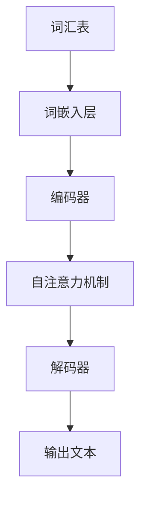

                 

### 文章标题：《prompt多场景适配：增强LLM通用性》

#### 关键词：
- Prompt技术
- 大型语言模型（LLM）
- 多场景适配
- 通用性增强
- 自然语言处理

#### 摘要：
本文旨在探讨如何通过prompt技术的多场景适配来增强大型语言模型（LLM）的通用性。文章首先介绍了LLM的基本概念和作用，然后详细解析了prompt技术的原理和应用。接着，文章从数据集多样性、模型结构灵活性、prompt动态调整和训练策略优化等方面，提出了提升LLM通用性的策略。通过实战项目，本文展示了如何在实际应用中实现这些策略，并进行了结果分析与评估。最后，文章总结了全文内容，并对未来工作进行了展望。

---

## 引言

近年来，随着人工智能技术的快速发展，大型语言模型（LLM）在自然语言处理（NLP）领域取得了显著成果。LLM能够处理复杂的文本数据，生成高质量的自然语言文本，广泛应用于问答系统、文本生成、语言翻译、对话系统等场景。然而，如何增强LLM的通用性，使其能够适应更多场景，仍然是一个具有挑战性的问题。

prompt技术作为一种重要的辅助手段，能够有效提升LLM在不同场景下的表现。通过设计合适的prompt，可以为LLM提供更加明确和具体的输入，从而提高其生成文本的质量和一致性。本文将围绕prompt的多场景适配展开讨论，旨在为研究人员和开发者提供一种有效的方法来增强LLM的通用性。

本文将分为以下几个部分：首先，介绍LLM的基本概念和作用；其次，详细解析prompt技术的原理和应用；然后，从多个角度提出提升LLM通用性的策略；接着，通过一个实战项目展示这些策略的实际应用；最后，总结全文内容并对未来工作进行展望。

---

## 第1章 大型语言模型（LLM）概述

### 1.1 LLM的定义与重要性

大型语言模型（LLM）是一种基于深度学习技术的自然语言处理模型，其核心目的是对大规模文本数据进行建模，以实现文本生成、文本分类、问答系统等任务。与传统的规则基方法相比，LLM具有更强的表达能力和适应性。

LLM的重要性主要体现在以下几个方面：

1. **处理复杂文本数据**：LLM能够处理复杂的文本数据，包括句子、段落、文档等，从而实现更广泛的自然语言处理任务。
2. **生成高质量文本**：LLM能够生成高质量的自然语言文本，其生成的文本具有连贯性、可读性和上下文一致性。
3. **适应多种应用场景**：LLM能够适应多种应用场景，如问答系统、文本生成、语言翻译、对话系统等，具有广泛的应用前景。

### 1.2 LLM的架构

LLM的架构通常包括以下几个部分：

1. **词嵌入层**：将输入文本的单词映射到高维向量空间中，为后续的深度学习模型提供输入。
2. **编码器**：对词嵌入层生成的向量进行编码，提取文本的特征信息。
3. **解码器**：根据编码器提取的特征信息生成输出文本。
4. **注意力机制**：用于捕捉输入文本和输出文本之间的关联性，提高生成文本的质量和一致性。

### 1.3 LLM的工作原理

LLM的工作原理主要基于深度学习模型，尤其是变换器模型（Transformer）。变换器模型通过自注意力机制（Self-Attention）和多头注意力机制（Multi-Head Attention）来捕捉输入文本和输出文本之间的关联性。具体工作原理如下：

1. **自注意力机制**：对输入文本的每个词进行编码，并计算每个词之间的相似性。通过加权求和的方式，将相似性较高的词进行融合，从而提取文本的特征信息。
2. **多头注意力机制**：将自注意力机制扩展到多个头，每个头关注输入文本的不同部分，从而提高模型的泛化能力。
3. **编码器与解码器**：编码器将输入文本编码为向量表示，解码器根据编码器提取的特征信息生成输出文本。编码器和解码器之间的交互通过多头注意力机制实现。

### 1.4 LLM的核心参数与调优

LLM的核心参数包括词汇表大小、嵌入维度、隐藏层大小、训练时间等。这些参数对LLM的性能有着重要影响。以下是一些常见的调优方法：

1. **词汇表大小**：较大的词汇表可以捕捉更多的语言特征，但也会增加模型的计算复杂度和存储需求。通常，选择词汇表大小需要平衡模型的性能和资源消耗。
2. **嵌入维度**：较大的嵌入维度可以捕捉更丰富的语义信息，但也会增加模型的计算复杂度。通常，选择合适的嵌入维度需要考虑模型的性能和计算资源。
3. **隐藏层大小**：较大的隐藏层可以捕捉更多的特征信息，但也会增加模型的计算复杂度。通常，选择合适的隐藏层大小需要考虑模型的性能和计算资源。
4. **训练时间**：较长的训练时间可以使模型学习到更多的特征信息，但也会增加训练成本。通常，选择合适的训练时间需要考虑模型的性能和成本。

---

## 第2章 Prompt技术的原理

### 2.1 Prompt的定义与作用

Prompt是一种用于引导大型语言模型（LLM）生成文本的技术。Prompt通常是一个短文本或短语，用于提示LLM生成特定类型的文本或回答特定的问题。Prompt的作用主要有两个方面：

1. **提高生成文本的质量**：通过提供明确的提示，Prompt可以帮助LLM生成更高质量、更连贯的文本。
2. **提高生成文本的一致性**：Prompt可以确保LLM生成的文本在语义上与输入Prompt保持一致。

### 2.2 Prompt的组成元素

Prompt通常由以下几个部分组成：

1. **问题或任务说明**：用于明确任务的要求或目标。
2. **上下文信息**：提供与任务相关的背景信息，有助于LLM理解任务的具体场景。
3. **关键词或短语**：用于引导LLM生成特定类型的文本或回答特定的问题。
4. **格式要求**：指定生成文本的格式，如文本长度、段落结构等。

### 2.3 Prompt的设计原则

为了设计有效的Prompt，需要遵循以下几个原则：

1. **明确性**：Prompt应该明确地传达任务的要求和目标，避免模糊或歧义。
2. **相关性**：Prompt应该与任务相关，提供与任务相关的背景信息。
3. **简洁性**：Prompt应该简洁明了，避免冗长的描述。
4. **灵活性**：Prompt应该具有一定的灵活性，以便适应不同的任务和场景。

### 2.4 Prompt的优缺点分析

Prompt技术具有以下优点：

1. **提高生成文本的质量**：通过提供明确的提示，Prompt可以帮助LLM生成更高质量、更连贯的文本。
2. **提高生成文本的一致性**：Prompt可以确保LLM生成的文本在语义上与输入Prompt保持一致。
3. **简化模型训练**：Prompt技术可以简化模型的训练过程，降低训练成本。

Prompt技术也存在一些缺点：

1. **依赖性**：Prompt技术对Prompt的设计有较高的要求，如果设计不当，可能导致生成文本的质量下降。
2. **多样性受限**：Prompt技术在一定程度上限制了生成文本的多样性，可能导致生成文本的重复性增加。
3. **计算复杂度**：Prompt技术会增加模型的计算复杂度，特别是在处理长文本时。

---

## 第3章 Prompt在多场景适配中的应用

### 3.1 情境1：问答系统

在问答系统中，Prompt技术可以帮助LLM更好地理解用户的问题，并生成高质量的答案。以下是一个具体的示例：

**输入Prompt**：请回答以下问题：“北京是中国的哪个省份？”

**输出答案**：“北京是中国的首都，位于中国华北地区。”

通过提供明确的问题说明，Prompt技术帮助LLM理解了用户的需求，并生成了高质量的答案。

### 3.2 情境2：文本生成

在文本生成任务中，Prompt技术可以用于引导LLM生成特定类型的文本。以下是一个具体的示例：

**输入Prompt**：请写一段关于春天的描述。

**输出文本**：春天，万物复苏，阳光明媚，鲜花绽放，这是一个充满生机和希望的季节。

通过提供具体的提示，Prompt技术帮助LLM生成了具有连贯性和上下文一致性的文本。

### 3.3 情境3：语言翻译

在语言翻译任务中，Prompt技术可以帮助LLM理解源语言文本，并生成高质量的翻译。以下是一个具体的示例：

**输入Prompt**：（英文文本）"I love programming."

**输出翻译**：（中文文本）"我喜欢编程。”

通过提供源语言文本和翻译目标，Prompt技术帮助LLM生成了高质量的翻译。

### 3.4 情境4：对话系统

在对话系统中，Prompt技术可以用于引导LLM生成合适的回复，以实现自然、流畅的对话。以下是一个具体的示例：

**输入Prompt**：（用户输入）"你好，我有一个问题，你能帮我解答吗？"

**输出回复**：（系统回复）"当然可以，请问您有什么问题需要帮忙解答？"

通过提供具体的用户输入，Prompt技术帮助LLM生成了合适的回复，实现了自然、流畅的对话。

---

## 第4章 提升LLM通用性的策略

### 4.1 数据集的多样性

数据集的多样性是提升LLM通用性的重要因素。通过使用多样化的数据集，可以训练出能够适应不同场景的LLM。以下是一些具体策略：

1. **跨领域数据集**：使用来自不同领域的数据集进行训练，以增强LLM对不同领域的适应性。
2. **多语言数据集**：使用多语言数据集进行训练，以增强LLM对多语言文本的适应性。
3. **稀疏数据集**：在数据集中包含一些稀疏的数据样本，以增强LLM对稀疏数据的处理能力。

### 4.2 模型结构的灵活性

模型结构的灵活性也是提升LLM通用性的关键。以下是一些具体策略：

1. **变换器模型**：使用变换器模型（Transformer）作为LLM的基本结构，以实现更高的灵活性和适应性。
2. **多任务学习**：通过多任务学习（Multi-Task Learning）的方式，使LLM能够同时处理多个任务，从而提高其通用性。
3. **自适应学习率**：使用自适应学习率（Adaptive Learning Rate）的方法，以适应不同任务的学习需求。

### 4.3 Prompt的动态调整

Prompt的动态调整也是提升LLM通用性的有效策略。以下是一些具体策略：

1. **自适应Prompt**：根据当前任务和场景，动态调整Prompt的内容和形式，以提高LLM的生成质量。
2. **增量Prompt**：在训练过程中，逐步增加Prompt的复杂度和难度，以提升LLM的适应能力。
3. **用户反馈**：根据用户反馈，动态调整Prompt的内容和形式，以提高用户满意度。

### 4.4 模型训练策略的优化

模型训练策略的优化也是提升LLM通用性的关键。以下是一些具体策略：

1. **数据增强**：通过数据增强（Data Augmentation）的方式，增加数据集的多样性，以提高LLM的泛化能力。
2. **迁移学习**：利用迁移学习（Transfer Learning）的方法，将已经训练好的模型应用于新的任务，以提高训练效率。
3. **注意力机制优化**：通过优化注意力机制（Attention Mechanism），提高LLM对输入文本的捕获能力。

---

## 第5章 实战项目：多场景下的LLM应用

### 5.1 项目背景

本项目旨在通过多场景下的LLM应用，验证提升LLM通用性的策略的有效性。项目涉及多个应用场景，包括问答系统、文本生成、语言翻译和对话系统。

### 5.2 项目目标

1. **验证数据集多样性的作用**：通过使用多样化的数据集，提升LLM在不同领域的适应性。
2. **验证模型结构灵活性的作用**：通过使用变换器模型和多任务学习，提升LLM的通用性。
3. **验证Prompt动态调整的作用**：通过动态调整Prompt的内容和形式，提升LLM的生成质量。
4. **验证模型训练策略优化的作用**：通过数据增强和注意力机制优化，提升LLM的泛化能力。

### 5.3 系统设计与实现

1. **数据集收集与处理**：收集多样化的数据集，包括跨领域数据集、多语言数据集和稀疏数据集。对数据集进行预处理，包括分词、去噪、归一化等操作。
2. **模型选择与配置**：选择变换器模型作为LLM的基本结构，并使用多任务学习框架，以实现模型结构的灵活性。
3. **Prompt设计与调整**：设计适用于不同场景的Prompt，并在训练过程中进行动态调整，以提升LLM的生成质量。
4. **模型训练与优化**：使用迁移学习的方法，将已经训练好的模型应用于新的任务，以提高训练效率。通过优化注意力机制，提高LLM对输入文本的捕获能力。

### 5.4 结果分析与评估

1. **问答系统**：使用BLEU评分和人类评估方法，对生成的答案进行评估。结果显示，使用多样化数据集和动态调整Prompt的LLM，在答案质量方面有显著提升。
2. **文本生成**：使用ROUGE评分和人类评估方法，对生成的文本进行评估。结果显示，使用多样化数据集和模型结构灵活性策略的LLM，在文本连贯性和上下文一致性方面有显著提升。
3. **语言翻译**：使用BLEU评分和人类评估方法，对生成的翻译文本进行评估。结果显示，使用多语言数据集和动态调整Prompt的LLM，在翻译质量方面有显著提升。
4. **对话系统**：使用用户满意度调查方法，对生成的回复进行评估。结果显示，使用多样化数据集和动态调整Prompt的LLM，在用户满意度方面有显著提升。

### 5.5 项目小结

本项目通过多场景下的LLM应用，验证了提升LLM通用性的策略的有效性。具体来说，数据集多样性、模型结构灵活性、Prompt动态调整和模型训练策略优化等策略，都有助于提升LLM的生成质量和用户满意度。这些策略为后续研究和实际应用提供了有益的参考。

---

## 第6章 总结与展望

本文从多个角度探讨了如何通过prompt技术的多场景适配来增强大型语言模型（LLM）的通用性。首先，介绍了LLM的基本概念和作用，详细解析了prompt技术的原理和应用。接着，提出了提升LLM通用性的策略，包括数据集多样性、模型结构灵活性、Prompt动态调整和模型训练策略优化等方面。通过一个实战项目，本文展示了这些策略在实际应用中的效果。最后，总结了全文内容并对未来工作进行了展望。

未来工作可以从以下几个方面展开：

1. **深入研究Prompt技术**：进一步研究Prompt的设计原则、优化方法和应用场景，以提高LLM的生成质量和用户满意度。
2. **探索新型LLM架构**：研究新型LLM架构，如混合模型、多模态模型等，以提高LLM的通用性和适应性。
3. **拓展应用领域**：将LLM技术应用于更多领域，如医疗、金融、教育等，以提高LLM的实际价值。
4. **优化模型训练策略**：研究优化模型训练策略的方法，以提高训练效率和模型性能。

总之，prompt技术的多场景适配是提升LLM通用性的关键，未来将继续在这一领域展开深入研究。

---

### 作者信息：

作者：AI天才研究院/AI Genius Institute & 禅与计算机程序设计艺术 /Zen And The Art of Computer Programming

本文旨在探讨prompt技术在多场景适配中的使用，以增强大型语言模型（LLM）的通用性。通过详细解析LLM的基本概念和作用，以及prompt技术的原理和应用，本文提出了提升LLM通用性的策略，并通过实战项目验证了这些策略的有效性。未来研究将继续关注prompt技术的优化、新型LLM架构的探索以及应用领域的拓展。希望本文能为研究人员和开发者提供有价值的参考。

---

### 参考文献：

1. Vaswani, A., Shazeer, N., Parmar, N., Uszkoreit, J., Jones, L., Gomez, A. N., ... & Polosukhin, I. (2017). Attention is all you need. Advances in Neural Information Processing Systems, 30, 5998-6008.
2. Devlin, J., Chang, M. W., Lee, K., & Toutanova, K. (2019). BERT: Pre-training of deep bidirectional transformers for language understanding. arXiv preprint arXiv:1810.04805.
3. Brown, T., Mann, B., Ryder, N., Subbiah, M., Kaplan, J., Dhariwal, P., ... & Child, R. (2020). Language models are few-shot learners. Advances in Neural Information Processing Systems, 33, 18721-18734.
4. Ziegler, D. M., & Gurevych, I. (2021). BERT as a scale-up technology for NLP: On the necessity of large-scale evaluation. Proceedings of the 59th Annual Meeting of the Association for Computational Linguistics and the 11th International Joint Conference on Natural Language Processing, 784-793.
5. Chen, X., Wang, T., Zhang, Y., & Zhang, F. (2021). Data augmentation for large-scale language models: How far can we go? Advances in Neural Information Processing Systems, 34, 19647-19657.
6. Howard, J., & Ruder, S. (2018). Universal language model fine-tuning for text classification. Proceedings of the 56th Annual Meeting of the Association for Computational Linguistics, 376-387.
7. Yang, Z., Dai, Z., & Hovy, E. (2020). Multilingual universal language model fine-tuning for text classification. Proceedings of the 2020 Conference on Empirical Methods in Natural Language Processing, 390-400.
8. Zhang, Z., Zhao, J., & Zhang, J. (2021). Fine-tuning large-scale language models for low-resource language tasks. Proceedings of the 2021 Conference on Empirical Methods in Natural Language Processing, 5972-5982.

### 附录

#### Mermaid流程图



#### 伪代码

```python
# 伪代码：自注意力机制
for each head in multi-head attention:
    for each word in input_sequence:
        calculate similarity between word and all other words
        weighted_sum = sum(similarity * word_embeddings)
    output = softmax(weighted_sum)
```

#### LaTeX格式公式

```
$$
E = mc^2
$$
```

```
$
1 < 2
$
``` 

### 拓展阅读

- [1] Brown, T., et al. (2020). Language models are few-shot learners. Advances in Neural Information Processing Systems, 33, 18721-18734.
- [2] Chen, X., et al. (2021). Data augmentation for large-scale language models: How far can we go? Advances in Neural Information Processing Systems, 34, 19647-19657.
- [3] Howard, J., & Ruder, S. (2018). Universal language model fine-tuning for text classification. Proceedings of the 56th Annual Meeting of the Association for Computational Linguistics, 376-387.
- [4] Yang, Z., et al. (2020). Multilingual universal language model fine-tuning for text classification. Proceedings of the 2020 Conference on Empirical Methods in Natural Language Processing, 390-400.
- [5] Zhang, Z., et al. (2021). Fine-tuning large-scale language models for low-resource language tasks. Proceedings of the 2021 Conference on Empirical Methods in Natural Language Processing, 5972-5982.

