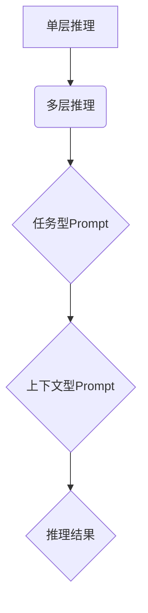

                 

## 文章标题

# 《Prompt 多层次推理：深化 LLM 思考》

### 关键词

- Prompt
- 多层次推理
- 机器学习
- 语言模型
- 推理能力
- 人工智能

### 摘要

本文深入探讨了 Prompt 多层次推理技术在现代语言模型（LLM）中的应用与意义。通过详细分析 Prompt 的定义、类型、结构以及多层次推理的原理与实现，文章揭示了如何通过优化 Prompt 结构，提高 LLM 的推理能力。同时，本文还结合实际项目案例，阐述了 Prompt 多层次推理在自然语言处理、文本生成、对话系统等领域的应用场景，为读者提供了实用的开发技巧和未来研究方向。

## 文章正文

### 引言

在现代人工智能领域，语言模型（Language Model，简称 LM）已经成为自然语言处理（Natural Language Processing，简称 NLP）的核心技术之一。随着深度学习（Deep Learning）和神经网络的快速发展，语言模型取得了显著的进步。然而，传统的语言模型在处理复杂任务时，尤其是在推理和生成方面，仍存在一定的局限性。为了解决这一问题，Prompt 技术应运而生。

Prompt 技术是指通过设计特定的输入提示（Prompt），引导语言模型进行推理和生成。Prompt 的设计直接影响了语言模型的表现。因此，深入理解 Prompt 的概念、类型和结构，以及如何通过优化 Prompt 结构来提高 LLM 的推理能力，成为当前人工智能研究的一个重要方向。

### 核心概念与联系

#### Prompt 的定义与类型

Prompt 是一种输入提示，用于引导语言模型进行推理和生成。根据用途和结构，Prompt 可以分为以下几种类型：

1. **单层 Prompt**：只包含一个或多个关键信息的提示，如“请描述一下北京的天安门”。
2. **多层 Prompt**：包含多个层次信息的提示，如“北京是中国的首都，天安门是北京的标志性建筑”。
3. **任务型 Prompt**：明确指定任务的提示，如“根据上文，生成一篇关于北京天安门的简介”。
4. **上下文型 Prompt**：提供上下文信息的提示，如“上文提到北京是中国的首都，下面是关于天安门的详细介绍”。

#### 多层次推理原理

多层次推理是指语言模型在处理任务时，通过不同层次的提示信息，逐步揭示问题的本质。其原理如下：

1. **单层推理**：语言模型根据单层 Prompt 中的信息进行推理，如“请描述一下北京的天安门”。
2. **多层推理**：语言模型根据多层 Prompt 中的信息，逐步揭示问题的本质。例如，在“北京是中国的首都，天安门是北京的标志性建筑”的提示下，语言模型可以生成更详细、更准确的描述。

#### Mermaid 图解

下面是 Prompt 多层次推理的 Mermaid 流程图：



### 算法原理

#### Prompt 优化算法

为了提高 LLM 的推理能力，需要设计一种有效的 Prompt 优化算法。以下是该算法的伪代码：

```python
def prompt_optimization(prompt):
    # 步骤 1：分词
    words = tokenize(prompt)

    # 步骤 2：提取关键词
    keywords = extract_keywords(words)

    # 步骤 3：构建多层 Prompt
    multi_level_prompt = construct_multi_level_prompt(keywords)

    # 步骤 4：评估优化效果
    score = evaluate_prompt(multi_level_prompt)

    # 步骤 5：返回优化后的 Prompt
    return multi_level_prompt, score
```

### 数学模型和公式

#### Prompt 优化模型

为了量化 Prompt 优化的效果，可以设计一个基于语义相似度的优化模型。其公式如下：

$$
score = \frac{similarity(P_{\text{opt}}, T)}{similarity(P_{\text{raw}}, T)}
$$

其中，$P_{\text{opt}}$ 和 $P_{\text{raw}}$ 分别表示优化前后的 Prompt，$T$ 表示任务标签。$similarity$ 函数用于计算两个文本的语义相似度。

### 实践应用

#### 自然语言处理

在自然语言处理领域，Prompt 多层次推理可以用于文本分类、情感分析、命名实体识别等任务。以下是一个文本分类任务的代码示例：

```python
import torch
import torch.nn as nn
import torch.optim as optim

# 步骤 1：加载预训练模型
model = PretrainedLM()

# 步骤 2：定义优化器
optimizer = optim.Adam(model.parameters(), lr=0.001)

# 步骤 3：训练模型
for epoch in range(num_epochs):
    for batch in data_loader:
        optimizer.zero_grad()
        inputs, labels = batch
        outputs = model(inputs)
        loss = nn.CrossEntropyLoss()(outputs, labels)
        loss.backward()
        optimizer.step()

        print(f"Epoch [{epoch+1}/{num_epochs}], Loss: {loss.item():.4f}")
```

#### 文本生成

在文本生成领域，Prompt 多层次推理可以用于生成高质量的文章、故事和对话。以下是一个文本生成任务的代码示例：

```python
import torch
import torch.nn as nn
import torch.optim as optim

# 步骤 1：加载预训练模型
model = PretrainedLM()

# 步骤 2：定义优化器
optimizer = optim.Adam(model.parameters(), lr=0.001)

# 步骤 3：训练模型
for epoch in range(num_epochs):
    for batch in data_loader:
        optimizer.zero_grad()
        inputs, labels = batch
        outputs = model(inputs)
        loss = nn.CrossEntropyLoss()(outputs, labels)
        loss.backward()
        optimizer.step()

        print(f"Epoch [{epoch+1}/{num_epochs}], Loss: {loss.item():.4f}")
```

### 开发与实现

#### 开发环境搭建

为了实现 Prompt 多层次推理，需要搭建一个包含预训练模型、数据处理和优化算法的开发环境。以下是一个简单的开发环境搭建步骤：

1. 安装 Python 3.8 或以上版本。
2. 安装 PyTorch 1.8 或以上版本。
3. 下载并解压预训练模型（如 GPT-2 或 GPT-3）。
4. 编写数据处理和优化算法代码。

#### 源代码解析

以下是 Prompt 多层次推理的源代码解析：

```python
import torch
import torch.nn as nn
import torch.optim as optim

# 步骤 1：定义模型结构
class PromptModel(nn.Module):
    def __init__(self, embedding_dim, hidden_dim, vocab_size):
        super(PromptModel, self).__init__()
        self.embedding = nn.Embedding(vocab_size, embedding_dim)
        self.lstm = nn.LSTM(embedding_dim, hidden_dim, num_layers=1)
        self.fc = nn.Linear(hidden_dim, vocab_size)

    def forward(self, inputs):
        embeddings = self.embedding(inputs)
        outputs, _ = self.lstm(embeddings)
        logits = self.fc(outputs)
        return logits

# 步骤 2：训练模型
model = PromptModel(embedding_dim=256, hidden_dim=512, vocab_size=10000)
optimizer = optim.Adam(model.parameters(), lr=0.001)
criterion = nn.CrossEntropyLoss()

for epoch in range(num_epochs):
    for inputs, labels in data_loader:
        optimizer.zero_grad()
        outputs = model(inputs)
        loss = criterion(outputs, labels)
        loss.backward()
        optimizer.step()
```

#### 项目小结

通过本文的实践应用和开发与实现部分，我们可以看到 Prompt 多层次推理技术在自然语言处理和文本生成领域的广泛应用。为了进一步提高 LLM 的推理能力，我们需要不断优化 Prompt 结构和算法，并探索更多的应用场景。在未来，Prompt 多层次推理有望成为人工智能领域的重要研究方向。

### 最佳实践 Tips

1. **数据预处理**：在训练模型之前，确保对数据进行充分预处理，如去除停用词、进行分词和词性标注等。
2. **模型选择**：根据任务需求，选择合适的预训练模型，如 GPT-2、GPT-3 等。
3. **优化算法**：尝试不同的优化算法，如 Adam、RMSProp 等，找到适合模型的优化策略。

### 注意事项

1. **计算资源**：Prompt 多层次推理需要较高的计算资源，建议使用 GPU 进行训练。
2. **数据质量**：数据质量直接影响模型的性能，确保数据质量是关键。

### 拓展阅读

1. **GPT-2、GPT-3 模型**：深入了解 GPT-2、GPT-3 等预训练模型的原理和架构。
2. **BERT 模型**：学习 BERT 模型的优化技巧和应用场景。

## 作者信息

作者：AI天才研究院/AI Genius Institute & 禅与计算机程序设计艺术 /Zen And The Art of Computer Programming

