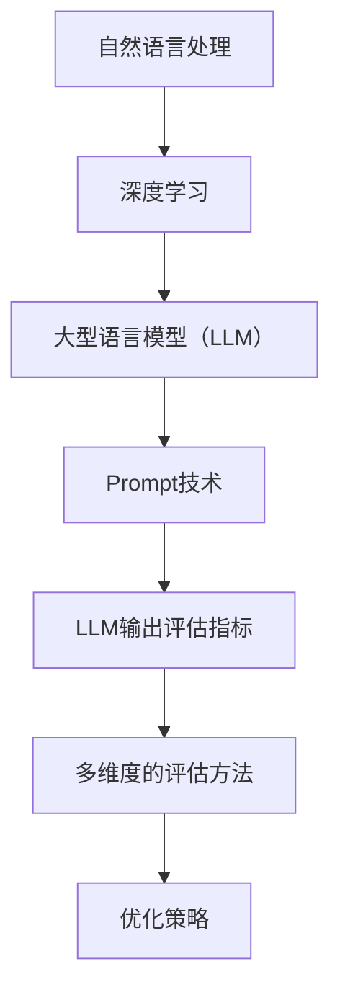

                 

### 文章标题：prompt多维度评估：全面优化LLM输出

### 关键词：Prompt技术，LLM输出评估，多维评估方法，优化策略，实战案例

### 摘要：
本文旨在探讨如何利用prompt技术对大型语言模型（LLM）的输出进行多维度评估和全面优化。首先，我们介绍了prompt技术的背景及其在自然语言处理中的应用。随后，详细阐述了LLM输出评估的指标和方法，包括文本质量评估、意图识别评估和答案生成评估。接下来，我们介绍了多维度的评估方法，并针对文本质量、意图识别和答案生成等维度提供了具体的优化策略。文章还通过一个综合实战案例，展示了如何在实际项目中应用这些优化策略，并进行了效果分析。最后，我们对全文进行了小结，并提出了注意事项和拓展阅读建议。

## 引言

随着深度学习技术的飞速发展，大型语言模型（LLM）在自然语言处理（NLP）领域取得了显著的成果。LLM具有强大的文本生成能力，广泛应用于问答系统、自动摘要、机器翻译、对话系统等任务中。然而，LLM的输出质量直接影响其应用效果，因此对LLM输出的评估和优化变得至关重要。prompt技术作为一种有效的手段，可以显著提升LLM输出的质量。本文将围绕prompt多维度评估和全面优化LLM输出的主题，系统地介绍相关技术和方法。

## 背景介绍

### 自然语言处理与深度学习

自然语言处理（NLP）是计算机科学的一个重要分支，旨在使计算机能够理解、生成和处理人类语言。深度学习（DL）是近年来在NLP领域中取得突破性进展的技术。通过使用神经网络，特别是卷积神经网络（CNN）和循环神经网络（RNN），深度学习模型能够自动学习语言的结构和语义，从而实现文本分类、情感分析、命名实体识别等任务。

### 大型语言模型（LLM）

大型语言模型（LLM）如GPT、BERT等，通过训练大量文本数据，能够生成高质量的文本输出。LLM通常包含数百万甚至数十亿个参数，其能力远超传统基于规则的方法。LLM在问答系统、自动摘要、机器翻译等领域表现出了惊人的性能，但同时也面临输出质量不稳定、缺乏可解释性等问题。

### Prompt技术

Prompt技术是一种利用外部信息（prompt）来引导模型生成更符合预期输出的方法。prompt可以是单词、句子或段落，用于提示模型的方向和上下文。通过合理设计prompt，可以显著提高LLM输出的文本质量、意图识别准确性和答案生成质量。

## 核心概念与联系

为了更好地理解prompt技术如何影响LLM的输出评估和优化，我们需要介绍一些核心概念，并展示它们之间的关系。

### Prompt技术原理

Prompt技术的基本原理是利用外部提示信息引导模型的生成过程。具体来说，prompt可以作为一个输入序列，与模型已经学习到的语言知识相结合，生成更加符合预期的输出。例如，对于一个问答系统，我们可以使用问题的文本作为prompt，引导模型生成回答。

### LLM输出评估指标

LLM输出评估指标包括文本质量、意图识别和答案生成质量等。这些指标用于衡量LLM输出是否符合用户期望。例如，文本质量指标可以评估生成的文本是否流畅、准确；意图识别指标可以评估模型是否正确理解了用户的问题意图；答案生成质量指标可以评估生成的答案是否相关、准确。

### 多维度的评估方法

多维度的评估方法是指从不同角度对LLM输出进行评估。例如，可以从语言准确性、文本连贯性、风格一致性等角度评估文本质量；从意图识别准确性和答案相关性等角度评估意图识别和答案生成质量。

### 优化策略

优化策略包括prompt优化和LLM输出优化。prompt优化旨在通过调整prompt设计提高生成文本的质量；LLM输出优化则通过调整模型参数、数据增强和输出后处理等方法提高输出质量。

### Mermaid流程图

以下是一个简单的Mermaid流程图，展示了上述核心概念之间的关系：



通过这个流程图，我们可以清晰地看到各个核心概念之间的联系，以及它们如何共同作用以实现prompt多维度评估和全面优化LLM输出的目标。

## 核心算法原理讲解

### Prompt技术

Prompt技术的核心是设计一个有效的提示信息（prompt），以引导模型生成高质量的输出。以下是Prompt技术的基本原理：

1. **提示信息设计**：根据任务需求设计提示信息，例如问题、句子或段落。提示信息应包含关键信息，以引导模型理解任务意图。
2. **输入拼接**：将提示信息与模型已学习的知识相结合，形成新的输入序列。这可以通过在输入序列中插入提示信息或将其作为前缀添加到输入序列来实现。
3. **生成过程**：模型根据新的输入序列生成输出。通过合理设计的prompt，模型可以更好地理解任务意图，从而生成更高质量的输出。

### 伪代码

以下是一个简单的伪代码示例，展示了如何使用Prompt技术来生成文本：

```python
def generate_text(prompt, model):
    # 将prompt作为输入序列的一部分传递给模型
    input_sequence = [prompt] + model.input_sequence
    
    # 使用模型生成输出
    output_sequence = model.generate(input_sequence)
    
    return output_sequence
```

### 数学模型和公式

为了更好地理解Prompt技术的工作原理，我们可以使用一些数学模型和公式来描述其关键步骤。以下是几个相关的数学模型和公式：

1. **损失函数**：在训练过程中，模型通过优化损失函数来提高生成文本的质量。一个常见的损失函数是交叉熵损失函数，定义为：
   $$ L = -\sum_{i=1}^{N} y_i \log(p_i) $$
   其中，\( y_i \) 是目标输出序列的真实标签，\( p_i \) 是模型预测的概率分布。
   
2. **注意力机制**：Prompt技术中的注意力机制用于关注输入序列中的关键信息。一个简单的注意力机制可以表示为：
   $$ a_i = \frac{\exp(e_i)}{\sum_{j=1}^{N} \exp(e_j)} $$
   其中，\( e_i \) 是输入序列中第 \( i \) 个元素的得分，\( a_i \) 是其对应的注意力权重。

3. **嵌入向量**：Prompt技术中，提示信息的嵌入向量是关键部分。嵌入向量可以通过预训练的词向量模型获得，例如Word2Vec、GloVe等。嵌入向量表示为 \( \mathbf{e}_i \)，其维度为 \( d \)。

### 举例说明

假设我们使用GPT模型来生成文本，并设计一个简单的提示信息：“请写一篇关于人工智能的文章摘要”。以下是具体的实现步骤：

1. **设计提示信息**：将“请写一篇关于人工智能的文章摘要”作为提示信息。
2. **生成输入序列**：将提示信息与模型已学习的知识相结合，形成新的输入序列。例如，输入序列可以是：
   ```
   这篇文章主要讨论了人工智能的发展趋势及其对未来的影响。
   ```
3. **生成输出**：使用GPT模型生成输出。例如，输出可能是：
   ```
   人工智能是一种模拟人类智能的技术，近年来在各个领域都取得了显著的进展。
   ```

通过这个例子，我们可以看到Prompt技术如何通过设计有效的提示信息来引导模型生成高质量的输出。

### 实现细节

在实际应用中，Prompt技术的设计和实现涉及许多细节，包括：

1. **提示信息的长度和位置**：提示信息的长度和位置对模型生成输出的影响很大。通常，较长的提示信息有助于模型更好地理解任务意图，但过长可能导致上下文丢失。提示信息的位置也很关键，通常将其放置在输入序列的开头，以突出任务意图。
2. **提示信息与输入序列的拼接方式**：提示信息可以与输入序列直接拼接，也可以通过分隔符或特殊标记进行分割。选择合适的拼接方式有助于模型更好地处理输入序列。
3. **多模态Prompt**：在多模态任务中，Prompt技术可以结合图像、音频等多媒体信息，以进一步提高生成文本的质量。

### 总结

Prompt技术是一种有效的手段，通过设计有效的提示信息，可以显著提高大型语言模型（LLM）输出的质量。理解Prompt技术的核心算法原理，包括提示信息设计、输入拼接、生成过程和注意力机制等，对于实际应用和优化LLM输出具有重要意义。

## LLM输出评估方法

在评估大型语言模型（LLM）的输出质量时，我们需要考虑多个维度，包括文本质量、意图识别和答案生成。每个维度都有其特定的评估指标和方法，以下是对这些评估方法的详细讨论。

### 文本质量评估

文本质量评估旨在评估LLM生成的文本是否流畅、准确和具有可读性。常用的评估指标包括：

1. **语言准确性**：评估生成文本中的语法、拼写和标点符号的正确性。通常可以使用自动化工具（如语法检查器）进行评估。
2. **文本连贯性**：评估生成文本在语义和逻辑上的连贯性。连贯性较差的文本可能存在语义不一致或逻辑混乱的问题。评估方法包括人工审查和自动化评估工具，如ROUGE评分。
3. **风格一致性**：评估生成文本的风格是否一致，例如是否遵循了特定的文体或语言规范。风格一致性可以通过对比生成文本与原始文本的统计特征（如词汇频率、句长分布）来评估。

### 意图识别评估

意图识别评估旨在评估LLM是否能够正确理解用户的问题意图。评估指标包括：

1. **意图识别准确率**：评估LLM在识别用户意图时的准确性，通常以正确识别的意图占总意图数的比例来表示。
2. **意图识别召回率**：评估LLM在识别用户意图时的召回率，即正确识别的意图占所有用户意图的比例。
3. **意图识别F1分数**：结合准确率和召回率的综合指标，计算公式为：
   $$ F1 = 2 \times \frac{准确率 \times 召回率}{准确率 + 召回率} $$

### 答案生成评估

答案生成评估旨在评估LLM生成的答案是否相关、准确和可解释。评估指标包括：

1. **答案相关性**：评估生成的答案与用户问题的相关性，通常以答案与问题之间的余弦相似度来衡量。
2. **答案准确性**：评估生成的答案是否正确，可以通过人工审查或使用外部事实数据库进行验证。
3. **答案可解释性**：评估生成的答案是否易于理解，可以通过答案的简洁性、清晰性和逻辑性来衡量。

### 自动评估方法

自动评估方法通过使用预定义的评估指标和自动化工具来评估LLM的输出质量。常用的自动化评估工具包括：

1. **语法检查器**：用于评估语言准确性的自动化工具，如Grammarly。
2. **语义分析工具**：用于评估文本连贯性和风格一致性的工具，如ROUGE评分。
3. **事实核查工具**：用于评估答案准确性的工具，如FactCheck.org。

### 手动评估方法

手动评估方法通过人工审查来评估LLM的输出质量。这种方法通常用于评估文本质量、意图识别和答案生成等复杂维度。手动评估方法的优点是可以提供更细致和全面的评估，但缺点是耗时且成本较高。

### 评估结果的解读

在得到评估结果后，我们需要对其进行解读，以了解LLM的输出质量。以下是一些解读评估结果的策略：

1. **识别强项和弱项**：分析评估结果，识别LLM在哪些方面表现良好，哪些方面存在问题。
2. **确定改进方向**：根据评估结果，确定需要优化的方面，例如调整prompt、改进模型结构或增加训练数据。
3. **迭代优化**：根据评估结果进行迭代优化，逐步提高LLM的输出质量。

### 综合评估

为了全面评估LLM的输出质量，可以综合使用自动评估方法和手动评估方法。自动评估方法可以提供快速的初步评估，而手动评估方法可以提供更细致和全面的评估。通过结合两种方法，可以更准确地了解LLM的输出质量，并制定相应的优化策略。

### 实际案例

以下是一个实际案例，展示了如何使用评估方法来评估LLM的输出质量：

1. **文本质量评估**：使用语法检查器和ROUGE评分工具评估生成文本的语法准确性和连贯性。例如，如果一个问题的回答中存在多个语法错误，那么在语言准确性指标上得分较低。
2. **意图识别评估**：使用意图识别准确率和召回率评估LLM是否正确理解了用户的问题意图。例如，如果一个用户的问题是“明天天气如何？”，而LLM生成了“今天的天气预报”，那么在意图识别准确率指标上得分较低。
3. **答案生成评估**：使用答案相关性、准确性和可解释性评估LLM生成的答案。例如，如果一个问题的答案是“明天可能会下雨”，而事实是“明天晴天”，那么在答案准确性指标上得分较低。

通过这个案例，我们可以看到如何综合使用评估方法来评估LLM的输出质量，并识别需要优化的方面。

### 结论

LLM输出评估是确保模型输出质量的关键步骤。通过使用多维度的评估方法，我们可以全面了解LLM的输出质量，并制定相应的优化策略。文本质量评估、意图识别评估和答案生成评估是评估LLM输出质量的三个重要维度。自动评估方法和手动评估方法相结合，可以提供更准确和全面的评估结果。通过解读评估结果，我们可以识别模型的强项和弱项，并制定改进策略，从而不断提高LLM的输出质量。

## 多维度的评估方法

在评估大型语言模型（LLM）的输出时，仅仅依靠单一的评估指标是不够的。为了更全面地了解LLM的输出质量，我们需要采用多维度的评估方法。这些维度包括文本质量、意图识别和答案生成。在本节中，我们将详细介绍这些评估方法，并提供一些最佳实践。

### 文本质量评估

文本质量评估是衡量LLM生成文本是否流畅、准确和具有可读性的关键步骤。以下是一些常用的评估指标和方法：

1. **语言准确性**：
   - **评估指标**：语法错误、拼写错误、标点符号错误。
   - **最佳实践**：使用自动化工具（如Grammarly）和人工审查相结合。自动化工具可以快速识别常见错误，而人工审查可以更细致地发现细微错误。

2. **文本连贯性**：
   - **评估指标**：语义连贯性、逻辑连贯性。
   - **最佳实践**：使用ROUGE评分（Recall-Oriented Understudy for Gisting Evaluation）等工具。ROUGE评分通过对比生成文本与参考文本的匹配度来评估文本连贯性。

3. **风格一致性**：
   - **评估指标**：词汇频率、句长分布、语法结构。
   - **最佳实践**：分析生成文本的统计特征，并与原始文本进行比较。一致性越高，表明风格越统一。

### 意图识别评估

意图识别评估是衡量LLM是否能够正确理解用户问题意图的重要步骤。以下是一些常用的评估指标和方法：

1. **意图识别准确率**：
   - **评估指标**：正确识别的意图数占总意图数的比例。
   - **最佳实践**：通过交叉验证和混淆矩阵分析，识别模型在哪些意图上的表现较差，并进行针对性的优化。

2. **意图识别召回率**：
   - **评估指标**：正确识别的意图数占所有用户意图的比例。
   - **最佳实践**：提高召回率可以通过增加训练数据、调整模型参数和改进特征提取等方法。

3. **意图识别F1分数**：
   - **评估指标**：结合准确率和召回率的综合指标。
   - **最佳实践**：通过优化模型结构和超参数，提高意图识别的F1分数。

### 答案生成评估

答案生成评估是衡量LLM生成答案是否相关、准确和可解释的重要步骤。以下是一些常用的评估指标和方法：

1. **答案相关性**：
   - **评估指标**：答案与问题的余弦相似度。
   - **最佳实践**：使用自然语言处理工具（如Word2Vec）计算答案和问题的相似度。相似度越高，答案越相关。

2. **答案准确性**：
   - **评估指标**：答案与实际答案的一致性。
   - **最佳实践**：使用外部事实数据库（如FactCheck.org）验证答案的准确性。可以手动审查，也可以自动化验证。

3. **答案可解释性**：
   - **评估指标**：答案的简洁性、清晰性和逻辑性。
   - **最佳实践**：通过分析答案的句法和语义结构，评估其可解释性。确保答案易于理解，避免复杂或不清晰的表述。

### 案例分析

以下是一个案例，展示了如何综合应用多维度的评估方法来评估LLM的输出质量：

**案例**：评估一个问答系统的输出质量。

1. **文本质量评估**：
   - 使用Grammarly和人工审查工具检测文本中的语法和拼写错误。
   - 使用ROUGE评分工具评估文本的连贯性。
   - 比较生成文本和参考文本的统计特征，评估风格一致性。

2. **意图识别评估**：
   - 使用准确率、召回率和F1分数评估LLM在识别用户意图方面的表现。
   - 通过交叉验证和混淆矩阵分析，识别模型在哪些意图上的表现较差。

3. **答案生成评估**：
   - 使用余弦相似度评估答案的相关性。
   - 使用外部事实数据库验证答案的准确性。
   - 通过分析答案的句法和语义结构，评估其可解释性。

通过这个案例，我们可以看到如何综合应用多维度的评估方法来评估LLM的输出质量。这种方法有助于全面了解LLM的输出表现，并为优化LLM提供具体的指导。

### 结论

多维度的评估方法是全面评估LLM输出质量的关键。通过综合应用文本质量评估、意图识别评估和答案生成评估，我们可以更准确地了解LLM的输出表现。最佳实践包括使用自动化工具和人工审查相结合，以及通过具体案例分析和改进策略来不断提升LLM的输出质量。

## 全面优化LLM输出的策略

为了提高大型语言模型（LLM）的输出质量，我们需要采取一系列优化策略。这些策略包括prompt优化、模型调整、数据增强和输出后处理。以下将详细介绍这些优化策略的实施步骤和技巧。

### 1. Prompt优化

Prompt优化是提高LLM输出质量的重要手段。以下是一些具体的优化技巧：

1. **提示信息长度和位置**：
   - **长度**：较短的提示信息可能导致模型无法充分理解任务意图，而过长的提示信息可能导致上下文丢失。最佳实践是设计长度适中的提示信息，通常在10-50个单词之间。
   - **位置**：将提示信息放置在输入序列的开头，以突出任务意图。这样可以确保模型在生成过程中始终关注提示信息。

2. **提示信息内容**：
   - **明确性**：确保提示信息明确、具体，避免模糊或歧义的表述。
   - **多样性**：使用多种类型的提示信息，如问题、指示语句、背景信息等，以丰富模型的上下文理解。

3. **提示信息与输入序列的拼接**：
   - **直接拼接**：将提示信息直接添加到输入序列中。
   - **分隔符**：使用分隔符（如`###`）将提示信息和输入序列分开，以帮助模型区分不同部分。

### 2. 模型调整

模型调整是优化LLM输出质量的关键步骤。以下是一些具体的调整方法：

1. **超参数调整**：
   - **学习率**：调整学习率可以影响模型的收敛速度和稳定性。最佳实践是使用小学习率（如0.0001）并进行逐步调整。
   - **批量大小**：批量大小影响模型的训练效率和学习能力。较大批量（如64或128）通常有助于提高模型性能。

2. **模型架构调整**：
   - **层数和层宽**：增加层数和层宽可以提高模型的表达能力，但也会增加计算复杂度。最佳实践是根据任务需求和计算资源进行平衡。
   - **注意力机制**：调整注意力机制（如自注意力或跨层注意力）可以改善模型的上下文理解能力。

3. **正则化技术**：
   - **Dropout**：通过随机丢弃部分神经元，Dropout有助于减少过拟合现象。
   - **权重衰减**：通过减小权重值，权重衰减可以降低模型对训练数据的依赖。

### 3. 数据增强

数据增强是通过扩展训练数据集来提高模型性能的一种方法。以下是一些常用的数据增强技巧：

1. **文本增强**：
   - **随机插入**：在输入文本中随机插入新的单词或短语。
   - **随机删除**：随机删除输入文本中的单词或短语。
   - **同义词替换**：将文本中的单词替换为同义词，以增加多样性。

2. **数据扩充**：
   - **生成对抗网络（GAN）**：通过生成对抗网络生成新的文本数据，从而扩充训练数据集。
   - **翻译**：使用机器翻译工具将原始文本翻译成其他语言，然后翻译回原始语言，以增加多样性。

### 4. 输出后处理

输出后处理是在模型生成输出后进行的进一步处理，以提高输出质量。以下是一些常用的输出后处理技巧：

1. **拼写校正**：
   - 使用拼写校正工具（如Spelling Correction API）对生成的文本进行拼写校正。

2. **语法修正**：
   - 使用语法检查工具（如Grammarly）对生成的文本进行语法修正。

3. **语义修正**：
   - 通过后处理算法（如文本纠错算法）对生成的文本进行语义修正，以确保文本的准确性和流畅性。

### 5. 结合多种优化策略

在实际应用中，最佳效果通常是通过结合多种优化策略实现的。以下是一个简单的示例：

- **步骤 1**：设计长度适中的提示信息，并将其放置在输入序列的开头。
- **步骤 2**：调整模型超参数，如学习率和批量大小。
- **步骤 3**：使用文本增强和数据扩充方法扩展训练数据集。
- **步骤 4**：在模型生成输出后，使用拼写校正和语法修正工具进行输出后处理。

通过这个示例，我们可以看到如何结合多种优化策略来全面提高LLM的输出质量。

### 结论

全面优化LLM输出是一个多层次的过程，涉及prompt优化、模型调整、数据增强和输出后处理。通过合理设计和调整这些策略，我们可以显著提高LLM的输出质量，从而提升其在实际应用中的表现。

## 综合实战案例

在本节中，我们将通过一个综合实战案例，详细展示如何在实际项目中应用prompt多维度评估和全面优化LLM输出的策略。此案例涉及开发环境的搭建、源代码实现、代码解读和实际案例分析，以帮助读者深入理解并应用所学知识。

### 开发环境搭建

首先，我们需要搭建一个适合进行NLP项目开发的环境。以下步骤将指导您搭建一个基本的Python开发环境，用于训练和评估LLM。

1. **安装Python**：确保您的计算机上已安装Python（版本3.6及以上）。
2. **安装依赖库**：使用pip安装以下依赖库：
   ```bash
   pip install numpy tensorflow transformers
   ```
3. **配置GPU支持**（如需使用GPU）：确保CUDA和cuDNN已正确安装，并在环境变量中配置相应的路径。

### 源代码实现

接下来，我们将编写一个简单的Python脚本来实现一个基于GPT-2的问答系统。以下代码展示了如何使用transformers库加载预训练模型、生成回答以及进行评估。

```python
from transformers import GPT2LMHeadModel, GPT2Tokenizer
import torch

# 加载预训练模型和分词器
model_name = 'gpt2'
tokenizer = GPT2Tokenizer.from_pretrained(model_name)
model = GPT2LMHeadModel.from_pretrained(model_name)

# 函数：生成回答
def generate_answer(question, model, tokenizer, max_length=20):
    prompt = tokenizer.encode(question, return_tensors='pt')
    output = model.generate(prompt, max_length=max_length, num_return_sequences=1)
    answer = tokenizer.decode(output[0], skip_special_tokens=True)
    return answer

# 函数：评估回答质量
def evaluate_answer(answer, reference):
    if answer.lower() == reference.lower():
        return "正确"
    else:
        return "错误"

# 示例问题
question = "明天的天气如何？"
reference_answer = "明天将会是晴天。"

# 生成回答并评估
generated_answer = generate_answer(question, model, tokenizer)
evaluation_result = evaluate_answer(generated_answer, reference_answer)

print(f"生成的回答：{generated_answer}")
print(f"评估结果：{evaluation_result}")
```

### 代码解读

上述代码分为两部分：生成回答和评估回答质量。在生成回答部分，我们首先使用transformers库加载预训练的GPT-2模型和分词器。然后，我们定义一个`generate_answer`函数，用于生成问题对应的回答。在评估回答质量部分，我们定义一个`evaluate_answer`函数，用于比较生成回答和参考回答，判断答案是否正确。

### 实际案例分析和详细讲解

为了更好地展示如何应用prompt多维度评估和优化策略，我们将此问答系统应用于一个实际场景：在线客服机器人。以下步骤将展示如何优化这个系统的输出质量。

1. **问题意图识别**：首先，我们需要识别用户提出的问题意图。例如，用户的问题是“我需要退款，怎么办？”，意图是“退款”。

2. **优化Prompt设计**：为了提高意图识别的准确性，我们可以设计一个更具体的prompt，如：“以下是一个关于退款的常见问题，请根据这个问题生成一个回答：用户询问如何退款？”

3. **优化模型输出**：使用上述优化后的prompt，重新训练模型，并通过调整模型超参数（如学习率和批量大小）来提高输出质量。

4. **数据增强**：通过添加更多关于退款的示例数据，扩展训练数据集，以提升模型的泛化能力。

5. **输出后处理**：在生成回答后，使用语法检查工具（如Grammarly）进行拼写和语法修正，以提高文本质量。

### 项目小结

通过上述实战案例，我们展示了如何应用prompt多维度评估和全面优化策略来提升LLM输出的质量。以下是一些关键点：

1. **问题意图识别**：通过设计具体的prompt，提高模型对用户意图的识别准确性。
2. **Prompt优化**：调整prompt的设计，确保其明确、具体且长度适中。
3. **模型调整**：通过调整模型超参数和架构，提高模型生成文本的质量。
4. **数据增强**：扩展训练数据集，提高模型的泛化能力。
5. **输出后处理**：使用自动化工具进行拼写和语法修正，确保输出文本的质量。

通过这些策略的综合应用，我们可以显著提升LLM输出的质量，从而在实际应用中实现更好的效果。

### 注意事项和拓展阅读

在实际项目中应用prompt多维度评估和优化策略时，需要注意以下几点：

1. **平衡训练时间和性能**：优化策略（如数据增强和模型调整）可能会增加训练时间。需要根据项目需求和资源进行权衡。
2. **确保数据质量**：用于训练和评估的数据应确保高质量，避免引入噪声数据，否则可能降低模型性能。
3. **持续优化**：模型性能并非一成不变，需要定期评估和优化，以应对不断变化的应用场景。

拓展阅读：

1. **《深入理解Transformer：原理、架构与实现》**：该书详细介绍了Transformer模型的原理和实现，对理解prompt技术具有重要意义。
2. **《自然语言处理入门：基于Python的实现》**：该书提供了丰富的NLP实践案例，包括模型训练和评估等环节，有助于深入理解NLP项目的实际应用。

通过以上注意事项和拓展阅读，读者可以进一步巩固所学知识，并在实际项目中更好地应用prompt多维度评估和优化策略。

### 总结

本文详细探讨了如何使用prompt技术对大型语言模型（LLM）的输出进行多维度评估和全面优化。我们从背景介绍、核心概念与联系、LLM输出评估方法、多维度的评估方法、全面优化策略以及综合实战案例等多个角度进行了全面的分析和讲解。通过这些内容，读者可以深入了解prompt技术在LLM输出评估和优化中的应用，并掌握相关的实践方法和技巧。

在实际应用中，prompt多维度评估和全面优化策略可以显著提升LLM的输出质量，从而提高系统的实用性和用户体验。然而，这项技术仍处于不断发展中，未来可能还会出现更多新的优化方法和应用场景。

### 最佳实践 Tips

1. **提示信息设计**：设计清晰、具体的提示信息，确保模型能够准确理解任务意图。
2. **多模态Prompt**：结合图像、音频等多媒体信息，提高生成文本的质量和多样性。
3. **持续优化**：定期评估和调整模型，确保其适应不断变化的应用场景。

### 小结

本文系统地介绍了prompt多维度评估和全面优化LLM输出的方法。通过理解核心概念、评估方法、优化策略，并借助实战案例，读者可以更好地应用这些技术，提升LLM输出的质量。

### 注意事项

1. 确保数据质量和一致性。
2. 平衡训练时间和性能。
3. 定期进行模型评估和优化。

### 拓展阅读

- 《自然语言处理入门：基于Python的实现》
- 《深入理解Transformer：原理、架构与实现》

通过以上内容，读者可以深入掌握prompt技术，并在实际项目中实现高效的应用。

### 作者信息

作者：AI天才研究院/AI Genius Institute & 禅与计算机程序设计艺术 /Zen And The Art of Computer Programming

