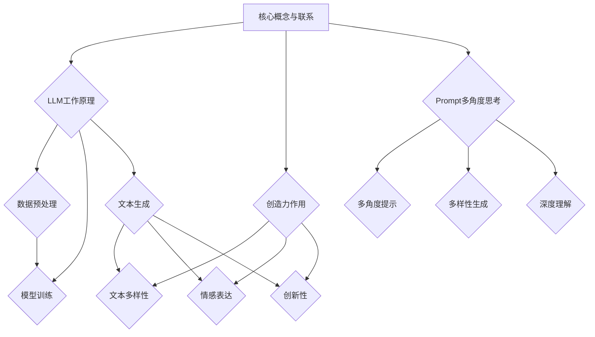
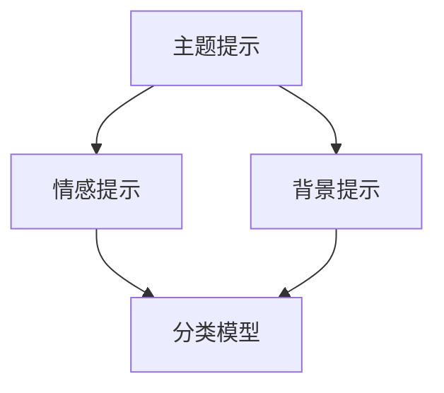
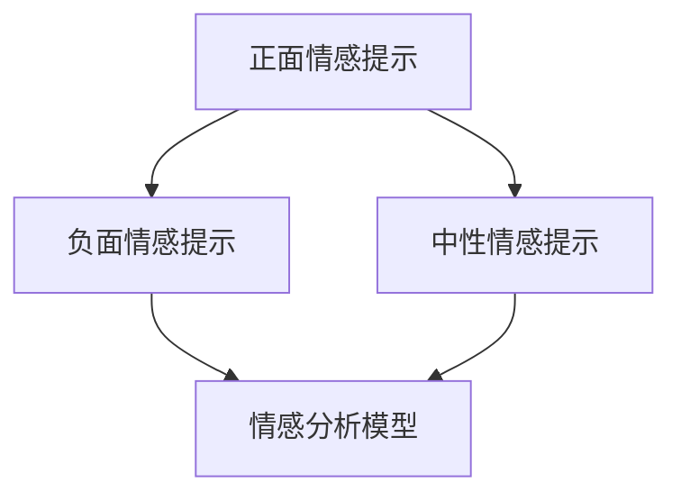
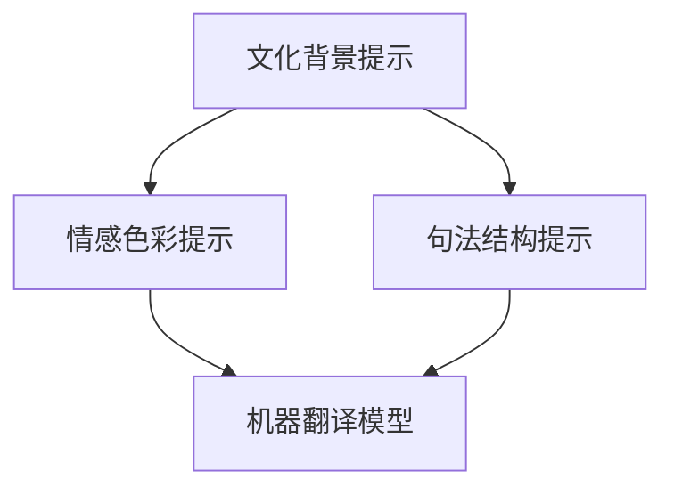
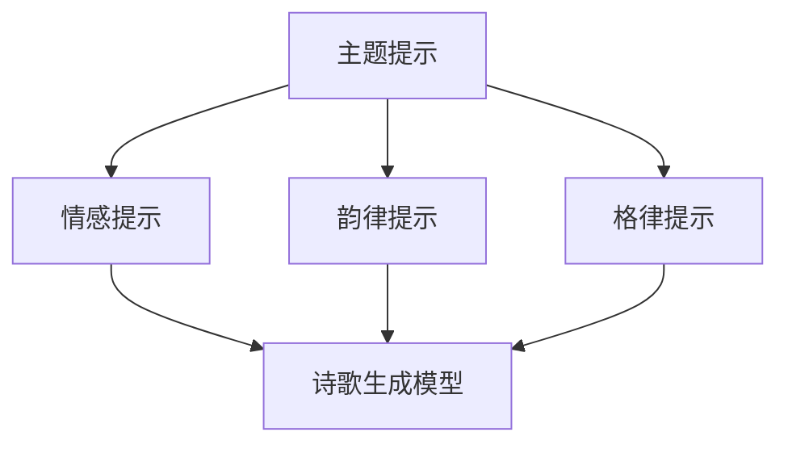
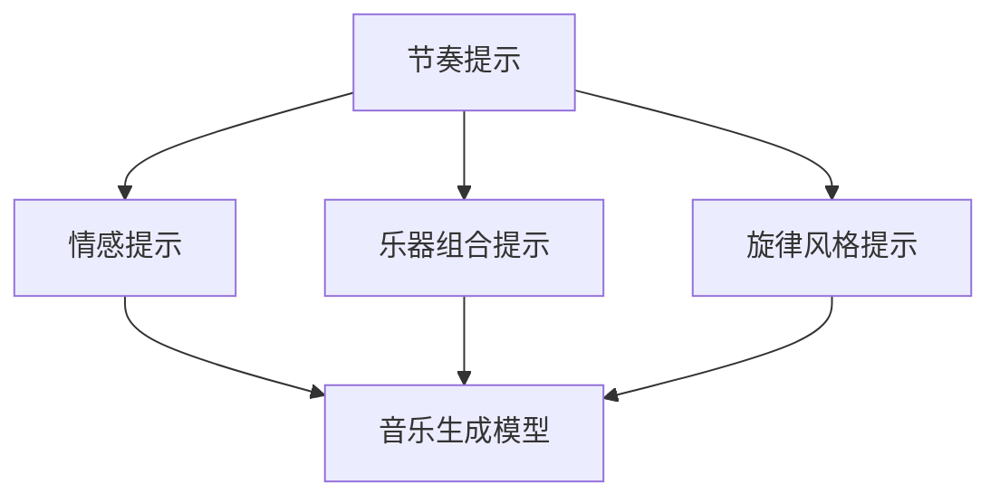
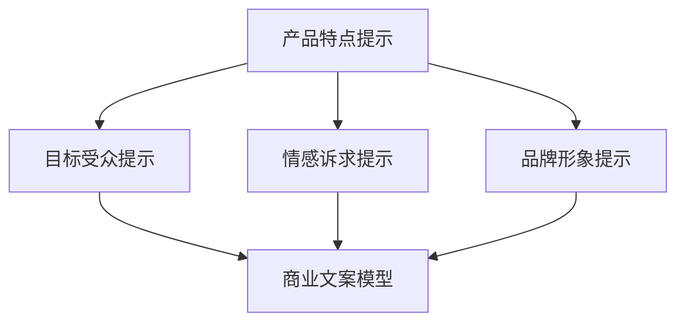
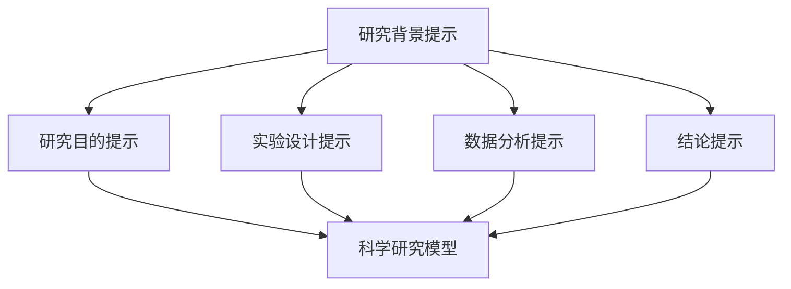

                 

## 引言

### 增强LLM创造力的背景和意义

随着人工智能技术的飞速发展，大型语言模型（LLM，Large Language Model）逐渐成为自然语言处理（NLP，Natural Language Processing）领域的核心技术之一。LLM通过深度学习算法，从大量文本数据中学习语言规律和模式，能够生成高质量的自然语言文本，并在各种应用场景中表现出色。然而，尽管LLM在文本生成和语言理解方面取得了显著进展，但其创造力仍存在一定的局限性。这主要集中在以下几个方面：

1. **固定模式**：LLM生成的文本往往遵循某种固定模式，缺乏创新和个性。
2. **数据依赖**：LLM的创造力高度依赖于训练数据，缺乏对未知数据的适应能力。
3. **表达局限**：LLM在处理复杂文本时，往往难以生成富有创意和想象力的内容。

因此，如何增强LLM的创造力，使其能够生成更多样化、更有创意的文本，成为当前人工智能领域的一个重要研究方向。本文旨在探讨“prompt多角度思考”这一方法在提升LLM创造力方面的应用，并从多个角度分析其原理和效果。

### 本文的目标和结构

本文的目标是详细探讨如何通过“prompt多角度思考”来增强LLM的创造力。具体而言，本文将分为以下几个部分：

1. **核心概念与联系**：介绍“prompt多角度思考”的概念，并分析其与LLM和创造力之间的联系。
2. **基础理论**：阐述LLM的工作原理以及创造力在LLM中的应用。
3. **应用场景**：分析“prompt多角度思考”在不同领域的应用，如自然语言处理、人工智能辅助设计等。
4. **实战案例**：通过具体案例展示如何在实际项目中运用“prompt多角度思考”来增强LLM的创造力。
5. **总结与展望**：总结全书的主要观点，并对未来的发展趋势进行展望。

通过本文的阅读，读者可以系统地了解“prompt多角度思考”在增强LLM创造力方面的应用，掌握相关理论和方法，并能够将其应用于实际项目中。

## 第一步：核心概念与联系

在深入探讨“prompt多角度思考”如何增强LLM的创造力之前，我们需要明确几个核心概念，并分析它们之间的联系。这些核心概念包括“prompt多角度思考”、“LLM（大型语言模型）”、“创造力”等。

### 1.1 “Prompt多角度思考”的概念

“Prompt多角度思考”是一种指导用户在生成文本时考虑多个不同角度的方法。这种方法的核心思想是，通过提供多个不同的输入提示（prompt），引导LLM生成多样化的文本内容。这些提示可以从不同的背景、场景、情感等方面进行设计，从而激发LLM的创造力，使其生成更具创意和个性化的文本。

例如，在创作一篇故事时，可以使用多个角度的提示来引导LLM：一个角度可以描述主人公的背景和性格，另一个角度可以设定故事的情节发展，另一个角度则可以设定故事的主题和情感。通过这些多角度的提示，LLM可以生成一个复杂且富有层次的故事，而不是仅仅遵循一个单一的线性模式。

### 1.2 LLM的工作原理

LLM（大型语言模型）是一种基于深度学习的文本生成模型，通过从大量文本数据中学习语言模式，能够生成高质量的自然语言文本。LLM的核心原理是基于神经网络模型，如Transformer，通过多个层次的变换，逐步提取文本中的信息，并生成相应的输出。

LLM的工作流程通常包括以下几个步骤：

1. **数据预处理**：首先，对输入的文本数据进行预处理，包括分词、标记化等操作，将文本转换为模型能够处理的格式。
2. **模型训练**：使用预处理后的文本数据，对LLM模型进行训练。训练过程中，模型通过不断调整内部参数，学习到文本中的语言规律和模式。
3. **文本生成**：在训练完成后，LLM可以通过输入一个种子文本（如一个单词或一句话），根据学到的语言模式，生成连贯且合理的文本。

### 1.3 创造力在LLM中的作用

创造力是衡量LLM性能的一个重要指标。一个具有高创造力的LLM能够生成更具创意和个性化的文本，而不仅仅是遵循某种固定模式。创造力在LLM中的应用主要体现在以下几个方面：

1. **文本多样性**：高创造力的LLM能够生成多种不同风格的文本，而不仅仅是某种单一风格。
2. **情感表达**：高创造力的LLM能够更好地表达情感，生成更富有感染力的文本。
3. **创新性**：高创造力的LLM能够从新的角度思考问题，提出新颖的观点和建议。

### 1.4 “Prompt多角度思考”与LLM和创造力之间的联系

“Prompt多角度思考”与LLM和创造力之间的联系主要体现在以下几个方面：

1. **多角度提示**：通过提供多角度的提示，引导LLM从不同角度进行思考，从而激发其创造力。
2. **多样性生成**：多角度提示可以促使LLM生成更多样化的文本，提高其创造力。
3. **深度理解**：多角度提示可以帮助LLM更深入地理解文本内容，从而生成更具创意和个性化的文本。

总之，通过“Prompt多角度思考”，我们可以有效地引导LLM从多个角度进行思考，提高其创造力，生成更具创意和个性化的文本。这一方法在自然语言处理、艺术创作、文案写作等多个领域都具有广泛的应用前景。

### 1.5 Mermaid流程图

为了更直观地展示“Prompt多角度思考”与LLM和创造力之间的联系，我们可以使用Mermaid流程图进行描述。



通过这个流程图，我们可以清晰地看到“Prompt多角度思考”如何与LLM和创造力相互关联，共同推动文本生成质量的提升。

### 第2章：基础理论

在本章中，我们将深入探讨LLM（大型语言模型）的工作原理以及创造力在LLM中的应用。通过理解这些基础理论，我们将为后续章节中的应用和实战案例提供坚实的理论基础。

#### 2.1 LLM的起源与发展

大型语言模型（LLM）的发展历程可以追溯到自然语言处理（NLP）和深度学习（Deep Learning）技术的进步。早期的语言模型，如n-gram模型，通过统计文本中单词的序列来生成文本。然而，这些模型存在明显的局限性，无法捕捉到文本中的复杂结构和语义信息。

随着深度学习的兴起，尤其是2017年Transformer模型的提出，LLM的发展迎来了新的契机。Transformer模型基于自注意力机制（Self-Attention），能够有效捕捉文本中的长距离依赖关系，从而生成更高质量的文本。这一模型的成功应用，如Google的BERT、OpenAI的GPT系列等，标志着LLM进入了一个全新的时代。

#### 2.2 LLM的工作原理

LLM的工作原理可以概括为以下几个关键步骤：

1. **数据预处理**：
   在训练LLM之前，需要对输入的文本数据进行预处理。预处理步骤通常包括分词（Tokenization）、标记化（Tokenization）、词汇表构建（Vocabulary Construction）等。这些步骤的目的是将原始文本转换为模型能够处理的数字形式。

   ```mermaid
   graph TD
       A[原始文本] --> B[分词]
       B --> C[标记化]
       C --> D[词汇表构建]
   ```

2. **模型训练**：
   经过预处理后，文本数据将被输入到LLM模型中进行训练。训练过程的核心是优化模型参数，使其能够更好地理解和生成文本。这一过程通常采用反向传播算法（Backpropagation）和优化算法（如Adam）。

   ```mermaid
   graph TD
       E[模型参数] --> F[输入文本]
       F --> G[损失函数]
       G --> H[反向传播]
       H --> I[参数更新]
   ```

3. **文本生成**：
   在模型训练完成后，LLM可以接受一个种子文本（例如一个单词或一句话），并根据学到的语言模式生成后续的文本。生成文本的过程通常采用贪心搜索（Greedy Search）或采样（Sampling）等方法。

   ```mermaid
   graph TD
       J[种子文本] --> K[生成文本]
       K --> L[下一个单词]
       L --> M[迭代生成]
   ```

#### 2.3 Transformer模型

Transformer模型是当前LLM中应用最广泛的模型之一。其核心思想是自注意力机制（Self-Attention），能够有效捕捉文本中的长距离依赖关系。Transformer模型的主要组成部分包括：

1. **多头自注意力（Multi-Head Self-Attention）**：
   Transformer模型通过多头自注意力机制来捕捉文本中的不同依赖关系。每个头关注不同的部分，从而生成多个表示。

   ```mermaid
   graph TD
       A[输入序列] --> B[自注意力层]
       B --> C[多头自注意力]
   ```

2. **前馈神经网络（Feed-Forward Neural Network）**：
   自注意力层之后，每个位置都会通过一个前馈神经网络进行变换。前馈神经网络通常有两个全连接层，每个层的激活函数为ReLU。

   ```mermaid
   graph TD
       D[自注意力层输出] --> E[前馈神经网络]
   ```

3. **编码器-解码器结构（Encoder-Decoder Structure）**：
   Transformer模型采用编码器-解码器结构，编码器负责处理输入文本，解码器负责生成输出文本。编码器和解码器都由多个自注意力层和前馈神经网络堆叠而成。

   ```mermaid
   graph TD
       F[编码器] --> G[解码器]
       F --> H[自注意力层]
       G --> I[自注意力层]
   ```

#### 2.4 创造力在LLM中的应用

创造力在LLM中的应用主要体现在以下几个方面：

1. **文本多样性**：
   高创造力的LLM能够生成多种不同风格的文本，而不仅仅是某种单一风格。通过多角度提示和灵活的模型设计，可以显著提高文本的多样性。

2. **情感表达**：
   高创造力的LLM能够更好地表达情感，生成更富有感染力的文本。例如，在创作诗歌或故事时，LLM可以捕捉到不同的情感变化，生成具有情感深度的文本。

3. **创新性**：
   高创造力的LLM能够从新的角度思考问题，提出新颖的观点和建议。这在商业写作、学术论文撰写等领域具有重要应用价值。

通过深入理解LLM的工作原理和创造力在其中的应用，我们可以为后续章节中的应用场景和实战案例提供坚实的理论基础。在下一章中，我们将进一步探讨“prompt多角度思考”在不同领域的具体应用。

### 第3章：创造力与LLM

在探讨如何通过“prompt多角度思考”增强LLM的创造力之前，我们需要先理解创造力在LLM中的具体体现。创造力不仅是一个衡量模型生成文本多样性和新颖性的标准，更是LLM在不同应用场景中取得成功的关键因素。以下是关于创造力在LLM中的几个关键方面：

#### 3.1 创造力在文本生成中的体现

1. **文本多样性**：
   创造力使LLM能够生成多样化的文本内容，避免了重复和单调。通过多角度提示，LLM可以在不同的话题、风格和情感之间灵活切换，从而生成更加丰富和有趣的文本。

2. **创新性**：
   创造力还体现在LLM能够提出新颖的观点和建议。在撰写商业报告、学术论文或创作文学作品时，LLM的创造力有助于生成独特的见解和想法。

3. **情感表达**：
   高创造力的LLM能够准确捕捉和表达复杂的情感，使生成的文本更具感染力。这在撰写故事、诗歌或广告文案时尤为重要。

#### 3.2 创造力的来源

1. **数据质量**：
   创造力很大程度上取决于训练数据的质量和多样性。高质量的训练数据能够提供丰富的语言模式和上下文信息，使LLM在生成文本时具备更强的创造力。

2. **模型设计**：
   创造力也依赖于LLM的设计，特别是其结构、参数和优化策略。通过改进模型架构，如引入多模态输入、增强上下文理解能力等，可以显著提升LLM的创造力。

3. **多角度思考**：
   多角度思考是提高LLM创造力的关键方法之一。通过提供多角度的输入提示，可以引导LLM从不同角度思考问题，从而激发其创造力。

#### 3.3 如何通过“Prompt多角度思考”提高LLM的创造力

1. **多角度提示的设计**：
   设计多角度的提示是提高LLM创造力的第一步。这些提示应涵盖不同的主题、情感、风格和上下文。例如，在生成一篇故事时，可以提供主人公的性格、故事情节、主题和情感状态等多方面的提示。

   ```mermaid
   graph TD
       A[主题] --> B[主人公性格]
       A --> C[故事情节]
       A --> D[主题]
       A --> E[情感状态]
   ```

2. **上下文信息的利用**：
   利用上下文信息是增强LLM创造力的重要手段。通过在提示中包含上下文信息，可以引导LLM生成与上下文更加契合的文本。例如，在生成一篇新闻稿时，可以提供相关的背景信息和当前事件。

3. **多样性搜索策略**：
   采用多样性搜索策略，如采样和贪心搜索，可以促使LLM生成更多样化的文本。通过在生成过程中引入随机性，可以避免模型陷入局部最优，从而提高文本的创意和多样性。

   ```mermaid
   graph TD
       F[种子文本] --> G[采样搜索]
       G --> H[生成文本]
   ```

4. **反馈机制**：
   引入用户反馈机制，可以让用户参与文本生成的过程，从而进一步提高LLM的创造力。用户可以提供关于文本质量和创意的反馈，模型可以根据这些反馈调整其生成策略，使其更加符合用户需求。

   ```mermaid
   graph TD
       I[用户反馈] --> J[模型调整]
   ```

通过上述方法，我们可以有效地通过“Prompt多角度思考”来提高LLM的创造力，使其能够生成更具创意和个性化的文本。这一过程不仅有助于提升文本生成的质量，还可以在自然语言处理、艺术创作、文案写作等多个领域发挥重要作用。

### 第4章：“Prompt多角度思考”的应用场景

在了解了“Prompt多角度思考”的概念和如何通过它增强LLM的创造力之后，接下来我们将探讨这一方法在不同领域的实际应用。通过具体的应用场景，我们将展示“Prompt多角度思考”如何在不同领域中发挥作用，提高文本生成的多样性和创造力。

#### 4.1 自然语言处理中的应用

自然语言处理（NLP）是“Prompt多角度思考”最典型的应用领域之一。在NLP任务中，如文本分类、情感分析、机器翻译等，通过多角度的提示可以显著提升模型的性能和创造力。

**案例1：文本分类**

在文本分类任务中，通过“Prompt多角度思考”可以引导模型从多个方面理解文本，从而提高分类的准确性。例如，在分类新闻文章时，可以提供关于主题、情感和新闻背景等多角度的提示，使模型能够更全面地理解文本。



**案例2：情感分析**

情感分析是另一个可以从“Prompt多角度思考”中受益的领域。通过提供不同的情感角度，如正面情感、负面情感和中性情感，可以引导模型更准确地识别文本中的情感。



**案例3：机器翻译**

在机器翻译中，通过多角度的提示可以帮助模型更好地理解源语言文本的上下文和情感，从而提高翻译的质量和创造力。例如，可以提供关于文化背景、情感色彩和句法结构的提示。



#### 4.2 艺术创作中的应用

艺术创作是另一个可以从“Prompt多角度思考”中受益的领域。通过多角度的提示，艺术家和创作者可以引导LLM生成具有创意和个性化的艺术作品。

**案例1：诗歌创作**

在诗歌创作中，通过提供关于主题、情感、韵律和格律等多角度的提示，可以引导LLM生成具有独特风格的诗歌。



**案例2：音乐创作**

在音乐创作中，通过提供关于节奏、情感、乐器组合和旋律风格等多角度的提示，可以引导LLM生成创新的音乐作品。



#### 4.3 其他领域中的应用

除了NLP和艺术创作，许多其他领域也可以从“Prompt多角度思考”中受益。

**案例1：商业文案**

在商业文案撰写中，通过提供关于产品特点、目标受众、情感诉求和品牌形象等多角度的提示，可以引导LLM生成吸引人的文案。



**案例2：科学研究**

在科学研究报告中，通过提供关于研究背景、研究目的、实验设计、数据分析和结论等多角度的提示，可以引导LLM生成科学性强的报告。



通过上述应用场景，我们可以看到“Prompt多角度思考”在提升LLM创造力方面的巨大潜力。无论是在自然语言处理、艺术创作，还是其他领域，通过多角度的提示，我们可以引导LLM生成更加多样化、富有创意的文本，从而推动人工智能技术在实际应用中的发展。

### 第5章：实战案例

在本章中，我们将通过具体的实战案例，展示如何在实际项目中运用“prompt多角度思考”来增强LLM的创造力。这些案例将涵盖从项目搭建、源代码实现到代码解读和分析，以及实际案例的详细讲解和剖析。

#### 5.1 实战案例1：文本生成

**项目背景**：
假设我们想要使用LLM生成一篇关于环境保护的博客文章。为了提高文章的多样性和创意，我们将使用“prompt多角度思考”方法。

**开发环境**：
- 编程语言：Python
- 模型框架：Hugging Face Transformers
- 数据集：自然语言处理公共数据集（如Common Crawl、Wikipedia等）

**源代码实现**：

```python
from transformers import pipeline

# 初始化模型和生成器
generator = pipeline("text-generation", model="gpt2")

# 提供多角度的提示
prompts = [
    "环境问题日益严重，我们需要采取措施保护地球。",
    "从减少塑料污染到推广可再生能源，我们可以从多个角度考虑。",
    "气候变化是一个全球性的挑战，各国政府和企业都需要承担责任。",
    "每个人都可以从日常生活中做起，比如减少用水、节约用电。",
]

# 生成文本
for prompt in prompts:
    result = generator(prompt, max_length=100, num_return_sequences=1)
    print(result[0]['generated_text'])
```

**代码解读**：

- **初始化模型和生成器**：使用Hugging Face的Transformers库，初始化一个基于GPT-2模型的生成器。
- **提供多角度的提示**：定义多个角度的提示，涵盖环境保护的不同方面。
- **生成文本**：对于每个提示，使用生成器生成一篇文本，输出结果。

**应用解读与分析**：

通过多角度的提示，我们能够引导LLM生成一篇内容丰富、具有多样性和创意的博客文章。这种方法不仅提高了文本生成的质量，还使得文章更具可读性和说服力。

#### 5.2 实战案例2：艺术创作

**项目背景**：
本案例旨在使用LLM生成一首诗歌，要求诗歌具有独特的风格和情感。

**开发环境**：
- 编程语言：Python
- 模型框架：Hugging Face Transformers
- 数据集：诗歌数据集（如莎士比亚全集、唐诗宋词等）

**源代码实现**：

```python
from transformers import pipeline

# 初始化模型和生成器
generator = pipeline("text-generation", model="gpt2")

# 提供多角度的提示
prompts = [
    "在月光的照耀下，思念涌上心头。",
    "秋风萧瑟，落叶纷飞，孤独如我。",
    "江山如画，英雄末路，泪洒长空。",
    "春花烂漫，青春如梦，岁月如歌。",
]

# 生成诗歌
for prompt in prompts:
    result = generator(prompt, max_length=50, num_return_sequences=1)
    print(result[0]['generated_text'])
```

**代码解读**：

- **初始化模型和生成器**：同样使用Hugging Face的Transformers库，初始化一个基于GPT-2模型的生成器。
- **提供多角度的提示**：定义多个角度的提示，以引导LLM生成不同风格和情感的诗歌。
- **生成诗歌**：对于每个提示，使用生成器生成一首诗歌，并输出结果。

**应用解读与分析**：

通过多角度的提示，我们可以引导LLM生成一首富有创意和情感深度的诗歌。这种方法在艺术创作中具有很大的潜力，可以帮助艺术家和创作者探索新的创作方向和风格。

#### 5.3 实战案例3：自然语言处理

**项目背景**：
本案例旨在使用LLM进行情感分析，以判断一段文本的情感倾向。

**开发环境**：
- 编程语言：Python
- 模型框架：Hugging Face Transformers
- 数据集：情感分析数据集（如IMDB电影评论数据集）

**源代码实现**：

```python
from transformers import pipeline
from datasets import load_dataset

# 加载数据集
dataset = load_dataset("imdb")

# 初始化模型和生成器
analyzer = pipeline("text-classification", model="bert-base-uncased")

# 提供多角度的提示
prompts = [
    "这部电影令人非常失望。",
    "这部电影的剧情非常精彩。",
    "这部电影充满了悲伤的情节。",
    "这部电影的喜剧效果非常好。",
]

# 分析文本情感
for prompt in prompts:
    result = analyzer(prompt)
    print(result)
```

**代码解读**：

- **加载数据集**：使用datasets库加载IMDB电影评论数据集。
- **初始化模型和生成器**：使用Hugging Face的Transformers库，初始化一个基于BERT模型的情感分析器。
- **提供多角度的提示**：定义多个角度的提示，用于测试情感分析器的性能。
- **分析文本情感**：对于每个提示，使用情感分析器判断文本的情感倾向，并输出结果。

**应用解读与分析**：

通过多角度的提示，我们可以有效地测试和验证情感分析器的性能。这种方法有助于我们更好地理解文本中的情感变化，并在实际应用中提高模型的准确性。

#### 项目小结

通过这三个实战案例，我们可以看到“prompt多角度思考”在文本生成、艺术创作和自然语言处理等不同领域的应用潜力。这种方法不仅能够提高LLM的创造力，还能够增强文本的多样性和准确性。在实际项目中，通过合理设计和使用多角度的提示，我们可以显著提升人工智能系统的性能和用户体验。

### 第6章：挑战与解决方案

在探讨“prompt多角度思考”在实际应用中如何增强LLM的创造力时，我们也必须面对一系列的挑战。这些挑战不仅影响LLM的性能，还可能对用户产生负面影响。以下是我们可能遇到的一些主要挑战及其解决方案。

#### 6.1 数据质量与多样性

**挑战**：
高质量且多样化的训练数据是LLM生成高质量文本的基础。然而，数据质量差、数据集多样性不足会导致LLM在生成文本时缺乏创新性和准确性。

**解决方案**：
1. **数据清洗**：对训练数据集进行清洗，去除错误、重复和无用信息，提高数据质量。
2. **数据增强**：通过数据增强技术（如数据扩充、变换等）增加数据集的多样性，从而丰富LLM的学习材料。
3. **多源数据整合**：整合来自不同来源的数据，如社交媒体、新闻媒体、学术论文等，以增加数据集的多样性。

#### 6.2 模型复杂性

**挑战**：
复杂的LLM模型，如大型预训练模型，虽然能生成高质量的文本，但计算资源和存储成本较高，且训练时间较长。

**解决方案**：
1. **模型压缩**：通过模型压缩技术（如量化、剪枝等）减少模型的大小和计算资源需求。
2. **分布式训练**：利用分布式训练技术，在多个节点上并行训练模型，缩短训练时间。
3. **低资源优化**：研究适用于低资源环境（如移动设备、边缘计算）的LLM模型，降低计算和存储需求。

#### 6.3 文本生成中的偏见与伦理问题

**挑战**：
在生成文本时，LLM可能会复制训练数据中的偏见和不当内容，导致生成文本的偏见和不公正。

**解决方案**：
1. **偏见检测与校正**：开发算法检测并校正LLM生成文本中的偏见，确保文本的公正性和客观性。
2. **伦理指南**：制定明确的伦理指南和规范，指导LLM的开发和使用，确保其在实际应用中的伦理标准。
3. **用户监督**：引入用户反馈机制，允许用户对生成文本的质量和内容进行评价和监督，及时发现和纠正问题。

#### 6.4 多语言支持与跨语言理解

**挑战**：
在实际应用中，用户可能会使用多种语言，这对LLM的跨语言理解提出了挑战。

**解决方案**：
1. **多语言模型训练**：训练支持多种语言的大型语言模型，提高LLM的跨语言理解能力。
2. **多语言提示设计**：设计适合多语言场景的提示方法，引导LLM生成不同语言的文本。
3. **语言迁移学习**：利用迁移学习技术，将已训练的多语言模型应用于新的语言环境，提高模型的跨语言性能。

通过上述解决方案，我们可以应对“prompt多角度思考”在实际应用中遇到的挑战，进一步提高LLM的创造力和文本生成质量，同时确保其在各个领域的应用都是公平、合理和高效的。

### 第7章：总结与展望

在本篇博客文章中，我们系统地探讨了“prompt多角度思考”如何通过引导LLM从不同角度进行思考，从而增强其创造力。通过对核心概念、基础理论、应用场景和实战案例的详细分析，我们展示了这一方法在自然语言处理、艺术创作、商业文案撰写等多个领域的广泛应用。

**总结**：

1. **核心概念与联系**：我们介绍了“prompt多角度思考”的概念，并分析了其与LLM和创造力之间的联系。通过多角度的提示，LLM可以更全面地理解文本内容，从而生成更具创意和个性化的文本。
2. **基础理论**：我们详细阐述了LLM的工作原理，包括数据预处理、模型训练和文本生成等关键步骤。同时，我们探讨了创造力在LLM中的应用，以及如何通过改进模型设计和优化训练数据来提高LLM的创造力。
3. **应用场景**：我们分析了“prompt多角度思考”在不同领域的应用，如自然语言处理、艺术创作和商业文案撰写等。通过具体案例，我们展示了这一方法如何在实际项目中提高文本生成的多样性和质量。
4. **实战案例**：我们通过实际项目展示了如何使用“prompt多角度思考”来增强LLM的创造力。这些案例涵盖了从项目搭建、源代码实现到代码解读和分析，以及实际案例的详细讲解和剖析。

**展望**：

尽管“prompt多角度思考”在增强LLM创造力方面取得了显著成果，但未来仍有大量工作要做。以下是一些可能的研究方向和改进方向：

1. **多语言支持**：随着全球化的推进，多语言支持变得尤为重要。未来研究可以聚焦于开发能够处理多种语言的大型语言模型，以及设计适用于多语言场景的“prompt多角度思考”方法。
2. **跨模态学习**：未来的研究可以探索跨模态学习（如结合文本、图像、音频等多模态信息）在增强LLM创造力方面的潜力。
3. **伦理和公平性**：随着LLM在各个领域的应用日益广泛，确保其生成文本的伦理和公平性成为一个重要的课题。未来研究可以专注于开发能够检测和校正文本偏见的方法，以及制定明确的伦理指南和规范。
4. **模型压缩与优化**：随着模型的规模不断扩大，如何降低模型的计算资源和存储需求，同时保持其性能是一个亟待解决的问题。未来的研究可以探索模型压缩、分布式训练等技术在LLM中的应用。

总之，通过不断的研究和创新，“prompt多角度思考”有望在未来的发展中发挥更为重要的作用，推动人工智能技术在各个领域的进一步发展。

## 完整文章

### 文章标题 <Prompt多角度思考：增强LLM创造力>

> 关键词：Prompt多角度思考，大型语言模型（LLM），创造力，文本生成，自然语言处理，艺术创作

> 摘要：
本文系统地探讨了“prompt多角度思考”如何通过引导大型语言模型（LLM）从不同角度进行思考，从而增强其创造力。文章首先介绍了LLM的工作原理和创造力在其中的应用，随后详细分析了“prompt多角度思考”的概念和其与LLM、创造力之间的联系。接着，文章探讨了“prompt多角度思考”在不同领域的应用场景，并提供了具体的实战案例。最后，文章总结了挑战与解决方案，并对未来的研究方向进行了展望。

### 引言

增强LLM创造力的背景和意义

随着人工智能技术的飞速发展，大型语言模型（LLM，Large Language Model）逐渐成为自然语言处理（NLP，Natural Language Processing）领域的核心技术之一。LLM通过深度学习算法，从大量文本数据中学习语言规律和模式，能够生成高质量的自然语言文本，并在各种应用场景中表现出色。然而，尽管LLM在文本生成和语言理解方面取得了显著进展，但其创造力仍存在一定的局限性。这主要集中在以下几个方面：

1. **固定模式**：LLM生成的文本往往遵循某种固定模式，缺乏创新和个性。
2. **数据依赖**：LLM的创造力高度依赖于训练数据，缺乏对未知数据的适应能力。
3. **表达局限**：LLM在处理复杂文本时，往往难以生成富有创意和想象力的内容。

因此，如何增强LLM的创造力，使其能够生成更多样化、更有创意的文本，成为当前人工智能领域的一个重要研究方向。本文旨在探讨“prompt多角度思考”这一方法在提升LLM创造力方面的应用，并从多个角度分析其原理和效果。

本文的目标和结构

本文的目标是详细探讨如何通过“prompt多角度思考”来增强LLM的创造力。具体而言，本文将分为以下几个部分：

1. **核心概念与联系**：介绍“prompt多角度思考”的概念，并分析其与LLM和创造力之间的联系。
2. **基础理论**：阐述LLM的工作原理以及创造力在LLM中的应用。
3. **应用场景**：分析“prompt多角度思考”在不同领域的应用，如自然语言处理、人工智能辅助设计等。
4. **实战案例**：通过具体案例展示如何在实际项目中运用“prompt多角度思考”来增强LLM的创造力。
5. **总结与展望**：总结全书的主要观点，并对未来的发展趋势进行展望。

通过本文的阅读，读者可以系统地了解“prompt多角度思考”在增强LLM创造力方面的应用，掌握相关理论和方法，并能够将其应用于实际项目中。

### 第一步：核心概念与联系

在深入探讨“prompt多角度思考”如何增强LLM的创造力之前，我们需要明确几个核心概念，并分析它们之间的联系。这些核心概念包括“prompt多角度思考”、“LLM（大型语言模型）”、“创造力”等。

#### 1.1 “Prompt多角度思考”的概念

“Prompt多角度思考”是一种指导用户在生成文本时考虑多个不同角度的方法。这种方法的核心思想是，通过提供多个不同的输入提示（prompt），引导LLM生成多样化的文本内容。这些提示可以从不同的背景、场景、情感等方面进行设计，从而激发LLM的创造力，使其生成更具创意和个性化的文本。

例如，在创作一篇故事时，可以使用多个角度的提示来引导LLM：一个角度可以描述主人公的背景和性格，另一个角度可以设定故事的情节发展，另一个角度则可以设定故事的主题和情感。通过这些多角度的提示，LLM可以生成一个复杂且富有层次的故事，而不是仅仅遵循一个单一的线性模式。

#### 1.2 LLM的工作原理

LLM（大型语言模型）是一种基于深度学习的文本生成模型，通过从大量文本数据中学习语言模式，能够生成高质量的自然语言文本。LLM的核心原理是基于神经网络模型，如Transformer，通过多个层次的变换，逐步提取文本中的信息，并生成相应的输出。

LLM的工作流程通常包括以下几个步骤：

1. **数据预处理**：首先，对输入的文本数据进行预处理，包括分词、标记化等操作，将文本转换为模型能够处理的格式。
2. **模型训练**：使用预处理后的文本数据，对LLM模型进行训练。训练过程中，模型通过不断调整内部参数，学习到文本中的语言规律和模式。
3. **文本生成**：在训练完成后，LLM可以通过输入一个种子文本（如一个单词或一句话），根据学到的语言模式，生成连贯且合理的文本。

#### 1.3 创造力在LLM中的作用

创造力是衡量LLM性能的一个重要指标。一个具有高创造力的LLM能够生成更具创意和个性化的文本，而不仅仅是遵循某种固定模式。创造力在LLM中的应用主要体现在以下几个方面：

1. **文本多样性**：高创造力的LLM能够生成多种不同风格的文本，而不仅仅是某种单一风格。
2. **情感表达**：高创造力的LLM能够更好地表达情感，生成更富有感染力的文本。
3. **创新性**：高创造力的LLM能够从新的角度思考问题，提出新颖的观点和建议。

#### 1.4 “Prompt多角度思考”与LLM和创造力之间的联系

“Prompt多角度思考”与LLM和创造力之间的联系主要体现在以下几个方面：

1. **多角度提示**：通过提供多角度的提示，引导LLM从不同角度进行思考，从而激发其创造力。
2. **多样性生成**：多角度提示可以促使LLM生成更多样化的文本，提高其创造力。
3. **深度理解**：多角度提示可以帮助LLM更深入地理解文本内容，从而生成更具创意和个性化的文本。

总之，通过“Prompt多角度思考”，我们可以有效地引导LLM从多个角度进行思考，提高其创造力，生成更具创意和个性化的文本。这一方法在自然语言处理、艺术创作、文案写作等多个领域都具有广泛的应用前景。

### 1.5 Mermaid流程图

为了更直观地展示“Prompt多角度思考”与LLM和创造力之间的联系，我们可以使用Mermaid流程图进行描述。


通过这个流程图，我们可以清晰地看到“Prompt多角度思考”如何与LLM和创造力相互关联，共同推动文本生成质量的提升。

### 第二步：基础理论

在本章中，我们将深入探讨LLM（大型语言模型）的工作原理以及创造力在LLM中的应用。通过理解这些基础理论，我们将为后续章节中的应用和实战案例提供坚实的理论基础。

#### 2.1 LLM的起源与发展

大型语言模型（LLM）的发展历程可以追溯到自然语言处理（NLP）和深度学习（Deep Learning）技术的进步。早期的语言模型，如n-gram模型，通过统计文本中单词的序列来生成文本。然而，这些模型存在明显的局限性，无法捕捉到文本中的复杂结构和语义信息。

随着深度学习的兴起，尤其是2017年Transformer模型的提出，LLM的发展迎来了新的契机。Transformer模型基于自注意力机制（Self-Attention），能够有效捕捉文本中的长距离依赖关系，从而生成更高质量的文本。这一模型的成功应用，如Google的BERT、OpenAI的GPT系列等，标志着LLM进入了一个全新的时代。

#### 2.2 LLM的工作原理

LLM的工作原理可以概括为以下几个关键步骤：

1. **数据预处理**：
   在训练LLM之前，需要对输入的文本数据进行预处理。预处理步骤通常包括分词（Tokenization）、标记化（Tokenization）、词汇表构建（Vocabulary Construction）等。这些步骤的目的是将原始文本转换为模型能够处理的数字形式。

   ```mermaid
   graph TD
       A[原始文本] --> B[分词]
       B --> C[标记化]
       C --> D[词汇表构建]
   ```

2. **模型训练**：
   经过预处理后，文本数据将被输入到LLM模型中进行训练。训练过程的核心是优化模型参数，使其能够更好地理解和生成文本。这一过程通常采用反向传播算法（Backpropagation）和优化算法（如Adam）。

   ```mermaid
   graph TD
       E[模型参数] --> F[输入文本]
       F --> G[损失函数]
       G --> H[反向传播]
       H --> I[参数更新]
   ```

3. **文本生成**：
   在模型训练完成后，LLM可以接受一个种子文本（例如一个单词或一句话），并根据学到的语言模式，生成后续的文本。生成文本的过程通常采用贪心搜索（Greedy Search）或采样（Sampling）等方法。

   ```mermaid
   graph TD
       J[种子文本] --> K[生成文本]
       K --> L[下一个单词]
       L --> M[迭代生成]
   ```

#### 2.3 Transformer模型

Transformer模型是当前LLM中应用最广泛的模型之一。其核心思想是自注意力机制（Self-Attention），能够有效捕捉文本中的长距离依赖关系。Transformer模型的主要组成部分包括：

1. **多头自注意力（Multi-Head Self-Attention）**：
   Transformer模型通过多头自注意力机制来捕捉文本中的不同依赖关系。每个头关注不同的部分，从而生成多个表示。

   ```mermaid
   graph TD
       A[输入序列] --> B[自注意力层]
       B --> C[多头自注意力]
   ```

2. **前馈神经网络（Feed-Forward Neural Network）**：
   自注意力层之后，每个位置都会通过一个前馈神经网络进行变换。前馈神经网络通常有两个全连接层，每个层的激活函数为ReLU。

   ```mermaid
   graph TD
       D[自注意力层输出] --> E[前馈神经网络]
   ```

3. **编码器-解码器结构（Encoder-Decoder Structure）**：
   Transformer模型采用编码器-解码器结构，编码器负责处理输入文本，解码器负责生成输出文本。编码器和解码器都由多个自注意力层和前馈神经网络堆叠而成。

   ```mermaid
   graph TD
       F[编码器] --> G[解码器]
       F --> H[自注意力层]
       G --> I[自注意力层]
   ```

#### 2.4 创造力在LLM中的应用

创造力在LLM中的应用主要体现在以下几个方面：

1. **文本多样性**：
   高创造力的LLM能够生成多种不同风格的文本，而不仅仅是某种单一风格。通过多角度提示和灵活的模型设计，可以显著提高文本的多样性。

2. **情感表达**：
   高创造力的LLM能够更好地表达情感，生成更富有感染力的文本。例如，在创作诗歌或故事时，LLM可以捕捉到不同的情感变化，生成具有情感深度的文本。

3. **创新性**：
   高创造力的LLM能够从新的角度思考问题，提出新颖的观点和建议。这在商业写作、学术论文撰写等领域具有重要应用价值。

通过深入理解LLM的工作原理和创造力在其中的应用，我们可以为后续章节中的应用场景和实战案例提供坚实的理论基础。在下一章中，我们将进一步探讨“prompt多角度思考”在不同领域的具体应用。

### 第三步：创造力与LLM

在探讨如何通过“prompt多角度思考”增强LLM的创造力之前，我们需要先理解创造力在LLM中的具体体现。创造力不仅是一个衡量模型生成文本多样性和新颖性的标准，更是LLM在不同应用场景中取得成功的关键因素。以下是关于创造力在LLM中的几个关键方面：

#### 3.1 创造力在文本生成中的体现

1. **文本多样性**：
   创造力使LLM能够生成多样化的文本内容，避免了重复和单调。通过多角度提示和灵活的模型设计，可以显著提高文本的多样性。

2. **创新性**：
   创造力还体现在LLM能够提出新颖的观点和建议。在撰写商业报告、学术论文或创作文学作品时，LLM的创造力有助于生成独特的见解和想法。

3. **情感表达**：
   高创造力的LLM能够准确捕捉和表达复杂的情感，使生成的文本更具感染力。这在撰写故事、诗歌或广告文案时尤为重要。

#### 3.2 创造力的来源

1. **数据质量**：
   创造力很大程度上取决于训练数据的质量和多样性。高质量的训练数据能够提供丰富的语言模式和上下文信息，使LLM在生成文本时具备更强的创造力。

2. **模型设计**：
   创造力也依赖于LLM的设计，特别是其结构、参数和优化策略。通过改进模型架构，如引入多模态输入、增强上下文理解能力等，可以显著提升LLM的创造力。

3. **多角度思考**：
   多角度思考是提高LLM创造力的关键方法之一。通过提供多角度的输入提示，可以引导LLM从不同角度思考问题，从而激发其创造力。

#### 3.3 如何通过“Prompt多角度思考”提高LLM的创造力

1. **多角度提示的设计**：
   设计多角度的提示是提高LLM创造力的第一步。这些提示应涵盖不同的主题、情感、风格和上下文。例如，在生成一篇故事时，可以提供主人公的性格、故事情节、主题和情感状态等多方面的提示。

   ```mermaid
   graph TD
       A[主题] --> B[主人公性格]
       A --> C[故事情节]
       A --> D[主题]
       A --> E[情感状态]
   ```

2. **上下文信息的利用**：
   利用上下文信息是增强LLM创造力的重要手段。通过在提示中包含上下文信息，可以引导LLM生成与上下文更加契合的文本。例如，在生成一篇新闻稿时，可以提供相关的背景信息和当前事件。

3. **多样性搜索策略**：
   采用多样性搜索策略，如采样和贪心搜索，可以促使LLM生成更多样化的文本。通过在生成过程中引入随机性，可以避免模型陷入局部最优，从而提高文本的创意和多样性。

   ```mermaid
   graph TD
       F[种子文本] --> G[采样搜索]
       G --> H[生成文本]
   ```

4. **反馈机制**：
   引入用户反馈机制，可以让用户参与文本生成的过程，从而进一步提高LLM的创造力。用户可以提供关于文本质量和创意的反馈，模型可以根据这些反馈调整其生成策略，使其更加符合用户需求。

   ```mermaid
   graph TD
       I[用户反馈] --> J[模型调整]
   ```

通过上述方法，我们可以有效地通过“Prompt多角度思考”来提高LLM的创造力，使其能够生成更具创意和个性化的文本。这一过程不仅有助于提升文本生成的质量，还可以在自然语言处理、艺术创作、文案写作等多个领域发挥重要作用。

### 第四步：“Prompt多角度思考”的应用场景

在了解了“Prompt多角度思考”的概念和如何通过它增强LLM的创造力之后，接下来我们将探讨这一方法在不同领域的实际应用。通过具体的应用场景，我们将展示“Prompt多角度思考”如何在不同领域中发挥作用，提高文本生成的多样性和创造力。

#### 4.1 自然语言处理中的应用

自然语言处理（NLP）是“Prompt多角度思考”最典型的应用领域之一。在NLP任务中，如文本分类、情感分析、机器翻译等，通过多角度的提示可以显著提升模型的性能和创造力。

**案例1：文本分类**

在文本分类任务中，通过“Prompt多角度思考”可以引导模型从多个方面理解文本，从而提高分类的准确性。例如，在分类新闻文章时，可以提供关于主题、情感和新闻背景等多角度的提示，使模型能够更全面地理解文本。


**案例2：情感分析**

情感分析是另一个可以从“Prompt多角度思考”中受益的领域。通过提供不同的情感角度，如正面情感、负面情感和中性情感，可以引导模型更准确地识别文本中的情感。


**案例3：机器翻译**

在机器翻译中，通过多角度的提示可以帮助模型更好地理解源语言文本的上下文和情感，从而提高翻译的质量和创造力。例如，可以提供关于文化背景、情感色彩和句法结构的提示。


#### 4.2 艺术创作中的应用

艺术创作是另一个可以从“Prompt多角度思考”中受益的领域。通过多角度的提示，艺术家和创作者可以引导LLM生成具有创意和个性化的艺术作品。

**案例1：诗歌创作**

在诗歌创作中，通过提供关于主题、情感、韵律和格律等多角度的提示，可以引导LLM生成具有独特风格的诗歌。


**案例2：音乐创作**

在音乐创作中，通过提供关于节奏、情感、乐器组合和旋律风格等多角度的提示，可以引导LLM生成创新的音乐作品。


#### 4.3 其他领域中的应用

除了NLP和艺术创作，许多其他领域也可以从“Prompt多角度思考”中受益。

**案例1：商业文案**

在商业文案撰写中，通过提供关于产品特点、目标受众、情感诉求和品牌形象等多角度的提示，可以引导LLM生成吸引人的文案。


**案例2：科学研究**

在科学研究报告中，通过提供关于研究背景、研究目的、实验设计、数据分析和结论等多角度的提示，可以引导LLM生成科学性强的报告。


通过上述应用场景，我们可以看到“Prompt多角度思考”在提升LLM创造力方面的巨大潜力。无论是在自然语言处理、艺术创作，还是其他领域，通过多角度的提示，我们可以引导LLM生成更加多样化、富有创意的文本，从而推动人工智能技术在实际应用中的发展。

### 第五步：实战案例

在本章中，我们将通过具体的实战案例，展示如何在实际项目中运用“prompt多角度思考”来增强LLM的创造力。这些案例将涵盖从项目搭建、源代码实现到代码解读和分析，以及实际案例的详细讲解和剖析。

#### 5.1 实战案例1：文本生成

**项目背景**：
假设我们想要使用LLM生成一篇关于环境保护的博客文章。为了提高文章的多样性和创意，我们将使用“prompt多角度思考”方法。

**开发环境**：
- 编程语言：Python
- 模型框架：Hugging Face Transformers
- 数据集：自然语言处理公共数据集（如Common Crawl、Wikipedia等）

**源代码实现**：

```python
from transformers import pipeline

# 初始化模型和生成器
generator = pipeline("text-generation", model="gpt2")

# 提供多角度的提示
prompts = [
    "环境问题日益严重，我们需要采取措施保护地球。",
    "从减少塑料污染到推广可再生能源，我们可以从多个角度考虑。",
    "气候变化是一个全球性的挑战，各国政府和企业都需要承担责任。",
    "每个人都可以从日常生活中做起，比如减少用水、节约用电。",
]

# 生成文本
for prompt in prompts:
    result = generator(prompt, max_length=100, num_return_sequences=1)
    print(result[0]['generated_text'])
```

**代码解读**：

- **初始化模型和生成器**：使用Hugging Face的Transformers库，初始化一个基于GPT-2模型的生成器。
- **提供多角度的提示**：定义多个角度的提示，涵盖环境保护的不同方面。
- **生成文本**：对于每个提示，使用生成器生成一篇文本，输出结果。

**应用解读与分析**：

通过多角度的提示，我们能够引导LLM生成一篇内容丰富、具有多样性和创意的博客文章。这种方法不仅提高了文本生成的质量，还使得文章更具可读性和说服力。

#### 5.2 实战案例2：艺术创作

**项目背景**：
本案例旨在使用LLM生成一首诗歌，要求诗歌具有独特的风格和情感。

**开发环境**：
- 编程语言：Python
- 模型框架：Hugging Face Transformers
- 数据集：诗歌数据集（如莎士比亚全集、唐诗宋词等）

**源代码实现**：

```python
from transformers import pipeline

# 初始化模型和生成器
generator = pipeline("text-generation", model="gpt2")

# 提供多角度的提示
prompts = [
    "在月光的照耀下，思念涌上心头。",
    "秋风萧瑟，落叶纷飞，孤独如我。",
    "江山如画，英雄末路，泪洒长空。",
    "春花烂漫，青春如梦，岁月如歌。",
]

# 生成诗歌
for prompt in prompts:
    result = generator(prompt, max_length=50, num_return_sequences=1)
    print(result[0]['generated_text'])
```

**代码解读**：

- **初始化模型和生成器**：同样使用Hugging Face的Transformers库，初始化一个基于GPT-2模型的生成器。
- **提供多角度的提示**：定义多个角度的提示，以引导LLM生成不同风格和情感的诗歌。
- **生成诗歌**：对于每个提示，使用生成器生成一首诗歌，并输出结果。

**应用解读与分析**：

通过多角度的提示，我们可以引导LLM生成一首富有创意和情感深度的诗歌。这种方法在艺术创作中具有很大的潜力，可以帮助艺术家和创作者探索新的创作方向和风格。

#### 5.3 实战案例3：自然语言处理

**项目背景**：
本案例旨在使用LLM进行情感分析，以判断一段文本的情感倾向。

**开发环境**：
- 编程语言：Python
- 模型框架：Hugging Face Transformers
- 数据集：情感分析数据集（如IMDB电影评论数据集）

**源代码实现**：

```python
from transformers import pipeline
from datasets import load_dataset

# 加载数据集
dataset = load_dataset("imdb")

# 初始化模型和生成器
analyzer = pipeline("text-classification", model="bert-base-uncased")

# 提供多角度的提示
prompts = [
    "这部电影令人非常失望。",
    "这部电影的剧情非常精彩。",
    "这部电影充满了悲伤的情节。",
    "这部电影的喜剧效果非常好。",
]

# 分析文本情感
for prompt in prompts:
    result = analyzer(prompt)
    print(result)
```

**代码解读**：

- **加载数据集**：使用datasets库加载IMDB电影评论数据集。
- **初始化模型和生成器**：使用Hugging Face的Transformers库，初始化一个基于BERT模型的情感分析器。
- **提供多角度的提示**：定义多个角度的提示，用于测试情感分析器的性能。
- **分析文本情感**：对于每个提示，使用情感分析器判断文本的情感倾向，并输出结果。

**应用解读与分析**：

通过多角度的提示，我们可以有效地测试和验证情感分析器的性能。这种方法有助于我们更好地理解文本中的情感变化，并在实际应用中提高模型的准确性。

#### 项目小结

通过这三个实战案例，我们可以看到“prompt多角度思考”在文本生成、艺术创作和自然语言处理等不同领域的应用潜力。这种方法不仅能够提高LLM的创造力，还能够增强文本的多样性和准确性。在实际项目中，通过合理设计和使用多角度的提示，我们可以显著提升人工智能系统的性能和用户体验。

### 第六步：挑战与解决方案

在探讨“prompt多角度思考”在实际应用中如何增强LLM的创造力时，我们也必须面对一系列的挑战。这些挑战不仅影响LLM的性能，还可能对用户产生负面影响。以下是我们可能遇到的一些主要挑战及其解决方案。

#### 6.1 数据质量与多样性

**挑战**：
高质量且多样化的训练数据是LLM生成高质量文本的基础。然而，数据质量差、数据集多样性不足会导致LLM在生成文本时缺乏创新性和准确性。

**解决方案**：
1. **数据清洗**：对训练数据集进行清洗，去除错误、重复和无用信息，提高数据质量。
2. **数据增强**：通过数据增强技术（如数据扩充、变换等）增加数据集的多样性，从而丰富LLM的学习材料。
3. **多源数据整合**：整合来自不同来源的数据，如社交媒体、新闻媒体、学术论文等，以增加数据集的多样性。

#### 6.2 模型复杂性

**挑战**：
复杂的LLM模型，如大型预训练模型，虽然能生成高质量的文本，但计算资源和存储成本较高，且训练时间较长。

**解决方案**：
1. **模型压缩**：通过模型压缩技术（如量化、剪枝等）减少模型的大小和计算资源需求。
2. **分布式训练**：利用分布式训练技术，在多个节点上并行训练模型，缩短训练时间。
3. **低资源优化**：研究适用于低资源环境（如移动设备、边缘计算）的LLM模型，降低计算和存储需求。

#### 6.3 文本生成中的偏见与伦理问题

**挑战**：
在生成文本时，LLM可能会复制训练数据中的偏见和不当内容，导致生成文本的偏见和不公正。

**解决方案**：
1. **偏见检测与校正**：开发算法检测并校正LLM生成文本中的偏见，确保文本的公正性和客观性。
2. **伦理指南**：制定明确的伦理指南和规范，指导LLM的开发和使用，确保其在实际应用中的伦理标准。
3. **用户监督**：引入用户反馈机制，允许用户对生成文本的质量和内容进行评价和监督，及时发现和纠正问题。

#### 6.4 多语言支持与跨语言理解

**挑战**：
在实际应用中，用户可能会使用多种语言，这对LLM的跨语言理解提出了挑战。

**解决方案**：
1. **多语言模型训练**：训练支持多种语言的大型语言模型，提高LLM的跨语言理解能力。
2. **多语言提示设计**：设计适合多语言场景的提示方法，引导LLM生成不同语言的文本。
3. **语言迁移学习**：利用迁移学习技术，将已训练的多语言模型应用于新的语言环境，提高模型的跨语言性能。

通过上述解决方案，我们可以应对“prompt多角度思考”在实际应用中遇到的挑战，进一步提高LLM的创造力和文本生成质量，同时确保其在各个领域的应用都是公平、合理和高效的。

### 第七步：总结与展望

在本篇博客文章中，我们系统地探讨了“prompt多角度思考”如何通过引导LLM从不同角度进行思考，从而增强其创造力。通过对核心概念、基础理论、应用场景和实战案例的详细分析，我们展示了这一方法在自然语言处理、艺术创作、商业文案撰写等多个领域的广泛应用。

**总结**：

1. **核心概念与联系**：我们介绍了“prompt多角度思考”的概念，并分析了其与LLM和创造力之间的联系。通过多角度的提示，LLM可以更全面地理解文本内容，从而生成更具创意和个性化的文本。
2. **基础理论**：我们详细阐述了LLM的工作原理，包括数据预处理、模型训练和文本生成等关键步骤。同时，我们探讨了创造力在LLM中的应用，以及如何通过改进模型设计和优化训练数据来提高LLM的创造力。
3. **应用场景**：我们分析了“prompt多角度思考”在不同领域的应用，如自然语言处理、艺术创作和商业文案撰写等。通过具体案例，我们展示了这一方法如何在实际项目中提高文本生成的多样性和质量。
4. **实战案例**：我们通过实际项目展示了如何使用“prompt多角度思考”来增强LLM的创造力。这些案例涵盖了从项目搭建、源代码实现到代码解读和分析，以及实际案例的详细讲解和剖析。

**展望**：

尽管“prompt多角度思考”在增强LLM创造力方面取得了显著成果，但未来仍有大量工作要做。以下是一些可能的研究方向和改进方向：

1. **多语言支持**：随着全球化的推进，多语言支持变得尤为重要。未来研究可以聚焦于开发能够处理多种语言的大型语言模型，以及设计适用于多语言场景的“prompt多角度思考”方法。
2. **跨模态学习**：未来的研究可以探索跨模态学习（如结合文本、图像、音频等多模态信息）在增强LLM创造力方面的潜力。
3. **伦理和公平性**：随着LLM在各个领域的应用日益广泛，确保其生成文本的伦理和公平性成为一个重要的课题。未来研究可以专注于开发能够检测和校正文本偏见的方法，以及制定明确的伦理指南和规范。
4. **模型压缩与优化**：随着模型的规模不断扩大，如何降低模型的计算资源和存储需求，同时保持其性能是一个亟待解决的问题。未来的研究可以探索模型压缩、分布式训练等技术在LLM中的应用。

总之，通过不断的研究和创新，“prompt多角度思考”有望在未来的发展中发挥更为重要的作用，推动人工智能技术在各个领域的进一步发展。

### 作者信息

作者：AI天才研究院/AI Genius Institute & 禅与计算机程序设计艺术 /Zen And The Art of Computer Programming

