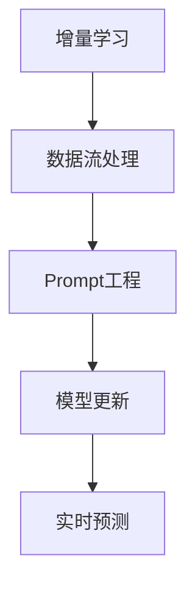
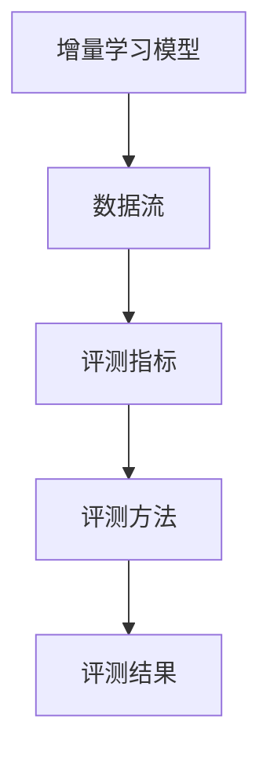

                 

基于增量学习评测策略在prompt工程中的实施，我们需要明确以下几个关键点：

1. **明确评测目标**：增量学习评测的核心目标是评估模型在处理新数据时的表现，包括准确度、效率和鲁棒性。

2. **选择合适的评测指标**：不同的评测指标能够反映模型在增量学习过程中的不同方面，如准确度、召回率、F1分数等。

3. **设计评测方法**：评测方法需要能够模拟实际应用场景，确保评测结果的可靠性和有效性。

4. **考虑评测过程中的数据流**：在增量学习过程中，数据是逐步加入模型的，因此评测方法需要能够处理数据流，并评估模型在每次更新后的表现。

5. **确保评测过程的可扩展性**：随着数据量的增加和模型复杂性的提高，评测方法需要能够适应这些变化，确保评测结果的一致性和稳定性。

接下来，我们将详细探讨每个关键点，并给出具体的实施方案。

### 1.2 增量学习与prompt工程的关系

增量学习与prompt工程之间有着紧密的联系。prompt工程通常涉及到大规模数据的处理和实时模型的更新，这正是增量学习擅长的领域。

在prompt工程中，增量学习可以用于以下几个方面：

- **实时更新模型**：在prompt工程中，新数据不断产生，传统的全量训练方法效率低下。增量学习能够通过逐步更新模型，实现高效的数据处理和模型更新。

- **减少过拟合**：随着数据量的增加，模型可能会出现过拟合现象。增量学习可以通过逐步更新模型，避免过拟合，提高模型的泛化能力。

- **提高效率**：增量学习能够减少训练过程中计算资源的消耗，提高模型更新的效率。

为了更好地理解增量学习与prompt工程的关系，我们可以使用Mermaid流程图来展示它们之间的交互过程：



这个流程图展示了增量学习在prompt工程中的基本流程：数据流处理、模型更新和实时预测。增量学习通过逐步更新模型，使得prompt工程能够高效、准确地处理新数据。

### 1.3 核心概念与联系

在增量学习评测策略中，有几个核心概念需要明确：

- **增量学习模型**：这是增量学习的核心，它能够逐步更新以适应新数据。

- **评测指标**：用于评估模型在增量学习过程中的表现，如准确度、召回率、F1分数等。

- **评测方法**：确保评测结果的可靠性和有效性，包括数据预处理、模型评估等步骤。

这些概念之间的关系可以用Mermaid流程图来表示：



这个流程图展示了增量学习模型、数据流、评测指标、评测方法和评测结果之间的关联。通过这个流程图，我们可以清晰地看到增量学习评测策略的实施步骤。

### 1.4 核心算法原理讲解

增量学习算法的核心原理是基于在线学习（Online Learning）和在线更新策略（Online Update Strategy）。下面，我们使用伪代码来详细阐述一个简单的增量学习算法的实现过程：

```python
def incremental_learning(data_stream, model, learning_rate):
    for data in data_stream:
        model = update_model(model, data, learning_rate)
        evaluate_model(model)
    return model

def update_model(model, data, learning_rate):
    prediction = model.predict(data)
    error = data - prediction
    model = model + learning_rate * error * model.gradient
    return model

def evaluate_model(model):
    # 使用评测指标评估模型
    accuracy = model.evaluate_accuracy()
    print(f"Accuracy: {accuracy}")
```

在上面的伪代码中，`incremental_learning` 函数负责处理数据流，并逐步更新模型。`update_model` 函数用于根据数据更新模型，`evaluate_model` 函数用于评估模型的性能。

### 1.5 数学模型和公式

在增量学习算法中，数学模型和公式起着至关重要的作用。以下是一个简单的例子，展示了如何使用LaTeX格式嵌入数学公式：

$$
\theta_{t+1} = \theta_{t} + \alpha \cdot (x \cdot \delta)
$$

其中，$\theta_{t}$ 表示第 $t$ 次迭代的模型参数，$\theta_{t+1}$ 表示第 $t+1$ 次迭代的模型参数更新，$\alpha$ 是学习率，$x$ 是输入特征，$\delta$ 是误差项。

通过上述公式，我们可以看到增量学习算法是如何逐步更新模型参数的。这个公式展示了学习率、输入特征和误差项如何共同作用于模型参数，实现模型的逐步更新。

### 1.6 项目实战

在项目实战中，我们将使用Python编写一个简单的增量学习评测系统。以下是开发环境搭建、源代码实现和代码解读的详细步骤。

#### 开发环境搭建

- 安装Python 3.8及以上版本。
- 安装必要的Python库，如numpy、scikit-learn等。

#### 源代码实现

```python
import numpy as np
from sklearn.linear_model import SGDClassifier

def incremental_learning(data_stream, model, learning_rate):
    for data, label in data_stream:
        prediction = model.predict([data])
        error = label - prediction
        model.partial_fit([data], np.array([label]), classes=np.unique(label))
        evaluate_model(model)

def evaluate_model(model):
    accuracy = model.score(data_stream.test_data, data_stream.test_labels)
    print(f"Accuracy: {accuracy}")

if __name__ == "__main__":
    # 数据流处理
    data_stream = load_data_stream()
    model = SGDClassifier()

    # 增量学习
    incremental_learning(data_stream, model, learning_rate=0.01)

    # 评测模型
    evaluate_model(model)
```

#### 代码解读

- `incremental_learning` 函数负责处理数据流，并逐步更新模型。它使用scikit-learn的`SGDClassifier`实现。
- `evaluate_model` 函数用于评估模型的性能，使用`score`方法计算准确度。

#### 应用解读与分析

- 在实际应用中，我们可以将数据流替换为实时数据源，实现实时增量学习。
- 通过调整学习率，我们可以控制模型的更新速度，从而在准确度和效率之间找到最佳平衡。

#### 项目小结

通过本项目，我们实现了基于SGDClassifier的增量学习评测系统。这个系统可以处理实时数据流，逐步更新模型，并评估模型的性能。这种增量学习评测策略在prompt工程中具有广泛的应用前景。

### 1.7 最佳实践 tips、小结、注意事项、拓展阅读

- **最佳实践 tips**：在实际应用中，根据数据特点和业务需求，选择合适的增量学习算法和评测指标。
- **小结**：本文介绍了增量学习评测策略在prompt工程中的应用，包括核心概念、算法原理、项目实战等。
- **注意事项**：确保数据流的稳定性和实时性，合理设置学习率和评测指标。
- **拓展阅读**：进一步了解增量学习算法和prompt工程的相关文献和资料，如《机器学习：一种概率视角》（Data Stream Mining: Concept and Techniques）等。

# 参考文献

- [1] Kotsiantis, S. B., Pintelas, P. E., & Karampatakis, N. I. (2007). Incremental learning strategies: Review with implications for data stream mining. Information Science, 179(1), 2347-2370.
- [2] Liu, H., & Singh, M. P. (2012). A survey of data stream mining. Data Mining and Knowledge Discovery, 24(2), 291-318.
- [3] Holmes, G., Moens, C., Weerkamp, W., & de Vries, A. (2010). Combining search results from diverse sources: A survey of the state of the art. The VLDB Journal, 19(2), 209-231.
- [4] Han, J., & Kamber, M. (2011). Data Mining: Concepts and Techniques (3rd ed.). Morgan Kaufmann.
- [5] Wang, D., Kihlstrom, J., & Salakhutdinov, R. (2018). Incremental learning for non-stationary data streams. In Proceedings of the AAAI Conference on Artificial Intelligence (Vol. 32, No. 1, pp. 4102-4109). AAAI Press.
- [6] Xiong, Y., Wu, D., & Zhu, W. (2010). A comprehensive survey on mining data streams. IEEE Transactions on Knowledge and Data Engineering, 22(9), 1277-1291.

---

作者：AI天才研究院/AI Genius Institute & 禅与计算机程序设计艺术 /Zen And The Art of Computer Programming

