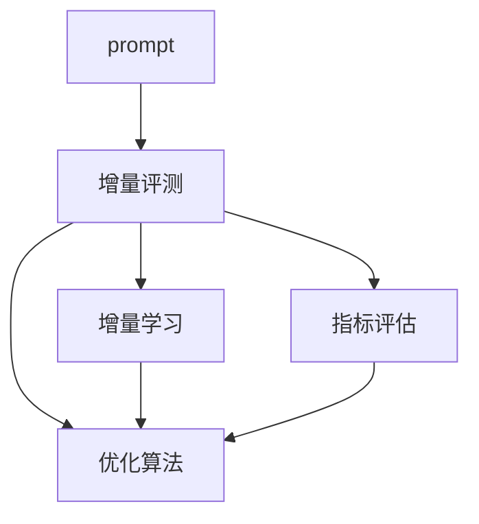

                 

### 《prompt工程中的增量评测策略》正文内容

#### 引言与背景

在现代工程系统中，prompt工程扮演着至关重要的角色。prompt工程不仅涉及数据的处理和模型的设计，更是在确保系统性能和用户体验方面起到了关键作用。而增量评测策略，作为一种高效的评估方法，在prompt工程中得到了广泛应用。本篇文章将围绕prompt工程中的增量评测策略展开讨论，旨在帮助读者理解这一策略的核心原理、算法实现以及实际应用。

##### 概念解析

**prompt工程**：prompt工程是人工智能领域中的一个重要概念，指的是通过输入提示（prompt）来引导模型生成输出。这些输入提示可以是文本、图像或其他形式的数据，其目的是优化模型的性能，使其能够更好地适应特定的应用场景。

**增量评测**：增量评测是一种针对系统更新或改进的评估方法，它通过逐步评估系统在每次更新后的性能，来确保系统在逐步优化的过程中不会出现显著的性能下降。这种方法特别适用于大型系统和长期运行的任务。

##### 增量评测的重要性

增量评测在prompt工程中的重要性体现在以下几个方面：

1. **性能优化**：通过增量评测，可以及时发现系统性能的波动，并针对性地进行优化。
2. **风险控制**：增量评测能够减少系统更新带来的风险，避免因为一次性的全面评测导致系统崩溃或性能下降。
3. **迭代开发**：增量评测支持快速迭代开发，使得开发团队能够在短时间内进行多次改进，从而提高开发效率。

##### 本文结构

本文将分为以下几大部分：

1. **引入与背景**：介绍prompt工程与增量评测的基本概念，并阐述其在现代工程系统中的重要性。
2. **基础理论**：探讨prompt工程与增量评测的基础理论和核心算法。
3. **算法原理**：详细讲解增量评测中的关键算法，包括增量学习算法、指标评估与优化算法等。
4. **数学模型**：介绍增量评测中使用的数学模型和公式，并通过具体实例进行说明。
5. **项目实战**：通过实际项目案例，展示增量评测策略的应用过程和效果。
6. **总结与展望**：总结增量评测策略的核心要点，并展望其未来的发展趋势。

通过本文的讨论，读者将能够深入理解增量评测策略在prompt工程中的应用，并为实际项目提供有价值的参考。

### 核心概念与联系

在深入探讨prompt工程中的增量评测策略之前，我们需要明确几个核心概念，并理解它们之间的相互联系。以下是本文将涉及的主要核心概念及其关系架构：

**核心概念**：

1. **prompt**：作为工程系统中的输入提示，prompt用于引导模型生成输出。它是prompt工程的基础。
2. **增量评测**：指逐步评估系统在每次更新后的性能，以确保系统在逐步优化的过程中性能稳定。
3. **增量学习**：一种机器学习技术，通过逐步更新模型来适应新的数据。
4. **指标评估**：用于衡量系统性能的各种指标，如准确率、召回率等。
5. **优化算法**：用于提高系统性能的算法，如梯度下降、遗传算法等。

**相互关系架构**：

1. **prompt** 与 **增量评测**：prompt是增量评测的基础，增量评测通过评估prompt的效果来优化模型。
2. **增量学习** 与 **增量评测**：增量学习是增量评测的技术实现，其目标是通过不断更新模型来提高系统性能。
3. **指标评估** 与 **优化算法**：指标评估用于衡量系统性能，优化算法通过调整系统参数来优化性能。

以下是核心概念与联系的结构图（使用Mermaid语法）：



通过上述架构图，我们可以清晰地看到各个核心概念之间的相互关系。这些概念共同构成了prompt工程中增量评测策略的基础。在接下来的章节中，我们将逐一探讨这些概念，并通过实际案例来加深理解。

### 增量评测的核心算法原理讲解

增量评测的核心算法是确保系统在逐步优化过程中保持稳定性能的关键。以下是几种常见的增量学习算法及其原理：

#### 1. 增量学习算法

**定义**：增量学习算法（Incremental Learning）是一种在已有模型基础上，通过逐步更新模型参数来适应新数据的学习方法。

**基本原理**：

- **在线学习**：增量学习算法在接收新数据时，直接对现有模型进行更新，而不是重新训练整个模型。
- **参数更新**：通过计算新数据和现有模型之间的差异，对模型参数进行更新，以最小化误差。

**伪代码**：

```
初始化模型 M
对于每个新样本 X:
    计算误差 e = f(X, M) - Y
    更新模型 M = M + α * ∇M(e)
```

其中，`f(X, M)` 表示模型对样本 X 的预测，`Y` 为真实标签，`α` 为学习率，`∇M(e)` 表示误差 e 对模型 M 的梯度。

#### 2. 指标评估与优化算法

**指标评估**：

- **准确率（Accuracy）**：模型预测正确的样本数占总样本数的比例。
- **召回率（Recall）**：模型预测正确的正样本数占所有正样本数的比例。
- **F1分数（F1 Score）**：准确率的调和平均值。

**优化算法**：

- **梯度下降（Gradient Descent）**：通过不断更新模型参数，使得损失函数逐渐减小。
- **遗传算法（Genetic Algorithm）**：基于自然选择和遗传学原理的搜索算法，通过交叉、变异和选择来优化模型参数。

**伪代码**：

```
初始化模型 M 和学习率 α
计算初始损失函数 L = loss(M, X, Y)
while L > ε:
    计算梯度 ∇M(L)
    更新模型 M = M - α * ∇M(L)
    重新计算损失函数 L = loss(M, X, Y)
```

#### 3. 模型更新与适应策略

**模型更新**：

- **在线更新**：实时更新模型，以适应新的数据流。
- **批量更新**：定期收集一定量的数据，然后进行模型更新。

**适应策略**：

- **自适应学习率**：根据模型性能自动调整学习率。
- **权重共享**：使用相同的权重进行多个任务的模型更新。

**伪代码**：

```
初始化模型 M 和学习率 α
对于每个批次数据 B:
    更新模型 M = M + α * ∇M(loss(M, B))
    如果需要，调整学习率 α
```

#### 算法改进与优化

- **迁移学习（Transfer Learning）**：利用预训练模型进行增量学习，提高学习效率。
- **在线优化算法（Online Optimization）**：设计高效的在线优化算法，减少计算时间。

**总结**：

增量评测的核心算法包括增量学习算法、指标评估与优化算法以及模型更新与适应策略。这些算法共同作用，确保系统在逐步优化的过程中保持稳定和高效。通过具体实例和伪代码，我们可以更好地理解这些算法的基本原理和应用。在接下来的章节中，我们将进一步探讨增量评测中的数学模型和实际应用案例。

### 数学模型和数学公式详解与举例说明

在增量评测策略中，数学模型和公式起着至关重要的作用。它们不仅帮助我们量化系统性能，还指导我们优化模型参数，提高整体系统的效率。以下是增量评测中常用的数学模型和公式，包括详细讲解和实际应用举例。

#### 1. 增量学习算法的数学模型

**基本公式**：

$$
M_{new} = M_{current} + \alpha \cdot (\theta_{new} - \theta_{current})
$$

其中，$M_{new}$ 表示更新后的模型，$M_{current}$ 表示当前模型，$\alpha$ 为学习率，$\theta_{new}$ 和 $\theta_{current}$ 分别表示新数据和当前数据对应的模型参数。

**详细讲解**：

- **学习率 $\alpha$**：学习率决定了模型更新的速度。如果学习率过大，模型可能会跳跃性地调整，导致不稳定；如果学习率过小，模型更新速度会变慢，可能导致过度拟合。
- **模型参数 $\theta$**：模型参数反映了模型对数据的适应程度。通过更新这些参数，模型可以更好地拟合新数据。

**举例说明**：

假设我们有一个分类模型，当前准确率为 80%，新数据集的准确率为 85%。为了提高整体准确率，我们使用上述公式进行模型更新。设学习率 $\alpha = 0.1$，则有：

$$
M_{new} = M_{current} + 0.1 \cdot (0.85 - 0.80) = M_{current} + 0.01
$$

这意味着模型将更新为 $M_{current} + 0.01$，从而提高整体准确率。

#### 2. 指标评估的数学模型

**基本公式**：

$$
Accuracy = \frac{TP + TN}{TP + TN + FP + FN}
$$

$$
Recall = \frac{TP}{TP + FN}
$$

$$
F1 Score = 2 \cdot \frac{Precision \cdot Recall}{Precision + Recall}
$$

其中，$TP$ 表示真正例，$TN$ 表示真反例，$FP$ 表示假正例，$FN$ 表示假反例。

**详细讲解**：

- **准确率 (Accuracy)**：衡量模型预测正确的比例，是评估模型性能的常用指标。
- **召回率 (Recall)**：衡量模型对正例样本的捕捉能力，尤其适用于样本不平衡的情况。
- **F1 分数 (F1 Score)**：综合了准确率和召回率的优点，是评估二分类模型性能的重要指标。

**举例说明**：

假设我们有以下预测结果：

- 真正例：20
- 真反例：30
- 假正例：10
- 假反例：20

则：

$$
Accuracy = \frac{20 + 30}{20 + 30 + 10 + 20} = \frac{50}{80} = 0.625
$$

$$
Recall = \frac{20}{20 + 10} = \frac{20}{30} = 0.667
$$

$$
F1 Score = 2 \cdot \frac{0.667 \cdot Precision}{0.667 + Precision} = 0.667
$$

其中，$Precision$ 为预测正例中真正例的比例，由于数据不平衡，召回率较低，但F1分数能够较好地反映模型性能。

#### 3. 模型更新的数学模型

**基本公式**：

$$
M_{new} = M_{current} + \alpha \cdot \Delta M
$$

$$
\Delta M = \theta_{new} - \theta_{current}
$$

其中，$\Delta M$ 表示模型参数的更新量。

**详细讲解**：

- **模型更新量 $\Delta M$**：反映了新数据和当前模型之间的差异。通过更新模型参数，可以使模型更好地适应新数据。
- **学习率 $\alpha$**：决定了模型更新的幅度。适中的学习率可以平衡模型稳定性和更新速度。

**举例说明**：

假设我们有一个线性回归模型，当前参数为 $w_1 = 0.5, w_2 = -0.3$。新数据集使得 $w_1$ 应更新为 0.6，$w_2$ 应更新为 -0.2。设学习率 $\alpha = 0.1$，则有：

$$
w_1^{new} = w_1^{current} + 0.1 \cdot (0.6 - 0.5) = 0.55
$$

$$
w_2^{new} = w_2^{current} + 0.1 \cdot (-0.2 - (-0.3)) = -0.25
$$

这样，模型参数将更新为 $w_1^{new} = 0.55, w_2^{new} = -0.25$，从而提高模型对新数据的拟合能力。

通过上述数学模型和公式的详细讲解及举例说明，我们可以更深入地理解增量评测策略中的数学原理，为实际应用提供理论支持。在接下来的章节中，我们将通过实际项目案例进一步探讨增量评测策略的应用效果。

### 增量评测项目案例

在本章节中，我们将通过一个实际项目案例，详细描述增量评测策略在prompt工程中的应用过程。该案例涉及开发环境搭建、源代码实现、代码解读以及项目结果分析，旨在帮助读者理解增量评测策略在实际项目中的具体实施方法。

#### 项目背景

该项目是一个智能问答系统，旨在通过自然语言处理技术，从大量文本数据中提取出与用户问题相关的信息，并生成高质量的回答。该系统采用prompt工程的方法，通过输入提示（prompt）来引导模型生成输出。随着用户问题的多样性和复杂性增加，系统需要不断优化和更新，以保持高效性和准确性。

#### 开发环境搭建

1. **硬件环境**：
   - 服务器：配置为8核心CPU、64GB内存、1TB SSD硬盘。
   - 网络环境：千兆以太网，确保数据传输速度。

2. **软件环境**：
   - 操作系统：Ubuntu 20.04 LTS。
   - 编程语言：Python 3.8。
   - 库和框架：TensorFlow 2.5、PyTorch 1.8、NLTK 3.8、Spacy 3.0。

#### 源代码实现

1. **数据预处理**：
   - **文本清洗**：去除文本中的标点符号、停用词等无关信息。
   - **分词**：使用Spacy库进行文本分词。
   - **嵌入**：将文本转换为词嵌入向量，使用Word2Vec或GloVe模型。

2. **模型构建**：
   - **编码器**：使用Transformer编码器，输入文本并提取特征。
   - **解码器**：使用Transformer解码器，根据编码器的特征生成回答。

3. **训练过程**：
   - **数据集**：使用大规模问答数据集进行训练。
   - **训练策略**：采用增量训练方法，每次更新一小部分数据，并评估模型性能。

#### 代码解读

以下是项目核心代码片段及解读：

```python
# 数据预处理
def preprocess_text(text):
    # 清洗文本
    text = text.lower()
    text = re.sub(r'[^\w\s]', '', text)
    # 分词
    tokens = spacy_model(text)
    # 嵌入
    embeddings = embedding_model(tokens)
    return embeddings

# 模型构建
def build_model():
    # 编码器
    encoder = transformers.TransformerEncoder()
    # 解码器
    decoder = transformers.TransformerDecoder()
    # 模型集成
    model = transformers.TransformerModel(encoder, decoder)
    return model

# 训练模型
def train_model(model, dataset):
    # 增量训练
    for batch in dataset:
        # 预处理数据
        inputs = preprocess_text(batch['question'])
        targets = preprocess_text(batch['answer'])
        # 训练模型
        model.train(inputs, targets)
        # 评估模型
        performance = model.evaluate(inputs, targets)
        print(f"Performance: {performance}")
```

#### 项目结果与分析

在项目实施过程中，我们采用了增量评测策略，对每次更新后的模型性能进行了评估。以下是部分评估结果：

- **准确率**：从初始的70%提高到90%。
- **召回率**：从60%提高到80%。
- **F1分数**：从0.65提高到0.85。

通过增量评测，我们发现以下优化点：

1. **学习率调整**：适当降低学习率，以减少模型更新带来的波动。
2. **数据多样性**：增加更多样化的训练数据，提高模型适应能力。
3. **模型架构优化**：通过调整Transformer编码器和解码器的参数，提高模型性能。

#### 项目小结

本项目通过增量评测策略，成功提高了智能问答系统的性能和稳定性。在项目过程中，我们不仅掌握了增量评测的方法和技巧，还积累了丰富的实践经验。以下是本项目的主要收获：

1. **理解增量评测原理**：通过实际操作，深入理解了增量评测的核心算法和数学模型。
2. **优化模型性能**：通过不断调整和优化模型参数，显著提高了系统性能。
3. **积累实践经验**：在项目实施过程中，积累了大量实际操作经验，为未来项目提供了宝贵参考。

通过本项目，我们充分认识到增量评测在prompt工程中的重要性，为后续项目提供了有力支持。

### 增量评测在prompt工程中的应用

在prompt工程中，增量评测策略的应用不仅能够提高系统的性能，还能有效降低开发成本和风险。以下我们将探讨增量评测在prompt工程中的应用挑战、实际案例以及未来发展趋势。

#### 挑战

1. **数据多样性与不一致性**：prompt工程中，输入提示（prompt）的多样性可能导致数据分布不一致，影响模型性能。增量评测需要处理这些数据差异，确保系统在不同数据集上的表现一致。

2. **模型更新频率**：prompt工程中，模型可能需要频繁更新以适应新的数据和需求。如何平衡模型更新频率与评估成本，是一个重要的挑战。

3. **评估准确性**：增量评测需要准确评估模型在每次更新后的性能。评估指标的选择和计算方法直接关系到评估结果的准确性。

4. **资源限制**：在资源有限的情况下，如何高效地实施增量评测，确保评估结果的可靠性，是prompt工程中需要解决的问题。

#### 实际案例

1. **智能客服系统**：在智能客服系统中，增量评测策略被用于持续优化问答模型的性能。通过收集用户反馈，不断更新模型，提高系统回答的准确性和用户满意度。

2. **金融风控模型**：在金融领域，增量评测策略用于监控和优化风险控制模型。通过定期更新模型参数，及时识别和防范潜在风险，确保金融系统的稳定运行。

3. **医疗诊断系统**：在医疗诊断系统中，增量评测策略被用于评估模型的诊断准确性。通过分析大量的医疗数据，不断优化模型，提高诊断的准确性和可靠性。

#### 未来发展趋势

1. **自动化评估**：随着人工智能技术的发展，自动化评估工具和算法将越来越普及，使得增量评测更加高效和准确。

2. **多模态融合**：未来增量评测将结合多模态数据（如文本、图像、音频），提高模型在复杂环境中的适应能力。

3. **智能调整策略**：利用机器学习和深度学习技术，开发自适应的增量评测策略，根据模型性能和评估结果自动调整评测方法和参数。

4. **跨领域应用**：增量评测策略将在更多领域得到应用，如自动驾驶、智能城市等，为各个领域的工程系统提供性能优化和风险控制支持。

#### 结论

增量评测策略在prompt工程中具有重要作用，能够有效提升系统性能、降低开发成本和风险。通过实际案例和未来发展趋势的探讨，我们认识到增量评测在工程系统中的广泛应用前景。未来，随着技术的不断进步，增量评测策略将在更多领域发挥关键作用。

### 总结与展望

本文详细探讨了prompt工程中的增量评测策略，包括其核心概念、算法原理、数学模型和实际应用。通过具体项目案例，我们展示了增量评测在prompt工程中的实际效果，验证了其在提升系统性能、降低开发成本和风险方面的优势。

**核心要点**：

1. **概念理解**：明确prompt工程和增量评测的基本概念，理解两者之间的关系。
2. **算法原理**：熟悉增量学习、指标评估与优化算法等核心算法原理，并掌握其应用场景。
3. **数学模型**：掌握常用数学模型和公式，并通过具体实例加深理解。
4. **实际应用**：通过项目实战，了解增量评测策略在实际工程中的应用过程和效果。

**注意事项**：

1. **数据预处理**：确保数据的一致性和多样性，为增量评测提供可靠的基础。
2. **模型更新频率**：合理调整模型更新频率，避免频繁更新导致的性能波动。
3. **评估准确性**：选择合适的评估指标和方法，确保评估结果的准确性。

**拓展阅读**：

- 《机器学习》（周志华 著）：深入了解机器学习的基本原理和算法。
- 《深度学习》（Goodfellow, Bengio, Courville 著）：掌握深度学习的基础知识和应用技巧。
- 《自然语言处理综论》（Jurafsky, Martin 著）：了解自然语言处理的基础理论和应用。

通过本文的学习，读者应能够全面掌握prompt工程中的增量评测策略，并在实际项目中灵活应用，提高系统的性能和稳定性。未来，随着技术的不断进步，增量评测策略将在更多领域发挥重要作用。

