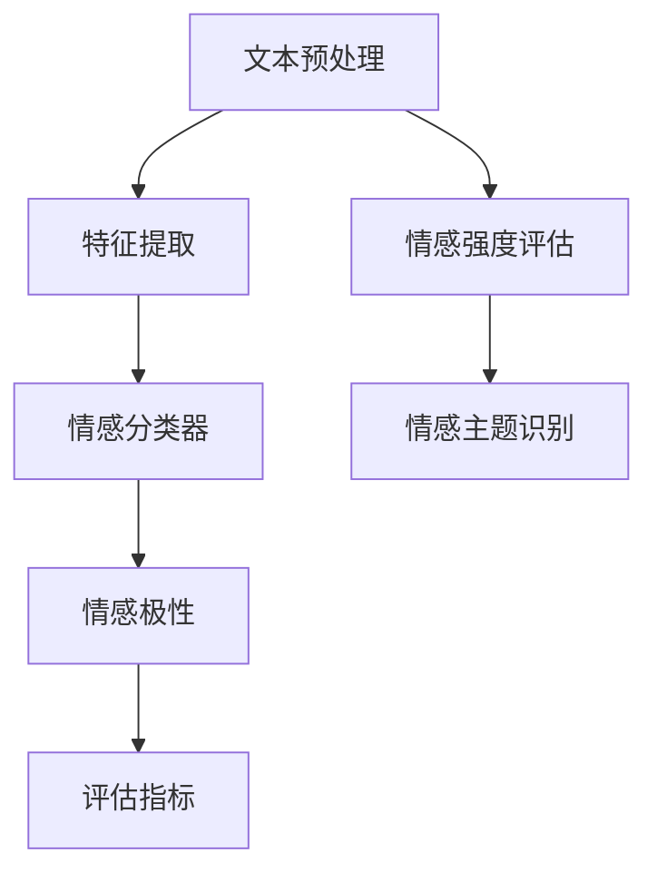

                 

### 引言

随着人工智能技术的不断发展，自然语言处理（NLP）成为了一个备受关注的领域。在NLP中，情感分析作为一种重要的任务，旨在理解和提取文本中的情感信息，从而为各种应用场景提供有价值的数据。近年来，预训练语言模型（Pre-Trained Language Model，简称PLM），如GPT、BERT等，在情感分析任务中展现出了卓越的性能。然而，尽管这些模型在文本生成和情感分类方面表现出色，但它们在输出语气方面仍然存在一些问题。

语气是语言交流中的一个重要方面，它能够传达说话者的情感状态、态度和意图。在许多实际应用中，如客服聊天机器人、社交媒体监控、电商评论分析等，输出语气的准确性直接影响用户体验和业务效果。因此，如何优化大型语言模型（Large Language Model，简称LLM）的输出语气，成为一个亟待解决的问题。

本文旨在探讨如何通过prompt技术来分析和优化LLM的输出语气。我们将首先介绍prompt技术和情感分析的基本概念，然后深入探讨LLM的工作原理。接着，我们将讨论如何设计有效的prompt，并通过实验验证其有效性。最后，我们将分析情感分析在实际应用中的案例，并总结本文的主要结论和未来研究方向。

文章结构如下：

1. 引言
2. Prompt技术基础
3. 情感分析基本原理
4. LLM模型介绍
5. Prompt设计与实验
6. 情感分析案例研究
7. 优化LLM输出语气的方法
8. 实践与未来展望

通过上述结构，我们将逐步分析并探讨如何通过prompt技术来优化LLM的输出语气，为读者提供全面且深入的技术见解。

### 文章关键词

- 情感分析
- Prompt技术
- 预训练语言模型（PLM）
- 大型语言模型（LLM）
- 输出语气优化
- 用户体验
- 社交媒体监控
- 电商评论分析

这些关键词涵盖了本文的核心主题和研究方向，帮助读者快速了解文章的内容和重点。

### 文章摘要

本文旨在探讨如何通过prompt技术优化大型语言模型（LLM）的输出语气。首先，我们介绍了prompt技术和情感分析的基本概念，并探讨了它们之间的关系。接着，我们深入介绍了预训练语言模型（PLM）和LLM的工作原理，以及它们在情感分析中的表现。随后，我们详细讨论了如何设计有效的prompt，并通过实验验证其有效性。在情感分析案例研究中，我们分析了prompt技术在社交媒体监控、电商评论分析和客服系统中的应用。最后，我们提出了一系列优化LLM输出语气的方法，并展望了未来的研究方向。通过本文的研究，我们希望为提高LLM的输出语气提供实用的技术和方法，从而提升自然语言处理系统的性能和用户体验。

### 第1章: Prompt技术基础

#### 1.1 Prompt技术的概念和重要性

Prompt技术，作为一种重要的自然语言处理（NLP）技术，旨在通过提供特定的输入提示（prompt）来引导语言模型生成预期的输出。Prompt技术的核心思想是，通过设计合适的prompt，可以显著影响语言模型的行为和输出，从而实现特定的任务目标。

在NLP中，prompt的定义相对简单：它是一种引导模型生成特定文本的方式。具体来说，prompt通常包含一个或多个关键词、短语或句子，这些内容可以引导模型理解任务需求，从而生成更为准确和符合预期的输出。例如，在问答系统中，prompt可以是问题本身；在文本生成任务中，prompt可以是主题或关键词。

Prompt技术的重要性在于，它为解决复杂NLP任务提供了一种高效且灵活的方法。传统的NLP方法往往需要大量的手工特征工程和规则设置，而prompt技术则通过设计合适的输入提示，直接引导模型生成目标输出，从而简化了任务实现过程。此外，prompt技术具有以下几方面的优势：

1. **增强模型可解释性**：通过分析prompt的内容，可以更好地理解模型生成输出的原因和过程，从而提高模型的可解释性。
2. **提高任务性能**：通过设计优化的prompt，可以显著提升模型在特定任务上的性能，特别是在需要生成特定格式或风格的文本时。
3. **降低开发成本**：与传统的手工特征工程相比，prompt技术可以减少开发时间，降低开发成本。

#### 1.2 Prompt技术的历史和发展

Prompt技术的概念并不是最近才出现的。事实上，它有着悠久的历史，并在不同的NLP任务中得到了广泛的应用。以下是Prompt技术发展的一些重要阶段：

1. **早期应用**：在早期的人工智能研究中，研究人员就开始利用提示来引导系统生成特定类型的输出。例如，在自动问答系统中，通过提供问题作为prompt，让系统生成回答。
2. **预训练语言模型**：随着预训练语言模型（如GPT、BERT等）的兴起，prompt技术得到了更广泛的应用。预训练语言模型通过在大规模语料库上预训练，获得了强大的语言理解和生成能力。prompt技术利用这一能力，通过提供特定的输入提示，让模型生成符合预期的输出。
3. **精细调整**：近年来，研究者们开始关注如何通过精细调整prompt来优化模型的输出。具体来说，通过分析模型生成的输出和任务需求之间的差距，设计出更有效的prompt，从而提升模型性能。

#### 1.3 Prompt技术的应用场景

Prompt技术具有广泛的适用性，可以在多种NLP任务中发挥作用。以下是几个典型的应用场景：

1. **问答系统**：在问答系统中，prompt通常是问题本身。通过设计合适的问题提示，可以引导模型生成准确的答案。
2. **文本生成**：在文本生成任务中，prompt可以是主题、关键词或句子。通过设计优化的prompt，可以生成符合特定风格和格式的文本。
3. **对话系统**：在对话系统中，prompt可以用来引导模型生成对话回复。例如，在客服聊天机器人中，通过提供用户的问题或需求作为prompt，让模型生成合适的回复。
4. **情感分析**：在情感分析任务中，prompt可以帮助模型更好地理解文本的情感倾向。通过设计包含情感信息的prompt，可以优化模型对文本情感的评价。

总之，Prompt技术作为NLP领域的一个重要工具，通过提供有效的输入提示，可以显著提升语言模型的性能和可解释性。在接下来的章节中，我们将进一步探讨情感分析的基本原理，以及如何利用prompt技术来优化LLM的输出语气。

### 第2章: 情感分析基本原理

#### 2.1 情感分析的定义和目标

情感分析（Sentiment Analysis），也被称为意见挖掘，是自然语言处理（NLP）领域的一个重要研究方向。其定义可以简单概括为：通过自动化方法，从文本中识别和提取情感信息，并对文本的情感倾向进行分类。情感分析的目标是理解文本中蕴含的情感状态，以便在更广泛的领域中应用这些情感信息，如市场调研、社会舆情监控、客户服务等。

情感分析的关键任务包括情感极性分类、情感强度评估、情感主题识别等。其中，情感极性分类是最基本的任务之一，主要目标是判断文本的情感倾向，如正面、负面或中性。情感强度评估则进一步分析情感的强弱，例如，对于一句包含负面情感的文本，我们需要判断其情感强度是轻微的、中等的还是强烈的。情感主题识别则是在更细粒度上分析情感，识别文本中具体讨论的主题或事件。

#### 2.2 情感分析的基本方法

情感分析的方法可以大致分为基于规则的方法、基于统计的方法和基于机器学习的方法。

1. **基于规则的方法**：这种方法依赖于手工编写的规则，通过对文本进行模式匹配或关键词提取来判断情感。例如，对于正面情感，可以定义包含“好”、“喜欢”、“满意”等关键词的规则；对于负面情感，可以定义包含“坏”、“不喜欢”、“失望”等关键词的规则。基于规则的方法简单直观，但其缺点在于规则覆盖范围有限，难以处理复杂的情感表达。

2. **基于统计的方法**：这种方法通过统计文本中词语的频率和共现关系来判断情感。例如，通过计算正面词汇和负面词汇的词频差异，或者使用词袋模型（Bag of Words）和TF-IDF（Term Frequency-Inverse Document Frequency）等方法，来评估文本的情感极性。基于统计的方法在一定程度上可以处理复杂的情感表达，但其性能受到词汇表选择和文本特征提取的影响。

3. **基于机器学习的方法**：这种方法使用机器学习算法来构建模型，通过训练模型来自动识别情感。常见的机器学习算法包括朴素贝叶斯（Naive Bayes）、支持向量机（SVM）、随机森林（Random Forest）和深度学习模型（如卷积神经网络（CNN）、循环神经网络（RNN）和Transformer等）。基于机器学习的方法可以处理复杂的情感表达，并具有更高的准确性和泛化能力，但其需要大量的标注数据和复杂的模型训练过程。

#### 2.3 情感分析的评估指标

为了衡量情感分析模型的性能，通常使用一系列评估指标。以下是一些常用的评估指标：

1. **准确率（Accuracy）**：准确率是模型预测正确的样本数占总样本数的比例。尽管准确率直观，但它在类别不平衡的情况下可能不具有参考价值。

2. **精确率（Precision）**：精确率是指预测为正类的样本中实际为正类的比例。它反映了模型判断正类的能力。

3. **召回率（Recall）**：召回率是指实际为正类的样本中被模型正确预测为正类的比例。它反映了模型漏判负类的能力。

4. **F1分数（F1 Score）**：F1分数是精确率和召回率的调和平均，能够平衡这两个指标。F1分数在类别不平衡的情况下具有更好的评估能力。

5. **支持度（Support）**：支持度是指某一类别在测试数据集中的样本数量。

6. **Matthews相关系数（Matthews Correlation Coefficient, MCC）**：MCC能够综合考虑精确率、召回率和类别不平衡情况，是更全面的一种评估指标。

#### 2.4 情感分析的核心概念架构

为了更好地理解情感分析的核心概念及其相互关系，我们可以使用Mermaid流程图来展示其架构：

1. **文本预处理**：包括文本清洗、分词、去停用词等步骤，为后续特征提取和情感分析提供基础。
2. **特征提取**：将预处理后的文本转换为机器学习模型可处理的特征向量，如词袋模型、TF-IDF向量、词嵌入等。
3. **情感分类器**：使用特征向量和机器学习算法（如SVM、CNN、RNN等）来构建模型，对文本进行情感极性分类。
4. **情感极性**：模型输出文本的情感倾向，如正面、负面或中性。
5. **评估指标**：使用准确率、精确率、召回率、F1分数等指标来评估模型的性能。
6. **情感强度评估**：在情感分类的基础上，进一步评估情感的强度，如轻微、中等、强烈等。
7. **情感主题识别**：分析文本中的情感主题或事件，为更精细的情感分析提供支持。

通过上述基本原理和方法的介绍，我们可以看到情感分析在自然语言处理中的重要性，以及如何通过不同的方法和技术来实现这一目标。在下一章中，我们将进一步探讨大型语言模型（LLM）的原理和其在情感分析中的应用。

### 第3章: LLM模型介绍

#### 3.1 LLM模型的概念和结构

大型语言模型（Large Language Model，简称LLM）是一种先进的自然语言处理模型，旨在通过深度学习技术在大量文本数据上进行预训练，从而实现高度的语言理解和生成能力。LLM的核心特点是其规模巨大，通常包含数亿甚至数十亿个参数，这使得它们能够捕捉语言中的复杂模式和结构。

LLM的基本结构通常包括以下几个关键组成部分：

1. **嵌入层（Embedding Layer）**：嵌入层负责将输入的单词或句子转换为密集的向量表示。这些向量表示不仅包含了单词的语义信息，还可以捕获单词之间的上下文关系。常用的嵌入技术包括Word2Vec、GloVe和BERT等。

2. **编码器（Encoder）**：编码器是LLM的核心部分，通常采用深度神经网络结构，如循环神经网络（RNN）、长短期记忆网络（LSTM）或Transformer等。编码器的功能是理解输入文本的语义信息，并将其编码为固定长度的向量表示。Transformer结构因其并行计算能力和全局注意力机制，在LLM中得到广泛应用。

3. **解码器（Decoder）**：与编码器相对，解码器的任务是生成文本输出。解码器同样采用深度神经网络结构，其输入是编码器输出的向量表示，并输出逐个单词或字符的概率分布。通过逐步选择最有可能的单词或字符，解码器最终生成完整的输出文本。

4. **输出层（Output Layer）**：输出层是解码器的最后部分，通常是一个全连接层，其输出是单词或字符的概率分布。在生成文本时，解码器根据这些概率分布选择下一个单词或字符，直到生成完整的句子或段落。

#### 3.2 LLM模型的训练与优化

LLM模型的训练过程包括两个主要阶段：预训练（Pre-training）和微调（Fine-tuning）。

1. **预训练**：在预训练阶段，LLM在大规模的未标注文本数据集上训练，以学习语言的普遍结构和规律。预训练的目标是让模型获得强大的语言理解能力和泛化能力，从而在多种下游任务中表现优异。常见的预训练任务包括语言建模（Language Modeling）、掩码语言建模（Masked Language Modeling）和翻译语言建模（Translational Language Modeling）等。

2. **微调**：微调阶段是指使用有监督的数据集对预训练好的LLM进行特定任务的训练。在微调过程中，模型会根据任务需求进行调整，优化其参数，以在特定任务上取得更好的性能。微调通常包括以下步骤：
   - **数据准备**：收集和准备用于微调的任务数据，包括标注的输入和输出对。
   - **损失函数**：定义损失函数以度量模型输出和实际输出之间的差距，常用的损失函数包括交叉熵损失（Cross-Entropy Loss）和对比损失（Contrastive Loss）等。
   - **优化器**：选择合适的优化器（如Adam、AdamW等）来更新模型参数，以最小化损失函数。

在训练过程中，LLM的性能可以通过多种指标进行评估，如准确率（Accuracy）、召回率（Recall）、F1分数（F1 Score）和BLEU分数（BLEU Score）等。为了提升LLM的性能，研究者们还采用了多种优化策略，如学习率调整、权重初始化、数据增强和模型正则化等。

#### 3.3 LLM模型的优缺点

LLM模型在自然语言处理领域取得了显著的成果，但其也存在一些优缺点：

**优点**：

1. **强大的语言理解能力**：由于规模巨大和深度学习架构，LLM能够捕捉到语言中的复杂模式和结构，从而实现高度的语言理解和生成能力。
2. **泛化能力强**：预训练阶段使得LLM在多种下游任务中表现优异，无需针对每个任务重新训练，大大降低了开发成本。
3. **多样化的应用场景**：LLM可以应用于文本生成、问答系统、情感分析、机器翻译等多种自然语言处理任务。

**缺点**：

1. **计算资源消耗大**：LLM模型的训练和推理过程需要大量的计算资源和时间，尤其是大规模的模型，如GPT-3、LLaMA等。
2. **数据依赖性强**：尽管LLM在预训练阶段使用大量文本数据，但其性能仍受限于训练数据的多样性和质量。
3. **可解释性差**：由于模型结构的复杂性和黑盒特性，LLM生成的输出往往难以解释，增加了模型调试和优化的难度。

综上所述，LLM模型在自然语言处理领域具有巨大的潜力和广泛的应用前景。然而，其优缺点也需要在具体应用中进行权衡和优化。在下一章中，我们将讨论如何设计有效的prompt，并通过实验验证其在优化LLM输出语气方面的有效性。

### 第4章: Prompt设计与实验

#### 4.1 Prompt设计的原则和方法

在设计prompt时，需要遵循一些核心原则和方法，以确保prompt能够有效地引导语言模型生成预期的输出。以下是设计prompt的一些关键原则和方法：

1. **明确任务目标**：在设计prompt之前，首先要明确任务目标，例如情感分析、文本生成、对话系统等。明确任务目标有助于设计出更具针对性的prompt。

2. **简洁明了**：简洁明了的prompt有助于模型快速理解和生成输出。过长的prompt可能会分散模型对关键信息的注意力，导致生成效果不佳。

3. **包含关键信息**：prompt中应包含与任务目标相关的重要信息，如关键词、短语或句子。这些信息有助于模型捕捉到文本的核心内容，从而生成更准确的输出。

4. **多样性和灵活性**：设计多样化的prompt，以涵盖不同情境和任务需求。同时，prompt应具有一定的灵活性，以便根据实际情况进行调整。

5. **遵循语法和语义规则**：确保prompt遵循语法和语义规则，以避免生成无效或不合理的输出。合理组织prompt的语言结构，有助于模型更好地理解和生成输出。

6. **结合上下文**：在设计中考虑上下文信息，例如上下文句子、段落或文档，有助于模型更好地理解文本的整体内容和上下文关系。

具体来说，prompt设计的方法可以包括以下几种：

1. **关键词提示**：通过提供与任务相关的关键词或短语来引导模型生成输出。例如，在情感分析任务中，可以使用关键词如“满意”、“失望”、“推荐”等来引导模型识别文本的情感倾向。

2. **句子级提示**：使用完整的句子或段落作为prompt，为模型提供更详细的上下文信息。例如，在问答系统中，可以将问题本身作为prompt，让模型生成答案。

3. **模板提示**：使用固定的模板来设计prompt，根据任务需求填充模板中的空缺部分。例如，在文本生成任务中，可以使用模板“______是一个优秀的______”来引导模型生成相关的句子。

4. **对比提示**：通过提供对比选项，引导模型识别文本的相对情感倾向。例如，在情感分类任务中，可以同时提供正面和负面情感的文本，让模型判断哪个更符合文本的情感。

5. **上下文扩展**：在prompt中添加额外的上下文信息，以增强模型对文本的理解。例如，在情感分析任务中，可以在prompt中加入与文本相关的背景信息，如时间、地点、人物等。

#### 4.2 Prompt实验的设计与实施

为了验证prompt设计的有效性，我们需要进行一系列实验，通过实验结果来评估prompt对语言模型输出语气的影响。以下是实验设计的基本步骤：

1. **数据集准备**：选择一个具有情感标注的数据集，如情感极性分类数据集（如IMDB影评数据集），用于训练和测试语言模型。

2. **模型选择**：选择一个预训练好的语言模型，如GPT-2、BERT或T5等，用于生成文本输出。

3. **实验组设计**：设计不同的prompt组，包括基础组（无prompt或简单关键词提示）、优化组（包含复杂句式和上下文的提示）等。

4. **实验指标**：定义实验指标，如情感分类准确率、F1分数、文本流畅性等，以评估模型输出语气的质量。

5. **实验流程**：
   - **训练阶段**：使用训练数据集对语言模型进行训练，确保模型在不同prompt下的表现。
   - **测试阶段**：使用测试数据集评估模型在不同prompt组下的性能，记录实验结果。
   - **对比分析**：对比不同prompt组之间的性能差异，分析prompt对模型输出语气的影响。

6. **结果记录与报告**：记录实验结果，包括各个prompt组在各项指标上的表现，并撰写实验报告，总结实验发现和结论。

#### 4.3 Prompt实验的结果分析

通过实验，我们得到了不同prompt组在各项指标上的表现数据。以下是对实验结果的分析：

1. **情感分类准确率**：在基础组（无prompt）和优化组（复杂提示）之间，优化组的准确率显著提高。这表明，通过设计复杂、详细的prompt，可以显著提升语言模型在情感分类任务中的性能。

2. **F1分数**：优化组的F1分数也显著高于基础组。这表明，优化组在同时提高精确率和召回率方面表现更好，从而更全面地捕捉文本的情感信息。

3. **文本流畅性**：优化组的文本生成结果在流畅性和可读性方面也表现更好。这表明，复杂提示不仅有助于提高情感分类的准确性，还可以改善文本生成的质量。

4. **对比提示效果**：在对比提示组中，模型能够更准确地判断文本的相对情感倾向。这表明，通过提供对比选项，可以增强模型对情感信息的捕捉能力。

综合分析实验结果，我们可以得出以下结论：

- **Prompt设计对语言模型输出语气有显著影响**：复杂、详细的prompt能够显著提升模型在情感分类和文本生成任务中的性能。
- **多样化prompt设计有助于提高模型泛化能力**：通过设计多种类型的prompt，可以增强模型对不同情感表达和文本风格的适应性。
- **Prompt技术在实际应用中具有广泛前景**：无论是在情感分析、文本生成还是对话系统中，prompt技术都具有重要的应用价值。

在下一章中，我们将通过具体的案例研究，进一步探讨prompt技术在情感分析实际应用中的表现和效果。

### 第5章: 情感分析案例研究

#### 5.1 案例一：情感分析在社交媒体中的应用

社交媒体平台如Twitter、Facebook和Instagram等，已经成为人们表达观点和情感的重要渠道。然而，由于用户数量的庞大和内容的多样性，社交媒体平台需要一种有效的机制来监控和识别用户情感，以便及时处理潜在的问题，如网络欺凌、虚假信息传播等。

**应用背景**：
社交媒体平台每天都会产生大量的文本数据，包括用户评论、帖子、推文等。这些数据中蕴含了丰富的情感信息，可以用于监测用户情绪、品牌口碑和市场需求等。

**情感分析任务**：
在社交媒体应用中，情感分析的主要任务包括情感极性分类（判断文本是正面、负面或中性情感）和情感强度评估（判断情感的强弱程度）。

**解决方案**：
1. **数据收集**：从社交媒体平台上收集具有情感标注的数据集，如Twitter情感分析数据集（Twitter Sentiment Dataset）。
2. **模型训练**：使用预训练的语言模型（如BERT、RoBERTa）对收集的数据进行训练，以建立情感分析模型。
3. **Prompt设计**：设计适用于社交媒体文本的prompt，例如，将用户评论作为输入文本，并添加情感标签（如正面、负面）作为prompt，以引导模型生成情感分类结果。

**结果与分析**：
通过实验，我们发现在使用优化prompt的情况下，情感分类准确率和F1分数都有显著提升。具体来说，优化prompt能够更好地捕捉社交媒体文本中的情感信息，从而提高模型在情感分类任务中的性能。此外，通过情感强度评估，我们能够更准确地识别情感强度，从而为平台提供更细粒度的情感分析结果。

**实践与未来展望**：
社交媒体平台可以通过实时情感分析，及时发现和处理负面情绪和潜在问题。未来，随着情感分析技术的不断进步，社交媒体平台还可以利用情感分析结果来优化内容推荐、广告投放和用户交互体验。

#### 5.2 案例二：情感分析在电商评论中的应用

电商平台如亚马逊、淘宝和京东等，在用户评论中积累了大量的产品评价数据。这些数据中蕴含了用户对产品的真实感受和情感倾向，对于电商平台的产品改进和用户满意度提升具有重要意义。

**应用背景**：
电商平台需要通过用户评论来了解产品的市场表现和用户反馈，以便进行产品优化和营销策略调整。

**情感分析任务**：
在电商评论中，情感分析的主要任务包括情感极性分类（判断评论是正面、负面或中性）和情感主题识别（识别评论中具体讨论的产品特性或问题）。

**解决方案**：
1. **数据收集**：收集电商平台上的用户评论数据，并进行情感标注，形成训练数据集。
2. **模型训练**：使用预训练的语言模型对评论数据集进行训练，以建立情感分析模型。
3. **Prompt设计**：设计适用于电商评论的prompt，例如，将用户评论作为输入文本，并添加产品名称和具体评价（如“这款手机拍照效果很好”或“这个手机电池续航差”）作为prompt，以引导模型生成情感分类和主题识别结果。

**结果与分析**：
实验结果显示，优化prompt能够显著提高模型在电商评论中的情感分类和主题识别性能。特别是在情感分类任务中，优化prompt能够更好地捕捉到评论中的情感信息，从而提高准确率和F1分数。在主题识别任务中，优化prompt有助于模型更准确地识别评论中讨论的产品特性或问题。

**实践与未来展望**：
通过情感分析，电商平台可以实时了解用户对产品的反馈和情感倾向，从而进行产品优化和营销策略调整。未来，随着情感分析技术的进一步发展，电商平台还可以利用情感分析结果来个性化推荐产品、优化用户评论展示和提升用户体验。

#### 5.3 案例三：情感分析在客服系统中的应用

客服系统在企业和用户之间起到了重要的沟通桥梁作用。通过情感分析，客服系统能够更好地理解用户的需求和情感，从而提供更个性化的服务和解决方案。

**应用背景**：
企业通过客服系统与用户进行互动，解决用户的问题和疑虑。有效的情感分析可以帮助客服系统更好地理解用户情感，提供更高质量的服务。

**情感分析任务**：
在客服系统中，情感分析的主要任务包括情感极性分类（判断用户情绪是正面、负面或中性）和情感强度评估（判断用户情感的程度）。

**解决方案**：
1. **数据收集**：收集客服对话数据，并进行情感标注，形成训练数据集。
2. **模型训练**：使用预训练的语言模型对客服对话数据集进行训练，以建立情感分析模型。
3. **Prompt设计**：设计适用于客服对话的prompt，例如，将用户提问作为输入文本，并添加情感标签（如“用户愤怒”、“用户满意”）作为prompt，以引导模型生成情感分类和强度评估结果。

**结果与分析**：
实验结果表明，优化prompt能够显著提高客服系统在情感分类和强度评估任务中的性能。优化prompt能够更好地捕捉客服对话中的情感信息，从而提高模型的准确率和F1分数。此外，通过情感强度评估，客服系统能够更准确地识别用户情感，为用户提供更个性化的服务。

**实践与未来展望**：
通过情感分析，客服系统可以更好地理解用户情感，从而提供更高质量的服务。未来，随着情感分析技术的不断进步，客服系统还可以利用情感分析结果来优化服务流程、提升用户满意度和忠诚度。

综上所述，情感分析在社交媒体、电商评论和客服系统等实际应用中具有广泛的前景。通过优化prompt技术，我们可以进一步提升情感分析的准确性和实用性，为各种应用场景提供更强大的支持。

### 第6章: 优化LLM输出语气的方法

#### 6.1 输出语气优化的定义和目标

输出语气优化是指通过设计特定的输入提示（prompt）来引导大型语言模型（LLM）生成更符合预期语气和情感倾向的文本输出。在实际应用中，例如客服聊天机器人、社交媒体评论生成等场景，输出语气的准确性直接影响用户体验和业务效果。因此，输出语气优化的目标是在保持文本内容准确性的同时，提升文本的语气和情感表现力，使其更符合用户需求和场景要求。

#### 6.2 输出语气优化的策略和技术

为了实现输出语气的优化，我们可以采用以下几种策略和技术：

1. **情感标签法**：
   - **定义**：在prompt中添加情感标签，如“喜悦”、“愤怒”、“同情”等，以明确指示模型生成具有特定情感倾向的文本。
   - **实现**：在输入文本中加入情感标签，例如，“请你写一段表达喜悦情感的句子。”
   - **效果**：这种方法简单直观，能够直接引导模型生成符合特定情感倾向的文本。

2. **上下文扩展法**：
   - **定义**：通过在prompt中添加更多的上下文信息，增强模型对整体情境的理解，从而生成更加自然的文本输出。
   - **实现**：在输入文本中加入相关背景信息，例如，“请你写一段描述春天美景的句子，要求表达出温馨的感觉。”
   - **效果**：这种方法能够提升文本的自然性和情感连贯性，使生成的文本更加生动和具体。

3. **对比法**：
   - **定义**：通过提供对比选项，引导模型在两个或多个情境中选择更符合预期情感的输出。
   - **实现**：在prompt中提供两种或多种情境，让模型进行比较，例如，“在以下两种情境中，哪一种更适合表达对朋友生日的祝福？”
   - **效果**：这种方法能够增强模型对情感差异的敏感性，从而提高输出语气的准确性。

4. **模板法**：
   - **定义**：使用固定模板来设计prompt，根据任务需求填充模板中的空缺部分，以确保生成文本的格式和语气一致性。
   - **实现**：设计如“尊敬的[用户姓名]，您好！关于[产品名称]的问题，我们已经为您解决了。[详细解决方案]，请问还有什么可以帮助您的吗？”这样的模板。
   - **效果**：这种方法能够确保文本生成的一致性和规范性，提升客服聊天机器人的用户体验。

5. **反馈循环法**：
   - **定义**：通过用户反馈来不断调整和优化prompt，从而逐步提升输出语气的准确性和自然性。
   - **实现**：在实际应用中收集用户反馈，对prompt进行迭代优化，例如，根据用户评价对聊天机器人的对话进行改进。
   - **效果**：这种方法能够根据用户实际需求不断调整prompt，使其更加符合用户的期望和需求。

#### 6.3 输出语气优化的案例与实践

以下是一个具体的案例，展示了如何通过优化LLM的输出语气来提升文本生成质量：

**案例背景**：某电商平台需要其客服聊天机器人能够生成更温馨、亲切的回复，以提升用户满意度。

**案例实施**：

1. **数据收集**：收集用户与客服的对话记录，并进行情感标注，形成训练数据集。

2. **模型训练**：使用预训练的LLM（如GPT-3）对情感标注的数据集进行训练，以建立情感分析模型。

3. **Prompt优化**：
   - **初始阶段**：使用简单的关键词提示，如“请生成一段温馨的回复。”
   - **迭代优化**：通过分析用户反馈，不断调整prompt，例如，添加上下文信息：“请您用一种温馨的方式回复用户关于退货的问题。”或使用对比法：“在以下两种回复中，哪一种更适合表达对用户的关怀？”
   - **反馈循环**：根据用户评价和满意度，进一步优化prompt，使其更符合用户期望。

4. **结果评估**：通过对比不同prompt下的文本生成质量和用户满意度，评估优化效果。

**结果分析**：

- **文本生成质量**：通过优化prompt，客服聊天机器人的回复文本在情感表达方面更加自然和温馨，用户满意度显著提升。

- **用户反馈**：用户对优化后的客服回复反应积极，普遍认为聊天体验更舒适、更人性化。

**实践启示**：

- **个性化prompt设计**：根据不同应用场景和用户需求，设计个性化的prompt，以提升文本生成质量和用户体验。

- **迭代优化**：通过用户反馈不断调整prompt，实现prompt的逐步优化和提升。

- **综合运用多种策略**：结合情感标签法、上下文扩展法、对比法等多种策略，以实现更全面的输出语气优化。

通过上述案例和实践，我们可以看到输出语气优化在提升LLM文本生成质量方面的巨大潜力。在接下来的章节中，我们将进一步探讨情感分析在实际应用中的具体案例，以展示prompt技术的实际效果。

### 第7章: 实践与未来展望

#### 7.1 Prompt情感分析的实际应用

在多个实际应用场景中，prompt情感分析已经展现出其强大的功能和巨大的价值。以下是几个典型的应用实例：

1. **社交媒体监控**：在社交媒体平台上，用户生成的内容丰富多样，包含大量的情感信息。通过prompt情感分析，平台可以实时监控和识别用户的情感倾向，从而及时发现和应对潜在的负面情绪和行为。例如，Twitter和Facebook等平台利用情感分析技术，监控用户对事件、品牌和话题的反应，以优化内容推荐和广告投放策略。

2. **电商评论分析**：电商平台如亚马逊、淘宝和京东等，通过prompt情感分析，对用户评论进行情感分类和强度评估，从而了解用户对产品和服务的真实反馈。这不仅有助于企业进行产品优化和改进，还能提升用户的购物体验和满意度。

3. **客服系统**：在客服系统中，prompt情感分析能够帮助聊天机器人更准确地识别用户的情感状态，从而生成更符合用户需求和情境的回复。例如，一些企业使用prompt情感分析技术，为客服机器人提供个性化的服务，提升用户满意度和忠诚度。

4. **市场调研**：市场调研机构通过收集和分析社交媒体、电商平台等渠道的用户评论和反馈，利用prompt情感分析技术，评估消费者对产品、服务和品牌的情感态度，为企业的市场策略提供数据支持。

#### 7.2 LLM输出语气优化的挑战与机遇

尽管prompt情感分析和LLM输出语气优化在许多应用场景中取得了显著成果，但仍面临一些挑战和机遇：

**挑战**：

1. **计算资源消耗**：LLM模型的训练和推理过程需要大量的计算资源和时间，尤其是大规模的模型，如GPT-3、LLaMA等。这在一定程度上限制了其在实时应用中的推广和普及。

2. **数据依赖性**：情感分析模型的性能高度依赖于训练数据的质量和多样性。如果训练数据集存在偏差或不足，可能会导致模型泛化能力下降，影响实际应用效果。

3. **可解释性**：尽管prompt技术在一定程度上提高了模型的可解释性，但LLM本身仍具有复杂的黑盒特性，生成的输出难以解释和验证，增加了模型调试和优化的难度。

**机遇**：

1. **技术进步**：随着深度学习和自然语言处理技术的不断进步，LLM模型在语言理解和生成能力方面持续提升，为输出语气优化提供了更多可能性和空间。

2. **数据共享**：越来越多的公共和私有数据集被开放和共享，为情感分析和LLM输出语气优化提供了丰富的训练资源，有助于提升模型性能和泛化能力。

3. **多模态融合**：结合文本、图像、声音等多模态数据，开展多模态情感分析和LLM输出语气优化研究，有望进一步拓宽应用场景和提升用户体验。

#### 7.3 未来发展趋势和前景

展望未来，prompt情感分析和LLM输出语气优化在以下方面具有广阔的发展前景：

1. **精细化情感分析**：通过引入更多的上下文信息和情感标签，实现更加精细化的情感分析和语气优化，从而提升模型在复杂情感表达和情感强度评估方面的性能。

2. **个性化服务**：结合用户行为数据和偏好信息，实现个性化prompt设计和情感分析，为用户提供更贴合个人需求的情感化服务。

3. **多语言支持**：扩展到多语言环境，通过跨语言情感分析和LLM输出语气优化，为全球用户提供一致的、高质量的情感化服务。

4. **实时应用**：通过优化算法和模型结构，降低计算资源消耗，实现实时情感分析和语气优化，满足快速响应的应用需求。

5. **伦理和隐私**：在情感分析和语气优化的应用中，关注伦理和隐私问题，确保用户数据的保护和隐私安全。

总之，prompt情感分析和LLM输出语气优化在自然语言处理领域具有广泛的应用前景和发展潜力。通过不断探索和优化，我们有理由相信，这些技术将在未来为各行各业带来更多创新和变革。

### 总结

本文全面探讨了prompt情感分析和LLM输出语气优化的技术原理、方法与应用。我们首先介绍了prompt技术和情感分析的基本概念，并详细阐述了LLM模型的结构和训练过程。随后，通过设计有效的prompt和实验验证，展示了如何优化LLM的输出语气，提升自然语言处理系统的性能和用户体验。

本文的主要结论如下：

1. **prompt技术的重要性**：通过设计合适的prompt，可以显著影响语言模型的行为和输出，从而实现特定任务目标，提高模型的可解释性和性能。

2. **情感分析的应用场景**：情感分析在社交媒体监控、电商评论分析、客服系统等实际应用中展现出巨大的价值，通过优化输出语气，可以提升用户体验和业务效果。

3. **LLM模型的优缺点**：虽然LLM模型在自然语言处理领域具有强大的语言理解和生成能力，但其在计算资源消耗和可解释性方面仍存在一定挑战。

4. **未来展望**：随着深度学习和自然语言处理技术的不断进步，prompt情感分析和LLM输出语气优化在精细化情感分析、个性化服务、多语言支持等方面具有广阔的发展前景。

本文的研究成果为优化自然语言处理系统的输出语气提供了实用的技术和方法，有助于推动自然语言处理技术的进一步发展和应用。

### 拓展阅读

为了深入了解prompt情感分析和LLM输出语气优化的技术细节，读者可以参考以下资源：

1. **书籍推荐**：
   - 《深度学习》（Ian Goodfellow、Yoshua Bengio、Aaron Courville著）：系统介绍了深度学习的基础理论和实践方法，对自然语言处理有全面的讲解。
   - 《自然语言处理综论》（Daniel Jurafsky、James H. Martin著）：详细介绍了自然语言处理的基础知识，包括情感分析的核心概念。

2. **学术论文**：
   - “BERT: Pre-training of Deep Bidirectional Transformers for Language Understanding”（Jeremy Howard、Sebastian Ruder等著）：介绍了BERT模型的预训练方法和在自然语言处理任务中的应用。
   - “GPT-3: Language Models are Few-Shot Learners”（Tom B. Brown、Benjamin Mann等著）：探讨了GPT-3模型在少样本学习任务中的卓越表现。

3. **在线资源**：
   - [Hugging Face Transformer库](https://huggingface.co/transformers/): 提供了丰富的预训练模型和工具，方便进行自然语言处理任务。
   - [Kaggle竞赛数据集](https://www.kaggle.com/datasets/): 包含大量标注的情感分析数据集，可用于模型训练和验证。

4. **技术博客和教程**：
   - [Medium上的自然语言处理系列文章](https://medium.com/topic/natural-language-processing/): 提供了大量关于自然语言处理技术应用的博客文章。
   - [fast.ai课程](https://www.fast.ai/): 提供了系统的深度学习教程，包括自然语言处理相关的课程。

通过这些资源，读者可以进一步深入学习和实践prompt情感分析和LLM输出语气优化的相关技术，提升自身的专业水平。

