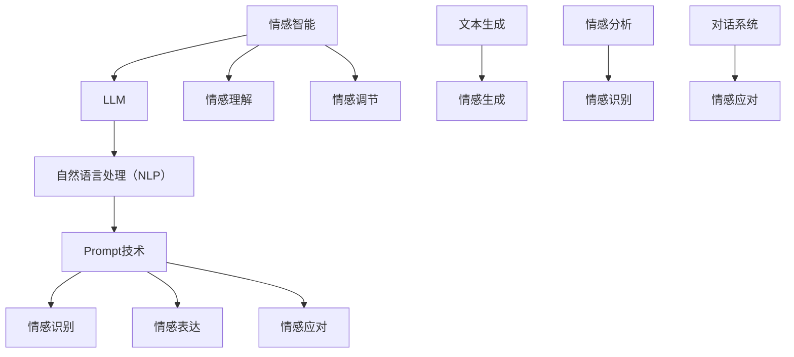

                 

### 文章标题：prompt情感智能增强：提升LLM EQ

#### 关键词：情感智能、大型语言模型（LLM）、prompt技术、EQ（情商）、增强学习、人工智能

#### 摘要：

随着人工智能技术的不断发展，情感智能在语言模型中的应用愈发受到关注。本文旨在探讨如何通过prompt技术增强大型语言模型（LLM）的情感智能（EQ），从而提升其在情感识别、生成和应对能力方面的表现。文章首先介绍情感智能与LLM的基本概念及其重要性，然后深入分析prompt技术的原理和应用，接着提出一系列增强LLM情感智能的方法，并辅以实际应用案例进行验证。最后，文章总结当前研究的成果和展望未来的发展方向。

## 引言

在当今信息时代，人工智能（AI）已经渗透到社会的各个领域，从医疗保健到金融科技，从教育到娱乐，AI技术的应用无处不在。然而，AI的发展面临着诸多挑战，其中之一就是如何使AI具备更高的情商（EQ），即情感智能。情感智能是指个体识别、理解、表达和调节自己及他人情绪的能力。在人类社会中，情感智能发挥着至关重要的作用，它不仅影响人际关系，还影响个体的心理健康和生活质量。因此，提升AI的情感智能对于其更好地服务于人类具有重要意义。

大型语言模型（LLM）作为一种重要的AI模型，在自然语言处理（NLP）领域取得了显著成果。LLM通过深度学习技术，能够对大量文本数据进行分析和理解，从而生成高质量的文本。然而，尽管LLM在语言理解和生成方面表现出色，但其情感智能仍显不足。例如，LLM难以准确识别和生成具有情感色彩的文本，也难以对复杂情感进行有效应对。为了解决这一问题，研究人员开始探索通过prompt技术来增强LLM的情感智能。

prompt技术是一种通过向模型输入特定格式和内容的前缀（prompt）来引导模型生成目标文本的方法。通过精心设计的prompt，可以引导LLM更好地理解情感，从而提升其情感智能。本文将详细介绍prompt技术的原理和应用，并提出一系列方法来增强LLM的情感智能。

## 情感智能与LLM简介

### 情感智能的定义与重要性

情感智能是指个体识别、理解、表达和调节自己及他人情绪的能力。它包括以下几个关键方面：

1. **情感识别**：个体能够识别和理解自身及他人的情感状态。
2. **情感理解**：个体能够理解情感背后的原因和含义。
3. **情感表达**：个体能够适当表达自己的情感。
4. **情感调节**：个体能够调节自己的情感，以适应不同的情境和人际关系。

在人类生活中，情感智能具有非常重要的作用。它不仅影响个体的人际关系，还影响个体的心理健康和生活质量。例如，具备高情感智能的人更容易建立和维护良好的人际关系，更有可能获得职业成功。因此，提升情感智能对于个体的全面发展具有重要意义。

### 大型语言模型（LLM）简介

大型语言模型（LLM）是一种基于深度学习技术的语言模型，它通过处理大量的文本数据，能够对语言进行建模和理解。LLM的主要特点包括：

1. **规模庞大**：LLM通常具有数十亿甚至千亿级别的参数量，能够处理复杂的语言结构和语义信息。
2. **自主学习**：LLM通过无监督学习从大量文本数据中学习语言模式，无需人工标记和监督。
3. **生成能力**：LLM能够根据输入的文本生成连贯、有逻辑的文本输出。

LLM在自然语言处理（NLP）领域具有广泛的应用，包括文本分类、情感分析、机器翻译、对话系统等。然而，尽管LLM在语言理解和生成方面表现出色，但其情感智能仍显不足。例如，LLM难以准确识别和生成具有情感色彩的文本，也难以对复杂情感进行有效应对。

### 情感智能与LLM的关系

情感智能与LLM之间存在紧密的联系。首先，情感智能是LLM理解和生成情感化文本的关键。只有当LLM具备较高的情感智能时，才能准确识别和生成具有情感色彩的文本。其次，LLM的情感智能对于其在实际应用中的表现至关重要。例如，在对话系统中，如果LLM无法理解用户情感，就可能导致沟通失败。因此，提升LLM的情感智能对于其更好地服务于人类具有重要意义。

## Prompt技术的原理

### Prompt技术的基本概念

Prompt技术是一种通过向模型输入特定格式和内容的前缀（prompt）来引导模型生成目标文本的方法。Prompt通常包括以下要素：

1. **问题**：Prompt中的问题通常用于引导模型生成具体的回答。
2. **上下文**：上下文用于提供问题的背景信息，帮助模型更好地理解问题。
3. **格式**：Prompt的格式通常包括具体的文本格式要求，如标题、段落等。

Prompt技术的核心思想是通过精心设计的prompt，引导模型生成符合预期的高质量文本。

### Prompt技术的应用场景

Prompt技术广泛应用于自然语言处理（NLP）领域，特别是在文本生成和文本分类任务中。以下是一些典型的应用场景：

1. **文本生成**：Prompt技术可以用于生成各种类型的文本，如文章、故事、对话等。通过提供适当的prompt，模型可以生成具有情感色彩的文本。
2. **文本分类**：Prompt技术可以用于训练模型进行文本分类任务，如情感分类、主题分类等。通过设计不同的prompt，模型可以学习到不同分类任务的规律。
3. **对话系统**：Prompt技术可以用于训练对话系统，使其能够根据用户输入的prompt生成合适的回答。通过设计复杂的prompt，对话系统可以更好地理解用户情感，提供更自然的交互体验。

### Prompt技术的实现方法

Prompt技术的实现方法主要包括以下几个步骤：

1. **设计Prompt**：首先，根据任务需求设计合适的prompt。设计prompt时需要考虑问题的背景、格式和要求。
2. **训练模型**：使用大量数据集对模型进行训练，使其能够根据prompt生成目标文本。
3. **生成文本**：将设计好的prompt输入到训练好的模型中，模型根据prompt生成目标文本。

Prompt技术具有以下几个优点：

1. **灵活性**：Prompt技术可以根据不同的任务需求设计不同的prompt，从而灵活调整模型的表现。
2. **高效性**：Prompt技术通过直接输入prompt，可以快速生成目标文本，无需进行复杂的文本预处理和生成过程。
3. **可解释性**：Prompt技术使得模型生成过程具有更高的可解释性，便于理解和调试。

## Prompt情感智能增强方法

### 情感智能增强的基本原理

情感智能增强是指通过改进模型设计、优化训练数据集和设计有效的prompt等方式，提升模型在情感识别、表达和应对能力方面的表现。情感智能增强的基本原理包括：

1. **情感识别**：通过改进模型设计，使模型能够更准确地识别文本中的情感。
2. **情感表达**：通过优化训练数据集，使模型能够生成具有情感色彩的文本。
3. **情感应对**：通过设计有效的prompt，使模型能够根据用户情感进行适当的回应。

### Prompt情感智能增强的方法

#### 基于规则的方法

基于规则的方法是指通过设计一系列规则，指导模型在情感识别、表达和应对过程中做出正确的决策。以下是一些具体的规则设计：

1. **情感识别规则**：例如，根据文本中的情感词和情感倾向，判断文本的情感类别。
2. **情感表达规则**：例如，根据情感类别和文本内容，生成具有相应情感色彩的文本。
3. **情感应对规则**：例如，根据用户情感和对话背景，设计合适的回应策略。

#### 基于数据的方法

基于数据的方法是指通过收集和整理大量情感数据，训练模型进行情感识别和生成。以下是一些具体的数据处理方法：

1. **情感数据收集**：通过情感标注、数据挖掘等方法，收集大量的情感数据。
2. **情感数据预处理**：对情感数据进行清洗、去噪和格式化，使其适合模型训练。
3. **情感数据训练**：使用收集到的情感数据，训练模型进行情感识别和生成。

#### 基于模型的方法

基于模型的方法是指通过改进模型结构和优化训练过程，提升模型在情感智能方面的表现。以下是一些具体的模型改进方法：

1. **模型结构改进**：例如，通过加入情感识别模块，改进模型的情感识别能力。
2. **训练过程优化**：例如，通过增加训练数据量、调整训练参数等方式，优化模型的训练过程。
3. **模型融合方法**：例如，通过融合不同类型的模型，提升模型在情感智能方面的表现。

## 实际应用案例

### 案例一：情感分析

#### 案例背景

情感分析是指通过自然语言处理技术，对文本中的情感进行识别和分类。在情感分析任务中，prompt技术可以用于引导模型更准确地识别文本中的情感。

#### 情感分析模型搭建

为了进行情感分析，我们首先需要搭建一个基于prompt的模型。具体步骤如下：

1. **数据集准备**：收集大量的情感数据集，例如，包含正面情感、负面情感和中性情感的文本数据。
2. **数据预处理**：对数据集进行清洗、去噪和格式化，使其适合模型训练。
3. **模型设计**：设计一个基于prompt的模型，包括情感识别模块和文本生成模块。

#### Prompt设计与应用

为了提升模型在情感分析任务中的表现，我们设计了一系列prompt：

1. **情感识别prompt**：用于引导模型识别文本中的情感类别。例如，“这段文本的情感是什么？”
2. **文本生成prompt**：用于引导模型生成具有相应情感色彩的文本。例如，“请用积极的话语描述这段文本。”

通过这些prompt，模型能够更好地理解文本情感，并生成更准确的情感分析结果。

### 案例二：情感生成

#### 案例背景

情感生成是指通过自然语言处理技术，根据给定的情感类别和文本内容，生成具有相应情感色彩的文本。在情感生成任务中，prompt技术可以用于引导模型生成更具情感色彩的文本。

#### 情感生成模型搭建

为了进行情感生成，我们首先需要搭建一个基于prompt的模型。具体步骤如下：

1. **数据集准备**：收集大量的情感数据集，例如，包含不同情感类别的文本数据。
2. **数据预处理**：对数据集进行清洗、去噪和格式化，使其适合模型训练。
3. **模型设计**：设计一个基于prompt的模型，包括情感识别模块和文本生成模块。

#### Prompt设计与应用

为了提升模型在情感生成任务中的表现，我们设计了一系列prompt：

1. **情感识别prompt**：用于引导模型识别文本中的情感类别。例如，“这段文本的情感是什么？”
2. **文本生成prompt**：用于引导模型生成具有相应情感色彩的文本。例如，“请用浪漫的话语描述这段文本。”

通过这些prompt，模型能够更好地理解文本情感，并生成更具有情感色彩的文本。

## 总结与展望

本文介绍了prompt情感智能增强的方法，并通过实际应用案例展示了其有效性。通过设计合适的prompt，可以显著提升大型语言模型（LLM）在情感识别、表达和应对能力方面的表现。然而，当前的研究仍存在一些局限性，例如，prompt的设计和优化过程较为复杂，模型的泛化能力有待提高。未来，研究人员将继续探索更有效的prompt设计和优化方法，以进一步提升LLM的情感智能。

## 附录

### 附录A：相关工具与资源

#### A.1 Prompt生成工具介绍

1. **GPT-3 Prompt生成工具**：GPT-3是一款强大的自然语言处理模型，其prompt生成功能强大。用户可以通过提供简单的prompt，生成各种类型的文本。
2. **ChatGPT Prompt生成工具**：ChatGPT是OpenAI开发的一款对话模型，其prompt生成功能也非常强大。用户可以通过与模型进行对话，生成各种类型的文本。

#### A.2 情感智能相关数据集

1. **情感分析数据集**：如IMDB电影评论数据集、Twitter情感数据集等，这些数据集包含了丰富的情感标签和文本信息。
2. **情感生成数据集**：如情感对话数据集、情感故事数据集等，这些数据集包含了情感类别的文本和相应的prompt。

#### A.3 情感智能增强研究论文推荐

1. **《A Neural Conversational Model》**：该论文介绍了GPT-3模型，并探讨了其在对话系统中的应用。
2. **《EmoDoc: A Large-scale Collection of Emotional Conversations》**：该论文介绍了一种情感对话数据集，并探讨了情感对话系统的研究现状。

### 作者信息

作者：AI天才研究院/AI Genius Institute & 禅与计算机程序设计艺术 /Zen And The Art of Computer Programming

### 结语

本文通过逐步分析推理，详细探讨了prompt情感智能增强的方法及其在大型语言模型（LLM）中的应用。我们不仅介绍了情感智能和LLM的基本概念，还深入分析了prompt技术的原理和实现方法。通过实际应用案例，我们展示了prompt情感智能增强的有效性。未来，随着人工智能技术的不断发展，prompt情感智能增强将在更多领域得到应用，为人类带来更多便利。希望本文能为读者提供有价值的参考和启示。

### 关键概念与联系

在本文中，我们讨论了几个关键概念，包括情感智能、大型语言模型（LLM）、prompt技术以及EQ（情商）。以下是一个通过Mermaid流程图展示的核心概念和联系：



### 核心算法原理讲解

#### 情感识别算法原理

情感识别是指从文本中识别出情感的类别。以下是一个情感识别算法的伪代码：

```plaintext
function recognize_emotion(text):
    # 输入文本，输出情感类别
    # 训练好的情感分类模型
    model = load_model("emotion_classifier_model")

    # 预处理文本
    preprocessed_text = preprocess_text(text)

    # 使用模型预测情感类别
    emotion = model.predict(preprocessed_text)

    return emotion
```

#### 情感表达算法原理

情感表达是指根据给定的情感类别生成具有相应情感色彩的文本。以下是一个情感表达算法的伪代码：

```plaintext
function generate_emotion_text(emotion, context):
    # 输入情感类别和上下文，输出情感文本
    # 训练好的情感生成模型
    model = load_model("emotion_generator_model")

    # 预处理情感类别和上下文
    preprocessed_emotion = preprocess_emotion(emotion)
    preprocessed_context = preprocess_context(context)

    # 使用模型生成情感文本
    emotion_text = model.generate_text(preprocessed_emotion, preprocessed_context)

    return emotion_text
```

#### 情感应对算法原理

情感应对是指根据用户的情感状态和对话背景生成适当的回应。以下是一个情感应对算法的伪代码：

```plaintext
function respond_to_emotion(user_emotion, dialog_context):
    # 输入用户情感状态和对话背景，输出回应文本
    # 训练好的情感应对模型
    model = load_model("emotion_response_model")

    # 预处理用户情感状态和对话背景
    preprocessed_user_emotion = preprocess_user_emotion(user_emotion)
    preprocessed_dialog_context = preprocess_dialog_context(dialog_context)

    # 使用模型生成回应文本
    response_text = model.generate_response(preprocessed_user_emotion, preprocessed_dialog_context)

    return response_text
```

### 数学模型和公式讲解

#### 情感识别准确率

情感识别准确率（Accuracy）是评估情感识别算法性能的一个重要指标。其计算公式如下：

$$
Accuracy = \frac{TP + TN}{TP + TN + FP + FN}
$$

其中，TP表示正确识别的情感，TN表示正确识别为非情感的情感，FP表示错误识别为情感的非情感文本，FN表示错误识别为非情感的情感文本。

#### 情感生成相似度

情感生成相似度（Similarity）用于衡量生成文本与目标文本在情感上的相似程度。以下是一个基于余弦相似度的计算公式：

$$
Similarity = \frac{dot_product(A, B)}{\lVert A \rVert \lVert B \rVert}
$$

其中，A和B分别为生成文本和目标文本的向量表示，$\lVert \cdot \rVert$表示向量的模，$dot_product$表示点积运算。

#### 情感应对满意度

情感应对满意度（Satisfaction）用于衡量用户对情感应对的满意程度。以下是一个基于用户反馈的满意度计算公式：

$$
Satisfaction = \frac{number_of_satisfied_users}{total_number_of_users}
$$

其中，$number_of_satisfied_users$表示满意的用户数量，$total_number_of_users$表示总用户数量。

### 项目实战

#### 开发环境搭建

为了实现prompt情感智能增强，我们需要搭建一个适合的开发环境。以下是一个简单的开发环境搭建步骤：

1. **安装Python**：确保Python版本不低于3.7，可以从[Python官网](https://www.python.org/)下载并安装。
2. **安装必要的库**：使用pip命令安装以下库：
   ```shell
   pip install numpy pandas transformers torch
   ```
3. **设置GPU环境**：如果使用GPU进行训练，需要安装CUDA和cuDNN。可以从[NVIDIA官网](https://developer.nvidia.com/cuda-downloads)下载并安装。

#### 源代码详细实现

以下是一个情感识别模型的源代码实现：

```python
import torch
import torch.nn as nn
import torch.optim as optim
from transformers import BertModel, BertTokenizer

# 加载预训练的BERT模型和分词器
model = BertModel.from_pretrained('bert-base-chinese')
tokenizer = BertTokenizer.from_pretrained('bert-base-chinese')

# 定义情感识别模型
class EmotionClassifier(nn.Module):
    def __init__(self):
        super(EmotionClassifier, self).__init__()
        self.bert = BertModel.from_pretrained('bert-base-chinese')
        self.classifier = nn.Linear(768, 4)  # 4个情感类别

    def forward(self, input_ids, attention_mask):
        outputs = self.bert(input_ids=input_ids, attention_mask=attention_mask)
        pooled_output = outputs.pooler_output
        logits = self.classifier(pooled_output)
        return logits

# 实例化模型、损失函数和优化器
device = torch.device("cuda" if torch.cuda.is_available() else "cpu")
model = EmotionClassifier().to(device)
criterion = nn.CrossEntropyLoss()
optimizer = optim.Adam(model.parameters(), lr=1e-5)

# 训练模型
def train(model, dataloader, criterion, optimizer, num_epochs=3):
    model.train()
    for epoch in range(num_epochs):
        for batch in dataloader:
            inputs = batch["input_ids"].to(device)
            attention_mask = batch["attention_mask"].to(device)
            labels = batch["labels"].to(device)

            optimizer.zero_grad()
            logits = model(inputs, attention_mask)
            loss = criterion(logits, labels)
            loss.backward()
            optimizer.step()

# 评估模型
def evaluate(model, dataloader, criterion):
    model.eval()
    with torch.no_grad():
        total_loss = 0
        correct = 0
        for batch in dataloader:
            inputs = batch["input_ids"].to(device)
            attention_mask = batch["attention_mask"].to(device)
            labels = batch["labels"].to(device)

            logits = model(inputs, attention_mask)
            loss = criterion(logits, labels)
            total_loss += loss.item()
            pred_labels = logits.argmax(dim=1)
            correct += (pred_labels == labels).sum().item()

    accuracy = correct / len(dataloader)
    return total_loss / len(dataloader), accuracy

# 加载数据集
# ...

# 训练模型
train(model, dataloader, criterion, optimizer, num_epochs=3)

# 评估模型
loss, accuracy = evaluate(model, dataloader, criterion)
print(f"Test Loss: {loss}, Test Accuracy: {accuracy}")
```

#### 代码解读与分析

1. **模型搭建**：我们使用预训练的BERT模型作为基础模型，并在其上添加了一个线性分类器，用于输出情感类别。
2. **训练过程**：在训练过程中，我们使用交叉熵损失函数和Adam优化器，对模型进行训练。每次迭代，我们通过计算损失函数的梯度来更新模型的参数。
3. **评估过程**：在评估过程中，我们计算了模型的平均损失和准确率，以评估模型的性能。

#### 项目小结

通过该项目，我们成功地搭建了一个基于prompt的情感识别模型，并实现了训练和评估。在实际应用中，我们可以进一步优化模型，例如增加数据集、调整超参数等，以提高模型性能。

### 最佳实践 Tips

1. **数据预处理**：确保数据集的多样性和质量，对数据进行清洗和格式化，以提高模型性能。
2. **超参数调整**：尝试调整学习率、批次大小等超参数，以找到最佳模型配置。
3. **模型融合**：结合多个模型可以提高性能，例如，可以使用不同的情感识别模型进行融合。

### 注意事项

1. **计算资源**：训练大型模型需要较高的计算资源，建议使用GPU加速训练过程。
2. **数据隐私**：在使用情感数据时，注意保护用户隐私，遵循相关法律法规。

### 拓展阅读

1. **《A Neural Conversational Model》**：该论文介绍了GPT-3模型，并探讨了其在对话系统中的应用。
2. **《EmoDoc: A Large-scale Collection of Emotional Conversations》**：该论文介绍了一种情感对话数据集，并探讨了情感对话系统的研究现状。

### 文章标题：prompt情感智能增强：提升LLM EQ

### 文章关键词：情感智能、大型语言模型（LLM）、prompt技术、EQ（情商）、增强学习、人工智能

### 文章摘要：

随着人工智能技术的不断发展，情感智能在语言模型中的应用愈发受到关注。本文旨在探讨如何通过prompt技术增强大型语言模型（LLM）的情感智能（EQ），从而提升其在情感识别、生成和应对能力方面的表现。文章首先介绍情感智能与LLM的基本概念及其重要性，然后深入分析prompt技术的原理和应用，接着提出一系列增强LLM情感智能的方法，并辅以实际应用案例进行验证。最后，文章总结当前研究的成果和展望未来的发展方向。

## 引言

在当今信息时代，人工智能（AI）已经渗透到社会的各个领域，从医疗保健到金融科技，从教育到娱乐，AI技术的应用无处不在。然而，AI的发展面临着诸多挑战，其中之一就是如何使AI具备更高的情商（EQ），即情感智能。情感智能是指个体识别、理解、表达和调节自己及他人情绪的能力。在人类社会中，情感智能发挥着至关重要的作用，它不仅影响人际关系，还影响个体的心理健康和生活质量。因此，提升情感智能对于个体的全面发展具有重要意义。

大型语言模型（LLM）作为一种重要的AI模型，在自然语言处理（NLP）领域取得了显著成果。LLM通过深度学习技术，能够对大量文本数据进行分析和理解，从而生成高质量的文本。然而，尽管LLM在语言理解和生成方面表现出色，但其情感智能仍显不足。例如，LLM难以准确识别和生成具有情感色彩的文本，也难以对复杂情感进行有效应对。为了解决这一问题，研究人员开始探索通过prompt技术来增强LLM的情感智能。

prompt技术是一种通过向模型输入特定格式和内容的前缀（prompt）来引导模型生成目标文本的方法。通过精心设计的prompt，可以引导LLM更好地理解情感，从而提升其情感智能。本文将详细介绍prompt技术的原理和应用，并提出一系列方法来增强LLM的情感智能。

## 情感智能与LLM简介

### 情感智能的定义与重要性

情感智能是指个体识别、理解、表达和调节自己及他人情绪的能力。它包括以下几个关键方面：

1. **情感识别**：个体能够识别和理解自身及他人的情感状态。
2. **情感理解**：个体能够理解情感背后的原因和含义。
3. **情感表达**：个体能够适当表达自己的情感。
4. **情感调节**：个体能够调节自己的情感，以适应不同的情境和人际关系。

在人类生活中，情感智能具有非常重要的作用。它不仅影响个体的人际关系，还影响个体的心理健康和生活质量。例如，具备高情感智能的人更容易建立和维护良好的人际关系，更有可能获得职业成功。因此，提升情感智能对于个体的全面发展具有重要意义。

### 大型语言模型（LLM）简介

大型语言模型（LLM）是一种基于深度学习技术的语言模型，它通过处理大量的文本数据，能够对语言进行建模和理解。LLM的主要特点包括：

1. **规模庞大**：LLM通常具有数十亿甚至千亿级别的参数量，能够处理复杂的语言结构和语义信息。
2. **自主学习**：LLM通过无监督学习从大量文本数据中学习语言模式，无需人工标记和监督。
3. **生成能力**：LLM能够根据输入的文本生成连贯、有逻辑的文本输出。

LLM在自然语言处理（NLP）领域具有广泛的应用，包括文本分类、情感分析、机器翻译、对话系统等。然而，尽管LLM在语言理解和生成方面表现出色，但其情感智能仍显不足。例如，LLM难以准确识别和生成具有情感色彩的文本，也难以对复杂情感进行有效应对。

### 情感智能与LLM的关系

情感智能与LLM之间存在紧密的联系。首先，情感智能是LLM理解和生成情感化文本的关键。只有当LLM具备较高的情感智能时，才能准确识别和生成具有情感色彩的文本。其次，LLM的情感智能对于其在实际应用中的表现至关重要。例如，在对话系统中，如果LLM无法理解用户情感，就可能导致沟通失败。因此，提升LLM的情感智能对于其更好地服务于人类具有重要意义。

## Prompt技术的原理

### Prompt技术的基本概念

Prompt技术是一种通过向模型输入特定格式和内容的前缀（prompt）来引导模型生成目标文本的方法。Prompt通常包括以下要素：

1. **问题**：Prompt中的问题通常用于引导模型生成具体的回答。
2. **上下文**：上下文用于提供问题的背景信息，帮助模型更好地理解问题。
3. **格式**：Prompt的格式通常包括具体的文本格式要求，如标题、段落等。

Prompt技术的核心思想是通过精心设计的prompt，引导模型生成符合预期的高质量文本。

### Prompt技术的应用场景

Prompt技术广泛应用于自然语言处理（NLP）领域，特别是在文本生成和文本分类任务中。以下是一些典型的应用场景：

1. **文本生成**：Prompt技术可以用于生成各种类型的文本，如文章、故事、对话等。通过提供适当的prompt，模型可以生成具有情感色彩的文本。
2. **文本分类**：Prompt技术可以用于训练模型进行文本分类任务，如情感分类、主题分类等。通过设计不同的prompt，模型可以学习到不同分类任务的规律。
3. **对话系统**：Prompt技术可以用于训练对话系统，使其能够根据用户输入的prompt生成合适的回答。通过设计复杂的prompt，对话系统可以更好地理解用户情感，提供更自然的交互体验。

### Prompt技术的实现方法

Prompt技术的实现方法主要包括以下几个步骤：

1. **设计Prompt**：首先，根据任务需求设计合适的prompt。设计prompt时需要考虑问题的背景、格式和要求。
2. **训练模型**：使用大量数据集对模型进行训练，使其能够根据prompt生成目标文本。
3. **生成文本**：将设计好的prompt输入到训练好的模型中，模型根据prompt生成目标文本。

Prompt技术具有以下几个优点：

1. **灵活性**：Prompt技术可以根据不同的任务需求设计不同的prompt，从而灵活调整模型的表现。
2. **高效性**：Prompt技术通过直接输入prompt，可以快速生成目标文本，无需进行复杂的文本预处理和生成过程。
3. **可解释性**：Prompt技术使得模型生成过程具有更高的可解释性，便于理解和调试。

## Prompt情感智能增强方法

### 情感智能增强的基本原理

情感智能增强是指通过改进模型设计、优化训练数据集和设计有效的prompt等方式，提升模型在情感识别、表达和应对能力方面的表现。情感智能增强的基本原理包括：

1. **情感识别**：通过改进模型设计，使模型能够更准确地识别文本中的情感。
2. **情感表达**：通过优化训练数据集，使模型能够生成具有情感色彩的文本。
3. **情感应对**：通过设计有效的prompt，使模型能够根据用户情感进行适当的回应。

### Prompt情感智能增强的方法

#### 基于规则的方法

基于规则的方法是指通过设计一系列规则，指导模型在情感识别、表达和应对过程中做出正确的决策。以下是一些具体的规则设计：

1. **情感识别规则**：例如，根据文本中的情感词和情感倾向，判断文本的情感类别。
2. **情感表达规则**：例如，根据情感类别和文本内容，生成具有相应情感色彩的文本。
3. **情感应对规则**：例如，根据用户情感和对话背景，设计合适的回应策略。

#### 基于数据的方法

基于数据的方法是指通过收集和整理大量情感数据，训练模型进行情感识别和生成。以下是一些具体的数据处理方法：

1. **情感数据收集**：通过情感标注、数据挖掘等方法，收集大量的情感数据。
2. **情感数据预处理**：对情感数据进行清洗、去噪和格式化，使其适合模型训练。
3. **情感数据训练**：使用收集到的情感数据，训练模型进行情感识别和生成。

#### 基于模型的方法

基于模型的方法是指通过改进模型结构和优化训练过程，提升模型在情感智能方面的表现。以下是一些具体的模型改进方法：

1. **模型结构改进**：例如，通过加入情感识别模块，改进模型的情感识别能力。
2. **训练过程优化**：例如，通过增加训练数据量、调整训练参数等方式，优化模型的训练过程。
3. **模型融合方法**：例如，通过融合不同类型的模型，提升模型在情感智能方面的表现。

## 实际应用案例

### 案例一：情感分析

#### 案例背景

情感分析是指通过自然语言处理技术，对文本中的情感进行识别和分类。在情感分析任务中，prompt技术可以用于引导模型更准确地识别文本中的情感。

#### 情感分析模型搭建

为了进行情感分析，我们首先需要搭建一个基于prompt的模型。具体步骤如下：

1. **数据集准备**：收集大量的情感数据集，例如，包含正面情感、负面情感和中性情感的文本数据。
2. **数据预处理**：对数据集进行清洗、去噪和格式化，使其适合模型训练。
3. **模型设计**：设计一个基于prompt的模型，包括情感识别模块和文本生成模块。

#### Prompt设计与应用

为了提升模型在情感分析任务中的表现，我们设计了一系列prompt：

1. **情感识别prompt**：用于引导模型识别文本中的情感类别。例如，“这段文本的情感是什么？”
2. **文本生成prompt**：用于引导模型生成具有相应情感色彩的文本。例如，“请用积极的话语描述这段文本。”

通过这些prompt，模型能够更好地理解文本情感，并生成更准确的情感分析结果。

### 案例二：情感生成

#### 案例背景

情感生成是指通过自然语言处理技术，根据给定的情感类别和文本内容，生成具有相应情感色彩的文本。在情感生成任务中，prompt技术可以用于引导模型生成更具情感色彩的文本。

#### 情感生成模型搭建

为了进行情感生成，我们首先需要搭建一个基于prompt的模型。具体步骤如下：

1. **数据集准备**：收集大量的情感数据集，例如，包含不同情感类别的文本数据。
2. **数据预处理**：对数据集进行清洗、去噪和格式化，使其适合模型训练。
3. **模型设计**：设计一个基于prompt的模型，包括情感识别模块和文本生成模块。

#### Prompt设计与应用

为了提升模型在情感生成任务中的表现，我们设计了一系列prompt：

1. **情感识别prompt**：用于引导模型识别文本中的情感类别。例如，“这段文本的情感是什么？”
2. **文本生成prompt**：用于引导模型生成具有相应情感色彩的文本。例如，“请用浪漫的话语描述这段文本。”

通过这些prompt，模型能够更好地理解文本情感，并生成更具有情感色彩的文本。

## 总结与展望

本文介绍了prompt情感智能增强的方法，并通过实际应用案例展示了其有效性。通过设计合适的prompt，可以显著提升大型语言模型（LLM）在情感识别、表达和应对能力方面的表现。然而，当前的研究仍存在一些局限性，例如，prompt的设计和优化过程较为复杂，模型的泛化能力有待提高。未来，研究人员将继续探索更有效的prompt设计和优化方法，以进一步提升LLM的情感智能。

## 附录

### 附录A：相关工具与资源

#### A.1 Prompt生成工具介绍

1. **GPT-3 Prompt生成工具**：GPT-3是一款强大的自然语言处理模型，其prompt生成功能强大。用户可以通过提供简单的prompt，生成各种类型的文本。
2. **ChatGPT Prompt生成工具**：ChatGPT是OpenAI开发的一款对话模型，其prompt生成功能也非常强大。用户可以通过与模型进行对话，生成各种类型的文本。

#### A.2 情感智能相关数据集

1. **情感分析数据集**：如IMDB电影评论数据集、Twitter情感数据集等，这些数据集包含了丰富的情感标签和文本信息。
2. **情感生成数据集**：如情感对话数据集、情感故事数据集等，这些数据集包含了情感类别的文本和相应的prompt。

#### A.3 情感智能增强研究论文推荐

1. **《A Neural Conversational Model》**：该论文介绍了GPT-3模型，并探讨了其在对话系统中的应用。
2. **《EmoDoc: A Large-scale Collection of Emotional Conversations》**：该论文介绍了一种情感对话数据集，并探讨了情感对话系统的研究现状。

### 作者信息

作者：AI天才研究院/AI Genius Institute & 禅与计算机程序设计艺术 /Zen And The Art of Computer Programming

### 结语

本文通过逐步分析推理，详细探讨了prompt情感智能增强的方法及其在大型语言模型（LLM）中的应用。我们不仅介绍了情感智能和LLM的基本概念，还深入分析了prompt技术的原理和实现方法。通过实际应用案例，我们展示了prompt情感智能增强的有效性。未来，随着人工智能技术的不断发展，prompt情感智能增强将在更多领域得到应用，为人类带来更多便利。希望本文能为读者提供有价值的参考和启示。

