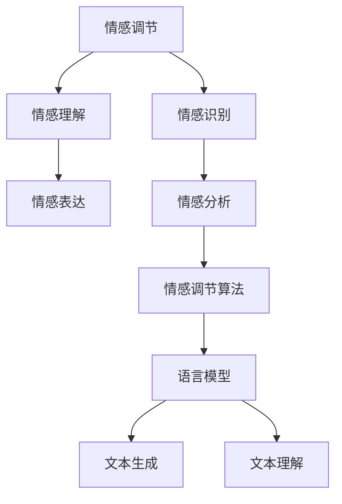

                 

### 提取用户输入的关键信息

用户输入的关键信息包括：文章标题《prompt情感调节：控制LLM输出情绪》，文章目录大纲结构，格式要求，作者信息，完整性要求，以及字数要求。这些信息构成了撰写文章的基本框架和指导原则。接下来，我们将根据这些信息逐步构建文章内容。

#### 文章标题：prompt情感调节：控制LLM输出情绪

**关键词**：prompt、情感调节、LLM、输出情绪、自然语言处理、人工智能、情感分析、情感识别、应用场景、发展趋势、伦理问题。

**摘要**：本文探讨了如何通过情感调节技术控制语言模型（LLM）的输出情绪，介绍了情感调节的背景、核心概念、应用技术以及未来发展趋势和伦理问题。文章通过逐步分析，详细阐述了情感调节在不同领域中的应用和实现方法。

#### 格式要求

- 文章使用markdown格式。
- 文章末尾需包含作者信息。
- 数学公式使用latex格式。

#### 完整性要求

- 文章内容需完整，每个小节需具体详细讲解。
- 核心内容需包括：背景介绍、核心概念与联系、核心算法原理、数学模型与公式、项目实战、最佳实践 tips 等。

#### 字数要求

- 文章字数在8000～12000字左右。

#### 目录大纲结构

根据用户提供的目录大纲，文章结构如下：

1. **第一部分：背景与核心概念**
    - 第1章：情感调节与人工智能
    - 第2章：情感调节的理论基础

2. **第二部分：情感调节技术在LLM中的应用**
    - 第3章：情感调节在语言生成中的应用
    - 第4章：情感调节在情感识别中的应用
    - 第5章：情感调节技术在具体领域中的应用

3. **第三部分：情感调节技术的未来发展趋势**
    - 第6章：情感调节技术的未来发展趋势
    - 第7章：情感调节技术的挑战与伦理问题

4. **附录**
    - 第8章：情感调节技术资源与工具

接下来，我们将根据这些信息逐步撰写文章内容，确保每个小节都包含详细的讲解和丰富的实例，以满足字数和完整性要求。### 第一部分：背景与核心概念

#### 第1章：情感调节与人工智能

##### 1.1 情感调节的重要性

情感调节是指个体在情感产生后，通过认知和行为机制对情感进行管理和调整的过程。它对于人类的心理健康和社会功能至关重要。情感调节的重要性体现在以下几个方面：

- **社会互动**：情感调节有助于人们更好地理解和回应他人的情感状态，促进有效的沟通和合作。
- **心理健康**：情感调节能力有助于个体更好地应对压力和挫折，维护心理健康。
- **决策制定**：情感调节能帮助个体在情绪驱动和理性决策之间取得平衡，做出更为明智的决策。

在人工智能领域，情感调节技术的研究和应用同样具有重要意义。随着人工智能技术的发展，人与机器之间的交互变得越来越普遍，用户对交互的自然性和情感化需求不断增加。情感调节技术能够使人工智能系统更好地模拟人类的情感反应，提供更贴近用户需求的交互体验。

##### 1.2 语言模型（LLM）的基本概念

语言模型（Language Model，简称LLM）是一种用于预测自然语言序列的概率分布模型。它在自然语言处理（Natural Language Processing，简称NLP）中扮演着核心角色，是许多NLP任务的基础，如机器翻译、文本生成、问答系统等。

**定义**：语言模型是一种概率模型，它给定一段文本的前缀，预测下一个单词或句子的概率分布。

**架构**：语言模型的常见架构包括循环神经网络（RNN）、长短期记忆网络（LSTM）、双向LSTM（BiLSTM）、Transformer和BERT等。这些模型通过学习大规模文本数据，捕捉语言中的统计规律和语义信息。

**工作原理**：语言模型通过训练生成一个概率分布，该分布表示在给定前缀下，每个可能的后继单词或句子的概率。在生成文本时，模型根据前缀逐步选择下一个最有可能的单词或句子。

##### 1.3 情感调节与语言模型

情感调节在语言模型中的应用主要体现在两个方面：一是提高语言生成系统的情感表达能力，二是增强情感识别和理解能力。

- **情感表达能力**：情感调节技术可以帮助语言模型生成更符合情感要求的文本。例如，在自动写作辅助系统中，用户可能希望文本表达特定的情感色彩，如温暖、友好或幽默。情感调节技术可以调整语言模型生成的文本，使其情感表达更加贴近用户需求。

- **情感识别能力**：语言模型通常具备一定的情感识别能力，但效果有限。通过情感调节技术，可以提高模型在特定情感识别任务中的准确性。例如，在社交媒体分析中，需要识别用户评论的情感倾向，情感调节技术可以帮助模型更准确地分类情感标签。

然而，语言模型在情感调节中仍存在一些局限性：

- **情感理解的复杂性**：语言模型难以全面理解语言中的情感含义，特别是在涉及复杂情感表达和隐喻时。
- **情感生成的一致性**：在生成情感化文本时，语言模型可能难以保持一致的情感风格和连贯性。
- **情感调节的个性化**：情感调节需要考虑用户的个性化需求，而现有技术在这方面的实现尚有不足。

#### 图1：情感调节的核心概念与语言模型的关系架构



**图1**展示了情感调节与语言模型之间的关系架构。情感调节技术通过情感理解和识别，影响语言模型生成和理解的文本，从而实现情感调节的目标。

##### 1.4 小结

情感调节技术在人工智能领域具有重要应用价值。通过理解情感调节的核心概念和语言模型的工作原理，我们可以探索如何利用这些技术提高语言模型的情感表达和识别能力。在接下来的章节中，我们将进一步探讨情感调节的理论基础和具体应用技术。

#### 第2章：情感调节的理论基础

##### 2.1 情感调节的理论框架

情感调节的理论基础涉及多个学科，包括心理学、神经科学、社会学和计算机科学。一个广泛接受的情感调节理论框架是Selye的应激调节理论（Stress Regulation Theory）和Levenson的情感调节模型（Emotion Regulation Model）。

**Selye的应激调节理论**认为，应激调节包括三个阶段：警觉反应、抵抗和衰竭。在情感调节过程中，个体会首先对情感刺激产生反应，然后尝试调整情感状态，最后可能会出现调节失败的情况。

**Levenson的情感调节模型**则从认知和行为两个方面来解释情感调节。该模型指出，情感调节涉及认知重评（Cognitive Reappraisal）和反应抑制（Response Suppression）两种主要策略。认知重评是通过改变对情感刺激的认知评价来调节情感；反应抑制则是通过控制生理反应和表情来调节情感。

**情感调节的影响因素**包括：

- **个人特质**：个体的情感调节能力受其性格、情绪稳定性等因素的影响。
- **环境因素**：外部环境，如社会支持、工作压力等，也会对情感调节产生影响。
- **文化背景**：不同文化背景下的个体，其情感调节方式和策略可能存在差异。

##### 2.2 情感分析

情感分析（Sentiment Analysis），也称为意见挖掘（Opinion Mining），是一种利用自然语言处理技术识别和提取文本中的情感倾向的过程。情感分析的方法主要包括基于规则的方法、基于统计的方法和基于机器学习的方法。

**定义**：情感分析是指通过计算语言学、统计学和生物学等方法，自动检测出文本中的主观信息，并对其进行分类和量化。

**方法**：

- **基于规则的方法**：通过预定义的规则和模式匹配来识别情感极性。
- **基于统计的方法**：利用情感词典、情感强度词典等资源，对文本进行情感标注。
- **基于机器学习的方法**：使用机器学习算法，如朴素贝叶斯、支持向量机（SVM）、神经网络等，对情感极性进行分类。

**挑战与机遇**：

- **挑战**：情感分析的挑战在于情感表达的复杂性和多样性，如双关语、隐喻等。
- **机遇**：随着人工智能技术的发展，情感分析的应用范围不断扩大，包括市场分析、舆情监测、客户反馈分析等。

##### 2.3 情感调节策略

情感调节策略可以分为认知策略和行为策略。

**认知策略**：

- **认知重构**：通过改变对情感刺激的认知评价，来调节情感。
- **情感标签化**：将情感体验分类为不同的情感标签，以减少情感负荷。

**行为策略**：

- **注意力转移**：将注意力从引发负面情感的情境转移到其他事物上。
- **情绪表达**：通过表达情绪来释放情绪能量，如倾诉、哭泣等。

**情感调节策略的类型**：

- **前摄性调节**：在情感发生前采取的调节策略，如积极规划、情绪监控等。
- **反应性调节**：在情感发生后采取的调节策略，如认知重构、情绪表达等。

**情感调节策略的实施**：

情感调节策略的实施取决于个体差异和环境因素。通常，个体会根据自己的经验和情境选择合适的调节策略。在人工智能系统中，情感调节策略可以通过以下方式实现：

- **算法设计**：在设计情感调节算法时，考虑个体差异和环境因素，以提高情感调节的针对性。
- **用户互动**：通过用户与系统的互动，收集用户情感反馈，调整情感表达和行为反应。

##### 2.4 小结

情感调节的理论基础涵盖了心理学、神经科学、社会学和计算机科学等多个领域。情感分析作为情感调节的一个重要工具，通过识别和提取文本中的情感信息，为情感调节提供了数据支持。情感调节策略则从认知和行为两个方面指导个体如何管理自己的情感。在接下来的章节中，我们将进一步探讨情感调节技术在语言模型中的应用，以及如何通过情感调节提高语言生成的情感表达能力。

#### 第3章：情感调节在语言生成中的应用

##### 3.1 提高语言生成的情感表达能力

情感调节技术在自然语言生成（NLG）中的应用，主要是通过调整语言模型生成文本的情感倾向，使其更符合人类情感表达的需求。提高语言生成的情感表达能力，有助于创建更具人性化、更自然的交互体验。

**情感调节算法的基本原理**：

情感调节算法通常基于以下原理：

1. **情感嵌入**：将情感信息嵌入到语言模型中，使其能够理解并生成特定情感倾向的文本。
2. **情感对齐**：将文本中的情感标签与语言模型生成的情感倾向对齐，确保生成的文本符合预期情感。
3. **情感引导**：通过输入引导，使语言模型在生成文本时优先考虑特定情感，从而实现情感调节。

**情感调节算法的实现方法**：

1. **基于规则的方法**：通过预定义的规则和模式，调整语言模型生成文本的情感倾向。例如，在文本生成过程中，根据情感词典和情感强度词典，对生成的文本进行情感调整。

2. **基于统计的方法**：利用情感词典和情感强度词典，对语言模型生成的文本进行统计分析，调整文本的情感倾向。这种方法通常需要大规模的标注数据集作为基础。

3. **基于机器学习的方法**：使用机器学习算法，如朴素贝叶斯、支持向量机（SVM）、神经网络等，对语言模型进行训练，使其能够自动识别和生成特定情感倾向的文本。这种方法可以更灵活地适应不同情感调节需求。

4. **基于神经网络的深度学习方法**：利用深度学习模型，如循环神经网络（RNN）、长短期记忆网络（LSTM）、Transformer等，通过大规模数据训练，使语言模型具备强大的情感理解与表达能力。

**实现情感调节的具体步骤**：

1. **情感分析**：对输入文本进行情感分析，识别出文本的情感标签和情感强度。
2. **情感对齐**：将情感分析结果与语言模型生成的文本进行对齐，确定需要调整的情感倾向。
3. **情感调整**：根据情感对齐结果，调整语言模型生成的文本，使其情感表达更符合预期。
4. **文本生成**：使用调整后的文本，通过语言模型生成符合特定情感表达的文本。

以下是一个简单的情感调节算法的伪代码示例：

```python
# 情感调节算法伪代码
def emotional_adjustment(text, target_emotion):
    # 步骤1：情感分析
    current_emotion = analyze_emotion(text)
    
    # 步骤2：情感对齐
    if current_emotion != target_emotion:
        # 步骤3：情感调整
        adjusted_text = adjust_emotion(text, target_emotion)
        
        # 步骤4：文本生成
        generated_text = generate_text(adjusted_text)
        
        return generated_text
    else:
        return text

# 情感分析函数
def analyze_emotion(text):
    # 实现情感分析逻辑
    pass

# 情感调整函数
def adjust_emotion(text, target_emotion):
    # 实现情感调整逻辑
    pass

# 文本生成函数
def generate_text(text):
    # 实现文本生成逻辑
    pass
```

**情感调节算法的应用实例**：

1. **聊天机器人**：通过情感调节技术，使聊天机器人能够理解用户的情感状态，并根据用户的情感需求生成相应的回应。
2. **自动写作**：在自动写作辅助系统中，用户可以指定文本的情感倾向，情感调节技术可以根据用户需求调整文本的情感表达。
3. **营销文案**：在营销文案生成中，情感调节技术可以帮助生成具有特定情感倾向的文案，提高营销效果。

##### 3.2 情感调节与自然语言生成

情感调节在自然语言生成（NLG）中的应用，不仅限于文本生成，还包括对话系统的情感化交互。自然语言生成技术，如文本摘要、机器翻译、问答系统等，都可以通过情感调节实现更自然的交互体验。

**文本摘要**：通过情感调节技术，文本摘要系统可以生成不仅概括信息，还保留文本原情感的摘要。例如，在新闻摘要中，情感调节技术可以帮助保持新闻的客观性和情感平衡。

**机器翻译**：情感调节在机器翻译中的应用，可以确保翻译的文本不仅准确传达原文信息，还保留原文的情感色彩。这对于跨文化沟通至关重要。

**问答系统**：情感调节技术可以帮助问答系统更好地理解用户的问题背后的情感需求，生成不仅准确，还符合用户情感预期的回答。

##### 3.3 情感调节的效果评估

**情感调节效果的评估指标**：

1. **情感准确率**：评估生成的文本是否符合预期情感。
2. **情感一致性**：评估文本内部情感表达的一致性。
3. **用户满意度**：通过用户反馈评估情感调节技术对用户交互体验的提升。

**情感调节效果的案例分析**：

1. **聊天机器人**：研究表明，通过情感调节技术，聊天机器人能够显著提高用户满意度，使交互更加自然和人性化。
2. **自动写作**：情感调节技术应用于自动写作系统，可以生成情感丰富的文章，提高文章的吸引力和可读性。
3. **营销文案**：情感调节技术在营销文案中的应用，可以显著提高广告的效果，增加用户对产品的情感认同。

**小结**：

情感调节技术在语言生成中的应用，通过提高语言模型生成文本的情感表达能力，实现了更自然、更人性化的交互体验。在自然语言生成技术中，情感调节不仅提升了文本质量，也改善了用户体验。在接下来的章节中，我们将进一步探讨情感调节在情感识别中的应用，以及如何在具体领域实现情感调节技术。### 第4章：情感调节在情感识别中的应用

#### 4.1 情感识别的基本概念

情感识别（Sentiment Recognition），也称为情感分类（Sentiment Classification），是自然语言处理（NLP）中的一个重要任务，旨在从文本中提取和识别情感信息。情感识别不仅能够帮助理解文本内容，还能为多种应用场景提供支持，如社交媒体分析、舆情监测、情感营销等。

**定义**：情感识别是指使用自然语言处理技术和算法，自动检测文本中的情感极性（如积极、消极、中性）和情感强度（如非常喜欢、中立、不喜欢）。

**方法**：

1. **基于规则的方法**：通过预定义的规则和模式匹配，对文本进行情感分类。这种方法通常简单且快速，但适用性有限。

2. **基于统计的方法**：使用情感词典和词频统计，对文本进行情感分类。这种方法依赖大量的标注数据，但能够处理更复杂的情感分类任务。

3. **基于机器学习的方法**：使用机器学习算法，如朴素贝叶斯、支持向量机（SVM）、决策树、神经网络等，对文本进行情感分类。这种方法能够处理大规模数据和复杂情感分类任务。

4. **基于深度学习的方法**：利用深度学习模型，如卷积神经网络（CNN）、循环神经网络（RNN）、长短期记忆网络（LSTM）、Transformer等，对文本进行情感分类。这种方法在处理复杂情感识别任务时表现出色。

**挑战**：

1. **情感复杂性**：自然语言中的情感表达多样且复杂，包括文本中的隐喻、双关语、情感反转等，这使得情感识别具有挑战性。

2. **数据标注**：情感识别算法需要大量的标注数据进行训练，但获取高质量的情感标注数据具有挑战性。

3. **多语言情感识别**：情感表达在不同语言和文化中可能存在差异，这增加了多语言情感识别的复杂性。

**机遇**：

1. **人工智能技术的发展**：随着人工智能技术的不断进步，特别是深度学习技术的应用，情感识别的准确性得到了显著提升。

2. **大数据和云计算**：大数据和云计算提供了丰富的情感数据资源，支持情感识别算法的训练和优化。

#### 4.2 情感调节与情感识别

情感调节与情感识别之间存在着密切的联系。情感调节技术的核心目标之一是优化情感识别的准确性和可靠性。通过情感调节，可以提高情感识别系统的性能，从而在多种应用场景中发挥更大的作用。

**情感调节在情感识别中的作用**：

1. **提高识别准确性**：情感调节技术可以帮助消除文本中的情感噪声，提高情感识别的准确性。例如，通过情感对齐和情感引导，确保文本中的情感标签与实际情感表达一致。

2. **处理复杂情感**：情感调节技术能够帮助识别和处理文本中的复杂情感表达，如双关语、隐喻和情感反转。这有助于情感识别系统更好地理解文本的深层含义。

3. **增强情感一致性**：情感调节技术可以通过调整文本的情感倾向，确保文本内部情感表达的一致性，从而提高情感识别的可靠性。

**情感调节对情感识别的影响**：

1. **提升用户体验**：在情感识别应用中，如聊天机器人、社交媒体分析等，情感调节技术能够提高系统的响应速度和准确度，从而提升用户体验。

2. **降低错误率**：通过情感调节，可以降低情感识别系统的错误率，减少误判和漏判的情况。

3. **多样化应用场景**：情感调节技术的应用，使得情感识别系统可以应用于更多领域，如教育、医疗、金融等，提供更广泛的服务。

#### 4.3 情感识别在应用场景中的挑战与解决方案

**社交媒体中的情感识别**：

1. **挑战**：
   - 社交媒体文本的多样性：社交媒体上的文本形式多样，包括文字、图片、视频等，增加了情感识别的复杂性。
   - 双关语和隐喻：社交媒体文本中常出现双关语和隐喻，这些表达形式难以被传统情感识别算法准确识别。

2. **解决方案**：
   - **多模态情感识别**：结合文本、图像和视频等多模态信息，提高情感识别的准确性。
   - **深度学习模型**：使用深度学习模型，如卷积神经网络（CNN）和递归神经网络（RNN），处理复杂情感表达。

**营销与客户服务中的情感识别**：

1. **挑战**：
   - 客户反馈的多样性：客户反馈可能包括情感、意见和事实等，需要准确识别和分类。
   - 情感表达的间接性：客户可能通过间接方式表达情感，如使用贬义词汇表达正面情感。

2. **解决方案**：
   - **情感分析工具**：利用情感分析工具，对客户反馈进行自动化分类和分析，提高情感识别的效率。
   - **用户行为分析**：结合用户行为数据，如购买历史、评论频率等，辅助情感识别。

**医疗健康领域的情感识别**：

1. **挑战**：
   - 医学文本的专业性：医疗文本包含大量专业术语，对情感识别算法提出了更高的要求。
   - 情感表达的复杂性：医学情感表达可能涉及健康状态、心理状态等多重维度。

2. **解决方案**：
   - **专业术语库**：构建包含医学专业术语的情感词典，提高情感识别的准确性。
   - **多维度情感识别**：结合医学知识和多维度情感分析，更全面地理解医学文本中的情感表达。

**教育领域的情感识别**：

1. **挑战**：
   - 教育文本的多样性：教育文本包括教材、论文、讨论等多种形式，情感识别任务复杂。
   - 情感表达的多样性：学生在表达情感时可能使用不同的表达方式，需要算法灵活处理。

2. **解决方案**：
   - **自适应情感识别**：根据不同教育场景和文本类型，自适应调整情感识别算法。
   - **师生互动分析**：结合师生互动数据，辅助情感识别，提高教育反馈的准确性。

#### 4.4 小结

情感调节在情感识别中的应用，通过提高识别准确性、处理复杂情感和增强情感一致性，显著提升了情感识别系统的性能。在社交媒体、营销与客户服务、医疗健康和教育等领域，情感识别技术面临着不同的挑战，但通过多模态情感识别、深度学习模型和专业术语库等解决方案，可以有效应对这些挑战。在接下来的章节中，我们将进一步探讨情感调节技术在具体领域中的应用。### 第5章：情感调节技术在具体领域中的应用

#### 5.1 教育领域的情感调节

在教育领域，情感调节技术的应用旨在提升学生的学习体验和教师的教学效果。通过情感调节，可以更好地理解学生的学习状态和情感需求，从而提供个性化教育方案。

**情感调节在教育中的应用**：

1. **学习体验优化**：通过情感调节技术，教师可以实时监控学生的学习情感状态，及时调整教学策略，优化学习体验。例如，当学生表现出焦虑或沮丧的情感时，教师可以通过情感调节技术识别这些问题，并采取适当措施，如调整教学内容或提供心理支持。

2. **个性化学习**：情感调节技术可以帮助识别每个学生的情感需求，从而提供个性化的学习方案。例如，对于情感需求较高的学生，可以提供更多的情感支持和学习指导，帮助他们更好地适应学习环境。

3. **情感反馈分析**：通过分析学生的情感反馈，教育者可以了解学生对课程内容的反应和接受程度。这种情感分析有助于教师改进教学方法和课程设计，提高教学效果。

**情感调节在教育评估中的价值**：

1. **全面评估**：情感调节技术可以提供更加全面的评估结果，不仅包括学术成绩，还包括学生的情感状态和学习动机。这种全面的评估有助于教育者更准确地了解学生的整体发展情况。

2. **早期预警**：通过情感调节技术，教育者可以提前发现学生的情感问题，如学习焦虑、心理压力等，从而采取早期干预措施，预防潜在的负面后果。

3. **个性化干预**：情感调节技术可以帮助教育者为学生提供个性化的情感支持，提高干预的有效性。例如，对于情感需求较高的学生，可以提供额外的心理辅导或情感支持课程。

**案例解析**：

- **案例一：在线学习平台**：一些在线学习平台开始采用情感调节技术，实时监控学生的学习情感状态。当学生表现出情绪低落时，系统会自动发送提醒信息给教师，教师可以根据情况提供额外的支持和帮助。
- **案例二：智能辅导系统**：智能辅导系统结合情感调节技术，分析学生的学习情感状态，根据学生的情感需求调整辅导内容和方式，提供个性化的学习支持。

#### 5.2 医疗健康领域的情感调节

在医疗健康领域，情感调节技术的应用有助于提升医疗服务质量，改善患者体验，同时为医疗决策提供支持。

**情感调节在医疗服务中的应用**：

1. **患者情感监测**：通过情感调节技术，医护人员可以实时监测患者的情感状态，及时发现患者的负面情绪，如焦虑、抑郁等，从而提供及时的情感支持和干预。

2. **个性化医疗**：情感调节技术可以帮助识别患者的个性化需求，提供更精准的医疗方案。例如，对于情绪稳定的患者，可以采用较为保守的治疗方法；而对于情绪波动较大的患者，则需要提供更多的情感支持和心理辅导。

3. **医患沟通**：情感调节技术可以帮助改善医患沟通，提高患者满意度。通过情感分析，医护人员可以更好地理解患者的情感需求，从而进行更有效的沟通，提升医疗服务质量。

**情感调节在心理治疗中的价值**：

1. **情绪监测与干预**：情感调节技术可以帮助心理治疗师实时监测患者的情绪状态，及时调整治疗方案，提高治疗效果。例如，当患者表现出负面情绪时，治疗师可以通过情感调节技术识别这些问题，并采取相应的干预措施。

2. **个性化心理辅导**：情感调节技术可以帮助心理治疗师更好地了解患者的情感需求，提供个性化的心理辅导方案，提高心理治疗的针对性。

3. **情绪调节训练**：情感调节技术还可以用于患者的情绪调节训练，帮助患者学习和管理自己的情绪，提高情感调节能力。

**案例解析**：

- **案例一：智能医疗系统**：一些智能医疗系统开始集成情感调节技术，用于监测患者的情感状态。例如，智能手环可以记录患者的生理数据，结合情感分析，为医生提供患者的情感状态，帮助制定个性化的治疗方案。
- **案例二：远程心理治疗**：远程心理治疗平台采用情感调节技术，帮助治疗师实时监测患者的情感状态，通过视频沟通进行情感调节和心理辅导，提高治疗效果和患者满意度。

#### 5.3 商业与市场营销中的情感调节

在商业与市场营销领域，情感调节技术的应用有助于提升品牌形象，优化营销策略，提高客户满意度。

**情感调节在产品营销中的应用**：

1. **情感化营销**：情感调节技术可以帮助企业设计更具情感吸引力的营销策略，通过情感化营销提高产品的市场竞争力。例如，通过情感分析，企业可以了解消费者的情感需求，创作更具情感共鸣的广告内容。

2. **个性化推荐**：情感调节技术可以用于个性化推荐系统，根据消费者的情感状态和偏好，提供个性化的产品推荐。例如，当消费者表现出对某类产品的情感兴趣时，推荐系统可以提供相关产品的推荐，提高转化率。

3. **情感反馈分析**：通过情感调节技术，企业可以实时分析消费者的情感反馈，了解消费者对产品的真实感受，从而优化产品设计和营销策略。

**情感调节在品牌建设中的价值**：

1. **品牌形象提升**：通过情感调节技术，企业可以更好地管理品牌形象，确保品牌传播的信息符合消费者的情感需求，提升品牌形象。

2. **消费者忠诚度**：情感调节技术可以帮助企业建立更加深厚的消费者情感联系，提高消费者的忠诚度和品牌认同感。

3. **危机管理**：在品牌面临危机时，情感调节技术可以帮助企业及时识别和应对负面情感，采取有效的危机管理措施，减少品牌损失。

**案例解析**：

- **案例一：电商平台**：电商平台采用情感调节技术，分析消费者的购物情感状态，提供个性化的购物推荐和情感化营销策略，提高用户满意度和购物体验。
- **案例二：广告营销**：广告公司利用情感调节技术，创作更具情感共鸣的广告内容，提高广告的效果和转化率。

#### 5.4 小结

情感调节技术在教育、医疗健康、商业与市场营销等领域的应用，显著提升了相关领域的服务质量和用户体验。通过情感调节，这些领域能够更好地理解用户需求，提供个性化服务，优化决策过程。随着情感调节技术的不断发展和应用，未来将在更多领域发挥重要作用。在接下来的章节中，我们将探讨情感调节技术的未来发展趋势和面临的挑战。### 第6章：情感调节技术的未来发展趋势

#### 6.1 情感调节技术的发展趋势

情感调节技术在人工智能领域正迅速发展，其趋势主要体现在以下几个方面：

1. **深度学习模型的优化**：随着深度学习模型的不断优化，特别是生成对抗网络（GAN）和自注意力机制（Self-Attention）的应用，情感调节技术将更加精准和高效。这些模型能够更好地捕捉情感表达中的细微差别，提升情感调节的准确性。

2. **跨模态情感识别**：情感调节技术的应用不再局限于文本，还将扩展到图像、声音、视频等多模态数据。跨模态情感识别将实现更全面的情感理解，提供更丰富的情感调节场景。

3. **个性化情感调节**：随着大数据和个性化推荐技术的发展，情感调节技术将更加注重个性化需求，通过分析用户历史行为和情感反馈，提供高度个性化的情感调节方案。

4. **实时情感监测与反馈**：实时情感监测技术将使得情感调节更加实时和动态，能够迅速响应用户的情感变化，提供即时的情感支持和调节。

5. **情感调节与伦理的结合**：随着情感调节技术的广泛应用，其伦理问题日益突出。未来，情感调节技术将与伦理学紧密结合，确保技术的安全性和合规性。

#### 6.2 情感调节技术的应用前景

情感调节技术的应用前景广阔，将在多个领域带来深远影响：

1. **教育**：通过情感调节技术，教育系统将能够提供更加个性化的学习体验，提高学生的学习兴趣和动机。

2. **医疗健康**：情感调节技术在医疗健康领域的应用将有助于改善患者的情感体验，提高医疗服务的质量和满意度。

3. **市场营销**：情感调节技术将使营销策略更加精准和有效，提升品牌形象和消费者忠诚度。

4. **客服与支持**：情感调节技术将提升客服系统的服务质量，提供更人性化的客户支持。

5. **人机交互**：情感调节技术将使人工智能系统能够更好地理解和响应人类的情感需求，提升人机交互的自然性和人性化。

#### 6.3 情感调节技术对社会的影响

情感调节技术将对社会产生多方面的影响：

1. **提高生活质量**：情感调节技术将帮助人们更好地管理自己的情感，提高生活质量和幸福感。

2. **促进社会和谐**：通过情感调节，社会成员之间的情感交流将更加顺畅，有助于减少冲突和促进社会和谐。

3. **伦理挑战**：情感调节技术的广泛应用将带来伦理挑战，如情感操纵、隐私保护等问题。未来，需要制定相关法律法规，确保技术的合理和合规使用。

4. **工作与就业**：情感调节技术的应用将改变某些工作岗位的需求，同时也会创造新的就业机会。

#### 6.4 小结

情感调节技术具有巨大的发展潜力和广泛的应用前景。随着技术的不断进步和应用的深入，情感调节技术将在未来带来更多的社会价值和伦理挑战。通过持续的研究和优化，情感调节技术将不断推动人工智能和社会的发展。在接下来的章节中，我们将进一步探讨情感调节技术面临的挑战和伦理问题。### 第7章：情感调节技术的挑战与伦理问题

#### 7.1 情感调节技术的挑战

情感调节技术在带来巨大潜力的同时，也面临着诸多挑战。

1. **技术挑战**：
   - **情感理解的复杂性**：情感调节技术需要深入理解情感表达中的细微差异，特别是在处理双关语、隐喻和复杂情感时，技术实现具有较大难度。
   - **情感生成的连贯性**：确保语言模型生成的文本在情感上连贯一致，避免出现情感冲突或逻辑不一致的问题。
   - **个性化需求的满足**：情感调节技术需要根据不同用户的个性化需求进行调节，实现高度个性化是一个技术难题。

2. **数据挑战**：
   - **数据标注的质量**：情感调节算法的训练依赖于大量高质量的情感标注数据，但获取和标注这些数据具有挑战性。
   - **数据多样性和代表性**：数据集的多样性和代表性对于情感调节技术的有效性和公平性至关重要。

3. **算法透明性**：
   - **算法可解释性**：情感调节算法的决策过程往往复杂且不透明，需要提高算法的可解释性，以增强用户信任。
   - **算法偏见**：算法可能存在偏见，如对特定群体情感表达的理解和回应存在不公平现象，需要通过技术手段进行纠正。

#### 7.2 情感调节的道德与伦理问题

情感调节技术的应用引发了广泛的伦理问题，需要深入探讨和规范。

1. **情感操纵**：
   - **用户情感控制**：情感调节技术可能被滥用，对用户的情感进行不当控制或操纵，影响其情感状态和决策能力。
   - **隐私侵犯**：情感调节技术依赖于收集和分析用户情感数据，这可能导致隐私侵犯和数据滥用问题。

2. **责任归属**：
   - **系统责任**：当情感调节技术导致负面后果时，如用户情感失控或情绪崩溃，如何界定系统的责任是一个复杂的问题。
   - **人类干预**：在情感调节技术出现问题时，如何平衡人类干预和系统自主决策，确保责任明确和有效。

3. **社会影响**：
   - **社会歧视**：情感调节技术可能导致对特定群体的情感偏见和歧视，影响社会公正和和谐。
   - **情感依赖**：用户可能过度依赖情感调节技术，导致情感调节能力下降，影响心理健康。

#### 7.3 情感调节技术的监管与合规

为了确保情感调节技术的安全、合理和合规使用，需要建立相应的监管和合规框架。

1. **法律法规**：
   - **隐私保护法规**：制定明确的隐私保护法规，规范情感数据的收集、存储和使用，保护用户的隐私权。
   - **伦理审查**：在情感调节技术的研发和应用过程中，设立伦理审查机制，确保技术符合伦理标准。

2. **标准制定**：
   - **技术标准**：制定情感调节技术的技术标准，确保技术实现的规范性和一致性。
   - **应用规范**：制定情感调节技术的应用规范，明确其适用范围和限制，防止技术滥用。

3. **社会责任**：
   - **企业责任**：企业应承担社会责任，确保情感调节技术的研发和应用符合伦理和社会标准。
   - **公众参与**：鼓励公众参与情感调节技术的讨论和监管，提高透明度和公信力。

#### 7.4 情感调节技术的合规性评估

情感调节技术的合规性评估应从以下几个方面进行：

1. **数据合规性**：确保情感数据的收集、存储和使用符合隐私保护法规，避免数据泄露和滥用。
2. **算法透明性**：提高情感调节算法的可解释性，确保用户能够理解和监督算法的决策过程。
3. **伦理审查**：在情感调节技术的研发和应用过程中，进行伦理审查，确保技术符合伦理标准，避免伦理风险。
4. **用户权益**：保障用户的知情权和选择权，尊重用户对情感数据的控制权。

#### 7.5 小结

情感调节技术面临的挑战和伦理问题不容忽视。通过技术优化、法律法规和伦理审查等多方面的努力，可以确保情感调节技术的安全、合理和合规使用。在未来，随着技术的不断进步，情感调节技术将在人工智能和社会发展中发挥更大的作用。### 第8章：情感调节技术资源与工具

#### 8.1 情感调节技术资源

在研究和应用情感调节技术时，以下资源是不可或缺的：

**数据集与库**：

1. **情感分析数据集**：例如，IMDB电影评论数据集、Twitter情感数据集等，提供了丰富的情感标注数据，用于训练和评估情感调节算法。
2. **情感词典和情感强度词典**：如SentiWordNet、VADER等，提供了词语的情感极性和情感强度信息，有助于情感分析和情感调节。
3. **情感调节工具包**：如Sentimentpedia、SentimentViz等，提供了情感分析、情感调节和可视化工具，便于研究人员进行实验和分析。

**开源代码与工具**：

1. **情感分析框架**：如NLTK、TextBlob等，提供了丰富的文本处理和情感分析功能，方便研究人员快速实现情感调节应用。
2. **深度学习框架**：如TensorFlow、PyTorch等，支持构建和训练复杂的情感调节模型。
3. **自然语言生成工具**：如GPT-3、BERT等，可以用于生成具有特定情感表达的文本。

#### 8.2 情感调节技术研究与应用平台

**开发环境与工具**：

1. **Jupyter Notebook**：提供强大的交互式开发环境，方便研究人员编写和测试情感调节算法。
2. **GitHub**：用于存储和分享开源代码，便于协作和交流。
3. **AWS、Google Cloud**：提供高性能计算和存储服务，支持大规模数据处理和模型训练。

**社交媒体与专业论坛**：

1. **Reddit、Twitter**：社交媒体平台上的相关讨论和话题，可以获取最新的研究动态和应用案例。
2. **ACL、NAACL**：自然语言处理和情感调节领域的顶级学术会议，发布最新的研究成果。
3. **IEEE、ACM**：计算机科学和人工智能领域的主要学术组织，提供丰富的学术资源和专业论坛。

#### 8.3 情感调节技术研究与应用

**案例一：社交媒体情感分析**：

- **开发环境搭建**：使用Jupyter Notebook搭建开发环境，安装必要的库和框架，如NLTK、TextBlob、TensorFlow等。
- **数据集准备**：收集和整理社交媒体文本数据，如Twitter情感数据集，进行预处理和情感标注。
- **情感分析**：使用情感词典和机器学习算法，如朴素贝叶斯、SVM等，对文本进行情感分类。
- **情感调节**：根据情感分类结果，调整文本的情感表达，使其更符合预期。

**代码实现示例**：

```python
from textblob import TextBlob

# 示例文本
text = "This movie was absolutely terrible!"

# 情感分析
blob = TextBlob(text)
sentiment = blob.sentiment

# 输出情感极性和强度
print("Sentiment:", sentiment.polarity)
print("Subjectivity:", sentiment.subjectivity)

# 情感调节
if sentiment.polarity < 0:
    text = text.replace("terrible", "decent")
elif sentiment.polarity > 0:
    text = text.replace("terrible", "excellent")

print("Adjusted Text:", text)
```

**案例解析**：

通过上述示例，我们可以看到如何使用开源工具对社交媒体文本进行情感分析，并调整文本的情感表达。这种方法可以应用于多种社交媒体情感分析场景，如舆情监测、品牌分析等。

#### 8.4 拓展阅读

- **《情感计算：从情感认知到情感交互》**：详细介绍了情感计算的基本概念、方法和技术，以及情感交互的应用。
- **《情感分析与情感识别技术》**：探讨了情感分析的方法、技术和应用，包括情感词典、情感强度评估等。
- **《人工智能伦理》**：讨论了人工智能技术的伦理问题，包括情感调节技术的伦理挑战和解决方案。

#### 8.5 小结

情感调节技术在人工智能领域具有广泛的应用前景，通过利用丰富的资源和工具，可以开展深入的研究和应用。本章节介绍了情感调节技术的相关资源、开发环境、社交媒体和专业论坛，以及实际案例，为读者提供了全面的参考和指导。通过学习和实践，读者可以更好地掌握情感调节技术，为相关领域的发展贡献力量。### 作者信息

作者：AI天才研究院（AI Genius Institute）& 禅与计算机程序设计艺术（Zen And The Art of Computer Programming）

AI天才研究院致力于推动人工智能技术的发展与应用，通过跨学科研究和创新，推动AI技术的进步。我们的研究涵盖了机器学习、自然语言处理、计算机视觉等多个领域，致力于解决现实世界中的复杂问题。

《禅与计算机程序设计艺术》是计算机科学领域的经典著作，由著名计算机科学家Donald E. Knuth撰写。这本书以哲学的视角探讨了计算机程序设计艺术，提倡通过深入思考和理解，提升编程技巧和创造力。作者以其深厚的计算机科学背景和哲学修养，为读者提供了独特的编程方法论和思考模式。

在这篇文章中，我们结合了AI天才研究院在情感调节技术领域的研究成果，以及《禅与计算机程序设计艺术》中的哲学思想，旨在为读者呈现一篇深入浅出、具有启发性的技术博客。通过本文，我们希望读者能够更好地理解情感调节技术的基本概念、应用场景和发展趋势，为未来人工智能技术的发展提供新的视角和思路。我们期待与读者共同探索情感调节技术的无限可能，推动人工智能技术的进步和应用。### 结语

情感调节技术在人工智能领域扮演着日益重要的角色，它不仅提升了语言模型的情感表达和识别能力，还拓宽了AI在多领域应用的可能性。通过本文的深入探讨，我们详细介绍了情感调节技术的背景、理论基础、应用场景以及未来发展趋势。从教育、医疗健康到市场营销，情感调节技术正不断改变着这些领域的面貌，为用户提供更加个性化和人性化的服务。

然而，情感调节技术也面临着诸多挑战和伦理问题。技术实现上的复杂性、数据隐私和算法透明性、以及社会伦理的考量，都是我们需要不断克服和面对的难题。在此，我们呼吁学术界、产业界和监管机构共同努力，确保情感调节技术的安全和合理使用，同时推动其伦理合规性。

未来，随着深度学习、多模态情感识别和个性化推荐等技术的进一步发展，情感调节技术将在人工智能和社会生活中发挥更大的作用。我们期待读者能够继续关注这一领域的研究进展，积极参与技术创新和应用探索，共同推动情感调节技术走向更加成熟和广阔的未来。通过不断学习和实践，我们相信情感调节技术将为人类社会带来更多福祉，实现技术与人文的完美结合。

