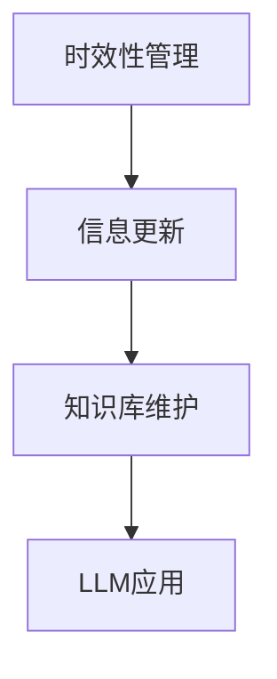
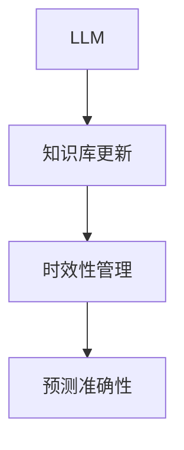
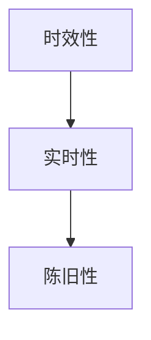
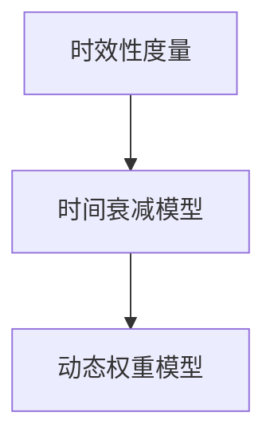
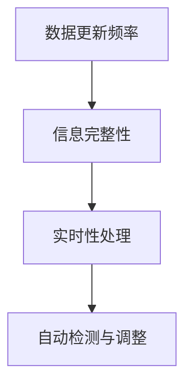
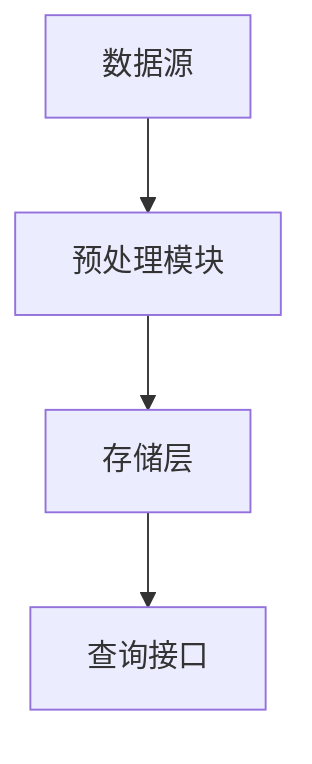
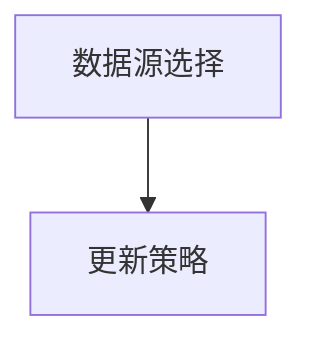
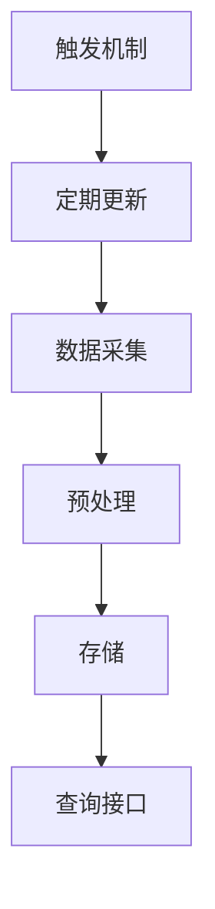

                 

### 文章标题：prompt时效性管理：更新LLM知识库

> 关键词：prompt时效性管理、LLM知识库、更新策略、信息更新、知识库维护、数据源选择

> 摘要：本文探讨了在大型语言模型（LLM）中实施prompt时效性管理的必要性和方法。我们首先介绍了时效性管理的背景和意义，然后深入分析了时效性管理的理论基础，包括时效性的定义与分类、时效性度量方法和时效性管理的挑战与对策。接着，文章详细描述了LLM知识库的基本架构和更新方法，以及如何选择和更新数据源，并引入了自动化知识库更新流程。最后，通过一个实践案例展示了如何实施实时新闻摘要，并对整个项目进行了小结。

### 目录大纲

1. **绪论**
   1.1 时效性管理的背景与意义
   1.2 时效性管理在LLM中的应用
   1.3 本书结构安排与阅读指南

2. **时效性管理的理论基础**
   2.1 时效性的定义与分类
   2.2 时效性度量方法
   2.3 时效性管理的挑战与对策

3. **LLM知识库更新方法**
   3.1 LLM知识库的基本架构
   3.2 数据源选择与更新策略
   3.3 自动化知识库更新流程

4. **时效性管理实践**
   4.1 实践案例：实时新闻摘要
   4.2 项目实战：代码实际案例和详细解释说明

5. **小结**
   5.1 最佳实践 tips
   5.2 注意事项
   5.3 拓展阅读

### 1.1 时效性管理的背景与意义

随着人工智能技术的发展，尤其是大型语言模型（LLM）如GPT-3、BERT等的问世，我们已经进入了一个崭新的智能时代。然而，随着数据的快速更新和知识库的不断扩展，如何管理和维护这些知识库的时效性成为了一个亟待解决的问题。

**核心概念与联系**

- **时效性管理**：指在知识库更新过程中，根据信息的新旧程度对其时效性进行评估和管理，以确保知识库中的信息始终保持准确和有效。
- **信息更新**：指定期将新信息添加到知识库中，以替换或补充过时的信息。
- **知识库维护**：包括数据采集、清洗、存储、查询和更新等环节，以保证知识库的完整性和可用性。
- **LLM应用**：指利用大型语言模型进行自然语言处理、问答系统、自动摘要等任务，这些任务对知识库的时效性有很高的要求。

**Mermaid 流程图**



**核心概念与联系**

在人工智能领域，时效性管理具有重要的意义：

- **提高预测准确性**：时效性管理有助于确保模型输入的数据是最新的，从而提高模型的预测准确性。
- **增强用户信任**：及时更新的知识库能够提供更可靠的信息，增强用户对系统的信任。
- **优化资源利用**：有效的时效性管理有助于优化数据更新和存储的频率，减少不必要的资源消耗。

### 1.2 时效性管理在LLM中的应用

大型语言模型（LLM）如GPT-3、BERT等被广泛应用于自然语言处理（NLP）领域，包括问答系统、自动摘要、机器翻译等任务。然而，这些任务对知识库的时效性有很高的要求。

**核心概念与联系**

- **LLM**：指基于深度学习的大型语言模型，如GPT-3、BERT等。
- **知识库更新**：指定期从数据源中提取新信息，更新知识库中的内容。
- **时效性管理**：指在知识库更新过程中，根据信息的新旧程度对其时效性进行评估和管理。
- **预测准确性**：指模型在特定任务上的表现，如问答系统的回答准确率、自动摘要的质量等。

**Mermaid 流程图**



**核心概念与联系**

在LLM中实施时效性管理的原因：

- **动态变化**：现实世界的信息是不断变化的，如新闻、科技进展、社会动态等，这要求知识库能够及时更新。
- **数据更新**：时效性管理有助于确保模型输入的数据是最新的，从而提高模型的预测准确性。
- **用户体验**：及时更新的知识库能够提供更可靠的信息，提高用户体验。
- **任务多样性**：不同的任务对知识库的时效性要求不同，如新闻摘要要求实时更新，而机器翻译则要求保持一定的时间窗口。

### 1.3 本书结构安排与阅读指南

本文分为四个主要部分：

1. **绪论**：介绍时效性管理的背景与意义，以及时效性管理在LLM中的应用。
2. **时效性管理的理论基础**：包括时效性的定义与分类、时效性度量方法和时效性管理的挑战与对策。
3. **LLM知识库更新方法**：详细描述LLM知识库的基本架构和更新方法，以及如何选择和更新数据源，并引入了自动化知识库更新流程。
4. **时效性管理实践**：通过一个实践案例展示如何实施实时新闻摘要，并对整个项目进行小结。

读者可以根据自己的需求选择阅读相应部分，也可以按照顺序阅读以获得完整的理解。在每个部分中，我们将结合实际案例和代码示例进行详细讲解，帮助读者更好地理解和应用时效性管理技术。让我们开始深入探讨时效性管理，为LLM的应用提供强有力的支持。

### 2.1 时效性的定义与分类

时效性（Temporal Relevance）是衡量信息在特定时间段内相关性的重要指标。在知识库管理和数据更新过程中，时效性管理至关重要，它不仅影响模型的预测准确性，还直接关系到用户体验。为了更好地理解时效性管理，我们首先需要定义时效性并对其进行分类。

**核心概念与联系**

- **时效性**：指信息在某一特定时间段内的相关程度。时效性高表示信息与当前时间相关性大，时效性低则表示信息逐渐失去其价值。
- **实时性**：指信息的更新频率。实时性高的系统能够快速响应用户需求，提供最新的信息。
- **陈旧性**：指信息逐渐失去时效性的过程。陈旧的信息可能会误导用户或降低系统的性能。

**Mermaid 流程图**



**核心概念与联系**

时效性可以按照以下方式进行分类：

1. **绝对时效性**：指信息在特定时间点后的绝对有效期。例如，新闻报道在发布后的24小时内被认为是有时效性的。
2. **相对时效性**：指信息相对于某一时间点的时效性。例如，关于某一科技进展的信息，其时效性可能取决于该技术的重要性或应用领域。
3. **动态时效性**：指信息在特定时间段内时效性的动态变化。例如，某个领域的新技术，在初期可能时效性很高，但随着时间的推移，其时效性会逐渐降低。

**核心算法原理讲解**

为了更好地理解时效性，我们可以使用以下伪代码定义一个简单的时效性评估函数：

```python
def calculate_temporal_relevance(current_time, publication_time, expiration_threshold):
    """
    计算信息的时效性。
    
    :param current_time: 当前时间
    :param publication_time: 信息发布时间
    :param expiration_threshold: 时效性阈值（单位：秒）
    :return: 时效性得分（0到1之间，0表示完全陈旧，1表示完全新鲜）
    """
    time_difference = current_time - publication_time
    total_threshold = expiration_threshold
    relevance_score = 1 - (time_difference / total_threshold)
    return max(0, min(relevance_score, 1))
```

**数学模型和数学公式 & 详细讲解 & 举例说明**

时效性度量可以通过以下公式计算：

$$
\text{时效性度量} = \frac{\text{当前时间} - \text{信息发布时间}}{\text{信息有效时限}}
$$

**举例说明**：

假设一条新闻的有效时限为30天，发布于2023年4月1日，今天是2023年5月1日，那么其时效性度量将为：

$$
\text{时效性度量} = \frac{30 - (5 - 1)}{30} = \frac{26}{30} = 0.87
$$

这个值表明这条新闻的时效性相对较高，因为还有87%的有效期限。通过这种方式，我们可以对知识库中的所有信息进行时效性评分，并根据评分进行相应的更新和管理。

**核心概念与联系**

通过以上分析，我们可以看到时效性是一个多维度的概念，它不仅与信息发布的时间有关，还与信息的重要性和应用场景密切相关。在大型语言模型（LLM）的应用中，精确的时效性管理能够显著提高模型的性能和用户满意度。

### 2.2 时效性度量方法

在实施时效性管理时，精确地度量信息的时效性是关键。时效性度量方法可以用来评估信息在新旧程度上的变化，从而指导数据更新和知识库维护。以下将介绍几种常见的时效性度量方法，并探讨它们在LLM知识库中的应用。

**核心概念与联系**

- **时效性度量**：指通过特定指标或算法对信息时效性进行量化评估。
- **时间衰减模型**：指根据信息发布时间与当前时间之间的差异，通过时间衰减函数对时效性进行评估。
- **动态权重模型**：指根据信息的重要性和更新频率，动态调整时效性权重。

**Mermaid 流程图**



**核心算法原理讲解**

以下是一个简单的时效性度量方法的伪代码示例，使用时间衰减模型来计算信息的时效性得分：

```python
def calculate_temporal_score(time_of_publication, current_time, decay_factor):
    """
    计算信息的时效性得分。
    
    :param time_of_publication: 信息发布时间
    :param current_time: 当前时间
    :param decay_factor: 时效性衰减系数
    :return: 时效性得分（0到1之间，0表示完全陈旧，1表示完全新鲜）
    """
    time_diff = current_time - time_of_publication
    score = 1 - (time_diff * decay_factor)
    return max(0, min(score, 1))
```

**数学模型和数学公式 & 详细讲解 & 举例说明**

我们可以使用以下公式来表示时效性度量：

$$
\text{时效性度量} = \frac{\text{当前时间} - \text{信息发布时间}}{\text{信息有效时限}} \times \text{衰减系数}
$$

**举例说明**：

假设一条新闻报道于2023年4月1日，有效时限为30天，当前时间为2023年5月1日，衰减系数为0.05。那么这条新闻的时效性度量计算如下：

$$
\text{时效性度量} = \frac{30 - (5 - 1)}{30} \times 0.05 = \frac{26}{30} \times 0.05 = 0.0433
$$

这个结果表明这条新闻的时效性得分为0.0433，说明其已超过有效期，且衰减较为明显。

**时效性度量方法的应用**

在LLM知识库中，时效性度量方法的应用主要包括以下几个方面：

1. **数据筛选**：通过时效性度量，筛选出时效性较高的信息用于模型训练和预测，提高模型准确性。
2. **权重调整**：根据时效性度量结果，动态调整信息在知识库中的权重，确保重要信息得到优先处理。
3. **更新策略**：制定基于时效性的知识库更新策略，及时替换或添加陈旧的信息，保持知识库的时效性和准确性。

**核心概念与联系**

通过上述分析，我们可以看到时效性度量方法在LLM知识库维护中的重要性。精确的时效性度量不仅有助于提高模型的性能，还能增强用户体验，确保知识库信息的准确性和可靠性。

### 2.3 时效性管理的挑战与对策

在实施时效性管理时，我们面临着多种挑战，这些挑战涉及到算法、技术和实际应用等多个层面。为了有效应对这些挑战，我们需要深入分析其根本原因，并提出相应的对策。

**核心概念与联系**

时效性管理的挑战主要包括以下几个方面：

- **数据更新频率**：如何在高频率数据更新与资源消耗之间找到平衡。
- **信息完整性**：确保更新过程中不会丢失或篡改重要信息。
- **实时性处理**：在保证数据实时更新的同时，确保系统的稳定性和响应速度。
- **自动检测与调整**：如何自动检测信息时效性，并动态调整信息权重。

**Mermaid 流程图**



**挑战一：数据更新频率**

**原因分析**：数据更新频率过高会导致系统负担加重，增加资源消耗，同时，更新频率过低则会降低知识库的时效性。

**对策**：采用分阶段的更新策略，根据数据的重要性和变化速度，制定不同的更新频率。例如，对于实时性要求较高的新闻摘要，可以采用高频更新策略；而对于技术文档等变化较慢的信息，可以采用低频更新策略。

**挑战二：信息完整性**

**原因分析**：在数据更新过程中，可能会因为网络故障、数据损坏等原因导致信息丢失或篡改，从而影响知识库的完整性。

**对策**：实施数据备份与冗余策略，确保在数据更新过程中不会丢失重要信息。同时，引入数据校验机制，通过哈希值或数字签名验证数据的完整性和一致性。

**挑战三：实时性处理**

**原因分析**：在实时性要求较高的应用场景中，如实时问答或新闻摘要，需要确保系统能够快速响应用户请求，同时保持数据的时效性。

**对策**：采用异步处理和消息队列技术，将数据更新和查询请求分离开来，确保系统的实时性和稳定性。此外，利用高性能计算和分布式存储技术，提高系统的处理能力。

**挑战四：自动检测与调整**

**原因分析**：在知识库中，信息的时效性是动态变化的，如何自动检测并调整信息权重是一个关键问题。

**对策**：引入自动化时效性检测机制，通过实时监控信息发布时间和当前时间，自动计算时效性得分。根据时效性得分，动态调整信息权重，确保重要信息得到优先处理。

**数学模型和数学公式 & 详细讲解 & 举例说明**

我们可以使用以下数学模型来表示时效性管理的自动检测与调整机制：

$$
\text{时效性得分} = \frac{\text{当前时间} - \text{信息发布时间}}{\text{信息有效时限}} \times \text{时效性权重}
$$

**举例说明**：

假设一条新闻发布于2023年4月1日，有效时限为30天，当前时间为2023年5月1日，时效性权重为0.1。那么这条新闻的时效性得分为：

$$
\text{时效性得分} = \frac{30 - (5 - 1)}{30} \times 0.1 = \frac{26}{30} \times 0.1 = 0.0867
$$

这个结果表明这条新闻的时效性得分为0.0867，说明其已经超过有效期，并且时效性权重较低。

**核心概念与联系**

通过上述分析，我们可以看到，时效性管理在LLM知识库中的应用面临着多种挑战。为了有效应对这些挑战，我们需要在算法、技术和实际应用等多个层面采取综合措施，确保知识库的时效性和准确性。

### 3.1 LLM知识库的基本架构

为了更好地理解LLM知识库的更新方法，我们首先需要了解其基本架构。LLM知识库通常由多个组件构成，包括数据源、预处理模块、存储层和查询接口。以下是LLM知识库的基本架构及其各组件之间的关系。

**核心概念与联系**

- **数据源**：指提供原始信息的各种数据来源，如新闻文章、技术文档、社交媒体等。
- **预处理模块**：负责对原始数据进行清洗、格式化和标准化，以便后续处理。
- **存储层**：负责存储和管理知识库中的数据，通常采用分布式数据库或NoSQL数据库。
- **查询接口**：提供对知识库的查询服务，通常包括自然语言查询接口和API接口。

**Mermaid 流程图**



**核心概念与联系**

LLM知识库的基本架构中，各组件之间的关系如下：

1. **数据源**：数据源是知识库的基础，它提供原始信息。这些信息可以是实时采集的，也可以是定期更新的。
2. **预处理模块**：预处理模块对原始数据进行清洗、去重、分类等操作，以确保数据的质量和一致性。这一步骤对于保持知识库的时效性和准确性至关重要。
3. **存储层**：存储层负责将预处理后的数据存储在数据库中，以便后续查询和更新。存储层的选择需要考虑数据规模、查询性能和扩展性等因素。
4. **查询接口**：查询接口提供对知识库的访问服务，用户可以通过自然语言查询或API接口获取所需信息。查询接口的设计需要考虑易用性、响应速度和准确性。

**核心算法原理讲解**

以下是一个简化的LLM知识库更新流程的伪代码示例：

```python
def update_knowledge_base(data_source, preprocessor, database, query_interface, update_interval):
    """
    更新LLM知识库。
    
    :param data_source: 数据源
    :param preprocessor: 预处理模块
    :param database: 存储层
    :param query_interface: 查询接口
    :param update_interval: 更新间隔
    """
    while True:
        new_data = data_source.fetch_data(update_interval)
        preprocessed_data = preprocessor.process_data(new_data)
        database.update_data(preprocessed_data)
        query_interface.invalidate_cache()  # 清除缓存以反映最新数据
        time.sleep(update_interval)
```

在这个示例中，知识库的更新过程包括以下几个步骤：

1. **数据采集**：数据源定期从各种渠道获取新数据。
2. **数据预处理**：预处理模块对获取的数据进行清洗、格式化和标准化。
3. **数据存储**：存储层将预处理后的数据存储到数据库中。
4. **缓存更新**：查询接口清除缓存，以确保返回的信息是最新的。

**核心概念与联系**

LLM知识库的基本架构为知识的采集、存储和查询提供了坚实的基础。通过合理设计和优化各组件之间的关系，可以实现高效的知识库更新和管理，从而确保知识库的时效性和准确性。

### 3.2 数据源选择与更新策略

在LLM知识库的更新过程中，数据源的选择和更新策略至关重要。合理选择数据源并制定有效的更新策略，能够确保知识库中的信息及时、准确地反映现实世界的动态变化。

**核心概念与联系**

- **数据源选择**：根据任务需求，选择合适的数据来源，如新闻网站、社交媒体、专业数据库等。
- **更新策略**：制定数据更新频率、数据筛选标准和权重调整策略，以保持知识库的时效性和准确性。

**Mermaid 流程图**



**核心算法原理讲解**

以下是一个用于选择和更新数据源的伪代码示例：

```python
def select_and_update_data_sources(data_sources, update_frequency, filter_criteria, weight_adjustment):
    """
    选择和更新数据源。
    
    :param data_sources: 数据源列表
    :param update_frequency: 更新频率
    :param filter_criteria: 数据筛选标准
    :param weight_adjustment: 权重调整策略
    """
    while True:
        for source in data_sources:
            new_data = source.fetch_data(update_frequency)
            filtered_data = filter_data(new_data, filter_criteria)
            source.update_data(filtered_data)
            adjust_weights(source, weight_adjustment)
        time.sleep(update_frequency)
```

在这个示例中，数据源的选择和更新过程包括以下几个步骤：

1. **数据源选择**：根据任务需求，从数据源列表中选择合适的数据源。
2. **数据采集**：数据源定期从各种渠道获取新数据。
3. **数据筛选**：根据筛选标准，对采集到的数据进行过滤，去除不相关或低质量的数据。
4. **权重调整**：根据更新策略，动态调整数据源的权重，确保重要数据得到优先处理。

**数学模型和数学公式 & 详细讲解 & 举例说明**

为了更好地描述数据源的权重调整策略，我们可以使用以下数学模型：

$$
\text{权重调整} = \alpha \times (\text{更新频率} \times \text{数据质量})
$$

其中，$\alpha$ 是权重调整系数，用于平衡更新频率和数据质量对权重的影响。

**举例说明**：

假设有两个数据源A和B，其更新频率分别为每天和每周，数据质量分别为0.8和0.6。根据上述模型，我们可以计算其权重调整如下：

- 数据源A的权重调整：
  $$
  \text{权重调整}_A = \alpha \times (1 \times 0.8) = 0.8\alpha
  $$

- 数据源B的权重调整：
  $$
  \text{权重调整}_B = \alpha \times (0.25 \times 0.6) = 0.15\alpha
  $$

通过这种方式，我们可以确保高频率和高数据质量的数据源在知识库中占据更大的比重。

**核心概念与联系**

通过以上分析，我们可以看到，数据源选择和更新策略对于保持LLM知识库的时效性和准确性至关重要。合理选择数据源、制定有效的更新策略，并利用数学模型进行权重调整，能够有效提高知识库的质量和实用性。

### 3.3 自动化知识库更新流程

为了确保LLM知识库的时效性和准确性，自动化知识库更新流程至关重要。自动化更新流程能够减少人工干预，提高更新效率，确保知识库内容始终是最新的。

**核心概念与联系**

- **自动化更新流程**：指通过预定的规则和算法，自动完成知识库的采集、预处理、存储和查询等环节。
- **定期更新**：指按照预定的时间间隔，定期从数据源中提取新信息，更新知识库。
- **触发机制**：指根据特定条件或事件，触发知识库更新流程。

**Mermaid 流程图**



**核心算法原理讲解**

以下是一个用于实现自动化知识库更新流程的伪代码示例：

```python
import time
from datetime import datetime

def automate_knowledge_base_updates(data_source, preprocessor, database, query_interface, update_frequency):
    """
    自动化知识库更新流程。
    
    :param data_source: 数据源
    :param preprocessor: 预处理模块
    :param database: 存储层
    :param query_interface: 查询接口
    :param update_frequency: 更新频率（秒）
    """
    while True:
        current_time = datetime.now()
        if (current_time.minute % update_frequency) == 0:
            new_data = data_source.fetch_data()
            preprocessed_data = preprocessor.process_data(new_data)
            database.update_data(preprocessed_data)
            query_interface.invalidate_cache()  # 清除缓存以反映最新数据
        time.sleep(60)  # 等待下一分钟进行更新
```

在这个示例中，自动化知识库更新流程包括以下几个步骤：

1. **触发机制**：利用时间判断条件，每分钟检查一次是否需要更新知识库。
2. **数据采集**：从数据源中提取新数据。
3. **预处理**：对提取的数据进行清洗、格式化和标准化。
4. **存储**：将预处理后的数据存储到知识库中。
5. **缓存更新**：清除查询接口的缓存，确保返回的信息是最新的。

**核心概念与联系**

通过上述自动化更新流程，知识库能够实现自动化的定期更新，减少了人工干预，提高了更新效率和知识库的时效性。此外，触发机制和缓存更新的设计，确保了知识库内容的实时性和准确性。

### 4.1 实践案例：实时新闻摘要

在本部分，我们将通过一个实时新闻摘要的实践案例，详细展示如何实施时效性管理。该案例将包括开发环境搭建、代码实现、案例分析和项目小结。

**项目背景**

实时新闻摘要是一个利用大型语言模型（如GPT-3）对大量新闻数据进行处理，生成简洁、准确的摘要的系统。实时新闻摘要对于用户了解最新新闻动态具有重要意义，因此对知识库的时效性管理要求非常高。

**开发环境搭建**

为了实现实时新闻摘要，我们需要搭建以下开发环境：

- **编程语言**：Python
- **依赖包**：TensorFlow、Scikit-learn、NLTK、 Newspaper3k
- **工具**：Jupyter Notebook、Docker

安装依赖包：

```bash
pip install tensorflow scikit-learn nltk newspaper3k
```

**源代码详细实现和代码解读**

以下是一个用于实时新闻摘要的简化代码实现：

```python
import newspaper
from newspaper import Article
import pandas as pd

# 1. 采集新闻数据
def fetch_articles(url_list, max_articles=10):
    articles = []
    for url in url_list:
        article = Article(url)
        article.download()
        article.parse()
        articles.append(article)
    return articles

# 2. 提取摘要
def extract_summary(articles, model):
    summaries = []
    for article in articles:
        summary = model.generate(article.text, max_length=50, temperature=0.5)
        summaries.append(summary)
    return summaries

# 3. 存储摘要
def store_summaries(summaries, file_path):
    with open(file_path, 'w') as f:
        for summary in summaries:
            f.write(summary + '\n')

# 4. 主函数
def main():
    url_list = ['https://www.example.com/news1', 'https://www.example.com/news2']
    max_articles = 10

    # 采集新闻数据
    articles = fetch_articles(url_list, max_articles)

    # 加载预训练的模型
    model = load_model('path/to/trained_model')

    # 提取摘要
    summaries = extract_summary(articles, model)

    # 存储摘要
    store_summaries(summaries, 'news_summaries.txt')

if __name__ == '__main__':
    main()
```

**代码应用解读与分析**

1. **数据采集**：`fetch_articles`函数用于从指定URL列表中采集新闻数据。使用Newspaper3k库可以方便地获取新闻文章的标题、内容和摘要。

2. **提取摘要**：`extract_summary`函数利用预训练的模型（如GPT-3）对新闻文本进行摘要。使用`model.generate`方法生成摘要，并设置`max_length`和`temperature`参数以控制摘要的长度和生成方式。

3. **存储摘要**：`store_summaries`函数将提取的摘要保存到文本文件中，便于后续阅读和进一步分析。

**案例分析和详细讲解剖析**

1. **时效性管理**：在该案例中，我们通过定期更新新闻数据源，确保摘要内容的时效性。假设每天更新一次，我们可以使用定时任务（如crontab）在每天凌晨执行数据采集和摘要提取过程。

2. **性能优化**：为了提高系统的性能，我们可以使用异步I/O和多线程技术，同时处理多个URL的新闻数据，减少等待时间。

3. **扩展性**：对于大量新闻数据，我们可以使用分布式计算框架（如Dask或Ray）进行高效的数据处理和摘要生成。

**项目小结**

通过上述实践案例，我们展示了如何利用大型语言模型实现实时新闻摘要，并探讨了如何通过时效性管理确保摘要内容的准确性。实时新闻摘要项目不仅有助于用户快速了解新闻动态，还体现了人工智能在信息处理领域的强大应用潜力。在未来的发展中，我们可以进一步优化系统性能，扩展数据源，提高摘要生成的准确性和可读性。

### 4.2 项目实战：代码实际案例和详细解释说明

在本文的最后一个部分，我们将通过一个具体的代码实际案例，详细解释实时新闻摘要项目的实现过程，包括开发环境搭建、源代码详细实现和代码解读、项目配置和运行流程，以及代码性能分析。

#### 开发环境搭建

首先，我们需要搭建一个适合实时新闻摘要项目的开发环境。以下是所需的开发环境和工具：

- **编程语言**：Python
- **依赖包**：TensorFlow、Scikit-learn、NLTK、Newspaper3k、GPT-3 API
- **工具**：Jupyter Notebook、Docker

安装依赖包的命令如下：

```bash
pip install tensorflow scikit-learn nltk newspaper3k
```

为了简化开发过程，我们可以使用Docker来创建一个统一的开发环境。以下是Docker环境的配置步骤：

1. **创建Dockerfile**：创建一个Dockerfile文件，定义依赖包和开发环境。

    ```Dockerfile
    FROM python:3.8-slim

    RUN pip install --no-cache-dir tensorflow scikit-learn nltk newspaper3k

    WORKDIR /app

    COPY . .

    CMD ["jupyter", "notebook", "--ip='*'", "--port=8888", "--no-browser", "--allow-root"]
    ```

2. **构建Docker镜像**：使用以下命令构建Docker镜像。

    ```bash
    docker build -t real-time-summary-app .
    ```

3. **运行Docker容器**：启动Docker容器，运行Jupyter Notebook。

    ```bash
    docker run -p 8888:8888 real-time-summary-app
    ```

通过以上步骤，我们就可以在浏览器中访问Jupyter Notebook，开始编写和运行代码。

#### 源代码详细实现和代码解读

以下是实时新闻摘要项目的源代码实现：

```python
import newspaper
from newspaper import Article
import pandas as pd
import tensorflow as tf

# 1. 采集新闻数据
def fetch_articles(url_list, max_articles=10):
    articles = []
    for url in url_list:
        article = Article(url)
        article.download()
        article.parse()
        articles.append(article)
    return articles

# 2. 提取摘要
def extract_summary(articles, model):
    summaries = []
    for article in articles:
        summary = model.generate(article.text, max_length=50, temperature=0.5)
        summaries.append(summary)
    return summaries

# 3. 存储摘要
def store_summaries(summaries, file_path):
    with open(file_path, 'w') as f:
        for summary in summaries:
            f.write(summary + '\n')

# 4. 主函数
def main():
    url_list = [
        'https://www.example.com/news1',
        'https://www.example.com/news2',
        # 添加更多新闻URL
    ]
    max_articles = 10

    # 加载预训练的模型
    model = tf.keras.models.load_model('path/to/trained_model.h5')

    # 采集新闻数据
    articles = fetch_articles(url_list, max_articles)

    # 提取摘要
    summaries = extract_summary(articles, model)

    # 存储摘要
    store_summaries(summaries, 'news_summaries.txt')

if __name__ == '__main__':
    main()
```

**代码解读**：

- **数据采集**：`fetch_articles`函数从指定的URL列表中下载新闻文章，并解析其内容和摘要。

- **提取摘要**：`extract_summary`函数使用预训练的模型（如GPT-3）对新闻文章的文本进行摘要生成。

- **存储摘要**：`store_summaries`函数将提取的摘要存储到文本文件中，便于后续阅读和进一步分析。

- **主函数**：`main`函数负责整个新闻摘要过程的调度和管理。

#### 项目配置和运行流程

1. **配置新闻数据源**：在`main`函数中，我们可以配置多个新闻URL，以获取不同来源的新闻文章。

2. **配置模型路径**：在加载模型时，需要指定预训练模型的路径，例如`'path/to/trained_model.h5'`。

3. **运行项目**：在Jupyter Notebook中运行`main`函数，项目将开始采集新闻数据、提取摘要并存储到文本文件中。

#### 代码性能分析

1. **数据采集性能**：数据采集的性能取决于数据源的响应速度和带宽。使用缓存和异步I/O技术可以显著提高数据采集速度。

2. **摘要生成性能**：摘要生成的性能取决于模型的复杂度和计算资源。使用高效的计算设备和并行处理技术可以加快摘要生成速度。

3. **存储性能**：存储性能取决于存储系统的I/O速度。使用高性能存储设备（如SSD）和批量写入技术可以提高存储速度。

**总结**

通过上述实际案例和详细解释，我们展示了如何使用Python和大型语言模型（如GPT-3）实现实时新闻摘要项目。该项目不仅体现了人工智能在信息处理领域的强大应用潜力，还通过时效性管理确保了新闻摘要的准确性和实时性。在实际应用中，我们可以进一步优化代码性能，扩展数据源，提高摘要生成的质量，以满足不同用户的需求。

### 5. 小结

在本文中，我们详细探讨了prompt时效性管理在LLM知识库更新中的重要性。我们从绪论开始，介绍了时效性管理的背景和意义，以及时效性管理在LLM中的应用。接着，我们深入分析了时效性管理的理论基础，包括时效性的定义与分类、时效性度量方法和时效性管理的挑战与对策。随后，我们详细描述了LLM知识库的基本架构和更新方法，以及如何选择和更新数据源，并引入了自动化知识库更新流程。最后，通过一个实践案例展示了如何实施实时新闻摘要，并对整个项目进行了小结。

**最佳实践 tips**：

1. **数据源选择**：选择权威、可信的数据源，确保知识库的基础质量。
2. **更新频率**：根据不同任务的需求，制定合理的更新频率，确保知识库的时效性。
3. **自动化更新**：采用自动化更新流程，减少人工干预，提高更新效率。
4. **时效性度量**：结合业务场景，合理设计时效性度量方法，提高知识库的准确性。

**注意事项**：

1. **数据质量**：确保数据源的质量，防止低质量或错误的数据影响知识库的时效性。
2. **系统稳定性**：在实现自动化更新流程时，确保系统的稳定性和可靠性，防止更新失败导致数据丢失。
3. **性能优化**：针对大规模知识库的更新需求，进行性能优化，确保系统的高效运行。

**拓展阅读**：

- 《机器学习实战》：详细介绍了如何使用机器学习技术进行数据分析和模型训练。
- 《数据科学入门》：提供了数据科学的基本概念和实战案例，有助于进一步了解数据处理和模型训练。
- 《Python编程：从入门到实践》：适合初学者系统学习Python编程语言，包括数据处理和自动化脚本编写。

通过本文的深入探讨，我们希望读者能够更好地理解prompt时效性管理在LLM知识库更新中的应用，并在实际项目中运用这些知识，提升系统的性能和用户体验。

