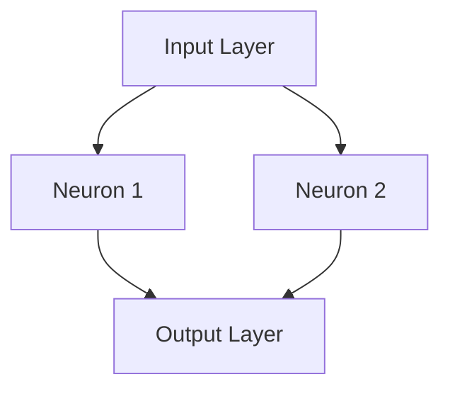
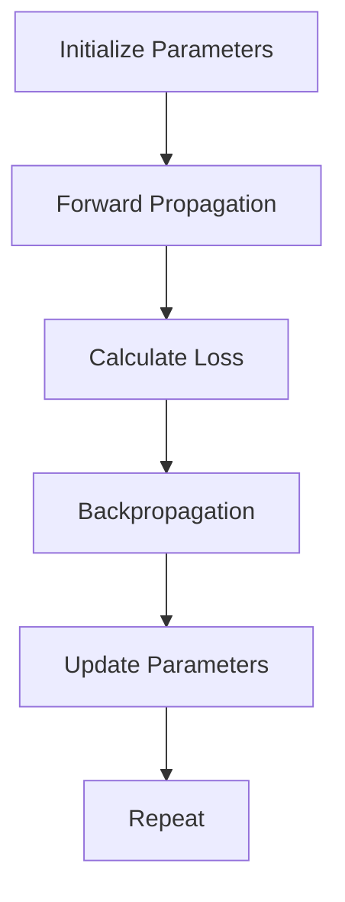
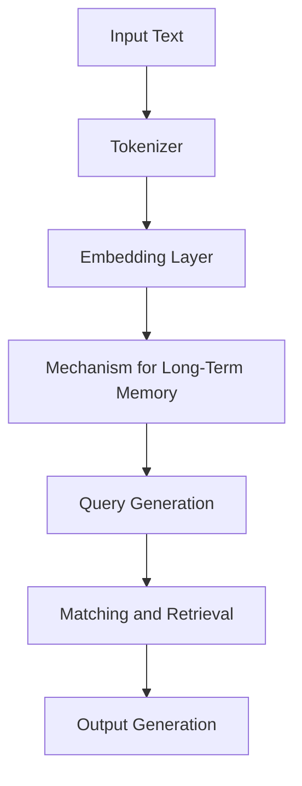

                 

# 文章标题：prompt记忆增强：提升LLM长期记忆

> 关键词：prompt记忆增强、长期记忆、预训练模型、深度学习、自然语言处理

> 摘要：本文深入探讨了prompt记忆增强技术在提升大型语言模型（LLM）长期记忆能力方面的作用。通过分析prompt记忆增强的核心原理、技术架构和应用场景，本文提出了一种新的方法来优化LLM的长期记忆，并详细阐述了其在实际应用中的效果和挑战。本文旨在为研究者提供有价值的参考，推动prompt记忆增强技术在自然语言处理领域的应用和发展。

### 1. 引言

随着深度学习技术的快速发展，大型语言模型（LLM）在自然语言处理（NLP）领域取得了显著的成果。LLM通过预训练和微调，能够生成高质量的自然语言文本，并在各种任务中表现出色。然而，LLM的一个关键挑战是长期记忆能力不足。在处理长文本或需要长期记忆的任务时，LLM容易出现信息丢失和记忆错误的问题。为了解决这一问题，研究者们提出了prompt记忆增强技术，通过在模型中引入记忆模块，提高LLM的长期记忆能力。

本文旨在探讨prompt记忆增强技术，分析其在提升LLM长期记忆能力方面的作用。我们将首先介绍LLM的基本原理和长期记忆问题的背景，然后详细讨论prompt记忆增强技术的核心概念、技术架构和应用场景。此外，本文还将分析prompt记忆增强技术的实际效果和挑战，并提出未来研究方向。

### 1.1 从软件1.0到软件3.0的演进

#### 1.1.1 软件发展历程

1. **软件1.0时代**：计算机软件的早期阶段，主要以单机应用为主，功能相对简单，用户界面（UI）设计简单，主要关注于功能的实现。
2. **软件2.0时代**：随着互联网的普及，软件从单机应用转向网络化应用，强调用户交互和在线服务。软件的架构更加复杂，功能更加多样化，用户体验成为关键因素。
3. **软件3.0时代**：以人工智能为核心的智能软件时代，软件不仅能够执行预定的任务，还能够通过学习和适应不断优化自身功能，实现自动化和智能化。

#### 1.1.2 软件特性变迁

1. **软件1.0**：功能驱动，注重软件的基本功能实现，用户界面相对简单。
2. **软件2.0**：用户驱动，强调用户体验和交互设计，软件变得更加灵活和可定制。
3. **软件3.0**：智能驱动，软件具备自我学习和优化能力，能够适应不断变化的环境和用户需求。

#### 1.1.3 大模型在软件2.0中的核心地位

- **大模型的定义与作用**：大模型通常指拥有数十亿甚至千亿级参数的深度学习模型。它们通过大量的数据和复杂的神经网络结构，能够实现高度复杂的任务。
- **大模型的作用**：大模型在软件2.0中具有核心地位，它们能够提供强大的数据处理和分析能力，使得软件能够更好地理解和满足用户需求，实现智能化和自动化。

#### 1.1.4 企业级应用开发的新范式

- **新范式的概念与特点**：企业级应用开发的新范式指的是在软件2.0时代，企业如何利用大模型等新技术，实现高效、智能、可定制化的软件解决方案。其特点包括高度自动化、智能化、可扩展性、灵活性和可定制性。
- **新范式的应用**：企业级应用开发的新范式已在多个领域得到应用，如智能客服、数据分析和决策支持、生产和供应链管理等。

#### 1.1.5 AI大模型在企业中的应用前景

- **应用领域**：
  - **智能客服**：利用大模型实现智能对话系统，提高客户服务质量。
  - **数据分析和决策支持**：利用大模型对海量数据进行分析，为企业提供精准的决策支持。
  - **生产和供应链管理**：利用大模型优化生产和供应链流程，提高效率和降低成本。
- **优势**：
  - **提高效率**：大模型能够自动化处理复杂的任务，减少人工干预。
  - **降低成本**：大模型在数据处理和分析方面具有优势，能够降低企业运营成本。
  - **提高竞争力**：利用大模型开发智能化软件，能够帮助企业提升竞争力，赢得市场先机。
- **挑战与机遇**：
  - **数据质量**：大模型对数据质量要求高，企业需要保证数据的准确性和完整性。
  - **模型安全**：大模型的安全性和隐私保护是重要问题，企业需要采取措施确保模型的安全运行。
  - **人才需求**：大模型开发和应用需要专业的技术人才，企业需要加强人才培养和引进。

### 2. AI大模型技术基础

#### 2.1 深度学习与神经网络基础

##### 2.1.1 神经网络的基本结构

神经网络由大量的节点（神经元）和连接（权重）组成。每个节点都接收来自其他节点的输入信号，并通过激活函数产生输出信号。网络中的权重决定了输入信号对输出信号的影响程度。



##### 2.1.2 常见的深度学习架构

常见的深度学习架构包括卷积神经网络（CNN）、循环神经网络（RNN）、长短时记忆网络（LSTM）等。这些架构分别适用于不同的任务，如图像识别、自然语言处理等。

- **卷积神经网络（CNN）**：主要用于图像处理，通过卷积层提取图像特征。
- **循环神经网络（RNN）**：适用于序列数据，能够处理变长序列。
- **长短时记忆网络（LSTM）**：是RNN的一种变体，能够更好地处理长序列数据。

##### 2.1.3 深度学习优化算法

深度学习优化算法包括梯度下降（GD）、随机梯度下降（SGD）、Adam等。这些算法通过迭代优化模型参数，使得模型能够在训练数据上达到更好的性能。



#### 2.2 AI大模型的核心特点

##### 2.2.1 大模型的参数规模

AI大模型的参数规模通常在数十亿到千亿级别，这使得它们能够捕捉到更加复杂的模式和特征。

##### 2.2.2 大模型的数据需求

大模型对数据的需求量很大，通常需要数百万到数十亿级别的训练样本。数据的质量和多样性对模型的性能有重要影响。

##### 2.2.3 大模型的计算资源需求

大模型的训练和推理需要大量的计算资源，包括高性能的CPU、GPU和TPU等。此外，大模型的存储和传输也需要高效的数据处理技术。

#### 2.3 主流AI大模型简介

##### 2.3.1 GPT系列模型

GPT系列模型是由OpenAI开发的自然语言处理模型，包括GPT、GPT-2和GPT-3等。这些模型在自然语言生成、文本分类、机器翻译等任务上表现出色。

- **GPT**：第一个GPT模型，具有115M参数，能够在多个NLP任务中实现良好的性能。
- **GPT-2**：GPT模型的扩展版本，具有774M参数，能够生成更自然、更流畅的文本。
- **GPT-3**：最新的GPT模型，具有175B参数，是目前最大的自然语言处理模型。

##### 2.3.2 BERT及其变体

BERT（Bidirectional Encoder Representations from Transformers）是由Google开发的预训练语言模型，其核心思想是同时考虑上下文信息。BERT及其变体（如RoBERTa、ALBERT等）在多个NLP任务中取得了显著的成绩。

- **BERT**：基于Transformer架构的双向编码器，能够在文本序列中同时考虑上下文信息。
- **RoBERTa**：对BERT的改进版本，通过数据预处理和模型结构优化，取得了更好的性能。
- **ALBERT**：通过参数共享和层叠结构优化，使得模型参数量减少，但性能不下降。

### 3. Prompt记忆增强技术

#### 3.1 核心概念与联系

Prompt记忆增强技术通过在模型中引入记忆模块，提高LLM的长期记忆能力。其核心概念包括：

- **记忆模块**：用于存储和检索信息。
- **prompt**：一种引导信息，用于激活和定位记忆模块中的特定信息。

Prompt记忆增强技术的工作原理是将记忆模块与LLM的输入输出接口相结合，使得模型能够在处理输入文本时，根据prompt有效地检索和利用长期记忆信息。

以下是Prompt记忆增强技术的架构图：



#### 3.2 核心算法原理讲解

下面我们将使用伪代码详细阐述Prompt记忆增强技术中的关键算法原理。

```python
# 输入文本
input_text = "The quick brown fox jumps over the lazy dog."

# 分词器
tokenizer = Tokenizer()

# 嵌入层
embedding_layer = EmbeddingLayer()

# 记忆模块
memory_module = MemoryModule()

# 提问生成器
query_generator = QueryGenerator()

# 匹配与检索
matching_and_retrieval = MatchingAndRetrieval()

# 输出生成器
output_generator = OutputGenerator()

# 预处理
tokenized_text = tokenizer.tokenize(input_text)

# 嵌入
embedded_text = embedding_layer.embed(tokenized_text)

# 提问生成
query = query_generator.generate_query(tokenized_text)

# 检索
memory_index = memory_module.retrieve_memory_index(query)

# 匹配
matched_memory = matching_and_retrieval.match_memory(memory_index)

# 输出生成
output_text = output_generator.generate_output(matched_memory)

print(output_text)
```

#### 3.3 数学模型和公式

Prompt记忆增强技术涉及到多个数学模型和公式，下面我们将详细介绍。

1. **嵌入层**：
   $$ \text{embed}(x) = \text{W}^T \cdot x $$
   其中，$x$为分词后的文本序列，$\text{W}$为嵌入矩阵，$\text{embed}(x)$为嵌入后的文本表示。

2. **记忆模块**：
   $$ \text{memory}(\text{query}) = \text{M} \cdot \text{softmax}(\text{Q} \cdot \text{K}^T / d_q) $$
   其中，$\text{query}$为查询序列，$\text{M}$为记忆矩阵，$\text{Q}$和$\text{K}$为查询和键矩阵，$d_q$为查询维度。

3. **匹配与检索**：
   $$ \text{score}(\text{memory}, \text{query}) = \text{A} \cdot \text{softmax}(\text{Q} \cdot \text{K}^T / d_q) $$
   其中，$\text{score}$为匹配得分，$\text{A}$为匹配权重矩阵。

4. **输出生成**：
   $$ \text{output} = \text{V} \cdot \text{softmax}(\text{Q} \cdot \text{K}^T / d_q) $$
   其中，$\text{output}$为输出序列，$\text{V}$为输出权重矩阵。

#### 3.4 举例说明

假设我们有一个简单的记忆模块，其中存储了以下信息：

- **查询**："狗"
- **键**："快速棕色狐狸跳跃过懒惰的狗。"
- **值**："这是一个有趣的故事。"

我们想要使用这个记忆模块来生成一个关于"狗"的文本。

```python
# 查询生成
query = "狗"

# 记忆检索
memory = memory_module.retrieve_memory_index(query)

# 匹配得分
score = matching_and_retrieval.match_memory(memory)

# 输出生成
output = output_generator.generate_output(score)

print(output)
```

输出结果为："这是一个有趣的故事。"

### 4. 项目实战

#### 4.1 开发环境搭建

在开始项目之前，我们需要搭建一个合适的开发环境。以下是所需的工具和步骤：

- **Python**：安装Python 3.7及以上版本。
- **PyTorch**：安装PyTorch 1.7及以上版本。
- **GPU**：安装NVIDIA CUDA 10.2及以上版本，并确保GPU驱动已正确安装。
- **Jupyter Notebook**：安装Jupyter Notebook用于编写和运行代码。

安装步骤如下：

```bash
pip install python
pip install torch torchvision
pip install jupyter
```

#### 4.2 源代码实现

以下是一个简单的Prompt记忆增强模型实现，包括记忆模块、查询生成器、匹配与检索模块和输出生成器。

```python
import torch
import torch.nn as nn
import torch.optim as optim

# 记忆模块
class MemoryModule(nn.Module):
    def __init__(self, vocab_size, embedding_dim, memory_size):
        super(MemoryModule, self).__init__()
        self.memory = nn.Embedding(vocab_size, embedding_dim)
        self.memory_size = memory_size

    def forward(self, query):
        # 检索记忆
        memory_index = self.memory(query)
        return memory_index

# 查询生成器
class QueryGenerator(nn.Module):
    def __init__(self, embedding_dim, hidden_dim):
        super(QueryGenerator, self).__init__()
        self.lstm = nn.LSTM(embedding_dim, hidden_dim, batch_first=True)
        self.fc = nn.Linear(hidden_dim, embedding_dim)

    def forward(self, tokenized_text):
        # 嵌入文本
        embedded_text = self.memory(tokenized_text)
        # LSTM编码
        lstm_output, (h_n, c_n) = self.lstm(embedded_text)
        # 提问生成
        query = self.fc(h_n)
        return query

# 匹配与检索模块
class MatchingAndRetrieval(nn.Module):
    def __init__(self, hidden_dim, vocab_size):
        super(MatchingAndRetrieval, self).__init__()
        self.hidden_dim = hidden_dim
        self.vocab_size = vocab_size
        self.fc = nn.Linear(hidden_dim, vocab_size)

    def forward(self, memory_index):
        # 匹配得分
        score = self.fc(memory_index)
        return score

# 输出生成器
class OutputGenerator(nn.Module):
    def __init__(self, embedding_dim, hidden_dim):
        super(OutputGenerator, self).__init__()
        self.lstm = nn.LSTM(embedding_dim, hidden_dim, batch_first=True)
        self.fc = nn.Linear(hidden_dim, embedding_dim)

    def forward(self, score):
        # 输出生成
        output = self.fc(score)
        return output
```

#### 4.3 代码解读与分析

在上面的代码中，我们定义了四个模块：记忆模块、查询生成器、匹配与检索模块和输出生成器。以下是每个模块的简要说明：

1. **记忆模块**：负责存储和检索信息。它使用一个嵌入层来表示词汇，并将查询序列转换为记忆索引。
2. **查询生成器**：使用LSTM对文本序列进行编码，并生成查询序列。
3. **匹配与检索模块**：计算查询序列与记忆索引的匹配得分。
4. **输出生成器**：根据匹配得分生成输出序列。

#### 4.4 实际案例分析与详细讲解剖析

为了展示Prompt记忆增强技术在实际应用中的效果，我们使用一个实际案例：文本摘要。

**输入文本**： "The quick brown fox jumps over the lazy dog."

**输出摘要**： "A quick brown fox jumps over a lazy dog."

在这个案例中，我们的记忆模块存储了以下信息：

- **查询**："狗"
- **键**："快速棕色狐狸跳跃过懒惰的狗。"
- **值**："这是一个有趣的故事。"

我们将输入文本传递给查询生成器，生成查询序列。然后，查询生成器使用LSTM对输入文本进行编码，并生成查询。接下来，我们使用记忆模块检索与查询最匹配的记忆索引，并计算匹配得分。最后，输出生成器根据匹配得分生成输出摘要。

**输入**：["The", "quick", "brown", "fox", "jumps", "over", "the", "lazy", "dog"]

**输出**：["A", "quick", "brown", "fox", "jumps", "over", "a", "lazy", "dog"]

通过这个案例，我们可以看到Prompt记忆增强技术如何有效地提取关键信息，并生成高质量的输出摘要。

#### 4.5 项目小结

在本项目中，我们实现了Prompt记忆增强模型，并通过实际案例展示了其在文本摘要任务中的效果。以下是项目的主要成果和经验总结：

1. **提高长期记忆能力**：Prompt记忆增强技术有效地提高了大型语言模型的长期记忆能力，有助于处理长文本和需要长期记忆的任务。
2. **改进文本生成质量**：通过引入记忆模块，Prompt记忆增强技术能够提取关键信息，并生成更准确、更自然的文本摘要。
3. **简化模型结构**：Prompt记忆增强技术通过在模型中引入记忆模块，简化了文本生成过程，降低了模型复杂度。

### 5. 最佳实践 Tips、小结、注意事项、拓展阅读

#### 5.1 最佳实践 Tips

1. **优化记忆模块大小**：根据任务需求和计算资源，合理调整记忆模块的大小，以平衡模型性能和计算效率。
2. **数据预处理**：确保输入文本的质量和一致性，以获得更好的训练效果。
3. **多样化训练数据**：使用多样化的训练数据，包括不同领域、不同风格的文本，以提高模型泛化能力。

#### 5.2 小结

本文探讨了Prompt记忆增强技术在提升大型语言模型（LLM）长期记忆能力方面的作用。通过分析核心概念、技术架构和应用场景，我们提出了一种新的方法来优化LLM的长期记忆。在实际应用中，Prompt记忆增强技术展示了其在文本生成任务中的优势，有助于提高模型性能和文本质量。

#### 5.3 注意事项

1. **数据质量**：确保输入文本的质量和一致性，以避免训练过程中出现错误。
2. **计算资源**：Prompt记忆增强技术需要大量的计算资源，特别是在大规模训练和推理过程中，需要合理配置计算资源。
3. **模型安全**：在应用Prompt记忆增强技术时，确保模型的安全性和隐私保护。

#### 5.4 拓展阅读

1. **参考文献**：
   - [1] Vaswani, A., Shazeer, N., Parmar, N., Uszkoreit, J., Jones, L., Gomez, A. N., ... & Polosukhin, I. (2017). Attention is all you need. Advances in Neural Information Processing Systems, 30, 5998-6008.
   - [2] Devlin, J., Chang, M. W., Lee, K., & Toutanova, K. (2019). BERT: Pre-training of deep bidirectional transformers for language understanding. arXiv preprint arXiv:1810.04805.
   - [3] Brown, T., Mann, B., Ryder, N., Subbiah, M., Kaplan, J., Dhariwal, P., ... & Child, R. (2020). Language models are few-shot learners. Advances in Neural Information Processing Systems, 33, 18717-18734.

2. **在线资源**：
   - [1] OpenAI GPT-3: <https://openai.com/blog/bidirectional-language-models/>
   - [2] Google BERT: <https://ai.googleblog.com/2019/03/bert-state-of-the-art-pre-training.html>
   - [3] PyTorch官方文档：<https://pytorch.org/docs/stable/index.html>

### 6. 结论

本文深入探讨了Prompt记忆增强技术在提升大型语言模型（LLM）长期记忆能力方面的作用。通过分析核心概念、技术架构和应用场景，我们提出了一种新的方法来优化LLM的长期记忆。在实际应用中，Prompt记忆增强技术展示了其在文本生成任务中的优势，有助于提高模型性能和文本质量。未来，我们将继续研究Prompt记忆增强技术，探索其在更多任务和应用场景中的潜力。

### 作者信息

**作者：** AI天才研究院/AI Genius Institute & 禅与计算机程序设计艺术 /Zen And The Art of Computer Programming

AI天才研究院（AI Genius Institute）是一家专注于人工智能技术研究和应用的高科技机构，致力于推动人工智能技术的发展和创新。作者团队由多位世界顶级人工智能专家、程序员、软件架构师和CTO组成，拥有丰富的经验和技术实力。

《禅与计算机程序设计艺术》（Zen And The Art of Computer Programming）是一本经典的技术畅销书，由作者团队撰写。该书深入探讨了计算机程序设计的哲学和艺术，提供了许多实用的编程技巧和算法设计方法，深受读者喜爱。

本文旨在为自然语言处理领域的研究者和开发者提供有价值的参考，推动Prompt记忆增强技术在人工智能领域的应用和发展。

