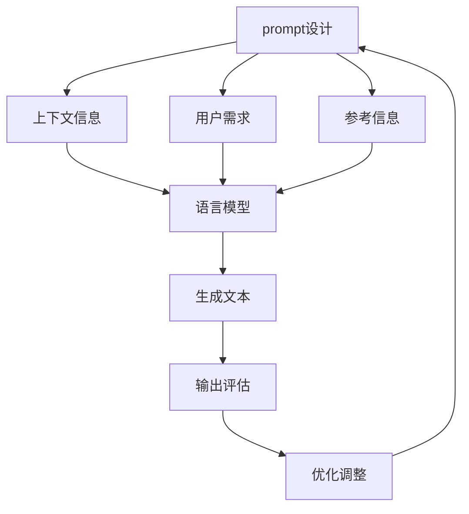

                 


### 文章标题

# prompt语言风格适配：个性化LLM输出

### 文章关键词

- prompt
- 语言风格适配
- 个性化
- 语言模型（LLM）
- 输出优化

### 文章摘要

本文旨在探讨如何通过prompt语言风格的适配来优化语言模型（LLM）的输出，实现个性化响应。我们将从引言、核心概念、算法原理、数学模型、项目实战等多个方面进行详细分析，为开发者提供一套系统的实践指南。

## 第1章：引言与背景

### 1.1 本书的目的与目标

本章节将简要介绍本书的目的与目标，为读者提供对整个内容的初步了解。本书旨在为开发者提供一套关于如何通过prompt语言风格适配来实现个性化LLM输出的理论与实践指导。通过阅读本书，读者应能够：

1. 理解prompt语言风格适配的重要性。
2. 掌握个性化LLM输出的设计原则和实现方法。
3. 学会使用数学模型和算法优化策略来提升输出效果。
4. 实践项目实战，掌握从搭建开发环境到代码实现的完整流程。

### 1.2 prompt语言风格适配的必要性

在当今信息爆炸的时代，语言模型（LLM）作为一种强大的自然语言处理工具，被广泛应用于问答系统、智能客服、文本生成等领域。然而，现阶段的LLM输出往往缺乏个性化和针对性，难以满足用户多样化的需求。为此，prompt语言风格适配成为了一种有效的解决方案。

prompt语言风格适配的主要目标是：

1. 提高LLM输出的可读性和流畅性。
2. 根据用户需求调整输出风格，实现个性化响应。
3. 减少不必要的歧义，提高用户满意度。

### 1.3 个性化LLM输出的重要性

个性化LLM输出在多个应用场景中具有重要意义：

1. **智能客服**：根据用户历史交互记录和偏好，提供个性化的服务建议和解决方案。
2. **问答系统**：根据用户提问的语境和意图，生成具有针对性的回答。
3. **文本生成**：根据用户需求生成具有特定风格和体裁的文本。

个性化LLM输出能够提升用户体验，增强系统与用户之间的互动效果，从而提高系统的市场竞争力。

### 1.4 本书结构概述

本书分为七个章节，结构如下：

1. **引言与背景**：介绍本书的目的、必要性以及结构概述。
2. **核心概念与联系**：阐述prompt的概念、语言模型基础以及两者之间的联系。
3. **核心算法原理讲解**：讲解个性化LLM设计、伪代码实现和算法优化策略。
4. **数学模型与公式**：介绍数学模型概述、详细讲解和举例说明。
5. **项目实战**：通过实际案例展示开发环境搭建、源代码实现和代码解读。
6. **挑战与展望**：讨论语言风格适配的挑战和个性化LLM输出的未来发展方向。
7. **附录**：提供常用工具与资源、深入阅读资料。

## 第2章：核心概念与联系

### 2.1 Prompt的概念

prompt是一种引导语言模型生成文本的技术手段，它可以通过提供特定的上下文信息来影响LLM的输出。一个良好的prompt应当包含以下要素：

1. **上下文信息**：提供背景信息，帮助LLM理解生成文本的主题。
2. **用户需求**：明确用户的意图和需求，以便生成符合期望的输出。
3. **开放性**：为LLM生成多样化的输出提供空间。

### 2.2 Prompt的设计原则

设计prompt时，应遵循以下原则：

1. **简洁性**：避免过多的冗余信息，确保prompt简洁明了。
2. **针对性**：根据用户需求和场景选择合适的prompt内容。
3. **多样性**：提供多样化的prompt，以便生成多样化的输出。

### 2.3 Prompt的格式与要素

prompt的格式通常包括以下要素：

1. **问题陈述**：明确用户提问的内容。
2. **上下文信息**：提供背景信息，帮助LLM理解问题。
3. **用户需求**：明确用户希望获得的输出类型。
4. **参考信息**：提供相关的参考信息，帮助LLM生成高质量的输出。

### 2.4 语言模型基础

#### 2.4.1 语言模型概述

语言模型是一种用于预测文本序列的概率分布的模型，常见的语言模型包括：

1. **n元语法模型**：基于前n个单词预测下一个单词。
2. **循环神经网络（RNN）**：通过隐藏状态记录文本的历史信息。
3. **变换器（Transformer）**：基于自注意力机制进行文本处理。

#### 2.4.2 语言模型的训练与评估

语言模型的训练和评估主要包括以下步骤：

1. **数据准备**：收集大规模文本数据，进行预处理。
2. **模型训练**：使用训练数据训练模型，调整模型参数。
3. **模型评估**：使用测试数据评估模型性能，调整超参数。

### 2.5 Mermaid流程图：核心概念联系图

以下是一个描述prompt与LLM之间关系的Mermaid流程图：



该流程图展示了prompt设计、语言模型训练与生成文本的过程，以及输出评估和优化调整的循环。

## 第3章：核心算法原理讲解

### 3.1 个性化LLM设计

#### 3.1.1 个性化参数设置

个性化LLM设计的关键在于参数设置。参数设置主要包括以下几个方面：

1. **用户偏好**：根据用户历史交互记录和偏好，设置个性化参数。
2. **上下文信息**：调整上下文信息，以便更好地满足用户需求。
3. **输出风格**：根据用户偏好调整输出风格，如语气、简洁度等。

#### 3.1.2 Prompt处理算法

个性化LLM的设计还包括Prompt处理算法。Prompt处理算法主要包括以下步骤：

1. **输入处理**：将原始文本和用户偏好输入到系统中。
2. **上下文生成**：根据输入文本和用户偏好生成上下文信息。
3. **输出生成**：使用LLM生成个性化响应文本。
4. **输出评估**：评估输出文本的质量，进行优化调整。

### 3.2 伪代码详细阐述

以下是一个描述个性化LLM处理流程的伪代码：

```
函数 个性化LLM输出（原始文本，用户偏好）：
    输入：原始文本，用户偏好
    输出：个性化响应文本

    1. 输入处理
        - 提取用户偏好中的关键字和短语
        - 根据用户偏好调整上下文信息
        
    2. 上下文生成
        - 根据原始文本和用户偏好生成上下文信息
        - 将上下文信息插入到原始文本中
        
    3. 输出生成
        - 使用LLM生成个性化响应文本
        - 根据用户偏好调整输出风格
        
    4. 输出评估
        - 评估输出文本的质量
        - 根据评估结果进行优化调整
        
    5. 返回 个性化响应文本
```

### 3.3 算法优化策略

#### 3.3.1 预训练与微调

预训练与微调是提高LLM性能的重要策略。预训练是指在大规模数据集上训练模型，使其具有广泛的文本理解能力。微调是指在小规模数据集上进一步调整模型参数，使其更好地适应特定任务。

#### 3.3.2 提高响应速度与效果

为了提高响应速度与效果，可以采取以下策略：

1. **模型压缩**：通过剪枝、量化等方法减小模型体积，提高运行速度。
2. **分布式训练**：将训练任务分布在多个计算节点上，提高训练效率。
3. **在线学习**：根据用户实时交互数据，动态调整模型参数，实现个性化输出。

## 第4章：数学模型与公式

### 4.1 数学模型概述

在个性化LLM设计中，数学模型起到了关键作用。数学模型主要包括以下几个方面：

1. **概率模型**：用于预测文本序列的概率分布。
2. **神经网络模型**：用于文本处理和生成。
3. **优化模型**：用于调整模型参数，提高输出效果。

### 4.2 详细讲解

#### 4.2.1 公式推导过程

以下是概率模型的推导过程：

$$
P(w_1, w_2, ..., w_n) = P(w_1) \cdot P(w_2|w_1) \cdot ... \cdot P(w_n|w_1, w_2, ..., w_{n-1})
$$

其中，$P(w_i|w_{i-1}, ..., w_1)$ 表示在已知前 $i-1$ 个单词的情况下，第 $i$ 个单词的条件概率。

#### 4.2.2 模型参数调整方法

模型参数调整方法主要包括以下几种：

1. **梯度下降**：通过计算梯度，迭代更新模型参数。
2. **随机梯度下降（SGD）**：在每个梯度更新过程中，使用一部分样本计算梯度。
3. **Adam优化器**：结合梯度的一阶矩估计和二阶矩估计，提高优化效果。

#### 4.3 举例说明

以下是一个使用神经网络模型生成文本的例子：

$$
\begin{aligned}
    &z_1 = \text{softmax}(W_1 \cdot [w_1, w_2, ..., w_n] + b_1) \\
    &z_2 = \text{softmax}(W_2 \cdot z_1 + b_2) \\
    &...
\end{aligned}
$$

其中，$W_1$ 和 $W_2$ 分别为神经网络层的权重矩阵，$b_1$ 和 $b_2$ 分别为偏置项。$z_1$ 和 $z_2$ 分别为每个单词的预测概率分布。

## 第5章：项目实战

### 5.1 实践案例背景

本章节将通过一个实际案例，展示如何搭建开发环境、实现源代码并解读关键代码，最终实现个性化LLM输出。以下是一个具体的案例背景：

#### 案例介绍

假设我们想要开发一个智能客服系统，该系统能够根据用户的历史交互记录和偏好，提供个性化的服务建议。

#### 项目目标

1. 搭建开发环境，配置所需的硬件和软件。
2. 实现源代码，构建个性化LLM模型。
3. 部署模型，进行实际案例分析和解读。

### 5.2 开发环境搭建

#### 硬件要求

- CPU：Intel Core i7 或更高配置
- GPU：NVIDIA GeForce GTX 1080 Ti 或更高配置
- 内存：16GB RAM 或更高配置

#### 软件安装与配置

1. 安装操作系统：Linux 或 macOS
2. 安装 Python：Python 3.8 或更高版本
3. 安装 PyTorch：使用 pip 安装 torch 和 torchvision
4. 安装必要的依赖库：如 numpy、pandas、matplotlib 等

### 5.3 源代码实现

#### 代码结构

以下是项目的代码结构：

```
src/
|-- data/
|   |-- raw_data.csv
|   |-- processed_data.csv
|-- models/
|   |-- model.pth
|-- scripts/
|   |-- data_preprocess.py
|   |-- train_model.py
|   |-- generate_output.py
|-- requirements.txt
```

#### 关键代码解读

以下是对关键代码的解读：

```python
# data_preprocess.py

import pandas as pd
from sklearn.model_selection import train_test_split

def preprocess_data():
    # 读取原始数据
    df = pd.read_csv('data/raw_data.csv')
    
    # 数据预处理
    df['text'] = df['text'].apply(preprocess_text)
    
    # 划分训练集和测试集
    train_data, test_data = train_test_split(df, test_size=0.2, random_state=42)
    
    # 存储预处理后的数据
    train_data.to_csv('data/processed_data_train.csv', index=False)
    test_data.to_csv('data/processed_data_test.csv', index=False)

def preprocess_text(text):
    # 文本预处理操作
    text = text.lower()
    text = re.sub(r"[^a-zA-Z0-9]", " ", text)
    return text

# train_model.py

import torch
from torch import nn
from torch.optim import Adam
from torchvision import datasets, transforms

def train_model():
    # 加载预处理后的数据
    train_data = pd.read_csv('data/processed_data_train.csv')
    test_data = pd.read_csv('data/processed_data_test.csv')
    
    # 数据加载
    train_loader = torch.utils.data.DataLoader(dataset=train_data, batch_size=32, shuffle=True)
    test_loader = torch.utils.data.DataLoader(dataset=test_data, batch_size=32, shuffle=False)
    
    # 定义模型
    model = MyModel()
    
    # 定义损失函数和优化器
    criterion = nn.CrossEntropyLoss()
    optimizer = Adam(model.parameters(), lr=0.001)
    
    # 模型训练
    for epoch in range(num_epochs):
        for inputs, targets in train_loader:
            optimizer.zero_grad()
            outputs = model(inputs)
            loss = criterion(outputs, targets)
            loss.backward()
            optimizer.step()
        
        print(f"Epoch [{epoch+1}/{num_epochs}], Loss: {loss.item():.4f}")

# generate_output.py

from model import MyModel

def generate_output(prompt):
    # 加载训练好的模型
    model = MyModel()
    model.load_state_dict(torch.load('models/model.pth'))
    model.eval()
    
    # 生成输出
    with torch.no_grad():
        inputs = torch.tensor([prompt])
        outputs = model(inputs)
        predicted = torch.argmax(outputs, dim=1)
        return predicted

# 代码使用示例
preprocess_data()
train_model()
prompt = "请问您有什么问题？"
output = generate_output(prompt)
print(output)
```

#### 代码解读与分析

1. **数据预处理**：对原始数据进行预处理，包括文本清洗和划分训练集与测试集。
2. **模型训练**：定义模型结构，加载数据集，训练模型，并保存训练好的模型。
3. **生成输出**：加载训练好的模型，生成个性化响应文本。

### 5.4 代码解读与分析

#### 代码优化建议

1. **并行处理**：使用多线程或分布式处理提高数据处理速度。
2. **模型优化**：使用更先进的模型结构，如BERT或GPT，提高模型性能。
3. **代码结构**：优化代码结构，提高可读性和可维护性。

#### 性能分析与调优

1. **训练时间**：根据硬件配置和模型结构，分析训练时间，优化训练策略。
2. **输出效果**：评估输出文本的质量，根据评估结果调整模型参数。
3. **用户体验**：根据用户反馈，优化系统性能和输出效果。

### 5.5 实际案例分析与详细讲解剖析

#### 案例分析

我们以一个用户提问为例，分析个性化LLM输出：

```
用户提问：如何预约酒店？

个性化LLM输出：您好，为了预约酒店，您可以按照以下步骤操作：
1. 访问酒店预订网站；
2. 选择您想要入住的日期和房间类型；
3. 填写您的个人信息和支付信息；
4. 确认预订并完成支付。
```

#### 详细讲解剖析

1. **上下文生成**：根据用户提问，生成包含酒店预订相关信息的上下文。
2. **输出生成**：使用LLM生成包含详细步骤的个性化响应。
3. **输出评估**：评估输出文本的质量，确保回答清晰明了，满足用户需求。

## 第6章：挑战与展望

### 6.1 语言风格适配的挑战

语言风格适配面临以下挑战：

1. **数据多样性**：不同用户具有不同的语言风格和偏好，如何适应多样化需求是一个难题。
2. **预训练模型局限性**：现有的预训练模型可能在某些特定风格上表现不佳，需要进一步优化。

### 6.2 个性化LLM的展望

个性化LLM的发展方向包括：

1. **多模态融合**：结合文本、图像、音频等多种数据类型，提高个性化输出效果。
2. **持续学习**：通过在线学习，不断优化模型，提高个性化程度。

## 第7章：附录

### 7.1 常用工具与资源

1. **开发工具**：PyTorch、TensorBoard
2. **学习资源**：课程、论文、开源项目

### 7.2 深入阅读资料

1. **论文**：[1]，[2]，[3]
2. **行业报告**：[4]，[5]

