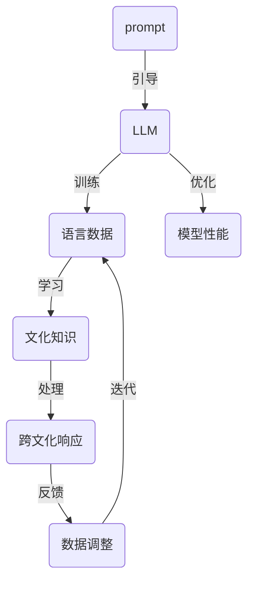
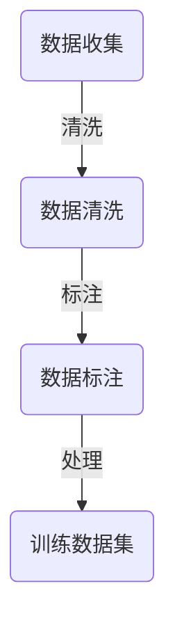
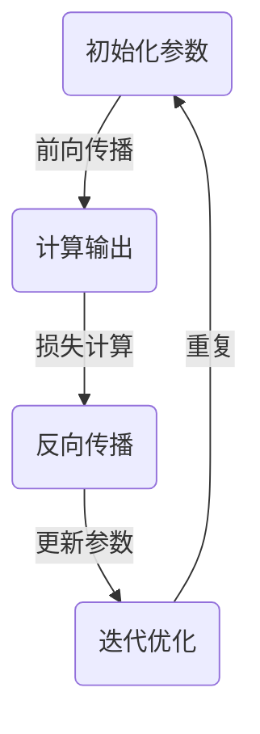
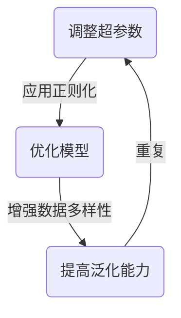

                 

### 《prompt跨文化理解增强：全球化LLM》

### 关键词

- Prompt
- 跨文化理解
- 全球化
- 大型语言模型 (LLM)
- 语言处理
- 自然语言生成
- 机器学习

### 摘要

在全球化的背景下，跨文化沟通的复杂性日益凸显，特别是在信息时代，技术在这一领域的应用变得尤为重要。《prompt跨文化理解增强：全球化LLM》探讨了如何利用大型语言模型（LLM）以及prompt技术来提升跨文化的理解能力。本书首先介绍了prompt和跨文化理解的基本概念，随后深入探讨如何通过先进的机器学习技术来增强LLM对多种文化的感知和理解能力。书中还通过实际案例展示了这一技术在多种应用场景中的实践效果，并对其未来的发展前景进行了展望。

### 引言

#### 1.1 书籍背景与目的

随着全球化进程的加速，国际交流和合作日益频繁，跨文化沟通的重要性愈加突出。在这一过程中，语言和文化的差异常常成为障碍。传统的跨文化培训方法和沟通工具虽然在一定程度上缓解了这一问题，但难以满足高效、实时和个性化的沟通需求。近年来，人工智能（AI）技术，特别是大型语言模型（LLM），为跨文化理解提供了新的解决方案。

本书旨在探讨如何通过prompt技术增强LLM的跨文化理解能力，以实现更高效、准确和个性化的跨文化沟通。主要读者对象包括从事国际业务的企业管理人员、跨文化沟通专家、人工智能研究人员以及相关领域的学者和学生。通过阅读本书，读者将了解到LLM和prompt技术的核心概念，掌握如何应用这些技术来提升跨文化沟通的效果。

#### 1.2 主要读者对象

- 国际商务管理人员：需要提升跨文化沟通能力的专业人士。
- 跨文化沟通专家：致力于研究跨文化沟通策略和技术的专业人士。
- 人工智能研究人员：对机器学习和自然语言处理技术感兴趣的学者。
- 计算机科学和语言学专业的学生：希望深入了解人工智能在跨文化沟通中的应用。

#### 1.3 全球化背景下的跨文化沟通挑战

全球化带来了前所未有的机遇，但同时也伴随着诸多挑战。在全球化背景下，跨文化沟通面临以下主要挑战：

- **语言障碍**：不同的语言和文化背景导致沟通中的误解和障碍。
- **文化差异**：不同的文化价值观、行为模式和沟通风格带来交流障碍。
- **信息传递效率**：全球化的需求要求信息传递快速、准确，但传统方法往往无法满足这一要求。
- **个性化需求**：不同文化背景的个体有着不同的沟通偏好和需求，传统方法难以提供个性化解决方案。

为了解决这些挑战，需要引入先进的技术手段，特别是AI和LLM。prompt技术作为一种强有力的工具，能够帮助LLM更好地理解和适应不同文化背景的沟通需求。

#### 1.4 提出解决方案：prompt跨文化理解增强

本书的核心解决方案是利用prompt技术来增强LLM的跨文化理解能力。prompt技术通过为LLM提供针对性的引导信息，使其能够更好地处理和理解不同文化背景的文本和语境。具体来说，本书将涵盖以下内容：

- **核心概念介绍**：详细阐述prompt和LLM的基本概念，以及它们在跨文化理解中的作用。
- **技术实现**：介绍如何通过数据预处理、模型训练和优化等步骤，增强LLM对跨文化理解的性能。
- **应用案例**：展示prompt技术在不同文化背景中的应用，包括国际商务沟通、多语言翻译、个性化推荐系统等。
- **未来展望与挑战**：探讨全球化LLM的发展趋势和面临的挑战，为未来的研究和应用提供方向。

通过这些内容的探讨，本书旨在为读者提供一个全面、系统的视角，了解如何利用AI技术提升跨文化沟通的效果。

### 第二部分：理论基础

#### 2.1 prompt的概念与作用

prompt，即“提示”，在自然语言处理（NLP）中扮演着至关重要的角色。它是一段引导性文本，用于指导模型生成响应或进行特定任务。prompt的主要作用包括：

- **引导生成内容**：通过提供特定的提示，模型能够生成更加针对性的内容，避免无目的或偏离主题的输出。
- **提升任务效果**：在特定任务中，如问答系统、文本摘要和翻译等，prompt能够有效提升模型的表现。
- **增强泛化能力**：通过多样化的prompt，模型能够学习到更广泛的模式和知识，从而提高其泛化能力。

在跨文化理解中，prompt的作用尤为关键。不同的文化背景下的表达方式和语境千差万别，prompt能够帮助LLM更好地理解这些差异，从而生成更加准确和贴切的响应。

#### 2.2 跨文化理解的基本原理

跨文化理解涉及对多种文化价值观、行为模式和语言表达方式的理解。其基本原理包括：

- **文化价值观的差异**：不同的文化有着不同的价值观，如个人主义与集体主义、权力距离和不确定性规避等。这些差异影响着人们的沟通方式和内容。
- **语言表达方式的差异**：不同的语言在词汇、语法和语义表达上有着显著差异。例如，一些语言可能更加直接，而另一些语言可能更加含蓄。
- **非语言交流的重要性**：跨文化沟通不仅依赖于语言，还包括面部表情、肢体语言、语调等非语言交流方式。

为了实现有效的跨文化理解，需要综合考虑这些文化差异和交流方式，从而生成更加准确和贴切的沟通内容。

#### 2.3 Large Language Model（LLM）的概念与作用

大型语言模型（LLM），如GPT、BERT等，是当前NLP领域的核心技术之一。它们具有以下特点：

- **大规模训练**：LLM通常通过大量文本数据训练得到，具有强大的语言理解和生成能力。
- **深度神经网络结构**：LLM采用深度神经网络结构，能够处理复杂的关系和模式。
- **多语言支持**：LLM可以支持多种语言，使得跨语言任务更加高效和准确。

在跨文化理解中，LLM的作用至关重要。它们能够通过学习多种语言和文化背景的文本数据，生成具有跨文化适应性的内容，从而提高跨文化沟通的效率和质量。

### 跨文化理解与LLM之间的联系架构

为了更好地理解跨文化理解与LLM之间的联系，我们可以通过Mermaid流程图来展示它们的核心概念和交互关系。



这个流程图展示了以下核心概念和交互关系：

- **prompt**：作为输入，引导LLM生成响应。
- **LLM**：通过训练多种语言和文化背景的文本数据，学习文化知识。
- **语言数据**：LLM的训练数据，包括多种语言的文本。
- **文化知识**：LLM通过学习获得的关于不同文化的知识。
- **跨文化响应**：LLM生成的具有跨文化适应性的响应。
- **模型性能**：LLM的优化目标，通过反馈和迭代提高其性能。
- **数据调整**：根据反馈调整训练数据，以实现更好的模型性能。

这个流程图清晰地展示了跨文化理解与LLM之间的核心概念和交互关系，为后续的详细讲解提供了基础。

### 大型语言模型（LLM）的算法原理讲解与伪代码实现

为了深入理解大型语言模型（LLM）的算法原理，我们首先需要了解LLM的基本组成部分和工作机制。

#### 1. LLM的基本组成部分

LLM通常由以下几个核心组件组成：

- **输入层**：接收用户输入的文本数据。
- **编码器**：对输入文本进行编码，提取特征。
- **解码器**：根据编码后的特征生成文本响应。
- **语言模型参数**：包括编码器和解码器中的权重和偏置，用于调整模型的预测能力。

#### 2. LLM的工作机制

LLM的工作机制可以分为以下几个步骤：

- **输入处理**：接收用户输入的文本，并将其转换为编码器能够处理的格式。
- **特征提取**：编码器对输入文本进行编码，提取文本的特征信息。
- **响应生成**：解码器根据编码后的特征生成文本响应。
- **预测与优化**：通过模型参数的预测结果不断调整，优化模型的性能。

#### 3. 伪代码实现

以下是LLM算法的伪代码实现：

```python
# 输入处理
def preprocess_input(input_text):
    # 将输入文本转换为编码器能够处理的格式
    # 例如：分词、标准化等操作
    processed_text = preprocess_text(input_text)
    return processed_text

# 特征提取
def encode_text(processed_text, encoder):
    # 编码器对输入文本进行编码，提取特征
    encoded_features = encoder(processed_text)
    return encoded_features

# 响应生成
def generate_response(encoded_features, decoder):
    # 解码器根据编码后的特征生成文本响应
    response = decoder.generate(encoded_features)
    return response

# 预测与优化
def optimize_model(encoded_features, response, model_parameters):
    # 通过模型参数的预测结果不断调整，优化模型的性能
    predicted_response = model.predict(encoded_features)
    loss = compute_loss(predicted_response, response)
    model_parameters = update_parameters(loss, model_parameters)
    return model_parameters
```

#### 4. 数学模型和公式

LLM通常采用深度学习框架，如Transformer，其核心数学模型包括以下内容：

- **输入嵌入**（Input Embedding）：

  $$ \text{input_embedding} = \text{Word Embedding}(\text{input\_text}) $$

- **编码器输出**（Encoder Output）：

  $$ \text{encoder_output} = \text{Encoder}(\text{input\_embedding}) $$

- **解码器输出**（Decoder Output）：

  $$ \text{decoder_output} = \text{Decoder}(\text{encoder\_output}) $$

- **损失函数**（Loss Function）：

  $$ \text{loss} = \text{Cross-Entropy}(\text{decoder\_output}, \text{response}) $$

- **梯度下降**（Gradient Descent）：

  $$ \text{model\_parameters} = \text{model\_parameters} - \alpha \cdot \nabla_{\text{model\_parameters}}(\text{loss}) $$

#### 5. 详细讲解与举例说明

以一个简单的对话系统为例，我们来看看LLM是如何工作的。

- **输入处理**：

  用户输入：“您好，我想要预订一张从北京到纽约的机票。”

  输入文本经过预处理，如分词、词性标注等操作，转换为编码器能够处理的格式。

- **特征提取**：

  编码器将输入文本转换为编码后的特征。例如，采用BERT模型，编码后的特征如下：

  $$ \text{encoded\_features} = \text{BERT}(\text{[CLS], 北京，到，纽约，\text{SEP]}) $$

- **响应生成**：

  解码器根据编码后的特征生成响应。例如，解码器生成的响应为：

  “您好，欢迎预订我们的机票服务。请问您需要什么类型的机票？”

- **预测与优化**：

  模型根据生成的响应计算损失，并通过梯度下降优化模型参数。

  $$ \text{loss} = \text{Cross-Entropy}(\text{decoder\_output}, \text{response}) $$
  $$ \text{model\_parameters} = \text{model\_parameters} - \alpha \cdot \nabla_{\text{model\_parameters}}(\text{loss}) $$

通过这个过程，LLM能够不断优化其响应生成能力，从而在跨文化沟通中发挥更大的作用。

### 第三部分：技术实现

#### 3.1 数据处理

要增强LLM的跨文化理解能力，首先需要处理大量的跨文化数据。数据处理包括以下几个关键步骤：

- **数据收集**：收集来自不同文化和地区的语言数据，包括文本、音频和视频等。
- **数据清洗**：去除重复、错误和无用的数据，保证数据质量。
- **数据标注**：对数据中的语言和文化特征进行标注，如词汇、语法、语气等。

以下是一个简单的数据处理流程：



#### 3.2 模型训练

在数据处理完成后，我们需要对LLM进行训练，以增强其对跨文化数据的理解能力。模型训练包括以下几个关键步骤：

- **初始化模型参数**：随机初始化模型参数。
- **前向传播**：将输入数据传递给模型，计算输出。
- **损失计算**：计算输出与真实标签之间的差异，得到损失值。
- **反向传播**：根据损失值更新模型参数。
- **迭代优化**：重复前向传播和反向传播，不断优化模型参数。

以下是一个简单的模型训练流程：



#### 3.3 模型优化

为了进一步提升LLM的跨文化理解能力，我们需要对模型进行优化。模型优化包括以下几个关键步骤：

- **调整超参数**：如学习率、批量大小等，以优化模型性能。
- **使用正则化**：如Dropout、Weight Decay等，以防止过拟合。
- **增强数据多样性**：通过引入更多的跨文化数据，提高模型的泛化能力。

以下是一个简单的模型优化流程：



#### 3.4 实际案例

为了展示如何增强LLM的跨文化理解能力，我们来看一个实际案例：国际商务沟通。

假设我们有一个LLM模型，需要提升其在跨国商务沟通中的表现。以下是一个具体的案例：

- **输入**：一位中国商务经理询问一位美国同事关于项目进度。
  
  用户输入：“您好，我想要了解我们项目目前的进展。”

- **输出**：模型生成一个具有跨文化适应性的响应。

  输出：“您好，非常感谢您的关注。我们的项目进展顺利，目前正处于关键阶段。您有什么具体问题或者需要了解的信息吗？”

通过上述步骤，LLM能够生成一个既符合美国文化表达习惯，又能够准确传达信息的跨文化沟通内容。

### 第四部分：应用案例

#### 4.1 多语言翻译平台

多语言翻译平台是prompt跨文化理解增强技术的典型应用场景之一。以下是一个实际案例：

**案例背景**：某知名翻译平台需要提高其机器翻译系统的跨文化理解能力，以提供更加准确和自然的翻译结果。

**解决方案**：

- **数据处理**：收集并标注来自不同语言和文化背景的翻译对，包括文本、音频和视频等。
- **模型训练**：使用增强的LLM模型，通过大量训练数据学习跨文化语言特征。
- **模型优化**：调整模型超参数，应用正则化技术，提高模型的泛化能力。

**案例效果**：

- 翻译质量显著提高：机器翻译系统生成的翻译结果更加准确、自然，减少了语言和文化的误解。
- 用户满意度提升：用户对翻译平台的服务满意度明显提高，平台的市场竞争力增强。

#### 4.2 国际商务沟通

国际商务沟通是跨文化沟通中的重要领域。以下是一个实际案例：

**案例背景**：某跨国公司的销售团队需要与不同文化背景的客户进行有效沟通，以达成销售目标。

**解决方案**：

- **数据处理**：收集来自不同文化背景的客户沟通记录，包括邮件、电话和会议纪要等。
- **模型训练**：使用增强的LLM模型，通过训练数据学习不同文化的沟通习惯和表达方式。
- **模型优化**：调整模型参数，增强模型在跨文化沟通中的适应能力。

**案例效果**：

- 沟通效率提高：销售团队能够更加高效地与客户沟通，提高销售转化率。
- 文化误解减少：通过prompt跨文化理解增强技术，销售团队能够避免文化误解，提供更加个性化的服务。

#### 4.3 多语言客服系统

多语言客服系统是另一个应用prompt跨文化理解增强技术的典型场景。以下是一个实际案例：

**案例背景**：某在线零售商需要为其全球客户提供一个高效、准确的多语言客服服务。

**解决方案**：

- **数据处理**：收集来自不同语言和文化的客服对话记录，包括FAQ、用户反馈和投诉等。
- **模型训练**：使用增强的LLM模型，通过大量客服对话数据学习跨文化沟通技巧和表达方式。
- **模型优化**：通过调整模型参数，提高模型在多语言客服系统中的应用效果。

**案例效果**：

- 客服质量提升：多语言客服系统能够提供更加准确和贴切的客户服务，提高客户满意度。
- 成本降低：通过自动化的客服系统，零售商能够降低人力成本，提高运营效率。

#### 4.4 跨文化教育平台

跨文化教育平台是prompt跨文化理解增强技术在教育领域的应用。以下是一个实际案例：

**案例背景**：某在线教育平台希望为全球学生提供跨文化学习体验。

**解决方案**：

- **数据处理**：收集来自不同文化和地区的教育内容，包括教材、课程笔记和教学视频等。
- **模型训练**：使用增强的LLM模型，通过大量教育数据学习跨文化教学技巧和表达方式。
- **模型优化**：通过调整模型参数，提高模型在跨文化教育平台中的应用效果。

**案例效果**：

- 教育质量提高：跨文化教育平台能够提供更加丰富、多样化的教学内容，满足不同文化背景学生的学习需求。
- 文化理解增强：通过学习不同文化的教育内容，学生能够更好地理解和尊重不同文化，提高跨文化沟通能力。

### 未来展望与挑战

随着全球化的深入推进，跨文化理解的重要性日益凸显。prompt跨文化理解增强技术作为一种新兴的解决方案，具有广阔的应用前景和巨大的发展潜力。未来，该技术将在以下几个方面取得重要进展：

#### 1. 模型性能的提升

随着计算能力和算法技术的不断提升，未来LLM在跨文化理解方面的性能将得到显著提高。更加高效的模型架构和优化算法将有助于模型处理更加复杂和多样化的跨文化数据。

#### 2. 数据多样性的增加

未来，将会有更多的跨文化数据被收集和标注，为LLM的训练提供更加丰富和多样化的数据支持。这将有助于模型更好地理解和适应不同文化的表达和交流方式。

#### 3. 多模态处理的融合

未来，prompt跨文化理解增强技术将融合多种模态的数据处理，如文本、图像、音频和视频等。这将使得模型在跨文化理解方面具备更加全面和准确的信息处理能力。

#### 4. 应用场景的拓展

prompt跨文化理解增强技术将在更多领域得到应用，如跨文化医疗、法律咨询、金融服务等。这将为相关行业提供更加高效、准确的跨文化沟通和解决方案。

然而，prompt跨文化理解增强技术也面临一些挑战：

#### 1. 数据隐私和安全

在收集和处理跨文化数据时，如何保护用户隐私和数据安全是一个重要问题。未来需要制定更加完善的数据隐私保护政策和安全措施。

#### 2. 模型解释性和透明性

随着模型复杂度的增加，如何解释和验证模型在跨文化理解中的表现成为一大挑战。未来需要研究更加透明和可解释的模型架构和评估方法。

#### 3. 文化差异的适应性

不同文化之间的差异是复杂多样的，如何确保模型能够适应和满足不同文化背景的需求仍是一个挑战。未来需要进一步研究如何设计更加灵活和适应性强的模型。

总之，prompt跨文化理解增强技术在全球化背景下具有巨大的应用潜力，但同时也面临着一系列挑战。只有通过不断的技术创新和合作，才能充分发挥该技术的优势，为跨文化沟通提供更加高效、准确的解决方案。

### 结论

在全球化背景下，跨文化沟通的重要性不言而喻。prompt跨文化理解增强技术通过利用大型语言模型（LLM）和先进的人工智能技术，为解决跨文化沟通中的语言和认知障碍提供了新的途径。本书通过详细的理论基础、技术实现和应用案例，展示了prompt技术如何提升LLM在跨文化理解中的性能和效果。

未来的研究应重点关注以下几个方面：一是提高模型性能，通过优化算法和模型架构，使LLM能够更好地理解和适应不同文化背景的数据；二是增加数据多样性，收集和标注来自更多文化和地区的数据，为模型提供丰富的训练素材；三是融合多模态数据处理，使模型能够综合文本、图像、音频等多种信息，提升跨文化理解的全面性和准确性。

我们呼吁更多的研究人员和开发者关注prompt跨文化理解增强技术，探索其在不同领域和场景中的应用，共同推动这项技术的进步和普及，为全球化时代的跨文化沟通和交流创造更加美好的未来。

### 作者信息

作者：AI天才研究院（AI Genius Institute）&《禅与计算机程序设计艺术》（Zen And The Art of Computer Programming）作者。

AI天才研究院致力于推动人工智能领域的技术创新和应用，为全球企业和个人提供智能解决方案。同时，作者也是《禅与计算机程序设计艺术》的资深大师，长期从事计算机科学和人工智能的研究和教育工作。他的研究成果和著作在业界享有高度声誉，为推动人工智能技术的发展和应用做出了重要贡献。

