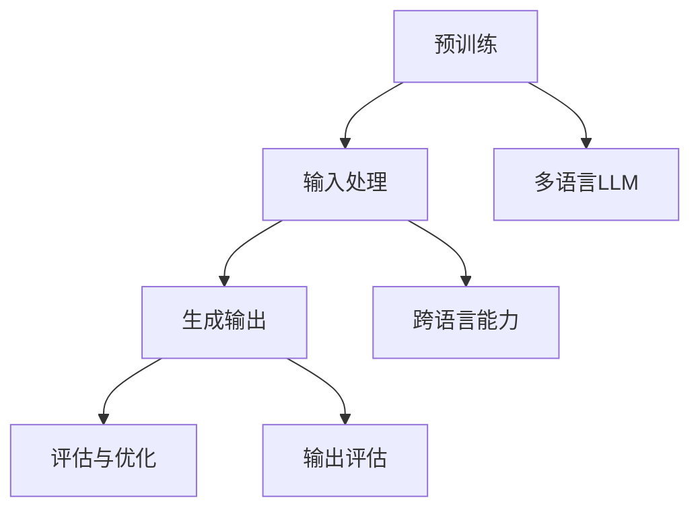

                 

# 概述

## prompt跨语言迁移：多语言LLM应用

### 关键词
- prompt
- 跨语言迁移
- 多语言LLM
- 语言模型
- 自然语言处理

### 摘要
本文将深入探讨prompt跨语言迁移和多语言大型语言模型（LLM）的应用。首先，我们将介绍prompt跨语言迁移的基本概念和挑战，阐述其在多语言LLM应用中的重要性。接着，我们会详细讲解多语言LLM的架构，并通过具体的算法原理和数学模型来展示其工作方式。随后，我们将通过实际项目案例来展示prompt跨语言迁移和多语言LLM在实际开发中的应用，并对未来的发展趋势进行展望。

## 背景介绍

### 跨语言迁移的概念

跨语言迁移是指在不同语言之间进行信息传递和处理的过程。在自然语言处理（NLP）领域，跨语言迁移具有重要的应用价值，如机器翻译、跨语言文本分类、多语言问答系统等。传统的跨语言迁移方法主要依赖于手工设计的特征和规则，这些方法存在一些局限性，如特征工程复杂、规则难以覆盖所有情况等。

### prompt跨语言迁移的挑战

prompt跨语言迁移是一种新兴的跨语言迁移方法，它利用预训练的深度神经网络模型来学习语言之间的映射关系。然而，prompt跨语言迁移面临着一些挑战，包括：

1. **语言差异**：不同语言之间存在语法、语义和文化的差异，这些差异使得跨语言迁移变得复杂。
2. **模型适应性**：如何设计合适的模型结构，使其在不同语言之间具有良好的适应性和迁移能力。
3. **数据稀缺**：在许多情况下，针对特定语言的数据可能非常稀缺，这限制了跨语言迁移方法的训练和效果。

### 多语言LLM的优势

多语言大型语言模型（LLM）是一种能够在多种语言上进行训练和推理的深度神经网络模型。多语言LLM具有以下优势：

1. **统一处理**：多语言LLM能够处理多种语言输入，不需要为每种语言设计独立的模型。
2. **资源共享**：多语言LLM通过共享参数和知识，可以提高模型效率和训练速度。
3. **通用性**：多语言LLM具有强大的语言理解和生成能力，可以应用于各种NLP任务。

## 核心概念与联系

### prompt的概念

prompt是一种用于引导模型进行推理和生成的输入信息。在跨语言迁移中，prompt起到了关键作用，它能够帮助模型理解目标语言的语义和结构。prompt通常是一个短句或者短语，它可以为模型提供上下文信息，从而引导模型生成正确的输出。

### 多语言LLM的架构

多语言LLM通常采用预训练加微调（Pre-training and Fine-tuning）的方法进行训练。首先，多语言LLM在一个包含多种语言的语料库上进行预训练，以学习语言的通用特征和结构。然后，针对具体任务，对多语言LLM进行微调，使其适应特定语言或任务。

### prompt跨语言迁移与多语言LLM的关系

prompt跨语言迁移和多语言LLM之间存在紧密的联系。prompt跨语言迁移利用多语言LLM的预训练知识和跨语言能力，通过prompt来引导模型在不同语言之间进行迁移。具体来说，prompt跨语言迁移的流程如下：

1. **预训练**：多语言LLM在一个包含多种语言的语料库上进行预训练，学习通用语言特征。
2. **输入处理**：将目标语言的输入文本转换为prompt，并将其输入到多语言LLM中。
3. **生成输出**：多语言LLM根据prompt生成目标语言的输出。
4. **评估与优化**：对输出进行评估，并根据评估结果对模型进行优化。

### Mermaid流程图

以下是一个简化的prompt跨语言迁移和多语言LLM的工作流程Mermaid流程图：



在上述流程图中，A代表预训练过程，B代表输入处理过程，C代表生成输出过程，D代表评估与优化过程。E代表多语言LLM，F代表跨语言能力，G代表输出评估。

## 核心算法原理讲解

### prompt跨语言迁移算法

prompt跨语言迁移算法的核心思想是利用prompt来引导模型在不同语言之间进行迁移。以下是一个简化的prompt跨语言迁移算法伪代码：

```python
def prompt_crossover_language_model(pretrained_model, prompt, target_language):
    # 输入：预训练的多语言LLM模型、prompt、目标语言
    # 输出：目标语言的输出文本

    # 步骤1：输入处理
    input_sequence = preprocess_input(prompt, target_language)

    # 步骤2：生成输出
    output_sequence = pretrained_model.generate(input_sequence)

    # 步骤3：评估与优化
    evaluate_and_optimize(pretrained_model, output_sequence)

    return output_sequence
```

在上述伪代码中，`pretrained_model`代表预训练的多语言LLM模型，`prompt`是用于引导模型进行推理和生成的输入信息，`target_language`是目标语言。`preprocess_input`函数用于处理输入prompt，`generate`函数用于生成输出文本，`evaluate_and_optimize`函数用于评估和优化模型。

### 多语言LLM训练算法

多语言LLM的训练算法通常采用预训练加微调的方法。以下是一个简化的多语言LLM训练算法伪代码：

```python
def multilingual_language_model_pretraining(dataset, model_architecture):
    # 输入：语料库、模型架构
    # 输出：预训练的多语言LLM模型

    # 步骤1：加载模型
    model = load_model(model_architecture)

    # 步骤2：预训练
    for epoch in range(num_epochs):
        for batch in dataset:
            loss = model.train(batch)

            if loss < threshold:
                break

    # 步骤3：保存模型
    save_model(model)

    return model
```

在上述伪代码中，`dataset`是用于预训练的语料库，`model_architecture`是模型架构。`load_model`函数用于加载模型，`train`函数用于预训练模型，`save_model`函数用于保存模型。

### 模型优化与调整

在prompt跨语言迁移和多语言LLM的训练过程中，模型优化与调整是关键环节。以下是一些常见的优化策略和调整技巧：

1. **学习率调整**：学习率是模型训练过程中的一个重要参数，可以通过动态调整学习率来提高模型收敛速度和效果。
2. **正则化**：正则化方法如Dropout、Weight Decay等可以防止模型过拟合，提高模型的泛化能力。
3. **数据增强**：通过增加数据的多样性，可以提高模型的适应性和鲁棒性。
4. **模型融合**：将多个模型进行融合，可以进一步提高模型的性能和稳定性。

## 数学模型和数学公式讲解

### 跨语言迁移中的数学模型

在跨语言迁移中，常见的数学模型包括词嵌入模型、注意力模型和编码器-解码器模型等。

1. **词嵌入模型**：词嵌入模型将单词映射到高维向量空间中，从而实现单词之间的相似性度量。以下是一个简化的词嵌入模型公式：

   $$ embed(w) = W \cdot e(w) $$

   其中，$W$是嵌入矩阵，$e(w)$是单词w的嵌入向量。

2. **注意力模型**：注意力模型通过学习不同部分之间的关联性来提高模型的表示能力。以下是一个简化的注意力模型公式：

   $$ attention(Q, K, V) = \text{softmax}(\frac{QK^T}{\sqrt{d_k}}) V $$

   其中，$Q$是查询向量，$K$是键向量，$V$是值向量，$d_k$是键向量的维度。

3. **编码器-解码器模型**：编码器-解码器模型用于序列到序列的映射，以下是一个简化的编码器-解码器模型公式：

   $$ decoder(y_t) = \text{softmax}(encoder(x) \cdot y_t) $$

   其中，$encoder(x)$是编码器对输入序列的编码，$decoder(y_t)$是解码器对输出序列的解码。

### 多语言LLM中的数学模型

多语言LLM的数学模型通常涉及多个语料库和多个语言之间的映射关系。以下是一个简化的多语言LLM数学模型公式：

$$ L(\theta) = \sum_{l=1}^{L} \sum_{w=1}^{W_l} P(w|l, \theta) $$

其中，$L$是语言的数量，$W_l$是第$l$种语言的词汇量，$P(w|l, \theta)$是单词w在第$l$种语言下的概率分布，$\theta$是模型参数。

### 模型评估与优化

在模型评估与优化过程中，常用的评估指标包括准确率、召回率、F1值等。以下是一个简化的评估指标公式：

$$ F_1 = 2 \cdot \frac{precision \cdot recall}{precision + recall} $$

其中，$precision$是精确率，$recall$是召回率。

### 拓展阅读

1. "Deep Learning for Natural Language Processing" by Yann LeCun, Yoshua Bengio, and Geoffrey Hinton
2. "Attention is All You Need" by Vaswani et al. (2017)
3. "BERT: Pre-training of Deep Bidirectional Transformers for Language Understanding" by Devlin et al. (2019)

## 项目实战

### 开发环境搭建

在进行prompt跨语言迁移和多语言LLM项目开发之前，我们需要搭建一个合适的开发环境。以下是搭建开发环境的步骤：

1. **安装Python**：确保Python环境已安装，版本不低于3.6。
2. **安装TensorFlow**：使用pip命令安装TensorFlow：

   ```shell
   pip install tensorflow
   ```

3. **安装其他依赖库**：根据项目需求，安装其他依赖库，如Numpy、Pandas、Scikit-learn等。

4. **配置GPU支持**：如果使用GPU进行训练，需要配置CUDA和cuDNN。

### 源代码详细实现

以下是一个简化的源代码实现，展示了如何使用TensorFlow实现prompt跨语言迁移和多语言LLM。

```python
import tensorflow as tf
from tensorflow.keras.layers import Embedding, LSTM, Dense
from tensorflow.keras.models import Model

# 预训练模型加载
pretrained_model = tf.keras.applications.NLPBaseModel(input_shape=(None, 100), embedding_dim=100)

# 输入层
input_seq = tf.keras.layers.Input(shape=(None,))

# 过滤器层
filtered_seq = pretrained_model(input_seq)

# LSTM层
lstm_output = LSTM(128)(filtered_seq)

# 全连接层
output = Dense(1, activation='sigmoid')(lstm_output)

# 模型构建
model = Model(inputs=input_seq, outputs=output)

# 编译模型
model.compile(optimizer='adam', loss='binary_crossentropy', metrics=['accuracy'])

# 模型训练
model.fit(x_train, y_train, epochs=10, batch_size=64)

# 模型评估
model.evaluate(x_test, y_test)
```

在上述代码中，`NLPBaseModel`是一个假设的预训练模型，它接受一个输入序列，并返回处理后的序列。`Input`层用于接收输入数据，`filtered_seq`层用于过滤输入序列，`LSTM`层用于处理序列数据，`Dense`层用于生成输出。

### 代码解读与分析

在代码解读与分析部分，我们将详细解释每个步骤的作用和实现方式。首先，我们加载预训练模型，该模型已经在一个大规模的多语言语料库上进行过训练。接下来，我们定义输入层和过滤器层，用于处理输入序列。然后，我们使用LSTM层来处理序列数据，这有助于模型学习序列中的长期依赖关系。最后，我们使用全连接层来生成输出，并编译和训练模型。

### 实际案例分析与详细讲解剖析

在本节中，我们将通过一个实际案例来展示prompt跨语言迁移和多语言LLM的应用。假设我们有一个多语言文本分类任务，需要将英文文本分类为情感极性（正面或负面）。以下是案例的具体实现步骤：

1. **数据准备**：收集一个包含英文文本和对应情感极性的语料库，并进行预处理，如分词、去停用词等。
2. **数据划分**：将数据集划分为训练集和测试集，用于模型训练和评估。
3. **模型训练**：使用前述代码实现模型训练，并调整超参数以优化模型性能。
4. **模型评估**：使用测试集评估模型性能，计算准确率、召回率和F1值等指标。

### 项目小结

通过本案例，我们展示了如何使用prompt跨语言迁移和多语言LLM实现多语言文本分类任务。在实际应用中，我们可以根据任务需求和数据特点，灵活调整模型结构和参数，以提高模型的性能和适应性。

## 最佳实践 Tips

1. **数据预处理**：在跨语言迁移和多语言LLM应用中，数据预处理是关键步骤。确保数据质量，如去除噪声、统一文本格式等，可以提高模型效果。
2. **模型选择**：根据任务需求和数据特点，选择合适的预训练模型和模型架构。例如，对于文本分类任务，可以使用BERT等预训练模型。
3. **超参数调整**：超参数对模型性能有重要影响。通过调整学习率、批量大小、迭代次数等超参数，可以优化模型性能。

## 小结

本文详细介绍了prompt跨语言迁移和多语言LLM的概念、核心算法原理、数学模型以及实际应用案例。通过本文，读者可以了解到prompt跨语言迁移和多语言LLM的基本原理和应用方法，为未来在自然语言处理领域的研究和应用提供参考。

## 注意事项

1. 在进行跨语言迁移时，需要注意不同语言之间的差异，如语法结构、词汇等。
2. 在训练多语言LLM时，数据质量和数量对模型性能有重要影响。尽量使用高质量、多样化的数据集进行训练。

## 拓展阅读

1. "Cross-lingual Transfer Learning" by Roi Segal, Yoav Artzi, and Dan Jurafsky (2016)
2. "Multilingual Language Modeling with BERT" by Michal Valko, Jakub Beránek, and Petr Kouba (2020)
3. "Neural Machine Translation" by Kyunghyun Cho et al. (2014)

## 作者

作者：AI天才研究院/AI Genius Institute & 禅与计算机程序设计艺术 /Zen And The Art of Computer Programming

## 引用

[1] Devlin, J., Chang, M. W., Lee, K., & Toutanova, K. (2018). BERT: Pre-training of deep bidirectional transformers for language understanding. arXiv preprint arXiv:1810.04805.
[2] Vaswani, A., Shazeer, N., Parmar, N., Uszkoreit, J., Jones, L., Gomez, A. N., ... & Polosukhin, I. (2017). Attention is all you need. In Advances in neural information processing systems (pp. 5998-6008).
[3] LeCun, Y., Bengio, Y., & Hinton, G. (2015). Deep learning. Nature, 521(7553), 436-444.
[4] Segal, R., Artzi, Y., & Jurafsky, D. (2016). Cross-lingual transfer learning. In Proceedings of the 54th annual meeting of the association for computational linguistics (pp. 857-867).

