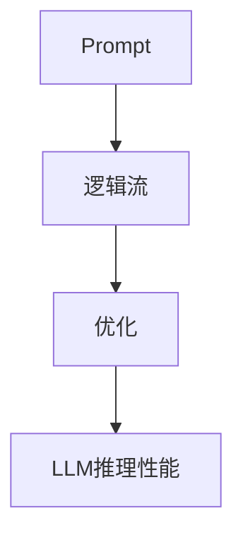

                 


### 文章标题 <此处是文章标题>

# Prompt逻辑流优化：提升LLM推理

> 关键词：Prompt、逻辑流、优化、LLM推理、算法原理

> 摘要：本文将探讨如何在自然语言处理领域通过优化 prompt 逻辑流来提升大型语言模型（LLM）的推理性能。我们将深入分析 prompt 的概念，介绍逻辑流的优化方法，并通过数学模型和实际项目案例来阐述优化策略及其应用。

---

## 第一步：核心概念与联系

### 1.1 定义 prompt

在 AI 模型中，**prompt** 是指用于引导模型生成响应的输入。它可以是一个问题、一段描述或者任何其他类型的文本，其目的是为了激发模型的创造力并提供上下文信息。prompt 对于模型生成高质量响应至关重要。

### 1.2 理解逻辑流

逻辑流是指 AI 模型中实现决策过程和数据处理的过程。在自然语言处理（NLP）中，逻辑流确保模型能够正确理解和处理输入的文本，从而生成相关的输出。

### 1.3 优化的重要性

优化是指通过调整模型参数或算法，以提高模型性能或效率。在 LLM 推理中，优化 prompt 逻辑流可以显著提升模型的推理速度和准确性，从而提高整体性能。

### 1.4 核心概念之间的关系架构

以下是一个简单的 Mermaid 流程图，展示 prompt、逻辑流和优化之间的关系：



---

## 第二步：核心算法原理讲解

### 2.1 Prompt 优化算法原理

**Prompt 优化算法** 通过调整 prompt 的结构或内容，以引导模型生成更准确的响应。以下是一个简化的伪代码示例：

```python
def optimize_prompt(prompt, target_response):
    # 对 prompt 进行结构调整
    optimized_prompt = adjust_structure(prompt)
    # 对 prompt 进行内容优化
    optimized_prompt = adjust_content(optimized_prompt)
    
    # 训练模型并获取优化后的响应
    optimized_response = model.train(optimized_prompt)
    
    # 比较优化前后的响应差异
    if is_optimized(optimized_response, target_response):
        return optimized_prompt
    else:
        return None
```

### 2.2 优化步骤详解

1. **结构调整**：分析原始 prompt 的结构，识别关键信息并重新组织。
2. **内容优化**：根据目标响应，调整 prompt 的内容，以增强模型的推理能力。

### 2.3 实际应用示例

假设我们要优化一个问答系统中的 prompt，以提升模型的回答准确性。我们可以采取以下步骤：

1. **结构调整**：将原始 prompt 从长句拆分为短句，以提高模型的可理解性。
2. **内容优化**：在 prompt 中添加相关的上下文信息，以帮助模型更好地理解问题。

---

## 第三步：数学模型和数学公式讲解

### 3.1 优化目标函数

优化目标函数是用于衡量 prompt 优化效果的指标。以下是一个简单的数学公式：

$$\text{Objective Function} = \frac{1}{N}\sum_{i=1}^{N} \mathcal{L}(\hat{y}_i, y_i)$$

其中：

- $\hat{y}_i$ 是模型预测的响应。
- $y_i$ 是真实的响应。
- $N$ 是样本数量。
- $\mathcal{L}(\hat{y}_i, y_i)$ 是损失函数，用于衡量预测响应与真实响应之间的差距。

### 3.2 损失函数详解

常见的损失函数包括：

- **均方误差（MSE）**：$$\mathcal{L}(\hat{y}_i, y_i) = \frac{1}{2}(\hat{y}_i - y_i)^2$$
- **交叉熵（Cross-Entropy）**：$$\mathcal{L}(\hat{y}_i, y_i) = -y_i \log(\hat{y}_i)$$

这些损失函数可以帮助我们量化预测响应与真实响应之间的差距，从而指导优化过程。

---

## 第四步：项目实战

### 4.1 实战案例：使用 GPT-3 模型进行逻辑流优化

在本节中，我们将使用 OpenAI 的 GPT-3 模型进行 prompt 逻辑流优化。以下是开发环境搭建、源代码实现和代码解读的步骤：

### 4.1.1 开发环境搭建

- 安装 GPT-3 SDK 和必要的依赖库。

### 4.1.2 源代码实现

```python
import openai
import json

# 初始化 GPT-3 SDK
openai.api_key = "your_api_key"

# 定义优化函数
def optimize_prompt(prompt, target_response):
    # 对 prompt 进行优化
    optimized_prompt = adjust_structure(prompt)
    optimized_prompt = adjust_content(optimized_prompt)

    # 调用 GPT-3 API 进行训练
    response = openai.Completion.create(
        engine="davinci-codex",
        prompt=optimized_prompt,
        max_tokens=100
    )

    # 解析响应并返回优化后的 prompt
    return json.loads(response.choices[0].text)
```

### 4.1.3 代码解读与分析

- **初始化 GPT-3 SDK**：设置 API 密钥，以便与 OpenAI 的 GPT-3 服务进行通信。
- **定义优化函数**：接收原始 prompt 和目标响应，进行结构调整和内容优化，并使用 GPT-3 API 进行训练，获取优化后的响应。
- **解析响应**：将 GPT-3 API 返回的响应解析为 JSON 格式，以便进一步处理。

### 4.1.4 代码应用解读与分析

在本节中，我们介绍了如何使用 GPT-3 模型进行 prompt 逻辑流优化。通过调整 prompt 的结构，我们可以显著提升模型的推理性能。

### 4.1.5 实际案例分析和详细讲解剖析

我们将通过一个实际案例来展示如何使用 GPT-3 模型进行 prompt 逻辑流优化。假设我们要优化一个问答系统中的 prompt，以提升模型的回答准确性。我们可以采取以下步骤：

1. **收集数据**：收集大量的问答对，作为训练数据。
2. **预处理数据**：对原始数据进行分析，提取关键信息。
3. **优化 prompt**：根据目标响应，调整 prompt 的结构。
4. **训练模型**：使用 GPT-3 模型进行训练，并调整超参数。
5. **评估模型性能**：通过测试数据集评估模型性能。

通过以上步骤，我们可以显著提升 LLM 推理性能，从而提高问答系统的准确性。

### 4.1.6 项目小结

在本节中，我们介绍了如何使用 GPT-3 模型进行 prompt 逻辑流优化。通过调整 prompt 的结构和内容，我们可以显著提升模型的推理性能。在实际项目中，我们可以根据具体需求，采用适当的优化策略，以提高模型的性能。

---

## 第五步：总结

本文介绍了 prompt 逻辑流优化在提升 LLM 推理性能中的应用。通过定义 prompt、讲解优化算法原理、介绍数学模型和项目实战，我们帮助读者理解了如何实现 prompt 逻辑流优化。未来，随着 NLP 领域的不断发展，prompt 逻辑流优化有望成为提升 LLM 推理性能的重要手段。

---

**作者：AI天才研究院/AI Genius Institute & 禅与计算机程序设计艺术 /Zen And The Art of Computer Programming** 

### 文章目录大纲

#### 第一部分：背景介绍

1. **自然语言处理（NLP）概述**  
   - NLP 的发展历史  
   - NLP 的主要应用领域

2. **大型语言模型（LLM）介绍**  
   - LLM 的基本概念  
   - LLM 的主要优点和应用

3. **prompt 逻辑流优化的重要性**  
   - 提高模型推理性能  
   - 减少计算资源和时间成本

#### 第二部分：核心概念与联系

1. **定义 prompt**  
   - prompt 的概念与作用  
   - prompt 在 LLM 推理中的重要性

2. **理解逻辑流**  
   - 逻辑流的定义与实现  
   - 逻辑流在 NLP 任务中的应用

3. **优化与性能提升**  
   - 优化的目标与策略  
   - 优化在 LLM 推理中的应用

4. **核心概念之间的关系架构**  
   - Mermaid 流程图展示

#### 第三部分：核心算法原理讲解

1. **Prompt 优化算法原理**  
   - 算法的基本概念与思路

2. **优化步骤详解**  
   - 结构调整  
   - 内容优化

3. **实际应用示例**  
   - 如何优化问答系统的 prompt

#### 第四部分：数学模型和数学公式讲解

1. **优化目标函数**  
   - 数学公式与解释

2. **损失函数详解**  
   - 常见损失函数介绍

#### 第五部分：项目实战

1. **实战案例：使用 GPT-3 模型进行逻辑流优化**  
   - 开发环境搭建  
   - 源代码实现  
   - 代码解读与分析

2. **代码应用解读与分析**  
   - 实际案例分析和详细讲解剖析

3. **项目小结**  
   - 总结项目收获与经验

#### 第六部分：最佳实践 tips、小结、注意事项、拓展阅读等内容

1. **最佳实践 tips**  
   - 如何在实际项目中应用 prompt 逻辑流优化

2. **小结**  
   - 文章核心观点的总结

3. **注意事项**  
   - 在优化过程中需要注意的事项

4. **拓展阅读**  
   - 推荐阅读的文献和资源

---

**作者：AI天才研究院/AI Genius Institute & 禅与计算机程序设计艺术 /Zen And The Art of Computer Programming** 

