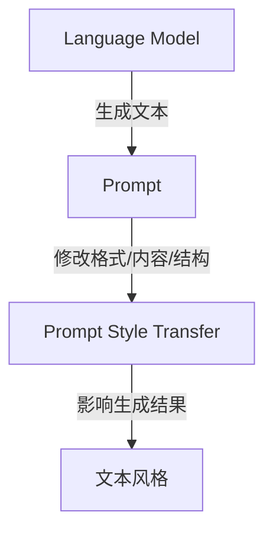

                 

### 文章标题

《prompt风格转换：适应不同LLM特性》

关键词：prompt风格转换，语言模型（LLM），自然语言处理，算法，实践，问答系统，对话系统，文本生成

摘要：本文系统地介绍了prompt风格转换的基础理论、方法、算法及其实践应用。从LLM的基本概念出发，深入探讨了prompt风格转换在不同自然语言处理场景中的应用，包括问答系统、对话系统和文本生成等。文章通过详细的分析和实例讲解，帮助读者理解prompt风格转换的核心原理和实践技巧，为开发者提供实际操作指南。

### 目录

1. **prompt风格转换基础**  
   1.1 prompt风格转换概述  
   1.2 LLM基础理论  
   1.3 prompt风格转换方法  
   1.4 prompt风格转换算法  
   1.5 prompt风格转换实践

2. **特定场景下的prompt风格转换**  
   2.1 问答系统中的prompt风格转换  
   2.2 对话系统中的prompt风格转换  
   2.3 文本生成中的prompt风格转换  
   2.4 跨语言prompt风格转换

3. **总结与展望**  
   3.1 prompt风格转换的总结  
   3.2 prompt风格转换的未来发展趋势  
   3.3 对后续研究工作的建议

---

### 背景介绍

在自然语言处理（NLP）领域，语言模型（Language Model，简称LLM）已经成为核心技术之一。LLM能够通过学习大量文本数据，生成符合语法和语义规则的文本。随着深度学习技术的发展，LLM的性能得到了显著提升，尤其是在生成文本、翻译和问答等任务中表现出了强大的能力。然而，不同LLM在模型结构、训练数据和优化策略上存在差异，导致生成的文本风格也存在显著区别。

prompt风格转换（Prompt Style Transfer）是一种通过调整输入prompt来改变LLM生成文本风格的技术。其核心思想是通过修改prompt的格式、内容或结构，引导LLM生成符合特定风格要求的文本。例如，在问答系统中，可以通过prompt风格转换使生成的回答更加准确、连贯或具有某种特定的文体特征。

prompt风格转换的重要性在于，它能够提高自然语言生成系统（Natural Language Generation，简称NLG）的应用效果和用户体验。通过适应不同场景和用户需求，prompt风格转换使得LLM能够更好地满足多样化的应用需求。

### 核心概念与联系

在深入探讨prompt风格转换之前，我们需要明确几个核心概念，并理解它们之间的相互关系。

#### 语言模型（LLM）

语言模型是一种统计模型，用于预测下一个词或字符的概率。LLM通过学习大量文本数据，学习到语言中的规律和模式，从而能够生成符合语言习惯的文本。常见的LLM架构包括基于循环神经网络（RNN）、Transformer和自注意力机制（Self-Attention）等。

#### Prompt

Prompt是用于引导LLM生成文本的输入，它可以是问题、句子、段落等形式。通过精心设计的prompt，可以影响LLM的生成结果，从而实现风格转换。

#### Prompt风格转换

Prompt风格转换是一种技术，通过修改prompt的格式、内容或结构，来改变LLM生成的文本风格。例如，将一个正式的prompt转换为非正式的，或者将一个简短的prompt扩展为详细的回答。

以下是prompt风格转换的概念关系架构，使用Mermaid流程图表示：

这个架构展示了语言模型、prompt和prompt风格转换之间的关系。LLM接收prompt并生成文本，而prompt风格转换通过修改prompt来影响生成的文本风格。

### Prompt风格转换方法

在了解了核心概念之后，接下来我们将讨论几种常见的prompt风格转换方法。

#### 自动化prompt设计

自动化prompt设计是指使用算法自动生成或优化prompt，以实现特定的风格转换目标。常见的自动化prompt设计方法包括：

1. **模板匹配**：根据目标风格，设计一组模板，然后从模板库中选取合适的模板作为prompt。
2. **机器学习**：使用机器学习模型，如决策树、随机森林或神经网络，从训练数据中学习prompt和目标风格之间的关系，从而生成或优化prompt。

#### Prompt优化

Prompt优化是指通过调整prompt的格式、内容或结构，来提高LLM生成文本的质量和风格。常见的Prompt优化方法包括：

1. **关键词增强**：在prompt中增加与目标风格相关的高频关键词，以引导LLM生成符合特定风格的文本。
2. **语义扩展**：通过添加相关的背景信息或上下文，扩展prompt的语义内容，从而影响LLM的生成结果。

#### Prompt组合策略

Prompt组合策略是指将多个prompt组合起来，以实现更复杂的风格转换目标。常见的Prompt组合策略包括：

1. **并行组合**：将多个不同的prompt并行输入LLM，以生成多个风格的文本，然后进行后处理，如文本合并或投票，得到最终结果。
2. **递归组合**：先使用一个prompt生成初步的文本，然后将生成的文本作为新的prompt，再次输入LLM，以此类推，逐步调整文本风格。

### Prompt风格转换算法

在了解了prompt风格转换的方法之后，接下来我们将讨论几种常见的prompt风格转换算法。

#### Prompt Tuning算法

Prompt Tuning算法是指通过调整prompt的结构和内容，来优化LLM的生成结果。常见的Prompt Tuning算法包括：

1. **序列对齐**：通过调整prompt和目标文本的顺序，使LLM生成的文本更符合目标风格。
2. **特征提取**：从prompt中提取与目标风格相关的特征，并将其作为额外的输入，引导LLM生成符合特定风格的文本。

#### Prompt Engineering算法

Prompt Engineering算法是指通过设计和优化prompt，来实现特定的风格转换目标。常见的Prompt Engineering算法包括：

1. **模板填充**：设计一组模板，并根据目标风格填充模板中的空白部分，生成prompt。
2. **生成对抗网络（GAN）**：使用GAN来生成符合特定风格的prompt，并通过训练使GAN生成的prompt更接近目标风格。

#### Prompt Search算法

Prompt Search算法是指通过搜索最优的prompt，来实现特定的风格转换目标。常见的Prompt Search算法包括：

1. **贪心搜索**：逐步调整prompt的某个部分，直到找到满足特定风格的prompt。
2. **遗传算法**：使用遗传算法搜索最优的prompt，通过交叉、变异和选择等操作，不断优化prompt。

### Prompt风格转换实践

在了解了prompt风格转换的方法和算法之后，接下来我们将通过具体实践案例，展示prompt风格转换在实际项目中的应用。

#### 实践一：基于GPT-3的prompt风格转换

GPT-3 是 OpenAI 推出的一款强大的语言模型，支持多种风格转换任务。以下是一个基于GPT-3的prompt风格转换的实践案例：

1. **环境搭建**：首先需要搭建一个GPT-3的开发环境，包括安装必要的库和依赖。
2. **代码实现**：编写代码，实现prompt风格转换的函数，如调整prompt的格式、内容或结构。
3. **代码解读**：对代码进行详细解读，解释每个步骤的功能和实现原理。
4. **案例分析**：通过具体案例展示prompt风格转换的效果，并进行详细讲解和分析。

#### 实践二：基于BERT的prompt风格转换

BERT 是 Google 推出的一款预训练语言模型，广泛应用于问答系统、文本分类和文本生成等任务。以下是一个基于BERT的prompt风格转换的实践案例：

1. **环境搭建**：搭建BERT的开发环境，包括安装必要的库和依赖。
2. **代码实现**：编写代码，实现prompt风格转换的函数，如调整prompt的格式、内容或结构。
3. **代码解读**：对代码进行详细解读，解释每个步骤的功能和实现原理。
4. **案例分析**：通过具体案例展示prompt风格转换的效果，并进行详细讲解和分析。

#### 实践三：跨模型prompt风格转换

跨模型prompt风格转换是指将一种模型的风格转换应用到另一种模型上，以实现更灵活的风格转换。以下是一个跨模型prompt风格转换的实践案例：

1. **环境搭建**：搭建跨模型prompt风格转换的开发环境，包括安装必要的库和依赖。
2. **代码实现**：编写代码，实现跨模型prompt风格转换的函数，如调整不同模型之间的prompt格式和内容。
3. **代码解读**：对代码进行详细解读，解释每个步骤的功能和实现原理。
4. **案例分析**：通过具体案例展示跨模型prompt风格转换的效果，并进行详细讲解和分析。

### 问答系统中的prompt风格转换

问答系统是一种常见的自然语言处理应用，通过回答用户提出的问题，提供有用的信息。prompt风格转换在问答系统中具有广泛的应用，以下是其具体应用和挑战：

#### 应用

1. **个性化回答**：通过prompt风格转换，可以为用户提供个性化、符合用户需求的回答。
2. **格式化回答**：将原始回答格式化成表格、列表或摘要等不同形式，以更好地满足用户需求。

#### 挑战

1. **回答准确度**：确保prompt风格转换不会影响回答的准确性。
2. **文本风格匹配**：保证生成的回答与提问的风格相匹配，以提高用户体验。

### 对话系统中的prompt风格转换

对话系统是一种与用户进行自然语言交互的应用，通过对话生成和回复生成，提供对话式服务。prompt风格转换在对话系统中的应用主要包括：

1. **对话连贯性**：通过prompt风格转换，确保对话的连贯性和流畅性。
2. **情感表达**：根据对话的语境和用户需求，调整对话的情感表达，如幽默、正式或亲切等。

### 文本生成中的prompt风格转换

文本生成是一种通过语言模型生成文本的应用，广泛应用于文章撰写、摘要生成和对话生成等场景。prompt风格转换在文本生成中的应用主要包括：

1. **文本风格多样化**：通过prompt风格转换，生成不同风格的文本，如正式、非正式、幽默等。
2. **内容丰富性**：通过prompt风格转换，扩展文本内容，使其更加丰富和具体。

### 跨语言prompt风格转换

跨语言prompt风格转换是指将一种语言的风格转换应用到另一种语言上。随着全球化的发展，跨语言prompt风格转换在多语言应用中具有重要应用价值。其应用场景主要包括：

1. **多语言问答系统**：通过跨语言prompt风格转换，实现不同语言之间的问答转换。
2. **多语言文本生成**：通过跨语言prompt风格转换，生成符合目标语言风格的多语言文本。

### 总结与展望

prompt风格转换是一种重要的自然语言处理技术，通过调整prompt的格式、内容或结构，可以实现文本风格的多样化，提高自然语言生成系统的应用效果和用户体验。

未来，prompt风格转换的发展趋势将包括：

1. **算法优化**：不断优化prompt风格转换算法，提高转换效率和准确性。
2. **跨领域应用**：探索prompt风格转换在更多领域的应用，如翻译、对话系统和文本生成等。
3. **个性化服务**：通过prompt风格转换，实现更个性化的文本生成和服务。

对于后续研究工作，建议：

1. **算法创新**：研究新的prompt风格转换算法，提高转换性能。
2. **数据集构建**：构建高质量的跨语言和跨领域的prompt风格转换数据集，以支持算法研究和应用开发。
3. **应用拓展**：探索prompt风格转换在更多场景和领域的应用，推动自然语言处理技术的发展。

### 附录

附录部分将提供以下内容：

1. **参考文献**：列出本文引用的相关文献和资料。
2. **代码示例**：提供本文涉及的关键代码片段和示例。
3. **扩展阅读**：推荐一些与prompt风格转换相关的优秀论文、书籍和网站。

---

通过上述内容，本文系统地介绍了prompt风格转换的理论基础、方法、算法及实践应用。希望本文能为读者提供有价值的参考和指导，推动prompt风格转换技术的发展和应用。

