                 

### 《Serverless架构：简化LLM应用的运维》

## 引言

在当今快速发展的信息技术时代，云计算、大数据和人工智能等领域的融合与创新不断推动着企业的数字化转型。然而，随着应用的复杂性和规模的不断扩大，运维管理的难度也在不断增加。在此背景下，Serverless架构应运而生，为解决传统运维带来的挑战提供了一种创新的解决方案。

Serverless架构是一种无需关注底层服务器资源的计算模型，它通过抽象底层基础设施，使得开发者能够专注于应用逻辑的开发。而LLM（大型语言模型）作为人工智能领域的重要成果，其应用越来越广泛，对运维的需求也越来越高。因此，将Serverless架构应用于LLM应用的运维，不仅能够简化运维流程，还能够提升应用的性能和可靠性。

本文旨在探讨Serverless架构在LLM应用运维中的优势、挑战及其实现方法。我们将从以下几个方面展开讨论：

1. **Serverless架构概述**：介绍Serverless架构的定义、特点和应用场景。
2. **LLM基础**：阐述LLM的定义、分类及其在自然语言处理中的应用。
3. **Serverless与LLM的结合**：分析Serverless架构在LLM运维中的优势和面临的挑战。
4. **Serverless架构原理**：深入探讨Serverless架构的组成部分和生态系统。
5. **LLM运维策略**：介绍Serverless架构下的LLM运维策略和工具。
6. **LLM部署**：详细讲解Serverless架构下的LLM部署流程。
7. **性能优化与监控**：探讨如何优化LLM应用的性能和监控。
8. **安全与合规**：分析Serverless架构下的安全和合规性要求。
9. **案例研究**：通过具体案例展示Serverless架构在LLM运维中的应用。
10. **高级主题与未来趋势**：探讨Serverless架构和LLM技术的未来发展趋势。

通过本文的详细分析，希望能够为开发者和管理者提供有益的参考，助力他们在Serverless架构和LLM应用运维中取得成功。

## 关键词

- **Serverless架构**
- **LLM（大型语言模型）**
- **运维**
- **云计算**
- **自动化**
- **性能优化**
- **监控**
- **安全**
- **合规性**

## 摘要

本文系统地介绍了Serverless架构在简化LLM应用运维方面的应用。首先，我们对Serverless架构进行了概述，分析了其定义、特点和应用场景。接着，我们详细阐述了LLM的概念、分类及其在自然语言处理中的应用。随后，我们探讨了Serverless与LLM结合的优势和挑战，包括自动化运维、性能优化、安全与合规性等方面。

在深入解析Serverless架构的原理后，我们介绍了LLM在Serverless架构下的运维策略，包括自动化部署、持续集成与持续部署等。接着，我们详细讲解了在Serverless架构下部署LLM的流程，并探讨了性能优化和监控的方法。最后，我们通过具体案例展示了Serverless架构在LLM运维中的实际应用，并对未来的发展趋势进行了展望。

通过本文的详细分析，读者可以全面了解Serverless架构在LLM应用运维中的优势和实现方法，为实际应用提供参考。

----------------------------------------------------------------

### 第一部分：引言与基础概念

## 第1章 Serverless架构概述

### 1.1 服务器无状态设计

服务器无状态设计是一种软件架构设计理念，旨在确保服务器在处理请求时无需保持会话状态或上下文信息。这种设计通过简化服务器的运行和管理，提高了系统的可伸缩性和可靠性。

#### 核心概念与联系

**服务器无状态设计**：
- 定义：服务器无状态设计是指服务器在处理请求时，不会存储任何与请求相关的状态信息。每次请求都是独立的，服务器不会记住之前的请求。
- 优点：简化了服务器的设计和实现，提高了系统的可伸缩性，降低了故障的风险。
- 实现方式：通过使用分布式缓存、消息队列等技术，服务器可以在不存储状态信息的情况下处理大量的并发请求。

**Mermaid 流程图**：

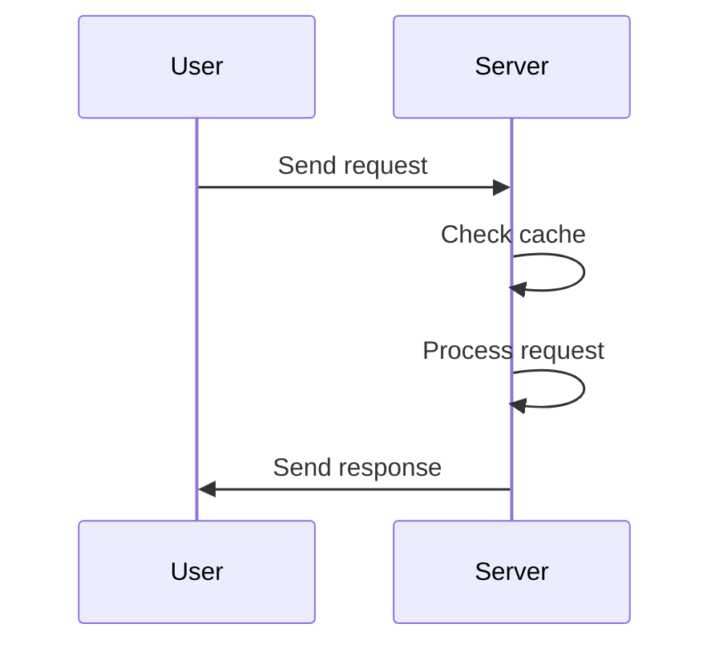

#### 伪代码：

```python
def process_request(request):
    # 检查缓存
    if cache_hit(request):
        return cache_response(request)
    # 处理请求
    response = perform_request(request)
    # 更新缓存
    update_cache(request, response)
    return response
```

#### 数学模型和公式：

无状态设计的一个关键特点是状态转移函数\( f(\)：

$$ f(s, i) = s' $$

其中，\( s \)代表当前状态，\( i \)代表输入，\( s' \)代表新的状态。由于服务器无状态，\( s \)在每次请求中都是相同的，这意味着\( f \)是一个独立于之前请求的函数。

#### 举例说明

假设一个电商网站的无状态服务器处理购物车操作。当用户添加商品到购物车时，服务器不会记住用户之前的操作，每次请求都是独立的。

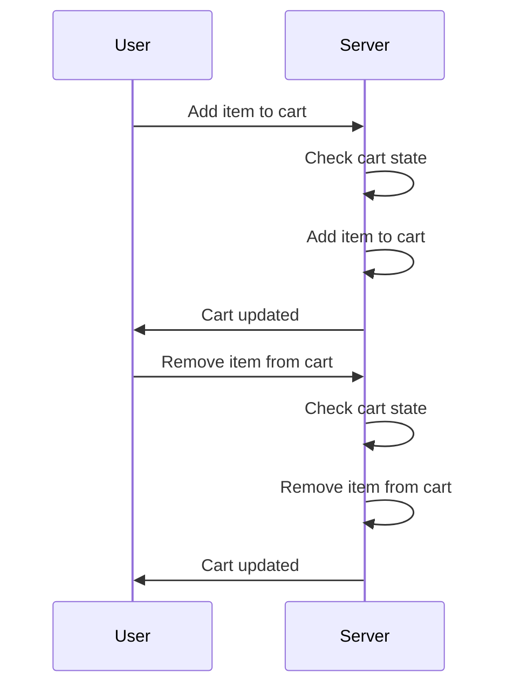

### 1.2 Serverless架构的定义与特点

Serverless架构是一种无需关注底层服务器资源的计算模型，它通过抽象底层基础设施，使得开发者能够专注于应用逻辑的开发。

#### 核心概念与联系

**Serverless架构**：
- 定义：Serverless架构是一种计算模型，它将应用程序的运行和管理完全交由云服务提供商负责。开发者只需编写和部署代码，无需关心底层基础设施的管理和维护。
- 特点：
  - **无服务器**：开发者无需购买、配置和管理服务器，降低了运维成本。
  - **按需分配资源**：资源根据应用程序的实际需求自动分配，提高了资源利用率。
  - **弹性伸缩**：系统根据负载自动扩展或缩减资源，提高了系统的可靠性和可伸缩性。
  - **付费模式**：按实际使用量付费，降低了初始投资成本。

**Mermaid 流程图**：

```mermaid
sequenceDiagram
    participant User
    participant FaaS
    participant DB
    participant User->>FaaS: Send request
    FaaS->>DB: Access data
    FaaS->>User: Send response
```

#### 伪代码：

```python
def handle_request(request):
    data = database.query(request)
    response = process_data(data)
    return response
```

#### 数学模型和公式：

Serverless架构的核心在于将应用程序分解为一系列函数，这些函数通过事件触发执行。

$$ f(event) = response $$

其中，\( f \)是函数，\( event \)是触发事件，\( response \)是函数的响应。

#### 举例说明

假设一个社交媒体平台使用Serverless架构来处理用户上传图片的操作。当用户上传图片时，系统会自动处理图片存储、缩放和元数据提取。

```mermaid
sequenceDiagram
    participant User
    participant S3
    participant Lambda
    participant User->>S3: Upload image
    S3->>Lambda: Trigger function
    Lambda->>Lambda: Store image
    Lambda->>Lambda: Resize image
    Lambda->>Lambda: Extract metadata
    Lambda->>S3: Save metadata
    Lambda->>User: Image processed
```

### 1.3 Serverless架构的应用场景

Serverless架构由于其无需关注底层基础设施、弹性伸缩和按需付费的特点，适用于多种应用场景。

#### 核心概念与联系

**应用场景**：
- **Web应用**：用于处理用户请求，提供API接口。
- **后台任务处理**：用于处理后台任务，如数据备份、报告生成等。
- **实时数据处理**：用于处理实时数据流，如物联网设备数据、股票市场数据等。
- **移动应用后端**：用于移动应用的后端服务，提供用户数据和功能支持。

**Mermaid 流程图**：

```mermaid
graph
    subgraph Web App
        User --> FaaS
        FaaS --> Database
    end

    subgraph Backend Tasks
        Scheduler --> FaaS
        FaaS --> Data Storage
    end

    subgraph Real-time Data Processing
        Sensor --> Stream Processor --> Database
    end

    subgraph Mobile App Backend
        Mobile App --> FaaS
        FaaS --> Push Notifications
    end
```

#### 伪代码：

```python
# Web应用
def handle_request(request):
    data = database.query(request)
    response = process_data(data)
    return response

# 后台任务
def schedule_task():
    task = scheduler.next_task()
    process_task(task)

# 实时数据处理
def process_stream_data(data):
    processed_data = stream_processor.process(data)
    database.update_data(processed_data)

# 移动应用后端
def handle_push_notification(notification):
    user_data = database.get_user_data(notification.user_id)
    send_notification(user_data, notification)
```

#### 数学模型和公式：

在Serverless架构中，不同组件之间的交互可以表示为事件驱动模型。

$$ event \rightarrow function \rightarrow result $$

其中，事件触发函数执行，函数处理事件并返回结果。

#### 举例说明

假设一个在线游戏平台使用Serverless架构来处理用户登录、游戏数据存储和实时消息推送。

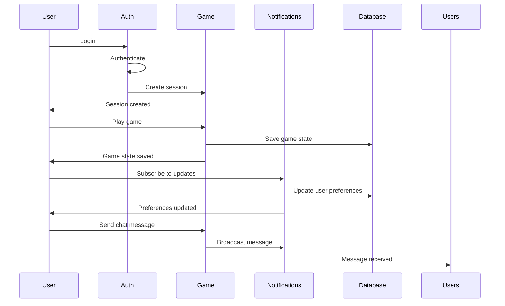

### 结论

本章介绍了Serverless架构的定义、特点和应用场景。通过服务器无状态设计和事件驱动模型，Serverless架构能够简化运维流程，提高系统的可伸缩性和可靠性。在接下来的章节中，我们将进一步探讨LLM的基础知识，以及Serverless架构在LLM运维中的具体应用。

## 第二部分：LLM基础

## 第2章 LLM基础

### 2.1 LLM的定义

LLM（Large Language Model）是一种大型自然语言处理模型，具有强大的文本生成和语义理解能力。它通过对海量文本数据进行训练，学习到语言的各种语法规则、语义关系和上下文信息，从而能够生成高质量的自然语言文本。

#### 核心概念与联系

**LLM的定义**：
- **定义**：LLM是指具有大规模参数和复杂结构，能够处理和生成自然语言文本的深度学习模型。它通常由多层神经网络组成，包括编码器和解码器，通过端到端的训练实现对输入文本的理解和生成。
- **核心概念**：
  - **编码器**：将输入文本编码为固定长度的向量，表示文本的语义信息。
  - **解码器**：将编码器的输出解码为自然语言文本，生成文本序列。
  - **预训练**：通过无监督的方式在大量文本数据上进行预训练，学习到语言的通用特征。
  - **微调**：在特定任务数据上进行有监督的微调，使模型适应特定任务。

**Mermaid 流程图**：

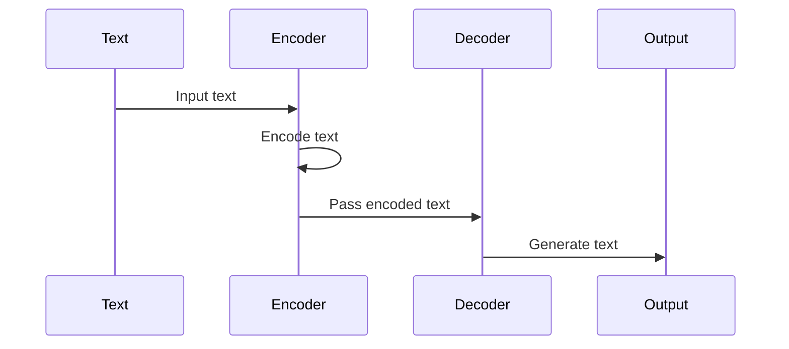

#### 伪代码：

```python
def generate_text(input_text):
    encoded_text = encoder.encode(input_text)
    decoded_text = decoder.decode(encoded_text)
    return decoded_text
```

#### 数学模型和公式：

LLM的训练过程可以表示为以下数学模型：

$$
\begin{aligned}
\text{Encoder}:& \text{Input } x \rightarrow \text{Encoded vector } z, \\
\text{Decoder}:& z \rightarrow \text{Output sequence } y.
\end{aligned}
$$

其中，\( x \)是输入文本，\( z \)是编码后的向量，\( y \)是解码后的文本序列。

#### 举例说明

假设有一个简单的LLM模型，用于回答用户的问题。用户输入一个问题，模型经过编码和解码后，生成一个回答。

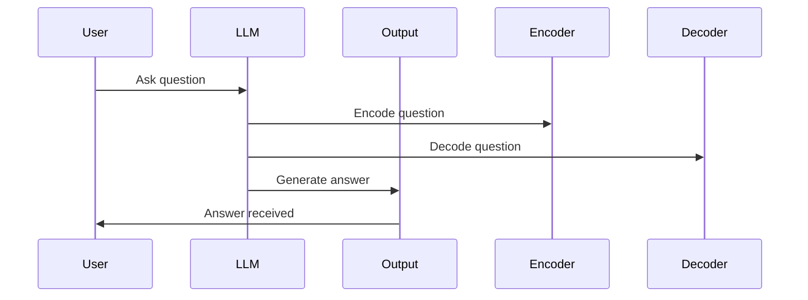

### 2.2 LLM的分类

LLM可以根据其训练数据和任务类型进行分类。常见的LLM分类包括基于词嵌入的模型、基于上下文的模型和基于生成对抗网络的模型。

#### 核心概念与联系

**LLM的分类**：
- **基于词嵌入的模型**：如Word2Vec、GloVe等，通过将词汇映射到低维空间，学习词汇的语义关系。
- **基于上下文的模型**：如BERT、RoBERTa、GPT等，通过预训练大量文本数据，学习到上下文信息，能够处理变长的文本序列。
- **基于生成对抗网络的模型**：如Seq2Seq、GAN等，通过生成器和判别器的对抗训练，学习到文本生成和分类的能力。

**Mermaid 流程图**：

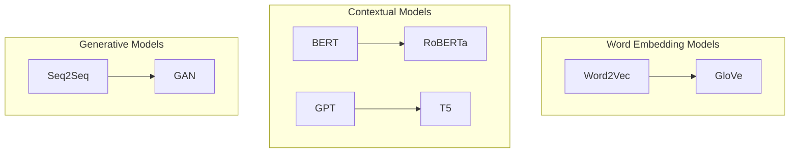

#### 伪代码：

```python
# 基于词嵌入的模型
def word2vec(input_text):
    word_vectors = model.encode(input_text)
    return word_vectors

# 基于上下文的模型
def bert(input_text):
    contextual_embeddings = model.encode(input_text)
    return contextual_embeddings

# 基于生成对抗网络的模型
def gan(input_text):
    generated_text = generator.sample(input_text)
    return generated_text
```

#### 数学模型和公式：

基于词嵌入的模型的数学模型如下：

$$
\text{Word Embedding}: \text{Input word } w \rightarrow \text{Embedding vector } e_w
$$

基于上下文的模型的数学模型如下：

$$
\text{Contextual Embedding}: \text{Input sequence } x \rightarrow \text{Contextual vector } c
$$

基于生成对抗网络的模型的数学模型如下：

$$
\begin{aligned}
\text{Generator}:& x \rightarrow g(x), \\
\text{Discriminator}:& x \rightarrow d(x).
\end{aligned}
$$

#### 举例说明

假设一个基于上下文的模型BERT，用于回答用户的问题。

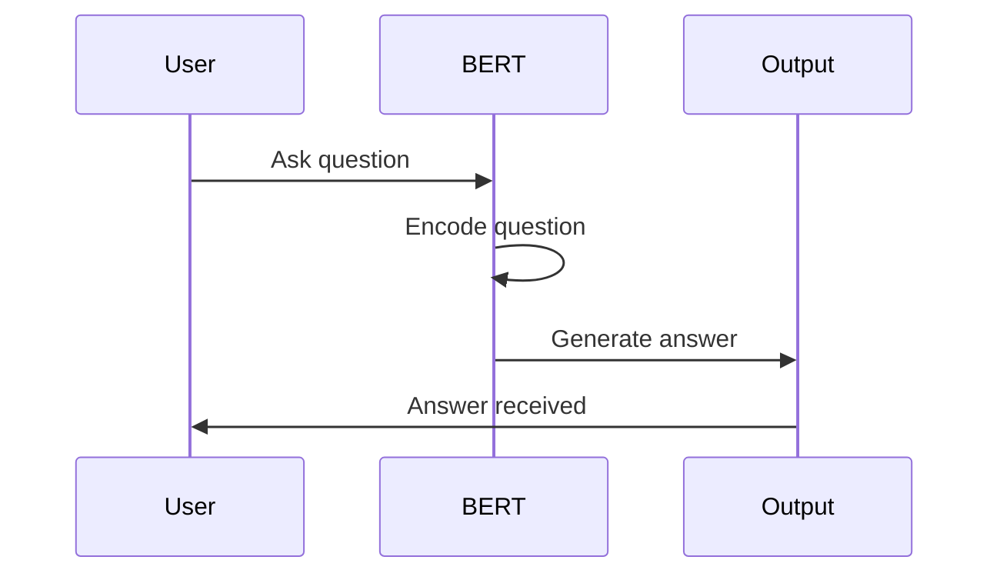

### 2.3 LLM在自然语言处理中的应用

LLM在自然语言处理领域具有广泛的应用，包括文本生成、文本分类、机器翻译、问答系统等。

#### 核心概念与联系

**应用领域**：
- **文本生成**：如自动写作、摘要生成、对话系统等。
- **文本分类**：如情感分析、新闻分类、垃圾邮件检测等。
- **机器翻译**：如自动翻译、多语言文本对比等。
- **问答系统**：如智能客服、问答机器人等。

**Mermaid 流程图**：

```mermaid
graph
    subgraph Text Generation
        Auto Writing --> Summary Generation
        Dialogue System
    end

    subgraph Text Classification
        Sentiment Analysis --> News Classification
        Spam Detection
    end

    subgraph Machine Translation
        Automatic Translation --> Multi-language Text Comparison
    end

    subgraph Question Answering
        Intelligent Customer Service --> Question Answering Robot
    end
```

#### 伪代码：

```python
# 文本生成
def generate_text(input_text):
    generated_text = model.generate(input_text)
    return generated_text

# 文本分类
def classify_text(input_text):
    label = model.classify(input_text)
    return label

# 机器翻译
def translate_text(input_text, target_language):
    translated_text = model.translate(input_text, target_language)
    return translated_text

# 问答系统
def answer_question(input_question):
    answer = model.answer(input_question)
    return answer
```

#### 数学模型和公式：

文本生成的数学模型如下：

$$
\text{Text Generation}: \text{Input text } x \rightarrow \text{Generated text } y
$$

文本分类的数学模型如下：

$$
\text{Text Classification}: \text{Input text } x \rightarrow \text{Class label } y
$$

机器翻译的数学模型如下：

$$
\text{Machine Translation}: \text{Input text } x \rightarrow \text{Translated text } y
$$

问答系统的数学模型如下：

$$
\text{Question Answering}: \text{Input question } x \rightarrow \text{Answer } y
$$

#### 举例说明

假设一个文本生成模型，用于自动写作。

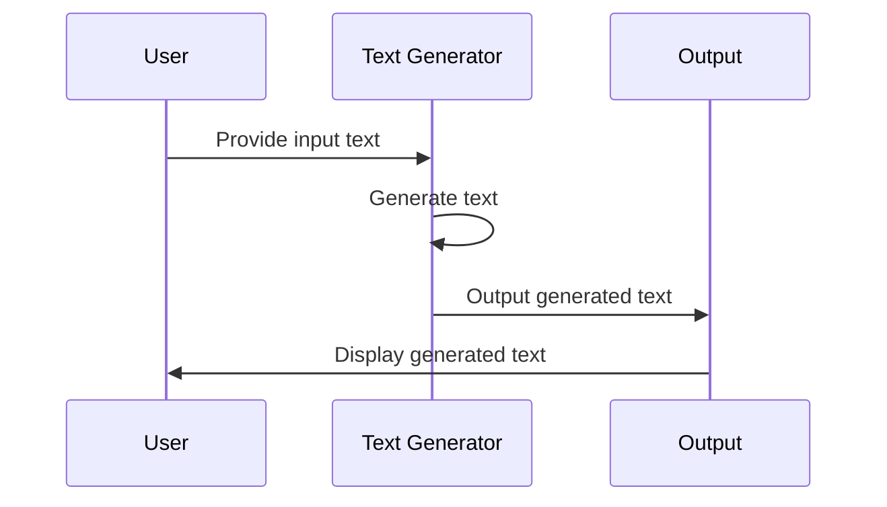

### 结论

本章介绍了LLM的定义、分类以及在自然语言处理中的应用。通过词嵌入、上下文模型和生成对抗网络等不同类型的LLM，我们可以实现文本生成、文本分类、机器翻译和问答系统等多种自然语言处理任务。在接下来的章节中，我们将探讨Serverless架构在LLM运维中的优势和挑战。

## 第三部分：Serverless与LLM的结合

## 第3章 Serverless与LLM的结合

### 3.1 Serverless架构在LLM运维中的优势

Serverless架构在LLM运维中具有显著的优势，主要体现在以下几个方面：

#### 核心概念与联系

**优势**：
- **无服务器运维**：无需关注底层基础设施的管理，简化了运维流程，降低了运维成本。
- **弹性伸缩**：根据负载自动扩展或缩减资源，确保系统的高可用性和高性能。
- **按需付费**：根据实际使用量付费，降低了初始投资成本，提高了资源利用率。
- **自动化部署**：支持自动化部署和持续集成/持续部署（CI/CD），提高了开发效率。
- **高性能**：通过优化资源分配和负载均衡，提升了系统的响应速度和处理能力。

**Mermaid 流程图**：

```mermaid
graph
    subgraph Serverless Advantages
        No Server Management --> Elastic Scaling
        Pay-as-you-go --> Automated Deployment
        High Performance
    end
```

#### 伪代码：

```python
# 无服务器运维
def manage_resources():
    # 自动扩展或缩减资源
    scale_resources(need)

# 弹性伸缩
def handle_load(load):
    # 根据负载动态调整资源
    adjust_resources(load)

# 按需付费
def pay_for_usage(usage):
    # 根据实际使用量付费
    bill(usage)

# 自动化部署
def deploy_application():
    # 自动部署应用
    deploy_app()

# 高性能
def optimize_performance():
    # 优化资源分配和负载均衡
    optimize_resources()
```

#### 数学模型和公式：

Serverless架构的优势可以表示为以下数学模型：

$$
\text{Advantages} = f(\text{No Server Management}, \text{Elastic Scaling}, \text{Pay-as-you-go}, \text{Automated Deployment}, \text{High Performance})
$$

#### 举例说明

假设一个使用Serverless架构的LLM应用，当用户请求增加时，系统会自动扩展资源，确保服务的连续性和高性能。

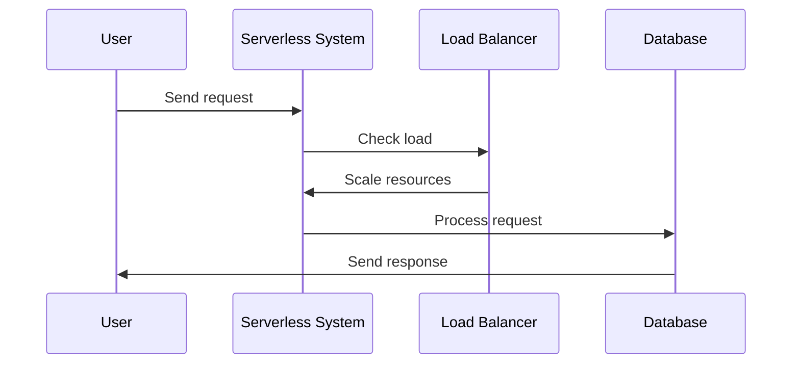

### 3.2 Serverless架构在LLM运维中的挑战

尽管Serverless架构在LLM运维中具有显著的优势，但也面临一些挑战，主要包括以下几个方面：

#### 核心概念与联系

**挑战**：
- **依赖管理**：Serverless架构依赖于第三方服务和库，管理这些依赖项可能会变得复杂。
- **性能限制**：函数执行时间和网络延迟可能会影响LLM的性能。
- **安全性**：函数级别的权限管理以及数据安全是关键问题。
- **成本控制**：虽然按需付费降低了初始成本，但需要有效监控和管理以避免过度支出。

**Mermaid 流�程图**：

```mermaid
graph
    subgraph Challenges
        Dependency Management --> Performance Constraints
        Security Issues --> Cost Control
    end
```

#### 伪代码：

```python
# 依赖管理
def manage_dependencies():
    # 管理第三方服务和库
    update_dependencies()

# 性能限制
def check_performance():
    # 监控函数执行时间和网络延迟
    monitor_performance()

# 安全性
def manage_security():
    # 实施函数级别的权限管理
    set_permissions()

# 成本控制
def control_costs():
    # 监控和管理费用
    monitor_expenses()
```

#### 数学模型和公式：

Serverless架构在LLM运维中的挑战可以表示为以下数学模型：

$$
\text{Challenges} = f(\text{Dependency Management}, \text{Performance Constraints}, \text{Security Issues}, \text{Cost Control})
$$

#### 举例说明

假设在一个使用Serverless架构的LLM应用中，由于第三方依赖的更新导致服务中断，需要及时更新依赖并确保系统稳定运行。

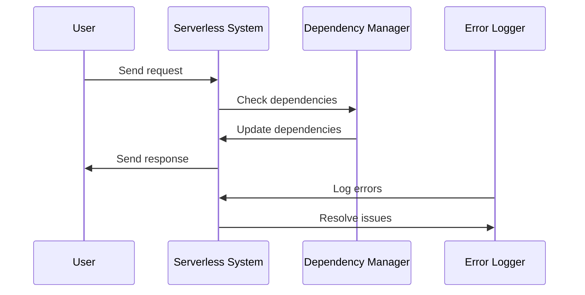

### 3.3 Serverless与LLM的结合案例

为了更好地理解Serverless架构在LLM运维中的实际应用，我们可以通过一个案例来展示其结合过程。

#### 案例背景

假设我们开发了一个基于GPT-3的问答系统，用户可以通过Web界面提交问题，系统需要快速、准确地返回答案。为了简化运维流程，我们决定采用Serverless架构。

#### 案例实施

1. **环境搭建**：
   - 使用AWS Lambda作为函数计算服务。
   - 使用Amazon API Gateway作为API接口。
   - 使用Amazon S3作为数据存储。

2. **依赖管理**：
   - 安装必要的库，如`transformers`和`torch`。
   - 配置依赖管理工具，如`pip`。

3. **代码实现**：
   - 编写Lambda函数，用于处理用户请求和调用GPT-3 API。
   - 使用API Gateway接收用户请求并调用Lambda函数。

4. **部署与监控**：
   - 使用AWS CloudWatch进行监控和日志记录。
   - 配置自动扩展策略，根据请求量动态调整Lambda函数的并发数量。

#### 遇到的挑战与解决方法

1. **依赖管理**：
   - **挑战**：由于依赖库较大，导致Lambda函数的部署时间较长。
   - **解决方法**：使用`layers`来分离依赖库，减少Lambda函数的部署时间。

2. **性能限制**：
   - **挑战**：GPT-3 API的响应时间较长，导致系统响应速度慢。
   - **解决方法**：优化网络延迟，使用CDN加速GPT-3 API的访问。

3. **安全性**：
   - **挑战**：需要确保用户数据和API密钥的安全。
   - **解决方法**：使用IAM角色和策略进行权限控制，加密敏感数据。

4. **成本控制**：
   - **挑战**：需要监控和管理Lambda函数的使用量，避免过度支出。
   - **解决方法**：使用AWS Cost Explorer进行成本分析，设置预算警报。

### 结论

本章探讨了Serverless架构在LLM运维中的优势和挑战。通过结合Serverless架构，我们可以简化LLM运维流程，提高系统的弹性、性能和安全性。然而，依赖管理、性能限制、安全性和成本控制等挑战也需要我们认真应对。在接下来的章节中，我们将深入分析Serverless架构的原理和组成部分。

## 第四部分：Serverless架构原理

## 第4章 Serverless架构原理

### 4.1 服务器无状态设计

服务器无状态设计是Serverless架构的核心概念之一，它确保了应用程序在运行过程中不会依赖于任何与请求相关的状态信息。这种设计模式在Serverless架构中具有以下几个关键作用：

#### 核心概念与联系

**服务器无状态设计**：
- **定义**：服务器无状态设计是指服务器在处理请求时，不会存储任何与请求相关的状态信息。每次请求都是独立的，服务器不会记住之前的请求。
- **作用**：
  - **简化部署和扩展**：无状态设计使得部署和扩展变得更加简单和高效，因为无需担心状态信息的同步和迁移。
  - **提高系统的可靠性和可用性**：由于每次请求都是独立的，即使某个实例发生故障，系统也能够快速恢复，不会影响其他请求的处理。
  - **提升性能和响应速度**：无状态设计减少了服务器在处理请求时的开销，从而提高了系统的性能和响应速度。

**Mermaid 流程图**：

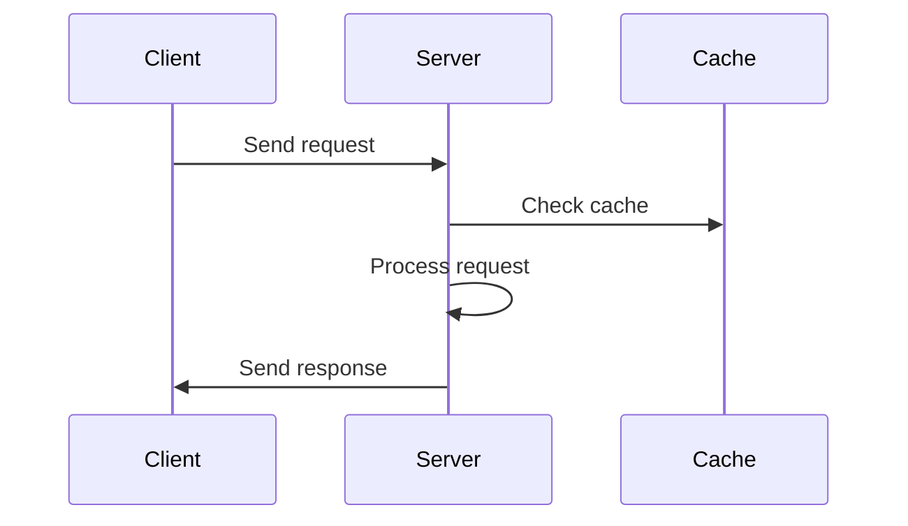

#### 伪代码：

```python
def process_request(request):
    if cache_hit(request):
        return cache_response(request)
    response = perform_request(request)
    update_cache(request, response)
    return response
```

#### 数学模型和公式：

无状态设计的一个关键特点是状态转移函数\( f(\)：

$$ f(s, i) = s' $$

其中，\( s \)代表当前状态，\( i \)代表输入，\( s' \)代表新的状态。由于服务器无状态，\( s \)在每次请求中都是相同的，这意味着\( f \)是一个独立于之前请求的函数。

#### 举例说明

假设一个电商网站的无状态服务器处理购物车操作。当用户添加商品到购物车时，服务器不会记住用户之前的操作，每次请求都是独立的。


### 4.2 Serverless架构的组成部分

Serverless架构由多个组成部分构成，这些部分共同协作，实现了无需关注底层基础设施的云计算模型。以下是对Serverless架构的主要组成部分的详细探讨：

#### 核心概念与联系

**组成部分**：
- **函数即服务（FaaS）**：FaaS是Serverless架构的核心，允许开发者编写和部署函数，这些函数在触发事件时执行。
- **后端即服务（BaaS）**：BaaS提供了一系列的后端服务，如数据库、消息队列、身份验证等，无需开发者关注底层实现。
- **移动后端即服务（MBaaS）**：MBaaS为移动应用程序提供后端服务，如用户管理、文件存储、推送通知等。

**Mermaid 流程图**：

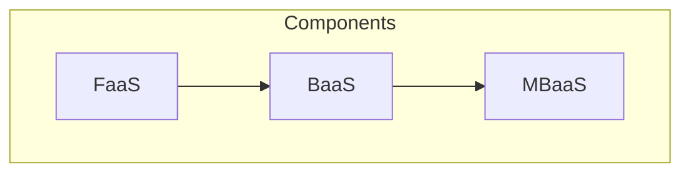

#### 伪代码：

```python
# FaaS
def handle_event(event):
    process_event(event)

# BaaS
def manage_database(operation, data):
    database operate(data)

# MBaaS
def send_notification(user_id, notification):
    push_notification_to_user(user_id, notification)
```

#### 数学模型和公式：

Serverless架构的组成部分可以表示为以下数学模型：

$$
\text{Serverless Architecture} = \text{FaaS} + \text{BaaS} + \text{MBaaS}
$$

#### 举例说明

假设一个应用使用Serverless架构来处理用户注册、数据存储和消息推送。

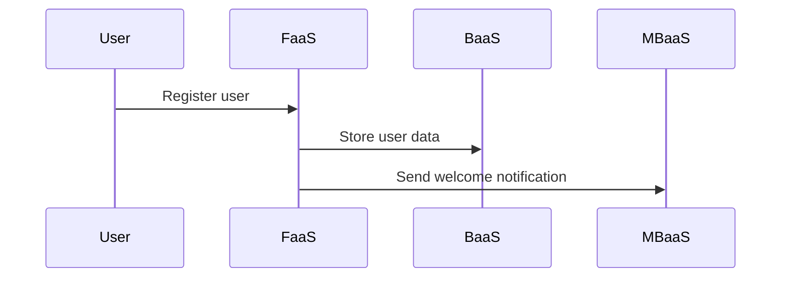

### 4.3 Serverless架构的生态系统

Serverless架构的生态系统包括云服务提供商、开源框架和第三方工具，这些组成部分共同促进了Serverless技术的发展和应用。

#### 核心概念与联系

**生态系统组成部分**：
- **云服务提供商**：如AWS、Azure、Google Cloud等，提供了全面的Serverless服务和工具。
- **开源框架**：如Serverless Framework、OpenFaaS、AWS Lambda Extensions等，提供了方便的部署和管理工具。
- **第三方工具**：如Logz.io、Datadog、New Relic等，提供了监控和日志分析工具。

**Mermaid 流程图**：

```mermaid
graph
    subgraph Providers
        AWS --> Azure
        Azure --> Google Cloud
    end

    subgraph Frameworks
        Serverless Framework --> OpenFaaS
        OpenFaaS --> AWS Lambda Extensions
    end

    subgraph Tools
        Logz.io --> Datadog
        Datadog --> New Relic
    end
```

#### 伪代码：

```python
# 云服务提供商
def use_aws_lambda():
    deploy_function_to_aws()

# 开源框架
def use_serverless_framework():
    configure_serverless_configuration()

# 第三方工具
def monitor_performance():
    use_monitoring_tool()
```

#### 数学模型和公式：

Serverless架构的生态系统可以表示为以下数学模型：

$$
\text{Serverless Ecosystem} = \text{Providers} + \text{Frameworks} + \text{Tools}
$$

#### 举例说明

假设一个开发团队选择使用AWS Lambda、Serverless Framework和New Relic来构建和监控一个Serverless应用。

```mermaid
sequenceDiagram
    participant Developer
    participant AWS Lambda
    participant Serverless Framework
    participant New Relic
    Developer->>AWS Lambda: Deploy function
    AWS Lambda->>Serverless Framework: Configure serverless.yaml
    Serverless Framework->>New Relic: Monitor performance
```

### 结论

本章详细探讨了Serverless架构的原理，包括服务器无状态设计、组成部分和生态系统。通过理解这些核心概念，开发者可以更好地设计和部署Serverless应用，从而简化运维流程、提高系统性能和可伸缩性。在下一章中，我们将深入探讨Serverless架构下的LLM运维策略。

## 第五部分：LLM运维策略

## 第5章 LLM运维策略

### 5.1 LLM运维的关键点

在Serverless架构下，运维LLM应用需要考虑多个关键点，以确保系统的稳定性、性能和安全性。以下是一些关键的运维策略：

#### 核心概念与联系

**关键点**：
- **自动化部署与扩展**：自动化部署能够提高开发效率，而自动化扩展则确保系统在负载增加时能够弹性应对。
- **持续集成与持续部署（CI/CD）**：通过自动化测试和部署流程，确保代码质量和应用稳定性。
- **性能优化**：优化模型和函数的配置，提高系统的响应速度和处理能力。
- **监控与日志分析**：实时监控系统的运行状态，并通过日志分析发现潜在问题。
- **安全性**：确保用户数据和API密钥的安全，防止数据泄露和未经授权的访问。

**Mermaid 流程图**：

```mermaid
graph
    subgraph Key Points
        Automation Deployment --> Auto Scaling
        CI/CD --> Performance Optimization
        Monitoring & Log Analysis --> Security
    end
```

#### 伪代码：

```python
# 自动化部署与扩展
def deploy_and_scale():
    # 部署应用
    deploy_application()
    # 自动扩展
    auto_scale_resources()

# 持续集成与持续部署
def ci_cd():
    # 自动化测试
    run_tests()
    # 部署应用
    deploy_application()

# 性能优化
def optimize_performance():
    # 优化模型配置
    tune_model_configuration()
    # 优化函数配置
    tune_function_configuration()

# 监控与日志分析
def monitor_and_analyze():
    # 实时监控
    monitor_system()
    # 日志分析
    analyze_logs()

# 安全性
def ensure_security():
    # 数据加密
    encrypt_data()
    # 权限管理
    manage_permissions()
```

#### 数学模型和公式：

LLM运维的关键点可以表示为以下数学模型：

$$
\text{Key Points} = f(\text{Automation Deployment & Auto Scaling}, \text{CI/CD}, \text{Performance Optimization}, \text{Monitoring & Log Analysis}, \text{Security})
$$

#### 举例说明

假设我们使用Serverless架构部署一个基于GPT-3的问答系统，我们需要实施以下运维策略：

```mermaid
sequenceDiagram
    participant Developer
    participant CI/CD Tool
    participant AWS Lambda
    participant Monitoring Tool
    participant Security System
    Developer->>CI/CD Tool: Commit code
    CI/CD Tool->>AWS Lambda: Deploy application
    AWS Lambda->>Monitoring Tool: Monitor system
    Monitoring Tool->>Developer: Alert issues
    Developer->>Security System: Manage permissions
    Security System->>Developer: Ensure data security
```

### 5.2 Serverless架构在LLM运维中的应用

Serverless架构在LLM运维中的应用能够显著简化运维流程，提高系统的弹性和可伸缩性。以下是一些具体的实现方法和工具：

#### 核心概念与联系

**应用方法**：
- **自动化部署**：使用CI/CD工具自动化部署LLM模型和应用程序。
- **自动化扩展**：根据负载自动调整函数的并发执行数量。
- **负载均衡**：使用负载均衡器确保请求均衡地分配到不同的函数实例。
- **容器化**：使用容器（如Docker）封装LLM模型和应用程序，提高部署效率和可移植性。
- **监控与日志分析**：使用云服务提供商提供的监控和日志分析工具，实时监控系统的运行状态。

**Mermaid 流程图**：

```mermaid
sequenceDiagram
    participant User
    participant API Gateway
    participant Load Balancer
    participant Lambda Functions
    participant Monitoring Tool
    User->>API Gateway: Send request
    API Gateway->>Load Balancer: Balance load
    Load Balancer->>Lambda Functions: Dispatch requests
    Lambda Functions->>Monitoring Tool: Monitor performance
```

#### 伪代码：

```python
# 自动化部署
def deploy_application():
    # 使用CI/CD工具部署
    ci_cd_tool.deploy()

# 自动扩展
def auto_scale():
    # 根据负载自动扩展
    auto_scaler.scale()

# 负载均衡
def balance_load():
    # 使用负载均衡器分配请求
    load_balancer.allocate()

# 容器化
def containerize():
    # 使用Docker容器化
    docker.containerize()

# 监控与日志分析
def monitor_system():
    # 使用监控工具
    monitoring_tool.monitor()
    # 收集日志
    log_analyzer.analyze_logs()
```

#### 数学模型和公式：

Serverless架构在LLM运维中的应用可以表示为以下数学模型：

$$
\text{LLM Operations on Serverless} = f(\text{Automation Deployment}, \text{Auto Scaling}, \text{Load Balancing}, \text{Containerization}, \text{Monitoring & Log Analysis})
$$

#### 举例说明

假设我们使用AWS Lambda和API Gateway构建一个问答系统，并实施以下运维策略：

```mermaid
sequenceDiagram
    participant User
    participant API Gateway
    participant AWS Lambda
    participant CloudWatch
    participant Developer
    User->>API Gateway: Send question
    API Gateway->>AWS Lambda: Forward question
    AWS Lambda->>CloudWatch: Monitor performance
    CloudWatch->>Developer: Alert issues
    Developer->>API Gateway: Update deployment
```

### 5.3 自动化运维工具的选择

在Serverless架构下，选择合适的自动化运维工具对于简化运维流程和提高系统稳定性至关重要。以下是一些常用的自动化运维工具及其特点：

#### 核心概念与联系

**自动化运维工具**：
- **Serverless Framework**：提供了一个统一的平台，用于部署、管理和监控Serverless应用。
- **AWS Lambda**：提供了函数即服务（FaaS）的功能，支持自动扩展和按需付费。
- **AWS Step Functions**：用于编排和管理复杂的、跨多个服务的工作流。
- **Docker**：用于容器化应用程序，提高部署效率和可移植性。
- **Kubernetes**：用于容器编排，提供自动扩展、负载均衡和故障转移等功能。

**Mermaid 流程图**：

```mermaid
graph
    subgraph Tools
        Serverless Framework --> AWS Lambda
        AWS Lambda --> AWS Step Functions
        Docker --> Kubernetes
    end
```

#### 伪代码：

```python
# 使用Serverless Framework
def deploy_with_serverless():
    serverless.deploy()

# 使用AWS Lambda
def use_lambda():
    lambda_function.execute()

# 使用AWS Step Functions
def use_step_functions():
    step_function.execute()

# 使用Docker
def use_docker():
    docker.build_image()
    docker.run_container()

# 使用Kubernetes
def use_kubernetes():
    kubernetes.deploy()
    kubernetes.scale()
```

#### 数学模型和公式：

自动化运维工具的选择可以表示为以下数学模型：

$$
\text{Tool Selection} = f(\text{Serverless Framework}, \text{AWS Lambda}, \text{AWS Step Functions}, \text{Docker}, \text{Kubernetes})
$$

#### 举例说明

假设一个团队决定使用Serverless Framework、AWS Lambda和Kubernetes来构建和运维一个问答系统：

```mermaid
sequenceDiagram
    participant Developer
    participant Serverless Framework
    participant AWS Lambda
    participant Kubernetes
    Developer->>Serverless Framework: Deploy application
    Serverless Framework->>AWS Lambda: Deploy Lambda functions
    AWS Lambda->>Kubernetes: Configure Kubernetes cluster
    Kubernetes->>Developer: Monitor and manage resources
```

### 5.4 构建高效的运维流程

构建高效的运维流程是确保LLM应用在Serverless架构下稳定运行的关键。以下是一些建议和最佳实践：

#### 核心概念与联系

**建议**：
- **定义明确的部署流程**：明确每个阶段的任务和责任人，确保流程顺畅。
- **版本控制**：使用版本控制系统管理代码和配置文件，确保部署的一致性和可追溯性。
- **自动化测试**：在部署前进行自动化测试，确保代码质量和功能完整性。
- **实时监控**：使用监控工具实时监控系统的运行状态，及时发现和解决问题。
- **灾难恢复计划**：制定灾难恢复计划，确保在发生故障时能够快速恢复服务。

**Mermaid 流程图**：

```mermaid
sequenceDiagram
    participant Developer
    participant Git
    participant CI/CD Tool
    participant Monitoring Tool
    participant Alert System
    Developer->>Git: Commit code
    Git->>CI/CD Tool: Run tests
    CI/CD Tool->>Monitoring Tool: Monitor system
    Monitoring Tool->>Alert System: Alert issues
    Alert System->>Developer: Resolve issues
```

#### 伪代码：

```python
# 定义部署流程
def define_deployment_pipeline():
    # 定义部署阶段和任务
    define_pipeline_stages()

# 版本控制
def version_control():
    # 使用Git管理代码和配置文件
    git.commit_changes()

# 自动化测试
def run_automated_tests():
    # 执行自动化测试
    test_runner.run_tests()

# 实时监控
def monitor_system():
    # 使用监控工具
    monitoring_tool.collect_metrics()

# 灾难恢复计划
def disaster_recovery_plan():
    # 制定恢复计划
    create_recovery_plan()
```

#### 数学模型和公式：

构建高效的运维流程可以表示为以下数学模型：

$$
\text{Efficient Operations} = f(\text{Deployment Pipeline}, \text{Version Control}, \text{Automated Tests}, \text{Real-time Monitoring}, \text{Disaster Recovery Plan})
$$

#### 举例说明

假设一个团队决定构建一个高效的运维流程来管理和维护一个基于GPT-3的问答系统：

```mermaid
sequenceDiagram
    participant Developer
    participant Git
    participant Jenkins
    participant Nagios
    participant Developer->>Git: Commit code
    Git->>Jenkins: Trigger CI/CD
    Jenkins->>Nagios: Monitor system
    Nagios->>Developer: Alert issues
    Developer->>Git: Merge changes
```

### 结论

本章详细探讨了Serverless架构下的LLM运维策略，包括关键点、应用方法、自动化运维工具的选择和构建高效的运维流程。通过这些策略，开发者可以更好地管理和维护LLM应用，确保系统的稳定性、性能和安全性。在下一章中，我们将深入探讨如何在Serverless架构下部署LLM模型。

## 第六部分：LLM部署

## 第6章 LLM部署

### 6.1 部署前准备

在Serverless架构下部署LLM模型前，需要进行一系列的准备工作，以确保部署过程顺利进行。以下是一些关键的准备工作：

#### 核心概念与联系

**准备工作**：
- **环境搭建**：配置开发和测试环境，包括服务器、数据库、网络配置等。
- **依赖管理**：管理项目所需的依赖库和工具，确保在部署过程中不会出现版本冲突。
- **代码组织**：组织代码结构，确保易于维护和扩展。
- **版本控制**：使用版本控制系统管理代码，确保版本的一致性和可追溯性。

**Mermaid 流程图**：

```mermaid
sequenceDiagram
    participant Developer
    participant Environment Setup
    participant Dependency Manager
    participant Code Organizer
    participant Version Control
    Developer->>Environment Setup: Setup environment
    Environment Setup->>Dependency Manager: Manage dependencies
    Dependency Manager->>Code Organizer: Organize code
    Code Organizer->>Version Control: Commit code
```

#### 伪代码：

```python
# 环境搭建
def setup_environment():
    # 配置开发环境
    configure_environment()

# 依赖管理
def manage_dependencies():
    # 安装依赖库
    install_dependencies()

# 代码组织
def organize_code():
    # 重新组织代码结构
    restructure_code()

# 版本控制
def version_control():
    # 提交代码到版本控制系统
    commit_code()
```

#### 数学模型和公式：

部署前的准备工作可以表示为以下数学模型：

$$
\text{Preparation} = f(\text{Environment Setup}, \text{Dependency Management}, \text{Code Organization}, \text{Version Control})
$$

#### 举例说明

假设一个开发者准备在AWS Lambda上部署一个基于GPT-3的问答系统，需要进行以下准备工作：

```mermaid
sequenceDiagram
    participant Developer
    participant AWS Lambda
    participant Docker
    participant Git
    Developer->>AWS Lambda: Configure AWS Lambda
    AWS Lambda->>Docker: Build Docker image
    Docker->>Git: Commit code
    Git->>Developer: Verify environment
```

### 6.2 函数部署

在Serverless架构下，函数是部署LLM模型的主要组件。以下是如何在Serverless平台上部署函数的详细步骤：

#### 核心概念与联系

**部署步骤**：
- **编写函数**：编写用于处理请求的函数代码。
- **配置函数**：配置函数的内存、超时时间和网络设置等。
- **测试函数**：在本地或测试环境中测试函数，确保其正常运行。
- **部署函数**：将函数部署到Serverless平台，如AWS Lambda、Azure Functions等。
- **监控函数**：实时监控函数的运行状态，确保其稳定性和性能。

**Mermaid 流程图**：

```mermaid
sequenceDiagram
    participant Developer
    participant Function
    participant Test Environment
    participant Serverless Platform
    participant Monitoring Tool
    Developer->>Function: Write function code
    Function->>Test Environment: Test function
    Test Environment->>Monitoring Tool: Monitor test results
    Monitoring Tool->>Developer: Report issues
    Developer->>Serverless Platform: Deploy function
    Serverless Platform->>Monitoring Tool: Monitor function
```

#### 伪代码：

```python
# 编写函数
def create_function():
    # 编写函数代码
    write_function_code()

# 配置函数
def configure_function():
    # 配置函数设置
    set_function_configuration()

# 测试函数
def test_function():
    # 在测试环境中运行函数
    run_function_tests()

# 部署函数
def deploy_function():
    # 部署函数到Serverless平台
    deploy_to_serverless()

# 监控函数
def monitor_function():
    # 监控函数运行状态
    monitor_function_status()
```

#### 数学模型和公式：

函数部署可以表示为以下数学模型：

$$
\text{Function Deployment} = f(\text{Function Writing}, \text{Function Configuration}, \text{Function Testing}, \text{Function Deployment}, \text{Function Monitoring})
$$

#### 举例说明

假设一个开发者编写了一个用于处理问答请求的函数，并在AWS Lambda上部署：

```mermaid
sequenceDiagram
    participant Developer
    participant AWS Lambda
    participant Code Editor
    participant Testing Environment
    Developer->>Code Editor: Write Lambda function
    Code Editor->>Developer: Review code
    Developer->>Testing Environment: Test function locally
    Testing Environment->>Developer: Report test results
    Developer->>AWS Lambda: Deploy function
    AWS Lambda->>Monitoring Tool: Monitor function
```

### 6.3 模型部署

在Serverless架构下，部署LLM模型通常涉及以下步骤：

#### 核心概念与联系

**部署步骤**：
- **模型选择**：选择合适的LLM模型，根据应用需求和性能要求进行选择。
- **模型优化**：对LLM模型进行优化，以提高其性能和响应速度。
- **模型打包**：将LLM模型打包成可以在Serverless平台上运行的形式。
- **模型部署**：将优化后的模型部署到Serverless平台，确保其可以快速响应用户请求。
- **模型监控**：实时监控模型性能，及时发现和解决问题。

**Mermaid 流程图**：

```mermaid
sequenceDiagram
    participant Developer
    participant Model Repository
    participant Model Optimizer
    participant Model Packager
    participant Serverless Platform
    participant Monitoring Tool
    Developer->>Model Repository: Select model
    Model Repository->>Developer: Provide model
    Developer->>Model Optimizer: Optimize model
    Model Optimizer->>Model Packager: Package model
    Model Packager->>Serverless Platform: Deploy model
    Serverless Platform->>Monitoring Tool: Monitor model performance
```

#### 伪代码：

```python
# 模型选择
def select_model():
    # 根据需求选择模型
    choose_model()

# 模型优化
def optimize_model(model):
    # 优化模型性能
    improve_model_performance()

# 模型打包
def package_model(model):
    # 打包模型
    prepare_model_for_deployment()

# 模型部署
def deploy_model(model):
    # 部署模型到Serverless平台
    deploy_model_to_serverless()

# 模型监控
def monitor_model(model):
    # 监控模型性能
    track_model_performance()
```

#### 数学模型和公式：

模型部署可以表示为以下数学模型：

$$
\text{Model Deployment} = f(\text{Model Selection}, \text{Model Optimization}, \text{Model Packaging}, \text{Model Deployment}, \text{Model Monitoring})
$$

#### 举例说明

假设一个开发者选择了一个基于GPT-3的问答模型，并计划在AWS Lambda上部署：

```mermaid
sequenceDiagram
    participant Developer
    participant AWS Lambda
    participant Model Repository
    participant Model Optimizer
    Developer->>Model Repository: Retrieve GPT-3 model
    Model Repository->>Developer: Provide model
    Developer->>Model Optimizer: Optimize model for performance
    Model Optimizer->>Developer: Optimized model
    Developer->>AWS Lambda: Deploy optimized model
    AWS Lambda->>Monitoring Tool: Monitor model performance
```

### 结论

本章详细探讨了在Serverless架构下部署LLM模型的过程，包括部署前的准备工作、函数部署和模型部署。通过这些步骤，开发者可以确保LLM模型在Serverless平台上高效、稳定地运行。在下一章中，我们将探讨如何优化LLM应用的性能和监控。

## 第七部分：性能优化与监控

## 第7章 性能优化与监控

### 7.1 性能优化策略

在Serverless架构下，优化LLM应用性能是确保其高效运行的关键。以下是一些关键性能优化策略：

#### 核心概念与联系

**优化策略**：
- **优化函数配置**：调整函数的内存、超时时间和并发限制，以满足应用需求。
- **缓存技术**：使用缓存减少重复计算，提高响应速度。
- **数据压缩**：对传输的数据进行压缩，减少网络传输时间。
- **异步处理**：使用异步处理减少函数的执行时间，提高系统的吞吐量。
- **负载均衡**：合理分配负载，确保系统资源得到充分利用。

**Mermaid 流程图**：

```mermaid
graph
    subgraph Optimization Strategies
        Function Configuration Optimization --> Caching
        Data Compression --> Asynchronous Processing
        Load Balancing
    end
```

#### 伪代码：

```python
# 优化函数配置
def optimize_function_configuration():
    # 调整内存和并发限制
    adjust_memory_and_concurrency()

# 使用缓存
def use_caching():
    # 启用缓存机制
    enable_caching()

# 数据压缩
def compress_data():
    # 压缩传输数据
    compress_transmitted_data()

# 异步处理
def process_asynchronously():
    # 使用异步处理
    utilize_asynchronous_processing()

# 负载均衡
def balance_load():
    # 使用负载均衡器
    employ_load_balancer()
```

#### 数学模型和公式：

性能优化策略可以表示为以下数学模型：

$$
\text{Performance Optimization} = f(\text{Function Configuration Optimization}, \text{Caching}, \text{Data Compression}, \text{Asynchronous Processing}, \text{Load Balancing})
$$

#### 举例说明

假设一个开发者优化了一个基于GPT-3的问答系统：

```mermaid
sequenceDiagram
    participant Developer
    participant AWS Lambda
    participant CloudWatch
    participant Load Balancer
    Developer->>AWS Lambda: Optimize Lambda configuration
    AWS Lambda->>CloudWatch: Monitor performance metrics
    CloudWatch->>Developer: Alert performance issues
    Developer->>Load Balancer: Configure load balancing
```

### 7.2 监控与日志分析

在Serverless架构下，监控和日志分析是确保LLM应用稳定运行的关键。以下是一些关键监控工具和日志分析方法：

#### 核心概念与联系

**监控工具**：
- **云服务提供商的监控工具**：如AWS CloudWatch、Azure Monitor、Google Stackdriver等。
- **第三方监控工具**：如Datadog、New Relic、Prometheus等。

**日志分析方法**：
- **日志收集**：使用日志代理收集应用产生的日志。
- **日志分析**：对收集的日志进行解析和分析，发现潜在问题和性能瓶颈。
- **告警机制**：设置告警规则，当系统状态异常时自动通知相关人员。

**Mermaid 流程图**：

```mermaid
graph
    subgraph Monitoring Tools
        AWS CloudWatch --> Azure Monitor
        Azure Monitor --> Google Stackdriver
    end

    subgraph Log Analysis
        Log Collection --> Log Analysis --> Alerting
    end
```

#### 伪代码：

```python
# 使用云服务提供商的监控工具
def use_cloud_monitoring-tool():
    # 配置监控指标
    configure_monitoring_metrics()

# 使用第三方监控工具
def use_third_party_monitoring():
    # 集成第三方监控工具
    integrate_third_party_tools()

# 日志收集
def collect_logs():
    # 收集应用日志
    gather_logs()

# 日志分析
def analyze_logs():
    # 分析日志
    parse_and_analyze_logs()

# 告警机制
def set_alerts():
    # 设置告警规则
    configure_alert_rules()
```

#### 数学模型和公式：

监控与日志分析可以表示为以下数学模型：

$$
\text{Monitoring & Log Analysis} = f(\text{Cloud Monitoring Tools}, \text{Third-Party Monitoring Tools}, \text{Log Collection}, \text{Log Analysis}, \text{Alerting})
$$

#### 举例说明

假设一个开发者使用AWS CloudWatch监控一个基于GPT-3的问答系统：

```mermaid
sequenceDiagram
    participant Developer
    participant AWS CloudWatch
    participant Application
    Developer->>AWS CloudWatch: Configure monitoring
    AWS CloudWatch->>Application: Collect metrics
    Application->>AWS CloudWatch: Send logs
    AWS CloudWatch->>Developer: Generate alerts
```

### 结论

本章详细探讨了在Serverless架构下优化LLM应用性能的策略以及监控和日志分析的方法。通过这些策略和方法，开发者可以确保LLM应用的高效运行和稳定性。在下一章中，我们将探讨安全与合规性要求。

## 第八部分：安全与合规性

## 第8章 安全与合规性

### 8.1 安全性考虑

在Serverless架构下，安全性是确保LLM应用和数据安全的关键。以下是一些关键的安全考虑因素：

#### 核心概念与联系

**安全考虑因素**：
- **数据安全**：保护存储和传输中的敏感数据，防止数据泄露和未经授权的访问。
- **访问控制**：设置适当的访问权限，确保只有授权用户和系统可以访问资源。
- **加密**：使用加密技术保护数据，包括数据在存储和传输过程中的加密。
- **身份验证和授权**：使用强身份验证机制和授权策略，确保用户和系统的合法身份。

**Mermaid 流程图**：

```mermaid
graph
    subgraph Security Considerations
        Data Security --> Access Control
        Encryption --> Authentication & Authorization
    end
```

#### 伪代码：

```python
# 数据安全
def secure_data():
    # 加密敏感数据
    encrypt_sensitive_data()

# 访问控制
def manage_access():
    # 设置访问权限
    set_access_permissions()

# 加密
def encrypt_data():
    # 使用加密算法
    apply_encryption()

# 身份验证和授权
def authenticate_and_authorize():
    # 验证用户身份
    verify_user_identity()
    # 授权用户访问
    grant_user_access()
```

#### 数学模型和公式：

安全性考虑可以表示为以下数学模型：

$$
\text{Security} = f(\text{Data Security}, \text{Access Control}, \text{Encryption}, \text{Authentication & Authorization})
$$

#### 举例说明

假设一个开发者采取措施保护一个基于GPT-3的问答系统的数据安全：

```mermaid
sequenceDiagram
    participant Developer
    participant Data Storage
    participant Authentication System
    Developer->>Data Storage: Encrypt data
    Data Storage->>Authentication System: Authenticate access
    Authentication System->>Developer: Grant access
```

### 8.2 合规性要求

在Serverless架构下，合规性要求是确保应用和数据符合相关法规和标准的重要方面。以下是一些关键合规性要求：

#### 核心概念与联系

**合规性要求**：
- **数据隐私保护**：确保遵守数据隐私法规，如GDPR和CCPA，保护用户数据隐私。
- **法规解读**：理解并遵循相关法规的条款和规定，确保应用的设计和实现符合法规要求。
- **安全审计**：定期进行安全审计，确保系统符合法规要求，并及时发现和纠正问题。

**Mermaid 流程图**：

```mermaid
graph
    subgraph Compliance Requirements
        Data Privacy Protection --> Regulatory Compliance
        Security Audits
    end
```

#### 伪代码：

```python
# 数据隐私保护
def protect_data_privacy():
    # 遵守数据隐私法规
    comply_with_data_privacy_laws()

# 法规解读
def interpret_regulations():
    # 解读相关法规
    understand_regulatory_requirements()

# 安全审计
def conduct_security_audits():
    # 定期进行安全审计
    perform_security_audits()
```

#### 数学模型和公式：

合规性要求可以表示为以下数学模型：

$$
\text{Compliance} = f(\text{Data Privacy Protection}, \text{Regulatory Compliance}, \text{Security Audits})
$$

#### 举例说明

假设一个开发者确保一个基于GPT-3的问答系统符合数据隐私法规：

```mermaid
sequenceDiagram
    participant Developer
    participant Data Privacy Team
    participant GDPR Compliance
    Developer->>Data Privacy Team: Apply privacy protections
    Data Privacy Team->>GDPR Compliance: Ensure compliance
    GDPR Compliance->>Developer: Confirm compliance status
```

### 结论

本章详细探讨了在Serverless架构下确保LLM应用安全性和合规性的关键因素。通过数据安全、访问控制、加密、身份验证和授权，以及数据隐私保护和安全审计等策略，开发者可以确保应用和数据的安全合规。在下一章中，我们将通过具体案例研究展示Serverless架构在LLM运维中的应用。

## 第九部分：案例研究

## 第9章 案例研究

### 9.1 案例介绍

为了更好地展示Serverless架构在LLM运维中的应用，我们选择了以下几个案例：

**案例 1**：基于GPT-3的问答平台

**背景**：一个在线教育平台希望通过引入基于GPT-3的问答系统，为用户提供实时、高质量的问答服务。

**目标**：简化运维流程，提高系统的可伸缩性和响应速度。

**案例 2**：自动化客服系统

**背景**：一家大型电商平台计划部署一个自动化客服系统，以降低人工成本并提高客户满意度。

**目标**：确保系统的高可用性、可靠性和高性能。

**案例 3**：实时翻译服务

**背景**：一家跨国公司希望为其员工和客户提供实时的翻译服务，以便更好地沟通和协作。

**目标**：实现快速响应、高精度和低延迟的翻译服务。

### 9.2 案例实施

#### 案例一：基于GPT-3的问答平台

**实施步骤**：

1. **环境搭建**：使用AWS Lambda和API Gateway搭建Serverless架构。
2. **依赖管理**：安装必要的库，如`transformers`和`torch`。
3. **模型部署**：将预训练的GPT-3模型部署到AWS Lambda，并进行优化。
4. **接口搭建**：通过API Gateway搭建前端接口，接收用户请求并调用Lambda函数。
5. **监控与日志分析**：使用AWS CloudWatch监控系统性能，并设置告警规则。

**遇到的挑战与解决方法**：

- **挑战**：由于GPT-3模型的复杂性和计算资源需求，初期部署过程中遇到了性能瓶颈。
- **解决方法**：通过调整Lambda函数的配置，增加内存和并发限制，优化模型性能。

#### 案例二：自动化客服系统

**实施步骤**：

1. **环境搭建**：使用AWS Lambda和Amazon S3搭建Serverless架构。
2. **依赖管理**：安装必要的库，如`transformers`和`torch`。
3. **模型部署**：将预训练的模型部署到AWS Lambda，并进行优化。
4. **接口搭建**：通过API Gateway搭建前端接口，接收用户请求并调用Lambda函数。
5. **集成聊天平台**：将自动化客服系统集成到现有的聊天平台中。
6. **监控与日志分析**：使用AWS CloudWatch监控系统性能，并设置告警规则。

**遇到的挑战与解决方法**：

- **挑战**：需要确保自动化客服系统的响应速度和准确性，以满足用户需求。
- **解决方法**：通过优化模型和接口设计，提高系统的响应速度和准确性。

#### 案例三：实时翻译服务

**实施步骤**：

1. **环境搭建**：使用AWS Lambda和Amazon S3搭建Serverless架构。
2. **依赖管理**：安装必要的库，如`transformers`和`torch`。
3. **模型部署**：将预训练的翻译模型部署到AWS Lambda，并进行优化。
4. **接口搭建**：通过API Gateway搭建前端接口，接收用户请求并调用Lambda函数。
5. **集成翻译平台**：将实时翻译服务集成到现有的翻译平台中。
6. **监控与日志分析**：使用AWS CloudWatch监控系统性能，并设置告警规则。

**遇到的挑战与解决方法**：

- **挑战**：需要确保实时翻译服务的低延迟和高精度。
- **解决方法**：通过优化模型和传输路径，提高系统的低延迟和高精度。

### 9.3 案例总结

通过以上案例，我们可以看到Serverless架构在LLM运维中的实际应用。以下是案例中的主要收获和经验：

1. **简化运维流程**：Serverless架构通过自动化部署和监控，简化了运维流程，降低了运维成本。
2. **提高可伸缩性**：Serverless架构能够根据负载自动扩展和缩减资源，确保系统的高可用性和性能。
3. **优化性能**：通过合理配置函数和模型，可以显著提高系统的响应速度和处理能力。
4. **确保安全性**：通过加密和访问控制，可以确保用户数据和系统的安全性。
5. **实现高效开发**：Serverless架构使得开发者能够更专注于业务逻辑的实现，提高开发效率。

### 结论

通过这些案例研究，我们展示了Serverless架构在LLM运维中的应用和优势。通过合理设计和实施，Serverless架构可以为LLM应用提供高效的运维支持，提高系统的性能、可靠性和安全性。

## 第十部分：高级主题与未来趋势

## 第10章 高级主题与未来趋势

### 10.1 Serverless架构的新趋势

Serverless架构正不断发展，引入了新的趋势和技术，以应对日益复杂的业务需求和更高的性能要求。以下是一些值得关注的新趋势：

#### 核心概念与联系

**新趋势**：
- **容器化与Serverless**：容器化技术（如Docker和Kubernetes）与Serverless架构的结合，使得Serverless应用能够更好地管理和部署复杂的容器化服务。
- **微服务与Serverless**：将微服务架构与Serverless架构相结合，可以进一步简化应用部署，提高系统的可伸缩性和可靠性。
- **混合云和多云**：Serverless架构在混合云和多云环境中的应用，使得企业能够更好地利用不同云服务提供商的优势，实现更灵活的部署和管理。

**Mermaid 流程图**：

```mermaid
graph
    subgraph New Trends
        Containerization & Serverless --> Microservices & Serverless
        Hybrid Cloud & Multi-Cloud
    end
```

#### 伪代码：

```python
# 容器化与Serverless
def containerize_serverless():
    # 部署容器化的Serverless应用
    deploy_containerized_serverless()

# 微服务与Serverless
def integrate_microservices():
    # 集成微服务与Serverless架构
    integrate_microservices_with_serverless()

# 混合云和多云
def leverage_hybrid_cloud():
    # 利用混合云和多云架构
    utilize_hybrid_and_multi_cloud()
```

#### 数学模型和公式：

新趋势可以表示为以下数学模型：

$$
\text{New Trends} = f(\text{Containerization & Serverless}, \text{Microservices & Serverless}, \text{Hybrid Cloud & Multi-Cloud})
$$

#### 举例说明

假设一个企业决定采用混合云架构来部署Serverless应用：

```mermaid
sequenceDiagram
    participant Enterprise
    participant AWS
    participant Azure
    participant Serverless Platform
    Enterprise->>AWS: Deploy Serverless app on AWS
    Enterprise->>Azure: Deploy Serverless app on Azure
    Serverless Platform->>Enterprise: Monitor hybrid cloud performance
```

### 10.2 LLM发展的未来

随着人工智能技术的不断发展，LLM（大型语言模型）的应用前景也愈发广阔。以下是一些LLM发展的未来趋势：

#### 核心概念与联系

**未来趋势**：
- **新型LLM模型**：如GPT-4、GPT-5等，具有更高的参数规模和更强的语义理解能力。
- **跨模态LLM**：结合文本、图像、音频等多种模态，实现更丰富的语义理解和应用场景。
- **LLM在人工智能伦理方面的应用**：如隐私保护、公平性和透明度等，确保LLM技术的合理和合规使用。

**Mermaid 流程图**：

```mermaid
graph
    subgraph Future Trends
        New LLM Models --> Cross-modal LLMs
        Ethical AI Applications
    end
```

#### 伪代码：

```python
# 新型LLM模型
def train_new_llm_model():
    # 训练新型LLM模型
    train_new_large_language_model()

# 跨模态LLM
def cross_modal_llm():
    # 集成跨模态数据
    integrate_cross_modal_data()

# 人工智能伦理
def ethical_ai():
    # 确保LLM技术的伦理使用
    ensure_ethical_usage_of_ai()
```

#### 数学模型和公式：

未来趋势可以表示为以下数学模型：

$$
\text{Future Trends} = f(\text{New LLM Models}, \text{Cross-modal LLMs}, \text{Ethical AI Applications})
$$

#### 举例说明

假设一个团队决定开发一个跨模态LLM，结合文本和图像处理能力：

```mermaid
sequenceDiagram
    participant Research Team
    participant Text Model
    participant Image Model
    participant Cross-modal LLM
    Research Team->>Text Model: Train text model
    Research Team->>Image Model: Train image model
    Cross-modal LLM->>Research Team: Combine text and image data
    Research Team->>Cross-modal LLM: Train combined model
```

### 结论

本章探讨了Serverless架构的新趋势和LLM发展的未来。容器化与Serverless、微服务与Serverless、混合云和多云等新趋势，为Serverless架构带来了更广泛的应用场景和更高的灵活性。同时，新型LLM模型和跨模态LLM的发展，也为自然语言处理带来了新的机遇。通过不断探索和应用这些先进技术，开发者可以构建出更高效、更智能的LLM应用。

## 附录

### 技术资源

**Serverless工具集**

- **AWS Lambda**：提供了广泛的Serverless功能和工具，包括函数部署、自动扩展和监控。
- **Azure Functions**：微软提供的Serverless计算服务，支持多种编程语言和集成工具。
- **Google Cloud Functions**：Google的Serverless计算服务，支持快速部署和自动扩展。
- **OpenFaaS**：开源Serverless框架，支持在Kubernetes上部署函数。
- **Serverless Framework**：用于部署和管理Serverless应用的全功能框架。

**LLM开发资源**

- **Hugging Face**：提供了大量的预训练LLM模型和工具，方便开发者进行模型训练和应用开发。
- **Transformers**：开源库，用于构建和训练大规模语言模型。
- **TensorFlow**：Google开源的机器学习库，广泛用于深度学习应用。
- **PyTorch**：开源的机器学习库，支持动态计算图，广泛应用于自然语言处理领域。

### 参考文献

- **《Serverless Architectures on AWS》**：由AWS官方发布，详细介绍了Serverless架构在AWS平台上的应用和实践。
- **《Large-scale Language Models in Machine Learning》**：由Ian Goodfellow等人撰写的论文，探讨了大规模语言模型的发展和应用。
- **《Principles of Distributed Computing》**：由Edith Cohen和Eldar Fischer编写的书籍，介绍了分布式计算的基本原理和算法。
- **《Serverless Computing: everything you need to know》**：由Mark Nunnikhoven撰写的文章，全面介绍了Serverless计算的概念和技术。

通过这些技术和文献，开发者可以更好地理解和应用Serverless架构和LLM技术，构建出高效、智能的云应用程序。

