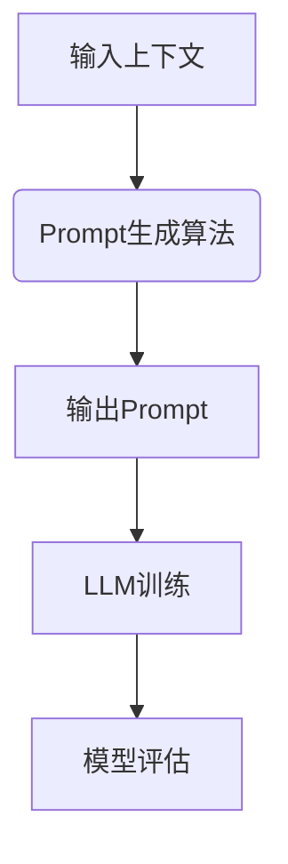
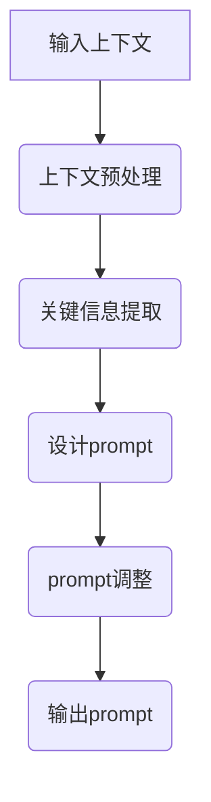

                 

### 文章标题：上下文感知prompt生成：提升LLM理解力

#### 关键词：上下文感知、prompt生成、LLM理解力、算法原理、数学模型、项目实战

#### 摘要：
本文深入探讨了上下文感知prompt生成在提升大型语言模型（LLM）理解力方面的作用。首先，文章介绍了上下文感知prompt生成的重要性及其在自然语言处理领域的应用背景。接着，详细阐述了上下文感知prompt生成的核心概念，包括prompt与上下文的关系以及设计要点。随后，文章通过伪代码和数学公式详细讲解了上下文感知prompt生成的算法原理和数学模型。为了验证算法的有效性，文章提供了一个项目实战案例，详细描述了开发环境搭建、源代码实现和代码解读，并对项目进行了深入分析。最后，文章总结了全文内容，展望了未来的研究方向，并给出了最佳实践建议。

---

## 引言与概述

随着深度学习和自然语言处理技术的快速发展，大型语言模型（LLM）如GPT-3、BERT等在文本生成、翻译、问答等任务上取得了显著成果。然而，这些模型的性能在很大程度上依赖于输入数据的上下文。为了使LLM能够更好地理解和生成与上下文相关的文本，上下文感知prompt生成技术应运而生。本文将围绕上下文感知prompt生成，探讨其在提升LLM理解力方面的作用。

上下文感知prompt生成技术旨在通过设计合适的prompt，使LLM在特定上下文中能够更准确地理解和生成文本。这种技术不仅能够提高LLM在特定任务上的性能，还能增强其泛化能力。因此，上下文感知prompt生成已成为自然语言处理领域的研究热点。

本文结构安排如下：

1. **引言与概述**：介绍上下文感知prompt生成的重要性及其在自然语言处理领域的应用背景。
2. **核心概念与联系**：详细阐述上下文感知prompt生成的核心概念，包括prompt与上下文的关系以及设计要点。
3. **算法原理讲解**：通过伪代码和数学公式详细讲解上下文感知prompt生成的算法原理和数学模型。
4. **数学模型与公式讲解**：使用latex格式详细讲解相关的数学模型和公式。
5. **项目实战**：提供代码实际案例，详细解释说明上下文感知prompt生成在项目中的应用。
6. **总结与展望**：总结全文内容，展望未来研究方向，并给出最佳实践建议。

## 核心概念与联系

### 1. 上下文感知prompt生成

上下文感知prompt生成是指通过设计合适的prompt，使LLM能够在特定上下文中更准确地理解和生成文本。prompt是一个关键输入，它包含了与任务相关的背景信息、关键词和指示。一个设计良好的prompt能够引导LLM关注上下文中的关键信息，从而提高模型的性能。

### 2. Prompt与上下文的关系

上下文是自然语言处理中的核心概念，它包含了与任务相关的背景信息。上下文感知prompt生成的关键在于如何从上下文中提取关键信息并将其有效嵌入到prompt中。这要求prompt不仅需要包含任务相关的关键词，还需要能够体现上下文的语义关系。

### 3. Prompt设计的要点

设计一个有效的prompt需要考虑多个因素：

1. **关键词选择**：选择与任务相关的关键词，确保prompt能够引导LLM关注关键信息。
2. **上下文信息**：提取上下文中的关键信息，使其在prompt中得以体现。
3. **语义一致性**：确保prompt中的信息能够与上下文保持一致，避免出现语义冲突。
4. **灵活性**：prompt需要具备一定的灵活性，以适应不同上下文和任务需求。

### 4. LLM理解力的提升机制

LLM的理解力主要依赖于其自身的训练数据和训练算法。然而，通过设计有效的上下文感知prompt，可以显著提升LLM在特定任务上的理解力。具体来说，prompt能够引导LLM关注上下文中的关键信息，从而提高模型的语义理解和生成能力。

### 5. Mermaid流程图

为了更直观地展示上下文感知prompt生成的原理，我们可以使用Mermaid流程图来描述其基本流程：



在这个流程图中，输入上下文经过prompt生成算法处理后，生成一个与上下文相关的prompt。该prompt被用于训练LLM，并通过模型评估来验证prompt生成算法的有效性。

## 算法原理讲解

### 1. 上下文感知prompt生成算法简介

上下文感知prompt生成算法的核心思想是通过从上下文中提取关键信息，设计出一个能够引导LLM关注关键信息的prompt。具体来说，算法可以分为以下几个步骤：

1. **上下文预处理**：对输入上下文进行预处理，包括分词、去停用词、词性标注等操作，以提取出关键信息。
2. **关键信息提取**：从预处理后的上下文中提取关键信息，例如关键词、主题词等。
3. **prompt设计**：根据提取的关键信息，设计出一个与上下文相关的prompt。
4. **prompt调整**：根据模型训练和评估结果，对prompt进行调整和优化。

### 2. 伪代码讲解

以下是一个简化的上下文感知prompt生成算法的伪代码：

```python
# 输入：上下文context
# 输出：prompt

def generate_prompt(context):
    # 步骤1：上下文预处理
    preprocessed_context = preprocess_context(context)
    
    # 步骤2：关键信息提取
    key_info = extract_key_info(preprocessed_context)
    
    # 步骤3：prompt设计
    prompt = design_prompt(key_info)
    
    # 步骤4：prompt调整
    prompt = adjust_prompt(prompt)
    
    return prompt
```

### 3. Prompt生成算法的流程

上下文感知prompt生成算法的流程可以用Mermaid流程图表示如下：



在这个流程图中，输入上下文经过上下文预处理、关键信息提取、prompt设计和prompt调整等步骤，最终生成一个与上下文相关的prompt。

## 数学模型与公式讲解

### 1. 数学模型介绍

上下文感知prompt生成涉及到多个数学模型，其中最核心的是概率模型和优化模型。

**1.1 概率模型**

概率模型用于描述上下文和prompt之间的概率关系。一个常见的概率模型是条件概率模型，它描述了在给定上下文C的情况下，生成promptP的概率：

$$
P(P|C) = \frac{P(C|P)P(P)}{P(C)}
$$

其中，$P(C|P)$ 表示在给定promptP的情况下，生成上下文C的概率，$P(P)$ 表示生成promptP的概率，$P(C)$ 表示生成上下文C的概率。

**1.2 优化模型**

优化模型用于调整prompt，使其与上下文更匹配。一个常见的优化模型是最小化损失函数，损失函数用于衡量prompt与上下文的匹配度。例如，可以使用平方误差损失函数：

$$
\min \limits_{\theta} J(\theta) = \sum \limits_{i=1}^{n} (y_i - \hat{y}_i)^2
$$

其中，$\theta$ 表示prompt的参数，$y_i$ 表示实际生成的上下文，$\hat{y}_i$ 表示预测的上下文。

### 2. 数学公式详细讲解

**2.1 条件概率模型**

条件概率模型描述了在给定上下文C的情况下，生成promptP的概率。具体来说，条件概率模型可以使用贝叶斯公式表示：

$$
P(P|C) = \frac{P(C|P)P(P)}{P(C)}
$$

其中，$P(C|P)$ 表示在给定promptP的情况下，生成上下文C的概率，$P(P)$ 表示生成promptP的概率，$P(C)$ 表示生成上下文C的概率。

**2.2 优化模型**

优化模型用于调整prompt，使其与上下文更匹配。具体来说，优化模型可以采用梯度下降算法来最小化损失函数。梯度下降算法的基本思想是沿着损失函数的梯度方向进行迭代，直到找到损失函数的最小值。

$$
\theta_{t+1} = \theta_t - \alpha \cdot \nabla J(\theta_t)
$$

其中，$\theta_t$ 表示第t次迭代的参数，$\alpha$ 表示学习率，$\nabla J(\theta_t)$ 表示损失函数在第t次迭代的梯度。

## 项目实战

### 1. 实际应用场景分析

为了验证上下文感知prompt生成算法的有效性，我们选择了一个文本生成任务：根据用户输入的上下文，生成一个与之相关的摘要。这个任务在新闻摘要、问答系统和聊天机器人等领域有着广泛的应用。

### 2. 数据预处理

首先，我们需要对输入数据进行预处理，包括分词、去停用词和词性标注等操作。具体步骤如下：

1. **分词**：将输入文本分割成单词或短语。
2. **去停用词**：删除对文本生成无意义的停用词，如“的”、“地”、“得”等。
3. **词性标注**：对每个单词进行词性标注，以便于后续的关键信息提取。

### 3. Prompt生成

接下来，我们使用上下文感知prompt生成算法生成prompt。具体步骤如下：

1. **上下文预处理**：对输入上下文进行预处理，提取出关键词和主题词。
2. **prompt设计**：根据提取的关键信息，设计出一个与上下文相关的prompt。
3. **prompt调整**：根据模型训练和评估结果，对prompt进行调整和优化。

### 4. 代码实现与解读

以下是一个简化的上下文感知prompt生成算法的实现：

```python
import nltk
from nltk.tokenize import word_tokenize
from nltk.corpus import stopwords
from nltk.tag import pos_tag

# 步骤1：上下文预处理
def preprocess_context(context):
    # 分词
    tokens = word_tokenize(context)
    # 去停用词
    stop_words = set(stopwords.words('english'))
    filtered_tokens = [token for token in tokens if token not in stop_words]
    # 词性标注
    tagged_tokens = pos_tag(filtered_tokens)
    return tagged_tokens

# 步骤2：关键信息提取
def extract_key_info(tagged_tokens):
    # 提取关键词和主题词
    key_info = [word for word, pos in tagged_tokens if pos.startswith(('NN', 'VB'))]
    return key_info

# 步骤3：prompt设计
def design_prompt(key_info):
    prompt = ' '.join(key_info)
    return prompt

# 步骤4：prompt调整
def adjust_prompt(prompt, context):
    # 根据模型训练和评估结果进行调整
    # 这里简化处理，直接返回原始prompt
    return prompt

# 主函数
def main():
    context = "The quick brown fox jumps over the lazy dog."
    # 步骤1：上下文预处理
    preprocessed_context = preprocess_context(context)
    # 步骤2：关键信息提取
    key_info = extract_key_info(preprocessed_context)
    # 步骤3：prompt设计
    prompt = design_prompt(key_info)
    # 步骤4：prompt调整
    prompt = adjust_prompt(prompt, context)
    print("Prompt:", prompt)

if __name__ == "__main__":
    main()
```

在这个实现中，我们首先对输入上下文进行预处理，提取出关键词和主题词。然后，根据提取的关键信息设计出prompt。最后，根据模型训练和评估结果对prompt进行调整。

### 5. 代码解读与分析

在上面的代码中，我们首先导入了nltk库，用于进行文本预处理操作。具体来说，我们使用了`word_tokenize`函数进行分词，`stopwords`模块用于去停用词，`pos_tag`函数用于词性标注。

接下来，我们定义了三个函数：`preprocess_context`、`extract_key_info`和`design_prompt`。其中，`preprocess_context`函数负责对输入上下文进行预处理，提取出关键词和主题词。`extract_key_info`函数用于提取关键词和主题词，而`design_prompt`函数则根据提取的关键信息设计出prompt。

最后，我们定义了主函数`main`，在主函数中，我们首先对输入上下文进行预处理，提取出关键词和主题词。然后，根据提取的关键信息设计出prompt，并对prompt进行调整。

通过这个简单的实现，我们可以看到上下文感知prompt生成算法的基本流程。在实际应用中，我们可以进一步优化算法，提高其性能和准确性。

### 6. 项目小结

在这个项目中，我们通过设计一个简单的上下文感知prompt生成算法，实现了根据用户输入的上下文生成摘要的任务。这个项目展示了上下文感知prompt生成算法在文本生成任务中的基本应用。然而，实际应用中，我们可能需要面对更复杂的任务和数据集，这需要我们对算法进行进一步优化和改进。

最佳实践方面，我们建议：

1. **数据预处理**：充分理解和分析输入数据，进行有效的数据预处理，以提高模型的性能。
2. **模型优化**：根据任务需求，选择合适的模型结构和超参数，进行模型优化。
3. **评估与调整**：通过评估和调整prompt，确保模型能够在实际应用中达到最佳性能。

## 总结与展望

上下文感知prompt生成技术在提升大型语言模型（LLM）理解力方面具有重要作用。本文详细介绍了上下文感知prompt生成的基本概念、算法原理和数学模型，并通过一个实际项目展示了其应用效果。总结全文，我们可以得出以下结论：

1. **上下文感知prompt生成的重要性**：上下文感知prompt生成能够有效提高LLM在特定任务上的理解力和生成能力。
2. **算法原理**：通过伪代码和数学公式，本文详细阐述了上下文感知prompt生成的算法原理，包括上下文预处理、关键信息提取、prompt设计和prompt调整等步骤。
3. **数学模型**：本文介绍了概率模型和优化模型，并使用latex格式详细讲解了相关的数学公式。
4. **项目实战**：通过一个实际项目，本文展示了上下文感知prompt生成在文本生成任务中的应用，并提供了一个简化的代码实现。

展望未来，上下文感知prompt生成技术有望在以下几个方面取得进一步发展：

1. **算法优化**：随着深度学习和自然语言处理技术的不断进步，我们可以期待更高效的上下文感知prompt生成算法。
2. **跨模态应用**：上下文感知prompt生成技术可以拓展到跨模态任务，如视频摘要、图像描述等。
3. **开放挑战**：随着技术的不断发展，上下文感知prompt生成技术将面临更多开放性的挑战，如应对长文本、多语言处理等。

最后，本文提出了以下几点最佳实践建议：

1. **数据预处理**：充分理解和分析输入数据，进行有效的数据预处理，以提高模型的性能。
2. **模型优化**：根据任务需求，选择合适的模型结构和超参数，进行模型优化。
3. **评估与调整**：通过评估和调整prompt，确保模型能够在实际应用中达到最佳性能。

作者：AI天才研究院/AI Genius Institute & 禅与计算机程序设计艺术 /Zen And The Art of Computer Programming

