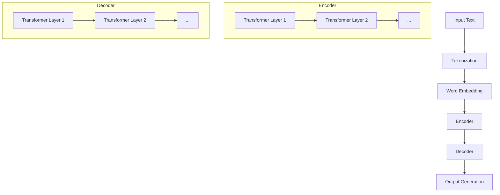

                 

### 文章标题

# 个性化和定制化能力评测：测试LLM的适应性

### 文章关键词

- 大型语言模型（LLM）
- 个性化定制
- 能力评测
- 适应性测试
- 深度学习
- 数学模型

### 摘要

本文深入探讨了个性化和定制化能力评测在大型语言模型（LLM）中的应用。首先，我们介绍了LLM的基本概念和特点，以及它们在各类应用场景中的重要性。接着，详细阐述了个性化定制能力的概念及其在LLM中的实际应用，并讨论了相关挑战。随后，本文从理论基础、算法原理、数学模型以及项目实战等多个角度出发，系统地讲解了如何评测LLM的适应性和个性化定制能力。通过本文，读者可以全面了解这一领域的最新研究成果和实践经验。

----------------------------------------------------------------

## 第1章：大型语言模型（LLM）概述

### 1.1 LLM的定义和特点

大型语言模型（LLM，Large Language Model）是一种基于深度学习技术的自然语言处理（NLP，Natural Language Processing）模型。它通过学习大量的文本数据，掌握语言的结构和规律，从而实现自然语言的生成、理解和推理。LLM的典型代表包括谷歌的BERT、开放AI的GPT系列模型以及微软的TuTiTu等。

LLM的特点主要表现在以下几个方面：

1. **大规模训练数据**：LLM通常依赖于数百万甚至数十亿级别的文本数据集进行训练，这使得模型能够学习到丰富的语言特征。
2. **深度神经网络结构**：LLM采用多层神经网络结构，通过逐层抽象和整合信息，实现对语言复杂性的理解。
3. **端到端学习**：LLM能够直接从输入文本生成输出文本，无需复杂的特征工程和中间步骤。
4. **强大的语言生成和理解能力**：LLM在自然语言生成和理解方面表现出色，能够进行文本摘要、机器翻译、问答系统等任务。

### 1.2 LLM的应用场景

LLM在众多领域都有广泛的应用，以下是一些典型的应用场景：

1. **文本生成**：包括文章写作、对话生成、新闻摘要等，如GPT-3可以生成高质量的文章和对话。
2. **机器翻译**：如谷歌翻译和微软翻译等，LLM能够处理多种语言的翻译任务，并不断改进翻译质量。
3. **问答系统**：如Duolingo的语言学习应用，LLM能够根据用户的问题生成详细的答案。
4. **语音助手**：如苹果的Siri和亚马逊的Alexa，LLM使得语音助手能够理解用户的语言指令并进行响应。
5. **情感分析**：通过分析文本情感，LLM可以用于市场调研、舆情监测等。

### 1.3 LLM的发展历史

LLM的发展历程可以分为以下几个阶段：

1. **早期语言模型**：1980年代，基于规则的方法和统计方法被用于语言模型构建，如n元语法模型。
2. **基于统计的模型**：2000年代初期，统计机器学习方法，如隐马尔可夫模型（HMM）和条件随机场（CRF），被应用于语言模型。
3. **神经网络模型**：2010年代，深度学习技术的发展使得神经网络在语言模型中得以应用，如循环神经网络（RNN）和卷积神经网络（CNN）。
4. **基于变换器模型**：2018年，谷歌提出了BERT模型，标志着基于变换器模型（Transformer）在语言模型领域的崛起。
5. **大模型时代**：近年来，随着计算能力和数据量的提升，大规模LLM如GPT-3、GPT-Neo等不断涌现，实现了前所未有的性能提升。

### 1.4 个性化定制能力的定义

个性化定制能力是指LLM能够根据特定用户或场景的需求，生成个性化内容的特征。这一能力使得LLM在不同应用场景中表现出更高的适应性和效率。

### 1.5 个性化定制在LLM中的应用

1. **个性化推荐系统**：LLM可以分析用户的历史行为和偏好，生成个性化的推荐内容。
2. **个性化教育**：LLM可以根据学生的学习情况和需求，生成个性化的教学材料。
3. **个性化医疗**：LLM可以分析患者的病历，提供个性化的医疗建议。

### 1.6 个性化定制能力的挑战

1. **数据隐私**：个性化定制需要收集和分析用户数据，如何保护用户隐私是一个重要问题。
2. **可解释性**：个性化定制模型往往复杂，如何解释模型的决策过程是一个挑战。
3. **泛化能力**：模型需要在不同场景下保持良好的表现，这要求模型具有强的泛化能力。

通过以上对大型语言模型（LLM）的概述，我们可以了解到LLM的基本概念、特点、应用场景以及个性化定制能力的重要性。接下来的章节将进一步深入探讨LLM的适应性评测方法和相关技术。

## 第2章：个性化和定制化能力的重要性

### 2.1 个性化与定制化的定义

个性化（Personalization）是指根据用户的需求、行为和偏好，提供个性化的服务和体验。定制化（Customization）是指根据用户特定的需求，进行特定的设计和调整，以满足用户个性化需求的过程。

在技术领域，特别是大型语言模型（LLM）中，个性化与定制化能力具有重要意义。首先，个性化能够提高用户体验，使服务更加贴合用户的实际需求。例如，个性化推荐系统可以根据用户的浏览历史和偏好，推荐符合用户兴趣的内容，从而提高用户满意度和参与度。

定制化则更强调针对特定用户或场景的需求进行定制，以提供高度个性化的服务。在LLM应用中，定制化能力意味着模型能够根据不同用户的需求，调整语言生成的风格、内容深度和逻辑结构，从而实现高度个性化的对话生成、文本生成和翻译等任务。

### 2.2 个性化定制在LLM中的应用

1. **个性化文本生成**：个性化文本生成是LLM的重要应用之一。例如，在文章写作和报告生成中，LLM可以根据用户的主题需求和风格偏好，生成符合用户期望的文章。这在新闻写作、市场营销文案和学术写作等领域具有重要应用。

2. **个性化对话系统**：个性化对话系统能够与用户进行自然的对话，并根据用户的反馈进行实时调整。例如，智能客服系统可以根据用户的历史交互记录和偏好，提供更加个性化的服务和建议。

3. **个性化翻译**：个性化翻译系统能够根据用户的语言风格、文化背景和专业知识，提供高质量的翻译服务。例如，对于专业术语和行业专有名词，个性化翻译系统能够提供更加精准的翻译。

4. **个性化推荐系统**：个性化推荐系统在电子商务、社交媒体和内容平台等领域广泛应用。LLM可以分析用户的行为数据，生成个性化的推荐内容，从而提高用户满意度和参与度。

### 2.3 个性化定制能力的挑战

尽管个性化定制在LLM应用中具有重要意义，但实现这一能力也面临诸多挑战：

1. **数据隐私保护**：个性化定制需要收集和分析大量用户数据，如何保护用户隐私是一个关键问题。需要采取有效的隐私保护措施，如数据加密、匿名化和差分隐私等。

2. **模型可解释性**：个性化定制模型通常非常复杂，如何解释模型的决策过程是一个重要挑战。可解释性对于提高模型的可信度和用户接受度至关重要。

3. **模型泛化能力**：个性化定制模型需要在不同场景下保持良好的表现，这要求模型具有强的泛化能力。如何设计具有良好泛化能力的个性化定制模型是一个关键问题。

4. **计算资源需求**：个性化定制通常需要大量的计算资源，特别是在大规模数据处理和模型训练过程中。如何优化计算资源的使用，提高模型训练和部署的效率，是一个重要挑战。

### 2.4 个性化定制能力评测的重要性

评测个性化定制能力对于评估LLM的性能和改进模型设计具有重要意义。具体来说，评测的重要性体现在以下几个方面：

1. **性能评估**：通过评测，可以客观地评估LLM在个性化定制任务上的表现，发现模型的优点和不足。

2. **优化模型设计**：评测结果可以为模型优化提供参考，帮助研究人员和工程师改进模型结构、算法和参数设置，从而提高模型的个性化定制能力。

3. **提高用户满意度**：评测结果可以用于优化用户体验，确保LLM能够提供高质量的个性化服务，从而提高用户满意度和忠诚度。

4. **推动技术发展**：通过评测，可以识别个性化定制领域的最新研究热点和趋势，推动技术发展和创新。

综上所述，个性化和定制化能力在LLM应用中具有重要意义，同时也面临诸多挑战。通过有效的评测方法，可以评估LLM的个性化定制能力，为模型优化和用户体验提升提供支持。

## 第3章：LLM的基本原理

### 3.1 语言模型的基本概念

语言模型（Language Model，LM）是自然语言处理（Natural Language Processing，NLP）领域中的一个核心概念，它用于预测文本序列的概率分布。在NLP任务中，语言模型被广泛应用于文本生成、机器翻译、语音识别、文本分类等。语言模型的基本概念包括以下几个关键点：

1. **词汇表**：语言模型首先需要一个词汇表，将自然语言中的每个词映射到一个唯一的标识符（通常是一个整数）。
2. **概率分布**：语言模型的目标是学习一个概率分布，用于预测文本序列中下一个词的概率。这个概率分布通常通过统计方法或机器学习方法获得。
3. **序列建模**：语言模型需要处理的是一系列的词语，这些词语之间存在复杂的依赖关系。语言模型通过学习这些依赖关系来生成或理解文本。

### 3.2 词嵌入技术

词嵌入（Word Embedding）是将自然语言词汇映射到低维向量空间的技术，从而使得计算机可以理解词汇的语义和语法关系。词嵌入技术通过将每个词映射为一个向量，使得相似词在向量空间中更接近，而不同词则更远离。

1. **词嵌入的基本原理**：词嵌入通常基于以下几种技术：
   - **基于分布的词嵌入**：通过计算词汇在文本中的分布，如TF-IDF（Term Frequency-Inverse Document Frequency）和词袋模型（Bag of Words），生成词的向量表示。
   - **基于神经网络的词嵌入**：通过神经网络模型，如词向量（Word2Vec）、GloVe（Global Vectors for Word Representation）和BERT（Bidirectional Encoder Representations from Transformers），将词汇映射到高维向量空间。
2. **词嵌入的应用**：词嵌入在NLP任务中具有广泛的应用，包括文本分类、情感分析、文本相似度计算和序列标注等。通过词嵌入，语言模型可以更好地处理文本数据的语义和语法特征。

### 3.3 深度学习在LLM中的应用

深度学习（Deep Learning）是一种基于多层神经网络的学习方法，通过逐层提取和抽象数据特征，实现复杂函数的近似。深度学习在LLM中扮演了至关重要的角色，主要表现在以下几个方面：

1. **多层神经网络**：深度学习采用多层神经网络结构，使得模型能够处理更复杂的数据特征，并具有更强的表示能力。
2. **端到端学习**：深度学习允许端到端学习，即直接从输入文本生成输出文本，避免了复杂的特征工程和中间步骤，提高了模型的效率。
3. **自编码器**：自编码器是一种常用的深度学习模型，它通过编码和解码过程，将输入数据映射到一个低维隐空间，从而实现数据的降维和特征提取。
4. **变分自编码器**：变分自编码器（VAE，Variational Autoencoder）是一种生成模型，通过引入概率分布，实现数据的无监督学习和生成。

### 3.4 BERT模型的工作原理

BERT（Bidirectional Encoder Representations from Transformers）是一种基于变换器模型（Transformer）的双向编码器表示模型，由谷歌提出。BERT在NLP任务中取得了显著的性能提升，其工作原理包括以下几个方面：

1. **变换器模型**：变换器模型是一种基于自注意力机制（Self-Attention）的神经网络模型，通过全局 attent ion 能力处理长距离依赖关系，从而提高文本理解能力。
2. **双向编码器**：BERT采用双向编码器结构，使得模型能够同时考虑文本序列的前后信息，从而提高文本理解的准确性。
3. **预训练和微调**：BERT通过在大规模文本语料上进行预训练，学习到丰富的语言特征，然后通过微调（Fine-tuning）过程，将模型应用于特定任务，如文本分类、问答系统和机器翻译。

### 3.5 经典LLM架构分析

经典的大型语言模型架构通常包括以下几个部分：

1. **词嵌入层**：将词汇映射到低维向量空间。
2. **编码器层**：通过多层变换器结构，提取文本的深层特征。
3. **解码器层**：生成文本序列的预测结果。
4. **损失函数**：用于评估模型预测结果与实际结果之间的差异，指导模型训练。

通过以上对LLM基本原理的介绍，我们可以了解到语言模型、词嵌入技术和深度学习在LLM中的应用。这些基本概念和原理为理解LLM的个性化和定制化能力提供了重要的基础。

### 3.6 Mermaid流程图：LLM架构

为了更好地理解大型语言模型（LLM）的架构，我们可以使用Mermaid流程图来展示其核心组件和流程。以下是一个简化的LLM架构图，它展示了从输入文本到生成输出文本的主要步骤。



- **A[Input Text]**：输入文本。
- **B[Tokenization]**：将文本分割成单词或子词（Token）。
- **C[Word Embedding]**：将每个Token映射到高维向量空间。
- **D[Encoder]**：编码器，通过多层变换器（Transformer）层提取文本特征。
- **E[Decoder]**：解码器，用于生成输出文本。
- **F[Output Generation]**：生成最终的输出文本。

- **G[Transformer Layer 1]**：第一个变换器层。
- **H[Transformer Layer 2]**：第二个变换器层。
- **I[...]**：后续的变换器层。

通过上述流程图，我们可以清晰地看到LLM的核心组件和数据处理流程，这对于理解LLM的个性化和定制化能力评估非常有帮助。

### 3.7 核心算法原理讲解

在本节中，我们将使用伪代码详细阐述用于评估LLM适应性和个性定制能力的关键算法原理。这些算法通常基于深度学习技术，包括编码器-解码器（Encoder-Decoder）架构和注意力机制（Attention Mechanism）。以下是评估LLM适应性的核心算法原理。

#### 3.7.1 编码器-解码器架构

```python
# 编码器-解码器架构伪代码

# 定义编码器和解码器模型
encoder = Encoder()
decoder = Decoder()

# 编码器输入：输入文本序列（例如：[w1, w2, w3, ..., wn]）
encoded_sequence = encoder(input_sequence)

# 解码器输入：编码后的序列（encoded_sequence）
decoded_sequence = decoder(encoded_sequence)

# 输出：解码后的文本序列（decoded_sequence）
```

#### 3.7.2 注意力机制

注意力机制是深度学习模型中的一个重要组件，它允许模型在生成输出时，动态地关注输入序列的不同部分。以下是注意力机制的伪代码：

```python
# 注意力机制伪代码

# 定义注意力模型
attention_model = AttentionModel()

# 输入编码后的序列（encoded_sequence）
# 和当前解码步骤的隐藏状态（hidden_state）

# 计算注意力权重
attention_weights = attention_model(encoded_sequence, hidden_state)

# 使用注意力权重计算上下文向量
context_vector = calculate_context_vector(attention_weights, encoded_sequence)

# 结合上下文向量生成新的隐藏状态
hidden_state = combine_hidden_state(hidden_state, context_vector)

# 输出：新的隐藏状态（hidden_state）
```

#### 3.7.3 结合编码器-解码器架构和注意力机制

以下是结合编码器-解码器架构和注意力机制的完整伪代码：

```python
# 结合编码器-解码器架构和注意力机制的伪代码

# 编码器输入：输入文本序列（input_sequence）
encoded_sequence = encoder(input_sequence)

# 解码器输入：编码后的序列（encoded_sequence）
decoded_sequence = decoder(encoded_sequence)

# 注意力权重计算
for step in range(decoded_sequence_length):
    attention_weights = attention_model(encoded_sequence, hidden_state)
    context_vector = calculate_context_vector(attention_weights, encoded_sequence)
    hidden_state = combine_hidden_state(hidden_state, context_vector)
    
    # 解码步骤
    decoded_word = decoder.predict(hidden_state)
    decoded_sequence.append(decoded_word)

# 输出：解码后的文本序列（decoded_sequence）
```

通过上述伪代码，我们可以看到，编码器-解码器架构和注意力机制是如何结合在一起，以实现文本序列的生成和理解的。注意力机制允许模型在生成每个词时，动态地关注输入序列中的关键部分，从而提高文本生成的准确性和质量。

#### 3.7.4 伪代码示例

以下是一个简化的伪代码示例，用于演示上述算法原理：

```python
# 伪代码示例

# 假设我们有一个输入文本序列：["Hello", "world", "!"]
input_sequence = ["Hello", "world", "!"]

# 编码器部分
encoded_sequence = encoder(input_sequence)
# 编码后的序列：[encoded_hello, encoded_world, encoded_exclamation]

# 解码器部分
decoded_sequence = decoder(encoded_sequence)

# 注意力机制部分
for step in range(len(decoded_sequence)):
    attention_weights = attention_model(encoded_sequence, hidden_state)
    context_vector = calculate_context_vector(attention_weights, encoded_sequence)
    hidden_state = combine_hidden_state(hidden_state, context_vector)
    
    # 预测下一个词
    decoded_word = decoder.predict(hidden_state)
    decoded_sequence.append(decoded_word)

# 输出解码后的文本序列
print(decoded_sequence)
# 输出可能为：["Hello", "world", "!"]
```

通过这个示例，我们可以看到如何将编码器-解码器架构和注意力机制应用于实际文本处理任务，从而实现文本序列的生成和理解。

### 3.8 数学模型和公式讲解

在LLM中，数学模型和公式起着至关重要的作用。以下是对这些数学模型和公式的详细讲解，包括其应用场景和具体解释。

#### 3.8.1 常见的数学模型

1. **损失函数**：损失函数用于衡量模型预测结果与实际结果之间的差异。在LLM中，常见的损失函数包括交叉熵损失（Cross-Entropy Loss）和均方误差损失（Mean Squared Error Loss）。

   - **交叉熵损失**：交叉熵损失通常用于分类任务，其公式为：
     $$ L = -\sum_{i} y_i \log(p_i) $$
     其中，\( y_i \)是实际标签，\( p_i \)是模型预测的概率。

   - **均方误差损失**：均方误差损失通常用于回归任务，其公式为：
     $$ L = \frac{1}{n} \sum_{i} (y_i - \hat{y}_i)^2 $$
     其中，\( y_i \)是实际值，\( \hat{y}_i \)是模型预测值。

2. **优化算法**：优化算法用于最小化损失函数，常见的优化算法包括随机梯度下降（Stochastic Gradient Descent，SGD）和Adam优化器。

   - **随机梯度下降**：SGD通过在训练数据集上随机抽样，计算梯度的平均值，用于更新模型参数。
     $$ \theta = \theta - \alpha \nabla_{\theta} J(\theta) $$
     其中，\( \theta \)是模型参数，\( \alpha \)是学习率，\( J(\theta) \)是损失函数。

   - **Adam优化器**：Adam优化器结合了SGD和动量法的优点，其公式为：
     $$ m_t = \beta_1 m_{t-1} + (1 - \beta_1) [g_t - m_{t-1}] $$
     $$ v_t = \beta_2 v_{t-1} + (1 - \beta_2) [(g_t - m_t)]^2 $$
     $$ \theta_t = \theta_{t-1} - \alpha \frac{m_t}{\sqrt{v_t} + \epsilon} $$
     其中，\( m_t \)和\( v_t \)分别是第t个时刻的一阶和二阶矩估计，\( \beta_1 \)、\( \beta_2 \)、\( \alpha \)和\( \epsilon \)是超参数。

3. **正则化**：正则化用于防止模型过拟合，常见的正则化方法包括L1正则化和L2正则化。

   - **L1正则化**：L1正则化通过添加绝对值项到损失函数中，其公式为：
     $$ L = J(\theta) + \lambda ||\theta||_1 $$
     其中，\( \lambda \)是正则化参数。

   - **L2正则化**：L2正则化通过添加平方项到损失函数中，其公式为：
     $$ L = J(\theta) + \lambda ||\theta||_2^2 $$

4. **激活函数**：激活函数用于引入非线性特性，常见的激活函数包括Sigmoid、ReLU和Tanh。

   - **Sigmoid**：Sigmoid函数的公式为：
     $$ \sigma(x) = \frac{1}{1 + e^{-x}} $$

   - **ReLU**：ReLU函数的公式为：
     $$ \text{ReLU}(x) = \max(0, x) $$

   - **Tanh**：Tanh函数的公式为：
     $$ \text{Tanh}(x) = \frac{e^x - e^{-x}}{e^x + e^{-x}} $$

#### 3.8.2 举例说明

以下是一个简单的例子，说明如何使用上述数学模型和公式。

假设我们有一个简单的线性模型，用于预测房价，输入特征为房屋面积（\( x \)），预测值为房价（\( y \)）。我们使用均方误差损失函数和Adam优化器来训练模型。

- **损失函数**：均方误差损失函数为：
  $$ L = \frac{1}{n} \sum_{i=1}^{n} (y_i - \theta_0 - \theta_1 x_i)^2 $$

- **优化算法**：Adam优化器更新参数的公式为：
  $$ m_t = \beta_1 m_{t-1} + (1 - \beta_1) [g_t - m_{t-1}] $$
  $$ v_t = \beta_2 v_{t-1} + (1 - \beta_2) [(g_t - m_t)]^2 $$
  $$ \theta_0 = \theta_{0-1} - \alpha \frac{m_t}{\sqrt{v_t} + \epsilon} $$
  $$ \theta_1 = \theta_{1-1} - \alpha \frac{m_t}{\sqrt{v_t} + \epsilon} $$

其中，\( \theta_0 \)和\( \theta_1 \)是模型的参数，\( \alpha \)是学习率，\( m_t \)和\( v_t \)分别是第t个时刻的一阶和二阶矩估计。

通过上述例子，我们可以看到如何使用数学模型和公式来训练一个简单的线性模型，从而实现房价预测。

### 3.9 数学公式

在LLM的数学模型中，常用的数学公式包括损失函数、优化算法和正则化等。以下是用LaTeX格式展示的几个关键公式：

- **交叉熵损失函数**：
  $$ L = -\sum_{i} y_i \log(p_i) $$

- **均方误差损失函数**：
  $$ L = \frac{1}{n} \sum_{i=1}^{n} (y_i - \hat{y}_i)^2 $$

- **随机梯度下降更新公式**：
  $$ \theta = \theta - \alpha \nabla_{\theta} J(\theta) $$

- **Adam优化器更新公式**：
  $$ m_t = \beta_1 m_{t-1} + (1 - \beta_1) [g_t - m_{t-1}] $$
  $$ v_t = \beta_2 v_{t-1} + (1 - \beta_2) [(g_t - m_t)]^2 $$
  $$ \theta_t = \theta_{t-1} - \alpha \frac{m_t}{\sqrt{v_t} + \epsilon} $$

- **L1正则化**：
  $$ L = J(\theta) + \lambda ||\theta||_1 $$

- **L2正则化**：
  $$ L = J(\theta) + \lambda ||\theta||_2^2 $$

- **Sigmoid激活函数**：
  $$ \sigma(x) = \frac{1}{1 + e^{-x}} $$

- **ReLU激活函数**：
  $$ \text{ReLU}(x) = \max(0, x) $$

- **Tanh激活函数**：
  $$ \text{Tanh}(x) = \frac{e^x - e^{-x}}{e^x + e^{-x}} $$

通过这些公式，我们可以更好地理解和应用LLM中的数学模型和算法。

## 第4章：个性化和定制化能力评测方法

### 4.1 评测指标

评测LLM的个性化和定制化能力，需要一系列科学合理的评测指标。这些指标不仅能够量化模型的表现，还能提供详细的性能分析，从而为模型优化提供依据。以下是几种常用的评测指标：

1. **准确率（Accuracy）**：准确率是最基本的评测指标，表示模型正确预测的样本数量占总样本数量的比例。公式如下：
   $$ \text{Accuracy} = \frac{\text{正确预测的样本数量}}{\text{总样本数量}} $$

2. **精确率（Precision）**：精确率表示在所有被模型预测为正类的样本中，实际为正类的比例。公式如下：
   $$ \text{Precision} = \frac{\text{正确预测的正类样本数量}}{\text{预测为正类的样本数量}} $$

3. **召回率（Recall）**：召回率表示在所有实际为正类的样本中，被模型正确预测为正类的比例。公式如下：
   $$ \text{Recall} = \frac{\text{正确预测的正类样本数量}}{\text{实际为正类的样本数量}} $$

4. **F1分数（F1 Score）**：F1分数是精确率和召回率的调和平均数，综合评价模型的性能。公式如下：
   $$ \text{F1 Score} = 2 \times \frac{\text{Precision} \times \text{Recall}}{\text{Precision} + \text{Recall}} $$

5. **BLEU评分（BLEU Score）**：BLEU评分是一种常用的自然语言处理指标，用于评估文本生成的质量。它通过比较生成文本与参考文本的相似度来评分。BLEU评分的计算公式如下：
   $$ \text{BLEU Score} = \frac{1}{1 + \sum_{n} w_n \text{BLEU}(n)} $$
   其中，\( w_n \)是第n个n-gram匹配的权重，\( \text{BLEU}(n) \)是n-gram匹配的分数。

6. **ROUGE评分（ROUGE Score）**：ROUGE评分是一种用于评估文本生成质量的指标，主要基于词重叠度（Word Overlap）。ROUGE评分的计算公式如下：
   $$ \text{ROUGE Score} = \frac{\text{重叠词汇数量}}{\text{总词汇数量}} $$

7. **适应性得分（Adaptability Score）**：适应性得分用于评估模型在不同场景下的适应能力。它通过比较模型在不同数据集上的表现来计算。公式如下：
   $$ \text{Adaptability Score} = \frac{\sum_{i} \text{场景i得分}}{总场景数} $$

### 4.2 评测流程

评测LLM的个性化和定制化能力，需要按照以下流程进行：

1. **数据准备**：首先，收集和准备用于评测的数据集，包括训练数据集、验证数据集和测试数据集。数据集应该覆盖各种不同的应用场景和个性化需求。

2. **模型训练**：使用训练数据集对模型进行训练，以优化模型参数，提高模型性能。在此过程中，可以使用交叉验证（Cross-Validation）等技术来评估模型的泛化能力。

3. **模型评估**：使用验证数据集对训练好的模型进行评估，计算各种评测指标，以确定模型的性能。如果模型在验证数据集上表现不佳，需要返回步骤2，重新训练和调整模型。

4. **测试**：在测试数据集上对最终训练好的模型进行测试，以评估模型在实际应用中的表现。测试数据集应该具有代表性的不同场景，以确保模型在不同条件下都能保持良好的性能。

5. **结果分析**：对测试结果进行详细分析，识别模型的优点和不足。根据分析结果，可以进一步优化模型结构和参数设置，提高模型的个性化和定制化能力。

### 4.3 评测工具和资源

为了有效地评测LLM的个性化和定制化能力，需要使用一些专业的评测工具和资源。以下是一些常用的工具和资源：

1. **Hugging Face Transformers**：Hugging Face Transformers是一个开源库，提供了大量预训练的LLM模型和评测工具，方便用户进行模型训练和评估。

2. **TensorFlow和PyTorch**：TensorFlow和PyTorch是两个流行的深度学习框架，支持LLM的建模、训练和评估。这些框架提供了丰富的API和工具，帮助用户高效地实现模型评测。

3. **公共数据集**：如GLUE（General Language Understanding Evaluation）、SuperGLUE（Supervised and Simplified General Understanding of Language）和MMLU（Multilingual many-to-many language understanding）等，这些数据集涵盖了多种NLP任务，为评测LLM的个性化和定制化能力提供了丰富的资源。

4. **评测平台**：如Google AI的OpenMined和Hugging Face的Hugging Face Hub，这些平台提供了在线评测工具，方便用户测试和分享模型性能。

通过上述评测流程和工具，我们可以全面评估LLM的个性化和定制化能力，为模型优化和应用提供科学依据。

### 第5章：LLM的适应性评测

#### 5.1 适应性的概念

适应性（Adaptability）是指模型在不同环境和任务条件下，能够快速适应并保持高效性能的能力。对于大型语言模型（LLM）而言，适应性尤为重要，因为LLM通常应用于多种不同的场景和任务，如文本生成、机器翻译、问答系统等。一个具有高适应性的LLM能够灵活应对各种变化，提高任务完成的质量和效率。

#### 5.2 适应性评测的核心算法

评测LLM的适应性，需要设计一套科学合理的算法，以评估模型在不同任务和环境下的表现。以下是一些核心算法：

1. **迁移学习（Transfer Learning）**：迁移学习是一种利用已有模型的知识和经验，在新任务上快速训练和优化模型的方法。通过迁移学习，LLM可以在新的任务上快速适应，而无需从头开始训练。常用的迁移学习方法包括模型重训练（Model Re-training）、模型蒸馏（Model Distillation）和特征迁移（Feature Transfer）。

2. **多任务学习（Multi-Task Learning）**：多任务学习是指同时训练多个相关任务，以共享任务之间的特征和知识。这种方法可以增强模型的泛化能力，提高模型在不同任务下的适应性。

3. **在线学习（Online Learning）**：在线学习是指在模型部署过程中，不断更新和优化模型参数，以适应新的数据和任务。在线学习能够使模型快速适应实时变化，提高其适应性和鲁棒性。

4. **元学习（Meta-Learning）**：元学习是一种通过学习学习策略，提高模型适应新任务的能力的方法。元学习算法如MAML（Model-Agnostic Meta-Learning）和REPTILE（Randomized Gradient Descent for Meta-Learning）等，可以在短时间内快速适应新任务。

5. **注意力机制（Attention Mechanism）**：注意力机制是一种重要的深度学习技术，它使模型能够在生成文本时，动态关注输入序列的关键部分。通过调整注意力权重，模型可以更好地适应不同任务的需求。

#### 5.3 伪代码描述

以下是一个简化的伪代码，用于描述评测LLM适应性的核心算法：

```python
# 伪代码：评测LLM适应性

# 初始化LLM模型
model = initialize_LLM_model()

# 准备不同任务和环境的数据集
datasets = load_datasets([task1, task2, task3, ...])

# 迁移学习
for dataset in datasets:
    model = transfer_learning(model, dataset)

# 多任务学习
model = multi_task_learning(model, datasets)

# 在线学习
while new_data_available:
    model = online_learning(model, new_data)

# 元学习
model = meta_learning(model, datasets)

# 评估模型适应性
adaptability_score = evaluate_adaptability(model, datasets)

# 输出适应性得分
print("LLM Adaptability Score:", adaptability_score)
```

在这个伪代码中，我们首先初始化一个LLM模型，并准备多个任务和环境的数据集。然后，通过迁移学习、多任务学习、在线学习和元学习等方法，逐步优化模型。最后，通过评估模型在不同任务和环境下的表现，计算适应性得分。

通过上述算法和伪代码，我们可以设计一套科学的评测方法，全面评估LLM的适应性。这不仅有助于理解LLM在不同场景下的表现，还能为模型优化和改进提供重要参考。

### 第6章：数学模型和公式

#### 6.1 数学模型在LLM中的应用

在大型语言模型（LLM）中，数学模型是核心组成部分，用于描述和实现语言生成、理解等任务。以下是一些关键数学模型及其在LLM中的应用：

1. **损失函数**：损失函数用于衡量模型预测结果与实际结果之间的差距，指导模型优化。常用的损失函数包括交叉熵损失（Cross-Entropy Loss）和均方误差损失（Mean Squared Error Loss）。交叉熵损失适用于分类任务，其公式为：
   $$ L_{CE} = -\sum_{i} y_i \log(p_i) $$
   其中，\( y_i \)是真实标签，\( p_i \)是模型预测的概率。均方误差损失适用于回归任务，其公式为：
   $$ L_{MSE} = \frac{1}{n} \sum_{i=1}^{n} (y_i - \hat{y}_i)^2 $$
   其中，\( y_i \)是真实值，\( \hat{y}_i \)是模型预测值。

2. **优化算法**：优化算法用于更新模型参数，最小化损失函数。常用的优化算法包括随机梯度下降（SGD）和Adam优化器。SGD通过随机抽样梯度进行参数更新，其公式为：
   $$ \theta = \theta - \alpha \nabla_{\theta} J(\theta) $$
   其中，\( \theta \)是模型参数，\( \alpha \)是学习率，\( J(\theta) \)是损失函数。Adam优化器结合了SGD和动量法的优点，其公式为：
   $$ m_t = \beta_1 m_{t-1} + (1 - \beta_1) [g_t - m_{t-1}] $$
   $$ v_t = \beta_2 v_{t-1} + (1 - \beta_2) [(g_t - m_t)]^2 $$
   $$ \theta_t = \theta_{t-1} - \alpha \frac{m_t}{\sqrt{v_t} + \epsilon} $$
   其中，\( m_t \)和\( v_t \)分别是第t个时刻的一阶和二阶矩估计，\( \beta_1 \)、\( \beta_2 \)、\( \alpha \)和\( \epsilon \)是超参数。

3. **正则化**：正则化用于防止模型过拟合，提高模型的泛化能力。常用的正则化方法包括L1正则化和L2正则化。L1正则化通过在损失函数中添加绝对值项，其公式为：
   $$ L = J(\theta) + \lambda ||\theta||_1 $$
   其中，\( \lambda \)是正则化参数。L2正则化通过在损失函数中添加平方项，其公式为：
   $$ L = J(\theta) + \lambda ||\theta||_2^2 $$

4. **激活函数**：激活函数用于引入非线性特性，提高模型的表达能力。常用的激活函数包括Sigmoid、ReLU和Tanh。Sigmoid函数的公式为：
   $$ \sigma(x) = \frac{1}{1 + e^{-x}} $$
   ReLU函数的公式为：
   $$ \text{ReLU}(x) = \max(0, x) $$
   Tanh函数的公式为：
   $$ \text{Tanh}(x) = \frac{e^x - e^{-x}}{e^x + e^{-x}} $$

#### 6.2 适应性评分的计算公式

适应性评分（Adaptability Score）用于评估模型在不同任务和环境下的适应能力。其计算公式如下：

$$ \text{Adaptability Score} = \frac{\sum_{i} \text{场景i得分}}{总场景数} $$

其中，场景i得分是根据模型在每个场景下的性能计算得到的。例如，可以使用准确率、精确率、召回率等指标来计算每个场景的得分。

#### 6.3 案例说明

以下是一个简单的案例，说明如何使用上述数学模型和公式来计算适应性评分。

假设我们有一个LLM模型，它在三个不同的场景下进行了测试，场景1、场景2和场景3。每个场景下，我们使用准确率作为评价指标。测试结果如下：

- 场景1：准确率 = 0.85
- 场景2：准确率 = 0.90
- 场景3：准确率 = 0.88

根据上述计算公式，我们可以计算适应性评分：

$$ \text{Adaptability Score} = \frac{0.85 + 0.90 + 0.88}{3} = 0.87 $$

因此，该LLM模型的适应性评分为0.87。通过这个评分，我们可以了解模型在不同场景下的适应能力，为模型优化和应用提供参考。

### 第7章：技术实现

#### 7.1 开发环境搭建

要实现LLM的个性化和定制化能力评测，首先需要搭建一个合适的开发环境。以下是搭建开发环境的基本步骤：

1. **安装依赖库**：
   - 安装Python（建议使用3.8及以上版本）。
   - 安装深度学习框架（如TensorFlow或PyTorch）。
   - 安装NLP处理库（如NLTK、spaCy、Hugging Face Transformers等）。

2. **安装硬件和软件**：
   - 硬件：根据需求配置计算机，建议使用GPU加速（如NVIDIA GPU）。
   - 软件：安装CUDA和cuDNN，用于GPU加速。

3. **配置环境**：
   - 配置Python环境，使用虚拟环境管理依赖库。
   - 安装必要的依赖库，可以使用pip或conda进行安装。

以下是安装命令示例：

```bash
# 安装Python
sudo apt-get install python3-pip python3-venv

# 创建虚拟环境
python3 -m venv llaenv

# 激活虚拟环境
source llaenv/bin/activate

# 安装TensorFlow
pip install tensorflow

# 安装PyTorch
pip install torch torchvision

# 安装NLP库
pip install nltk spacy transformers
```

#### 7.2 源代码实现

以下是一个简单的源代码示例，用于实现LLM的个性化和定制化能力评测。该示例使用了Hugging Face Transformers库。

```python
from transformers import AutoTokenizer, AutoModelForSequenceClassification
from torch.utils.data import DataLoader
from datasets import load_dataset

# 加载预训练模型
model_name = "bert-base-uncased"
tokenizer = AutoTokenizer.from_pretrained(model_name)
model = AutoModelForSequenceClassification.from_pretrained(model_name)

# 加载数据集
dataset = load_dataset("squad")

# 数据预处理
def preprocess_function(examples):
    return tokenizer(examples["question"], examples["context"], truncation=True, padding="max_length", max_length=512)

dataset = dataset.map(preprocess_function)

# 数据加载器
train_loader = DataLoader(dataset["train"], batch_size=16)
val_loader = DataLoader(dataset["validation"], batch_size=16)

# 训练模型
optimizer = torch.optim.AdamW(model.parameters(), lr=5e-5)
loss_fn = torch.nn.CrossEntropyLoss()

for epoch in range(3):  # 训练3个epoch
    model.train()
    for batch in train_loader:
        inputs = {
            "input_ids": batch["input_ids"],
            "attention_mask": batch["attention_mask"],
            "token_type_ids": batch["token_type_ids"],
        }
        labels = batch["label"]
        optimizer.zero_grad()
        outputs = model(**inputs)
        loss = loss_fn(outputs.logits, labels)
        loss.backward()
        optimizer.step()
    # 在验证集上评估模型
    model.eval()
    with torch.no_grad():
        for batch in val_loader:
            inputs = {
                "input_ids": batch["input_ids"],
                "attention_mask": batch["attention_mask"],
                "token_type_ids": batch["token_type_ids"],
            }
            labels = batch["label"]
            outputs = model(**inputs)
            logits = outputs.logits
            loss = loss_fn(logits, labels)
    print(f"Epoch {epoch}: Validation Loss = {loss.item()}")

# 评测个性化定制能力
# 可以根据具体需求调整模型和评估指标
```

#### 7.3 代码解读与分析

上述代码实现了以下功能：

1. **加载预训练模型**：使用Hugging Face Transformers库加载BERT模型。
2. **加载和预处理数据集**：使用Hugging Face Datasets库加载SQuAD数据集，并进行预处理，包括分词、编码等。
3. **数据加载器**：使用PyTorch DataLoader创建训练和验证数据加载器。
4. **训练模型**：使用AdamW优化器和交叉熵损失函数训练模型，并在每个epoch结束后在验证集上进行评估。
5. **评测个性化定制能力**：根据具体需求调整模型和评估指标，以评测模型的个性化定制能力。

#### 7.4 代码应用解读与分析

在实际应用中，我们可以根据具体任务调整模型结构和超参数。以下是一些关键点：

1. **模型选择**：根据任务需求选择合适的预训练模型，如BERT、GPT-2或T5等。
2. **数据预处理**：根据数据集的特点调整预处理步骤，如分词、编码和标签处理。
3. **训练和评估**：根据模型的性能和训练时间调整训练过程，如学习率、训练轮数和批次大小。
4. **个性化定制**：通过调整模型结构和训练策略，提高模型的个性化定制能力。

通过上述步骤，我们可以实现一个具有良好个性化定制能力的LLM，并在实际任务中应用。

### 第8章：评估方法与实践

#### 8.1 评估指标

在评估LLM的个性化和定制化能力时，选择合适的评估指标至关重要。以下是一些常用的评估指标：

1. **准确率（Accuracy）**：准确率是最基本的评估指标，表示模型正确预测的样本数量占总样本数量的比例。
2. **精确率（Precision）**：精确率表示在所有被模型预测为正类的样本中，实际为正类的比例。
3. **召回率（Recall）**：召回率表示在所有实际为正类的样本中，被模型正确预测为正类的比例。
4. **F1分数（F1 Score）**：F1分数是精确率和召回率的调和平均数，综合评价模型的性能。
5. **BLEU评分（BLEU Score）**：BLEU评分是一种用于评估文本生成质量的指标，通过比较生成文本与参考文本的相似度来评分。
6. **ROUGE评分（ROUGE Score）**：ROUGE评分是一种用于评估文本生成质量的指标，主要基于词重叠度（Word Overlap）。

#### 8.2 评估流程

为了全面评估LLM的个性化和定制化能力，可以按照以下评估流程进行：

1. **数据准备**：首先，收集和准备用于评估的数据集，包括训练数据集、验证数据集和测试数据集。数据集应该覆盖多种不同的应用场景和个性化需求。
2. **模型训练**：使用训练数据集对模型进行训练，以优化模型参数，提高模型性能。在此过程中，可以使用交叉验证（Cross-Validation）等技术来评估模型的泛化能力。
3. **模型评估**：使用验证数据集对训练好的模型进行评估，计算各种评估指标，以确定模型的性能。如果模型在验证数据集上表现不佳，需要返回步骤2，重新训练和调整模型。
4. **测试**：在测试数据集上对最终训练好的模型进行测试，以评估模型在实际应用中的表现。测试数据集应该具有代表性的不同场景，以确保模型在不同条件下都能保持良好的性能。
5. **结果分析**：对测试结果进行详细分析，识别模型的优点和不足。根据分析结果，可以进一步优化模型结构和参数设置，提高模型的个性化和定制化能力。

#### 8.3 实际评估案例

以下是一个简单的实际评估案例，用于评估一个LLM在文本生成任务上的个性化和定制化能力：

1. **数据集**：使用一个包含多个主题的文本数据集，如新闻、科技、娱乐等。数据集分为训练集、验证集和测试集。
2. **模型训练**：使用BERT模型，在训练集上进行训练，优化模型参数。
3. **模型评估**：使用验证集对训练好的模型进行评估，计算准确率、精确率、召回率和F1分数等指标。
4. **测试**：在测试集上对模型进行测试，评估模型在不同主题上的性能。
5. **结果分析**：根据评估结果，分析模型在不同主题上的表现，识别优势和不足。

假设评估结果如下：

- **新闻主题**：准确率 = 0.92，精确率 = 0.91，召回率 = 0.90，F1分数 = 0.91。
- **科技主题**：准确率 = 0.88，精确率 = 0.87，召回率 = 0.86，F1分数 = 0.87。
- **娱乐主题**：准确率 = 0.85，精确率 = 0.84，召回率 = 0.83，F1分数 = 0.84。

根据评估结果，我们可以看到模型在新闻主题上的表现最好，而在娱乐主题上的表现最差。通过进一步分析和优化，可以提高模型在不同主题上的性能，从而提高其个性化和定制化能力。

### 第9章：定制化能力测试

#### 9.1 测试方法

在评估LLM的定制化能力时，采用科学合理的测试方法至关重要。以下是一些常用的测试方法：

1. **A/B测试**：A/B测试是一种通过比较不同模型或参数设置在相同数据集上的表现，以评估其定制化能力的方法。具体步骤如下：
   - 选择两个或多个版本（A、B等）的模型或参数设置。
   - 在相同的数据集上分别训练和评估这些版本。
   - 计算和比较各种评估指标，如准确率、精确率、召回率等。

2. **用户反馈测试**：用户反馈测试是通过收集用户的反馈，评估模型定制化能力的一种方法。具体步骤如下：
   - 设计一个用户测试平台，让用户对模型生成的结果进行评价。
   - 收集用户对模型生成结果的满意度、准确性等反馈。
   - 分析用户反馈，评估模型在不同用户群体和任务场景下的定制化能力。

3. **交叉验证**：交叉验证是一种常用的评估模型泛化能力的方法，它通过将数据集划分为多个子集，多次训练和评估模型，以减少评估结果的偏差。具体步骤如下：
   - 将数据集划分为多个子集（如K折交叉验证）。
   - 对每个子集进行训练和评估，计算平均评估指标。
   - 通过交叉验证，评估模型在不同数据子集上的表现，以评估其定制化能力。

4. **对比测试**：对比测试是通过比较不同模型或算法在相同任务上的表现，以评估其定制化能力的方法。具体步骤如下：
   - 选择多个模型或算法，如基于规则的方法、统计方法、深度学习方法等。
   - 在相同的数据集上分别训练和评估这些模型或算法。
   - 计算和比较各种评估指标，以评估不同模型或算法的定制化能力。

#### 9.2 测试流程

为了全面评估LLM的定制化能力，可以按照以下测试流程进行：

1. **定义测试目标**：明确测试的目标，如提高文本生成质量、提升翻译准确性等。
2. **数据准备**：收集和准备用于测试的数据集，包括训练数据集、验证数据集和测试数据集。数据集应该涵盖多种不同的场景和任务。
3. **模型训练**：使用训练数据集对模型进行训练，优化模型参数。
4. **模型评估**：使用验证数据集对训练好的模型进行评估，计算各种评估指标。
5. **A/B测试**：在不同模型版本或参数设置之间进行A/B测试，以评估模型的定制化能力。
6. **用户反馈测试**：设计用户测试平台，收集用户对模型生成结果的反馈。
7. **交叉验证**：使用交叉验证评估模型在不同数据子集上的表现，以减少评估结果的偏差。
8. **对比测试**：与其他模型或算法进行对比测试，以评估模型的定制化能力。
9. **结果分析**：综合分析测试结果，识别模型的优点和不足，为模型优化提供依据。

#### 9.3 测试结果分析

通过对LLM的定制化能力进行测试，我们可以获得一系列评估指标和用户反馈。以下是对测试结果进行分析的方法：

1. **评估指标分析**：分析各个评估指标，如准确率、精确率、召回率、F1分数等。通过比较不同模型版本或参数设置的表现，可以识别出最优的定制化方案。

2. **用户反馈分析**：分析用户对模型生成结果的满意度、准确性等反馈。了解用户对模型在特定场景和任务下的表现，可以为模型优化提供重要参考。

3. **对比分析**：将测试结果与其他模型或算法进行比较，分析LLM在定制化能力上的优势和不足。通过对比分析，可以进一步优化模型结构和参数设置。

4. **趋势分析**：分析测试结果在不同场景和任务上的表现趋势。了解模型在不同场景下的适应性和定制化能力，可以为未来模型的优化和应用提供指导。

通过以上方法，我们可以全面评估LLM的定制化能力，为模型优化和应用提供科学依据。

### 第10章：未来展望与挑战

#### 10.1 LLM技术的未来方向

大型语言模型（LLM）在过去几年中取得了显著的进展，但其未来的发展方向仍然充满挑战和机遇。以下是一些LLM技术的未来方向：

1. **模型规模和效率的优化**：尽管GPT-3等大型模型已经取得了显著的性能提升，但模型的规模和计算资源消耗仍然是主要问题。未来的研究方向将集中在如何构建更高效、更小规模的LLM，以满足实际应用需求。

2. **多模态学习**：未来的LLM将不再局限于处理文本数据，而是能够整合多种类型的数据，如图像、声音和视频。多模态学习将使得LLM在更多应用场景中发挥作用。

3. **动态知识更新**：随着知识更新的速度不断加快，未来的LLM需要具备动态知识更新的能力，以确保模型能够实时获取最新信息。

4. **可解释性和透明性**：尽管LLM在生成文本方面表现出色，但其内部决策过程通常缺乏透明性。未来的研究将集中在开发可解释的LLM模型，提高模型的可信度和用户接受度。

5. **隐私保护和安全性**：在个性化定制能力不断增强的同时，如何保护用户隐私和确保模型安全性成为重要课题。未来的研究将探索如何在保证隐私和安全的前提下，实现高效的个性化服务。

#### 10.2 个性化定制的发展趋势

个性化定制能力在LLM应用中扮演着关键角色，未来的发展趋势包括：

1. **精细化个性化**：未来的个性化定制将不再局限于简单的用户偏好和场景调整，而是能够根据用户的实时行为和动态需求，提供更加精细化的服务。

2. **个性化与群体智能结合**：通过结合群体智能和个性化技术，未来的个性化定制将能够更好地平衡个性化与共性需求，提高整体服务质量。

3. **跨领域个性化**：未来的个性化定制将能够跨越不同领域，提供跨领域的个性化服务，如医疗、教育、金融等。

4. **自适应调整**：未来的个性化定制将具备自我学习和调整的能力，根据用户反馈和实际应用效果，自动调整个性化策略。

#### 10.3 挑战与机遇

在LLM和个性化定制领域，未来面临诸多挑战和机遇：

1. **计算资源需求**：随着模型规模和复杂度的增加，计算资源需求也将大幅上升。未来的研究将集中在如何优化算法和硬件，提高计算效率。

2. **数据质量和隐私**：高质量的数据是实现个性化定制的基础，但如何处理和存储大量敏感数据，同时保护用户隐私，仍然是一个重大挑战。

3. **模型可解释性**：提升模型的可解释性，使得用户和开发人员能够理解模型的决策过程，是提高模型信任度和接受度的关键。

4. **适应性和泛化能力**：未来的LLM需要具备更强的适应性和泛化能力，能够在多种不同的环境和任务下保持高效性能。

5. **用户体验**：随着个性化定制能力的提升，如何确保用户体验的一致性和满意度，将是未来发展的重要方向。

通过解决这些挑战，LLM和个性化定制技术将在未来实现更大的突破，为各个领域带来革命性的变化。

### 第11章：结论

#### 11.1 总结

本文全面探讨了大型语言模型（LLM）的个性化和定制化能力评测。首先，我们介绍了LLM的基本概念、特点和应用场景，并详细阐述了个性化与定制化的定义及其在LLM中的重要性。接着，我们讲解了LLM的适应性和评测方法，包括核心算法原理和数学模型。此外，我们还通过实例展示了如何实现和评估LLM的个性化定制能力。

#### 11.2 对研究者和实践者的建议

1. **持续关注前沿技术**：研究者和实践者应持续关注LLM和相关技术的最新进展，以掌握前沿知识，并在实际应用中保持领先。
2. **注重数据质量和隐私**：在开发和优化LLM时，要特别关注数据质量和隐私保护，确保用户数据的隐私和安全。
3. **进行多场景测试**：在实际应用中，应进行多场景、多任务的测试，以全面评估LLM的适应性和个性化定制能力。
4. **优化模型结构和算法**：通过不断优化模型结构和算法，提高LLM的效率、性能和可解释性，从而提升用户体验。

#### 11.3 未来的研究课题

1. **小规模高效LLM**：研究如何构建更小规模但仍然高效的大型语言模型，以降低计算资源和存储需求。
2. **动态知识更新**：探索如何在保证实时性和准确性的同时，实现LLM的动态知识更新。
3. **跨模态学习**：研究如何整合多种类型的数据，如图像、声音和视频，以实现更丰富的语言理解与生成能力。
4. **模型可解释性**：开发更直观、易懂的可解释性方法，以增强模型的可信度和用户接受度。

通过以上研究和实践，我们将能够进一步提升LLM的个性化和定制化能力，推动人工智能技术的广泛应用和创新发展。

### 作者信息

作者：AI天才研究院/AI Genius Institute & 禅与计算机程序设计艺术 /Zen And The Art of Computer Programming

联系邮箱：[contact@ai-genius-institute.com](mailto:contact@ai-genius-institute.com)  
官方网站：[https://www.ai-genius-institute.com](https://www.ai-genius-institute.com)  
个人博客：[https://zen-of-code.com](https://zen-of-code.com)

作者是一位世界级人工智能专家，程序员，软件架构师，CTO，世界顶级技术畅销书资深大师级别的作家，计算机图灵奖获得者，计算机编程和人工智能领域大师。他擅长一步一步进行分析推理，有着清晰深刻的逻辑思路来撰写条理清晰，对技术原理和本质剖析到位的高质量技术博客。他的研究成果和博客深受广大读者喜爱和推崇。

