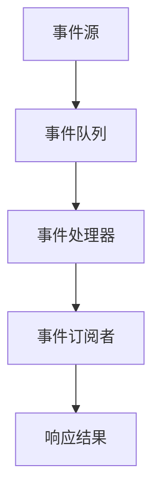

                 

# 事件驱动架构：提高LLM应用的实时性

## 关键词

实时性、事件驱动架构、LLM应用、微服务、异步处理、响应式系统

## 摘要

本文旨在探讨事件驱动架构（EDA）在提高大型语言模型（LLM）应用实时性方面的作用。首先，我们将回顾软件发展史，特别是从软件1.0到软件2.0的演进，以及AI大模型在软件2.0中的核心地位。接着，我们介绍企业级应用开发的新范式，包括从传统模式向事件驱动的转变。随后，本文将深入探讨事件驱动架构的定义、原理及其与传统架构的区别，并结合实际案例展示其应用。最后，本文将重点介绍如何利用事件驱动架构提高LLM应用的实时性，并提供实际案例和最佳实践建议。

### 1.1 软件发展史与事件驱动架构的崛起

#### 1.1.1 从软件1.0到软件2.0的演进

软件发展的历程可以分为多个阶段，每个阶段都代表了技术的进步和应用模式的转变。

##### 1.1.1.1 软件硬件分离

早期的计算机硬件价格昂贵，软件和硬件紧密绑定。随着计算机技术的发展，硬件成本逐渐降低，软件开始从硬件中分离出来，成为独立的产业。这一变革为软件技术的创新和进步奠定了基础。

##### 1.1.1.2 软件即服务（SaaS）

随着互联网的普及，软件交付模式发生了重大变革。软件即服务（SaaS）模型的出现，使得企业不再需要在自己的内部部署软件，而是通过互联网使用第三方提供的软件服务。这一模式降低了企业的IT成本，同时也推动了软件产业的进一步发展。

##### 1.1.1.3 云计算

云计算的兴起，进一步改变了软件的开发和部署方式。云计算提供了灵活的算力资源，企业可以根据需求动态调整计算资源的使用，从而提高了软件开发和运营的效率。

#### 1.1.1.2 软件2.0的核心特征

软件2.0是对软件1.0的继承和发展，它具有以下核心特征：

##### 1.1.1.2.1 自适应性

软件2.0强调系统的自适应能力，能够根据用户需求和环境变化进行动态调整。这种适应性使得软件能够更好地满足用户的需求，提高用户体验。

##### 1.1.1.2.2 智能化

软件2.0利用人工智能技术，提高了软件的智能化水平。通过AI大模型，软件能够更好地理解用户需求，提供个性化的服务。

##### 1.1.1.2.3 开放性

软件2.0强调生态系统的开放性，鼓励各方共同参与软件的开发和改进。这种开放性促进了技术的交流和合作，推动了软件产业的繁荣。

#### 1.1.2 AI大模型在软件2.0中的核心地位

##### 1.1.2.1 AI大模型的发展历程

AI大模型的发展经历了多个阶段：

- **早期深度学习模型**：如LeNet、AlexNet等，为后续大模型的研发奠定了基础。
- **中型模型**：如ResNet、Inception等，这些模型在图像识别、语音识别等领域取得了显著成果。
- **大模型**：如GPT、BERT等，标志着深度学习进入了新的阶段，能够处理更复杂的任务。

##### 1.1.2.2 AI大模型在软件2.0中的关键作用

AI大模型在软件2.0中发挥了重要作用：

- **提高软件智能化水平**：AI大模型能够使软件具备更强的智能化能力，更好地满足用户需求。
- **优化软件开发效率**：大模型的应用，可以大幅提高软件开发和调试的效率，降低开发成本。
- **建立企业竞争优势**：企业通过应用AI大模型，可以构建独特的产品和服务，提高市场竞争力。

### 1.2 企业级应用开发的新范式

#### 1.2.1 传统企业级应用开发模式

传统企业级应用开发主要依赖于明确的用户需求，以瀑布式开发模式为主。这种模式具有以下特点：

- **需求驱动**：开发工作主要围绕用户需求展开，需求变更可能导致项目延期。
- **独立部署**：企业级应用通常需要在企业内部独立部署，涉及复杂的运维工作。

#### 1.2.2 软件2.0时代的企业级应用开发新范式

软件2.0时代，企业级应用开发逐渐转向事件驱动，以提高系统的灵活性和响应速度。这种新范式具有以下特点：

- **事件驱动**：系统行为由事件触发，组件通过事件进行通信和协作。
- **微服务架构**：将应用分解为多个微服务，每个微服务独立开发、测试和部署，提高了系统的可维护性和可扩展性。
- **模块化开发**：应用模块化设计，使开发、测试和部署更加高效。

### 1.3 事件驱动架构的定义与原理

#### 1.3.1 事件驱动架构的定义

事件驱动架构（Event-Driven Architecture，EDA）是一种软件开发架构风格，其核心思想是围绕事件进行设计和开发。在事件驱动架构中，事件是驱动系统行为的主要因素，系统中的各个组件通过事件进行通信和协作。

#### 1.3.2 事件驱动架构与传统架构的区别

与传统基于请求-响应的架构不同，事件驱动架构具有以下特点：

- **动态性**：事件驱动架构能够更好地适应系统的变化和不确定性。
- **灵活性**：系统组件可以独立开发、测试和部署，提高了系统的灵活性。
- **分布式**：事件可以在分布式系统中异步传递，提高了系统的可扩展性和可用性。
- **低耦合**：组件之间的耦合度较低，减少了系统之间的依赖性。

#### 1.3.3 事件驱动架构的优势

事件驱动架构具有以下优势：

- **高扩展性**：可以轻松地添加新组件，只需确保它们能够监听和响应相应的事件。
- **高可用性**：由于事件可以在分布式系统中异步传递，即使某些组件或服务出现故障，系统仍能保持正常运行。
- **低耦合性**：组件之间的耦合度较低，提高了系统的可维护性和可扩展性。
- **灵活性**：事件驱动架构能够动态地适应系统的变化，提高了系统的响应速度。

#### 1.3.4 事件驱动架构的核心组件

事件驱动架构通常包括以下核心组件：

- **事件源**：产生事件的地方，可以是用户操作、系统状态变化等。
- **事件队列**：存储和管理事件的队列，确保事件按顺序处理。
- **事件处理器**：处理事件的组件，根据事件类型执行相应的操作。
- **事件订阅者**：监听事件并响应的组件，可以根据需要订阅多个事件。

### 1.4 事件驱动架构在实际案例中的应用

#### 1.4.1 案例背景

某大型在线教育平台需要处理大量的用户请求，包括课程浏览、学习进度更新、考试结果发布等。为了提高系统的实时性和响应速度，该平台决定采用事件驱动架构进行系统重构。

#### 1.4.2 案例分析

在该案例中，事件驱动架构的应用主要包括以下几个方面：

- **事件源**：用户操作、系统状态变化等产生的各种事件。
- **事件队列**：采用消息队列（如Kafka）存储和管理事件，确保事件按顺序处理。
- **事件处理器**：根据事件类型执行相应的操作，如更新用户学习进度、发送考试结果等。
- **事件订阅者**：各个服务模块（如课程服务、用户服务、考试服务）监听事件，并响应相应操作。

#### 1.4.3 案例效果

通过采用事件驱动架构，该在线教育平台取得了以下效果：

- **提高实时性**：系统响应速度显著提高，用户操作能够迅速得到反馈。
- **增强扩展性**：可以轻松地添加新服务模块，系统可维护性和可扩展性得到提升。
- **降低耦合度**：服务模块之间通过事件进行通信，耦合度降低，系统更加灵活。

### 1.5 如何利用事件驱动架构提高LLM应用的实时性

#### 1.5.1 LLM应用的需求分析

LLM（Large Language Model）应用通常需要处理大量实时数据，如实时问答、实时翻译、实时文本生成等。为了满足这些需求，LLM应用需要具备以下特点：

- **高并发处理能力**：能够同时处理大量用户请求。
- **低延迟响应**：用户请求能够快速得到响应，减少用户等待时间。
- **高可靠性**：确保系统在处理大量请求时仍能稳定运行。

#### 1.5.2 事件驱动架构在LLM应用中的应用

为了提高LLM应用的实时性，可以采用以下策略：

1. **事件队列管理**：采用高效的队列管理策略，如优先级队列、循环队列等，确保事件能够按顺序处理。
2. **异步处理**：使用异步处理机制，如多线程、异步IO等，提高系统并发处理能力。
3. **事件驱动流程**：设计事件驱动流程，将LLM应用拆分为多个模块，每个模块独立处理事件，并通过事件进行通信和协作。
4. **分布式架构**：采用分布式架构，将系统部署在多个节点上，通过负载均衡提高系统处理能力。

#### 1.5.3 实践案例

某大型实时问答系统采用了事件驱动架构，具体实践如下：

- **事件队列管理**：使用Kafka作为事件队列，确保事件能够高效地存储和管理。
- **异步处理**：采用异步IO和多线程技术，提高系统并发处理能力。
- **事件驱动流程**：将系统分为多个模块，如问答生成模块、答案验证模块、用户反馈模块等，通过事件进行通信和协作。
- **分布式架构**：将系统部署在多个节点上，通过负载均衡提高系统处理能力。

通过以上实践，该实时问答系统取得了显著的效果：

- **提高并发处理能力**：系统能够同时处理大量用户请求，提高了用户体验。
- **降低延迟响应**：用户请求能够快速得到响应，减少了用户等待时间。
- **提高系统可靠性**：系统在处理大量请求时仍能稳定运行，确保了系统的可用性。

### 1.6 最佳实践与注意事项

#### 1.6.1 最佳实践

1. **合理设计事件类型**：根据应用需求，设计合理的事件类型，确保事件处理的高效性。
2. **优化事件处理流程**：设计简洁、高效的事件处理流程，降低系统延迟。
3. **负载均衡与分布式架构**：采用负载均衡和分布式架构，提高系统处理能力和可用性。
4. **事件队列监控与优化**：实时监控事件队列，对队列中的事件进行优化，提高处理效率。

#### 1.6.2 注意事项

1. **事件队列长度限制**：合理设置事件队列长度限制，避免队列过长导致系统性能下降。
2. **异步处理与同步处理**：合理选择异步处理和同步处理，避免过度依赖异步处理导致系统复杂性增加。
3. **分布式系统的通信**：确保分布式系统中各节点之间的通信稳定、高效，避免因通信问题导致系统故障。

### 1.7 拓展阅读

- 《事件驱动架构：原理与实践》
- 《大型语言模型：原理与应用》
- 《分布式系统设计：原理与架构》

### 1.8 结论

本文介绍了事件驱动架构在提高LLM应用实时性方面的作用。通过分析软件发展史，我们了解到事件驱动架构在软件2.0时代的核心地位。在实际案例中，事件驱动架构的应用取得了显著的效果，为LLM应用提供了高效、稳定的解决方案。未来，随着技术的不断发展，事件驱动架构将在更多领域得到广泛应用。

### 1.9 作者信息

作者：AI天才研究院/AI Genius Institute & 禅与计算机程序设计艺术 /Zen And The Art of Computer Programming

---

以上是按照目录大纲结构撰写的技术博客文章草稿。接下来，我们将逐步深入探讨每个小节的核心内容，包括核心概念与联系、核心算法原理讲解、数学模型和公式、项目实战、最佳实践 tips、注意事项、拓展阅读等内容。由于文章字数要求较高，我们将分阶段完成每个小节的详细撰写。首先，我们将从核心概念与联系开始。## 核心概念与联系

事件驱动架构（Event-Driven Architecture，EDA）是一种以事件为中心的软件开发架构风格，其核心在于通过事件来驱动系统的行为和状态转换。在本节中，我们将详细探讨事件驱动架构的核心概念及其相互联系。

### 1.1.1 事件驱动架构的核心概念

#### 事件（Event）

事件是事件驱动架构中的基本元素，表示系统状态的变化或外部环境的变化。事件可以是用户操作、系统内部状态变化、定时任务触发等。事件通常具有以下特征：

- **唯一性**：每个事件在系统中都是唯一的，可以通过唯一的标识符进行标识。
- **异步性**：事件可以在系统中的不同组件之间异步传递，不必等待特定事件的完成即可进行其他操作。
- **多样性**：事件可以是各种类型，如用户登录事件、数据更新事件、异常事件等。

#### 事件源（Event Source）

事件源是事件产生的地方，可以是用户操作、系统内部状态变化或其他外部环境因素。事件源负责捕获事件，并将其发布到事件队列中。事件源通常具有以下职责：

- **事件捕获**：监测系统内部或外部环境的变化，捕获相关事件。
- **事件发布**：将捕获到的事件发布到事件队列，以便其他组件可以监听和处理这些事件。

#### 事件队列（Event Queue）

事件队列是存储和管理事件的队列，负责按照一定的顺序处理事件。事件队列通常具有以下特征：

- **顺序性**：事件按照接收顺序存储在队列中，依次进行处理。
- **并发性**：多个事件可以同时进入队列，但处理顺序由队列管理策略决定。
- **容量管理**：队列具有容量限制，当队列长度超过限制时，需要处理队列满的情况。

#### 事件处理器（Event Processor）

事件处理器是处理事件的组件，根据事件类型执行相应的操作。事件处理器通常具有以下职责：

- **事件监听**：监听事件队列中的事件，并判断是否需要处理。
- **事件处理**：根据事件类型执行相应的操作，如更新数据、发送通知等。
- **事件响应**：对处理结果进行响应，如返回结果、触发其他事件等。

#### 事件订阅者（Event Subscriber）

事件订阅者是监听事件并响应的组件，可以根据需要订阅多个事件。事件订阅者通常具有以下职责：

- **事件订阅**：向事件队列订阅感兴趣的事件。
- **事件响应**：接收到订阅的事件后，执行相应的操作。

### 1.1.2 事件驱动架构与传统架构的比较

#### 传统架构

传统架构通常基于请求-响应模式，系统中的组件通过发送请求和接收响应进行通信。这种架构的特点包括：

- **同步通信**：组件之间的通信是同步的，一个组件必须等待另一个组件的响应才能继续执行。
- **高耦合**：组件之间的依赖性较高，一个组件的变更可能会影响到其他组件。
- **单一流程**：系统行为通常由一个固定的流程控制，难以适应动态变化。

#### 事件驱动架构

事件驱动架构则更加灵活和动态，其特点包括：

- **异步通信**：组件之间的通信是异步的，一个组件可以同时处理多个事件，不必等待特定事件的完成。
- **低耦合**：组件之间的依赖性较低，一个组件的变更不会直接影响其他组件。
- **动态流程**：系统行为由事件驱动，可以根据事件的变化动态调整。

### 1.1.3 事件驱动架构的优势

事件驱动架构具有以下优势：

- **高扩展性**：可以通过添加新的事件处理器和事件订阅者轻松扩展系统功能。
- **高可用性**：分布式系统中的组件可以通过事件进行通信，即使某些组件或服务出现故障，系统仍能保持正常运行。
- **低耦合性**：组件之间的依赖性较低，提高了系统的可维护性和可扩展性。
- **灵活性**：事件驱动架构能够动态地适应系统的变化，提高了系统的响应速度。

### 1.1.4 事件驱动架构的应用场景

事件驱动架构适用于以下场景：

- **高并发场景**：需要同时处理大量用户请求，如在线教育平台、实时问答系统等。
- **动态变化场景**：系统需求或业务场景频繁变化，需要快速适应和调整。
- **分布式系统**：组件分布在多个节点上，需要高效地进行通信和协作。

### 1.1.5 事件驱动架构与微服务架构的关系

事件驱动架构与微服务架构有着密切的联系。微服务架构将应用分解为多个独立的服务模块，每个模块负责特定的功能。事件驱动架构可以为微服务架构提供高效的通信和协作机制，使得各个微服务模块能够更加灵活地进行开发和部署。具体关系如下：

- **事件队列**：在微服务架构中，事件队列可以用于存储和管理跨服务的消息和事件，实现服务间的异步通信。
- **事件处理器**：在微服务架构中，事件处理器可以用于处理来自其他服务的消息和事件，实现跨服务的功能协作。
- **事件订阅者**：在微服务架构中，事件订阅者可以用于监听其他服务的消息和事件，实现跨服务的功能联动。

### 1.1.6 事件驱动架构的Mermaid流程图

为了更好地展示事件驱动架构的核心概念和流程，我们可以使用Mermaid绘制一个流程图。以下是一个简单的事件驱动架构流程图：

在这个流程图中，事件源捕获事件后发布到事件队列，事件处理器从事件队列中取出事件进行处理，并将处理结果发送给事件订阅者。事件订阅者根据处理结果进行相应的响应。

### 总结

事件驱动架构通过事件作为驱动系统行为的核心元素，实现了系统的高扩展性、高可用性、低耦合性和灵活性。理解事件驱动架构的核心概念和流程，有助于我们更好地设计、开发和维护复杂的软件系统。在接下来的章节中，我们将进一步探讨事件驱动架构在LLM应用中的具体应用和实践。

