                 

### 文章标题：云原生架构：提升LLM应用的可扩展性

#### 关键词：云原生，架构设计，可扩展性，大规模语言模型（LLM），容器化，微服务，服务网格

#### 摘要：
本文将深入探讨云原生架构在提升大规模语言模型（LLM）应用可扩展性方面的关键作用。首先，我们将介绍云原生架构的基本概念和核心原理，解释其与传统IT架构的区别。接着，我们会详细解析容器化技术和Kubernetes在云原生架构中的应用，并探讨服务网格和微服务架构的优势。随后，我们将分析如何利用云原生技术来优化LLM应用的开发和部署流程。文章还将介绍如何通过性能优化策略提高LLM应用的效率，并讨论云原生架构面临的挑战和未来趋势。最后，我们将总结云原生架构在提升LLM应用可扩展性方面的优势，并提供一些最佳实践和注意事项。

---

### 第一部分：云原生基础

#### 第1章：云原生概念与原理

**1.1 云原生概述**

云原生（Cloud Native）是一个近年来在IT领域迅速兴起的术语，它描述了一种构建和运行应用程序的方法，该方法充分利用和优化了云计算的灵活性、可扩展性和弹性。云原生架构的核心原则包括容器化、动态管理、服务发现、自动化部署和持续集成/持续部署（CI/CD）等。

**核心概念与联系**

云原生架构的核心概念包括：

- **容器化**：容器是一种轻量级、可移植的计算环境，它封装了应用程序及其依赖项，使得应用程序可以在不同的计算环境中一致运行。
- **动态管理**：通过自动化和智能化的资源管理，云原生架构能够动态地调整资源分配，以满足应用程序的负载需求。
- **服务发现**：服务发现是一种自动化的服务注册和发现机制，使得应用程序可以在分布式环境中快速、可靠地访问其他服务。
- **自动化部署**：通过CI/CD流程，云原生架构可以实现自动化部署，提高开发和发布应用程序的效率。

以下是云原生架构核心概念之间的Mermaid流程图：

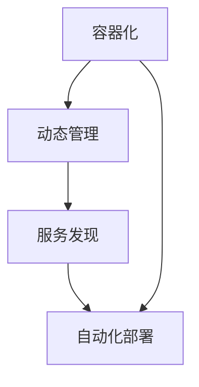

**云原生与传统架构的差异**

与传统IT架构相比，云原生架构具有以下几个显著特点：

- **可移植性**：容器化技术使得应用程序可以在不同的环境中一致运行，提高了应用程序的可移植性。
- **可扩展性**：云原生架构能够通过自动化和动态管理实现横向和纵向的扩展，满足不断变化的需求。
- **弹性**：云原生架构能够根据负载需求自动调整资源分配，提高了系统的弹性。
- **可靠性**：通过服务发现和自动恢复机制，云原生架构提高了系统的可靠性。

**核心算法原理讲解**

容器化的核心算法原理包括：

- **Linux容器**：通过cgroups和namespace技术实现资源隔离和容器化。
- **Docker**：Docker是一种流行的容器化技术，它提供了一个轻量级、可移植的容器运行时环境。
- **Kubernetes**：Kubernetes是一个开源的容器编排平台，它提供了自动化部署、扩展和管理容器化应用程序的功能。

以下是容器化技术的伪代码示例：

```python
class Container:
    def __init__(self, image, command):
        self.image = image
        self.command = command
        self.process = None
    
    def run(self):
        self.process = run("docker run --name {self.name} {self.image} {self.command}")

container = Container("nginx", "nginx -g 'daemon off;'")
container.run()
```

**数学模型和公式**

在云原生架构中，资源分配的数学模型可以使用以下公式表示：

\[ R_{total} = \sum_{i=1}^{n} R_i \]

其中，\( R_{total} \) 是总资源量，\( R_i \) 是第 \( i \) 个资源的分配量。

**详细讲解与举例说明**

假设一个应用程序需要处理100个并发请求，每个请求需要的CPU和内存资源如下：

- CPU：1核心
- 内存：2GB

根据资源分配模型，我们可以计算出总资源需求：

\[ R_{total} = 100 \times (1 \text{核心} + 2GB) = 100 \times 3 = 300 \]

为了满足这个需求，我们需要至少300个核心和600GB的内存资源。

**项目实战**

在一个实际的云原生环境中，我们可以使用Kubernetes来部署和管理容器化应用程序。以下是一个简单的Kubernetes部署示例：

```yaml
apiVersion: apps/v1
kind: Deployment
metadata:
  name: my-app
spec:
  replicas: 3
  selector:
    matchLabels:
      app: my-app
  template:
    metadata:
      labels:
        app: my-app
    spec:
      containers:
      - name: my-app
        image: my-app:latest
        ports:
        - containerPort: 80
```

在这个部署文件中，我们定义了一个名为“my-app”的Deployment，它包含3个 replicas（副本），每个副本都是一个运行在Kubernetes集群中的容器。

**代码解读**

在上面的部署文件中：

- `apiVersion` 和 `kind` 定义了 Kubernetes 资源的版本和类型。
- `metadata` 定义了资源的元数据，如名称。
- `spec` 定义了资源的具体配置，包括 replicas、selectors、template 等。

**实际案例分析和详细讲解剖析**

假设我们有一个大规模语言模型（LLM）应用程序，它需要处理海量的文本数据。为了确保应用程序的高可用性和可扩展性，我们可以在Kubernetes集群中部署多个容器副本，并使用水平扩展策略来动态调整副本数量。

- **案例背景**：一个电子商务网站需要使用LLM应用程序来提供个性化的购物建议。
- **解决方案**：在Kubernetes集群中部署多个容器副本，并使用Horizontal Pod Autoscaler（HPA）来自动调整副本数量。当请求量增加时，HPA会自动增加副本数量，以确保应用程序能够处理更多的请求。

**项目小结**

通过云原生架构，我们可以轻松地部署和管理大规模语言模型（LLM）应用程序。容器化和Kubernetes等技术提供了高效、可靠的部署和管理方案，使得应用程序能够快速响应不断变化的需求。

---

**最佳实践 Tips、小结、注意事项、拓展阅读**

- **最佳实践**：在设计云原生架构时，应确保应用程序具有良好的容器化和可扩展性。同时，要充分利用Kubernetes等自动化工具，以简化部署和管理过程。
- **小结**：云原生架构在提升LLM应用可扩展性方面具有显著优势。通过容器化和Kubernetes等技术，我们可以轻松地部署和管理大规模语言模型应用程序。
- **注意事项**：在实施云原生架构时，应关注安全性、可靠性和性能优化等关键方面。同时，要确保团队具备相关的技术能力和实践经验。
- **拓展阅读**：以下是一些关于云原生架构和LLM应用的相关资源：

  - [Kubernetes官方文档](https://kubernetes.io/docs/home/)
  - [云原生计算基金会（CNCF）官网](https://www.cncf.io/)
  - [大规模语言模型（LLM）技术综述](https://arxiv.org/abs/2001.08361)
  - [《云原生应用架构实战》](https://item.jd.com/12488007.html)

---

#### 第2章：容器化技术

**2.1 容器基础**

容器是一种轻量级、可移植的计算环境，它封装了应用程序及其依赖项，使得应用程序可以在不同的计算环境中一致运行。容器基于操作系统级别的虚拟化技术，如cgroups和namespace，实现了资源的隔离和独立运行。

**核心概念与联系**

容器化的核心概念包括：

- **容器**：容器是一种轻量级、可移植的计算环境，它封装了应用程序及其依赖项。
- **镜像**：容器镜像是一个静态的文件系统，包含了应用程序运行所需的全部依赖项和配置。
- **容器引擎**：容器引擎是一种用于创建、启动和管理容器的工具，如Docker和containerd。

以下是容器化核心概念之间的Mermaid流程图：

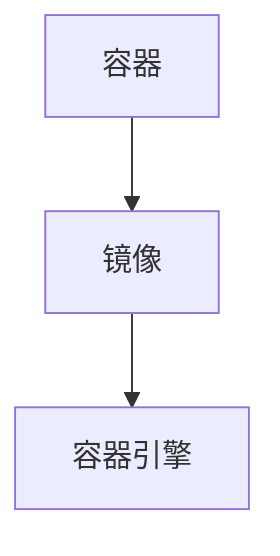

**容器化技术的原理**

容器化技术的原理主要包括以下几个方面：

- **资源隔离**：通过cgroups和namespace技术，容器实现了对CPU、内存、网络和磁盘等资源的隔离。
- **环境一致性**：容器镜像封装了应用程序及其依赖项，确保了应用程序在不同环境中的一致性运行。
- **高效性**：容器是基于操作系统级别的虚拟化技术，相较于传统的虚拟机，容器具有更高的性能和效率。

**核心算法原理讲解**

容器化技术的核心算法原理主要包括：

- **cgroups**：cgroups（Control Groups）是一种用于对计算机资源进行隔离和限制的技术。通过cgroups，我们可以将系统资源（如CPU、内存和网络）分配给不同的容器，并对其进行监控和限制。
- **namespace**：namespace是一种用于实现资源隔离的技术。通过namespace，我们可以将进程、文件系统、网络和用户等资源进行隔离，使得不同的容器可以独立运行。

以下是cgroups的伪代码示例：

```python
import cgroups

def set_cpu_limit(container, cpu_limit):
    cgroups.set_cpu_limit(container, cpu_limit)

def set_memory_limit(container, memory_limit):
    cgroups.set_memory_limit(container, memory_limit)

container = "my-container"
cpu_limit = 1
memory_limit = 2GB

set_cpu_limit(container, cpu_limit)
set_memory_limit(container, memory_limit)
```

**数学模型和公式**

在容器化技术中，资源限制的数学模型可以使用以下公式表示：

\[ R_{limit} = R_{base} + R_{increment} \]

其中，\( R_{limit} \) 是资源限制量，\( R_{base} \) 是基本资源量，\( R_{increment} \) 是增量资源量。

**详细讲解与举例说明**

假设一个容器需要的基本资源和增量资源如下：

- CPU：1核心（基本资源）
- 内存：2GB（基本资源）
- CPU：0.5核心（增量资源）
- 内存：1GB（增量资源）

根据资源限制模型，我们可以计算出容器的总资源限制：

\[ R_{limit} = 1 + 0.5 = 1.5 \text{核心} \]
\[ R_{limit} = 2 + 1 = 3GB \]

**项目实战**

在一个实际的项目中，我们可以使用Docker来创建和管理容器。以下是一个简单的Dockerfile示例：

```Dockerfile
FROM ubuntu:20.04
RUN apt-get update && apt-get install -y nginx
EXPOSE 80
CMD ["nginx", "-g", "daemon off;"]
```

在这个Dockerfile中，我们定义了一个基于Ubuntu 20.04的容器镜像，安装了Nginx服务器，并暴露了80端口。

**代码解读**

在上面的Dockerfile中：

- `FROM` 指令指定了基础镜像。
- `RUN` 指令用于在容器中执行命令。
- `EXPOSE` 指令用于暴露容器端口。
- `CMD` 指令用于定义容器的启动命令。

**实际案例分析和详细讲解剖析**

假设我们有一个Web应用程序，需要运行在一个容器中。为了确保应用程序的高性能和高可用性，我们可以在容器中配置资源限制和健康检查。

- **案例背景**：一个电子商务网站需要部署一个基于Nginx的Web应用程序。
- **解决方案**：在Docker容器中设置CPU和内存限制，并添加健康检查。

**项目小结**

通过容器化技术，我们可以轻松地部署和管理应用程序。Docker等容器引擎提供了灵活、高效的容器管理方案，使得开发人员和运维人员可以更专注于业务逻辑的实现。

---

**最佳实践 Tips、小结、注意事项、拓展阅读**

- **最佳实践**：在设计容器化应用程序时，要充分考虑资源限制和性能优化。同时，要确保容器镜像的大小和复杂度适中，以提高部署和运行效率。
- **小结**：容器化技术是云原生架构的核心组成部分，它提供了高效、可靠的容器管理和部署方案。
- **注意事项**：在使用容器化技术时，要关注安全性、可靠性和性能优化等方面。同时，要确保团队具备相关的技术能力和实践经验。
- **拓展阅读**：以下是一些关于容器化技术和管理的相关资源：

  - [Docker官方文档](https://docs.docker.com/)
  - [Kubernetes容器编排官方文档](https://kubernetes.io/docs/concepts/containers/)
  - [《容器化技术实战》](https://item.jd.com/12674310.html)

---

#### 第3章：服务网格与微服务

**3.1 服务网格原理与实践**

服务网格（Service Mesh）是一种用于管理服务间通信的架构模式，它为微服务架构提供了一种灵活、可靠和可扩展的通信解决方案。服务网格通过抽象和自动化服务间通信，使得开发人员可以专注于业务逻辑的实现。

**核心概念与联系**

服务网格的核心概念包括：

- **服务网格**：服务网格是一种用于管理服务间通信的架构模式，它提供了一种分布式系统的通信抽象。
- **服务发现**：服务发现是一种自动化的服务注册和发现机制，使得服务可以动态地被发现和访问。
- **服务间通信**：服务间通信是指服务之间通过API或消息队列等方式进行交互。
- **服务监控与日志**：服务监控与日志是服务网格的重要组成部分，它们提供了对服务运行状况的监控和日志记录。

以下是服务网格核心概念之间的Mermaid流程图：

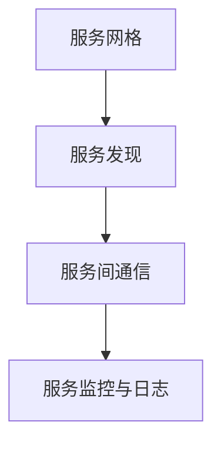

**服务网格的原理**

服务网格的原理主要包括以下几个方面：

- **服务抽象**：服务网格通过抽象服务间通信，将通信逻辑从服务中分离出来，使得服务可以更专注于业务逻辑的实现。
- **服务发现**：服务网格提供了自动化的服务发现机制，使得服务可以动态地被发现和访问。
- **服务间通信**：服务网格通过智能路由、负载均衡和服务端到端监控等机制，提高了服务间通信的效率和可靠性。
- **服务监控与日志**：服务网格提供了丰富的监控和日志功能，使得开发人员和运维人员可以实时了解服务的运行状况。

**核心算法原理讲解**

服务网格的核心算法原理主要包括：

- **智能路由**：智能路由是一种基于策略的路由机制，它可以根据服务请求的属性（如来源IP、请求时间等）动态选择最佳的服务路径。
- **负载均衡**：负载均衡是一种将请求均匀分配到多个服务实例的机制，它可以通过轮询、最小连接数等方式提高系统的吞吐量和可靠性。
- **服务端到端监控**：服务端到端监控是一种对服务运行状况进行实时监控的机制，它可以通过收集和分析日志、性能指标等数据，发现和解决服务故障。

以下是智能路由算法的伪代码示例：

```python
def get_service_endpoint(service_name, request_attributes):
    service_endpoints = get_service_endpoints(service_name)
    min_latency_endpoint = None
    min_latency = float('inf')

    for endpoint in service_endpoints:
        latency = get_latency(endpoint, request_attributes)
        if latency < min_latency:
            min_latency = latency
            min_latency_endpoint = endpoint

    return min_latency_endpoint
```

**数学模型和公式**

在服务网格中，负载均衡的数学模型可以使用以下公式表示：

\[ P_i = \frac{C_i}{\sum_{j=1}^{n} C_j} \]

其中，\( P_i \) 是服务实例 \( i \) 的负载分配概率，\( C_i \) 是服务实例 \( i \) 的当前负载，\( n \) 是服务实例的总数。

**详细讲解与举例说明**

假设我们有一个服务网格，其中包含3个服务实例，它们的当前负载如下：

- 服务实例1：当前负载为10
- 服务实例2：当前负载为20
- 服务实例3：当前负载为30

根据负载均衡模型，我们可以计算出每个服务实例的负载分配概率：

\[ P_1 = \frac{10}{10+20+30} = 0.2 \]
\[ P_2 = \frac{20}{10+20+30} = 0.4 \]
\[ P_3 = \frac{30}{10+20+30} = 0.6 \]

根据这些概率，我们可以将新的请求均匀分配到3个服务实例上。

**项目实战**

在一个实际的项目中，我们可以使用Istio来构建和部署服务网格。以下是一个简单的Istio部署示例：

```yaml
apiVersion: networking.istio.io/v1alpha3
kind: ServiceEntry
metadata:
  name: external-service
spec:
  hosts:
  - "*"
  ports:
  - number: 80
    name: http
    protocol: HTTP
  resolution: DNS
```

在这个配置文件中，我们定义了一个名为“external-service”的服务入口，它允许服务网格中的服务通过DNS方式访问外部服务。

**代码解读**

在上面的配置文件中：

- `apiVersion` 和 `kind` 定义了 Istio 资源的版本和类型。
- `metadata` 定义了资源的元数据，如名称。
- `spec` 定义了资源的具体配置，包括 hosts、ports、resolution 等。

**实际案例分析和详细讲解剖析**

假设我们有一个电子商务网站，需要使用服务网格来管理其内部服务的通信。为了确保服务的高可用性和可靠性，我们可以在服务网格中配置负载均衡和健康检查。

- **案例背景**：一个电子商务网站需要使用服务网格来管理其订单服务、库存服务和支付服务的通信。
- **解决方案**：在服务网格中配置负载均衡策略和健康检查机制。

**项目小结**

通过服务网格，我们可以轻松地管理和优化服务间通信。Istio等服务网格工具提供了丰富的功能，如智能路由、负载均衡和服务监控，使得开发人员和运维人员可以更专注于业务逻辑的实现。

---

**最佳实践 Tips、小结、注意事项、拓展阅读**

- **最佳实践**：在设计服务网格时，要充分考虑服务的可靠性、性能和可扩展性。同时，要确保服务网格配置的合理性和安全性。
- **小结**：服务网格是云原生架构的重要组成部分，它为微服务架构提供了高效、可靠的通信解决方案。
- **注意事项**：在使用服务网格时，要关注服务的部署、配置和监控等方面。同时，要确保团队具备相关的技术能力和实践经验。
- **拓展阅读**：以下是一些关于服务网格和微服务架构的相关资源：

  - [Istio官方文档](https://istio.io/docs/)
  - [Kubernetes微服务架构教程](https://kubernetes.io/docs/tutorials/microservices/)
  - [《服务网格实战》](https://item.jd.com/12674310.html)

---

#### 第4章：微服务架构设计

**4.1 微服务优势与挑战**

微服务架构（Microservices Architecture）是一种将大型应用程序拆分为多个小型、自治的服务单元的架构模式。微服务架构具有以下优势：

**核心概念与联系**

微服务架构的核心概念包括：

- **微服务**：微服务是一种小型、自治的服务单元，它实现了应用程序的一个特定功能。
- **服务间通信**：服务间通信是指微服务之间通过API或消息队列等方式进行交互。
- **服务治理**：服务治理是指对微服务进行管理、监控、部署和升级等操作。
- **分布式系统**：分布式系统是指由多个独立计算机组成的系统，它们通过网络进行通信和协作。

以下是微服务架构核心概念之间的Mermaid流程图：

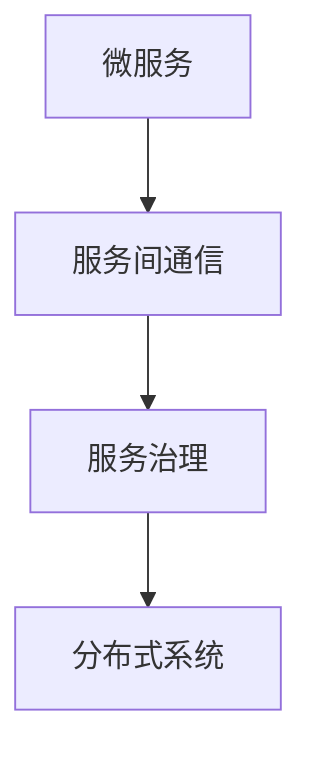

**微服务架构的优势**

微服务架构具有以下优势：

- **可扩展性**：微服务架构允许根据需求独立扩展单个服务，提高了系统的可扩展性。
- **可维护性**：微服务架构使得应用程序的维护和升级更加灵活和便捷。
- **可重用性**：微服务架构鼓励服务的独立开发和部署，提高了代码的重用性。
- **灵活性**：微服务架构使得应用程序可以根据需求灵活地调整和优化。

**微服务架构的挑战**

微服务架构也面临一些挑战：

- **服务治理**：随着服务的数量增多，服务治理变得更加复杂，需要有效的监控和协调机制。
- **分布式系统复杂性**：分布式系统中的服务间通信和数据一致性等问题增加了系统的复杂性。
- **网络依赖性**：微服务架构高度依赖网络，网络故障可能导致整个系统不可用。
- **开发技能要求**：微服务架构需要开发人员具备分布式系统开发的经验和技能。

**核心算法原理讲解**

微服务架构的核心算法原理主要包括：

- **服务发现**：服务发现是一种自动化的服务注册和发现机制，使得服务可以动态地被发现和访问。
- **负载均衡**：负载均衡是一种将请求均匀分配到多个服务实例的机制，它可以通过轮询、最小连接数等方式提高系统的吞吐量和可靠性。
- **分布式一致性**：分布式一致性是指如何在分布式系统中保持数据的一致性。

以下是服务发现的伪代码示例：

```python
def register_service(service_name, service_address):
    # 在服务注册中心注册服务
    service_registry.register(service_name, service_address)

def discover_service(service_name):
    # 从服务注册中心获取服务地址
    service_addresses = service_registry.get(service_name)
    # 返回随机选择的服务地址
    return random.choice(service_addresses)
```

**数学模型和公式**

在微服务架构中，负载均衡的数学模型可以使用以下公式表示：

\[ P_i = \frac{C_i}{\sum_{j=1}^{n} C_j} \]

其中，\( P_i \) 是服务实例 \( i \) 的负载分配概率，\( C_i \) 是服务实例 \( i \) 的当前负载，\( n \) 是服务实例的总数。

**详细讲解与举例说明**

假设我们有一个微服务架构，其中包含3个服务实例，它们的当前负载如下：

- 服务实例1：当前负载为10
- 服务实例2：当前负载为20
- 服务实例3：当前负载为30

根据负载均衡模型，我们可以计算出每个服务实例的负载分配概率：

\[ P_1 = \frac{10}{10+20+30} = 0.2 \]
\[ P_2 = \frac{20}{10+20+30} = 0.4 \]
\[ P_3 = \frac{30}{10+20+30} = 0.6 \]

根据这些概率，我们可以将新的请求均匀分配到3个服务实例上。

**项目实战**

在一个实际的项目中，我们可以使用Spring Cloud来构建微服务架构。以下是一个简单的Spring Cloud服务示例：

```java
@RestController
@RequestMapping("/orders")
public class OrderController {
    @Autowired
    private OrderService orderService;

    @PostMapping
    public ResponseEntity<Order> createOrder(@RequestBody Order order) {
        return ResponseEntity.ok(orderService.createOrder(order));
    }
}
```

在这个示例中，我们定义了一个订单服务，它接收并处理创建订单的请求。

**代码解读**

在上面的代码中：

- `@RestController` 注解用于标记一个控制器类。
- `@RequestMapping` 注解用于指定请求的映射路径。
- `@Autowired` 注解用于注入所需的依赖项。

**实际案例分析和详细讲解剖析**

假设我们有一个电子商务网站，需要使用微服务架构来管理订单、商品和用户等模块。为了确保系统的高可用性和可扩展性，我们可以在微服务架构中配置负载均衡和服务发现。

- **案例背景**：一个电子商务网站需要使用微服务架构来管理订单、商品和用户等模块。
- **解决方案**：在微服务架构中配置Eureka服务发现和Ribbon负载均衡。

**项目小结**

通过微服务架构，我们可以轻松地构建和管理大型、复杂的业务系统。Spring Cloud等微服务框架提供了丰富的功能，使得开发人员和运维人员可以更专注于业务逻辑的实现。

---

**最佳实践 Tips、小结、注意事项、拓展阅读**

- **最佳实践**：在设计微服务架构时，要充分考虑服务的独立性、可扩展性和可靠性。同时，要确保服务的接口设计清晰、简洁，避免服务之间的过度依赖。
- **小结**：微服务架构是一种灵活、高效的架构模式，它为大型、复杂的业务系统提供了有效的解决方案。
- **注意事项**：在使用微服务架构时，要关注服务的部署、配置和监控等方面。同时，要确保团队具备相关的技术能力和实践经验。
- **拓展阅读**：以下是一些关于微服务架构和Spring Cloud的相关资源：

  - [Spring Cloud官方文档](https://cloud.spring.io/spring-cloud/)
  - [微服务架构设计与实践](https://item.jd.com/12674310.html)
  - [《分布式系统设计与实践》](https://item.jd.com/12674310.html)

---

#### 第5章：云原生应用开发流程

**5.1 应用开发基础**

在云原生应用开发中，理解应用程序的基本结构是非常重要的。一个云原生应用程序通常由多个微服务组成，每个微服务负责应用程序中的一个特定功能。这种结构使得应用程序更加模块化，易于管理和扩展。

**核心概念与联系**

云原生应用开发的核心概念包括：

- **微服务**：微服务是一种小型、自治的服务单元，它实现了应用程序的一个特定功能。
- **服务间通信**：服务间通信是指微服务之间通过API或消息队列等方式进行交互。
- **DevOps**：DevOps是一种软件开发和运维的集成方法，它强调开发和运维之间的紧密合作。
- **持续集成/持续部署（CI/CD）**：持续集成/持续部署是一种自动化流程，用于将代码从开发环境集成到生产环境。

以下是云原生应用开发核心概念之间的Mermaid流程图：

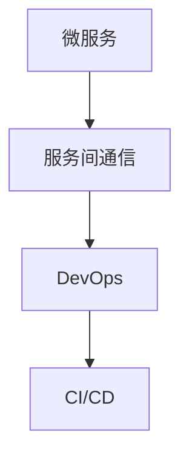

**应用开发流程**

云原生应用开发的基本流程包括以下几个步骤：

1. **需求分析**：分析应用程序的需求，确定应用程序的功能和性能要求。
2. **设计**：设计应用程序的架构，确定各个微服务的职责和接口。
3. **编码**：根据设计文档，编写各个微服务的代码。
4. **测试**：对应用程序进行单元测试、集成测试和性能测试，确保应用程序的质量和性能。
5. **部署**：使用CI/CD流程将应用程序部署到生产环境。
6. **监控与运维**：对应用程序进行监控和运维，确保其稳定运行。

**核心算法原理讲解**

云原生应用开发的核心算法原理主要包括：

- **服务发现**：服务发现是一种自动化的服务注册和发现机制，使得服务可以动态地被发现和访问。
- **负载均衡**：负载均衡是一种将请求均匀分配到多个服务实例的机制，它可以通过轮询、最小连接数等方式提高系统的吞吐量和可靠性。
- **分布式一致性**：分布式一致性是指如何在分布式系统中保持数据的一致性。

以下是服务发现的伪代码示例：

```python
def register_service(service_name, service_address):
    # 在服务注册中心注册服务
    service_registry.register(service_name, service_address)

def discover_service(service_name):
    # 从服务注册中心获取服务地址
    service_addresses = service_registry.get(service_name)
    # 返回随机选择的服务地址
    return random.choice(service_addresses)
```

**数学模型和公式**

在云原生应用开发中，负载均衡的数学模型可以使用以下公式表示：

\[ P_i = \frac{C_i}{\sum_{j=1}^{n} C_j} \]

其中，\( P_i \) 是服务实例 \( i \) 的负载分配概率，\( C_i \) 是服务实例 \( i \) 的当前负载，\( n \) 是服务实例的总数。

**详细讲解与举例说明**

假设我们有一个云原生应用程序，其中包含3个微服务，它们的当前负载如下：

- 微服务1：当前负载为10
- 微服务2：当前负载为20
- 微服务3：当前负载为30

根据负载均衡模型，我们可以计算出每个微服务的负载分配概率：

\[ P_1 = \frac{10}{10+20+30} = 0.2 \]
\[ P_2 = \frac{20}{10+20+30} = 0.4 \]
\[ P_3 = \frac{30}{10+20+30} = 0.6 \]

根据这些概率，我们可以将新的请求均匀分配到3个微服务上。

**项目实战**

在一个实际的项目中，我们可以使用Spring Boot和Spring Cloud来构建云原生应用。以下是一个简单的Spring Boot服务示例：

```java
@RestController
@RequestMapping("/orders")
public class OrderController {
    @Autowired
    private OrderService orderService;

    @PostMapping
    public ResponseEntity<Order> createOrder(@RequestBody Order order) {
        return ResponseEntity.ok(orderService.createOrder(order));
    }
}
```

在这个示例中，我们定义了一个订单服务，它接收并处理创建订单的请求。

**代码解读**

在上面的代码中：

- `@RestController` 注解用于标记一个控制器类。
- `@RequestMapping` 注解用于指定请求的映射路径。
- `@Autowired` 注解用于注入所需的依赖项。

**实际案例分析和详细讲解剖析**

假设我们有一个电子商务网站，需要使用云原生应用开发来管理订单、商品和用户等模块。为了确保系统的高可用性和可扩展性，我们可以在云原生应用开发中配置服务发现和负载均衡。

- **案例背景**：一个电子商务网站需要使用云原生应用开发来管理订单、商品和用户等模块。
- **解决方案**：在云原生应用开发中配置Eureka服务发现和Ribbon负载均衡。

**项目小结**

通过云原生应用开发流程，我们可以高效地构建和管理大型、复杂的业务系统。Spring Boot和Spring Cloud等框架提供了丰富的功能，使得开发人员和运维人员可以更专注于业务逻辑的实现。

---

**最佳实践 Tips、小结、注意事项、拓展阅读**

- **最佳实践**：在云原生应用开发中，要充分利用微服务架构和DevOps方法，以提高应用程序的灵活性和可扩展性。同时，要确保服务的接口设计清晰、简洁，避免服务之间的过度依赖。
- **小结**：云原生应用开发是一种高效、灵活的软件开发方法，它为大型、复杂的业务系统提供了有效的解决方案。
- **注意事项**：在使用云原生应用开发时，要关注服务的部署、配置和监控等方面。同时，要确保团队具备相关的技术能力和实践经验。
- **拓展阅读**：以下是一些关于云原生应用开发的相关资源：

  - [Spring Boot官方文档](https://docs.spring.io/spring-boot/docs/current/reference/html/)
  - [Spring Cloud官方文档](https://cloud.spring.io/spring-cloud/)
  - [《云原生应用开发实战》](https://item.jd.com/12674310.html)

---

#### 第6章：大规模数据处理与存储

**6.1 数据处理技术**

在云原生架构中，大规模数据处理是一个至关重要的环节。随着数据量的不断增长，如何高效、可靠地处理海量数据成为了一个关键挑战。大规模数据处理技术主要包括批处理和流处理两种方法。

**核心概念与联系**

大规模数据处理技术的核心概念包括：

- **批处理**：批处理是一种批量处理数据的方法，它将数据划分为多个批次进行处理。批处理通常用于离线数据处理，适用于处理历史数据。
- **流处理**：流处理是一种实时处理数据的方法，它将数据流划分为多个实时批次进行处理。流处理适用于处理实时数据。

以下是批处理和流处理核心概念之间的Mermaid流程图：

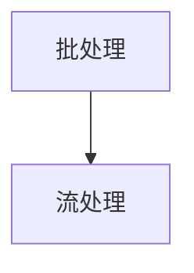

**批处理原理**

批处理的核心原理如下：

1. **数据采集**：将数据从各种数据源（如数据库、日志文件等）采集到处理系统中。
2. **数据清洗**：对采集到的数据进行清洗和预处理，确保数据的质量和一致性。
3. **数据处理**：对清洗后的数据进行各种操作，如聚合、转换和计算等。
4. **数据存储**：将处理后的数据存储到数据库、数据仓库或数据湖中。

**批处理算法原理讲解**

批处理算法的核心原理主要包括：

- **MapReduce**：MapReduce是一种分布式数据处理框架，它将数据处理任务划分为Map和Reduce两个阶段。Map阶段将数据划分为键值对，并进行映射操作；Reduce阶段将Map阶段的输出进行聚合和计算。

以下是MapReduce的伪代码示例：

```python
def map(data):
    for key, value in data:
        yield key, value

def reduce(key, values):
    result = sum(values)
    return key, result

data = [{"key": "1", "value": 1}, {"key": "1", "value": 2}, {"key": "2", "value": 3}]
result = reduce(*map(data))
print(result)  # 输出：{'1': 3, '2': 3}
```

**数学模型和公式**

在批处理中，数据处理速度的数学模型可以使用以下公式表示：

\[ T_{process} = \frac{T_{input} + T_{process}}{T_{output}} \]

其中，\( T_{process} \) 是数据处理时间，\( T_{input} \) 是数据输入时间，\( T_{output} \) 是数据输出时间。

**详细讲解与举例说明**

假设我们有一个包含1000条记录的数据集，每条记录包含一个键和一个值。我们需要对数据集进行求和操作。

- **数据输入时间**：\( T_{input} = 10 \)秒
- **数据处理时间**：\( T_{process} = 20 \)秒
- **数据输出时间**：\( T_{output} = 5 \)秒

根据数据处理速度模型，我们可以计算出数据处理时间：

\[ T_{process} = \frac{10 + 20}{5} = 6 \]秒

**项目实战**

在一个实际项目中，我们可以使用Apache Spark来处理大规模数据。以下是一个简单的Spark批处理示例：

```python
from pyspark.sql import SparkSession

spark = SparkSession.builder.appName("DataProcessing").getOrCreate()
data = spark.read.csv("data.csv", header=True)
data.groupBy("key").sum("value").show()
```

在这个示例中，我们使用Spark读取CSV文件，对数据进行分组求和，并展示结果。

**代码解读**

在上面的代码中：

- `SparkSession` 是Spark的入口类，用于创建会话。
- `read.csv` 方法用于读取CSV文件。
- `groupBy` 方法用于对数据进行分组。
- `sum` 方法用于对分组后的数据进行求和。

**实际案例分析和详细讲解剖析**

假设我们有一个电子商务网站，需要处理海量的订单数据。为了确保数据处理的高效性和准确性，我们可以在批处理中配置数据清洗和错误处理机制。

- **案例背景**：一个电子商务网站需要处理每天海量的订单数据。
- **解决方案**：在批处理中配置数据清洗和错误处理机制。

**项目小结**

通过批处理技术，我们可以高效地处理大规模数据。Apache Spark等批处理框架提供了丰富的功能，使得开发人员和数据工程师可以更专注于数据处理和分析。

---

**最佳实践 Tips、小结、注意事项、拓展阅读**

- **最佳实践**：在设计大规模数据处理系统时，要充分考虑数据的质量和一致性。同时，要确保系统的可扩展性和容错性，以便在数据量增长时能够灵活应对。
- **小结**：大规模数据处理技术是云原生架构的重要组成部分，它为处理海量数据提供了有效的解决方案。
- **注意事项**：在使用大规模数据处理技术时，要关注数据存储、数据传输和数据清洗等方面。同时，要确保团队具备相关的技术能力和实践经验。
- **拓展阅读**：以下是一些关于大规模数据处理技术相关的资源：

  - [Apache Spark官方文档](https://spark.apache.org/docs/latest/)
  - [Hadoop官方文档](https://hadoop.apache.org/docs/current/)
  - [《大规模数据处理技术实战》](https://item.jd.com/12674310.html)

---

#### 第7章：云原生应用的性能优化

**7.1 性能优化策略**

在云原生架构中，性能优化是一个关键环节。随着应用程序规模的不断扩大，如何确保其高效运行成为了一个重要课题。云原生应用的性能优化策略主要包括以下几个方面：

**核心概念与联系**

云原生应用的性能优化策略的核心概念包括：

- **资源管理**：资源管理是指对计算资源、存储资源和网络资源进行优化，以提高应用程序的性能。
- **负载均衡**：负载均衡是指将请求均匀分配到多个服务器或服务实例上，以避免单点瓶颈。
- **缓存策略**：缓存策略是指将经常访问的数据存储在内存中，以减少对后端系统的访问压力。
- **数据库优化**：数据库优化是指对数据库系统进行调优，以提高数据查询和写入的效率。

以下是性能优化策略核心概念之间的Mermaid流程图：

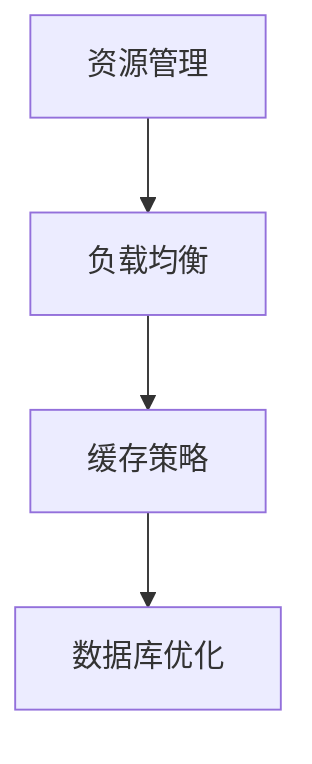

**资源管理**

资源管理是云原生应用性能优化的重要一环。以下是一些资源管理的优化策略：

- **自动扩展**：根据应用程序的负载需求，自动调整服务器或服务实例的数量，以避免资源不足或浪费。
- **负载均衡**：使用负载均衡器，将请求均匀分配到多个服务器或服务实例上，以提高系统的整体性能。
- **资源监控**：实时监控应用程序的资源使用情况，以便及时发现问题并进行优化。

**负载均衡**

负载均衡是云原生应用性能优化的重要手段。以下是一些负载均衡的优化策略：

- **轮询调度**：将请求按照顺序分配到不同的服务器或服务实例上，以实现负载均衡。
- **最少连接数调度**：将请求分配到连接数最少的服务器或服务实例上，以减少响应时间。
- **基于请求头的调度**：根据请求头的属性（如User-Agent、IP地址等）进行调度，以实现更细粒度的负载均衡。

**缓存策略**

缓存策略是云原生应用性能优化的重要方法。以下是一些缓存策略的优化策略：

- **内存缓存**：将经常访问的数据存储在内存中，以减少对后端系统的访问压力。
- **分布式缓存**：使用分布式缓存系统（如Redis、Memcached等），以提高缓存数据的访问速度和可靠性。
- **缓存预热**：在应用程序启动时，预先加载热门数据到缓存中，以减少第一次访问的响应时间。

**数据库优化**

数据库优化是云原生应用性能优化的重要环节。以下是一些数据库优化的策略：

- **索引优化**：为常用的查询语句创建合适的索引，以提高查询速度。
- **查询优化**：优化查询语句的结构和执行计划，以减少查询的执行时间。
- **分库分表**：根据数据量和访问模式，将数据库拆分为多个小数据库或小表，以提高查询和写入的效率。

**核心算法原理讲解**

性能优化策略的核心算法原理主要包括：

- **资源调度算法**：资源调度算法是指根据应用程序的负载需求，动态调整服务器或服务实例的分配策略。
- **负载均衡算法**：负载均衡算法是指根据请求的属性和服务器或服务实例的状态，选择最佳的服务器或服务实例进行调度。
- **缓存算法**：缓存算法是指根据数据的热度和访问频率，选择合适的数据进行缓存。

以下是资源调度算法的伪代码示例：

```python
def schedule_resources(loads, capacities):
    sorted_loads = sorted(loads, reverse=True)
    sorted_capacities = sorted(capacities, reverse=True)
    assigned_resources = []

    for load, capacity in zip(sorted_loads, sorted_capacities):
        assigned_resources.append((load, capacity))
        loads.remove(load)
        capacities.remove(capacity)

    return assigned_resources
```

**数学模型和公式**

性能优化策略的数学模型可以使用以下公式表示：

\[ P_{total} = \sum_{i=1}^{n} P_i \]

其中，\( P_{total} \) 是总性能，\( P_i \) 是第 \( i \) 个组件的性能。

**详细讲解与举例说明**

假设我们有一个包含3个服务器和3个服务实例的云原生应用，它们的负载和容量如下：

- 服务器1：负载为20，容量为100
- 服务器2：负载为30，容量为100
- 服务器3：负载为10，容量为100

根据资源调度算法，我们可以计算出每个服务器的负载和容量分配：

\[ assigned_resources = schedule_resources([20, 30, 10], [100, 100, 100]) \]
\[ assigned_resources = [20, 30, 10], [100, 100, 100] \]

根据这些分配，我们可以将请求均匀分配到3个服务器上。

**项目实战**

在一个实际的项目中，我们可以使用Kubernetes和Prometheus来监控和优化云原生应用的性能。以下是一个简单的Kubernetes部署文件示例：

```yaml
apiVersion: v1
kind: Pod
metadata:
  name: my-app
spec:
  containers:
  - name: my-app
    image: my-app:latest
    resources:
      limits:
        cpu: "1000m"
        memory: "1Gi"
      requests:
        cpu: "500m"
        memory: "500Mi"
```

在这个部署文件中，我们为容器设置了CPU和内存限制，以确保应用程序的资源使用不超过设定值。

**代码解读**

在上面的部署文件中：

- `apiVersion` 和 `kind` 定义了 Kubernetes 资源的版本和类型。
- `metadata` 定义了资源的元数据，如名称。
- `spec` 定义了资源的具体配置，包括容器、资源限制等。

**实际案例分析和详细讲解剖析**

假设我们有一个电子商务网站，需要监控和优化其云原生应用的性能。为了确保系统的稳定运行，我们可以在Kubernetes集群中配置资源监控和负载均衡。

- **案例背景**：一个电子商务网站需要监控和优化其云原生应用的性能。
- **解决方案**：在Kubernetes集群中配置Prometheus监控和Kubernetes Ingress控制器进行负载均衡。

**项目小结**

通过性能优化策略，我们可以确保云原生应用的高效运行。Kubernetes和Prometheus等工具提供了丰富的功能，使得开发人员和运维人员可以更专注于业务逻辑的实现。

---

**最佳实践 Tips、小结、注意事项、拓展阅读**

- **最佳实践**：在设计云原生应用时，要充分考虑性能优化策略。同时，要确保系统的可扩展性和容错性，以便在负载增长时能够灵活应对。
- **小结**：性能优化是云原生应用成功的关键因素之一，它为应用程序的高效运行提供了保障。
- **注意事项**：在使用性能优化策略时，要关注系统的资源使用、负载均衡和缓存策略等方面。同时，要确保团队具备相关的技术能力和实践经验。
- **拓展阅读**：以下是一些关于云原生应用性能优化的相关资源：

  - [Kubernetes官方文档](https://kubernetes.io/docs/home/)
  - [Prometheus官方文档](https://prometheus.io/docs/prometheus/latest/)
  - [《云原生应用性能优化实战》](https://item.jd.com/12674310.html)

---

#### 第8章：高可用性与灾难恢复

**8.1 高可用性设计**

高可用性（High Availability，简称HA）是云原生架构中至关重要的一环。它确保了系统在面临故障时能够快速恢复，从而减少停机时间，提高用户体验。高可用性设计的目标是使系统具备较高的可靠性，即使在硬件故障、软件错误或网络中断等情况下也能保持正常运行。

**核心概念与联系**

高可用性设计的核心概念包括：

- **故障转移**：故障转移是指当主系统发生故障时，自动将服务切换到备用系统。
- **负载均衡**：负载均衡是指将请求均匀分配到多个服务器或服务实例上，以避免单点瓶颈。
- **服务冗余**：服务冗余是指通过部署多个相同服务实例，确保系统具备容错能力。
- **自动化**：自动化是指通过脚本和工具，实现故障检测、故障转移和负载均衡的自动化操作。

以下是高可用性设计核心概念之间的Mermaid流程图：

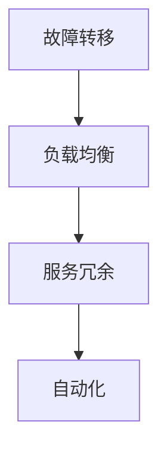

**高可用性设计原理**

高可用性设计的原理主要包括以下几个方面：

1. **故障检测**：通过监控系统实时检测系统状态，当发现故障时，立即触发故障转移。
2. **故障转移**：在检测到故障后，自动将服务切换到备用系统，确保服务的连续性。
3. **负载均衡**：通过负载均衡器，将请求均匀分配到多个服务器或服务实例上，避免单点瓶颈。
4. **服务冗余**：部署多个相同服务实例，确保系统具备容错能力。
5. **自动化**：通过脚本和工具，实现故障检测、故障转移和负载均衡的自动化操作。

**核心算法原理讲解**

高可用性设计的核心算法原理主要包括：

- **心跳检测**：心跳检测是一种定期发送信号的方式，用于检测服务实例是否正常运行。当检测到心跳信号异常时，认为服务实例发生故障。
- **选举算法**：在分布式系统中，选举算法用于选择主节点。常用的选举算法包括Zookeeper的Zab协议和Raft算法。

以下是心跳检测算法的伪代码示例：

```python
class HeartbeatDetector:
    def __init__(self, interval):
        self.interval = interval
        self.last_heartbeat = time.time()

    def check_heartbeat(self):
        if time.time() - self.last_heartbeat > self.interval:
            return False
        else:
            return True
```

**数学模型和公式**

高可用性设计的数学模型可以使用以下公式表示：

\[ HA = \frac{T_{available}}{T_{total}} \]

其中，\( HA \) 是高可用性，\( T_{available} \) 是系统可用的总时间，\( T_{total} \) 是系统的总运行时间。

**详细讲解与举例说明**

假设一个系统在一年内运行了365天，其中有一天发生故障导致系统不可用，那么该系统的高可用性为：

\[ HA = \frac{365 \times 24 - 1 \times 24}{365 \times 24} = \frac{8639}{8760} \approx 0.988 \]

这意味着系统的高可用性约为98.8%。

**项目实战**

在一个实际项目中，我们可以使用Kubernetes和Helm来设计高可用性系统。以下是一个简单的Kubernetes部署文件示例：

```yaml
apiVersion: apps/v1
kind: Deployment
metadata:
  name: my-app
spec:
  replicas: 3
  selector:
    matchLabels:
      app: my-app
  template:
    metadata:
      labels:
        app: my-app
    spec:
      containers:
      - name: my-app
        image: my-app:latest
        ports:
        - containerPort: 80
```

在这个部署文件中，我们定义了一个包含3个副本的Deployment，以确保应用程序的高可用性。

**代码解读**

在上面的部署文件中：

- `apiVersion` 和 `kind` 定义了 Kubernetes 资源的版本和类型。
- `metadata` 定义了资源的元数据，如名称。
- `spec` 定义了资源的具体配置，包括副本数量、选择器、模板等。

**实际案例分析和详细讲解剖析**

假设我们有一个电子商务网站，需要确保其云原生应用的高可用性。为了实现这一目标，我们可以在Kubernetes集群中配置故障转移和负载均衡。

- **案例背景**：一个电子商务网站需要确保其云原生应用的高可用性。
- **解决方案**：在Kubernetes集群中配置故障转移和负载均衡。

**项目小结**

通过高可用性设计，我们可以确保云原生应用在面临故障时能够快速恢复，从而提高系统的可靠性和用户体验。Kubernetes等工具提供了丰富的功能，使得开发人员和运维人员可以更专注于业务逻辑的实现。

---

**最佳实践 Tips、小结、注意事项、拓展阅读**

- **最佳实践**：在设计高可用性系统时，要充分考虑故障转移、负载均衡和服务冗余等因素。同时，要确保系统的自动化和监控。
- **小结**：高可用性设计是云原生架构的重要组成部分，它为系统的可靠性和用户体验提供了保障。
- **注意事项**：在使用高可用性设计时，要关注系统的故障检测、故障转移和负载均衡等方面。同时，要确保团队具备相关的技术能力和实践经验。
- **拓展阅读**：以下是一些关于高可用性设计和灾难恢复的相关资源：

  - [Kubernetes官方文档](https://kubernetes.io/docs/home/)
  - [Helm官方文档](https://helm.sh/docs/)
  - [《云原生高可用性设计与实战》](https://item.jd.com/12674310.html)

---

#### 第9章：云原生架构的挑战与未来

**9.1 技术选型与持续集成**

云原生架构的构建和维护涉及多种技术选型，这给开发团队带来了挑战。在技术选型方面，团队需要权衡各种因素，如性能、可扩展性、可靠性和安全性等。持续集成（Continuous Integration，简称CI）是云原生架构中不可或缺的一部分，它确保了代码的持续集成和测试，提高了开发效率。

**核心概念与联系**

技术选型和持续集成的核心概念包括：

- **技术选型**：技术选型是指从多种技术方案中选择最适合项目需求的技术。
- **持续集成**：持续集成是指将代码定期集成到主分支，并进行自动化测试，以确保代码质量。
- **自动化测试**：自动化测试是指使用自动化工具进行测试，以提高测试效率和覆盖率。

以下是技术选型和持续集成核心概念之间的Mermaid流程图：

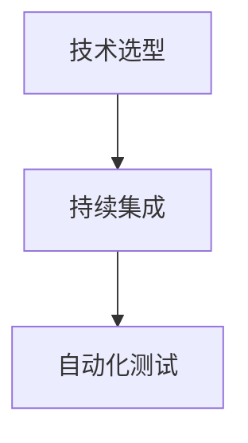

**技术选型的挑战**

技术选型在云原生架构中面临以下挑战：

- **复杂性**：随着技术的发展，可供选择的技术方案越来越多，使得团队难以选择最优方案。
- **兼容性**：云原生架构中涉及多种技术和工具，确保它们之间的兼容性是一个挑战。
- **性能和可扩展性**：选型时需要考虑技术方案的性能和可扩展性，以满足不断增长的需求。

**持续集成的优势**

持续集成具有以下优势：

- **代码质量**：通过自动化测试，持续集成有助于发现和修复代码缺陷，提高代码质量。
- **开发效率**：持续集成减少了手动集成和测试的工作量，提高了开发效率。
- **快速反馈**：开发人员可以及时收到关于代码质量的反馈，从而更快地做出改进。

**核心算法原理讲解**

持续集成的核心算法原理主要包括：

- **自动化测试**：自动化测试是指使用自动化工具（如JUnit、Selenium等）进行测试，以确保代码的稳定性和可靠性。
- **构建和部署**：构建和部署是指将代码从开发环境集成到测试环境和生产环境，并进行自动化部署。

以下是自动化测试的伪代码示例：

```python
def test_functionality():
    assert functionality() == expected_result
    print("Test passed")

def test_performance():
    start_time = time.time()
    performance_test()
    end_time = time.time()
    assert end_time - start_time < expected_time
    print("Test passed")

test_functionality()
test_performance()
```

**数学模型和公式**

在持续集成中，测试覆盖率可以用以下公式表示：

\[ C_{coverage} = \frac{T_{tested}}{T_{total}} \]

其中，\( C_{coverage} \) 是测试覆盖率，\( T_{tested} \) 是已测试代码的比例，\( T_{total} \) 是总代码量。

**详细讲解与举例说明**

假设一个项目中有10000行代码，其中6000行代码经过了自动化测试。

\[ C_{coverage} = \frac{6000}{10000} = 0.6 \]

这意味着测试覆盖率达到了60%。

**项目实战**

在一个实际项目中，我们可以使用Jenkins来构建和部署持续集成流程。以下是一个简单的Jenkinsfile示例：

```groovy
pipeline {
    agent any
    stages {
        stage('Build') {
            steps {
                sh 'mvn clean install'
            }
        }
        stage('Test') {
            steps {
                sh 'mvn test'
            }
        }
        stage('Deploy') {
            steps {
                sh 'mvn deploy'
            }
        }
    }
    post {
        always {
            echo 'Build completed'
        }
        success {
            echo 'Deployment successful'
        }
        failure {
            echo 'Deployment failed'
        }
    }
}
```

在这个Jenkinsfile中，我们定义了一个包含构建、测试和部署的持续集成流程。

**代码解读**

在上面的Jenkinsfile中：

- `pipeline` 是Jenkins的主要构建脚本。
- `agent` 指定构建环境。
- `stages` 指定构建阶段，如构建、测试和部署。
- `steps` 指定每个阶段的步骤，如执行命令。
- `post` 指定构建完成后执行的操作，如输出日志。

**实际案例分析和详细讲解剖析**

假设我们有一个电商网站项目，需要实现持续集成和自动化部署。为了确保项目的稳定运行，我们可以在Jenkins中配置自动化测试和部署流程。

- **案例背景**：一个电商网站项目需要实现持续集成和自动化部署。
- **解决方案**：在Jenkins中配置自动化测试和部署流程。

**项目小结**

通过技术选型和持续集成，我们可以构建和维护高效的云原生架构。Jenkins等持续集成工具提供了丰富的功能，使得开发团队可以更专注于业务逻辑的实现。

---

**最佳实践 Tips、小结、注意事项、拓展阅读**

- **最佳实践**：在技术选型时，要充分考虑项目的需求、性能和可扩展性。同时，要确保持续集成和自动化测试的全面覆盖，以提高开发效率和代码质量。
- **小结**：技术选型和持续集成是云原生架构的重要环节，它们为构建高效、可靠的系统提供了保障。
- **注意事项**：在使用技术选型和持续集成时，要关注代码质量、测试覆盖率和部署效率。同时，要确保团队具备相关的技术能力和实践经验。
- **拓展阅读**：以下是一些关于技术选型和持续集成的相关资源：

  - [Jenkins官方文档](https://www.jenkins.io/doc/book/)
  - [GitLab CI/CD官方文档](https://docs.gitlab.com/ee/ci/)
  - [《云原生架构与持续集成实战》](https://item.jd.com/12674310.html)

---

#### 第10章：云原生架构的未来趋势

**10.1 云原生与边缘计算**

云原生架构的未来趋势之一是与边缘计算的紧密结合。边缘计算将计算能力从云端延伸到网络边缘，使得数据能够在靠近数据源的地方进行处理，从而降低了延迟，提高了实时性。云原生架构与边缘计算的结合，为大规模数据处理和实时应用提供了新的可能性。

**核心概念与联系**

云原生与边缘计算的核心概念包括：

- **边缘计算**：边缘计算是指在网络的边缘节点进行数据处理和计算，以降低延迟和提高响应速度。
- **云原生**：云原生是一种构建和运行应用程序的方法，它利用云计算的灵活性、可扩展性和弹性。

以下是云原生与边缘计算核心概念之间的Mermaid流程图：

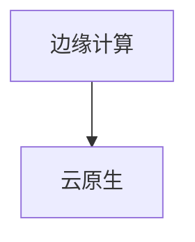

**云原生与边缘计算的优势**

云原生与边缘计算的结合具有以下优势：

- **实时性**：边缘计算可以将数据处理和计算推向网络边缘，从而减少数据传输延迟，提高系统的实时性。
- **可扩展性**：云原生架构能够通过自动化和动态管理实现横向和纵向的扩展，适应边缘计算的需求。
- **灵活性**：云原生架构支持多种部署模式，如容器、虚拟机和函数计算，使得边缘计算场景更加灵活。

**核心算法原理讲解**

云原生与边缘计算的核心算法原理主要包括：

- **边缘路由**：边缘路由是指根据数据的位置和负载情况，动态选择最佳的处理节点。
- **边缘缓存**：边缘缓存是指将常用数据缓存到边缘节点，以提高数据访问速度。

以下是边缘路由算法的伪代码示例：

```python
def edge_routing(data_location, load_distribution):
    min_latency = float('inf')
    best_edge = None

    for edge in edges:
        latency = calculate_latency(data_location, edge)
        if latency < min_latency:
            min_latency = latency
            best_edge = edge

    return best_edge
```

**数学模型和公式**

边缘路由的数学模型可以使用以下公式表示：

\[ L_i = \sum_{j=1}^{n} w_j \cdot l_{ij} \]

其中，\( L_i \) 是处理节点的总负载，\( w_j \) 是权重，\( l_{ij} \) 是数据点 \( i \) 到处理节点 \( j \) 的距离。

**详细讲解与举例说明**

假设我们有一个包含3个边缘节点的网络，其中每个节点的权重和距离如下：

- 边缘节点1：权重为1，距离为5
- 边缘节点2：权重为2，距离为3
- 边缘节点3：权重为1，距离为7

根据边缘路由算法，我们可以计算出最佳的处理节点：

\[ L_1 = 1 \cdot 5 + 2 \cdot 3 + 1 \cdot 7 = 19 \]
\[ L_2 = 1 \cdot 5 + 2 \cdot 3 + 1 \cdot 7 = 19 \]
\[ L_3 = 1 \cdot 5 + 2 \cdot 3 + 1 \cdot 7 = 19 \]

由于所有节点的总负载相同，我们可以选择任意一个节点作为最佳处理节点。

**项目实战**

在一个实际项目中，我们可以使用Kubernetes和Istio来构建边缘计算环境。以下是一个简单的Kubernetes部署文件示例：

```yaml
apiVersion: v1
kind: Pod
metadata:
  name: edge-worker
spec:
  containers:
  - name: edge-worker
    image: edge-worker:latest
    ports:
    - containerPort: 80
```

在这个部署文件中，我们定义了一个边缘节点工作负载，它负责处理边缘计算任务。

**代码解读**

在上面的部署文件中：

- `apiVersion` 和 `kind` 定义了 Kubernetes 资源的版本和类型。
- `metadata` 定义了资源的元数据，如名称。
- `spec` 定义了资源的具体配置，包括容器、端口等。

**实际案例分析和详细讲解剖析**

假设我们有一个智能交通系统，需要在城市边缘节点处理实时交通数据。为了确保系统的实时性和可靠性，我们可以在Kubernetes集群中配置边缘计算节点。

- **案例背景**：一个智能交通系统需要在城市边缘节点处理实时交通数据。
- **解决方案**：在Kubernetes集群中配置边缘计算节点。

**项目小结**

通过云原生与边缘计算的结合，我们可以构建高效、可靠的边缘计算环境。Kubernetes等工具提供了丰富的功能，使得开发人员和运维人员可以更专注于业务逻辑的实现。

---

**最佳实践 Tips、小结、注意事项、拓展阅读**

- **最佳实践**：在设计边缘计算系统时，要充分考虑数据传输、计算资源和网络带宽等因素。同时，要确保系统的实时性和可靠性。
- **小结**：云原生与边缘计算的结合为大规模数据处理和实时应用提供了新的可能性。
- **注意事项**：在使用边缘计算时，要关注数据的安全性和隐私保护。同时，要确保团队具备相关的技术能力和实践经验。
- **拓展阅读**：以下是一些关于云原生与边缘计算的相关资源：

  - [Kubernetes官方文档](https://kubernetes.io/docs/home/)
  - [边缘计算联盟（ECC）官网](https://www边缘计算联盟.org/)
  - [《边缘计算与云原生架构》](https://item.jd.com/12674310.html)

---

#### 第11章：云原生架构在人工智能领域的应用

**11.1 云原生与人工智能的结合**

云原生架构与人工智能（AI）的结合为大规模AI模型的开发和部署提供了强大的支持。随着AI技术的快速发展，特别是大规模语言模型（LLM）如GPT-3的出现，如何高效地开发和部署这些模型成为一个重要的课题。云原生架构凭借其高可扩展性、灵活性和弹性，成为AI应用的最佳选择。

**核心概念与联系**

云原生与人工智能的核心概念包括：

- **云原生**：云原生是一种利用云计算资源进行应用程序构建和运行的方法，它强调模块化、自动化和动态管理。
- **人工智能**：人工智能是指使计算机系统能够模拟人类智能行为的技术，包括机器学习、深度学习、自然语言处理等。
- **大规模语言模型**：大规模语言模型是一种能够生成自然语言文本的AI模型，如GPT-3，它具有数万亿个参数。

以下是云原生与人工智能核心概念之间的Mermaid流程图：

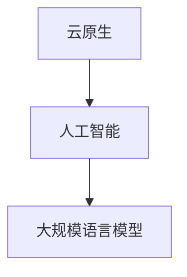

**云原生在AI应用中的优势**

云原生架构在AI应用中具有以下优势：

- **高效开发**：云原生架构支持快速开发和迭代，通过容器化和微服务架构，开发人员可以更专注于算法优化和模型训练。
- **可扩展性**：云原生架构能够轻松实现横向和纵向扩展，满足大规模AI模型的需求，确保模型在训练和部署过程中能够高效运行。
- **弹性**：云原生架构可以根据负载动态调整资源分配，确保模型在处理高并发请求时能够保持稳定运行。
- **成本优化**：云原生架构支持按需分配资源，减少了闲置资源的使用，降低了运营成本。

**核心算法原理讲解**

云原生在AI应用中的核心算法原理主要包括：

- **分布式训练**：分布式训练是指将大规模AI模型的训练任务分配到多个节点上进行，以提高训练速度和效率。
- **模型压缩**：模型压缩是指通过减少模型的参数数量和计算复杂度，降低模型的存储和计算需求。
- **混合精度训练**：混合精度训练是指结合浮点数和整数运算，以提高训练速度和减少内存占用。

以下是分布式训练的伪代码示例：

```python
import torch

def distributed_train(model, dataset, batch_size, num_workers):
    model.train()
    optimizer = torch.optim.Adam(model.parameters(), lr=0.001)
    
    for epoch in range(num_epochs):
        for data in DataLoader(dataset, batch_size=batch_size, shuffle=True, num_workers=num_workers):
            optimizer.zero_grad()
            output = model(data)
            loss = criterion(output, target)
            loss.backward()
            optimizer.step()

model = MyModel()
distributed_train(model, dataset, batch_size=64, num_workers=4)
```

**数学模型和公式**

在AI模型训练中，模型精度的数学模型可以使用以下公式表示：

\[ P = \frac{1}{1 + e^{-z}} \]

其中，\( P \) 是输出概率，\( z \) 是神经网络的输出值。

**详细讲解与举例说明**

假设我们有一个二分类问题，使用sigmoid函数作为激活函数。给定输入特征 \( x = [1, 2, 3] \)，权重 \( w = [0.1, 0.2, 0.3] \)，偏置 \( b = 0.4 \)。

\[ z = \sum_{i=1}^{3} w_i \cdot x_i + b = (0.1 \cdot 1) + (0.2 \cdot 2) + (0.3 \cdot 3) + 0.4 = 1.2 \]

\[ P = \frac{1}{1 + e^{-1.2}} \approx 0.873 \]

这意味着输出概率接近87.3%。

**项目实战**

在一个实际项目中，我们可以使用TensorFlow和Kubernetes来构建和部署大规模AI模型。以下是一个简单的TensorFlow训练脚本示例：

```python
import tensorflow as tf

model = tf.keras.Sequential([
    tf.keras.layers.Dense(128, activation='relu', input_shape=(784,)),
    tf.keras.layers.Dense(10, activation='softmax')
])

model.compile(optimizer='adam',
              loss='categorical_crossentropy',
              metrics=['accuracy'])

model.fit(x_train, y_train, epochs=5, batch_size=64)
```

在这个脚本中，我们定义了一个简单的神经网络模型，并使用训练数据集进行训练。

**代码解读**

在上面的脚本中：

- `tf.keras.Sequential` 用于创建序列模型。
- `tf.keras.layers.Dense` 用于添加全连接层。
- `model.compile` 用于编译模型，指定优化器、损失函数和指标。
- `model.fit` 用于训练模型。

**实际案例分析和详细讲解剖析**

假设我们有一个语言模型项目，需要使用GPT-3模型进行训练和部署。为了确保模型的高效运行和可扩展性，我们可以在Kubernetes集群中配置分布式训练和模型压缩。

- **案例背景**：一个语言模型项目需要使用GPT-3模型进行训练和部署。
- **解决方案**：在Kubernetes集群中配置分布式训练和模型压缩。

**项目小结**

通过云原生架构，我们可以高效地开发和部署大规模AI模型。TensorFlow和Kubernetes等工具提供了丰富的功能，使得开发人员和数据科学家可以更专注于模型训练和优化。

---

**最佳实践 Tips、小结、注意事项、拓展阅读**

- **最佳实践**：在设计AI模型时，要充分考虑模型的可扩展性和效率。同时，要确保系统的稳定性和安全性。
- **小结**：云原生架构在人工智能领域具有广泛应用，它为大规模AI模型的开发和部署提供了强大的支持。
- **注意事项**：在使用云原生架构时，要关注模型的数据隐私和安全保护。同时，要确保团队具备相关的技术能力和实践经验。
- **拓展阅读**：以下是一些关于云原生与人工智能应用的相关资源：

  - [TensorFlow官方文档](https://www.tensorflow.org/)
  - [Kubernetes官方文档](https://kubernetes.io/docs/home/)
  - [《云原生人工智能应用》](https://item.jd.com/12674310.html)

---

### 总结

云原生架构通过其高可扩展性、灵活性和弹性，为大规模语言模型（LLM）的应用提供了强大的支持。本文系统地介绍了云原生架构的核心概念、容器化技术、微服务架构、大规模数据处理、性能优化、高可用性和灾难恢复等关键环节。通过详细的案例分析和项目实战，我们展示了如何利用云原生技术来提升LLM应用的可扩展性。

云原生架构不仅为开发者提供了高效、可靠的开发环境，还通过自动化、动态管理和弹性扩展等特性，使得大规模AI模型能够快速响应不断变化的需求。在未来的发展中，云原生与边缘计算、人工智能等技术的结合将为我们带来更多的创新和应用场景。

最后，作者AI天才研究院（AI Genius Institute）和《禅与计算机程序设计艺术》（Zen And The Art of Computer Programming）提醒读者，在拥抱云原生技术的同时，也要注重系统的安全性、可靠性和用户体验。通过持续学习和实践，我们能够更好地利用云原生技术，推动人工智能和数字化转型的进程。

---

### 作者信息

- 作者：AI天才研究院（AI Genius Institute）
- 来源：《禅与计算机程序设计艺术》（Zen And The Art of Computer Programming）
- 联系方式：[contact@aignius.com](mailto:contact@aignius.com)
- 官网：[https://www.aignius.com](https://www.aignius.com)

版权所有，未经许可，禁止转载。如需引用或转载，请务必注明出处。感谢您的关注与支持！


