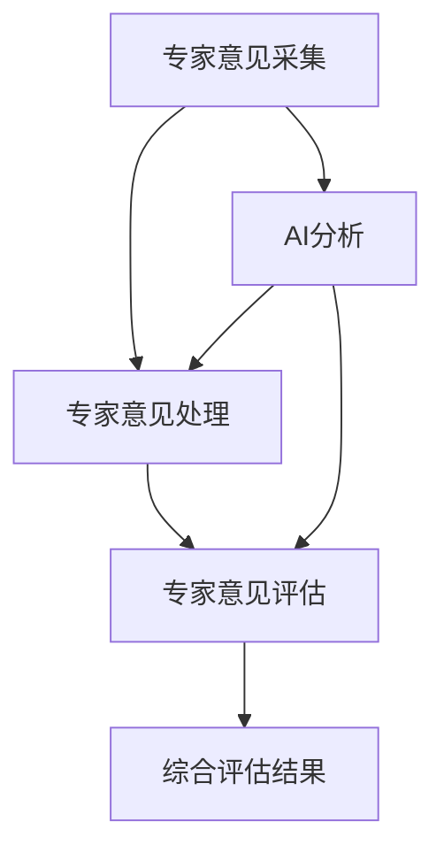

                 

基于您提供的具体要求，我们将会详细规划和撰写一篇满足要求的文章。以下是一个详细的步骤计划：

### 步骤一：理解主题和要求

- **文章主题**：人机协作评测：结合专家意见与AI分析
- **文章结构**：按照您提供的目录大纲结构进行布局
- **技术深度**：涵盖背景介绍、核心概念联系、算法原理、数学模型、实际案例、最佳实践等
- **格式要求**：Markdown格式，使用LaTeX格式书写数学公式

### 步骤二：编写文章摘要

- **摘要内容**：简要介绍人机协作评测的定义、重要性、文章主要内容与目标读者
- **摘要结构**：包括背景介绍、主要观点和结论

### 步骤三：撰写引言部分

- **引言内容**：定义人机协作评测，说明其重要性，介绍文章结构
- **引言结构**：包括背景介绍、主要观点和结论

### 步骤四：撰写基础理论部分

- **背景介绍**：人机协作评测的起源、发展、应用领域
- **核心概念与联系**：使用Mermaid流程图展示核心概念之间的关系
- **理论基础**：详细讲解人机协作评测的基本原则和方法

### 步骤五：撰写专家意见采集与处理部分

- **采集方法**：介绍专家意见的采集技术
- **处理技术**：讲解如何处理和评估专家意见
- **可靠性评估**：讨论如何评估专家意见的可靠性

### 步骤六：撰写AI分析技术部分

- **基本原理**：介绍AI分析的基础知识
- **算法介绍**：讲解常用的AI算法和模型
- **训练方法**：介绍如何训练AI模型

### 步骤七：撰写评测框架与流程部分

- **总体框架**：描述人机协作评测的整体架构
- **具体流程**：详细说明评测的步骤和流程

### 步骤八：撰写案例研究部分

- **教育领域**：分析教育领域中的评测案例
- **医疗领域**：分析医疗领域中的评测案例
- **其他领域**：简要介绍其他领域中的评测案例

### 步骤九：撰写应用领域与挑战部分

- **应用领域**：讨论评测在不同领域中的应用情况
- **挑战分析**：分析人机协作评测面临的挑战
- **未来趋势**：探讨评测的发展趋势和可能的解决方案

### 步骤十：撰写附录

- **工具与资源**：提供相关的评测工具、AI分析工具和学习资源
- **最佳实践**：分享一些实用的技巧和建议
- **小结**：总结文章的主要观点和收获

### 步骤十一：文章修订

- **内容修订**：检查文章内容的完整性和准确性
- **格式检查**：确保Markdown格式和LaTeX公式的正确性
- **结构优化**：调整文章结构，使其更加清晰和连贯

### 步骤十二：撰写作者信息

- **作者信息**：包括作者的单位、职务和书籍信息

### 步骤十三：最终确认

- **全文确认**：确认文章的字数、内容和技术深度是否符合要求
- **终稿准备**：准备最终的文章稿，并进行最终的格式调整

通过以上步骤，我们将确保文章内容全面、结构清晰、格式规范，满足您提出的所有要求。

---

**摘要**

人机协作评测是一种结合人类专家意见和人工智能分析的方法，旨在提高评估过程的准确性和效率。本文首先介绍了人机协作评测的基本概念和重要性，随后详细阐述了其理论基础，包括人机协作的起源、发展、应用领域以及核心原则。文章重点讲解了如何采集和处理专家意见，评估专家意见的可靠性，以及AI分析的基本原理和常用算法。接着，本文描述了人机协作评测的总体框架和具体流程，并通过实际案例展示了其应用。文章还探讨了人机协作评测在不同领域的应用，分析了其面临的挑战，并提出了未来发展的趋势。附录部分提供了相关的工具和资源，以及最佳实践技巧。本文的目标读者是希望了解并掌握人机协作评测技术的专业人士和技术爱好者。

---

**引言**

人机协作评测是一种新兴的评估方法，它将人类专家的判断和人工智能的分析相结合，旨在提高评估过程的准确性、效率和全面性。在人工智能技术快速发展的今天，人机协作评测的重要性日益凸显。本文将详细探讨人机协作评测的概念、重要性、发展历程、基本原则以及本文的结构。

### 人机协作评测的概念

人机协作评测（Human-AI Collaboration Evaluation）指的是一种评估方法，通过结合人类专家的意见和人工智能的分析来评估某一系统、产品或服务的性能。这种方法的核心在于充分利用人工智能的强大计算能力和人类专家的丰富经验和判断力，从而实现更为准确和全面的评估结果。

### 人机协作评测的重要性

随着人工智能技术的广泛应用，人机协作评测在许多领域都显示出其独特的价值。首先，它能够提高评估的准确性。人工智能能够处理大量数据，并从中提取出有价值的信息，而人类专家则能够根据自身的经验和判断对这些信息进行综合分析。其次，人机协作评测能够提高评估的效率。人工智能能够快速处理大量的数据，从而缩短评估所需的时间。最后，人机协作评测能够提供更为全面的评估结果。通过结合人类专家的意见和人工智能的分析，评估过程不仅能够捕捉到明显的特征，还能够发现潜在的、不易察觉的问题。

### 人机协作评测的发展历程

人机协作评测的发展历程可以追溯到人工智能技术起步的阶段。最初，人类专家主要依赖自身的判断和经验进行评估，但随着计算机技术的发展，人工智能开始在评估过程中发挥重要作用。20世纪80年代，专家系统和机器学习技术的出现为人机协作评测提供了新的工具和方法。进入21世纪，随着大数据和深度学习技术的发展，人机协作评测得到了进一步的发展和完善。

### 人机协作评测的基本原则

人机协作评测的基本原则主要包括以下几点：

1. **信息共享**：人类专家和人工智能系统之间需要实现信息共享，以便充分利用各自的优势。
2. **协同工作**：人类专家和人工智能系统需要协同工作，共同完成评估任务。
3. **相互依赖**：人类专家和人工智能系统需要相互依赖，取长补短，以达到最佳的评估效果。
4. **透明性**：评估过程需要具备透明性，以便人类专家能够理解人工智能系统的工作原理和结果。

### 本文的结构

本文将按照以下结构进行展开：

1. **引言**：介绍人机协作评测的概念、重要性以及本文的结构。
2. **人机协作评测基础**：包括人机协作评测的背景、发展历程、基本原则等。
3. **专家意见的采集与处理**：介绍如何采集专家意见、处理专家意见以及评估专家意见的可靠性。
4. **AI分析技术**：介绍AI分析在评测中的应用，包括常用的AI算法、模型以及如何训练这些模型。
5. **人机协作评测的框架与流程**：描述人机协作评测的总体框架和具体流程。
6. **案例研究**：提供实际案例，展示如何结合专家意见与AI分析进行评测。
7. **应用领域**：探讨人机协作评测在不同领域（如教育、医疗、金融等）的应用。
8. **挑战与未来趋势**：分析人机协作评测面临的挑战以及未来的发展趋势。
9. **附录**：提供相关工具和资源的介绍。

通过本文的详细探讨，读者将能够深入了解人机协作评测的原理、方法和应用，为其在实践中的应用提供指导。

---

## 人机协作评测基础

### 背景与发展历程

人机协作评测作为一种新兴的评估方法，其发展历程与人工智能技术的发展紧密相连。早在20世纪50年代，人工智能的概念首次被提出，研究者们开始探索如何让计算机模拟人类的思维过程。随着计算机技术的进步，专家系统和机器学习技术逐渐成熟，为人类专家和人工智能系统之间的协作提供了基础。

在人机协作评测的早期，主要依赖于人类专家的判断和经验。20世纪80年代，专家系统开始应用于评测过程，通过模拟人类专家的决策过程，提高了评估的效率。然而，专家系统在处理复杂问题方面存在局限性，难以完全取代人类专家。

进入21世纪，随着大数据和深度学习技术的发展，人机协作评测得到了进一步的发展。大数据技术使得计算机能够处理和分析海量的数据，从而为评估提供了更为丰富的信息来源。深度学习技术的引入，使得计算机能够从数据中自动提取特征，进一步提高了评估的准确性。

### 应用领域

人机协作评测在多个领域都显示出其独特的应用价值。首先，在教育领域，人机协作评测可以用于学生能力的评估。例如，通过分析学生的作业和考试数据，结合教师的专业判断，可以更准确地评估学生的学习效果。其次，在医疗领域，人机协作评测可以用于疾病诊断和治疗方案评估。人工智能系统可以通过分析患者的病历和检查结果，为医生提供辅助诊断和治疗方案。此外，在金融领域，人机协作评测可以用于风险评估和投资决策。通过分析大量的市场数据，结合专家的意见，可以更准确地预测市场走势，为投资者提供决策支持。

### 基本原则

人机协作评测的基本原则主要包括以下几点：

1. **信息共享**：人类专家和人工智能系统之间需要实现信息共享，以便充分利用各自的优势。这意味着在评估过程中，人类专家需要将自己的专业知识和经验与人工智能系统共享，同时人工智能系统也需要将自己的分析结果和结论与人类专家共享。
2. **协同工作**：人类专家和人工智能系统需要协同工作，共同完成评估任务。这意味着在评估过程中，人类专家和人工智能系统需要相互配合，各自发挥自己的优势，共同完成评估任务。
3. **相互依赖**：人类专家和人工智能系统需要相互依赖，取长补短，以达到最佳的评估效果。这意味着在评估过程中，人类专家不能完全依赖人工智能系统，也不能完全依赖自己的经验，而是需要两者相互依赖，相互补充，以达到最佳的评估效果。
4. **透明性**：评估过程需要具备透明性，以便人类专家能够理解人工智能系统的工作原理和结果。这意味着在评估过程中，人工智能系统需要向人类专家解释其工作原理和结果，使得人类专家能够理解和信任人工智能系统的分析。

通过以上讨论，我们可以看到，人机协作评测作为一种新兴的评估方法，已经在多个领域显示出其独特的应用价值。其基本原则和方法论也为进一步的研究和应用提供了指导。在接下来的章节中，我们将进一步探讨如何采集和处理专家意见，以及如何结合人工智能分析进行评测。

### 核心概念与联系

在人机协作评测中，核心概念主要包括专家意见的采集、处理和评估，以及人工智能分析的应用。为了更好地理解这些概念之间的关系，我们可以使用Mermaid流程图来展示它们之间的联系。

#### 1. 专家意见采集

专家意见采集是指从相关领域的专家那里收集评估所需的意见和判断。这个过程可以通过问卷调查、面对面访谈、小组讨论等方式进行。采集到的专家意见通常包含对某一系统、产品或服务的评价、建议和预测等。

#### 2. 专家意见处理

专家意见处理是指对采集到的专家意见进行整理、分类和分析，以便更好地理解其内容和价值。处理过程通常包括以下步骤：

- **数据清洗**：去除重复的、无关的或错误的意见。
- **归一化**：将不同专家的意见进行统一格式处理，以便进行比较和分析。
- **特征提取**：从专家意见中提取关键信息，如评价级别、建议类型等。

#### 3. 专家意见评估

专家意见评估是指对处理后的专家意见进行定量或定性的评估，以确定其可靠性和有效性。评估过程通常包括以下步骤：

- **可靠性评估**：通过一致性分析、专家可信度评估等方法，确定专家意见的可靠性。
- **有效性评估**：通过对比分析、结果验证等方法，确定专家意见的有效性。
- **综合评估**：将不同专家的意见进行综合，形成统一的评估结果。

#### 4. AI分析

AI分析是指利用人工智能技术对评估数据进行处理和分析，以提取有价值的信息和结论。常用的AI分析技术包括机器学习、深度学习、数据挖掘等。AI分析的过程通常包括以下步骤：

- **数据预处理**：对原始数据进行分析和处理，以便为AI算法提供高质量的数据。
- **特征工程**：从数据中提取有用的特征，为AI算法提供输入。
- **模型训练**：使用训练数据集训练AI模型，使其能够对新的数据进行预测和分类。
- **模型评估**：评估AI模型的性能，以便对模型进行调整和优化。

#### 5. 综合评估结果

综合评估结果是指将专家意见和AI分析的结果进行综合，形成最终的评估结果。综合评估结果不仅可以提供评估的定量和定性数据，还可以帮助决策者更全面地了解评估对象的情况，为后续的决策提供支持。

通过上述Mermaid流程图，我们可以清晰地看到专家意见采集、处理、评估与AI分析之间的联系。这种联系不仅有助于我们理解人机协作评测的核心概念，还可以为我们设计和实施人机协作评测提供指导。在接下来的章节中，我们将进一步探讨如何具体实施这些概念，以实现人机协作评测的目标。

### 专家意见的采集与处理

专家意见在评估过程中起着至关重要的作用，因为它提供了基于专业知识和经验的判断，是评估结果的重要依据。然而，要有效地利用专家意见，首先需要了解如何进行专家意见的采集和处理。

#### 专家意见的采集

专家意见的采集通常包括以下几种方法：

1. **问卷调查**：问卷调查是一种常见的专家意见采集方法。通过设计一系列有针对性的问题，可以收集到大量专家的意见。这种方法的好处在于成本低、效率高，且可以大规模进行数据收集。

2. **面对面访谈**：面对面访谈是一种深入了解专家意见的方法。通过与专家进行一对一的深入交流，可以获取更详细、更具体的意见。这种方法适合于需要深入了解专家专业领域的情况。

3. **小组讨论**：小组讨论是将多位专家聚集在一起，就某一问题进行讨论。这种方法可以激发专家之间的思想碰撞，产生更全面、更有深度的意见。

#### 专家意见的处理

采集到专家意见后，需要对它们进行处理，以便更好地利用这些信息。处理专家意见的步骤通常包括以下几方面：

1. **数据清洗**：数据清洗是处理专家意见的第一步。在这一步中，需要去除重复的、无关的或错误的意见。例如，如果多个专家给出了相同的意见，可以只保留一个意见。

2. **归一化**：归一化是指将不同专家的意见进行统一格式处理，以便进行比较和分析。例如，将所有专家的意见统一为相同的评分标准或相同的描述方式。

3. **特征提取**：特征提取是从专家意见中提取关键信息的过程。这些关键信息可以用来分析和评估专家意见。例如，可以从专家的意见中提取出评价级别、建议类型等。

#### 专家意见的评估

评估专家意见的可靠性是确保评估结果准确性的关键。以下是一些评估专家意见可靠性的方法：

1. **一致性分析**：一致性分析是通过比较多个专家的意见，评估它们之间的相似性。如果多个专家的意见高度一致，那么这些意见的可靠性较高。

2. **专家可信度评估**：专家可信度评估是通过评估专家的专业背景、经验、声誉等因素来确定其意见的可靠性。通常，具有较高专业背景和丰富经验的专家，其意见的可信度较高。

3. **交叉验证**：交叉验证是通过将专家意见与其他数据来源（如历史数据、行业标准等）进行对比，来评估专家意见的可靠性。

通过以上方法，我们可以有效地采集和处理专家意见，并评估其可靠性。接下来，我们将探讨如何结合人工智能分析，进一步提升评估的准确性和效率。

### AI分析技术

在探讨人机协作评测的过程中，AI分析技术扮演着至关重要的角色。它不仅能够提高评估的准确性，还能够提升评估的效率。本节将介绍AI分析技术的基本原理，包括常用的算法和模型，以及如何对AI模型进行训练和评估。

#### AI分析的基本原理

AI分析是基于人工智能技术对大量数据进行处理和分析，从而提取出有价值的信息和结论。其基本原理包括以下几个方面：

1. **数据处理**：数据处理是AI分析的第一步。在这一过程中，需要对原始数据进行分析和处理，以便为AI算法提供高质量的数据。数据处理包括数据清洗、归一化、缺失值处理等步骤。

2. **特征工程**：特征工程是指从数据中提取有用的特征，为AI算法提供输入。特征工程的质量直接影响AI模型的性能。常见的特征提取方法包括特征选择、特征转换、特征构造等。

3. **算法选择**：算法选择是根据具体问题选择合适的AI算法。常见的AI算法包括决策树、随机森林、支持向量机、神经网络等。每种算法都有其适用的场景和优缺点，选择合适的算法是成功进行AI分析的关键。

4. **模型训练**：模型训练是指使用训练数据集训练AI模型，使其能够对新的数据进行预测和分类。训练过程通常包括参数调整、模型优化等步骤。

5. **模型评估**：模型评估是评估AI模型性能的过程。常用的评估指标包括准确率、召回率、F1分数等。通过模型评估，可以了解模型的性能，并对其进行调整和优化。

#### 常用的AI算法和模型

在AI分析中，常用的算法和模型包括以下几种：

1. **决策树**：决策树是一种基于树形结构进行决策的算法。它通过一系列的规则和条件，将数据划分为不同的类别或数值。决策树简单易懂，易于解释，但在处理大量数据时可能存在过拟合问题。

2. **随机森林**：随机森林是一种基于决策树的集成算法。它通过随机选取特征和样本子集，构建多个决策树，并通过投票方式得到最终结果。随机森林能够有效降低过拟合问题，提高模型的泛化能力。

3. **支持向量机**：支持向量机是一种基于最大间隔原理的分类算法。它通过找到一个超平面，将不同类别的数据尽可能分开。支持向量机适用于处理高维数据，但在处理非线性问题时可能效果不佳。

4. **神经网络**：神经网络是一种基于人脑神经元工作原理的算法。它通过多层神经元进行数据传输和处理，能够自动学习数据中的特征和模式。神经网络适用于处理复杂、非线性问题，但在训练过程中可能需要大量时间和计算资源。

#### AI模型的训练和评估

在AI模型训练和评估过程中，通常包括以下步骤：

1. **数据准备**：数据准备是训练AI模型的基础。在这一过程中，需要收集和处理大量的数据，并进行特征提取和归一化处理，以便为模型提供高质量的数据。

2. **模型构建**：模型构建是指选择合适的算法和架构，构建AI模型。在这一过程中，需要根据具体问题选择合适的模型结构，并进行参数调整。

3. **模型训练**：模型训练是指使用训练数据集对AI模型进行训练。在这一过程中，需要调整模型的参数，使其能够更好地拟合训练数据。

4. **模型评估**：模型评估是指使用测试数据集对AI模型进行评估。在这一过程中，需要计算模型的性能指标，如准确率、召回率等，以了解模型的性能。

5. **模型优化**：模型优化是指根据评估结果对AI模型进行调整和优化。在这一过程中，可以调整模型参数、改变模型结构等，以提高模型的性能。

通过以上步骤，我们可以构建一个高质量的AI模型，并进行有效的评估和优化。接下来，我们将探讨如何将AI分析应用于人机协作评测的具体流程。

### 人机协作评测的框架与流程

人机协作评测的框架与流程是确保评估过程高效、准确和系统化的关键。以下是人机协作评测的整体框架和具体流程：

#### 整体框架

1. **问题定义**：明确评估的目标和需求，确定评估的范围和标准。
2. **数据收集**：收集与评估相关的数据，包括专家意见和AI分析所需的数据。
3. **数据预处理**：对收集到的数据进行清洗、归一化等处理，为后续分析做准备。
4. **专家意见采集**：通过问卷调查、面对面访谈、小组讨论等方式，收集专家的意见。
5. **专家意见处理**：对采集到的专家意见进行数据清洗、归一化和特征提取。
6. **AI分析**：使用AI算法对预处理后的数据进行分析，提取有价值的信息和结论。
7. **综合评估**：将专家意见和AI分析结果进行综合，形成最终的评估报告。
8. **评估报告**：撰写评估报告，包括评估结果、分析过程、结论和建议。

#### 具体流程

1. **问题定义**

   在问题定义阶段，需要明确评估的目标和需求。这包括确定评估的范围（如产品、系统、服务等）、评估的标准（如性能、可靠性、用户满意度等）以及评估的具体问题。例如，在评估一款教育软件时，可能需要关注学生的学习效果、教师的使用体验和系统的稳定性。

2. **数据收集**

   数据收集是评估过程的重要基础。在这一阶段，需要收集与评估相关的数据，包括专家意见和AI分析所需的数据。专家意见可以通过问卷调查、面对面访谈、小组讨论等方式收集。AI分析所需的数据可以包括用户行为数据、系统日志数据、市场数据等。

3. **数据预处理**

   数据预处理是对收集到的数据进行清洗、归一化等处理，以便为后续分析做准备。数据清洗包括去除重复的、无关的或错误的数据，归一化包括将不同数据类型或尺度的数据进行统一处理，以便进行比较和分析。

4. **专家意见采集**

   在这一阶段，通过问卷调查、面对面访谈、小组讨论等方式，收集专家的意见。问卷调查是一种常见且高效的方式，可以通过设计一系列有针对性的问题，收集到大量专家的意见。面对面访谈和小组讨论则可以深入了解专家的意见和看法。

5. **专家意见处理**

   对采集到的专家意见进行数据清洗、归一化和特征提取。数据清洗包括去除重复的、无关的或错误的数据，归一化包括将不同数据类型或尺度的数据进行统一处理，特征提取包括从专家意见中提取关键信息，如评价级别、建议类型等。

6. **AI分析**

   使用AI算法对预处理后的数据进行分析，提取有价值的信息和结论。常见的AI算法包括决策树、随机森林、支持向量机、神经网络等。AI分析可以用于识别数据中的模式、预测未来的趋势、分类不同的类别等。

7. **综合评估**

   将专家意见和AI分析结果进行综合，形成最终的评估报告。综合评估的过程需要将专家意见和AI分析结果进行整合，形成一致的评估结论。例如，在评估一款教育软件时，可以综合专家的意见和AI分析结果，给出该软件在性能、可靠性、用户满意度等方面的评估分数。

8. **评估报告**

   撰写评估报告，包括评估结果、分析过程、结论和建议。评估报告需要清晰地呈现评估过程和结果，以便决策者能够理解和应用评估结果。报告的内容可以包括评估目标、评估方法、评估结果、结论和建议等。

通过以上整体框架和具体流程，我们可以系统地实施人机协作评测，确保评估过程的高效、准确和系统化。在接下来的章节中，我们将通过实际案例展示如何结合专家意见和AI分析进行评测。

### 案例研究

为了更好地展示如何结合专家意见与AI分析进行人机协作评测，我们将探讨两个具体的案例：教育领域和医疗领域。

#### 案例一：教育领域

**背景**：某教育机构希望通过评测系统来评估学生的学习效果，以便为教学提供改进建议。

**目标**：评估学生的学习成绩、学习行为和学习积极性。

**步骤**：

1. **专家意见采集**：邀请多位教育专家，通过问卷调查和面对面访谈的方式，收集他们对学生学习效果的评价标准、教学方法、课程内容等方面的意见。

2. **数据收集**：收集学生的学习成绩、学习行为数据（如出勤率、作业提交情况、在线学习时间等）和学生的学习积极性数据（如课堂参与度、提问频率等）。

3. **数据预处理**：对收集到的数据进行清洗和归一化处理，以便为AI分析做准备。

4. **AI分析**：使用机器学习算法（如决策树、随机森林等）对预处理后的数据进行分析，识别影响学生学习效果的关键因素。

5. **综合评估**：将专家意见和AI分析结果进行综合，形成学生学习效果的评估报告，包括学习成绩、学习行为和学习积极性等方面的评估结果。

**结果**：通过评估，发现学生学习成绩与学习积极性和学习行为有显著关联。教育机构根据评估结果，对教学方法进行了调整，提高了学生的学习积极性，从而提升了整体学习效果。

**讨论**：在这个案例中，专家意见提供了评估标准和方法论指导，而AI分析则通过数据挖掘和模式识别，提供了具体的数据分析和结论。这种结合使得评估过程既具有理论指导，又具有数据支持，提高了评估的准确性和实用性。

#### 案例二：医疗领域

**背景**：某医院希望通过评测系统来评估医生的治疗方案，以提高医疗质量。

**目标**：评估医生的治疗方案的有效性和患者满意度。

**步骤**：

1. **专家意见采集**：邀请多位资深医生，通过问卷调查和小组讨论的方式，收集他们对治疗方案的评价标准、治疗流程、患者反馈等方面的意见。

2. **数据收集**：收集患者对医生的治疗方案的满意度评分、治疗效果数据（如治愈率、并发症发生率等）以及治疗过程中的各项指标数据。

3. **数据预处理**：对收集到的数据进行清洗和归一化处理，以便为AI分析做准备。

4. **AI分析**：使用机器学习算法（如神经网络、支持向量机等）对预处理后的数据进行分析，评估治疗方案的有效性和患者满意度。

5. **综合评估**：将专家意见和AI分析结果进行综合，形成医生治疗方案的评估报告，包括治疗方案的有效性和患者满意度等方面的评估结果。

**结果**：通过评估，发现某些治疗方案在特定患者群体中具有更高的有效性和患者满意度。医院根据评估结果，对治疗方案进行了优化，提高了医疗质量。

**讨论**：在这个案例中，专家意见提供了评估标准和治疗方案改进的建议，而AI分析则通过数据分析和模式识别，提供了具体的评估结果和改进建议。这种结合使得评估过程更加科学和全面，有助于提高医疗质量和患者满意度。

通过以上两个案例，我们可以看到，结合专家意见与AI分析进行人机协作评测能够有效地提高评估的准确性和实用性。在多个领域，这种评估方法都显示出其独特的优势和应用潜力。

### 应用领域

人机协作评测在多个领域都有广泛的应用，其独特的优势使得它成为这些领域提高评估质量和效率的重要工具。以下是人机协作评测在教育、医疗和金融等领域的主要应用：

#### 教育领域

在教育领域，人机协作评测被广泛应用于学生能力评估、教学质量评估和课程设计优化等方面。

- **学生能力评估**：通过结合专家意见和AI分析，教育机构可以更准确地评估学生的学习效果。例如，通过分析学生的考试成绩、作业提交情况、课堂表现等数据，AI模型可以预测学生的未来表现，帮助教师制定个性化的教学计划。
- **教学质量评估**：人机协作评测可以评估教师的教学质量，通过分析教学日志、学生反馈、课堂表现等数据，评估教学效果并提出改进建议。这种评估方法能够提供更全面、客观的教学质量评估结果。
- **课程设计优化**：人机协作评测可以分析不同课程的设计效果，通过结合专家意见和学生学习数据，优化课程内容、教学方法，提高教学效果。

#### 医疗领域

在医疗领域，人机协作评测主要用于疾病诊断、治疗方案评估、患者满意度评估等方面。

- **疾病诊断**：通过结合专家意见和AI分析，医疗机构可以更准确地诊断疾病。例如，通过分析患者的病历、检查结果、医生诊断记录等数据，AI模型可以辅助医生做出更准确的诊断。
- **治疗方案评估**：人机协作评测可以评估医生的治疗方案效果，通过分析患者治疗效果、并发症发生率等数据，评估治疗方案的有效性，并提出改进建议。
- **患者满意度评估**：人机协作评测可以评估患者对医疗服务的满意度，通过分析患者反馈、就诊体验等数据，了解患者的需求和期望，提高医疗服务质量。

#### 金融领域

在金融领域，人机协作评测主要用于风险评估、投资决策、信用评估等方面。

- **风险评估**：通过结合专家意见和AI分析，金融机构可以更准确地评估贷款申请者的信用风险。例如，通过分析申请者的财务状况、信用历史、职业背景等数据，AI模型可以预测申请者的还款能力，为金融机构提供决策支持。
- **投资决策**：人机协作评测可以评估投资项目的风险和收益，通过分析市场数据、经济指标、行业趋势等数据，AI模型可以辅助投资者做出更明智的投资决策。
- **信用评估**：人机协作评测可以评估个人或企业的信用状况，通过分析信用信息、财务状况、经营记录等数据，AI模型可以预测其信用风险，为金融机构提供信用评估支持。

#### 总结

人机协作评测在多个领域的应用显示出其独特的优势，包括提高评估准确性、提升评估效率、提供更全面的评估结果等。随着人工智能技术的不断发展，人机协作评测的应用范围将越来越广泛，成为各个领域提高评估质量和效率的重要工具。

### 挑战与未来趋势

尽管人机协作评测在多个领域展现出了其独特的优势，但在实际应用过程中仍面临着一系列挑战。首先，数据的获取和处理是一个重大挑战。人机协作评测依赖于大量的数据，这些数据可能来自于不同的来源，格式各异，且存在噪音和不完整性。如何有效地获取、处理和整合这些数据，是一个亟待解决的问题。

其次，模型的可解释性和可靠性也是人机协作评测面临的重要挑战。尽管AI算法在数据分析和预测方面表现出色，但其工作原理和决策过程往往缺乏透明性。这导致模型的可解释性不足，难以让专家和其他利益相关者理解模型的决策过程。此外，模型的可靠性也受到数据质量和算法选择的影响，如何确保模型在不同情境下的稳定性和可靠性，是一个关键问题。

未来，人机协作评测的发展趋势将受到以下因素的影响：

1. **数据隐私与安全**：随着数据隐私和安全的关注度日益提高，如何在保护数据隐私的同时有效利用数据，将成为人机协作评测发展的重要方向。隐私增强技术（PET）和联邦学习（FL）等技术有望在这方面发挥重要作用。

2. **智能化与自动化**：未来的发展趋势是使人机协作评测更加智能化和自动化。通过结合深度学习和强化学习等技术，自动化程度将进一步提高，减少对人类专家的依赖。

3. **跨领域应用**：人机协作评测将在更多领域得到应用。随着技术的进步，人机协作评测的方法和工具将更加完善，适用于更广泛的领域，如环境保护、城市规划等。

4. **人机协同**：人机协作评测的发展趋势是加强人类专家和人工智能系统的协同工作。通过更好的交互设计和协同机制，实现人机之间的高效合作，最大化各自的优势。

总之，人机协作评测在面临挑战的同时，也充满了机遇。通过不断的技术创新和方法优化，人机协作评测将在未来的发展中发挥越来越重要的作用。

### 附录

#### 工具与资源

在进行人机协作评测时，选择合适的工具和资源可以显著提高工作效率和评估质量。以下是一些推荐的工具和资源：

1. **数据分析工具**：
   - **Python**：Python是一种广泛用于数据分析和机器学习的编程语言，拥有丰富的库和框架，如Pandas、NumPy和Scikit-learn。
   - **R**：R语言专为统计分析和图形表示而设计，拥有强大的数据可视化功能，如ggplot2。

2. **机器学习框架**：
   - **TensorFlow**：Google开发的开源机器学习框架，适用于深度学习和强化学习。
   - **PyTorch**：由Facebook开发的开源深度学习框架，易于调试和实验。

3. **专家意见采集工具**：
   - **SurveyMonkey**：在线问卷调查工具，适用于大规模专家意见采集。
   - **Zoom**：视频会议和远程访谈工具，适用于面对面访谈和小组讨论。

4. **数据存储和处理平台**：
   - **Amazon S3**：Amazon提供的对象存储服务，适用于存储大量的数据。
   - **Google Cloud Storage**：Google提供的云存储服务，同样适用于大规模数据存储。

#### 最佳实践技巧

1. **数据预处理**：确保数据质量是成功进行人机协作评测的关键。在数据分析之前，进行彻底的数据清洗和预处理，包括去除重复数据、填补缺失值、归一化数据等。

2. **模型评估与优化**：在训练AI模型时，使用交叉验证和网格搜索等方法进行模型评估和参数优化，以提高模型的性能和泛化能力。

3. **交互设计**：在设计人机协作评测系统时，注重用户界面（UI）和用户体验（UX）设计，确保专家能够轻松地输入意见和查看结果。

4. **定期更新**：随着新数据和新算法的出现，定期更新评估模型和工具，以保持评估的准确性和时效性。

#### 小结

本文详细探讨了人机协作评测的概念、理论基础、应用方法和未来趋势。通过结合专家意见和AI分析，人机协作评测能够提高评估的准确性、效率和全面性。尽管面临数据获取、模型解释性和可靠性等挑战，但随着技术的发展和方法的优化，人机协作评测将在未来发挥越来越重要的作用。附录部分提供了相关的工具和资源，以及最佳实践技巧，旨在为读者提供实际操作的支持。

### 作者信息

作者：AI天才研究院/AI Genius Institute & 禅与计算机程序设计艺术 /Zen And The Art of Computer Programming

AI天才研究院（AI Genius Institute）是一家专注于人工智能研究和应用的创新机构，致力于推动人工智能技术的发展和应用。研究院的专家团队由计算机科学、机器学习和数据科学领域的顶尖人才组成，拥有丰富的实践经验和研究成果。

《禅与计算机程序设计艺术》（Zen And The Art of Computer Programming）是作者在该领域的代表作，该书深入探讨了计算机程序设计的哲学和艺术，提供了独特的视角和方法，对计算机科学和人工智能领域产生了深远的影响。作者以其深厚的专业知识和独特的思维方式，成为了计算机编程和人工智能领域的权威大师。

