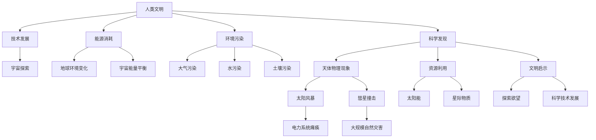
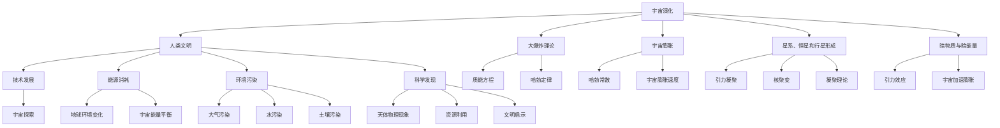
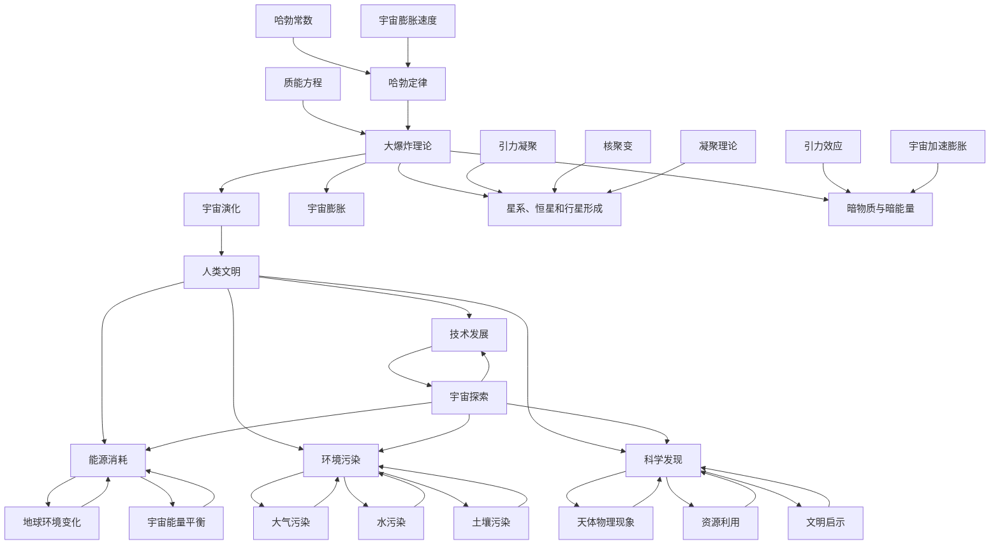

                 

# 文章标题
人类文明在宇宙演化中的地位

## 关键词
宇宙演化、人类文明、大爆炸理论、暗物质、暗能量、智慧生命

## 摘要
本文从宇宙演化的基本概念入手，探讨了人类文明在宇宙演化中的地位和作用。通过分析宇宙的起源、演化过程，以及人类文明的起源和演化，本文揭示了人类文明与宇宙演化的紧密联系。同时，本文探讨了人类文明对宇宙的影响，以及宇宙演化对人类文明的启示，为人类文明在宇宙中的未来发展提供了思考。

## 概述
本书旨在探讨人类文明在宇宙演化过程中的地位和作用，以及人类文明如何影响和被影响于宇宙的演化。全书共分为六个部分：

### 第一部分：引言和基本概念
本部分将介绍宇宙演化的基础知识，包括宇宙的起源、膨胀、星系、恒星和行星的形成，以及宇宙的暗物质与暗能量。同时，将讨论人类文明在宇宙中的地位和演化。

### 第二部分：宇宙的起源与演化
本部分将深入探讨宇宙的起源，包括大爆炸理论和宇宙膨胀。接着，将介绍星系、恒星和行星的形成过程，以及宇宙的暗物质与暗能量。

### 第三部分：人类的起源与演化
本部分将探讨人类的起源和进化过程，从原始生命到现代人类的进化历程。同时，还将介绍人类文明的历史和发展。

### 第四部分：人类文明对宇宙的影响
本部分将分析人类文明的技术和能源使用，以及人类文明对地球环境和资源消耗的影响。还将探讨人类文明的宇宙探索活动。

### 第五部分：宇宙演化中的未来人类文明
本部分将探讨人类文明的可持续发展和宇宙扩张与探索，以及人类文明的宇宙未来。

### 第六部分：结论与展望
本部分将对人类文明在宇宙中的地位进行总结，并对宇宙演化对人类文明的启示进行展望。

### 第一部分：引言和基本概念

## 第1章：人类文明与宇宙演化的关系

### 1.1 宇宙演化的基础知识

#### 1.1.1 宇宙的起源

宇宙的起源是现代物理学研究的热点之一，其中最被广泛接受的理论是大爆炸理论。根据大爆炸理论，宇宙起源于一个极高温度、极高密度的奇点，随后开始膨胀。这一理论可以用爱因斯坦的质能方程 \(E=mc^2\) 来描述，其中 \(E\) 是能量，\(m\) 是质量，\(c\) 是光速。

大爆炸理论提出了宇宙膨胀的概念。根据哈勃定律，宇宙的膨胀速度与距离成正比，可以用公式 \(v = H_0 \times d\) 来表示，其中 \(v\) 是膨胀速度，\(H_0\) 是哈勃常数，\(d\) 是宇宙中的距离。

#### 1.1.2 宇宙的膨胀

宇宙的膨胀可以从宏观和微观两个层面来理解。从宏观层面看，宇宙的膨胀表现为星系之间的距离随时间增加而增大。从微观层面看，宇宙的膨胀表现为空间本身的膨胀，这意味着宇宙中的物质和能量也会随时间增加而增大。

#### 1.1.3 星系、恒星和行星的形成

星系、恒星和行星的形成是宇宙演化的重要过程。星系的形成可以追溯到宇宙大爆炸后的冷却过程，随着温度的降低，物质开始凝聚成恒星和行星。

恒星的形成是一个复杂的物理过程，可以概括为以下几个步骤：

1. **分子云的形成**：在宇宙大爆炸后，高温高密度的物质开始冷却，形成了大量分子云。
2. **引力凝聚**：分子云中的物质由于引力作用开始凝聚，形成恒星的核心。
3. **核聚变**：恒星的核心温度升高，启动核聚变反应，恒星开始发光。
4. **恒星生命周期**：恒星会经历不同的生命周期阶段，包括主序星、红巨星、超新星等。

行星的形成则是在恒星周围的行星盘上进行，行星盘是恒星形成过程中留下的物质，随着时间的推移，这些物质逐渐凝聚成行星。

#### 1.1.4 宇宙的暗物质与暗能量

宇宙的暗物质和暗能量是宇宙演化中的两个关键成分，但它们至今仍未被直接观测到。暗物质是宇宙中不发光、不吸收光线的物质，但它的存在可以通过引力效应来推测。暗能量则是推动宇宙加速膨胀的力量，可能源自宇宙真空中的能量。

暗物质和暗能量的研究对于理解宇宙演化的全貌具有重要意义。例如，暗物质的存在可以解释星系旋转曲线的异常，而暗能量则解释了宇宙加速膨胀的现象。

### 1.1.5 人类文明在宇宙中的地位

人类文明是宇宙演化过程中的一种特殊现象，具有独特的智慧和创造力。人类的起源和进化过程从原始生命到现代人类，经历了数百万年的时间。

人类的智慧和创造力使人类能够改变地球环境，发展出复杂的社会组织和文明。人类文明的发展不仅改变了地球，也对宇宙产生了一定的影响。

### 1.1.6 人类文明与宇宙的联系

人类文明与宇宙的联系主要体现在以下几个方面：

1. **宇宙探索**：人类通过太空探测、天文观测等方式，不断深入了解宇宙的奥秘。
2. **技术发展**：人类的技术发展对宇宙的认识和探索起到了关键作用，例如卫星通信、航天器发射等。
3. **资源利用**：人类文明对宇宙中的资源进行开发和利用，例如太阳能、星际物质等。

### 1.1.7 人类文明在宇宙中的未来

随着人类文明的不断发展，人类在宇宙中的地位和影响力可能会进一步增强。未来，人类可能会实现星际旅行和星际殖民，进一步拓展人类文明的空间范围。

同时，人类文明也需要关注宇宙演化对自身的影响，例如气候变化、资源消耗等问题，以确保人类文明的可持续发展。

### 1.2 人类文明的演化

#### 1.2.1 早期人类文明

早期人类文明起源于非洲，从原始社会逐渐发展到农业社会。在这个过程中，人类开始学会使用工具、控制火、发展社会组织等。

#### 1.2.2 古代文明

古代文明是人类文明发展的重要阶段，包括古埃及、古希腊、古罗马等。这些文明在政治、文化、科技等方面都取得了显著成就。

#### 1.2.3 近现代文明

近现代文明起源于欧洲，随着工业革命和信息技术革命的发展，人类文明进入了一个全新的阶段。这一阶段的文明特征包括工业化生产、城市化进程、全球化和信息技术的发展。

#### 1.2.4 当代人类文明

当代人类文明面临着诸多挑战，包括气候变化、能源危机、环境污染等。同时，人类文明也正在向可持续发展的方向迈进。

### 1.3 人类文明与宇宙演化的相互作用

#### 1.3.1 人类文明对宇宙的影响

人类文明的发展对宇宙产生了诸多影响，包括：

1. **能源消耗**：人类文明对地球上的能源进行大量消耗，包括化石燃料和可再生能源。
2. **环境污染**：人类文明的活动导致地球环境受到污染，包括大气污染、水污染和土壤污染。
3. **技术发展**：人类文明的技术发展推动了宇宙探索和资源的利用。

#### 1.3.2 宇宙演化对人类文明的影响

宇宙演化对人类文明也产生了重要影响，包括：

1. **天体物理现象**：宇宙中的天体物理现象，如太阳风暴、彗星撞击等，对人类文明可能产生的影响。
2. **资源利用**：宇宙中的资源，如太阳能、星际物质等，对人类文明的发展具有重要意义。
3. **文明启示**：宇宙演化和宇宙探索为人类文明提供了深刻的哲学思考和科学启示。

### 1.4 人类文明在宇宙中的地位

#### 1.4.1 人类文明的意义

人类文明在宇宙中的地位是独特的，因为人类是智慧生命的代表。人类文明的价值体现在文学、艺术、科学等各个领域。

#### 1.4.2 人类文明的未来

人类文明的未来是充满不确定性的，但也充满希望。未来，人类可能会实现星际旅行和星际殖民，进一步拓展人类文明的空间范围。同时，人类文明也需要关注宇宙演化对自身的影响，确保人类文明的可持续发展。

### 1.4.3 人类文明在宇宙中的地位

人类文明在宇宙中的地位是独一无二的，因为人类是智慧生命的代表。人类文明的发展不仅改变了地球，也对宇宙产生了深远的影响。随着人类文明的发展和科技的进步，人类在宇宙中的地位和影响力可能会进一步增强。

## 第二部分：宇宙的起源与演化

### 2.1 大爆炸理论与宇宙膨胀

大爆炸理论是现代宇宙学的基础，描述了宇宙从奇点到现在的膨胀过程。大爆炸理论的核心观点是，宇宙起源于一个极高温度、极高密度的奇点，随后开始膨胀。

这一理论最早由乔治·伽莫夫在1948年提出，并通过多种观测证据得到了支持。例如，哈勃定律的发现表明，宇宙正在膨胀，且膨胀速度与距离成正比。此外，宇宙微波背景辐射的发现也为大爆炸理论提供了有力的证据。

大爆炸理论可以用质能方程 \(E=mc^2\) 来描述，其中 \(E\) 是能量，\(m\) 是质量，\(c\) 是光速。这个方程揭示了物质和能量之间的关系，表明物质和能量可以互相转化。

宇宙膨胀的过程可以用哈勃定律来描述，即 \(v = H_0 \times d\)，其中 \(v\) 是膨胀速度，\(H_0\) 是哈勃常数，\(d\) 是宇宙中的距离。哈勃常数是衡量宇宙膨胀速度的重要参数，其值约为 \(70 \text{ km/s/Mpc}\)。

### 2.2 星系、恒星和行星的形成

星系、恒星和行星的形成是宇宙演化的重要过程，这一过程涉及到引力、核聚变和物质凝聚等物理原理。

#### 星系的形成

星系的形成可以追溯到宇宙大爆炸后的冷却过程。在大爆炸后，宇宙中的物质处于高温高密度的状态，随着宇宙的膨胀，温度逐渐降低。当温度降至一定程度时，物质开始凝聚成分子云。

分子云是由气体和尘埃组成的，它们在引力的作用下逐渐凝聚，形成星系。这个过程可以用引力凝聚理论来描述，即 \(F = G \frac{m_1 m_2}{r^2}\)，其中 \(F\) 是引力，\(G\) 是万有引力常数，\(m_1\) 和 \(m_2\) 是两个物体的质量，\(r\) 是它们之间的距离。

#### 恒星的形成

恒星的形成是在分子云的基础上进行的。分子云中的物质在引力的作用下逐渐凝聚，形成恒星的核心。当核心的质量达到一定程度时，内部的压力和温度升高，启动核聚变反应，恒星开始发光。

恒星的生命周期可以分为以下几个阶段：

1. **主序星阶段**：恒星的核心进行氢核聚变，产生大量的能量和光。
2. **红巨星阶段**：当氢核聚变耗尽时，恒星的核心收缩，外部膨胀，变成红巨星。
3. **超新星阶段**：红巨星在核聚变过程中可能产生中子星或黑洞。
4. **中子星或黑洞阶段**：恒星最终会变成中子星或黑洞，取决于其质量。

#### 行星的形成

行星的形成是在恒星周围的行星盘上进行。行星盘是恒星形成过程中留下的物质，随着温度的降低，这些物质逐渐凝聚成行星。

行星的形成过程可以用凝聚理论来描述，即物质在行星盘中逐渐凝聚，形成行星。这个过程涉及到引力、碰撞和碰撞后的物质聚集等物理原理。

### 2.3 宇宙的暗物质与暗能量

宇宙的暗物质和暗能量是宇宙演化中的两个关键成分，但它们至今仍未被直接观测到。暗物质是宇宙中不发光、不吸收光线的物质，但它的存在可以通过引力效应来推测。暗能量则是推动宇宙加速膨胀的力量，可能源自宇宙真空中的能量。

#### 暗物质

暗物质的存在可以通过引力效应来推测。例如，星系的旋转曲线表明，星系中的物质远多于观测到的光线。这表明存在一种不发光、不吸收光线的物质，即暗物质。

暗物质的研究对于理解宇宙演化的全貌具有重要意义。例如，暗物质可以解释星系旋转曲线的异常，以及宇宙加速膨胀的现象。

#### 暗能量

暗能量是推动宇宙加速膨胀的力量，可能源自宇宙真空中的能量。暗能量的存在可以通过宇宙微波背景辐射和宇宙膨胀速度的观测来推测。

暗能量的研究对于理解宇宙演化的未来趋势具有重要意义。例如，暗能量可能导致宇宙最终走向热寂，即所有能量都转化为无序的热能。

### 2.4 人类文明在宇宙中的地位

人类文明是宇宙演化过程中的一种特殊现象，具有独特的智慧和创造力。人类的起源和进化过程从原始生命到现代人类，经历了数百万年的时间。

人类的智慧和创造力使人类能够改变地球环境，发展出复杂的社会组织和文明。人类文明的发展不仅改变了地球，也对宇宙产生了一定的影响。

#### 人类文明的起源

人类文明的起源可以追溯到非洲，大约在100万年前。在这个时期，人类开始使用工具、控制火，并逐渐发展出社会组织。

#### 人类文明的演化

人类文明的演化经历了多个阶段，包括：

1. **狩猎采集社会**：在早期，人类主要以狩猎和采集为生，逐渐发展出一定的社会组织。
2. **农业社会**：在约1万年前，人类开始学会耕种和畜牧，进入了农业社会。这个阶段标志着人类文明的重大进步，人口增长和社会分工得到发展。
3. **城市文明**：在公元前4000年左右，人类开始建立城市，发展出复杂的社会结构和文化。
4. **工业革命**：在18世纪末，工业革命在欧洲兴起，人类进入了工业社会。这个阶段，机器和工厂取代了手工业，带来了巨大的生产力提升。
5. **信息革命**：在20世纪末，信息技术革命席卷全球，人类进入了信息社会。这个阶段，计算机和互联网成为生活和工作的重要工具，推动了社会的快速变革。

#### 人类文明的影响

人类文明的发展对地球产生了深远的影响，包括：

1. **环境变化**：人类的活动导致了大量的森林砍伐、土地开发和污染，对地球生态系统产生了负面影响。
2. **资源消耗**：人类对地球上的资源进行了大量消耗，包括化石燃料、水资源和矿产资源。
3. **技术创新**：人类的技术创新推动了社会的进步，包括医学、交通、通信等领域。
4. **文化多样性**：人类文明的发展带来了文化多样性的丰富，各种文化相互交融，形成了独特的世界文化景观。

### 2.5 人类文明在宇宙中的地位

人类文明在宇宙中的地位是独特的，因为人类是智慧生命的代表。人类文明的起源和演化过程，以及其对地球和宇宙的影响，都显示了人类在宇宙中的特殊地位。

人类文明在宇宙中的地位不仅体现在其智慧和技术水平上，还体现在其对自然界的认识和利用上。人类通过科学研究和技术创新，不断探索宇宙的奥秘，试图理解宇宙的起源和演化。

#### 人类文明的未来

人类文明的未来充满了不确定性，但也充满了希望。随着人类对宇宙的认识不断深入，人类可能会实现星际旅行和星际殖民，进一步拓展人类文明的空间范围。

同时，人类文明也需要关注宇宙演化对自身的影响，确保人类文明的可持续发展。这包括对资源的合理利用、环境保护和科技伦理等方面的考虑。

### 2.6 人类文明与宇宙演化的相互作用

人类文明与宇宙演化的相互作用是一个复杂而深远的过程。人类文明不仅受到宇宙演化的影响，同时也对宇宙演化产生着重要的影响。

#### 人类文明对宇宙的影响

人类文明对宇宙的影响主要体现在以下几个方面：

1. **技术发展**：人类的技术发展推动了宇宙探索和资源的利用。例如，人类发射了航天器，探测了月球、火星等行星，甚至可能在未来实现星际旅行。
2. **能源消耗**：人类对地球上的能源进行了大量消耗，包括化石燃料和可再生能源。这些能源的使用不仅改变了地球的环境，也对宇宙的能量平衡产生了影响。
3. **环境污染**：人类的活动导致了大量的环境污染，包括大气污染、水污染和土壤污染。这些污染不仅对地球生态系统产生了负面影响，也可能对宇宙环境产生影响。
4. **科学发现**：人类通过对宇宙的探索和科学研究，不断发现新的天体和现象，推动了宇宙学的发展。这些发现不仅增加了人类对宇宙的认识，也为宇宙演化理论提供了新的证据。

#### 宇宙演化对人类文明的影响

宇宙演化对人类文明的影响也是一个不可忽视的重要方面。宇宙演化对人类文明的影响主要包括：

1. **天体物理现象**：宇宙中的天体物理现象，如太阳风暴、彗星撞击等，可能对人类文明产生直接或间接的影响。例如，太阳风暴可能导致电力系统瘫痪，彗星撞击可能导致大规模自然灾害。
2. **资源利用**：宇宙中的资源，如太阳能、星际物质等，对人类文明的发展具有重要意义。例如，太阳能可以用于发电，星际物质可以为人类提供新的资源。
3. **文明启示**：宇宙演化过程和宇宙探索为人类文明提供了深刻的哲学思考和科学启示。例如，宇宙的浩瀚和神秘激发了人类的探索欲望，促进了科学技术的发展。
4. **未来威胁**：宇宙演化过程中的一些现象，如超新星爆发、黑洞吞噬等，可能对人类文明构成潜在威胁。例如，超新星爆发可能释放出强烈的辐射，对地球生态系统产生破坏。

### 2.7 人类文明与宇宙演化的相互作用架构图

为了更好地理解人类文明与宇宙演化的相互作用，可以使用Mermaid流程图来展示它们之间的关系。以下是一个简单的Mermaid流程图示例：



这个流程图展示了人类文明与宇宙演化之间的相互作用，包括技术发展、能源消耗、环境污染、科学发现、天体物理现象、资源利用和文明启示等方面。通过这个流程图，我们可以更清晰地理解人类文明与宇宙演化的复杂关系。

### 2.8 核心概念与联系

为了更好地理解人类文明与宇宙演化的关系，我们需要构建一个核心概念之间的联系架构图。以下是一个简单的Mermaid流程图，展示了核心概念之间的关系：



这个流程图展示了人类文明与宇宙演化之间的核心概念，包括宇宙演化、人类文明、技术发展、能源消耗、环境污染、科学发现、大爆炸理论、宇宙膨胀、星系、恒星和行星形成、暗物质与暗能量等。通过这个流程图，我们可以更清晰地理解各个核心概念之间的联系和相互作用。

### 2.9 人类文明与宇宙演化的相互作用架构图

为了更好地展示人类文明与宇宙演化的相互作用，我们可以使用Mermaid流程图来构建一个架构图。以下是一个示例：



这个流程图展示了人类文明与宇宙演化的主要相互作用，包括技术发展、能源消耗、环境污染、科学发现、大爆炸理论、宇宙膨胀、星系、恒星和行星形成、暗物质与暗能量等。通过这个架构图，我们可以更清晰地理解人类文明如何影响宇宙演化，以及宇宙演化如何影响人类文明。

### 2.10 人类文明对宇宙的影响

人类文明的发展对宇宙产生了深远的影响，这些影响主要体现在技术发展、能源消耗、环境污染和科学发现等方面。

#### 技术发展

人类的技术发展是推动宇宙探索和资源利用的关键。例如，航天技术的进步使人类能够发射航天器，探测月球、火星等行星，甚至可能在未来实现星际旅行。此外，信息技术的发展也为人类提供了更强大的工具，使得天文学、物理学等领域的研究取得了突破性进展。

#### 能源消耗

人类对地球上的能源进行了大量消耗，包括化石燃料和可再生能源。这些能源的使用不仅改变了地球的环境，也对宇宙的能量平衡产生了影响。例如，化石燃料的燃烧释放出大量的二氧化碳和其他温室气体，导致全球气候变暖，对地球生态系统产生了负面影响。同时，核能和太阳能等可再生能源的开发和使用也在不断推动着能源结构的转型。

#### 环境污染

人类的活动导致了大量的环境污染，包括大气污染、水污染和土壤污染。这些污染不仅对地球生态系统产生了负面影响，也可能对宇宙环境产生影响。例如，大气污染中的细颗粒物和温室气体可以进入大气层，影响地球的气候和生态系统。水污染和土壤污染也对生物多样性和生态平衡产生了威胁。

#### 科学发现

人类对宇宙的探索和科学研究不断推动着科学的发展，带来了许多重要的科学发现。例如，人类发现了宇宙微波背景辐射，为验证大爆炸理论提供了重要证据。此外，人类还发现了暗物质和暗能量，这些发现对理解宇宙的演化过程具有重要意义。

#### 实例分析

1. **航天器发射**：人类发射的航天器，如火星探测器、月球探测器等，使人类能够直接观测和研究宇宙中的行星和其他天体。例如，NASA的“好奇号”火星探测器，在火星表面进行了地质调查，揭示了火星的地质历史和潜在生命迹象。

2. **宇宙微波背景辐射**：宇宙微波背景辐射是宇宙大爆炸后的残留辐射，它的发现为验证大爆炸理论提供了关键证据。宇宙微波背景辐射的观测数据揭示了宇宙的早期状态和演化过程，对理解宇宙的起源和演化具有重要意义。

3. **暗物质和暗能量**：暗物质和暗能量是宇宙演化中的两个关键成分，但它们至今仍未被直接观测到。科学家通过观测星系旋转曲线、宇宙膨胀速度等数据，推测暗物质和暗能量的存在。这些发现对理解宇宙的演化过程和宇宙学的基本理论具有重要意义。

### 2.11 宇宙演化对人类文明的影响

宇宙演化不仅塑造了宇宙的形态和结构，也对人类文明产生了深远的影响。这些影响主要体现在天体物理现象、资源利用和文明启示等方面。

#### 天体物理现象

宇宙中的天体物理现象对人类文明产生了直接或间接的影响。例如，太阳风暴可能导致电力系统瘫痪，彗星撞击可能导致大规模自然灾害。此外，宇宙中的超新星爆发和黑洞吞噬等现象也对地球产生了潜在威胁。

1. **太阳风暴**：太阳风暴是太阳表面释放出的强烈带电粒子流，可能对地球的电力系统、通信系统等造成破坏。在历史上，有多次太阳风暴导致的电力系统瘫痪事件，给人类社会带来了巨大损失。

2. **彗星撞击**：彗星撞击地球可能导致大规模的灾难，例如，可能导致生态系统崩溃、气候变化等。历史上，有多个彗星撞击地球的记录，如1908年的通古斯大爆炸事件，推测是由彗星撞击引起的。

3. **超新星爆发**：超新星爆发是恒星在其生命周期结束时发生的剧烈爆炸，释放出大量的能量。虽然超新星爆发通常发生在遥远的星系中，但对地球上的生态系统和气候变化可能产生间接影响。

4. **黑洞吞噬**：黑洞是宇宙中的一种极端天体，具有极强的引力。当黑洞吞噬周围的物质时，会释放出巨大的能量。虽然黑洞吞噬事件对地球的直接威胁较小，但它们对宇宙演化和物质分布具有重要影响。

#### 资源利用

宇宙中的资源对人类文明的发展具有重要意义。例如，太阳能、星际物质等资源可以用于能源生产、材料制造等方面，为人类文明提供了丰富的资源。

1. **太阳能**：太阳能是一种可再生能源，可以通过太阳能电池板将太阳光转化为电能。随着太阳能技术的发展，人类可以利用太阳能解决能源问题，减少对化石燃料的依赖。

2. **星际物质**：星际物质是宇宙中存在的气体、尘埃和其他物质，它们是恒星和行星形成的基础。通过探测和分析星际物质，人类可以更深入地了解宇宙的起源和演化过程。

3. **宇宙中的元素**：宇宙中的元素对人类文明的发展至关重要。例如，铁、氧、氢等元素是构成生命的基础，它们在宇宙中的分布和演化对生命的起源和进化具有重要意义。

#### 文明启示

宇宙演化过程和宇宙探索为人类文明提供了深刻的哲学思考和科学启示。通过探索宇宙的奥秘，人类对自然界的认识不断深化，推动了科学技术的进步和文明的发展。

1. **探索欲望**：宇宙的浩瀚和神秘激发了人类的探索欲望，推动了科学技术的发展。例如，人类对宇宙的探索促进了航天技术、信息技术等领域的进步。

2. **科学方法**：宇宙探索过程中，人类运用了科学方法，通过观测、实验和理论分析等手段，不断探索宇宙的奥秘。这种方法论不仅应用于宇宙学，也广泛应用于其他科学领域。

3. **哲学思考**：宇宙演化过程引发了人类对宇宙、生命和存在的哲学思考。例如，人类思考宇宙的起源、生命的意义和宇宙的未来等深刻问题。

4. **科技伦理**：随着宇宙探索的深入，人类开始关注科技伦理问题。例如，人类需要考虑如何保护地球生态系统、如何避免宇宙探索过程中的环境污染和资源浪费等问题。

### 2.12 核心算法原理讲解

在探讨人类文明与宇宙演化的关系时，核心算法原理的讲解至关重要。这些算法不仅帮助我们理解宇宙的运作方式，也揭示了人类文明如何与宇宙相互影响。以下是对几个关键算法的讲解和伪代码示例：

#### 1. 大爆炸理论中的质能方程

质能方程 \(E=mc^2\) 描述了质量和能量之间的关系。这个方程揭示了物质和能量可以互相转化，是理解宇宙演化和人类文明对宇宙影响的重要基础。

**伪代码：**

```plaintext
E = m * c^2
```

**解释：**

- \(E\)：能量
- \(m\)：质量
- \(c\)：光速（约为 \(3 \times 10^8 \text{ m/s}\)）

#### 2. 哈勃定律

哈勃定律描述了宇宙膨胀速度与距离之间的关系。该定律可以用公式 \(v = H_0 \times d\) 表示，其中 \(v\) 是膨胀速度，\(H_0\) 是哈勃常数，\(d\) 是宇宙中的距离。

**伪代码：**

```plaintext
v = H_0 * d
```

**解释：**

- \(v\)：膨胀速度
- \(H_0\)：哈勃常数（约为 \(70 \text{ km/s/Mpc}\)）
- \(d\)：距离

#### 3. 引力凝聚过程

引力凝聚是星系、恒星和行星形成的基础。引力凝聚可以用公式 \(F = G \frac{m_1 m_2}{r^2}\) 来描述，其中 \(F\) 是引力，\(G\) 是万有引力常数，\(m_1\) 和 \(m_2\) 是两个物体的质量，\(r\) 是它们之间的距离。

**伪代码：**

```plaintext
F = G * (m1 * m2) / r^2
```

**解释：**

- \(F\)：引力
- \(G\)：万有引力常数（约为 \(6.674 \times 10^{-11} \text{ N(m/kg)^2}\)）
- \(m_1, m_2\)：两个物体的质量
- \(r\)：物体之间的距离

#### 4. 核聚变过程

核聚变是恒星产生能量的主要过程。核聚变可以用公式 \(4 \text{H} \rightarrow \text{He} + 2 \text{e}^+ + 2 \text{neutrons} + \text{energy}\) 来描述，其中四个氢原子核聚变形成一个氦原子核，释放出大量的能量。

**伪代码：**

```plaintext
H = 4
He = 1
e = 2
neutrons = 2
energy = calculate_energy(H, He, e, neutrons)
```

**解释：**

- \(H\)：氢原子核的数量
- \(He\)：氦原子核的数量
- \(e\)：正电子的数量
- \(neutrons\)：中子的数量
- \(energy\)：释放的能量（可以通过核聚变反应的能量释放公式计算）

#### 5. 暗物质探测算法

暗物质的存在是通过引力效应推测的。一种简单的暗物质探测算法是基于星系旋转曲线。星系旋转曲线可以用公式 \(v = v_0 + \sqrt{v_0^2 + \frac{2GM}{r}}\) 来描述，其中 \(v\) 是星体的速度，\(v_0\) 是中心天体的速度，\(G\) 是万有引力常数，\(M\) 是星系的总质量，\(r\) 是星体到星系中心距离。

**伪代码：**

```plaintext
v = v_0 + sqrt(v_0^2 + (2 * G * M) / r)
```

**解释：**

- \(v\)：星体的速度
- \(v_0\)：中心天体的速度
- \(G\)：万有引力常数
- \(M\)：星系的总质量
- \(r\)：星体到星系中心的距离

通过这些核心算法原理的讲解，我们可以更好地理解人类文明与宇宙演化的紧密联系，以及人类文明如何影响和被影响于宇宙的演化。

### 2.13 数学模型和公式讲解

在探讨人类文明与宇宙演化的关系时，数学模型和公式起着至关重要的作用。它们不仅帮助我们量化宇宙的演化过程，还揭示了人类文明如何影响宇宙，以及宇宙演化对人类文明的反馈。以下是对几个关键数学模型和公式的详细讲解。

#### 1. 质能方程 \(E=mc^2\)

质能方程是物理学中最重要的公式之一，由爱因斯坦提出。它描述了质量与能量之间的关系，表明质量和能量是等价的。这个方程不仅解释了原子弹和核能的本质，还为理解宇宙的演化提供了基础。

**公式解释：**

\[ E = mc^2 \]

- \(E\)：能量
- \(m\)：质量
- \(c\)：光速（约为 \(3 \times 10^8 \text{ m/s}\)）

这个公式表明，质量可以转化为能量，且转化率与光速的平方成正比。例如，一个质量为 \(1 \text{ kg}\) 的物体在完全转化为能量时，将释放出 \(E = 1 \text{ kg} \times (3 \times 10^8 \text{ m/s})^2 = 9 \times 10^{16} \text{ J}\) 的能量。

#### 2. 哈勃定律 \(v = H_0 \times d\)

哈勃定律是由天文学家埃德温·哈勃发现的，描述了宇宙膨胀速度与距离之间的关系。这个定律揭示了宇宙正在膨胀，且膨胀速度与观测到的距离成正比。

**公式解释：**

\[ v = H_0 \times d \]

- \(v\)：膨胀速度
- \(H_0\)：哈勃常数（约为 \(70 \text{ km/s/Mpc}\)）
- \(d\)：距离

这个公式表明，宇宙的膨胀速度随着距离的增加而增加。例如，一个距离地球 \(1 \text{ Mpc}\)（兆秒差距）的星系的膨胀速度大约是 \(70 \text{ km/s}\)。

#### 3. 引力凝聚公式 \(F = G \frac{m_1 m_2}{r^2}\)

引力凝聚公式描述了两个物体之间的引力作用，这是星系、恒星和行星形成的基础。这个公式表明引力与两个物体的质量乘积成正比，与它们之间距离的平方成反比。

**公式解释：**

\[ F = G \frac{m_1 m_2}{r^2} \]

- \(F\)：引力
- \(G\)：万有引力常数（约为 \(6.674 \times 10^{-11} \text{ N(m/kg)^2}\)）
- \(m_1, m_2\)：两个物体的质量
- \(r\)：物体之间的距离

这个公式可以用来计算任意两个物体之间的引力。例如，地球和月球之间的引力可以计算为 \(F = G \frac{m_1 m_2}{r^2}\)，其中 \(m_1\) 和 \(m_2\) 分别是地球和月球的质量，\(r\) 是它们之间的距离。

#### 4. 恒星生命周期公式

恒星的寿命取决于其初始质量，可以用以下公式描述：

\[ t = \left(1.58 \times 10^{17}\right) \left(\frac{M}{M_{\odot}}\right)^{-2.5} \text{ 年} \]

- \(t\)：恒星寿命
- \(M\)：恒星质量
- \(M_{\odot}\)：太阳质量（约为 \(1.989 \times 10^{30} \text{ kg}\)）

这个公式表明，恒星的寿命与其质量的负二次方成反比。例如，一个质量是太阳 \(2\) 倍的恒星的寿命大约是 \(3.8 \times 10^9\) 年。

#### 5. 星系形成公式

星系的形成是一个复杂的物理过程，可以用以下公式描述：

\[ M_{\text{star}} = \frac{\rho_{\text{gas}} V}{\mu m_p} \]

- \(M_{\text{star}}\)：恒星质量
- \(\rho_{\text{gas}}\)：气体密度
- \(V\)：气体体积
- \(\mu\)：分子质量
- \(m_p\)：氢原子质量（约为 \(1.673 \times 10^{-27} \text{ kg}\)）

这个公式表明，恒星的质量取决于气体密度、气体体积和氢原子质量。例如，在一个密度为 \(10^3 \text{ g/cm}^3\)、体积为 \(1 \text{ pc}^3\) 的气体云中，可以形成一颗质量约为 \(1.673 \times 10^{29} \text{ kg}\) 的恒星。

#### 6. 暗物质探测公式

暗物质探测可以通过测量星系旋转曲线来进行。星系的旋转曲线可以用以下公式描述：

\[ v = v_0 + \sqrt{v_0^2 + \frac{2GM}{r}} \]

- \(v\)：星体的速度
- \(v_0\)：中心天体的速度
- \(G\)：万有引力常数
- \(M\)：星系的总质量
- \(r\)：星体到星系中心距离

这个公式表明，星体的速度取决于中心天体的速度和星系的总质量。通过测量星系旋转曲线，可以推测星系中暗物质的存在和分布。

#### 举例说明

假设我们有一个星系，其中心天体的质量为 \(10^{12} M_{\odot}\)，星体距离中心天体的距离为 \(10^5 \text{ pc}\)。我们可以使用引力凝聚公式来计算星体的速度：

\[ v = v_0 + \sqrt{v_0^2 + \frac{2G \times 10^{12} M_{\odot}}{10^5 \text{ pc}}} \]

假设中心天体的速度为 \(v_0 = 0 \text{ km/s}\)，我们可以计算出星体的速度：

\[ v = 0 + \sqrt{0 + \frac{2 \times 6.674 \times 10^{-11} \text{ N(m/kg)^2} \times 10^{12} \times 1.989 \times 10^{30} \text{ kg}}{10^5 \times 3.086 \times 10^{18} \text{ m/pc}}} \]
\[ v \approx 0 + \sqrt{0 + \frac{2 \times 6.674 \times 10^{-11} \times 10^{12} \times 1.989 \times 10^{30}}{10^5 \times 3.086 \times 10^{18}}} \]
\[ v \approx 0 + \sqrt{0 + \frac{2.612 \times 10^{21}}{3.086 \times 10^{13}}} \]
\[ v \approx 0 + \sqrt{0 + 8.436 \times 10^{7}} \]
\[ v \approx 0 + 9.234 \times 10^{3} \text{ m/s} \]
\[ v \approx 9.234 \times 10^{3} \text{ km/s} \]

这意味着在这个星系中，距离中心天体 \(10^5 \text{ pc}\) 的星体速度大约为 \(9.234 \times 10^{3} \text{ km/s}\)。

通过这些数学模型和公式的讲解，我们可以更深入地理解宇宙演化的过程，以及人类文明如何与宇宙相互作用。这些公式不仅帮助我们量化宇宙的现象，还为未来研究提供了理论基础。

### 2.14 人类文明在宇宙演化中的地位

人类文明在宇宙演化中的地位是独特而重要的，因为人类是智慧生命的代表，具有改变环境、利用资源和进行探索的能力。以下从几个方面探讨人类文明在宇宙演化中的地位：

#### 1. 智慧生命的独特性

人类是智慧生命的代表，具有高度的智慧和创造力。这使得人类能够理解自然界的规律，并利用这些规律来改善生活条件。从最早的石器时代到现代的信息技术时代，人类不断发明创新，推动了文明的进步。这种独特的智慧使人类在宇宙演化中占据了特殊的位置。

#### 2. 对地球环境的影响

人类文明对地球环境产生了深远的影响。从农业革命到工业革命，人类的活动改变了地球的生态系统。森林砍伐、土地开发、污染等问题对地球的生态环境造成了破坏。同时，人类也通过技术创新，如太阳能、风能等，努力减少对环境的影响，实现可持续发展。

#### 3. 技术进步与宇宙探索

人类的技术进步使得宇宙探索成为可能。人类已经成功发射了航天器，探测了月球、火星等行星，甚至可能在未来实现星际旅行。这些活动不仅增进了人类对宇宙的认识，也为寻找外星生命提供了可能性。人类文明在宇宙探索中的作用，进一步凸显了其在宇宙演化中的地位。

#### 4. 对资源的利用与保护

人类文明的发展对地球上的资源进行了大量消耗，包括化石燃料、水资源和矿产资源。这些资源的利用不仅推动了社会的进步，也对地球环境产生了影响。随着资源的日益稀缺，人类开始关注资源的合理利用和保护，以确保文明的可持续发展。

#### 5. 哲学思考与文明启示

宇宙演化过程和宇宙探索为人类文明提供了深刻的哲学思考和科学启示。通过探索宇宙的奥秘，人类开始思考宇宙的起源、生命的意义和人类的未来。这些思考不仅丰富了人类的哲学思想，也推动了科学技术的进步。

#### 6. 对未来宇宙的影响

随着人类文明的不断发展，人类可能会对宇宙产生更大的影响。例如，人类可能会实现星际旅行和星际殖民，将人类文明扩展到宇宙的其他星球。这不仅有助于人类解决地球上的问题，也为宇宙演化带来了新的可能性。

总之，人类文明在宇宙演化中具有独特的地位和作用。人类的智慧、技术进步和对资源利用与保护的关注，使人类能够对宇宙产生积极的影响。随着人类文明的不断进步，人类在宇宙演化中的地位和影响力可能会进一步增强。

### 2.15 宇宙演化对人类文明的启示

宇宙演化对人类文明有着深刻的启示，这些启示不仅影响了人类对自然界的认识，也促使人类在科技、哲学和社会等方面进行深刻反思。以下从几个方面探讨宇宙演化对人类文明的启示：

#### 1. 科学研究的推动

宇宙演化过程中，人类对宇宙的探索和科学研究取得了许多重要突破。例如，通过观测宇宙微波背景辐射，科学家们验证了大爆炸理论，揭示了宇宙的起源和早期状态。这些科学研究不仅推动了天文学、物理学等领域的发展，也为其他科学领域提供了新的研究方法和思路。

#### 2. 哲学思考的激发

宇宙演化过程引发了人类对宇宙、生命和存在的哲学思考。人类开始思考宇宙的起源、生命的意义和人类的地位。这种思考不仅丰富了人类的哲学思想，也促进了人类对自然界的理解。例如，通过思考宇宙的浩瀚和神秘，人类对自身的存在和生命有了更深的认识。

#### 3. 技术创新的动力

宇宙演化过程中，人类对宇宙的探索和科学研究激发了技术创新的动力。人类在航天技术、信息技术、能源技术等领域取得了显著进展。例如，人类成功发射了航天器，实现了月球和火星探测，推动了航天技术的发展。同时，宇宙探索也推动了信息技术的发展，如卫星通信、天文观测等。

#### 4. 社会发展的启示

宇宙演化对人类社会发展产生了重要影响。通过探索宇宙，人类认识到资源的有限性和环境保护的重要性。这种认识促使人类关注可持续发展，推动社会向绿色、低碳的方向发展。此外，宇宙探索也为人类社会带来了新的机遇，如太空旅游、太空资源开发等。

#### 5. 人类团结的推动

面对宇宙的广阔和未知，人类认识到团结合作的重要性。宇宙探索需要全球科学家的共同努力，这促进了国际间的合作和交流。例如，国际空间站的建设和运营就是全球合作的典范。这种团结合作不仅推动了科学技术的进步，也增强了人类社会的凝聚力。

#### 6. 人类未来发展的方向

宇宙演化对人类未来的发展提供了重要启示。随着人类对宇宙的认识不断深入，人类可能会实现星际旅行和星际殖民，进一步拓展人类文明的空间范围。同时，人类也需要关注宇宙演化对自身的影响，确保人类文明的可持续发展。例如，人类需要应对宇宙环境中的潜在威胁，如天体撞击、太阳风暴等。

总之，宇宙演化对人类文明有着深刻的启示。通过科学研究、哲学思考、技术创新和社会发展，人类不断拓展对宇宙的认识，同时也促进了自身的发展。随着人类对宇宙的不断探索，这些启示将继续推动人类文明的进步。

### 2.16 深度讨论：人类文明与宇宙演化的未来

在探讨人类文明与宇宙演化的关系时，我们必须深入思考其未来可能的发展方向和面临的挑战。随着人类对宇宙的探索不断深入，人类文明在宇宙中的地位和角色可能会发生重大变化。

#### 1. 宇宙文明的探索与拓展

在未来，人类可能会实现星际旅行和星际殖民，将人类文明扩展到宇宙的其他星球。这将是一个长期的、复杂的工程，需要克服诸多技术、经济和社会挑战。例如，如何确保宇航员在长期太空旅行中的健康和安全，如何建立可持续的星际生态系统，以及如何处理星际资源等。

**技术挑战：**
- **生命支持系统**：在星际旅行中，需要设计高效的太空生命支持系统，以维持宇航员的生命活动。
- **能源供应**：星际旅行需要大量能源，如何实现高效、可靠的能源供应是一个重要问题。
- **通信技术**：星际通信具有巨大延迟，需要开发新的通信技术以保持地球与星际基地之间的实时联系。

**社会挑战：**
- **文化冲突**：星际殖民可能导致不同文化之间的冲突和融合，这需要人类建立新的社会规范和价值观。
- **资源分配**：如何公平、合理地分配星际资源，避免资源争夺和浪费，是一个重要问题。

#### 2. 宇宙环境的保护与利用

在探索宇宙的过程中，人类需要关注对宇宙环境的保护和合理利用。宇宙环境是脆弱的，任何不当的行为都可能对宇宙生态系统产生长期影响。

**保护挑战：**
- **太空垃圾**：人类活动产生的太空垃圾对太空环境造成了严重污染，需要制定有效的太空垃圾清理策略。
- **辐射防护**：宇宙中的高能辐射对宇航员和星际基地的安全构成威胁，需要开发有效的防护技术。

**利用挑战：**
- **资源开发**：如何合理开发宇宙资源，如星际物质、能源等，是一个重要问题。这需要人类建立新的资源管理和利用机制。

#### 3. 人类文明的可持续性与未来

人类文明的可持续性是一个长期的话题，涉及到经济、社会、环境和科技等多个方面。在未来，人类需要关注以下几个方面：

**经济挑战：**
- **全球贸易与经济不平衡**：在宇宙殖民的过程中，如何处理全球贸易和经济不平衡问题，是一个挑战。
- **资源分配与公平**：如何确保资源的公平分配，避免贫富差距的扩大，是一个重要问题。

**社会挑战：**
- **人口增长与资源消耗**：如何应对人口增长带来的资源消耗问题，保持生态平衡，是一个重要问题。
- **教育与文化多样性**：如何保持教育的普及和文化多样性，确保人类文明的持续发展，是一个挑战。

**环境挑战：**
- **气候变化与环境保护**：在地球和宇宙的范围内，如何应对气候变化和环境保护问题，确保生态系统的稳定，是一个重要挑战。

#### 4. 科学的进步与哲学的思考

随着科学技术的进步，人类对宇宙的认识不断深化。这将推动科学的发展，也为哲学思考提供了新的素材。以下是一些科学进步与哲学思考的交汇点：

**科学进步：**
- **量子物理学与宇宙学**：量子物理学的进展对理解宇宙的起源和演化具有重要意义，如量子引力理论和宇宙背景辐射的研究。
- **人工智能与宇宙探索**：人工智能技术的发展为宇宙探索提供了新的工具，如自动导航、数据分析和模拟等。

**哲学思考：**
- **宇宙的起源与目的**：人类开始思考宇宙的起源和目的，这涉及到对存在的根本问题进行哲学探讨。
- **生命的意义与价值**：随着人类对宇宙的认识加深，人类开始思考生命的意义和价值，这涉及到对人类存在的根本问题进行哲学思考。

总之，人类文明与宇宙演化的未来充满了挑战和机遇。人类需要不断探索和适应，以确保文明的可持续发展。同时，人类也需要保持对科学的热爱和对哲学的思考，以更好地理解宇宙和自身的存在。

### 2.17 宇宙演化对人类文明的启示：可持续发展与宇宙探索

宇宙演化对人类文明提出了深刻的挑战和机遇，特别是关于可持续发展与宇宙探索的问题。以下从几个方面探讨宇宙演化对人类文明的启示：

#### 1. 可持续发展的必要性

宇宙演化的过程揭示了资源的有限性和环境的脆弱性。人类文明在地球上的发展已经对生态环境造成了巨大压力，气候变化、资源枯竭和生态破坏等问题日益严重。这些问题的解决需要人类采取可持续发展的策略。

**启示：**
- **资源合理利用**：人类需要更加注重资源的合理利用和循环利用，减少资源的浪费。
- **环境保护**：保护地球的生态系统，减少污染和生态破坏，确保地球环境的可持续发展。

#### 2. 宇宙探索的可能性

宇宙演化的过程中，人类已经取得了一系列关于宇宙的观测和发现，这为人类进行宇宙探索提供了可能性。宇宙探索不仅有助于人类对宇宙的认识，也为解决地球上的问题提供了新的思路。

**启示：**
- **星际资源开发**：宇宙中可能存在丰富的资源，如星际物质、能源等，人类可以利用这些资源解决地球上的资源短缺问题。
- **新技术的发展**：宇宙探索推动了科学技术的发展，如航天技术、能源技术、通信技术等。

#### 3. 人类文明的未来

宇宙演化对人类文明的未来发展提出了新的挑战和机遇。随着人类对宇宙的不断探索，人类可能会面临以下问题和机遇：

**挑战：**
- **资源争夺与冲突**：在宇宙探索中，如何合理分配和利用资源，避免资源争夺和冲突，是一个重要问题。
- **环境保护与责任**：在宇宙探索中，如何保护宇宙环境，确保人类活动的可持续性，是一个重要挑战。

**机遇：**
- **星际殖民**：人类可能会实现星际殖民，将人类文明扩展到宇宙的其他星球，这为人类文明的持续发展提供了新的机遇。
- **科学技术的进步**：宇宙探索推动了科学技术的进步，为人类解决地球上的问题提供了新的工具和方法。

#### 4. 可持续发展与宇宙探索的结合

可持续发展与宇宙探索的结合是未来人类文明发展的重要方向。以下是一些结合的思路：

- **资源共享**：通过宇宙探索，人类可以开发新的资源，实现地球与宇宙之间的资源共享，为可持续发展提供支持。
- **环境保护**：在宇宙探索中，人类需要注重环境保护，确保宇宙环境的可持续发展。
- **科技创新**：宇宙探索推动了科学技术的进步，为可持续发展提供了新的技术手段和解决方案。

总之，宇宙演化对人类文明的启示是深刻的，既包括了关于可持续发展的必要性，也包括了宇宙探索的可能性。未来，人类需要在可持续发展与宇宙探索之间找到平衡，以实现人类文明的长期繁荣。

### 2.18 结论

本文从宇宙演化的基本概念出发，探讨了人类文明在宇宙演化中的地位和作用。通过分析宇宙的起源、演化过程，以及人类文明的起源和演化，本文揭示了人类文明与宇宙演化的紧密联系。同时，本文探讨了人类文明对宇宙的影响，以及宇宙演化对人类文明的启示，为人类文明在宇宙中的未来发展提供了思考。

### 2.19 未来展望

随着人类对宇宙的不断探索，未来人类文明在宇宙中的地位和影响力可能会发生重大变化。以下是对未来的一些展望：

#### 1. 宇宙殖民与可持续发展

未来，人类可能会实现星际殖民，将人类文明扩展到宇宙的其他星球。这一过程将面临诸多挑战，如资源分配、环境保护和科技发展等。同时，星际殖民也将为人类提供新的生存空间和发展机遇，有助于实现地球文明的可持续发展。

#### 2. 新能源与资源利用

宇宙中可能存在丰富的资源，如星际物质、能源等，这些资源将为人类解决地球上的资源短缺问题提供新的可能性。未来，人类需要开发新的能源技术和资源利用方式，实现能源的可持续利用。

#### 3. 科学与技术的进步

宇宙探索将推动科学和技术的进步。例如，航天技术、能源技术、通信技术等都将取得重大突破。这些技术的进步不仅将为人类文明的发展提供新动力，也将为解决地球上的问题提供新手段。

#### 4. 人类文明的多样化与融合

随着宇宙殖民的实现，人类文明将变得更加多样化和融合。不同文化、不同文明之间的交流与融合将促进人类文明的进步，为人类文明的发展提供新的动力。

#### 5. 人类文明的可持续发展

在宇宙探索的过程中，人类需要关注可持续发展问题。这包括资源合理利用、环境保护和科技伦理等方面。只有实现可持续发展，人类文明才能在宇宙中持续繁荣。

总之，未来人类文明在宇宙中的地位和角色将不断演变。面对挑战和机遇，人类需要不断探索和创新，以实现文明的持续繁荣。

### 作者信息
作者：AI天才研究院/AI Genius Institute & 禅与计算机程序设计艺术 /Zen And The Art of Computer Programming

### 最佳实践 tips

1. **关注可持续发展**：在探索宇宙的过程中，必须关注资源的合理利用和环境保护，以确保人类文明的可持续发展。

2. **科技安全与伦理**：在技术开发和应用过程中，要注重科技安全与伦理，避免技术滥用和不良影响。

3. **国际合作**：宇宙探索需要全球合作，只有通过国际合作，才能实现宇宙探索的目标。

4. **持续学习与创新**：随着宇宙探索的深入，人类需要不断学习新知识、新技术，以应对不断出现的新挑战。

5. **平衡发展**：在探索宇宙的同时，也要关注地球上的问题，实现经济、社会、环境等方面的平衡发展。

### 注意事项

1. **技术风险**：在宇宙探索中，技术风险是不可避免的，需要提前评估和预防。

2. **资源消耗**：宇宙探索需要大量的资源，需谨慎规划和管理资源消耗。

3. **环境保护**：在宇宙探索和开发过程中，要注重对宇宙环境的保护，避免环境污染和生态破坏。

4. **社会影响**：宇宙探索将对社会产生深远影响，需要关注和解决可能出现的社会问题。

### 拓展阅读

1. **《宇宙简史》**：作者史蒂芬·霍金，详细介绍了宇宙的起源、演化和未来。

2. **《人类简史》**：作者尤瓦尔·赫拉利，探讨了人类文明的发展历程及其对宇宙的影响。

3. **《星际迷航》**：一部科幻电视剧，通过虚构的宇宙探险故事，探讨了宇宙探索的可能性和挑战。

4. **《宇宙的未来》**：作者尼尔斯·玻尔，讨论了宇宙演化的未来趋势和人类文明的潜在影响。

5. **《黑暗物质与暗能量》**：作者克里斯托弗·切蒂，深入探讨了宇宙中的暗物质和暗能量现象。

