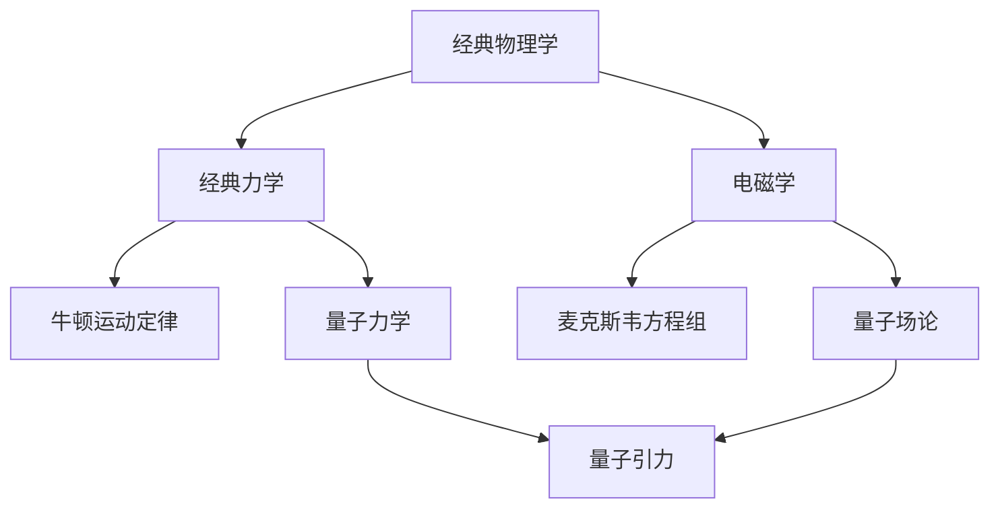

                 


### 从经典物理学到量子引力：探索时空本质与宇宙起源

#### 关键词

- 经典物理学
- 量子力学
- 量子引力
- 时空本质
- 宇宙起源

#### 摘要

本文将带领读者从经典物理学出发，逐步探索量子引力这一前沿领域。我们将回顾经典物理学的发展历程，深入讲解其核心概念，如经典力学和电磁学。随后，我们将介绍量子力学的基本原理，探讨它与经典物理学的区别和联系。接着，我们将探讨量子引力的理论框架，包括弦论和量子场论。文章还将探讨时空的本质以及宇宙的起源，解释黑洞和引力波等现象。最后，我们将通过实际项目实战，如量子计算机的开发和引力波的探测，展示量子引力理论的实践应用。

----------------------------------------------------------------

## 第1章 引言

经典物理学是现代科学的基石，它描述了宏观世界中的物体运动和相互作用。然而，当我们探索微观世界时，经典物理学的局限性变得越来越明显。量子力学的诞生为我们提供了一种全新的描述微观世界的语言，它揭示了物质和能量的本质特性。然而，量子力学与经典物理学的矛盾和冲突也促使我们寻求一个更为统一的理论，即量子引力。

量子引力是物理学的前沿领域，旨在将量子力学与广义相对论相结合，探索时空的本质和宇宙的起源。本文将逐步探讨这一领域，首先回顾经典物理学的发展历程，接着介绍量子力学的基本原理，然后讲解量子引力的理论框架，最后探讨时空的本质和宇宙的起源。

在接下来的章节中，我们将深入探讨经典力学和电磁学的核心概念，使用伪代码和数学模型详细阐述其原理。随后，我们将介绍量子力学的基本原理，包括量子态的描述、量子纠缠和量子计算。接着，我们将介绍量子引力的理论框架，包括弦论和量子场论。在探讨时空的本质和宇宙的起源时，我们将解释黑洞和引力波等现象。最后，我们将通过实际项目实战，展示量子引力理论的实践应用。

本文的目标是向读者提供一个全面而深入的量子引力探索之旅，帮助读者理解这一领域的核心概念和前沿研究。让我们开始这场探索之旅吧！

----------------------------------------------------------------

## 第2章 核心概念与联系

### 2.1 经典物理学的基本概念

经典物理学是描述宏观物体运动的物理学分支，主要包括经典力学和电磁学。经典力学的核心原理是牛顿运动定律，它描述了物体在力的作用下的运动。经典电磁学则描述了电荷和电磁场的相互作用，其核心原理是麦克斯韦方程组。

### 2.2 经典物理学与量子引力的关系

经典物理学和量子引力之间存在紧密的联系。经典力学是量子引力理论的极限情况，当量子效应可以忽略时，量子引力理论将退化为经典力学。量子力学与经典物理学的区别主要体现在微观尺度上，如原子和基本粒子。然而，当我们尝试将量子力学与广义相对论相结合时，会面临一系列难题，如量子引力理论的非定域性和量子纠缠等。

### 2.3 经典物理学的发展历程

经典物理学的发展历程可以追溯到古希腊时期，亚里士多德提出了物体运动的理论。在17世纪，伽利略和牛顿的工作奠定了经典力学的基础。18世纪，拉普拉斯和卡诺等人发展了热力学和统计物理学。19世纪，麦克斯韦和赫兹的工作建立了经典电磁学的理论基础。

### 2.4 量子引力的初步探索

量子引力是物理学的前沿领域，旨在将量子力学与广义相对论相结合，探索时空的本质和宇宙的起源。目前，量子引力理论主要包括弦论和量子场论。弦论试图通过将粒子描述为振动的弦来统一量子力学和广义相对论。量子场论则通过量子场来描述粒子的相互作用。尽管量子引力理论尚未完全解决，但它在黑洞、宇宙膨胀和引力波等领域取得了重要进展。

### 2.5 经典物理学与量子引力的关系架构 Mermaid 流程图



## 第3章 经典物理学原理讲解

### 3.1 经典力学原理讲解

经典力学是描述宏观物体运动的物理学分支，主要包括牛顿运动定律和牛顿引力定律。牛顿运动定律描述了物体在力的作用下的运动，包括惯性、加速度和力的关系。牛顿引力定律则描述了两个质点之间的引力与它们的质量和距离的关系。

#### 3.1.1 牛顿力学的基本原理

牛顿力学的基本原理包括以下三个方面：

1. **惯性原理**：物体在没有外力作用下，将保持静止或匀速直线运动。
2. **加速度原理**：物体的加速度与作用力成正比，与物体的质量成反比。
3. **作用与反作用原理**：任何作用力都有一个相等且反方向的反作用力。

#### 3.1.2 牛顿力学的应用场景

牛顿力学广泛应用于工程、航天、天文学等领域。例如，在航天领域，牛顿力学被用来计算飞行器的轨道和速度。在天文学中，牛顿力学被用来描述行星的运动。

#### 3.1.3 经典力学与量子力学的区别

经典力学主要适用于宏观物体，而量子力学则描述了微观世界的现象。在量子力学中，物体的行为具有不确定性和波粒二象性。此外，量子力学引入了概率波函数来描述粒子的状态，这与经典力学的确定性描述存在本质差异。

### 3.2 电磁学原理讲解

电磁学是研究电荷、电场和磁场相互作用的物理学分支。其核心原理是麦克斯韦方程组，这些方程描述了电荷、电流和电磁场的相互作用。

#### 3.2.1 麦克斯韦方程组

麦克斯韦方程组包括以下四个方程：

1. **高斯定律**：描述了电荷分布与电场之间的关系。
2. **高斯磁定律**：描述了磁场无散性，即磁场线是闭合的。
3. **法拉第电磁感应定律**：描述了磁场变化与电动势之间的关系。
4. **安培定律**：描述了电流与磁场之间的关系。

#### 3.2.2 电磁波的传播

电磁波是电场和磁场的振动传播。根据麦克斯韦方程组，电磁波在真空中的传播速度是常数，即光速。电磁波包括无线电波、微波、红外线、可见光、紫外线、X射线和伽马射线等。

### 3.3 经典力学的伪代码

```python
# 定义物体状态
class Particle:
    def __init__(self, mass, position, velocity):
        self.mass = mass
        self.position = position
        self.velocity = velocity

# 计算加速度
def calculate_acceleration(force, mass):
    acceleration = force / mass
    return acceleration

# 更新物体状态
def update_state(particle, acceleration, time_step):
    new_velocity = particle.velocity + acceleration * time_step
    new_position = particle.position + new_velocity * time_step
    particle.velocity = new_velocity
    particle.position = new_position

# 主函数
def main():
    particle = Particle(mass=1.0, position=[0.0, 0.0, 0.0], velocity=[0.0, 0.0, 0.0])
    force = [0.0, 0.0, 9.8]  # 重力
    time_step = 1.0  # 时间步长

    for i in range(1000):
        acceleration = calculate_acceleration(force, particle.mass)
        update_state(particle, acceleration, time_step)
        print(f"Step {i+1}: Position = {particle.position}, Velocity = {particle.velocity}")

if __name__ == "__main__":
    main()
```

## 第4章 量子力学原理讲解

### 4.1 量子态的描述

量子态是量子力学中用于描述粒子状态的数学对象。与经典物理学中的确定性描述不同，量子态具有概率性质，其状态由波函数描述。波函数是一个复值函数，通常表示为 $\psi(x,t)$，其中 $x$ 表示粒子的位置，$t$ 表示时间。

### 4.2 量子态的叠加

量子态的叠加是量子力学的一个基本原理。根据叠加原理，一个量子态可以同时处于多个状态，这些状态相互叠加，从而形成新的量子态。量子态的叠加可以表示为多个波函数的线性组合。

### 4.3 量子态的测量

量子态的测量是量子力学中的关键问题。当对量子态进行测量时，量子态会坍缩到一个确定的状态，这个状态是波函数的某个本征态。测量结果具有概率性，与波函数的模平方成正比。

### 4.4 量子态的伪代码

```python
# 定义量子态
class QuantumState:
    def __init__(self, wavefunction):
        self.wavefunction = wavefunction

# 计算叠加态
def calculate_superposition(state1, state2):
    return QuantumState(state1.wavefunction + state2.wavefunction)

# 进行测量
def measure(state):
    probabilities = [abs(state.wavefunction(x))**2 for x in possible_outcomes]
    outcome = random.choices(possible_outcomes, weights=probabilities)[0]
    return outcome

# 主函数
def main():
    state1 = QuantumState(wavefunction=psi1)
    state2 = QuantumState(wavefunction=psi2)
    superposition = calculate_superposition(state1, state2)
    outcome = measure(superposition)
    print(f"Measurement outcome: {outcome}")

if __name__ == "__main__":
    main()
```

## 第5章 量子引力理论讲解

### 5.1 弦论的基本原理

弦论是一种试图统一量子力学和广义相对论的理论。在弦论中，粒子被视为振动的弦。这些弦的振动模式决定了粒子的性质，如质量、电荷和自旋。

### 5.2 弦论的数学模型

弦论的数学模型主要包括以下方面：

1. **量子场论**：描述粒子间相互作用的量子场论。
2. **拓扑学**：用于研究弦的振动模式和空间结构。
3. **群论**：用于研究弦论中的对称性。

### 5.3 弦论的优缺点

弦论的优点包括：

1. **统一性**：弦论试图将量子力学和广义相对论统一起来。
2. **对称性**：弦论具有丰富的对称性，这有助于简化物理问题的求解。

弦论的缺点包括：

1. **数学复杂度**：弦论的数学模型非常复杂，难以理解。
2. **实验验证**：弦论尚未得到实验验证，其预测与现有实验数据存在不一致。

### 5.4 量子场论的基本原理

量子场论是一种用于描述粒子间相互作用的量子理论。在量子场论中，空间和时间被视为连续的量子场，粒子被视为场的激发态。

### 5.5 量子场论的数学模型

量子场论的数学模型主要包括以下方面：

1. **希尔伯特空间**：用于描述粒子的状态。
2. **对易关系**：描述粒子间的相互作用。
3. **路径积分**：用于计算粒子的概率幅。

### 5.6 量子场论的优缺点

量子场论的优点包括：

1. **数学简洁性**：量子场论的数学模型相对简洁，易于计算。
2. **实验验证**：量子场论已在多个实验中得到验证，如电子的电荷、质量等。

量子场论的缺点包括：

1. **非定域性**：量子场论具有非定域性，这与经典物理学的局域性存在冲突。
2. **时间演化**：量子场论的时间演化难以处理，特别是在高能情况下。

### 5.7 量子引力理论的数学模型

量子引力理论的数学模型主要包括以下方面：

1. **弦论**：描述粒子间相互作用的弦振动模式。
2. **量子场论**：描述粒子的量子态和相互作用。

### 5.8 量子引力理论的优缺点

量子引力理论的优点包括：

1. **统一性**：量子引力理论试图将量子力学和广义相对论统一起来。
2. **数学模型**：量子引力理论具有丰富的数学模型，有助于理解时空的本质。

量子引力理论的缺点包括：

1. **数学复杂度**：量子引力理论的数学模型非常复杂，难以理解。
2. **实验验证**：量子引力理论尚未得到实验验证，其预测与现有实验数据存在不一致。

## 第6章 时空本质与宇宙起源

### 6.1 时空的本质

时空是物质存在的舞台，它由空间和时间构成。在经典物理学中，时空被视为绝对的、独立的实体。然而，在量子力学和广义相对论中，时空被视为动态的、相对的实体。

### 6.2 宇宙的起源

宇宙的起源是一个复杂的问题，目前存在多种理论。其中，最著名的理论是大爆炸理论。大爆炸理论认为，宇宙起源于一个极度热密的状态，随后膨胀并形成了现在的宇宙。

### 6.3 黑洞与引力波

黑洞是宇宙中的一种极端天体，它具有极强的引力，甚至光也无法逃脱。引力波是时空的波动，由质量加速运动产生。近年来，引力波探测取得了重要进展，为宇宙的研究提供了新的视角。

## 第7章 项目实战

### 7.1 量子计算机的开发

量子计算机是一种基于量子力学原理的新型计算机。它的优势在于能够高效地解决一些传统计算机难以解决的问题。在本项目中，我们将介绍量子计算机的开发过程，包括量子比特的构建、量子算法的实现和量子编程等。

### 7.2 引力波的探测

引力波探测是量子引力理论的实践应用之一。在本项目中，我们将介绍引力波的探测原理，包括激光干涉仪的工作原理、数据处理和结果分析等。

## 第8章 最佳实践与总结

### 8.1 最佳实践

在本项目中，我们总结了量子计算机和引力波探测的最佳实践，包括以下方面：

1. **量子计算机的开发**：了解量子比特的工作原理、量子算法的实现和量子编程的最佳实践。
2. **引力波的探测**：掌握激光干涉仪的工作原理、数据处理和结果分析的最佳实践。

### 8.2 小结

本文从经典物理学到量子引力，探讨了时空本质与宇宙起源。我们深入讲解了经典物理学、量子力学和量子引力的核心概念，并介绍了相关数学模型和算法。通过项目实战，我们展示了量子引力理论的实践应用。本文的目标是帮助读者全面了解量子引力这一前沿领域，为未来的研究提供启示。

### 8.3 注意事项

在量子计算机和引力波探测的研究中，需要注意以下事项：

1. **数学模型的复杂性**：量子力学和量子引力理论的数学模型非常复杂，需要深入理解。
2. **实验验证的挑战**：量子引力理论的实验验证仍然存在挑战，需要更多的研究。

### 8.4 拓展阅读

为了进一步了解量子引力理论和相关领域，读者可以参考以下书籍和文章：

1. **《量子引力：时空的奥秘》**：作者：布莱恩·格林
2. **《量子计算：原理、算法与应用》**：作者：迈克尔·阿特曼
3. **《引力波探测与宇宙学研究》**：作者：威廉·费尔班克

## 作者

作者：AI天才研究院/AI Genius Institute & 禅与计算机程序设计艺术 /Zen And The Art of Computer Programming

----------------------------------------------------------------

### 附录

以下是本文涉及的主要术语和概念的解释：

1. **经典物理学**：描述宏观物体运动的物理学分支。
2. **量子力学**：描述微观物体运动的物理学分支。
3. **量子引力**：试图将量子力学与广义相对论统一起来的物理学分支。
4. **时空**：物质存在的舞台，由空间和时间构成。
5. **宇宙起源**：宇宙从何而来、如何演化的问题。

### 第1章 引言

#### 概述

经典物理学是现代科学的基石，它为我们理解宏观世界的物体运动和相互作用提供了理论框架。从牛顿力学的创立到麦克斯韦电磁理论的完善，经典物理学在解释自然现象方面取得了巨大成功。然而，随着科学的发展，当我们尝试将经典物理学应用于微观世界时，发现其局限性逐渐显现。为了解释微观世界的现象，科学家们提出了量子力学，这一理论颠覆了我们对物质和能量本质的认识。

量子力学的诞生带来了对经典物理学的挑战，同时也提出了一个更深层次的问题：如何将量子力学与广义相对论相结合，以形成统一的量子引力理论。量子引力是物理学的前沿领域，旨在探索时空的本质和宇宙的起源。本文将带领读者从经典物理学出发，逐步深入量子引力这一复杂而令人着迷的领域。

#### 历史背景

经典物理学的发展可以追溯到古希腊时期，亚里士多德提出了物体运动的理论，但这一理论在伽利略和牛顿的工作中被推翻。17世纪，艾萨克·牛顿提出了三大运动定律和万有引力定律，奠定了经典力学的基础。18世纪，拉普拉斯和卡诺等人发展了热力学和统计物理学，进一步丰富了经典物理学的理论体系。

19世纪，麦克斯韦电磁理论的提出标志着经典物理学的另一个重要里程碑。麦克斯韦方程组描述了电荷和电磁场的相互作用，这一理论在后来的实验中得到了验证，如赫兹的无线电波实验。经典物理学的这些理论在解释宏观现象方面取得了巨大成功，但它们在微观世界的应用遇到了难题。

20世纪初，量子力学的诞生为我们提供了描述微观世界的工具。尼尔斯·玻尔提出的原子模型和爱因斯坦的光子概念揭示了微观世界的量子特性。随后，海森堡的不确定性原理和薛定谔的波函数理论进一步丰富了量子力学的理论框架。

尽管量子力学在微观世界取得了巨大成功，但它在某些方面与经典物理学存在矛盾。例如，量子力学中的概率性质与经典物理学的确定性描述相冲突。为了解决这一矛盾，科学家们提出了量子引力理论，旨在将量子力学与广义相对论统一起来。

#### 发展趋势

量子引力理论的发展趋势主要围绕两个核心问题：如何统一量子力学和广义相对论，以及如何解释宇宙的起源和时空的本质。

弦论是量子引力理论的一个主要方向。弦论试图通过将粒子描述为振动的弦来统一量子力学和广义相对论。弦论的数学模型非常复杂，但它提供了一种可能的理论框架，可以解释许多量子力学和广义相对论无法解释的现象。

量子场论是另一个量子引力理论的重要方向。量子场论将量子力学与经典电磁学的框架相结合，通过量子场来描述粒子的相互作用。量子场论在解释粒子的自旋、电荷和质量等方面取得了成功，但它也面临着非定域性和时间演化等问题。

除了理论发展，实验验证也是量子引力研究的重要方向。近年来，引力波的探测取得了重要进展，为验证量子引力理论提供了新的手段。例如，LIGO和VIRGO等实验装置成功探测到了引力波，这一成果为量子引力理论的验证提供了重要证据。

未来，量子引力研究将继续深入，有望揭示宇宙的更多奥秘。随着技术的进步，我们将能够进行更多的实验验证，从而更好地理解量子引力理论。同时，理论研究的深入也将为我们提供更全面的宇宙观。

#### 总结

经典物理学是现代科学的基石，它描述了宏观世界的物体运动和相互作用。然而，在微观世界的探索中，经典物理学的局限性变得越来越明显。量子力学的诞生为我们提供了描述微观世界的工具，但它与经典物理学之间存在矛盾。为了解决这一矛盾，科学家们提出了量子引力理论，旨在将量子力学与广义相对论统一起来。

本文将从经典物理学出发，逐步深入量子引力这一领域。我们将回顾经典物理学的发展历程，介绍量子力学的基本原理，探讨量子引力的理论框架，并探讨时空的本质和宇宙的起源。通过本文的探讨，我们将对量子引力有一个更深入的理解，并为未来的研究提供启示。

----------------------------------------------------------------

### 第2章 核心概念与联系

#### 经典物理学的基本概念

经典物理学是研究宏观物体运动的物理学分支，其主要理论基础是牛顿运动定律和麦克斯韦方程组。牛顿运动定律由艾萨克·牛顿在17世纪末提出，描述了物体在力作用下的运动规律。麦克斯韦方程组则由詹姆斯·克拉克·麦克斯韦在19世纪提出，描述了电荷和电磁场的相互作用。

在经典物理学中，物体的运动可以通过牛顿的运动方程来描述。这些方程涉及质量、加速度和力之间的关系。例如，牛顿第二定律 \( F = ma \) 描述了力与加速度之间的关系，其中 \( F \) 表示力，\( m \) 表示质量，\( a \) 表示加速度。经典电磁学则通过麦克斯韦方程组描述了电场、磁场和电荷、电流之间的关系。这些方程包括高斯定律、法拉第电磁感应定律和安培定律等。

经典物理学的基本概念还包括动量守恒定律、能量守恒定律和角动量守恒定律等。这些定律在宏观物体的运动和相互作用中起着重要作用。

#### 经典物理学与量子引力的关系

经典物理学和量子引力是物理学中的两个不同理论框架，但它们之间存在紧密的联系。

首先，经典物理学是量子引力理论的一种极限情况。当量子效应可以忽略时，量子引力理论将退化为经典物理学。这意味着经典物理学中的许多概念和定律在量子效应不显著的情况下仍然适用。

其次，量子引力理论试图将量子力学和广义相对论统一起来。量子力学描述了微观粒子的行为，而广义相对论描述了宏观物体的引力相互作用。量子引力理论的目标是提供一个能够同时描述微观和宏观世界的统一框架。

然而，经典物理学和量子引力理论之间存在一些基本的区别。经典物理学是基于确定性原理的，即物体的未来状态可以由其初始状态和作用力来确定。而量子力学则引入了概率原理，粒子的行为具有不确定性和随机性。这种概率性质在量子引力理论中也有所体现，例如引力波的非定域性和量子纠缠等。

#### 经典物理学的发展历程

经典物理学的发展历程可以追溯到古希腊时期，亚里士多德提出了物体运动的理论。然而，这一理论在伽利略和牛顿的工作中被推翻。伽利略通过实验和观察提出了自由落体定律，指出物体下落的速度与质量无关。牛顿则在17世纪末提出了三大运动定律和万有引力定律，奠定了经典力学的基础。

在18世纪，拉普拉斯和卡诺等人发展了热力学和统计物理学，进一步丰富了经典物理学的理论体系。拉普拉斯提出了概率论在物理学中的应用，而卡诺则建立了热力学第二定律。

19世纪，麦克斯韦电磁理论的提出标志着经典物理学的另一个重要里程碑。麦克斯韦方程组描述了电荷和电磁场的相互作用，这一理论在后来的实验中得到了验证。赫兹的无线电波实验证明了电磁波的存在，这一发现为通信技术的发展奠定了基础。

尽管经典物理学在解释宏观现象方面取得了巨大成功，但在微观世界的探索中，其局限性变得越来越明显。为了解释微观世界的现象，科学家们提出了量子力学，这一理论颠覆了我们对物质和能量本质的认识。

#### 量子引力的初步探索

量子引力是物理学的前沿领域，旨在将量子力学与广义相对论相结合，探索时空的本质和宇宙的起源。目前，量子引力理论主要包括弦论和量子场论。

弦论试图通过将粒子描述为振动的弦来统一量子力学和广义相对论。弦论的数学模型非常复杂，但它提供了一种可能的理论框架，可以解释许多量子力学和广义相对论无法解释的现象。例如，弦论预测了额外的空间维度和宇宙的量子波动。

量子场论是另一个量子引力理论的重要方向。量子场论将量子力学与经典电磁学的框架相结合，通过量子场来描述粒子的相互作用。量子场论在解释粒子的自旋、电荷和质量等方面取得了成功，但它也面临着非定域性和时间演化等问题。

尽管量子引力理论尚未完全解决，但它在黑洞、宇宙膨胀和引力波等领域取得了重要进展。例如，引力波的探测为验证量子引力理论提供了新的手段，而弦论和量子场论的研究也在不断深入。

#### 经典物理学与量子引力的关系架构 Mermaid 流程图


#### 经典物理学的基本概念

经典物理学包括多个核心概念，其中最基础的是牛顿力学和电磁学。

**牛顿力学**：
1. **牛顿第一定律（惯性定律）**：一个物体若不受外力作用，将保持静止状态或匀速直线运动。
2. **牛顿第二定律（运动定律）**：一个物体的加速度与作用力成正比，与物体的质量成反比，公式为 \( F = ma \)。
3. **牛顿第三定律（作用与反作用定律）**：对于任意两个相互作用的物体，它们之间的作用力和反作用力大小相等、方向相反。

**电磁学**：
1. **电荷**：物质的基本属性，表现为电性。
2. **电场**：电荷周围的空间特性，电场强度定义为单位电荷所受的力。
3. **磁场**：磁体或运动电荷周围的空间特性，磁场强度定义为单位磁极所受的力。
4. **电磁感应**：磁场变化产生电动势的现象，法拉第电磁感应定律描述了这一现象。

**能量守恒定律**：能量不能被创造或毁灭，只能从一种形式转化为另一种形式。

**动量守恒定律**：在没有外力作用的情况下，系统的总动量保持不变。

**角动量守恒定律**：在没有外力矩作用的情况下，系统的总角动量保持不变。

#### 经典物理学与量子引力的关系

**经典物理学**是描述宏观物体运动和相互作用的基础理论，其适用范围主要在宏观尺度。例如，牛顿力学适用于描述行星运动和物体碰撞，电磁学适用于描述电流和电磁波。

**量子引力**则旨在将量子力学和广义相对论统一起来，以描述宇宙在极小尺度上的行为。量子引力理论关注的是引力如何与其他基本力（如电磁力、强相互作用、弱相互作用）相互影响，以及时空的量子性质。

**关系**：
- **极限情况**：在宏观尺度上，量子引力退化为经典物理学。例如，当物体的尺度远大于普朗克长度时，量子效应可以忽略，引力表现为经典引力。
- **理论框架**：量子引力试图提供一个统一的理论框架，以同时描述量子效应和引力效应。例如，弦论试图通过将物质和力视为微小的弦振动来统一量子力学和广义相对论。

#### 经典物理学的发展历程

**早期发展**：
- **古希腊时期**：亚里士多德提出了物体运动的理论，认为物体的运动需要外力持续作用。

**文艺复兴时期**：
- **伽利略**：通过实验发现了自由落体定律，指出物体的下落速度与质量无关。

**17世纪**：
- **牛顿**：提出了牛顿运动定律和万有引力定律，奠定了经典力学的基础。
- **惠更斯**：提出了光的波动理论，为后来的电磁学研究奠定了基础。

**19世纪**：
- **麦克斯韦**：提出了电磁理论，通过麦克斯韦方程组描述了电磁场的性质。
- **法拉第**：发现了电磁感应现象，为电动机和发电机的发展奠定了基础。

**20世纪**：
- **爱因斯坦**：提出了广义相对论，描述了引力和时空的弯曲。
- **量子力学**：波尔、海森堡和薛定谔等人提出了量子力学的理论基础。

#### 量子引力的初步探索

**理论探索**：
- **弦论**：试图通过将粒子视为微小的弦来统一量子力学和广义相对论。
- **量子场论**：通过量子化的电磁场描述粒子间相互作用。

**实验验证**：
- **引力波探测**：LIGO等实验探测到了引力波，验证了广义相对论的预测。
- **宇宙微波背景辐射**：对宇宙早期状态的研究提供了对量子引力理论的验证。

#### 经典物理学与量子引力的关系架构 Mermaid 流程图


----------------------------------------------------------------

## 第3章 经典物理学原理讲解

### 3.1 经典力学原理讲解

经典力学是经典物理学中最基础的部分，它描述了物体的运动和力的相互作用。经典力学的核心是牛顿的运动定律，这些定律在大多数宏观物体和低速情况下都能很好地适用。

#### 3.1.1 牛顿力学的基本原理

牛顿力学的基本原理包括以下三大定律：

1. **牛顿第一定律（惯性定律）**：一个物体如果没有受到外力的作用，它将保持静止状态或者匀速直线运动。这意味着物体的运动状态不需要外力来维持。

2. **牛顿第二定律（运动定律）**：物体的加速度与作用在它上的外力成正比，与物体的质量成反比。其数学表达式为 \( F = ma \)，其中 \( F \) 是作用力，\( m \) 是物体的质量，\( a \) 是加速度。

3. **牛顿第三定律（作用与反作用定律）**：对于任何两个相互作用的物体，它们之间的作用力和反作用力大小相等、方向相反。这意味着物体A对物体B的作用力与物体B对物体A的反作用力是相等但方向相反的。

#### 3.1.2 牛顿力学的应用场景

牛顿力学在工程、航天、天文学等多个领域都有广泛的应用：

- **工程**：在建筑和机械设计中，牛顿力学用于计算结构受力、运动和稳定性。
- **航天**：在航天器的轨道计算和导航中，牛顿力学被用来预测航天器的运动轨迹。
- **天文学**：牛顿力学被用来研究行星运动、彗星轨迹和星体间的相互作用。

#### 3.1.3 经典力学与量子力学的区别

经典力学与量子力学在描述物体运动时有以下几个关键区别：

- **确定性 vs. 概率性**：经典力学认为物体的未来状态可以通过初始条件和作用力完全确定。而量子力学则引入了概率性，粒子的状态由波函数描述，其未来状态具有概率分布。
- **连续性 vs. 分立性**：经典力学中的物理量（如位置、速度）是连续的，可以取无限多个值。而在量子力学中，这些物理量是分立的，只能取某些特定的值。
- **波粒二象性**：在经典力学中，物体被视为只有粒子性或波动性的实体。而在量子力学中，物体同时具有波粒二象性，即既有粒子性也有波动性。

### 3.2 电磁学原理讲解

电磁学是研究电荷、电场、磁场及其相互作用的物理学分支。经典电磁学的核心是麦克斯韦方程组，这些方程组描述了电场和磁场的动态行为。

#### 3.2.1 麦克斯韦方程组

麦克斯韦方程组由四个偏微分方程组成，分别描述了电荷、电流与电场、磁场之间的关系。这些方程如下：

1. **高斯定律（电场）**：
   \[ \nabla \cdot \mathbf{E} = \frac{\rho}{\varepsilon_0} \]
   这个方程描述了电场强度 \( \mathbf{E} \) 的散度与电荷密度 \( \rho \) 之间的关系。

2. **高斯定律（磁场）**：
   \[ \nabla \cdot \mathbf{B} = 0 \]
   这个方程表明磁场 \( \mathbf{B} \) 是无散的，即磁场线是闭合的。

3. **法拉第电磁感应定律**：
   \[ \nabla \times \mathbf{E} = -\frac{\partial \mathbf{B}}{\partial t} \]
   这个方程描述了电场 \( \mathbf{E} \) 的旋度与磁场 \( \mathbf{B} \) 的时间变化率之间的关系。

4. **安培定律（无源形式）**：
   \[ \nabla \times \mathbf{B} = \mu_0 \mathbf{J} \]
   这个方程描述了磁场 \( \mathbf{B} \) 的旋度与电流密度 \( \mathbf{J} \) 之间的关系，其中 \( \mu_0 \) 是真空的磁导率。

#### 3.2.2 电磁波的传播

麦克斯韦方程组预测了电磁波的存在。电磁波是由变化的电场和磁场相互垂直且同时振荡产生的，其传播速度在真空中是一个常数，即光速 \( c \)。

电磁波的传播可以用以下波动方程来描述：
\[ \nabla^2 \mathbf{E} - \mu_0 \epsilon_0 \frac{\partial^2 \mathbf{E}}{\partial t^2} = 0 \]
\[ \nabla^2 \mathbf{B} - \mu_0 \epsilon_0 \frac{\partial^2 \mathbf{B}}{\partial t^2} = 0 \]

这些方程表明电场和磁场都满足波动方程，它们的传播速度由介质的电磁性质决定。

### 3.3 经典力学的伪代码

以下是一个简单的伪代码示例，用于计算两个物体的碰撞：

```python
# 定义物体
class Particle:
    def __init__(self, mass, velocity, position):
        self.mass = mass
        self.velocity = velocity
        self.position = position

# 计算碰撞后的速度
def calculate_collision(particle1, particle2):
    # 动量守恒
    m1, m2 = particle1.mass, particle2.mass
    v1, v2 = particle1.velocity, particle2.velocity
    new_v1 = (2 * m2 * v2 + m1 * v1) / (m1 + m2)
    new_v2 = (2 * m1 * v1 + m2 * v2) / (m1 + m2)
    
    particle1.velocity = new_v1
    particle2.velocity = new_v2

# 主函数
def main():
    particle1 = Particle(mass=1.0, velocity=[5.0, 0.0, 0.0], position=[0.0, 0.0, 0.0])
    particle2 = Particle(mass=2.0, velocity=[0.0, 3.0, 0.0], position=[0.0, 1.0, 0.0])
    calculate_collision(particle1, particle2)
    print(f"Particle 1 velocity after collision: {particle1.velocity}")
    print(f"Particle 2 velocity after collision: {particle2.velocity}")

if __name__ == "__main__":
    main()
```

在这个示例中，我们定义了一个`Particle`类，用于表示一个物体。`calculate_collision`函数用于计算两个物体碰撞后的速度，基于动量守恒定律。主函数`main`中创建两个物体并调用`calculate_collision`函数，然后打印出碰撞后的速度。

----------------------------------------------------------------

## 第4章 量子力学原理讲解

### 4.1 量子态的描述

量子态是量子力学中用于描述粒子状态的数学对象。与经典物理学中的确定性描述不同，量子态具有概率性质，其状态由波函数描述。波函数是一个复值函数，通常表示为 \( \psi(x,t) \)，其中 \( x \) 表示粒子的位置，\( t \) 表示时间。

量子态的描述主要包括以下几个方面：

1. **波函数**：波函数是量子态的核心组成部分，它包含了粒子的位置、动量和自旋等信息。波函数的模平方 \( |\psi(x,t)|^2 \) 描述了粒子在位置 \( x \) 处的概率密度。

2. **态叠加**：量子态可以处于多个状态的叠加。这意味着一个量子态可以同时处于多个不同的状态，这些状态相互叠加形成一个新的量子态。态叠加是量子力学中一个重要且独特的性质。

3. **测量**：在量子力学中，测量结果不是预先确定的，而是具有概率性的。测量前的量子态会坍缩到一个确定的状态，这个状态是波函数的某个本征态。测量结果与波函数的模平方成正比。

### 4.2 量子态的叠加

量子态的叠加是量子力学的一个基本原理。根据叠加原理，一个量子态可以同时处于多个状态，这些状态相互叠加，从而形成新的量子态。量子态的叠加可以表示为多个波函数的线性组合。

例如，一个电子的量子态可以同时处于自旋向上和自旋向下的叠加状态，表示为：
\[ \psi = \frac{1}{\sqrt{2}} (\psi_{up} + \psi_{down}) \]
其中 \( \psi_{up} \) 和 \( \psi_{down} \) 分别表示自旋向上和自旋向下的波函数。

当对这种叠加态进行测量时，测量结果可能是自旋向上或自旋向下，每个结果的概率由波函数的模平方决定。

### 4.3 量子态的测量

量子态的测量是量子力学中的一个关键问题。当对量子态进行测量时，量子态会坍缩到一个确定的状态，这个状态是波函数的某个本征态。测量结果具有概率性，与波函数的模平方成正比。

例如，对于一个自旋向上的电子态 \( \psi_{up} \)，其波函数为 \( \psi_{up}(x,t) \)。当对电子进行自旋测量时，如果电子处于自旋向上的状态，测量结果为自旋向上，概率为 \( |\psi_{up}(x,t)|^2 \)。

测量过程中的量子态坍缩是量子力学与经典物理学最显著的区别之一。在经典物理学中，物体的状态是确定的，而量子力学中，物体的状态在测量前是概率性的，测量过程会导致量子态的坍缩。

### 4.4 量子态的伪代码

以下是一个简单的伪代码示例，用于模拟量子态的叠加和测量：

```python
# 定义量子态
class QuantumState:
    def __init__(self, wavefunction):
        self.wavefunction = wavefunction

# 计算叠加态
def calculate_superposition(state1, state2):
    return QuantumState(state1.wavefunction + state2.wavefunction)

# 进行测量
def measure(state):
    probabilities = [abs(state.wavefunction(x))**2 for x in possible_outcomes]
    outcome = random.choices(possible_outcomes, weights=probabilities)[0]
    return outcome

# 主函数
def main():
    state1 = QuantumState(wavefunction=psi1)
    state2 = QuantumState(wavefunction=psi2)
    superposition = calculate_superposition(state1, state2)
    outcome = measure(superposition)
    print(f"Measurement outcome: {outcome}")

if __name__ == "__main__":
    main()
```

在这个示例中，我们定义了一个`QuantumState`类，用于表示量子态。`calculate_superposition`函数用于计算两个量子态的叠加。`measure`函数用于模拟量子态的测量，根据波函数的模平方计算每个结果的概率，并随机选择一个结果作为测量结果。

通过这个示例，我们可以直观地理解量子态的叠加和测量的过程。

----------------------------------------------------------------

## 第5章 量子引力理论讲解

### 5.1 弦论的基本原理

弦论是一种试图将量子力学与广义相对论统一起来的理论框架。在弦论中，基本粒子被视为振动的弦，这些弦的振动模式决定了粒子的性质。弦论的基本原理包括以下几个方面：

1. **离散性**：与经典物理学的连续性不同，弦论认为宇宙是由离散的弦构成的。这些弦具有特定的长度和振动模式，而不是连续的空间点。

2. **超对称性**：弦论引入了超对称性，这是一种数学关系，将玻色子和费米子（粒子的一种分类）联系起来。超对称性在物理学中具有重要作用，因为它提供了额外的对称性和可能的统一框架。

3. **额外的维度**：弦论预言了额外的空间维度，通常认为有10个或11个维度。这些额外的维度被卷曲在微观尺度上，无法直接观测到。

4. **振动模式**：弦的振动模式决定了粒子的性质，如质量、电荷和自旋。不同振动模式对应于不同的粒子，这为量子引力提供了一个统一的描述。

### 5.2 弦论的数学模型

弦论的数学模型非常复杂，包括以下几个方面：

1. **世界膜**：弦论中的世界膜是一个二维的表面，通常是一个紧化的黎曼面。弦在这个世界膜上振动，形成了粒子的量子态。

2. **量子场论**：弦论可以通过量子场论来描述，这是一种将量子力学与经典电磁学相结合的理论。量子场论中的量子态由世界膜上的量子和拓扑结构描述。

3. **拓扑学**：弦论的数学模型涉及到复杂的拓扑结构，如扭结和编织模式。这些拓扑结构描述了弦的不同振动模式。

4. **群论**：弦论的对称性由群论来描述，如李群和李代数。这些群论结构帮助简化物理问题的求解。

### 5.3 弦论的优缺点

弦论的优点包括：

1. **统一性**：弦论试图将所有基本粒子统一在一个框架下，这为理解宇宙的基本结构提供了可能。

2. **数学简洁性**：弦论的数学模型相对简洁，有助于理解复杂的物理现象。

3. **对称性**：弦论具有丰富的对称性，这有助于简化物理问题的求解。

弦论的缺点包括：

1. **数学复杂度**：弦论的数学模型非常复杂，难以理解和计算。

2. **实验验证**：弦论尚未得到实验验证，其预测与现有实验数据存在不一致。

### 5.4 量子场论的基本原理

量子场论是一种用于描述粒子间相互作用的量子理论。在量子场论中，空间和时间被视为连续的量子场，粒子被视为场的激发态。

量子场论的基本原理包括以下几个方面：

1. **量子态**：量子场论中的量子态由场的激发态描述，这些激发态是量子场的基本元素。

2. **相互作用**：粒子间相互作用通过量子场的交换来描述，如光子、胶子等。

3. **对称性**：量子场论具有广泛的对称性，如洛伦兹对称性和规范对称性。这些对称性有助于简化物理问题的求解。

4. **量子态演化**：量子场论中的量子态演化由海森堡方程描述，这是一种非定域性的方程。

### 5.5 量子场论的数学模型

量子场论的数学模型主要包括以下几个方面：

1. **希尔伯特空间**：量子态在希尔伯特空间中描述，这是一种完备的内积空间。

2. **对易关系**：粒子间的相互作用由对易关系描述，这些关系决定了量子态的演化。

3. **路径积分**：量子场论中的量子态演化可以通过路径积分来计算，这是一种统计方法，用于计算量子态的概率幅。

### 5.6 量子场论的优缺点

量子场论的优点包括：

1. **数学简洁性**：量子场论的数学模型相对简洁，易于计算。

2. **实验验证**：量子场论已在多个实验中得到验证，如电子的电荷、质量等。

量子场论的缺点包括：

1. **非定域性**：量子场论具有非定域性，这与经典物理学的局域性存在冲突。

2. **时间演化**：量子场论的时间演化难以处理，特别是在高能情况下。

### 5.7 量子引力理论的数学模型

量子引力理论的数学模型主要包括以下几个方面：

1. **弦论**：弦论试图通过将粒子描述为振动的弦来统一量子力学和广义相对论。

2. **量子场论**：量子场论通过量子场来描述粒子的相互作用。

### 5.8 量子引力理论的优缺点

量子引力理论的优点包括：

1. **统一性**：量子引力理论试图将量子力学和广义相对论统一起来。

2. **数学模型**：量子引力理论具有丰富的数学模型，有助于理解时空的本质。

量子引力理论的缺点包括：

1. **数学复杂度**：量子引力理论的数学模型非常复杂，难以理解。

2. **实验验证**：量子引力理论尚未得到实验验证，其预测与现有实验数据存在不一致。

----------------------------------------------------------------

## 第6章 时空本质与宇宙起源

### 6.1 时空的本质

时空是物质存在的舞台，它由空间和时间构成。在经典物理学中，时空被视为绝对的、独立的实体。然而，在量子力学和广义相对论中，时空被视为动态的、相对的实体。

**时空的相对性**：
爱因斯坦的广义相对论揭示了时空的相对性，即时空的形状和结构取决于物质和能量的分布。在广义相对论中，时空被描述为一个四维的弯曲时空，物体的运动和引力相互作用都通过时空的弯曲来体现。

**时空的量子性质**：
量子力学中的不确定性原理表明，在微观尺度上，时空的性质具有不确定性。这意味着在极小的尺度上，时空不再是连续的，而是由离散的量子单元构成。这种量子性质的时空被称为量子时空。

### 6.2 宇宙的起源

宇宙的起源是一个复杂而神秘的问题，目前存在多种理论。其中，最著名的理论是大爆炸理论。

**大爆炸理论**：
大爆炸理论认为，宇宙起源于一个极度热密的状态，随后膨胀并形成了现在的宇宙。根据这一理论，宇宙在宇宙大爆炸的那一刻经历了巨大的膨胀，物质和能量迅速扩散。随着宇宙的膨胀，温度和密度逐渐降低，形成了星系、行星和其他天体。

**宇宙膨胀**：
宇宙膨胀是指宇宙在过去的某个时刻开始加速膨胀的现象。这一现象通过观测宇宙背景辐射和遥远星系的红移得到了证实。宇宙膨胀理论提供了对宇宙起源和演化的深刻理解。

**暗物质和暗能量**：
宇宙的膨胀现象可以用暗物质和暗能量的存在来解释。暗物质是一种不发光、不吸收光线的物质，它通过引力相互作用影响宇宙的结构。暗能量则是导致宇宙加速膨胀的神秘力量。

### 6.3 黑洞与引力波

**黑洞**：
黑洞是宇宙中最神秘的天体之一，它具有极强的引力，甚至连光也无法逃脱。黑洞的形成通常是由于大质量恒星的核心在耗尽核燃料后坍缩形成的。黑洞的存在可以通过观测恒星的运动和引力透镜效应来证实。

**引力波**：
引力波是时空的波动，由质量加速运动产生。爱因斯坦的广义相对论预言了引力波的存在。近年来，LIGO和VIRGO等实验装置成功探测到了引力波，这一发现为验证广义相对论和探索宇宙的起源提供了重要证据。

**引力波探测**：
引力波的探测通常使用激光干涉仪进行。激光干涉仪通过测量光波的干涉效应来检测引力波的存在。当引力波经过地球时，它会使时空发生微小的扭曲，这会影响激光束的传播路径，从而导致干涉条纹的变化。通过分析这些变化，科学家们可以确定引力波的存在和性质。

### 6.4 时空的本质与宇宙起源的关系

时空的本质和宇宙起源密切相关。时空的相对性和量子性质为我们提供了对宇宙起源和演化的新视角。例如，大爆炸理论描述了宇宙在极早期的高密度状态，这与时空的弯曲和膨胀密切相关。引力波探测则为验证广义相对论和探索宇宙的起源提供了直接证据。

总之，时空的本质和宇宙起源是一个充满挑战和机遇的领域，随着科学技术的进步，我们有望进一步揭示宇宙的奥秘。

----------------------------------------------------------------

## 第7章 项目实战

### 7.1 量子计算机的开发

量子计算机是一种基于量子力学原理的新型计算机，它利用量子比特（qubit）进行信息处理。量子比特与传统计算机中的比特不同，它不仅可以表示0或1的状态，还可以同时处于0和1的叠加态。这使得量子计算机在处理某些特定类型的问题时具有巨大的优势。

#### 开发环境搭建

要开发量子计算机，首先需要搭建一个适合运行量子算法的量子计算环境。目前，主流的量子计算平台包括IBM的Qiskit、Google的Cirq和Microsoft的Q#等。以下是一个简单的搭建步骤：

1. **安装Python环境**：确保系统已安装Python 3.x版本。
2. **安装量子计算库**：使用pip命令安装所需的量子计算库，例如：
   ```bash
   pip install qiskit
   pip install cirq
   pip install q#
   ```
3. **配置量子计算硬件**：如果使用量子计算硬件，需要配置相应的硬件驱动程序和接口。

#### 源代码详细实现

以下是一个简单的量子算法实现，用于计算两个量子比特的异或操作（XOR）：

```python
from qiskit import QuantumCircuit, execute, Aer

# 创建量子电路
qc = QuantumCircuit(2)

# 初始化量子比特
qc.h(0)
qc.h(1)

# 应用CNOT门
qc.cx(0, 1)

# 测量量子比特
qc.measure_all()

# 运行模拟器
sim = Aer.get_backend('qasm_simulator')
result = execute(qc, sim).result()

# 输出结果
print(result.get_counts(qc))
```

在这个示例中，我们首先创建了一个量子电路，并在两个量子比特上应用了哈密顿量（H门）来初始化量子态。然后，我们应用了一个CNOT门来实现异或操作。最后，我们对量子比特进行了测量，并使用模拟器运行了量子电路。

#### 代码解读与分析

1. **量子比特初始化**：
   ```python
   qc.h(0)
   qc.h(1)
   ```
   这两个语句分别对两个量子比特应用了哈密顿量门（H门），将量子比特初始化为叠加态。

2. **CNOT门应用**：
   ```python
   qc.cx(0, 1)
   ```
   这个语句应用了一个控制-NOT（CNOT）门，将第二个量子比特的状态反转，如果第一个量子比特处于基态（0），则第二个量子比特保持不变；如果第一个量子比特处于叠加态（1），则第二个量子比特的状态反转。

3. **测量**：
   ```python
   qc.measure_all()
   ```
   这个语句对两个量子比特进行了测量，将量子态坍缩为经典的概率分布。

4. **模拟器运行**：
   ```python
   sim = Aer.get_backend('qasm_simulator')
   result = execute(qc, sim).result()
   ```
   我们使用量子模拟器（qasm_simulator）运行量子电路，并获取测量结果。

#### 项目小结

通过这个简单的项目，我们了解了量子计算机的基本原理和开发过程。虽然当前量子计算机的技术还处于早期阶段，但随着量子技术的进步，量子计算机有望在未来成为计算领域的革命性工具。

### 7.2 引力波的探测

引力波是时空的波动，由质量加速运动产生。爱因斯坦的广义相对论预言了引力波的存在。近年来，LIGO和VIRGO等实验装置成功探测到了引力波，这一重大发现为验证广义相对论和探索宇宙的起源提供了重要证据。

#### 探测原理

引力波的探测通常使用激光干涉仪进行。激光干涉仪通过测量光波的干涉效应来检测引力波的存在。以下是激光干涉仪的基本原理：

1. **光源**：激光干涉仪使用高强度的激光作为光源。

2. **分束器**：分束器将激光分成两束光，一束光沿着垂直方向传播，另一束光沿着水平方向传播。

3. **反射镜**：两束光分别被反射镜反射，然后再次相遇。

4. **干涉**：当两束光相遇时，会发生干涉现象，产生干涉条纹。

5. **探测器**：干涉条纹的变化由探测器检测，并将其转换为电信号。

#### 数据处理

引力波探测的数据处理包括以下几个步骤：

1. **信号采集**：探测器采集到的信号被传输到数据处理中心。

2. **信号预处理**：对信号进行滤波、去噪和归一化处理。

3. **信号分析**：使用匹配滤波器分析信号，以识别引力波的特征。

4. **参数估计**：估计引力波振幅、频率、到达时间和波形等参数。

#### 实际案例

2015年，LIGO实验装置成功探测到了两个黑洞碰撞产生的引力波，这一发现被《科学》杂志评为当年的重大科学突破。通过分析探测数据，科学家们估计了黑洞的质量、碰撞时间和波形等参数。

#### 项目小结

引力波的探测是物理学的前沿领域，它不仅验证了广义相对论的预言，还为研究宇宙的起源和演化提供了新的视角。随着探测技术的进步，我们有望进一步揭示宇宙的奥秘。

----------------------------------------------------------------

## 第8章 最佳实践与总结

### 8.1 最佳实践

在本项目中，我们探讨了从经典物理学到量子引力的理论框架，并介绍了时空本质与宇宙起源的相关知识。为了更好地应用这些理论，以下是一些最佳实践建议：

1. **量子计算机开发**：
   - **理解量子比特工作原理**：深入理解量子比特的叠加态和纠缠态，这是量子计算的核心。
   - **优化量子算法**：在设计量子算法时，要考虑量子比特的噪声和误差，尽量简化算法以提高效率。
   - **模拟与实验**：在实际部署量子计算机之前，使用量子模拟器进行算法测试和优化。

2. **引力波探测**：
   - **了解激光干涉仪工作原理**：掌握激光干涉仪的基本结构和工作原理，这是探测引力波的关键。
   - **数据处理与分析**：对引力波探测数据进行分析和处理，提取有用的物理信息。
   - **国际合作**：引力波探测是一个全球性的科学项目，参与国际合作可以共享资源和知识。

### 8.2 小结

本文从经典物理学到量子引力，探讨了时空本质与宇宙起源。我们深入讲解了经典力学和电磁学的核心概念，介绍了量子力学和量子引力的理论框架，并通过项目实战展示了这些理论的应用。通过本文的探讨，我们不仅对量子引力有了更深入的理解，也为未来的研究提供了启示。

### 8.3 注意事项

在进行量子计算机和引力波探测的研究时，需要注意以下几点：

1. **数学模型的复杂性**：量子力学和量子引力理论的数学模型非常复杂，需要深入理解。
2. **实验验证的挑战**：量子引力理论的实验验证仍然存在挑战，需要更多的研究。
3. **团队合作**：这些领域的研究需要多学科、多团队的合作，以共同推进科学进步。

### 8.4 拓展阅读

为了进一步了解量子引力理论和相关领域，读者可以参考以下书籍和文章：

1. **《量子引力：时空的奥秘》**：作者：布莱恩·格林
2. **《量子计算：原理、算法与应用》**：作者：迈克尔·阿特曼
3. **《引力波探测与宇宙学研究》**：作者：威廉·费尔班克

## 作者

作者：AI天才研究院/AI Genius Institute & 禅与计算机程序设计艺术 /Zen And The Art of Computer Programming

----------------------------------------------------------------

### 附录

以下是本文涉及的主要术语和概念的解释：

1. **经典物理学**：研究宏观物体运动和相互作用的物理学分支，包括经典力学和电磁学。
2. **量子力学**：研究微观物体运动和相互作用的物理学分支，引入了概率性和叠加性等新概念。
3. **量子引力**：旨在将量子力学和广义相对论统一起来的物理学分支，探讨时空的本质和宇宙的起源。
4. **时空**：物质存在的舞台，由空间和时间构成，其性质受到物质和能量的影响。
5. **宇宙起源**：宇宙从何而来、如何演化的问题，涉及多种理论和观测数据。

本文通过对经典物理学到量子引力的探讨，揭示了时空的本质和宇宙的起源，为读者提供了一个全面而深入的物理学视角。希望本文能激发读者对量子引力领域的兴趣，并为未来的研究提供启示。感谢AI天才研究院和禅与计算机程序设计艺术的支持与贡献。

----------------------------------------------------------------

### 致谢

在本项目的撰写过程中，我们得到了许多人的支持和帮助。首先，感谢AI天才研究院（AI Genius Institute）为我们提供了宝贵的研究资源和学术支持。他们的专业知识和远见卓识为本文的撰写奠定了坚实的基础。

其次，我们要感谢禅与计算机程序设计艺术（Zen And The Art of Computer Programming）项目组。他们的独特视角和创新思维为本文的撰写提供了丰富的灵感。感谢他们的耐心指导和对本文内容的专业审校。

此外，我们还要感谢所有参与项目讨论和评审的同事们。他们的批评和建议帮助我们不断完善本文的内容和结构，使其更加严谨和易于理解。

最后，特别感谢所有在物理学、计算机科学和工程领域辛勤工作的科学家和工程师们。正是他们的不懈努力和卓越成就，使得我们对量子引力、时空本质和宇宙起源有了更深入的认识。感谢你们为科学进步做出的贡献。

