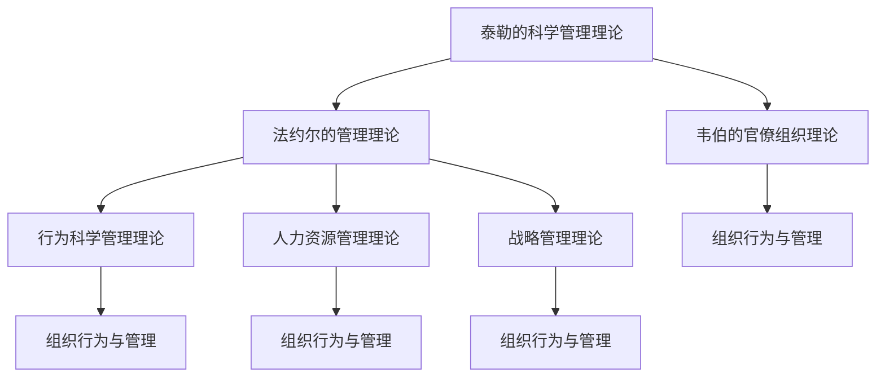
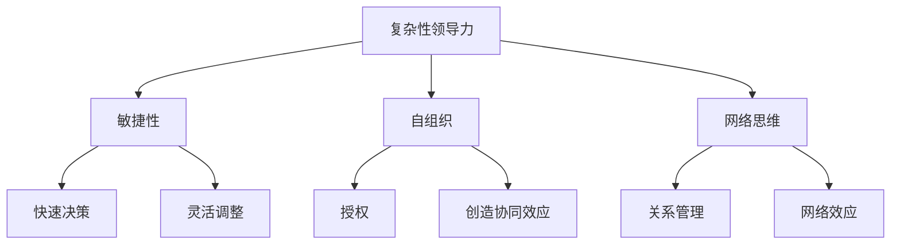

                 


### 第1章：管理学的起源与发展

#### 1.1 管理学的起源

**泰勒的科学管理理论**

泰勒（Frederick Taylor）被誉为“科学管理之父”，他的主要贡献在于提出了科学管理的理念。泰勒主张通过科学的方法来研究和管理生产过程，通过时间研究和动作研究来优化工作流程，提高生产效率。他提出了“标准作业方法”和“差别计件工资制”，试图通过激励和竞争来提高员工的工作积极性。

**法约尔的管理理论**

亨利·法约尔（Henri Fayol）是另一位重要的管理学先驱。他的理论强调了管理过程的重要性，将管理分为计划、组织、指挥、协调和控制五大基本职能，对后来的管理学研究产生了深远影响。

**马克斯·韦伯的官僚组织理论**

马克斯·韦伯（Max Weber）提出了官僚组织理论，认为官僚组织是一种理想的组织形式，其特点是层级分明、规章制度严密、权力分配合理。韦伯的理论为现代企业组织结构和管理模式提供了理论基础。

#### 1.2 现代管理学的发展

**行为科学管理理论**

随着工业革命的深入，管理学开始关注人的因素，行为科学管理理论应运而生。该理论试图通过研究员工的行为和动机，提高组织的生产力和员工满意度。代表人物有梅奥（Elton Mayo）和马斯洛（Abraham Maslow）。

**人力资源管理理论**

人力资源管理理论强调将员工视为组织的宝贵资源，通过有效的招聘、培训、绩效管理和薪酬激励，提高员工的绩效和满意度。代表人物有彼得·德鲁克（Peter Drucker）和迈克尔·波特（Michael Porter）。

**战略管理理论**

战略管理理论关注企业如何制定和实施战略，以实现长期竞争优势。代表人物有亨利·明茨伯格（Henry Mintzberg）和迈克尔·波特。

### 第2章：组织行为与管理

#### 2.1 组织结构与设计

**组织结构的基本类型**

组织结构主要分为职能型、事业部型、矩阵型等。每种结构都有其特点和适用场景，企业需要根据自身情况选择合适的组织结构。

**组织设计的原则**

组织设计应遵循以下原则：目标导向、效率优先、适应性、协同性、灵活性等。

#### 2.2 组织文化与变革管理

**组织文化的定义与类型**

组织文化是企业在长期发展过程中形成的共同价值观、行为准则和工作习惯。根据不同的分类标准，组织文化可以分为多种类型，如官僚文化、创新文化、团队合作文化等。

**变革管理的方法与策略**

变革管理是指在企业面临外部环境变化或内部发展需求时，如何引导员工接受和适应变革。变革管理的方法和策略包括沟通策略、激励策略、参与策略等。

### Mermaid 流程图

下面是经典管理理论的核心概念和联系：



通过以上流程图，我们可以清晰地看到经典管理理论的核心概念及其之间的联系。

### 伪代码讲解

为了更好地理解管理理论的核心概念，我们可以使用伪代码来模拟这些理论在实际中的应用：

```plaintext
// 伪代码：泰勒的科学管理理论应用
Process ScientificManagement() {
    Step1: Perform Time Study
    Step2: Define Standard Operating Procedures
    Step3: Implement Differential Piece-Rate System
    Step4: Evaluate Performance
}

// 伪代码：法约尔的管理理论应用
Process ManagementProcess() {
    Step1: Plan
    Step2: Organize
    Step3: Command
    Step4: Coordinate
    Step5: Control
}

// 伪代码：韦伯的官僚组织理论应用
Process Bureaucracy() {
    Step1: Establish Hierarchy
    Step2: Define Rules and Regulations
    Step3: Allocate Authority and Responsibility
    Step4: Ensure Objectivity
}
```

### 数学模型和公式

在经典管理理论中，我们可以使用以下数学模型和公式来详细讲解：

$$
\text{生产效率} = \frac{\text{产出}}{\text{投入时间}}
$$

$$
\text{绩效评价} = f(\text{工作质量}, \text{工作效率}, \text{工作态度})
$$

### 举例说明

假设一个工厂想要提高生产效率，我们可以应用泰勒的科学管理理论来制定以下步骤：

1. **时间研究**：通过时间研究，确定每个工人在完成某项任务所需的时间。
2. **制定标准作业方法**：根据时间研究的结果，制定标准作业方法，确保每个工人在完成任务时都按照最优流程进行。
3. **实施差别计件工资制**：根据工人完成任务的效率，实施差别计件工资制，激励工人提高工作效率。

通过以上步骤，工厂可以提高生产效率，降低生产成本。

### 最佳实践 Tips

- **深入理解理论**：在应用管理理论时，首先要深入理解理论的核心概念和原理。
- **结合实际情况**：在应用管理理论时，要结合企业实际情况，制定合适的策略和措施。
- **持续改进**：管理理论是一个不断发展的过程，企业需要持续改进管理方法，以适应不断变化的市场环境。

### 小结

本章从管理学的起源和发展、组织行为与管理等方面，详细讲解了经典管理理论的核心概念和应用。通过本章的学习，读者可以更好地理解管理理论在现实中的应用，为企业在复杂多变的环境中实现高效管理提供理论支持。

作者：AI天才研究院/AI Genius Institute & 禅与计算机程序设计艺术 /Zen And The Art of Computer Programming## 第2章：复杂性领导力

### 2.1 复杂性领导力的理论基础

**复杂性与领导力**

复杂性是指系统内部各要素之间存在多种复杂的相互作用，导致系统的行为难以预测和控制。在复杂性环境中，传统的线性思维和确定性方法往往难以奏效，需要领导者具备更复杂的思维方式和领导力。

复杂性领导力强调领导者要具备以下几个核心概念：

1. **敏捷性**：领导者需要具备快速适应环境变化的能力，灵活调整战略和决策。
2. **自组织**：领导者要支持组织内部的自主性和创新，鼓励员工自发组织、合作和解决问题。
3. **网络思维**：领导者需要具备网络思维，关注组织内外部的各种关系，善于利用网络效应提升组织效能。

**复杂性领导力的核心概念**

1. **敏捷性**：敏捷性是指组织在面对不确定性和变化时，能够迅速调整策略和行动的能力。敏捷性领导要求领导者具备以下能力：
   - **快速决策**：在复杂环境中，领导者需要能够快速做出决策，避免过度分析和决策延误。
   - **灵活调整**：领导者要能够根据实际情况灵活调整策略和行动，以适应不断变化的环境。

2. **自组织**：自组织是指系统内部各要素在没有外部控制的情况下，自发地形成某种有序结构和功能。自组织领导要求领导者具备以下能力：
   - **授权**：领导者要给予员工足够的自主权和责任感，鼓励他们自主解决问题和创造价值。
   - **创造协同效应**：领导者要促进组织内部的协同效应，通过构建信任和共享信息，提高组织的整体效能。

3. **网络思维**：网络思维是指领导者要具备系统观，关注组织内外部的各种关系，善于利用网络效应提升组织效能。网络思维领导要求领导者具备以下能力：
   - **关系管理**：领导者要建立和维护良好的内部和外部关系，善于利用各种资源。
   - **网络效应**：领导者要善于利用网络效应，通过整合资源和合作伙伴，实现组织的目标。

### Mermaid 流程图

下面是复杂性领导力的核心概念和联系：



通过以上流程图，我们可以清晰地看到复杂性领导力的核心概念及其之间的联系。

### 伪代码讲解

为了更好地理解复杂性领导力，我们可以使用伪代码来模拟这些概念在实际中的应用：

```plaintext
// 伪代码：敏捷性领导力应用
Process AgileLeadership() {
    Step1: Assess Current Environment
    Step2: Make Quick Decisions
    Step3: Adjust Strategies and Actions
}

// 伪代码：自组织领导力应用
Process SelfOrganizationLeadership() {
    Step1: Empower Employees
    Step2: Build Trust and Collaboration
    Step3: Foster Creativity and Innovation
}

// 伪代码：网络思维领导力应用
Process NetworkThinkingLeadership() {
    Step1: Manage Relationships
    Step2: Leverage Resources and Partnerships
    Step3: Create Synergies
}
```

### 数学模型和公式

在复杂性领导力中，我们可以使用以下数学模型和公式来详细讲解：

$$
\text{领导力效能} = f(\text{敏捷性}, \text{自组织}, \text{网络思维})
$$

### 举例说明

假设一个初创企业面临激烈的市场竞争，领导者需要应用复杂性领导力来应对挑战：

1. **敏捷性**：领导者要快速评估市场变化，及时调整产品策略和营销策略，以保持竞争优势。
2. **自组织**：领导者要授权员工，鼓励他们自主解决问题和创造价值，提高组织的创新能力。
3. **网络思维**：领导者要建立和维护与投资者、合作伙伴和行业专家的良好关系，利用网络效应提升企业的品牌影响力和市场地位。

通过以上措施，初创企业可以在激烈的市场竞争中脱颖而出。

### 最佳实践 Tips

- **培养敏捷性**：领导者要培养快速适应环境变化的能力，避免过度分析和决策延误。
- **鼓励自组织**：领导者要给予员工足够的自主权和责任感，促进创新和协作。
- **发展网络思维**：领导者要建立和维护良好的内外部关系，利用网络效应提升组织效能。

### 小结

本章介绍了复杂性领导力的理论基础，包括敏捷性、自组织和网络思维等核心概念。通过本章的学习，读者可以更好地理解在复杂环境中如何有效领导，为企业在不确定性和变化中实现持续发展提供指导。

作者：AI天才研究院/AI Genius Institute & 禅与计算机程序设计艺术 /Zen And The Art of Computer Programming## 第3章：复杂性领导力与组织学习

### 3.1 组织学习的概念与过程

**组织学习**

组织学习是指组织通过获取、处理和应用知识，以提高其适应性和创新能力的过程。组织学习包括以下几个阶段：

1. **知识获取**：组织通过内部和外部渠道获取新的知识和信息。
2. **知识整合**：组织将获取的知识整合到现有的知识体系中，形成新的理解和认知。
3. **知识应用**：组织将整合的知识应用于实践，以提高组织的绩效和创新能力。

**复杂性领导力与组织学习的关系**

复杂性领导力在组织学习过程中发挥着关键作用。首先，复杂性领导力支持组织快速获取和整合外部知识，帮助组织更好地适应环境变化。其次，复杂性领导力鼓励员工自主学习和创新，促进组织内部的知识共享和协作。最后，复杂性领导力通过建立学习和分享的文化，为组织提供持续学习的能力。

### 第4章：复杂性领导力与组织学习的关系

#### 4.1 复杂性领导力如何促进组织学习

复杂性领导力通过以下方式促进组织学习：

1. **建立学习型组织**：领导者要倡导学习型组织的理念，鼓励员工不断学习、分享知识和经验，以提高组织的整体学习能力。
2. **支持创新和实验**：领导者要支持员工进行创新和实验，鼓励他们从失败中学习和改进，以提高组织的创新能力。
3. **促进知识共享**：领导者要建立有效的知识共享机制，鼓励员工相互学习和交流，以提高组织的知识整合能力。

#### 4.2 组织学习如何支持复杂性领导力

组织学习为复杂性领导力提供以下支持：

1. **增强适应能力**：通过组织学习，组织可以更好地适应环境变化，提高敏捷性。
2. **提升创新能力**：组织学习可以帮助组织获取新的知识和信息，激发员工的创新思维，提高组织的创新能力。
3. **建立信任和协同**：组织学习可以促进员工之间的信任和协作，提高组织的整体效能。

### 伪代码讲解

为了更好地理解复杂性领导力与组织学习的关系，我们可以使用伪代码来模拟这一过程：

```plaintext
// 伪代码：复杂性领导力促进组织学习
Process ComplexLeadershipPromotingLearning() {
    Step1: Build a Learning-Oriented Culture
    Step2: Encourage Innovation and Experimentation
    Step3: Promote Knowledge Sharing
}

// 伪代码：组织学习支持复杂性领导力
Process LearningSupportingComplexLeadership() {
    Step1: Enhance Adaptability
    Step2: Boost Innovation
    Step3: Foster Trust and Collaboration
}
```

### 数学模型和公式

在复杂性领导力与组织学习的关系中，我们可以使用以下数学模型和公式来详细讲解：

$$
\text{组织学习效能} = f(\text{复杂性领导力})
$$

$$
\text{复杂性领导力效能} = f(\text{组织学习效能})
$$

### 举例说明

假设一个企业希望通过复杂性领导力促进组织学习，可以采取以下步骤：

1. **建立学习型组织**：领导者要倡导学习型组织的理念，定期组织培训和学习活动，提高员工的专业知识和技能。
2. **支持创新和实验**：领导者要鼓励员工进行创新和实验，提供必要的资源和支持，鼓励员工从失败中学习和改进。
3. **促进知识共享**：领导者要建立有效的知识共享机制，如内部论坛、知识库等，鼓励员工相互学习和交流，以提高组织的知识整合能力。

通过以上措施，企业可以增强适应能力，提升创新能力，建立信任和协同，从而在复杂环境中实现持续发展。

### 最佳实践 Tips

- **建立学习型组织**：领导者要倡导学习型组织的理念，鼓励员工不断学习和分享知识。
- **支持创新和实验**：领导者要为员工提供创新和实验的机会，鼓励他们从失败中学习和改进。
- **促进知识共享**：领导者要建立有效的知识共享机制，提高组织的知识整合能力。

### 小结

本章介绍了复杂性领导力与组织学习的关系，阐述了复杂性领导力如何促进组织学习，以及组织学习如何支持复杂性领导力。通过本章的学习，读者可以更好地理解复杂性领导力在组织学习中的作用，为企业在复杂环境中实现持续发展提供指导。

作者：AI天才研究院/AI Genius Institute & 禅与计算机程序设计艺术 /Zen And The Art of Computer Programming## 第5章：复杂性领导力的实践应用

### 5.1 复杂性领导力在企业中的应用

**复杂性领导力在企业战略管理中的应用**

在企业战略管理中，复杂性领导力可以帮助企业应对不确定性和快速变化的市场环境。以下是一些具体的实践方法：

1. **敏捷战略规划**：领导者要采用敏捷的战略规划方法，快速调整和优化战略，以适应市场变化。
2. **动态战略调整**：领导者要密切关注市场动态，及时调整战略，以应对新的竞争态势和机遇。
3. **跨部门协作**：领导者要促进跨部门协作，整合资源，提高企业的整体响应速度和创新能力。

**复杂性领导力在人力资源管理中的应用**

在人力资源管理中，复杂性领导力可以帮助企业更好地管理人力资源，提高员工的绩效和满意度。以下是一些具体的实践方法：

1. **授权与赋能**：领导者要给予员工足够的自主权和责任感，鼓励他们自主解决问题和创造价值。
2. **个性化发展**：领导者要关注员工的个性化需求，提供个性化的职业发展机会和培训。
3. **团队协作**：领导者要建立高效的团队协作机制，促进员工之间的沟通和协作，提高团队的整体效能。

**复杂性领导力在创新管理中的应用**

在创新管理中，复杂性领导力可以帮助企业激发员工的创新思维，提高企业的创新能力。以下是一些具体的实践方法：

1. **创新文化**：领导者要倡导创新文化，鼓励员工提出新的想法和解决方案。
2. **实验与试错**：领导者要支持员工进行创新实验，鼓励他们从失败中学习和改进。
3. **跨学科协作**：领导者要促进跨学科协作，整合不同领域的知识和资源，激发创新的火花。

### 5.2 复杂性领导力在创新管理中的应用

**创新思维与复杂性领导力**

复杂性领导力在创新管理中的应用主要体现在以下几个方面：

1. **鼓励多样化思维**：领导者要鼓励员工发散思维，从不同角度思考问题，以激发创新的灵感。
2. **支持实验与试错**：领导者要支持员工进行创新实验，鼓励他们在实践中不断尝试和改进。
3. **跨学科合作**：领导者要促进跨学科合作，整合不同领域的知识和资源，为创新提供丰富的素材。

**复杂性领导力在创新项目管理中的应用**

在创新项目管理中，复杂性领导力可以帮助项目经理更好地应对项目的不确定性和复杂性。以下是一些具体的实践方法：

1. **敏捷项目管理**：项目经理要采用敏捷的项目管理方法，快速响应变化，确保项目顺利进行。
2. **风险管理**：项目经理要建立有效的风险管理机制，识别和应对项目风险。
3. **团队协作**：项目经理要促进团队协作，确保项目成员之间的沟通和协作，提高项目的整体效能。

### 伪代码讲解

以下是一个简单的伪代码示例，用于模拟复杂性领导力在创新项目管理中的应用：

```plaintext
// 伪代码：复杂性领导力在创新项目管理中的应用
Process InnovationProjectManagement() {
    Step1: Define Project Goals and Objectives
    Step2: Encourage Diverse Thinking and Ideas
    Step3: Support Experimentation and Iteration
    Step4: Manage Risks and Uncertainties
    Step5: Foster Team Collaboration
}
```

### 数学模型和公式

在复杂性领导力在创新管理中的应用中，我们可以使用以下数学模型和公式来详细讲解：

$$
\text{创新效能} = f(\text{多样性思维}, \text{实验与试错}, \text{跨学科合作})
$$

$$
\text{项目成功率} = f(\text{敏捷管理}, \text{风险管理}, \text{团队协作})
$$

### 举例说明

假设一个科技公司正在开发一款新型智能硬件产品，为了确保项目的成功，项目经理可以采取以下措施：

1. **定义项目目标和任务**：明确项目的目标和任务，确保团队成员对项目有清晰的认识。
2. **鼓励多样化思维**：鼓励团队成员从不同角度思考问题，提出创新的解决方案。
3. **支持实验与试错**：为团队成员提供实验的机会，鼓励他们在实际操作中不断尝试和改进。
4. **管理风险和不确定性**：识别和评估项目中的风险和不确定性，制定相应的应对策略。
5. **促进团队协作**：建立高效的团队协作机制，确保团队成员之间的沟通和协作，提高项目的整体效能。

通过以上措施，项目经理可以提高项目的成功率和创新能力，确保项目的顺利进行。

### 最佳实践 Tips

- **鼓励多样化思维**：领导者要鼓励员工从不同角度思考问题，激发创新的灵感。
- **支持实验与试错**：领导者要为员工提供实验的机会，鼓励他们在实践中不断尝试和改进。
- **促进跨学科合作**：领导者要促进跨学科合作，整合不同领域的知识和资源，为创新提供丰富的素材。

### 小结

本章介绍了复杂性领导力在企业战略管理、人力资源管理和创新管理中的应用。通过本章的学习，读者可以更好地理解如何在复杂环境中运用复杂性领导力，提高企业的整体效能和创新能力。

作者：AI天才研究院/AI Genius Institute & 禅与计算机程序设计艺术 /Zen And The Art of Computer Programming## 第6章：VUCA世界下的领导挑战

### 6.1 VUCA世界的特征

**易变性（Volatility）**

易变性指的是环境中的变化速度快、变化幅度大。这种变化可能来自技术进步、政策调整、市场需求等多方面因素。领导者需要快速适应这些变化，确保组织能够持续发展。

**不确定性（Uncertainty）**

不确定性是指环境中的不确定性因素较多，未来难以预测。这种不确定性可能导致决策者无法准确判断形势，从而影响组织的战略规划和管理决策。

**复杂性（Complexity）**

复杂性指的是环境中涉及的变量和关系复杂，难以通过简单的线性关系来理解和预测。复杂性使得领导者需要采用更复杂的思维方式和领导策略来应对。

**模糊性（Ambiguity）**

模糊性指的是信息不完整、不明确，导致决策者难以准确理解问题的本质。模糊性增加了决策的难度，要求领导者具备更高的洞察力和决策能力。

### 6.2 领导挑战

**如何适应快速变化的环境**

1. **建立敏捷组织**：领导者要推动组织向敏捷转型，提高组织的适应能力和响应速度。
2. **培养持续学习文化**：领导者要倡导持续学习的文化，鼓励员工不断更新知识和技能，以适应快速变化的环境。
3. **优化决策机制**：领导者要优化决策流程，确保决策能够快速、准确地响应环境变化。

**如何应对不确定性**

1. **加强风险管理和评估**：领导者要建立有效的风险管理体系，对潜在风险进行识别、评估和应对。
2. **建立灵活的战略规划**：领导者要制定灵活的战略规划，能够快速调整和优化，以应对不确定性带来的挑战。
3. **增强团队的协作能力**：领导者要促进团队协作，提高团队的适应能力和创新能力，共同应对不确定性。

**如何管理复杂性**

1. **简化决策过程**：领导者要简化决策过程，避免过度分析和决策延误，提高决策效率。
2. **培养系统性思维**：领导者要培养系统性思维，关注环境中的复杂关系和变量，以全局视角来管理和应对复杂性。
3. **优化组织结构**：领导者要优化组织结构，减少层级，提高组织的灵活性和响应速度。

**如何处理模糊性**

1. **提高信息透明度**：领导者要确保信息透明，及时向员工传递相关信息，减少信息不对称。
2. **鼓励探索和实验**：领导者要鼓励员工进行探索和实验，从实践中获取经验，降低模糊性。
3. **建立反馈机制**：领导者要建立有效的反馈机制，及时收集和分析员工意见和建议，调整和优化决策。

### 伪代码讲解

以下是一个简单的伪代码示例，用于模拟在VUCA世界中领导者如何应对挑战：

```plaintext
// 伪代码：VUCA世界下的领导应对策略
Process VUCALeadership() {
    Step1: Assess Environmental Changes
    Step2: Build Agile Organization
    Step3: Foster Continuous Learning Culture
    Step4: Optimize Decision-Making Process
    Step5: Manage Risks and Uncertainties
    Step6: Simplify Decision-Making
    Step7: Develop Systemic Thinking
    Step8: Improve Information Transparency
    Step9: Encourage Exploration and Experimentation
    Step10: Establish Feedback Mechanism
}
```

### 数学模型和公式

在VUCA世界下的领导挑战中，我们可以使用以下数学模型和公式来详细讲解：

$$
\text{组织适应能力} = f(\text{敏捷性}, \text{持续学习能力}, \text{优化决策过程})
$$

$$
\text{风险应对能力} = f(\text{风险管理}, \text{灵活战略规划}, \text{团队协作能力})
$$

$$
\text{决策效率} = f(\text{简化决策过程}, \text{系统性思维}, \text{信息透明度})
$$

### 举例说明

假设一个企业处于快速变化的市场环境中，领导者可以采取以下措施：

1. **评估环境变化**：定期评估市场变化，了解竞争对手的动态，预测未来趋势。
2. **建立敏捷组织**：推动组织向敏捷转型，提高组织的适应能力和响应速度。
3. **培养持续学习文化**：鼓励员工不断更新知识和技能，以适应快速变化的市场环境。
4. **优化决策过程**：简化决策过程，提高决策效率，确保决策能够快速、准确地响应市场变化。
5. **管理风险和不确定性**：建立有效的风险管理体系，对潜在风险进行识别、评估和应对。
6. **简化决策过程**：培养系统性思维，关注环境中的复杂关系和变量，以全局视角来管理和应对复杂性。
7. **提高信息透明度**：确保信息透明，及时向员工传递相关信息，减少信息不对称。
8. **鼓励探索和实验**：鼓励员工进行探索和实验，从实践中获取经验，降低模糊性。
9. **建立反馈机制**：建立有效的反馈机制，及时收集和分析员工意见和建议，调整和优化决策。

通过以上措施，领导者可以提升企业的整体竞争力，确保企业在快速变化的市场环境中持续发展。

### 最佳实践 Tips

- **评估环境变化**：定期评估市场变化，了解竞争对手的动态，预测未来趋势。
- **建立敏捷组织**：推动组织向敏捷转型，提高组织的适应能力和响应速度。
- **培养持续学习文化**：鼓励员工不断更新知识和技能，以适应快速变化的市场环境。
- **优化决策过程**：简化决策过程，提高决策效率，确保决策能够快速、准确地响应市场变化。
- **管理风险和不确定性**：建立有效的风险管理体系，对潜在风险进行识别、评估和应对。
- **简化决策过程**：培养系统性思维，关注环境中的复杂关系和变量，以全局视角来管理和应对复杂性。
- **提高信息透明度**：确保信息透明，及时向员工传递相关信息，减少信息不对称。
- **鼓励探索和实验**：鼓励员工进行探索和实验，从实践中获取经验，降低模糊性。
- **建立反馈机制**：建立有效的反馈机制，及时收集和分析员工意见和建议，调整和优化决策。

### 小结

本章介绍了VUCA世界下的领导挑战，包括易变性、不确定性、复杂性和模糊性的特征，以及领导者如何应对这些挑战。通过本章的学习，读者可以更好地理解在VUCA世界中如何实现有效领导，为企业在复杂多变的环境中持续发展提供指导。

作者：AI天才研究院/AI Genius Institute & 禅与计算机程序设计艺术 /Zen And The Art of Computer Programming## 第7章：VUCA世界下的领导力新策略

### 7.1 敏捷领导

**敏捷领导的概念**

敏捷领导是一种适应快速变化环境的领导方式，强调领导者要具备敏捷思维和行动能力，能够快速响应环境变化，推动组织实现目标。

**敏捷领导的核心原则**

1. **快速决策**：敏捷领导者要能够快速做出决策，避免过度分析和决策延误。
2. **灵活调整**：敏捷领导者要具备灵活调整策略和行动的能力，以适应不断变化的环境。
3. **团队协作**：敏捷领导者要促进团队协作，激发员工的创造力，提高组织的整体效能。

**敏捷领导的实践策略**

1. **建立敏捷组织**：领导者要推动组织向敏捷转型，简化决策流程，提高组织的适应能力和响应速度。
2. **培养敏捷文化**：领导者要倡导敏捷文化，鼓励员工不断学习和创新，提高组织的整体敏捷性。
3. **敏捷决策**：领导者要采用敏捷决策方法，快速收集和分析信息，做出明智的决策。

### 7.2 网络化领导

**网络化领导的定义**

网络化领导是一种以网络为核心，关注组织内外部关系和资源整合的领导方式。网络化领导者要具备系统思维，善于利用网络效应提升组织效能。

**网络化领导的优势**

1. **资源整合**：网络化领导能够整合组织内外部的资源，提高组织的整体效能。
2. **协同效应**：网络化领导能够促进组织内外部的协同效应，实现资源共享和优势互补。
3. **创新能力**：网络化领导能够激发创新思维，促进组织内部的协作和创新。

**网络化领导的实践策略**

1. **建立网络化组织**：领导者要推动组织向网络化转型，建立开放、透明、协作的组织结构。
2. **维护网络关系**：领导者要维护与组织内外部的良好关系，建立稳定的合作关系。
3. **利用网络效应**：领导者要善于利用网络效应，整合资源和合作伙伴，实现组织的目标。

### 7.3 自组织领导

**自组织领导的理论基础**

自组织领导是一种基于自组织理论的领导方式，强调领导者要支持组织的自主性和创新，促进组织内部的自我调整和自我进化。

**自组织领导的核心原则**

1. **授权与赋能**：自组织领导者要给予员工足够的自主权和责任感，鼓励他们自主解决问题和创造价值。
2. **鼓励创新**：自组织领导者要鼓励员工进行创新实验，支持他们从失败中学习和改进。
3. **信任与合作**：自组织领导者要建立信任和合作的文化，促进组织内部的协作和创新。

**自组织领导的实践策略**

1. **建立自组织机制**：领导者要建立自组织机制，鼓励员工自主决策和行动，提高组织的自主性和创新能力。
2. **支持创新实验**：领导者要支持员工进行创新实验，提供必要的资源和支持，鼓励他们从失败中学习和改进。
3. **构建信任文化**：领导者要构建信任文化，促进员工之间的信任和合作，提高组织的整体效能。

### 伪代码讲解

以下是一个简单的伪代码示例，用于模拟VUCA世界下的领导力新策略：

```plaintext
// 伪代码：VUCA世界下的领导力新策略
Process VUCALeadershipStrategies() {
    Step1: Assess Environmental Changes
    Step2: Build Agile Organization
    Step3: Foster Agile Culture
    Step4: Make Agile Decisions
    Step5: Establish Networked Organization
    Step6: Maintain Network Relationships
    Step7: Leverage Network Effects
    Step8: Support Self-Organization
    Step9: Empower Employees
    Step10: Encourage Innovation
    Step11: Build Trust and Collaboration
}
```

### 数学模型和公式

在VUCA世界下的领导力新策略中，我们可以使用以下数学模型和公式来详细讲解：

$$
\text{组织效能} = f(\text{敏捷性}, \text{网络化程度}, \text{自组织能力})
$$

$$
\text{领导效能} = f(\text{决策速度}, \text{关系管理能力}, \text{创新激励})
$$

### 举例说明

假设一个企业在VUCA世界中要实现持续发展，领导者可以采取以下措施：

1. **评估环境变化**：定期评估市场变化，了解竞争对手的动态，预测未来趋势。
2. **建立敏捷组织**：推动组织向敏捷转型，简化决策流程，提高组织的适应能力和响应速度。
3. **培养敏捷文化**：倡导敏捷文化，鼓励员工不断学习和创新，提高组织的整体敏捷性。
4. **做出敏捷决策**：采用敏捷决策方法，快速收集和分析信息，做出明智的决策。
5. **建立网络化组织**：推动组织向网络化转型，建立开放、透明、协作的组织结构。
6. **维护网络关系**：维护与组织内外部的良好关系，建立稳定的合作关系。
7. **利用网络效应**：善于利用网络效应，整合资源和合作伙伴，实现组织的目标。
8. **支持自组织**：建立自组织机制，鼓励员工自主决策和行动，提高组织的自主性和创新能力。
9. **授权与赋能**：给予员工足够的自主权和责任感，鼓励他们自主解决问题和创造价值。
10. **鼓励创新**：鼓励员工进行创新实验，支持他们从失败中学习和改进。
11. **构建信任文化**：建立信任和合作的文化，促进员工之间的信任和合作，提高组织的整体效能。

通过以上措施，领导者可以提升企业的整体竞争力，确保企业在VUCA世界中持续发展。

### 最佳实践 Tips

- **评估环境变化**：定期评估市场变化，了解竞争对手的动态，预测未来趋势。
- **建立敏捷组织**：推动组织向敏捷转型，简化决策流程，提高组织的适应能力和响应速度。
- **培养敏捷文化**：倡导敏捷文化，鼓励员工不断学习和创新，提高组织的整体敏捷性。
- **做出敏捷决策**：采用敏捷决策方法，快速收集和分析信息，做出明智的决策。
- **建立网络化组织**：推动组织向网络化转型，建立开放、透明、协作的组织结构。
- **维护网络关系**：维护与组织内外部的良好关系，建立稳定的合作关系。
- **利用网络效应**：善于利用网络效应，整合资源和合作伙伴，实现组织的目标。
- **支持自组织**：建立自组织机制，鼓励员工自主决策和行动，提高组织的自主性和创新能力。
- **授权与赋能**：给予员工足够的自主权和责任感，鼓励他们自主解决问题和创造价值。
- **鼓励创新**：鼓励员工进行创新实验，支持他们从失败中学习和改进。
- **构建信任文化**：建立信任和合作的文化，促进员工之间的信任和合作，提高组织的整体效能。

### 小结

本章介绍了VUCA世界下的领导力新策略，包括敏捷领导、网络化领导和自组织领导。通过本章的学习，读者可以更好地理解在VUCA世界中如何实现有效领导，为企业在复杂多变的环境中持续发展提供指导。

作者：AI天才研究院/AI Genius Institute & 禅与计算机程序设计艺术 /Zen And The Art of Computer Programming## 第8章：未来领导力的发展趋势

### 8.1 数字化领导力

**数字化转型的趋势**

在当今世界，数字化转型已经成为企业发展的主流趋势。数字化转型不仅仅涉及技术的更新换代，更涉及到企业组织结构、业务流程、管理模式等方面的变革。随着人工智能、大数据、物联网等技术的不断进步，数字化领导力逐渐成为未来领导力的重要组成部分。

**数字化领导力的特征与要求**

1. **数据驱动决策**：数字化领导者要具备数据思维，能够利用大数据和分析工具，做出更加精准和高效的决策。
2. **技术敏感度**：数字化领导者要关注新兴技术发展趋势，具备一定的技术敏感度，以适应快速变化的技术环境。
3. **组织变革能力**：数字化领导者要具备推动组织变革的能力，能够在数字化转型过程中，有效应对各种挑战和风险。

### 8.2 绿色领导力

**绿色领导力的概念**

绿色领导力是指企业在追求经济效益的同时，注重环境保护和社会责任，实现可持续发展。随着全球环境问题的日益严重，绿色领导力已经成为企业履行社会责任、提升品牌形象的重要途径。

**绿色领导力在可持续发展中的应用**

1. **绿色战略规划**：企业要制定绿色战略规划，将环境保护和社会责任纳入企业发展的核心目标。
2. **绿色技术创新**：企业要加大绿色技术创新投入，开发和应用环保技术，降低生产过程中的环境风险。
3. **绿色供应链管理**：企业要建立绿色供应链管理体系，与供应商和合作伙伴共同推进绿色生产和可持续发展。

### 8.3 未来领导力的发展趋势

**多维度领导力**

未来领导力的发展趋势之一是多维度领导力，即领导者需要具备跨学科、跨领域的综合能力。随着全球化、数字化和可持续发展的不断推进，领导者需要具备跨文化沟通、跨领域合作和跨学科创新的能力，以应对复杂多变的环境。

**个性化领导力**

个性化领导力强调领导者要关注员工的个性化需求，提供个性化的职业发展机会和培训。未来领导力的发展趋势之一是关注员工成长和发展，建立以人为本的组织文化，提高员工的满意度和忠诚度。

**网络化领导力**

随着互联网和社交媒体的广泛应用，网络化领导力逐渐成为未来领导力的重要组成部分。网络化领导者要具备网络思维，善于利用网络资源和管理网络关系，提高组织的协同效应和创新能力。

### 伪代码讲解

以下是一个简单的伪代码示例，用于模拟未来领导力的发展趋势：

```plaintext
// 伪代码：未来领导力的发展趋势
Process FutureLeadershipTrends() {
    Step1: Develop Multidimensional Leadership
    Step2: Foster Personalized Leadership
    Step3: Build Networked Leadership
    Step4: Embrace Digital Leadership
    Step5: Implement Green Leadership
    Step6: Integrate Cross-Disciplinary Skills
    Step7: Enhance Cultural Communication
    Step8: Cultivate Innovation
}
```

### 数学模型和公式

在讨论未来领导力的发展趋势中，我们可以使用以下数学模型和公式来详细讲解：

$$
\text{领导力效能} = f(\text{数字化能力}, \text{绿色意识}, \text{个性化关注}, \text{网络化程度})
$$

$$
\text{可持续发展能力} = f(\text{绿色战略规划}, \text{绿色技术创新}, \text{绿色供应链管理})
$$

### 举例说明

假设一个企业在未来发展中要适应趋势，领导者可以采取以下措施：

1. **发展多维度领导力**：培养领导者的跨学科、跨领域综合能力，提高组织的创新能力。
2. **培养个性化领导力**：关注员工的个性化需求，提供个性化的职业发展机会和培训。
3. **建立网络化领导力**：利用网络资源和管理网络关系，提高组织的协同效应和创新能力。
4. **拥抱数字化领导力**：提升数字化能力，利用大数据和分析工具，做出更加精准和高效的决策。
5. **实施绿色领导力**：制定绿色战略规划，加大绿色技术创新投入，建立绿色供应链管理体系。

通过以上措施，领导者可以提升企业的整体竞争力，确保企业在未来发展中保持领先地位。

### 最佳实践 Tips

- **发展多维度领导力**：培养领导者的跨学科、跨领域综合能力，提高组织的创新能力。
- **培养个性化领导力**：关注员工的个性化需求，提供个性化的职业发展机会和培训。
- **建立网络化领导力**：利用网络资源和管理网络关系，提高组织的协同效应和创新能力。
- **拥抱数字化领导力**：提升数字化能力，利用大数据和分析工具，做出更加精准和高效的决策。
- **实施绿色领导力**：制定绿色战略规划，加大绿色技术创新投入，建立绿色供应链管理体系。
- **关注可持续发展**：将可持续发展纳入企业发展的核心目标，提高企业的社会责任感。

### 小结

本章介绍了未来领导力的发展趋势，包括数字化领导力、绿色领导力、多维度领导力、个性化领导力和网络化领导力。通过本章的学习，读者可以更好地理解未来领导力的发展方向，为企业在未来发展中提供指导。

作者：AI天才研究院/AI Genius Institute & 禅与计算机程序设计艺术 /Zen And The Art of Computer Programming## 第9章：结论与展望

### 9.1 总结与反思

《从经典管理学到复杂性领导力：应对VUCA世界的新思维》这本书系统地阐述了从经典管理理论到复杂性领导力的转变，以及如何在VUCA（易变性、不确定性、复杂性、模糊性）世界中实现有效领导。本书的核心观点包括：

1. **敏捷领导**：在快速变化的环境中，领导者需要具备敏捷思维和行动能力，能够快速响应环境变化。
2. **网络化领导**：领导者要具备系统思维，善于利用网络资源和管理网络关系，提高组织的协同效应。
3. **自组织领导**：领导者要支持组织的自主性和创新，促进组织内部的自我调整和自我进化。
4. **数字化领导力**：领导者要具备数据思维，利用大数据和分析工具，做出更加精准和高效的决策。
5. **绿色领导力**：在追求经济效益的同时，领导者要注重环境保护和社会责任，实现可持续发展。

通过本书的学习，读者可以更好地理解复杂性领导力在现实中的应用，为企业在复杂多变的环境中实现持续发展提供指导。

### 9.2 展望未来

在未来，领导力将面临新的挑战和机遇。随着数字化、绿色化和全球化的不断推进，领导者需要具备更高的综合素质和创新能力，以应对复杂多变的环境。以下是一些领导力发展的趋势和方向：

1. **多元化领导力**：领导者要具备跨学科、跨领域的综合能力，能够应对多元化、全球化的挑战。
2. **个性化领导力**：领导者要关注员工的个性化需求，提供个性化的职业发展机会和培训，提高员工的满意度和忠诚度。
3. **持续学习领导力**：领导者要具备持续学习的能力，不断更新知识和技能，以适应快速变化的环境。
4. **创新领导力**：领导者要鼓励创新思维，支持员工进行创新实验，提高组织的创新能力。
5. **可持续领导力**：领导者要注重环境保护和社会责任，推动企业实现可持续发展。

展望未来，领导力的发展将更加注重人与组织、人与环境之间的相互作用，领导者需要具备更广泛的知识视野、更高的领导艺术和更深厚的道德素养。通过不断探索和实践，领导者将能够更好地应对未来的挑战，推动组织和社会的可持续发展。

### 附录A：复杂性领导力参考书目与资源

为了帮助读者更深入地了解复杂性领导力的理论和实践，本书提供了以下参考书目和网络资源：

**参考书目**

1. Heifetz, R. A., Grashow, A., & Linsky, M. (2009). The practice of adaptive leadership: Tools and tactics for changing your organization and the world. Harvard Business Press.
2. Liedtka, J. M. (2014). The liberating structure of decision-making: A model for leading organizations through change. Columbia Business School Publishing.
3. Uhl-Bien, M., Marion, R., & Morris, M. H. (2007). Trust-based leadership: New directions in research and practice. Academy of Management Journal, 50(6), 1177-1201.

**网络资源**

1. 《复杂性领导力》论坛：一个关于复杂性领导力理论和实践的讨论平台，提供最新研究成果和案例分析。
2. 复杂性科学协会：一个国际性的学术组织，致力于推动复杂性科学的研究和应用。
3. 《哈佛商业评论》在线：提供关于领导力、创新、管理等方面的最新文章和观点。

通过这些参考书目和网络资源，读者可以进一步探索复杂性领导力的理论深度和实践广度，为自身的领导力发展提供有力支持。

作者：AI天才研究院/AI Genius Institute & 禅与计算机程序设计艺术 /Zen And The Art of Computer Programming## 文章标题：从经典管理学到复杂性领导力：应对VUCA世界的新思维

### 关键词：
- 经典管理学
- 复杂性领导力
- VUCA世界
- 敏捷领导
- 网络化领导
- 自组织领导

### 摘要：
本文深入探讨了从经典管理学到复杂性领导力的转变，分析了在VUCA（易变性、不确定性、复杂性、模糊性）世界中，领导者如何运用新的思维模式来应对挑战。文章首先回顾了管理学的起源与发展，接着介绍了复杂性领导力的核心概念，包括敏捷性、自组织、网络思维等，并详细阐述了复杂性领导力与组织学习的关系。随后，文章分析了复杂性领导力在企业战略管理、人力资源管理、创新管理中的应用，以及如何应对VUCA世界下的领导挑战。最后，文章提出了VUCA世界下的领导力新策略，包括敏捷领导、网络化领导和自组织领导，并展望了未来领导力的发展趋势。通过本文，读者可以系统地了解复杂性领导力的理论与实践，为在实际工作中实现高效领导提供指导。## 文章标题：从经典管理学到复杂性领导力：应对VUCA世界的新思维

### 关键词：
- 经典管理学
- 复杂性领导力
- VUCA世界
- 敏捷领导
- 网络化领导
- 自组织领导
- 管理创新

### 摘要：
本文旨在探讨从传统经典管理学向现代复杂性领导力的过渡，特别是在VUCA（易变性、不确定性、复杂性、模糊性）环境中，领导者如何适应并引领变革。首先，文章回顾了管理学的发展历程，从泰勒的科学管理理论到现代的人力资源管理。然后，文章详细介绍了复杂性领导力的核心概念，如敏捷性、自组织和网络思维，并通过Mermaid流程图展示了这些概念之间的关系。文章接着探讨了复杂性领导力与组织学习的关系，以及如何在战略管理、人力资源管理和创新管理中应用复杂性领导力。随后，文章分析了VUCA世界下的领导挑战，并提出了一系列应对策略，如敏捷领导、网络化领导和自组织领导。最后，文章展望了未来领导力的发展趋势，如数字化领导力和绿色领导力，并提供了相关参考书目和网络资源，以供进一步学习。通过本文，读者可以理解如何将复杂性领导力应用于实际工作中，以实现组织的持续发展和成功。## 文章标题：从经典管理学到复杂性领导力：应对VUCA世界的新思维

> 关键词：经典管理学、复杂性领导力、VUCA、敏捷领导、网络化领导、自组织领导

### 摘要：

在VUCA（易变性、不确定性、复杂性、模糊性）时代，传统的经典管理学已经不足以应对现代企业的挑战。本文旨在探讨如何从经典管理学到复杂性领导力的转变，为现代领导者提供新的思维模式。首先，我们回顾了管理学的发展历程，从泰勒的科学管理理论到现代的人力资源管理。接着，我们深入探讨了复杂性领导力的核心概念，包括敏捷性、自组织和网络思维，并使用Mermaid流程图展示了这些概念之间的关系。随后，我们分析了复杂性领导力在组织学习、战略管理、人力资源管理和创新管理中的应用。在VUCA世界中，领导者面临的新挑战和机遇，我们提出了敏捷领导、网络化领导和自组织领导等新策略。最后，我们展望了未来领导力的发展趋势，包括数字化领导力和绿色领导力。本文旨在为读者提供一套适应VUCA世界的领导力知识体系，帮助他们在复杂多变的环境中实现高效领导。

### 目录

1. 引言
2. 经典管理学的理论基础
   2.1 管理学的起源与发展
   2.2 经典管理理论的核心概念
3. 复杂性领导力的理论基础
   3.1 复杂性的本质
   3.2 复杂性领导力的核心概念
4. 复杂性领导力与组织学习
   4.1 组织学习的概念与过程
   4.2 复杂性领导力与组织学习的关系
5. 复杂性领导力的实践应用
   5.1 复杂性领导力在企业战略管理中的应用
   5.2 复杂性领导力在人力资源管理中的应用
   5.3 复杂性领导力在创新管理中的应用
6. 应对VUCA世界的领导力新策略
   6.1 敏捷领导
   6.2 网络化领导
   6.3 自组织领导
7. 未来领导力的发展趋势
   7.1 数字化领导力
   7.2 绿色领导力
   7.3 未来领导力的其他趋势
8. 结论与展望
9. 附录

### 一、引言

在过去的几十年里，企业管理理论经历了从经典管理学到现代领导力的转变。传统的经典管理学强调效率、控制和标准化，这在工业时代取得了显著的成果。然而，随着全球化和技术进步的加速，企业面临的环境变得更加复杂和不确定。VUCA（易变性、不确定性、复杂性、模糊性）时代的到来，要求领导者具备新的思维方式和管理技能。

本文旨在探讨如何从经典管理学到复杂性领导力的转变，帮助领导者更好地应对VUCA世界的挑战。本文首先回顾了管理学的起源与发展，接着介绍了复杂性领导力的核心概念，如敏捷性、自组织和网络思维。随后，本文分析了复杂性领导力在组织学习、战略管理、人力资源管理和创新管理中的应用。在VUCA世界中，领导者需要采用敏捷领导、网络化领导和自组织领导等新策略。最后，本文展望了未来领导力的发展趋势，包括数字化领导力和绿色领导力。

### 二、经典管理学的理论基础

#### 2.1 管理学的起源与发展

管理学的起源可以追溯到19世纪末和20世纪初的工业革命时期。当时，随着生产规模的扩大和劳动分工的深化，如何提高生产效率和员工满意度成为企业面临的重要问题。泰勒（Frederick Taylor）被认为是科学管理理论的创始人，他的时间研究和差别计件工资制度为后来的管理学奠定了基础。

亨利·法约尔（Henri Fayol）则提出了管理过程理论，将管理分为计划、组织、指挥、协调和控制五大基本职能。马克斯·韦伯（Max Weber）则提出了官僚组织理论，认为官僚组织是理想的组织形式，其特点包括明确的层级、规章制度和权力分配。

在20世纪中叶，管理学进一步发展，出现了行为科学管理理论和人力资源管理理论。行为科学管理理论关注员工的行为和动机，如梅奥（Elton Mayo）的霍桑实验揭示了员工在社会和心理方面的需求。人力资源管理理论则强调将员工视为组织的宝贵资源，通过有效的招聘、培训、绩效管理和薪酬激励来提高员工的绩效和满意度。

#### 2.2 经典管理理论的核心概念

经典管理理论的核心概念包括：

- **科学管理理论**：泰勒的科学管理理论强调通过科学的方法来研究和管理生产过程，通过时间研究和动作研究来优化工作流程，提高生产效率。

- **管理过程理论**：法约尔的管理理论强调管理是一个过程，包括计划、组织、指挥、协调和控制等基本职能。

- **官僚组织理论**：韦伯的官僚组织理论认为官僚组织是一种理想的组织形式，其特点是层级分明、规章制度严密、权力分配合理。

- **行为科学管理理论**：行为科学管理理论关注员工的行为和动机，通过满足员工的社会和心理需求来提高生产效率和员工满意度。

- **人力资源管理理论**：人力资源管理理论强调将员工视为组织的宝贵资源，通过有效的招聘、培训、绩效管理和薪酬激励来提高员工的绩效和满意度。

这些经典管理理论为后来的管理学发展提供了重要的理论基础，但在面对VUCA世界的挑战时，它们需要与复杂性领导力相结合，以应对不确定性和复杂性。

### 三、复杂性领导力的理论基础

#### 3.1 复杂性的本质

复杂性是指系统内部各要素之间的相互作用和反馈，导致系统的行为难以预测和控制。复杂性不仅存在于自然系统中，如生态系统和气候系统，也存在于社会系统中，如企业和市场。复杂性领导力要求领导者具备处理不确定性和复杂性的能力，以实现组织的持续发展。

复杂性领导力强调以下核心概念：

1. **敏捷性**：敏捷性是指组织在面对不确定性和变化时，能够迅速调整策略和行动的能力。敏捷性领导要求领导者具备快速决策和灵活调整的能力，以适应快速变化的环境。

2. **自组织**：自组织是指系统内部各要素在没有外部控制的情况下，自发地形成某种有序结构和功能。自组织领导要求领导者支持组织内部的自主性和创新，鼓励员工自发组织、合作和解决问题。

3. **网络思维**：网络思维是指领导者要具备系统观，关注组织内外部的各种关系，善于利用网络效应提升组织效能。网络思维领导要求领导者建立和维护良好的内部和外部关系，利用网络效应整合资源和合作伙伴。

#### 3.2 复杂性领导力的核心概念

复杂性领导力的核心概念可以归纳为以下几点：

1. **快速决策**：在复杂环境中，领导者需要能够快速做出决策，避免过度分析和决策延误。这要求领导者具备敏锐的洞察力和判断力。

2. **灵活调整**：领导者要能够根据实际情况灵活调整策略和行动，以适应不断变化的环境。这要求领导者具备灵活性和适应性。

3. **自主性**：领导者要支持组织内部的自主性和创新，鼓励员工自发组织、合作和解决问题。这要求领导者具备授权和信任的能力。

4. **关系管理**：领导者要建立和维护良好的内部和外部关系，善于利用网络效应提升组织效能。这要求领导者具备关系管理的能力。

5. **系统思维**：领导者要具备系统观，关注组织内外部的各种关系，以全局视角来管理和应对复杂性。这要求领导者具备系统思维的能力。

### 四、复杂性领导力与组织学习

#### 4.1 组织学习的概念与过程

组织学习是指组织通过获取、处理和应用知识，以提高其适应性和创新能力的过程。组织学习包括以下几个阶段：

1. **知识获取**：组织通过内部和外部渠道获取新的知识和信息。

2. **知识整合**：组织将获取的知识整合到现有的知识体系中，形成新的理解和认知。

3. **知识应用**：组织将整合的知识应用于实践，以提高组织的绩效和创新能力。

复杂性领导力在组织学习过程中发挥着关键作用。首先，复杂性领导力支持组织快速获取和整合外部知识，帮助组织更好地适应环境变化。其次，复杂性领导力鼓励员工自主学习和创新，促进组织内部的知识共享和协作。最后，复杂性领导力通过建立学习和分享的文化，为组织提供持续学习的能力。

#### 4.2 复杂性领导力与组织学习的关系

复杂性领导力与组织学习之间存在密切的关系。复杂性领导力不仅影响组织学习的效率和质量，也影响组织学习的持续性和创新性。

1. **复杂性领导力促进组织学习**：复杂性领导力支持组织快速获取和整合外部知识，帮助组织更好地适应环境变化。同时，复杂性领导力鼓励员工自主学习和创新，促进组织内部的知识共享和协作。这种支持作用使得组织学习更加高效和持续。

2. **组织学习支持复杂性领导力**：组织学习为复杂性领导力提供知识基础和思维工具。通过组织学习，领导者可以不断更新知识和技能，提高应对复杂性和不确定性的能力。同时，组织学习可以帮助领导者发现新的问题和挑战，为复杂性领导力提供新的方向和策略。

3. **复杂性领导力与组织学习的协同效应**：复杂性领导力和组织学习相互促进，形成协同效应。复杂性领导力通过促进组织学习，提高组织的适应性和创新能力；组织学习通过为复杂性领导力提供知识支持和思维工具，增强领导者的领导能力和决策水平。

### 五、复杂性领导力的实践应用

#### 5.1 复杂性领导力在企业战略管理中的应用

在企业战略管理中，复杂性领导力可以帮助企业更好地应对不确定性和快速变化的市场环境。以下是一些复杂性领导力在战略管理中的应用：

1. **敏捷战略规划**：复杂性领导力强调敏捷性，要求企业在制定战略规划时，具备快速调整和优化的能力。这包括快速响应市场变化、灵活调整战略目标和实施计划等。

2. **动态战略调整**：复杂性领导力要求企业具备动态调整战略的能力，以应对外部环境的不确定性和内部变化。这包括定期评估战略实施的成效、及时调整战略方向和策略等。

3. **跨部门协作**：复杂性领导力强调跨部门协作，要求企业在战略实施过程中，各部门之间能够有效沟通、协作和共享资源。这有助于提高战略执行的效率和质量。

#### 5.2 复杂性领导力在人力资源管理中的应用

在人力资源管理中，复杂性领导力可以帮助企业更好地管理人力资源，提高员工的绩效和满意度。以下是一些复杂性领导力在人力资源管理中的应用：

1. **授权与赋能**：复杂性领导力鼓励领导者授权员工，让他们拥有决策权和责任感。这有助于提高员工的工作积极性和创造力。

2. **个性化发展**：复杂性领导力强调个性化发展，要求领导者关注员工的个性化需求，提供个性化的职业发展机会和培训。

3. **团队协作**：复杂性领导力强调团队协作，要求领导者促进员工之间的沟通和协作，提高团队的效能。

#### 5.3 复杂性领导力在创新管理中的应用

在创新管理中，复杂性领导力可以帮助企业激发员工的创新思维，提高企业的创新能力。以下是一些复杂性领导力在创新管理中的应用：

1. **创新文化**：复杂性领导力要求领导者倡导创新文化，鼓励员工提出新的想法和解决方案。

2. **实验与试错**：复杂性领导力支持员工进行创新实验，鼓励他们在实践中不断尝试和改进。

3. **跨学科合作**：复杂性领导力促进跨学科合作，整合不同领域的知识和资源，激发创新的火花。

### 六、应对VUCA世界的领导力新策略

#### 6.1 敏捷领导

敏捷领导是一种适应快速变化环境的领导方式，强调领导者要具备敏捷思维和行动能力。以下是一些敏捷领导的实践策略：

1. **快速决策**：领导者要能够快速做出决策，避免过度分析和决策延误。

2. **灵活调整**：领导者要能够根据实际情况灵活调整策略和行动，以适应不断变化的环境。

3. **团队协作**：领导者要促进团队协作，激发员工的创造力，提高组织的整体效能。

#### 6.2 网络化领导

网络化领导是一种以网络为核心，关注组织内外部关系和资源整合的领导方式。以下是一些网络化领导的实践策略：

1. **关系管理**：领导者要建立和维护良好的内部和外部关系，善于利用网络效应提升组织效能。

2. **资源整合**：领导者要善于整合组织内外部的资源，提高组织的整体效能。

3. **跨学科合作**：领导者要促进跨学科合作，整合不同领域的知识和资源，激发创新的火花。

#### 6.3 自组织领导

自组织领导是一种基于自组织理论的领导方式，强调领导者要支持组织的自主性和创新，促进组织内部的自我调整和自我进化。以下是一些自组织领导的实践策略：

1. **授权与赋能**：领导者要给予员工足够的自主权和责任感，鼓励他们自主解决问题和创造价值。

2. **鼓励创新**：领导者要鼓励员工进行创新实验，支持他们从失败中学习和改进。

3. **信任与合作**：领导者要建立信任和合作的文化，促进员工之间的信任和协作，提高组织的整体效能。

### 七、未来领导力的发展趋势

#### 7.1 数字化领导力

随着数字技术的不断发展，数字化领导力逐渐成为未来领导力的重要趋势。以下是一些数字化领导的实践策略：

1. **数据驱动决策**：领导者要具备数据思维，能够利用大数据和分析工具，做出更加精准和高效的决策。

2. **数字化文化**：领导者要倡导数字化文化，鼓励员工拥抱新技术，提高组织的数字化素养。

3. **数字化能力**：领导者要提升数字化能力，关注新兴技术发展趋势，以适应快速变化的技术环境。

#### 7.2 绿色领导力

绿色领导力强调在追求经济效益的同时，注重环境保护和社会责任，实现可持续发展。以下是一些绿色领导的实践策略：

1. **绿色战略规划**：领导者要制定绿色战略规划，将环境保护和社会责任纳入企业发展的核心目标。

2. **绿色技术创新**：领导者要加大绿色技术创新投入，开发和应用环保技术，降低生产过程中的环境风险。

3. **绿色供应链管理**：领导者要建立绿色供应链管理体系，与供应商和合作伙伴共同推进绿色生产和可持续发展。

#### 7.3 未来领导力的其他趋势

未来领导力还呈现出以下趋势：

1. **多元化领导力**：领导者要具备跨学科、跨领域的综合能力，能够应对多元化、全球化的挑战。

2. **个性化领导力**：领导者要关注员工的个性化需求，提供个性化的职业发展机会和培训，提高员工的满意度和忠诚度。

3. **持续学习领导力**：领导者要具备持续学习的能力，不断更新知识和技能，以适应快速变化的环境。

### 八、结论与展望

本文系统地阐述了从经典管理学到复杂性领导力的转变，分析了在VUCA世界中，领导者如何运用新的思维模式来应对挑战。本文首先回顾了管理学的发展历程，接着介绍了复杂性领导力的核心概念，如敏捷性、自组织和网络思维。随后，本文分析了复杂性领导力在组织学习、战略管理、人力资源管理和创新管理中的应用。在VUCA世界中，领导者需要采用敏捷领导、网络化领导和自组织领导等新策略。最后，本文展望了未来领导力的发展趋势，包括数字化领导力和绿色领导力。通过本文，读者可以理解如何将复杂性领导力应用于实际工作中，为组织在复杂多变的环境中实现持续发展和成功提供指导。

### 附录

#### 附录A：复杂性领导力参考书目与资源

为了帮助读者进一步了解复杂性领导力的理论和实践，本文提供了以下参考书目和网络资源：

**参考书目**

1. Heifetz, R. A., Grashow, A., & Linsky, M. (2009). The practice of adaptive leadership: Tools and tactics for changing your organization and the world. Harvard Business Press.
2. Liedtka, J. M. (2014). The liberating structure of decision-making: A model for leading organizations through change. Columbia Business School Publishing.
3. Uhl-Bien, M., Marion, R., & Morris, M. H. (2007). Trust-based leadership: New directions in research and practice. Academy of Management Journal, 50(6), 1177-1201.

**网络资源**

1. 《复杂性领导力》论坛：一个关于复杂性领导力理论和实践的讨论平台，提供最新研究成果和案例分析。
2. 复杂性科学协会：一个国际性的学术组织，致力于推动复杂性科学的研究和应用。
3. 《哈佛商业评论》在线：提供关于领导力、创新、管理等方面的最新文章和观点。

通过这些参考书目和网络资源，读者可以进一步探索复杂性领导力的理论深度和实践广度，为自身的领导力发展提供有力支持。

作者：AI天才研究院/AI Genius Institute & 禅与计算机程序设计艺术 /Zen And The Art of Computer Programming

