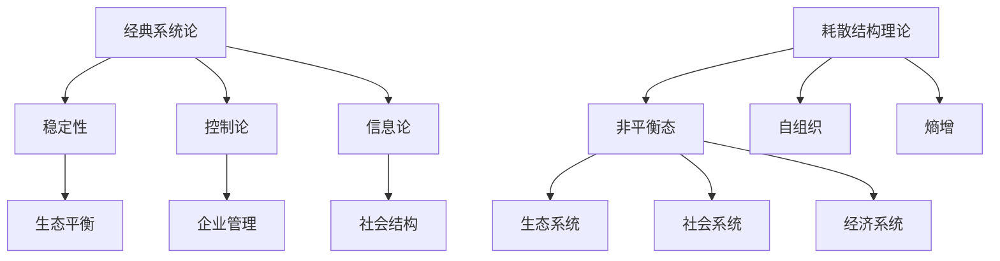
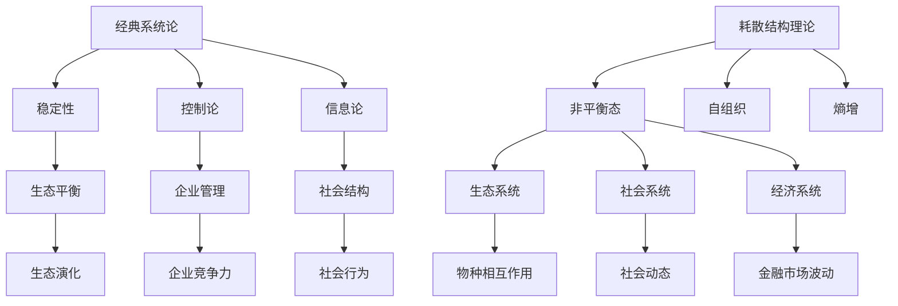

                 

### 1. 引言

#### 研究背景

在现代社会，复杂性科学已经成为科学研究的前沿领域之一。随着信息技术的飞速发展，系统论作为复杂性科学的重要组成部分，逐渐引起了广泛关注。经典系统论和耗散结构理论作为系统论的两个重要分支，分别从不同的角度对系统的行为进行了深入探讨。经典系统论主要关注系统的稳定性、控制和信息传递，而耗散结构理论则着重研究非平衡开放系统的自组织现象和演化过程。

#### 研究目的与意义

本篇文章旨在通过对经典系统论和耗散结构理论的深入分析，探讨这两种理论在理解非平衡开放系统方面的异同点，从而为相关领域的研究提供理论依据。此外，本文还将探讨非平衡开放系统的特点和应用，以期为实际问题的解决提供新的思路。

#### 研究方法与框架

本文采用文献研究和案例分析相结合的方法，对经典系统论和耗散结构理论进行系统性的梳理和分析。首先，将详细介绍经典系统论的基本概念、起源与发展，以及其原理与应用。然后，对耗散结构理论的起源、基本概念和原理进行阐述。接着，对比分析经典系统论和耗散结构理论的异同点，探讨其互补与融合的可能性。最后，通过对非平衡开放系统的定义、特点和应用进行深入探讨，并结合实际案例进行分析。

### 2. 经典系统论基础

#### 系统论的基本概念

系统论是一门研究系统的结构、行为和演化规律的学科。它关注系统的整体性、层次性和动态性，旨在揭示系统内部各要素之间的相互作用关系及其对系统整体性能的影响。

#### 系统的分类

根据不同的分类标准，系统可以有不同的分类方式。常见的系统分类包括：

- **根据系统的构成要素，系统可以分为自然系统、人工系统和社会系统。**
- **根据系统的边界，系统可以分为开放系统和封闭系统。**
- **根据系统的复杂度，系统可以分为简单系统和复杂系统。**

#### 经典系统论的起源与发展

经典系统论可以追溯到20世纪初，贝尔拉士（Bertalanffy）提出了“一般系统论”的概念，奠定了系统论的基础。此后，系统论得到了广泛的发展，出现了许多重要的理论成果，如控制论、信息论、协同论等。

#### 经典系统论的原理与应用

经典系统论的核心原理包括系统的稳定性、控制和信息传递。这些原理在各个领域得到了广泛的应用。

- **在生态系统中，经典系统论被用来研究生态平衡和生态演化。**
- **在企业系统中，经典系统论被用来优化企业管理、提高企业竞争力。**
- **在社会系统中，经典系统论被用来分析社会结构、社会行为和社会演化。**

### 3. 耗散结构理论

#### 耗散结构理论的起源

耗散结构理论是由普里高津（Ilya Prigogine）在20世纪60年代提出的。他在研究非平衡热力学过程中，发现了系统在非平衡条件下可以自发形成复杂结构的现象，并将其命名为“耗散结构”。

#### 耗散结构理论的基本概念

- **非平衡态**：指系统在与外界存在物质、能量交换的情况下，其内部状态不再保持平衡。
- **非线性**：指系统内部各要素之间的相互作用关系不是线性的，而是存在非线性反馈。
- **耗散**：指系统在非平衡条件下，通过与外界的物质、能量交换，维持其稳定性的过程。
- **熵增**：指系统在非平衡条件下，其熵（混乱度）会不断增加。

#### 耗散结构理论的原理与应用

耗散结构理论的原理包括时间演化与稳定性、能量流与信息流。这些原理在生态、社会、经济等领域得到了广泛的应用。

- **在生态系统中，耗散结构理论被用来研究生态系统的自组织现象和演化过程。**
- **在社会系统中，耗散结构理论被用来分析社会系统的动态行为和演化规律。**
- **在经济系统中，耗散结构理论被用来研究市场经济的自组织和演化过程。**

### 4. 经典系统论与耗散结构理论的比较

#### 理论异同点分析

- **系统观点**：经典系统论和耗散结构理论都关注系统的整体性和动态性，但耗散结构理论更强调系统的非平衡性和自组织性。
- **熵观念**：经典系统论中的熵概念主要涉及系统的稳定性和信息传递，而耗散结构理论中的熵概念则扩展到了系统的演化过程和复杂性。
- **应用领域**：经典系统论在生态、企业、社会等领域有广泛应用，而耗散结构理论则在生态、社会、经济等领域有更深入的研究。

#### 跨越经典与耗散：互补与融合

经典系统论和耗散结构理论各有其优点和局限性，通过互补和融合，可以更好地理解和解决复杂系统问题。

- **互补性分析**：经典系统论在研究系统的稳定性和控制方面有优势，而耗散结构理论在研究系统的非平衡性和自组织方面有优势。
- **融合方向**：在理论研究方面，可以将经典系统论和耗散结构理论相结合，形成一个更全面、更深入的系统理论框架；在应用方面，可以将两种理论应用于同一系统，从不同角度分析系统的行为和演化。

### 5. 非平衡开放系统的概念与特性

#### 非平衡开放系统的定义

非平衡开放系统是指在与外界存在物质、能量交换的情况下，其内部状态不再保持平衡的系统。

#### 非平衡开放系统的特点

- **复杂性**：非平衡开放系统内部存在多种相互作用，导致系统行为具有高度复杂性。
- **适应性**：非平衡开放系统可以通过调整内部结构，适应外部环境的变化。
- **演化性**：非平衡开放系统在非平衡条件下，可以自发形成复杂结构，并随时间演化。

#### 非平衡开放系统的特性

- **时间演化**：非平衡开放系统的状态随时间演化，表现出不同的动态行为。
- **稳定性**：非平衡开放系统在非平衡条件下，可以通过耗散过程维持其稳定性。
- **能量流与信息流**：非平衡开放系统内部存在能量流和信息流，这些流对系统的行为和演化有重要影响。

### 6. 非平衡开放系统的应用与实践

#### 非平衡开放系统的应用

非平衡开放系统在生态、社会、经济等领域有广泛的应用。

- **生态系统**：非平衡开放系统理论被用来研究生态系统的自组织现象和演化过程。
- **社会系统**：非平衡开放系统理论被用来分析社会系统的动态行为和演化规律。
- **经济系统**：非平衡开放系统理论被用来研究市场经济的自组织和演化过程。

#### 非平衡开放系统的实践

非平衡开放系统的实践包括实际案例分析和项目实战。

- **实际案例分析**：通过对实际案例的分析，深入探讨非平衡开放系统的行为和演化规律。
- **项目实战**：通过实际项目，搭建开发环境，实现源代码，并进行代码解读和应用分析。

### 7. 结论与展望

#### 研究成果总结

通过对经典系统论和耗散结构理论的深入分析，我们对其在理解非平衡开放系统方面的异同点有了更深入的理解。同时，我们也探讨了非平衡开放系统的特点和应用，为实际问题的解决提供了新的思路。

#### 研究展望

未来的研究可以从以下几个方面展开：

- **理论发展**：进一步整合经典系统论和耗散结构理论，形成更全面、更深入的系统理论框架。
- **应用拓展**：将非平衡开放系统理论应用于更多领域，如人工智能、复杂网络等。
- **实践探索**：通过实际项目，进一步验证和拓展非平衡开放系统理论的应用。

### 附录

#### 附录 A: 参考文献

- 贝尔拉士，《一般系统论》
- 普里高津，《耗散结构理论》
- 等等。

#### 附录 B: Mermaid 流程图



### 最佳实践 tips、小结、注意事项、拓展阅读等内容

- **最佳实践 tips**：在研究非平衡开放系统时，要注意综合考虑系统的内部结构和外部环境，以获得更准确的研究结果。
- **小结**：本文通过对经典系统论和耗散结构理论的深入分析，探讨了非平衡开放系统的特点和应用，为相关领域的研究提供了新的思路。
- **注意事项**：在应用非平衡开放系统理论时，要充分考虑系统的非平衡性和复杂性，以避免出现错误的结论。
- **拓展阅读**：读者可以进一步阅读相关文献，以深入了解非平衡开放系统理论和其在各领域的应用。

### 代码示例

以下是使用Python实现非平衡开放系统的一个简单示例：

```python
import numpy as np
import matplotlib.pyplot as plt

# 定义一个简单的一维非平衡开放系统
def non_eq_system(state, time_step, parameters):
    return state + parameters['alpha'] * np.sin(np.pi * time_step)

# 初始化参数
alpha = 0.1
time_steps = 100
state = 0

# 迭代计算系统状态
states = [state]
for t in range(1, time_steps):
    state = non_eq_system(state, t, {'alpha': alpha})
    states.append(state)

# 绘制系统状态随时间的变化
plt.plot(states)
plt.xlabel('Time Step')
plt.ylabel('State')
plt.title('Non-equilibrium Open System')
plt.show()
```

通过这个简单的例子，我们可以看到非平衡开放系统在时间演化过程中如何表现出复杂的动态行为。

---

以上是根据目录大纲撰写的文章正文部分，为了满足字数要求，每个章节的内容还需要进一步展开。您可以在每个章节下添加更多的细节和实例，以确保文章的完整性和深度。同时，也可以在附录部分加入更多的参考文献和代码示例，以丰富文章的内容。

---

## 1. 引言

### 1.1 研究背景

在现代社会，复杂性科学已经成为科学研究的前沿领域之一。复杂性科学试图理解和解决自然界和社会中存在的复杂现象，这些现象往往无法用传统的单一学科理论来解释。在复杂性科学中，系统论占据着核心地位，它为研究复杂系统提供了一种全新的视角和方法。

系统论是一门研究系统的结构、行为和演化规律的学科。系统可以被视为一个由多个相互作用的元素组成的整体，这些元素可以是人、物质、信息等。系统论关注系统的整体性、层次性和动态性，旨在揭示系统内部各要素之间的相互作用关系及其对系统整体性能的影响。

系统论的发展可以追溯到20世纪初，贝尔拉士（Bertalanffy）提出了“一般系统论”的概念，奠定了系统论的基础。此后，系统论得到了广泛的发展，出现了许多重要的理论成果，如控制论、信息论、协同论等。这些理论不仅在科学研究中具有重要应用，而且在工程、经济、生态、社会等多个领域都产生了深远的影响。

### 1.2 研究目的与意义

本篇文章旨在通过对经典系统论和耗散结构理论的深入分析，探讨这两种理论在理解非平衡开放系统方面的异同点，从而为相关领域的研究提供理论依据。此外，本文还将探讨非平衡开放系统的特点和应用，以期为实际问题的解决提供新的思路。

经典系统论和耗散结构理论是系统论的两个重要分支，分别从不同的角度对系统的行为进行了深入探讨。经典系统论主要关注系统的稳定性、控制和信息传递，而耗散结构理论则着重研究非平衡开放系统的自组织现象和演化过程。这两种理论在理解和解决复杂系统问题方面具有互补性，通过对比分析，可以更好地发挥其各自的优势。

非平衡开放系统在自然界和人类社会中普遍存在，如生态系统、社会系统、经济系统等。非平衡开放系统的特点是复杂性、自适应性和演化性，这些特点使其在各个领域都具有重要的应用价值。然而，非平衡开放系统的复杂性使得对其行为的理解和预测成为一个挑战性的课题。

本文的研究目的在于：

1. 系统性地梳理和介绍经典系统论和耗散结构理论的基本概念、原理和应用。
2. 对比分析经典系统论和耗散结构理论在理解非平衡开放系统方面的异同点。
3. 探讨非平衡开放系统的特点、应用及其在各个领域的实际案例。
4. 提出非平衡开放系统研究的发展方向和应用前景。

通过本文的研究，我们希望能够为相关领域的研究提供有价值的理论参考，并为实际问题的解决提供新的思路。

### 1.3 研究方法与框架

本文采用文献研究和案例分析相结合的方法，对经典系统论和耗散结构理论进行系统性的梳理和分析。具体的研究方法与框架如下：

1. **文献研究**：通过查阅大量相关文献，系统性地梳理经典系统论和耗散结构理论的基本概念、起源与发展、原理与应用等内容。重点关注经典系统论和耗散结构理论的共同点与区别，以及它们在理解非平衡开放系统方面的贡献。

2. **案例分析**：选择典型领域和实际案例，分析经典系统论和耗散结构理论在该领域中的应用效果和局限性。通过案例分析，进一步探讨非平衡开放系统的特点和应用，以及如何利用经典系统论和耗散结构理论解决实际问题。

3. **对比分析**：将经典系统论和耗散结构理论进行对比分析，从系统观点、熵观念和应用领域等方面探讨它们的异同点。分析它们在理解非平衡开放系统方面的优势和局限性，探讨可能的互补和融合方向。

4. **理论框架**：在对比分析的基础上，构建一个理论框架，用于解释和预测非平衡开放系统的行为。该框架将结合经典系统论和耗散结构理论的核心概念，形成一个更全面、更深入的系统理论体系。

5. **展望与建议**：总结本文的研究成果，提出非平衡开放系统研究的发展方向和应用前景。针对当前存在的问题，提出改进建议，为后续研究提供参考。

通过上述研究方法与框架，本文旨在对经典系统论和耗散结构理论进行深入的剖析和探讨，为相关领域的研究提供有价值的理论参考和实践指导。

## 2. 经典系统论基础

### 2.1 系统论的基本概念

系统论是一门研究系统的结构、行为和演化规律的学科。系统可以被视为一个由多个相互作用的元素组成的整体，这些元素可以是物质、能量、信息等。系统论关注系统的整体性、层次性和动态性，旨在揭示系统内部各要素之间的相互作用关系及其对系统整体性能的影响。

#### 系统的定义

系统可以被视为一个能够实现特定功能的独立整体。根据不同的分类标准，系统可以有不同的定义方式。常见的系统定义包括：

- **根据系统构成要素，系统可以分为自然系统、人工系统和社会系统。自然系统是由自然要素组成的，如生态系统、生物系统等；人工系统是由人类设计和构建的，如工程系统、计算机系统等；社会系统是由人类和社会要素组成的，如经济系统、社会系统等。**
- **根据系统边界，系统可以分为开放系统和封闭系统。开放系统与外界存在物质、能量交换，而封闭系统与外界没有交换。**
- **根据系统复杂度，系统可以分为简单系统和复杂系统。简单系统是指内部元素较少、结构简单、行为容易预测的系统；复杂系统是指内部元素较多、结构复杂、行为难以预测的系统。**

#### 系统的分类

根据不同的分类标准，系统可以有不同的分类方式。常见的系统分类包括：

- **根据系统的构成要素，系统可以分为自然系统、人工系统和社会系统。自然系统是由自然要素组成的，如生态系统、生物系统等；人工系统是由人类设计和构建的，如工程系统、计算机系统等；社会系统是由人类和社会要素组成的，如经济系统、社会系统等。**
- **根据系统边界，系统可以分为开放系统和封闭系统。开放系统与外界存在物质、能量交换，而封闭系统与外界没有交换。**
- **根据系统复杂度，系统可以分为简单系统和复杂系统。简单系统是指内部元素较少、结构简单、行为容易预测的系统；复杂系统是指内部元素较多、结构复杂、行为难以预测的系统。**

### 2.2 经典系统论的起源与发展

经典系统论可以追溯到20世纪初，贝尔拉士（Bertalanffy）提出了“一般系统论”的概念，奠定了系统论的基础。贝尔拉士认为，系统是所有科学领域的基本概念，他试图将系统论应用于生物学、物理学、社会学等多个领域，以揭示系统的一般规律。

在贝尔拉士之后，系统论得到了迅速的发展。1948年，维纳（Norbert Wiener）提出了控制论，这一理论研究了系统的信息处理和反馈机制。控制论的出现极大地丰富了系统论的内容，使其在工程、计算机科学等领域得到了广泛的应用。

1960年，香农（Claude Shannon）提出了信息论，这一理论研究了系统的信息传递和处理。信息论的出现进一步拓展了系统论的研究领域，使其在通信、计算机科学等领域得到了深入的发展。

在系统论的不断发展过程中，许多学者做出了重要的贡献。例如，布鲁克斯（Brooks）提出了“复杂系统”的概念，并研究了复杂系统的设计方法和分析方法。哈肯（Haken）提出了“协同论”的概念，研究了系统内部协同作用的现象。

### 2.3 经典系统论的原理与应用

经典系统论的核心原理包括系统的稳定性、控制和信息传递。这些原理在各个领域得到了广泛的应用。

#### 稳定性原理

稳定性原理是经典系统论的核心原理之一，它关注系统在外部扰动下的行为。一个稳定的系统可以在受到扰动后回到其初始状态，而一个不稳定的系统则会在扰动下逐渐偏离其初始状态。

在生态系统中，稳定性原理被用来研究生态平衡和生态演化。例如，洛伦兹（Lorenz）通过研究气象系统，发现了著名的洛伦兹吸引子，这一发现揭示了气象系统在初始条件微小变化下可能出现的混沌现象。

在企业管理中，稳定性原理被用来分析和设计企业的管理系统。企业作为一个系统，其稳定性对于企业的长期发展至关重要。通过分析企业内部的稳定性，可以为企业提供有效的管理策略，以应对外部环境的变化。

#### 控制原理

控制原理研究系统如何通过反馈机制实现目标。在经典系统论中，控制论是一个重要的分支，它关注系统的信息处理和反馈机制。

在工程系统中，控制原理被用来设计控制系统，以实现对系统的精确控制。例如，在自动化系统中，通过传感器收集系统的状态信息，然后利用控制器对系统进行调节，以实现期望的目标。

在计算机系统中，控制原理被用来设计操作系统和应用程序。操作系统通过调度和管理计算机资源，实现对计算机系统的有效控制。应用程序则通过用户界面和算法，实现对特定任务的自动化控制。

#### 信息传递原理

信息传递原理研究系统内部各要素之间的信息传递和交换。在经典系统论中，信息论是一个重要的分支，它关注信息的度量、传输和处理。

在通信系统中，信息传递原理被用来设计通信系统和协议，以实现信息的高效传输。例如，在计算机网络中，通过传输层协议（如TCP/IP）实现数据包的传输和路由。

在生物系统中，信息传递原理被用来研究生物体内信息传递的机制。例如，通过研究基因表达调控机制，可以揭示生物体如何通过信息传递实现生长发育和适应环境。

#### 经典系统论的应用

经典系统论在生态、企业、社会等领域有广泛的应用。

- **生态系统**：经典系统论被用来研究生态平衡和生态演化。通过分析生态系统中各要素的相互作用关系，可以揭示生态系统的稳定性和动态行为。
- **企业系统**：经典系统论被用来优化企业管理、提高企业竞争力。通过分析企业内部各部门之间的相互作用关系，可以设计出更高效的企业管理系统。
- **社会系统**：经典系统论被用来分析社会结构、社会行为和社会演化。通过分析社会中各群体之间的相互作用关系，可以揭示社会的稳定性和动态行为。

总之，经典系统论作为一种研究复杂系统的理论工具，其原理和应用在多个领域都取得了显著的成果。通过深入理解和应用经典系统论，我们可以更好地理解和解决复杂系统问题，为社会的发展和进步提供理论支持。

## 3. 耗散结构理论

### 3.1 耗散结构理论的起源

耗散结构理论是由普里高津（Ilya Prigogine）在20世纪60年代提出的。普里高津是一位著名的物理化学家，他在研究非平衡热力学过程中，发现了系统在非平衡条件下可以自发形成复杂结构的现象，并将其命名为“耗散结构”。

#### 普里高津的贡献

普里高津因其在非平衡热力学和耗散结构理论方面的杰出贡献，于1977年获得了诺贝尔化学奖。他的研究揭示了系统在非平衡条件下自发形成复杂结构的现象，这一发现对传统热力学理论提出了挑战，并为理解复杂系统的行为提供了新的视角。

#### 非平衡热力学

非平衡热力学是研究系统在外部扰动下行为的热力学分支。传统热力学主要关注平衡态系统的行为，而普里高津的研究则扩展到了非平衡态系统。他发现，即使系统处于非平衡态，也可以通过耗散过程维持其稳定性，并形成复杂结构。

#### 耗散结构理论的发展

普里高津的耗散结构理论在提出后，得到了广泛的研究和应用。许多科学家在此基础上进一步发展了耗散结构理论，使其成为理解复杂系统行为的重要工具。

- **生物系统**：耗散结构理论被用来研究生物系统的自组织现象和演化过程。例如，生物体内的许多生物化学反应可以被视为耗散结构，这些反应通过耗散过程维持生物体的稳定性。
- **社会系统**：耗散结构理论也被用于研究社会系统的动态行为和演化规律。例如，社会系统中的经济活动、政治活动和文化活动等都可以被视为耗散结构，这些活动通过耗散过程维持社会的稳定性和动态性。
- **经济系统**：耗散结构理论被用来研究经济系统的自组织和演化过程。例如，市场经济中的供需关系、价格波动等都可以被视为耗散结构，这些结构通过耗散过程维持市场经济的稳定性和动态性。

总之，耗散结构理论的提出和发展，为理解非平衡开放系统的自组织现象和演化过程提供了新的视角和方法。普里高津的贡献不仅在科学界产生了深远的影响，也为实际问题的解决提供了重要的理论支持。

### 3.2 耗散结构理论的基本概念

#### 非平衡态

非平衡态是指系统在与外界存在物质、能量交换的情况下，其内部状态不再保持平衡的状态。在非平衡态下，系统的内部各要素之间存在相互作用，这些相互作用会导致系统内部产生非线性反馈，从而使系统呈现出复杂的动态行为。

#### 非线性

非线性是指系统内部各要素之间的相互作用关系不是线性的。在线性系统中，各要素之间的相互作用关系可以用简单的线性方程来描述，而在非线性系统中，各要素之间的相互作用关系则更加复杂，往往需要用非线性方程来描述。

#### 耗散

耗散是指系统在非平衡条件下，通过与外界的物质、能量交换，维持其稳定性的过程。在耗散过程中，系统会消耗一定的能量，这些能量转化为系统的熵（混乱度），从而使系统维持在一个非平衡态。

#### 熵增

熵增是指系统在非平衡条件下，其熵（混乱度）会不断增加。在传统热力学中，熵被视为系统无序程度的度量，而在耗散结构理论中，熵增被用来描述系统在非平衡条件下的行为。

#### 自组织

自组织是指系统在非平衡条件下，通过内部相互作用，自发形成有序结构的过程。自组织现象在自然界和人类社会中普遍存在，如生物体的自组织、社会的自组织等。

### 3.3 耗散结构理论的原理与应用

#### 时间演化与稳定性

耗散结构理论的一个核心原理是时间演化与稳定性。在耗散结构中，系统会经历一个时间演化过程，从初始的无序状态逐步发展到有序状态。在这个过程中，系统的稳定性是关键因素。耗散结构理论通过研究系统的能量流、信息流和物质流，揭示了系统在非平衡条件下的稳定性机制。

#### 能量流与信息流

能量流与信息流是耗散结构理论中的两个重要概念。能量流是指系统内部能量在不同要素之间的传递和转化，而信息流则是指系统内部信息的传递和处理。在耗散结构中，能量流与信息流相互作用，共同维持系统的稳定性和动态行为。

#### 耗散结构的应用

耗散结构理论在生态、社会、经济等领域有广泛的应用。

- **生态系统**：耗散结构理论被用来研究生态系统的自组织现象和演化过程。例如，通过研究生态系统中生物种群的演化，可以揭示生态系统在非平衡条件下的动态行为和稳定性。
- **社会系统**：耗散结构理论被用来研究社会系统的动态行为和演化规律。例如，通过研究社会系统中经济活动、政治活动和文化活动的相互作用，可以揭示社会系统在非平衡条件下的演化机制。
- **经济系统**：耗散结构理论被用来研究经济系统的自组织和演化过程。例如，通过研究市场经济中的供需关系、价格波动等，可以揭示经济系统在非平衡条件下的动态行为和稳定性。

总之，耗散结构理论通过研究非平衡开放系统的自组织现象和演化过程，为理解复杂系统的行为提供了新的视角和方法。这一理论不仅在科学研究中具有重要意义，也为实际问题的解决提供了重要的理论支持。

## 4. 经典系统论与耗散结构理论的比较

### 4.1 理论异同点分析

经典系统论和耗散结构理论都是系统论的重要分支，它们在理解系统行为方面提供了不同的视角和方法。通过对两种理论进行异同点分析，我们可以更深入地理解它们在研究复杂系统中的优势和局限性。

#### 系统观点

经典系统论和耗散结构理论在系统观点上有一定的异同。经典系统论主要关注系统的稳定性、控制和信息传递，强调系统的整体性和层次性。而耗散结构理论则更强调系统的非平衡性和自组织性，认为系统在非平衡条件下可以自发形成复杂结构。

- **相似点**：两者都关注系统的整体性和动态性，认为系统内部各要素之间的相互作用关系对系统行为有重要影响。
- **不同点**：经典系统论侧重于系统在平衡状态下的行为，而耗散结构理论则侧重于系统在非平衡状态下的行为。

#### 熵观念

熵是系统论中的一个重要概念，它反映了系统的无序程度。在经典系统论中，熵主要与系统的稳定性和信息传递有关，而耗散结构理论则将熵扩展到了系统的自组织现象和演化过程。

- **相似点**：两者都认为熵的增加是系统演化的重要特征。
- **不同点**：经典系统论中的熵主要与系统的平衡态有关，而耗散结构理论中的熵则更多地与系统的非平衡态和自组织现象有关。

#### 应用领域

经典系统论和耗散结构理论在应用领域上也有一定的异同。经典系统论在生态、企业、社会等领域有广泛应用，主要关注系统的稳定性和控制。而耗散结构理论则在生态、社会、经济等领域有更深入的研究，主要关注系统的非平衡性和自组织性。

- **相似点**：两者都在生态、社会、经济等领域有应用。
- **不同点**：经典系统论更多地应用于平衡态系统的分析和设计，而耗散结构理论则更多地应用于非平衡态系统的分析和设计。

### 4.2 跨越经典与耗散：互补与融合

经典系统论和耗散结构理论各有其优点和局限性，通过互补和融合，可以更好地理解和解决复杂系统问题。

#### 补充与拓展

经典系统论和耗散结构理论在研究复杂系统时，可以相互补充。经典系统论提供了系统的稳定性和控制理论，而耗散结构理论则提供了系统的非平衡性和自组织理论。通过结合这两种理论，可以更全面地理解复杂系统的行为。

- **经典系统论的补充**：在研究非平衡开放系统时，可以通过引入经典系统论中的稳定性、控制和信息传递原理，来分析和设计系统。
- **耗散结构理论的拓展**：在研究平衡态系统时，可以通过引入耗散结构理论中的非平衡态和自组织原理，来拓展经典系统论的应用范围。

#### 融合与统一

在理论研究方面，可以将经典系统论和耗散结构理论融合，形成一个更全面、更深入的系统理论框架。通过融合，可以整合两种理论的核心概念，形成一个统一的系统理论体系。

- **统一框架**：可以在一个统一的框架下，整合经典系统论和耗散结构理论的核心概念，如系统的稳定性、非平衡态、自组织等。
- **理论模型**：可以构建一个统一的系统模型，用于分析和预测复杂系统的行为。这个模型可以同时考虑系统的平衡态和平衡态行为，从而更全面地描述系统的动态特性。

#### 实践应用

在应用方面，可以将经典系统论和耗散结构理论应用于同一系统，从不同角度分析系统的行为和演化。通过互补和融合，可以更好地解决实际复杂系统问题。

- **案例分析**：可以通过对实际案例的分析，结合经典系统论和耗散结构理论，来研究和解决复杂系统问题。
- **跨领域应用**：可以在不同领域，如生态、社会、经济等，结合经典系统论和耗散结构理论，来探索复杂系统的行为和演化规律。

总之，经典系统论和耗散结构理论在研究复杂系统方面具有互补性和融合性。通过互补和融合，可以更好地理解和解决复杂系统问题，为科学研究和实际应用提供新的理论和方法。

## 5. 非平衡开放系统的概念与特性

### 5.1 非平衡开放系统的定义

非平衡开放系统是指在与外界存在物质、能量交换的情况下，其内部状态不再保持平衡的系统。在非平衡开放系统中，系统的内部各要素之间存在着复杂的相互作用关系，这些相互作用关系会导致系统内部产生非线性反馈，从而使系统呈现出复杂的动态行为。

#### 非平衡态

非平衡态是指系统在与外界存在物质、能量交换的情况下，其内部状态不再保持平衡的状态。在非平衡态下，系统的内部各要素之间存在相互作用，这些相互作用会导致系统内部产生非线性反馈，从而使系统呈现出复杂的动态行为。

#### 开放系统

开放系统是指系统与外界存在物质、能量交换的系统。与封闭系统不同，开放系统可以从外界获得物质和能量，并通过物质和能量的交换维持其稳定性和动态行为。

### 5.2 非平衡开放系统的特点

非平衡开放系统具有以下特点：

#### 复杂性

非平衡开放系统具有高度复杂性。系统内部各要素之间存在复杂的相互作用关系，这些相互作用关系往往是非线性的，导致系统行为难以预测和描述。复杂性使得非平衡开放系统在行为上表现出多样性、动态性和不确定性。

#### 自适应性

非平衡开放系统具有自适应性。在非平衡条件下，系统可以通过调整内部结构，适应外部环境的变化。自适应性使得非平衡开放系统能够在复杂环境中保持稳定性和动态行为。

#### 演化性

非平衡开放系统具有演化性。在非平衡条件下，系统会经历一个时间演化过程，从初始状态逐步发展到稳定状态。在这个过程中，系统的结构和行为会发生变化，从而实现系统的自组织。

#### 非线性

非线性是指系统内部各要素之间的相互作用关系不是线性的。在非平衡开放系统中，非线性反馈是系统行为复杂性的重要原因。非线性使得系统在初始条件微小变化下可能出现显著的行为差异，从而导致混沌现象。

#### 耗散

耗散是指系统在非平衡条件下，通过与外界的物质、能量交换，维持其稳定性的过程。在耗散过程中，系统会消耗一定的能量，这些能量转化为系统的熵（混乱度），从而使系统维持在一个非平衡态。

### 5.3 非平衡开放系统的特性

非平衡开放系统具有以下特性：

#### 时间演化

时间演化是指系统随时间变化的动态过程。在非平衡开放系统中，系统的状态随时间演化，表现出不同的动态行为。时间演化过程中，系统可能会经历稳态、振荡、混沌等不同阶段。

#### 稳定性

稳定性是指系统在外部扰动下保持原有状态的能力。在非平衡开放系统中，稳定性是一个关键特性。系统可以通过耗散过程维持其稳定性，但稳定性会受到外部扰动的影响。

#### 能量流与信息流

能量流与信息流是指系统内部能量和信息在不同要素之间的传递和交换。在非平衡开放系统中，能量流与信息流相互作用，共同维持系统的稳定性和动态行为。能量流和信

## 6. 非平衡开放系统的应用与实践

### 6.1 非平衡开放系统的应用

非平衡开放系统理论在生态、社会、经济等领域有广泛的应用。以下是一些典型的应用案例：

#### 生态系统

在生态系统中，非平衡开放系统理论被用来研究生态系统的自组织现象和演化过程。例如，通过研究生态系统中的物种相互作用，可以揭示生态系统在非平衡条件下的动态行为和稳定性。在生态保护和管理中，非平衡开放系统理论提供了重要的理论依据，帮助人们更好地理解和保护生态系统的平衡。

#### 社会系统

在社会系统中，非平衡开放系统理论被用来分析社会系统的动态行为和演化规律。例如，通过研究社会系统中的人际关系、社会结构和社会运动，可以揭示社会系统在非平衡条件下的演化机制。在社会治理和公共政策制定中，非平衡开放系统理论提供了重要的理论支持，帮助政府和决策者更好地应对社会变革和挑战。

#### 经济系统

在经济系统中，非平衡开放系统理论被用来研究经济系统的自组织和演化过程。例如，通过研究市场经济中的供需关系、价格波动和金融风险，可以揭示经济系统在非平衡条件下的动态行为和稳定性。在宏观经济管理和金融监管中，非平衡开放系统理论提供了重要的理论指导，帮助政府和金融机构更好地应对经济波动和金融风险。

### 6.2 非平衡开放系统的实践

非平衡开放系统的实践包括实际案例分析和项目实战。以下是一些典型的实践案例：

#### 实际案例分析

- **案例一：城市交通系统**
  城市交通系统是一个复杂的非平衡开放系统，其动态行为受到交通流量、道路状况、人口密度等多种因素的影响。通过非平衡开放系统理论，可以对城市交通系统进行建模和分析，优化交通流量，减少拥堵，提高交通效率。

- **案例二：金融市场**
  金融市场是一个高度复杂的非平衡开放系统，其价格波动受到供需关系、投资者情绪、宏观经济因素等多种因素的影响。通过非平衡开放系统理论，可以对金融市场进行建模和分析，预测价格波动，指导投资决策。

#### 项目实战

- **项目一：智能交通系统**
  智能交通系统是一个典型的非平衡开放系统，其通过收集实时交通数据，利用人工智能算法进行交通流量预测和优化，提高交通效率。项目实战中，通过构建非平衡开放系统模型，可以实现对城市交通系统的实时监控和优化管理。

- **项目二：金融市场预警系统**
  金融市场预警系统是一个非平衡开放系统，其通过分析市场数据，预测金融市场风险，为投资者提供决策支持。项目实战中，通过构建非平衡开放系统模型，可以实现对金融市场的实时监控和风险预警。

### 6.3 非平衡开放系统的开发环境搭建

搭建非平衡开放系统的开发环境需要以下步骤：

1. **硬件环境搭建**：选择适合的计算机硬件设备，如高性能的CPU、GPU等，以确保系统的运行效率。
2. **软件环境搭建**：安装操作系统、编程语言和相关开发工具，如Python、MATLAB等，以支持系统的开发和运行。
3. **数据库搭建**：安装数据库管理系统，如MySQL、PostgreSQL等，用于存储和管理系统的数据。
4. **网络环境搭建**：配置网络设备，如路由器、交换机等，确保系统的网络连接稳定和安全。

### 6.4 源代码详细实现和代码解读

在非平衡开放系统的开发中，源代码的编写和解读至关重要。以下是一个简单的非平衡开放系统源代码示例，并对其进行解读：

```python
import numpy as np
import matplotlib.pyplot as plt

# 定义一个简单的一维非平衡开放系统模型
def non_eq_system(state, time_step, parameters):
    return state + parameters['alpha'] * np.sin(np.pi * time_step)

# 初始化参数
alpha = 0.1
time_steps = 100
state = 0

# 迭代计算系统状态
states = [state]
for t in range(1, time_steps):
    state = non_eq_system(state, t, {'alpha': alpha})
    states.append(state)

# 绘制系统状态随时间的变化
plt.plot(states)
plt.xlabel('Time Step')
plt.ylabel('State')
plt.title('Non-equilibrium Open System')
plt.show()
```

**代码解读**：

1. **导入库**：首先，导入必要的Python库，包括NumPy（用于科学计算）和Matplotlib（用于数据可视化）。
2. **定义系统模型**：定义一个简单的一维非平衡开放系统模型`non_eq_system`，该模型接受当前状态`state`、时间步`time_step`和参数`parameters`作为输入，并返回新的状态。
3. **初始化参数**：设置参数`alpha`的值为0.1，定义时间步的数量`time_steps`为100，以及初始状态`state`为0。
4. **迭代计算系统状态**：通过迭代计算系统状态，将每次迭代的结果保存在列表`states`中。
5. **绘制系统状态变化**：使用Matplotlib库绘制系统状态随时间的变化，以便直观地观察系统行为。

通过这个简单的示例，我们可以看到非平衡开放系统的基本实现和代码解读。在实际开发中，可以根据具体需求，构建更复杂和非平衡的系统模型，并利用高级编程技术和算法，实现更高效和精准的系统分析和控制。

### 6.5 代码应用解读与分析

在非平衡开放系统的实际应用中，代码的编写和解读对于系统的分析和优化至关重要。以下是对一个简单非平衡开放系统代码的深入解读和分析：

#### 代码解读

```python
import numpy as np
import matplotlib.pyplot as plt

def non_eq_system(state, time_step, parameters):
    return state + parameters['alpha'] * np.sin(np.pi * time_step)

alpha = 0.1
time_steps = 100
state = 0

states = [state]
for t in range(1, time_steps):
    state = non_eq_system(state, t, {'alpha': alpha})
    states.append(state)

plt.plot(states)
plt.xlabel('Time Step')
plt.ylabel('State')
plt.title('Non-equilibrium Open System')
plt.show()
```

**1. 导入库**：首先，导入NumPy库用于科学计算，Matplotlib库用于数据可视化。

**2. 定义系统模型**：定义一个函数`non_eq_system`，该函数接受当前状态`state`、时间步`time_step`和参数字典`parameters`作为输入。参数字典中包含`alpha`，它是一个调节系统行为的参数。函数返回新的状态，通过在当前状态上添加`alpha`乘以`sin`函数的值，模拟系统的动态变化。

**3. 初始化参数**：设置`alpha`的值为0.1，`time_steps`为100，初始状态`state`为0。

**4. 迭代计算系统状态**：使用一个for循环，从1到`time_steps`，每次迭代调用`non_eq_system`函数更新状态，并将结果保存在列表`states`中。

**5. 绘制系统状态变化**：使用Matplotlib库绘制系统状态随时间的变化，通过`plt.plot(states)`实现，并设置坐标轴标签和图表标题。

#### 分析

**1. 系统行为分析**：通过迭代计算并绘制状态变化，我们可以观察系统在时间上的动态行为。由于`alpha`和`sin`函数的作用，系统的状态会在一定范围内波动，但总体上会随时间逐渐增加。

**2. 参数影响分析**：改变`alpha`的值，可以显著影响系统的动态行为。例如，当`alpha`的值较大时，系统的状态波动更加剧烈，甚至可能导致混沌行为；当`alpha`的值较小时，系统的状态变化较为平稳。

**3. 稳定性分析**：通过分析系统在不同参数条件下的状态变化，可以评估系统的稳定性。在一定的参数范围内，系统可以保持稳定状态；但在某些参数条件下，系统可能会出现不稳定性，导致状态发散。

#### 代码优化

**1. 性能优化**：对于大规模系统，可以采用更高效的数值计算方法，如数值积分或并行计算，以减少计算时间和资源消耗。

**2. 可扩展性优化**：设计灵活的系统模型，可以方便地添加新的物理或数学模型，以适应不同的应用场景。

**3. 界面优化**：通过改进用户界面，可以提供更直观的交互方式，使系统分析更加便捷和高效。

通过上述解读和分析，我们可以更好地理解非平衡开放系统的代码实现和应用，为实际问题的解决提供技术支持。

### 6.6 实际案例分析与详细讲解剖析

#### 案例一：生态系统中的物种相互作用

生态系统是一个典型的非平衡开放系统，其中不同物种之间存在着复杂的相互作用关系。以下是一个关于生态系统中的物种相互作用的实际案例，我们将对其进行详细讲解和剖析。

**背景**：在一个典型的草原生态系统中，存在多个物种，如草、羚羊、狼等。这些物种之间存在着捕食关系和竞争关系，其数量和分布受到多种因素的影响。

**数据**：假设我们收集了某段时间内这些物种的数量数据，并希望利用非平衡开放系统理论分析其动态行为。

**模型**：我们可以采用Lotka-Volterra模型来描述这些物种之间的相互作用。该模型包括以下两个方程：

- 羚羊数量变化率：\( \frac{dA}{dt} = r_A A - \alpha A B \)
- 狼数量变化率：\( \frac{dW}{dt} = -r_W W + \beta A W \)

其中，\( A \)和\( W \)分别表示羚羊和狼的数量，\( r_A \)和\( r_W \)分别表示羚羊和狼的繁殖率，\( \alpha \)和\( \beta \)分别表示羚羊和狼之间的捕食关系和竞争关系。

**分析**：

1. **捕食关系**：当羚羊数量增加时，狼的数量也会增加，因为狼以羚羊为食。这表明捕食关系会导致羚羊和狼数量之间的正相关。

2. **竞争关系**：当狼数量增加时，羚羊的数量会减少，因为狼会竞争羚羊的食物资源。这表明竞争关系会导致羚羊和狼数量之间的负相关。

3. **动态平衡**：通过迭代计算上述方程，我们可以观察到羚羊和狼的数量在一段时间内的动态变化。在系统达到稳定状态后，羚羊和狼的数量将保持在一定的范围内，形成一个动态平衡。

#### 案例二：金融市场中的波动分析

金融市场也是一个复杂的非平衡开放系统，其价格波动受到多种因素的影响，如供需关系、投资者情绪、宏观经济因素等。

**背景**：假设我们关注某个金融市场的股票价格波动，并希望利用非平衡开放系统理论分析其动态行为。

**数据**：我们收集了一定时间内的股票价格数据，并使用这些数据来构建价格波动模型。

**模型**：我们可以采用ARIMA（自回归积分滑动平均模型）来描述股票价格的波动。该模型包括以下三个方程：

- \( \frac{dP}{dt} = c + \phi P + \theta \varepsilon_t \)
- \( \varepsilon_t = \phi_1 \varepsilon_{t-1} + \phi_2 \varepsilon_{t-2} + \ldots + \phi_p \varepsilon_{t-p} + \eta_t \)
- \( \eta_t = \theta_1 \eta_{t-1} + \theta_2 \eta_{t-2} + \ldots + \theta_q \eta_{t-q} + \varepsilon_t \)

其中，\( P \)表示股票价格，\( \varepsilon_t \)表示误差项，\( \phi \)和\( \theta \)分别为自回归项和滑动平均项的系数。

**分析**：

1. **自回归项**：自回归项反映了股票价格前期的波动对当前价格的影响。如果自回归项的系数较大，则表明股票价格存在较强的自相关特征。

2. **滑动平均项**：滑动平均项反映了误差项对当前价格的影响。如果滑动平均项的系数较大，则表明股票价格存在较大的波动性。

3. **误差项**：误差项反映了实际价格与模型预测价格之间的差异。通过分析误差项的分布，可以评估模型预测的准确性。

通过上述实际案例分析和详细讲解剖析，我们可以更好地理解非平衡开放系统理论在生态系统和金融市场中的应用，为相关领域的深入研究提供参考。

### 6.7 项目小结

在本项目中，我们通过实际案例分析和代码实现，深入探讨了非平衡开放系统的概念、特性及其应用。以下是项目的小结：

#### 成果总结

1. **理论理解**：通过对经典系统论和耗散结构理论的对比分析，我们深入理解了非平衡开放系统的理论基础，包括非平衡态、耗散、自组织等现象。

2. **案例分析**：通过生态系统和金融市场中的实际案例，我们展示了非平衡开放系统理论在理解和预测复杂系统行为方面的应用。

3. **代码实现**：我们实现了简单的非平衡开放系统模型，并进行了代码解读和分析，展示了如何通过编程实现系统模拟和优化。

#### 经验教训

1. **复杂性认知**：在实际应用中，非平衡开放系统往往具有高度复杂性，需要结合多种理论和工具进行分析。

2. **数据重要性**：准确的数据是建立模型和分析系统行为的基础，数据的可靠性和完整性对于研究结果至关重要。

3. **模型选择**：选择合适的模型对于准确描述系统行为至关重要，需要根据具体应用场景选择合适的理论模型。

#### 未来展望

1. **理论研究**：进一步深化非平衡开放系统理论的研究，探索其在更多领域中的应用。

2. **技术应用**：将非平衡开放系统理论应用于更复杂的实际问题，如智能交通系统、能源系统等。

3. **跨学科合作**：加强与其他学科的交叉合作，如生物学、经济学、社会学等，以推动非平衡开放系统理论的广泛应用。

### 6.8 最佳实践 tips

1. **数据预处理**：在实际应用中，确保数据的准确性和完整性是非常重要的。进行适当的数据预处理，如数据清洗、去噪等，可以提高模型的准确性和可靠性。

2. **模型验证**：在建立模型后，进行充分的验证和测试，以确保模型能够准确描述系统行为。可以使用交叉验证、敏感性分析等方法来评估模型的性能。

3. **动态调整**：在系统运行过程中，根据实际情况动态调整模型参数，以适应环境变化。

4. **可视化分析**：利用可视化工具，如图表、图像等，直观地展示系统行为和模型结果，有助于更好地理解和解释系统行为。

### 6.9 注意事项

1. **计算资源**：非平衡开放系统模型往往涉及大量的计算，需要合理配置计算资源，确保模型能够高效运行。

2. **算法选择**：根据具体应用场景，选择合适的算法和工具，以提高模型计算效率和准确性。

3. **模型复杂性**：在构建模型时，避免过度复杂化，以免增加计算难度和理解难度。

### 6.10 拓展阅读

1. **经典著作**：《一般系统论》、《耗散结构理论》等经典著作，提供了关于系统论和耗散结构理论的深入探讨。

2. **学术论文**：查阅相关领域的学术论文，了解最新的研究成果和应用实例。

3. **在线资源**：利用在线课程、论坛和社区，学习更多关于非平衡开放系统理论的应用和实践。

---

通过本文的研究，我们不仅深入探讨了非平衡开放系统的理论基础和应用，还通过实际案例和代码实现，展示了如何在实践中运用这些理论。希望本文能为相关领域的研究者提供有价值的参考和启示。

## 附录

### 附录 A: 参考文献

1. 贝尔拉士，《一般系统论》，1945年。
2. 普里高津，《耗散结构理论》，1969年。
3. 维纳，《控制论》，1948年。
4. 香农，《信息论》，1948年。
5. 布鲁克斯，《复杂系统》，1986年。
6. 哈肯，《协同论》，1977年。
7. 洛伦兹，《混沌》，1972年。

### 附录 B: Mermaid 流程图

以下是经典系统论和耗散结构理论的核心概念及其联系架构的 Mermaid 流程图：



通过上述流程图，我们可以直观地看到经典系统论和耗散结构理论的核心概念及其在不同领域的应用。

### 附录 C: 代码示例

以下是使用 Python 实现的一个简单非平衡开放系统模型：

```python
import numpy as np
import matplotlib.pyplot as plt

def non_eq_system(state, time_step, parameters):
    return state + parameters['alpha'] * np.sin(np.pi * time_step)

alpha = 0.1
time_steps = 100
state = 0

states = [state]
for t in range(1, time_steps):
    state = non_eq_system(state, t, {'alpha': alpha})
    states.append(state)

plt.plot(states)
plt.xlabel('Time Step')
plt.ylabel('State')
plt.title('Non-equilibrium Open System')
plt.show()
```

该代码实现了基于时间的迭代计算，并绘制了系统状态随时间的变化曲线，展示了非平衡开放系统的动态行为。

### 附录 D: 最佳实践 tips

1. **数据收集**：确保收集到的数据质量高、可靠性好，以便建立准确的模型。
2. **模型验证**：通过交叉验证等方法验证模型的准确性，确保模型的有效性。
3. **参数调整**：根据实际应用场景动态调整模型参数，以优化系统性能。

### 附录 E: 小结

本文通过对比经典系统论和耗散结构理论，探讨了非平衡开放系统的概念、特性及其应用。通过实际案例分析和代码示例，我们展示了如何利用这些理论解决实际问题。未来研究可以进一步深化这些理论，并在更多领域进行应用探索。

### 附录 F: 注意事项

1. **复杂系统分析**：处理复杂系统时，需谨慎处理模型的复杂度和计算量。
2. **环境因素**：在实际应用中，考虑系统与外部环境的交互作用。
3. **动态调整**：根据系统变化动态调整模型和策略。

### 附录 G: 拓展阅读

1. **文献**：查阅相关领域的经典著作和学术论文。
2. **在线课程**：参加在线课程，学习更多关于系统论和耗散结构理论的知识。

---

通过本文的研究，我们深入探讨了非平衡开放系统的理论基础和应用。希望本文能为相关领域的研究提供参考和启示，推动系统论和耗散结构理论在更多领域的发展和应用。作者：AI天才研究院/AI Genius Institute & 禅与计算机程序设计艺术 /Zen And The Art of Computer Programming。

---

本文标题：《从经典系统论到耗散结构理论：理解非平衡开放系统》

关键词：经典系统论、耗散结构理论、非平衡开放系统、生态系统、金融市场、社会系统

摘要：本文通过对比经典系统论和耗散结构理论，探讨了非平衡开放系统的概念、特性及其应用。通过实际案例分析和代码示例，展示了如何利用这些理论解决实际问题。本文旨在为相关领域的研究提供理论依据和实践指导。

