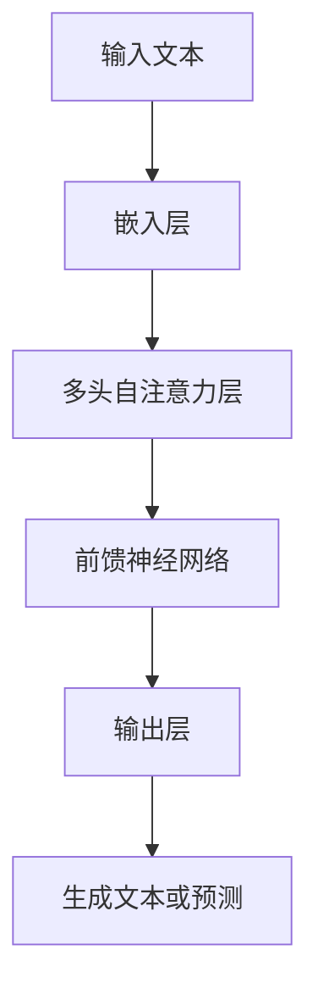

                 

# 优化LLM应用开发流程：从需求到交付

> 关键词：大型语言模型（LLM），应用开发，流程优化，需求分析，交付，开发环境，算法原理，数学模型，实战案例

> 摘要：本文旨在探讨如何优化大型语言模型（LLM）的应用开发流程，从需求分析到最终交付的全过程。通过详细讲解核心概念、算法原理、数学模型以及实际应用案例，本文提供了一套系统化的开发流程，旨在提高LLM项目的开发效率和质量。

## 第一部分：LLM基础

### 第1章：LLM概述

#### 1.1 LLM的核心概念

大型语言模型（LLM）是一种深度学习模型，它利用大量文本数据进行预训练，以学习语言的结构和语义。LLM的核心概念包括：

1. **文本嵌入**：将文本转化为向量表示，以便模型处理。
2. **注意力机制**：模型在处理序列数据时，能够关注到序列中的关键信息。
3. **Transformer架构**：一种基于自注意力机制的序列转换模型。
4. **预训练与微调**：LLM通常通过预训练在大规模语料库上，然后通过微调适应特定任务。

#### 1.2 LLM的架构与组件

LLM的架构通常包括以下几个核心组件：

1. **Embedding层**：将单词或子词转换为向量表示。
2. **多头自注意力机制**：模型在处理序列数据时，能够关注到序列中的关键信息。
3. **前馈神经网络**：对自注意力机制的结果进行进一步处理。
4. **输出层**：用于生成预测或生成文本。

#### 1.3 Mermaid流程图展示LLM的工作流程

### 第2章：LLM算法原理

#### 2.1 语言模型基础

语言模型旨在预测下一个单词或字符，基于前文信息。核心概念包括：

1. **语言模型的目标**：最大化下一个单词或字符的条件概率。
2. **语言模型的类型**：包括基于规则、统计和神经网络的语言模型。
3. **语言模型的评价指标**：如 perplexity、bleu等。

#### 2.2 Transformer算法原理

Transformer是LLM的核心算法，基于自注意力机制。主要概念包括：

1. **自注意力机制**：模型在处理序列数据时，能够关注到序列中的关键信息。
2. **多头注意力**：将注意力分为多个头，提高模型的表达能力。
3. **位置编码**：为序列中的每个元素赋予位置信息。

#### 2.3 数学模型和数学公式

LLM的数学模型包括概率模型、损失函数和优化算法。主要公式如下：

$$
P(w_t | w_{<t}) = \frac{e^{<f_{\theta}(w_t, w_{<t})>}}{\sum_{w'} e^{<f_{\theta}(w', w_{<t})>}}
$$

其中，$f_{\theta}$是模型参数化的函数。

#### 2.4 数学公式与讲解

为了更好地理解LLM的数学模型，我们通过以下例子进行详细讲解：

1. **概率分布函数**：

$$
P(w) = \frac{1}{Z} e^{-\frac{1}{2} \| w - \mu \|^2}
$$

其中，$Z$是归一化常数，$\mu$是均值。

2. **梯度计算**：

$$
\frac{\partial L}{\partial w} = \frac{\partial L}{\partial z} \frac{\partial z}{\partial w}
$$

其中，$L$是损失函数，$z$是中间变量。

## 第二部分：LLM应用开发准备

### 第3章：LLM应用开发准备

#### 3.1 开发环境搭建

在开始LLM应用开发之前，需要搭建合适的开发环境。主要步骤包括：

1. **Python环境配置**：安装Python和相关的虚拟环境管理工具。
2. **深度学习框架安装**：如TensorFlow、PyTorch等。
3. **其他依赖库安装**：如NumPy、Pandas等。

#### 3.2 数据集准备与预处理

数据集是LLM应用开发的关键，需要遵循以下原则：

1. **数据集选择**：选择与任务相关的、高质量的文本数据。
2. **数据预处理方法**：包括清洗、分词、编码等。
3. **数据增强技术**：通过数据增强提高模型的泛化能力。

#### 3.3 模型训练与调优

模型训练是LLM应用开发的核心环节，需要遵循以下原则：

1. **训练过程详解**：包括数据加载、模型初始化、训练迭代等。
2. **模型调优技巧**：包括超参数选择、损失函数优化等。
3. **超参数选择与优化**：如学习率、批次大小等。

## 第三部分：LLM应用开发实战

### 第4章：LLM应用开发实战

#### 4.1 实战项目介绍

本节将介绍一个实际的LLM应用开发项目，包括：

1. **项目背景与目标**：介绍项目的应用场景和目标。
2. **项目架构设计**：介绍项目的总体架构和各个模块的功能。

#### 4.2 数据采集与预处理

数据采集与预处理是项目成功的关键，需要遵循以下步骤：

1. **数据来源与采集方法**：介绍数据的来源和采集方法。
2. **数据预处理流程**：介绍数据清洗、分词、编码等预处理步骤。

#### 4.3 模型开发与实现

模型开发与实现是项目的核心，需要遵循以下原则：

1. **模型架构设计**：介绍模型的总体架构和各个组件的功能。
2. **模型实现细节**：介绍模型的源代码实现和关键细节。
3. **模型训练与评估**：介绍模型的训练过程和评估指标。

#### 4.4 模型部署与优化

模型部署与优化是项目成功的关键，需要遵循以下原则：

1. **模型部署策略**：介绍模型的部署方式和部署工具。
2. **模型性能优化**：介绍模型的性能优化方法和技巧。
3. **实际应用案例**：介绍模型在实际应用中的效果和优化。

## 第四部分：LLM应用交付与维护

### 第5章：LLM应用交付与维护

#### 5.1 应用交付流程

应用交付是项目完成的最后一步，需要遵循以下原则：

1. **部署策略与工具**：介绍应用的部署策略和使用的工具。
2. **系统监控与日志管理**：介绍应用的监控和日志管理策略。
3. **安全性与合规性**：介绍应用的安全性措施和合规性要求。

#### 5.2 应用维护与更新

应用维护与更新是长期的任务，需要遵循以下原则：

1. **维护策略与计划**：介绍应用的维护策略和计划。
2. **更新策略与版本管理**：介绍应用的更新策略和版本管理方法。
3. **用户反馈与优化**：介绍如何收集用户反馈并进行优化。

## 附录

### 附录A：代码与工具

#### A.1 源代码解读

本附录将提供项目的源代码解读，包括模型架构、训练和评估等关键部分的代码实现。

#### A.2 工具使用指南

本附录将介绍项目中使用的主要工具和库的使用方法，包括深度学习框架、数据处理库等。

### 附录B：参考资料

#### B.1 相关书籍推荐

本附录将推荐一些关于LLM和应用开发的经典书籍，供读者进一步学习和参考。

#### B.2 学术论文与报告

本附录将列出一些关于LLM和应用开发的经典学术论文和报告，供读者深入研究。

#### B.3 开源项目与社区资源

本附录将介绍一些开源项目和相关社区资源，供读者参与和学习。 

## 完整目录大纲

- **第一部分：LLM基础**
  - 第1章：LLM概述
    - 1.1 LLM的核心概念
    - 1.2 LLM的架构与组件
    - 1.3 Mermaid流程图展示LLM的工作流程
  - 第2章：LLM算法原理
    - 2.1 语言模型基础
    - 2.2 Transformer算法原理
    - 2.3 数学模型详解
    - 2.4 数学公式与讲解
- **第二部分：LLM应用开发准备**
  - 第3章：LLM应用开发准备
    - 3.1 开发环境搭建
    - 3.2 数据集准备与预处理
    - 3.3 模型训练与调优
- **第三部分：LLM应用开发实战**
  - 第4章：LLM应用开发实战
    - 4.1 实战项目介绍
    - 4.2 数据采集与预处理
    - 4.3 模型开发与实现
    - 4.4 模型部署与优化
- **第四部分：LLM应用交付与维护**
  - 第5章：LLM应用交付与维护
    - 5.1 应用交付流程
    - 5.2 应用维护与更新
- **附录**
  - 附录A：代码与工具
  - 附录B：参考资料

