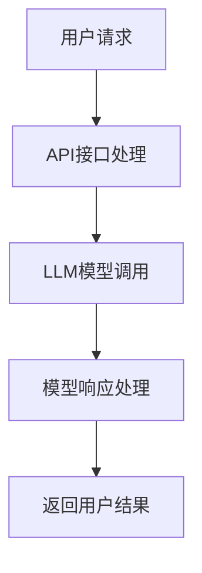

                 


## 文章标题：优化LLM应用的API设计与集成流程

### 文章关键词
- 语言模型
- API设计
- 集成流程
- 性能优化
- 安全性

### 摘要
本文将探讨如何优化大型语言模型（LLM）应用的API设计与集成流程。我们将分析API设计的核心原则和最佳实践，探讨LLM API的特有需求，并深入讲解如何实现高效的集成与部署。通过详细的案例研究和项目实战，我们将展示实际操作中的技巧与注意事项，为开发者提供全面的指导。

---

### 第一部分：引言与背景

#### 1.1 AI大模型的发展背景

大型语言模型（Large Language Models，简称LLM）是人工智能领域的一项重要突破，它们通过训练海量数据来理解和生成自然语言，具备强大的语言理解和生成能力。LLM的发展离不开深度学习和自然语言处理技术的进步，特别是神经网络和注意力机制的引入，使得模型能够更好地捕捉语言中的复杂关系。

#### 1.2 API设计在AI大模型应用中的重要性

API（应用程序编程接口）是软件组件之间通信的桥梁。在AI大模型的应用场景中，良好的API设计能够简化开发过程，提高系统的可扩展性和可维护性。一个高效、易用的API不仅能够提升用户体验，还能降低后端服务的负载，提高整体系统的性能和稳定性。

#### 1.3 本书的内容安排与学习目标

本书将分为六个部分，全面探讨LLM应用的API设计与集成流程。主要内容包括：

- **第一部分：引言与背景**：介绍AI大模型的发展背景和API设计的重要性。
- **第二部分：API设计与实现基础**：讲解API设计原则和方法，以及RESTful API和GraphQL API的设计细节。
- **第三部分：LLM API设计与案例分析**：分析LLM API的特点，提供具体案例并讲解设计细节。
- **第四部分：集成与部署**：探讨API集成策略、集成测试方法和部署与运维实践。
- **第五部分：案例研究与实战**：通过具体案例和项目实战，展示API设计的实际应用和优化技巧。
- **第六部分：总结与展望**：总结书中内容，探讨LLM应用API设计的发展趋势和未来方向。

通过本书的学习，读者将能够：

- 掌握API设计的基本原则和方法。
- 理解LLM API的特有需求，并能够设计出高效、可靠的API。
- 掌握API集成与部署的实践技巧，确保系统的高性能和高可用性。
- 通过案例研究和实战项目，提升实际开发能力。

### 核心概念与联系

在深入讨论LLM应用的API设计与集成流程之前，我们需要明确几个核心概念，并理解它们之间的联系。

#### Mermaid流程图



#### 核心概念

1. **API接口处理**：API接口是用户请求和LLM模型之间的桥梁，负责处理输入请求和返回响应。
2. **LLM模型调用**：LLM模型是整个系统的核心，负责对输入文本进行分析和处理，生成输出结果。
3. **模型响应处理**：模型响应处理是接口处理的一部分，负责将模型生成的文本结果格式化为用户可接受的格式。
4. **返回用户结果**：将处理后的结果返回给用户，完成一次完整的API请求-响应循环。

这些概念构成了LLM应用API设计与集成流程的基础，它们之间的联系如图所示。

---

#### 核心算法原理讲解

为了更好地理解LLM应用的API设计与集成流程，我们需要深入了解其中的核心算法原理。以下是几个关键的算法原理及其对应的伪代码。

##### 1. API请求处理

```python
def process_api_request(request):
    # 解析请求参数
    params = parse_request_params(request)
    
    # 验证请求参数
    if not validate_request_params(params):
        return error_response("Invalid parameters")
    
    # 处理请求逻辑
    result = handle_request_logic(params)
    
    # 返回处理结果
    return format_response(result)
```

##### 2. LLM模型调用

```python
def call_llm_model(text):
    # 初始化LLM模型
    model = initialize_llm_model()
    
    # 预处理文本
    processed_text = preprocess_text(text)
    
    # 调用LLM模型
    response = model.generate_response(processed_text)
    
    # 后处理响应
    final_response = postprocess_response(response)
    
    return final_response
```

##### 3. 模型响应处理

```python
def format_response(response):
    # 将模型响应转换为用户可接受格式
    formatted_response = convert_to_user_format(response)
    
    # 返回格式化后的响应
    return formatted_response
```

这些伪代码展示了API请求处理、LLM模型调用和模型响应处理的基本流程。在实际开发中，这些流程将涉及到更多的细节和优化，但基本的框架如上所述。

#### 数学模型和公式

在LLM应用中，数学模型和公式是不可或缺的部分。以下是一个简化的数学模型，用于描述LLM的文本生成过程：

$$
P_{\theta}(y|x) = \frac{e^{<\theta, y|x>}}{\sum_{y'} e^{<\theta, y'|x>}}
$$

其中，$P_{\theta}(y|x)$ 表示在给定输入 $x$ 的情况下，生成输出 $y$ 的概率；$\theta$ 表示模型参数；$<\theta, y|x>$ 表示模型参数 $\theta$ 与输入 $x$ 和输出 $y$ 的内积。

#### 举例说明

假设我们有一个输入文本 "今天天气很好"，我们希望模型生成一个响应文本。首先，我们需要预处理输入文本，将其转换为模型可接受的格式。接着，模型会根据训练好的参数计算每个可能输出文本的概率。最后，模型会选择概率最高的输出文本作为最终响应。

```python
input_text = "今天天气很好"
processed_text = preprocess_text(input_text)

model = initialize_llm_model()
model.fit(training_data)  # 训练模型

# 计算每个输出文本的概率
probs = model.predict概率(processed_text)

# 选择概率最高的输出文本
response = max(probs, key=probs.get)

# 后处理响应文本
formatted_response = postprocess_response(response)

print(formatted_response)
```

通过上述代码示例，我们可以看到LLM文本生成过程的核心步骤。

---

### 第二部分：API设计与实现基础

#### 2.1 API设计原则

良好的API设计能够提高系统的可扩展性和可维护性，同时降低开发者的学习成本。以下是API设计的主要原则：

##### 1. 简单性

简单性是API设计的首要原则。一个良好的API应该易于理解和使用，避免复杂的实现细节。通过简化API接口，我们可以减少用户的认知负担，提高系统的易用性。

##### 2. 可扩展性

API设计应该具备良好的可扩展性，以应对未来可能的需求变更。这意味着API设计应该能够轻松地添加新功能或修改现有功能，而不会对整体系统造成过大影响。

##### 3. 性能优化

API设计需要考虑性能优化，确保系统在高负载情况下仍能保持良好的响应速度。这包括合理的数据结构和算法选择，以及高效的网络通信和缓存策略。

##### 4. 安全性

安全性是API设计的重要方面。API应该能够抵御常见的安全威胁，如SQL注入、XSS攻击等。此外，API应该支持身份验证和授权机制，确保只有授权用户才能访问受保护的资源。

#### 2.2 API设计方法

API设计方法主要包括RESTful API和GraphQL API。以下是两种方法的主要特点：

##### 1. RESTful API

RESTful API是一种基于HTTP协议的API设计方法。它采用统一的接口设计，支持CRUD（创建、读取、更新、删除）操作，并使用URI（统一资源标识符）来标识资源。

优点：

- 易于理解和实现
- 支持缓存和重定向等HTTP协议特性
- 适用于简单的数据查询和操作

缺点：

- 需要多个端点进行复杂操作
- 数据查询能力有限

##### 2. GraphQL API

GraphQL API是一种基于查询的API设计方法。它允许客户端直接指定所需的数据，并按需获取。相比RESTful API，GraphQL能够减少数据传输和重复查询。

优点：

- 高度的灵活性，支持复杂查询
- 减少数据传输，提高性能
- 能够更好地适应动态变化的需求

缺点：

- 实现较复杂，需要更多资源和时间
- 学习曲线较陡峭

#### 2.3 API设计实践

在实际的API设计过程中，我们可以结合RESTful API和GraphQL API的优点，设计出既简单又灵活的API。以下是一个简单的API设计示例：

##### 1. RESTful API设计示例

```plaintext
GET /api/users/{id}      # 获取用户信息
POST /api/users         # 创建新用户
PUT /api/users/{id}     # 更新用户信息
DELETE /api/users/{id}  # 删除用户信息
```

##### 2. GraphQL API设计示例

```graphql
query GetUserInfo($id: ID!) {
  user(id: $id) {
    id
    name
    email
  }
}

mutation CreateUser($user: UserInput!) {
  createUser(user: $user) {
    id
    name
    email
  }
}
```

通过这些示例，我们可以看到如何使用不同的API设计方法来实现常见的数据操作。

---

### 第三部分：LLM API设计与案例分析

#### 3.1 LLM API设计与实现

LLM API的设计需要考虑以下几个关键点：

##### 1. API接口定义

LLM API的接口定义需要明确输入和输出格式，以及支持的请求类型。以下是一个简单的LLM API接口定义：

```plaintext
GET /api/llm/generate?text=<input_text>&model=<model_name>
```

该接口支持生成文本，其中 `text` 参数为输入文本，`model` 参数为使用的语言模型名称。

##### 2. API请求与响应格式

在LLM API中，请求和响应的格式通常包含JSON对象。以下是一个示例：

**请求示例：**

```json
{
  "text": "今天天气如何？",
  "model": "gpt-3.5"
}
```

**响应示例：**

```json
{
  "response": "今天天气非常好，适宜出行。",
  "status": "success"
}
```

##### 3. API核心功能

LLM API的核心功能包括文本输入与输出处理、控制返回结果多样性、实时交互与反馈机制等。以下是详细描述：

**文本输入与输出处理**

LLM API需要能够处理输入文本，并将其传递给语言模型进行生成。输出结果需要被格式化为用户可理解的文本格式。

```python
from flask import Flask, request, jsonify

app = Flask(__name__)

@app.route('/api/llm/generate', methods=['GET'])
def generate_text():
    text = request.args.get('text')
    model_name = request.args.get('model')
    
    # 调用LLM模型进行文本生成
    response = call_llm_model(text, model_name)
    
    # 格式化响应结果
    formatted_response = format_response(response)
    
    return jsonify(formatted_response)

def call_llm_model(text, model_name):
    # 实现LLM模型调用逻辑
    # ...
    return "今天天气非常好，适宜出行。"

def format_response(response):
    # 实现响应结果格式化逻辑
    # ...
    return {"response": response, "status": "success"}
```

**控制返回结果多样性**

为了提高API的灵活性，可以设计不同的响应模式，如生成摘要、生成对话等。这可以通过在请求中添加额外的参数来实现。

```json
{
  "text": "今天天气如何？",
  "model": "gpt-3.5",
  "mode": "summary"
}
```

**实时交互与反馈机制**

实时交互与反馈机制可以增强用户体验。例如，在聊天机器人中，用户可以实时发送消息，并获得即时响应。

```python
from flask import Flask, request, jsonify

app = Flask(__name__)

@app.route('/api/llm/chat', methods=['POST'])
def chat():
    data = request.json
    text = data.get('text')
    
    # 实现实时交互逻辑
    response = chat_with_llm(text)
    
    return jsonify({"response": response, "status": "success"})

def chat_with_llm(text):
    # 实现实时聊天逻辑
    # ...
    return "今天天气非常好，适宜出行。"
```

#### 3.2 LLM API性能优化

为了提高LLM API的性能，可以采取以下措施：

**1. 异步处理与并发优化**

异步处理可以避免阻塞用户请求，提高系统的并发能力。例如，使用异步编程框架（如 asyncio）来实现API接口。

```python
import asyncio
from fastapi import FastAPI

app = FastAPI()

@app.post('/api/llm/generate')
async def generate_text(text: str):
    response = await call_llm_model_async(text)
    return response

async def call_llm_model_async(text):
    # 实现异步LLM模型调用逻辑
    # ...
    return "今天天气非常好，适宜出行。"
```

**2. 缓存策略与应用**

使用缓存可以减少重复计算，提高系统性能。例如，将常用的文本生成结果缓存起来，避免每次请求都进行计算。

```python
from cachetools import LRUCache

cache = LRUCache(maxsize=1000)

def call_llm_model(text):
    if text in cache:
        return cache[text]
    else:
        response = "今天天气非常好，适宜出行。"
        cache[text] = response
        return response
```

#### 3.3 案例分析

以下是一个基于LLM API的智能客服系统案例。

**案例背景：**

某企业希望为其客服系统引入智能对话功能，通过LLM API实现与用户的自然语言交互。

**系统架构：**


**API接口设计与实现：**

```python
@app.route('/api/llm/chat', methods=['POST'])
def chat():
    data = request.json
    text = data.get('text')
    
    # 实现实时交互逻辑
    response = chat_with_llm(text)
    
    return jsonify({"response": response, "status": "success"})

def chat_with_llm(text):
    # 实现实时聊天逻辑
    # ...
    return "您好，我是智能客服，有什么问题我可以帮您解答吗？"
```

**性能优化实践：**

- 使用异步处理提高并发能力
- 使用缓存减少重复计算

**应用效果评估：**

通过实际测试，智能客服系统能够快速响应用户请求，提供准确、自然的对话体验，显著提升了客服效率和用户体验。

---

### 第四部分：集成与部署

#### 4.1 API集成策略

API集成是将不同的API接口整合到一起，形成一个统一的服务体系。以下是几种常见的API集成策略：

**1. 单点集成**

单点集成是指将所有API接口集中在一个服务器上，形成一个统一的入口。这种方式简单直观，但可能会带来较高的系统负载，影响性能。

**2. 分布式集成**

分布式集成是将API接口分散到多个服务器上，通过负载均衡器进行请求分发。这种方式可以提高系统的可用性和性能，但需要额外的配置和管理。

**3. API网关**

API网关是一种分布式集成策略，通过一个统一的入口（API网关）将多个API接口整合在一起。API网关负责请求路由、身份验证、日志记录等任务，从而简化了系统的集成和部署。

#### 4.2 集成测试方法

集成测试是确保API接口正确集成并协同工作的重要环节。以下是几种常见的集成测试方法：

**1. 功能测试**

功能测试主要验证API接口的功能是否按照预期工作。例如，测试创建、读取、更新和删除操作是否正确执行。

**2. 性能测试**

性能测试主要评估API接口在负载情况下的响应速度和处理能力。例如，测试在高并发情况下，API接口的响应时间和吞吐量。

**3. 安全测试**

安全测试主要检测API接口是否容易受到常见的安全威胁，如SQL注入、XSS攻击等。例如，测试API接口对输入数据的验证和过滤是否充分。

#### 4.3 部署与运维

API部署是将API接口部署到生产环境中，使其可供用户使用。以下是几种常见的部署与运维策略：

**1. 云部署**

云部署是将API接口部署到云平台（如AWS、Azure、阿里云等），利用云平台提供的弹性计算和存储资源。这种方式具有高可用性、高可扩展性和低成本的特点。

**2. 容器化部署**

容器化部署是将API接口打包到容器中（如Docker），然后部署到容器编排平台（如Kubernetes）。这种方式可以提高部署的灵活性、可移植性和可扩展性。

**3. 日志监控与故障处理**

日志监控是实时监测API接口的运行状态，发现并处理异常情况。常见的日志监控工具包括ELK（Elasticsearch、Logstash、Kibana）和Prometheus。故障处理是针对系统出现的故障进行快速定位和修复。例如，使用自动化工具进行故障恢复和性能优化。

---

### 第五部分：案例研究与实战

#### 5.1 案例一：智能客服系统

**背景与需求分析：**

某电子商务公司希望为其客服系统引入智能对话功能，以提高客服效率和用户体验。智能客服系统需要能够响应用户的询问，提供准确的商品信息、订单查询、常见问题解答等服务。

**系统架构设计：**


**API接口设计与实现：**

1. **用户接口**：提供用户与客服系统交互的接口，包括文本输入和语音输入。
2. **LLM接口**：与语言模型服务进行通信，实现文本生成和语音合成功能。
3. **数据库接口**：提供商品信息、订单数据和常见问题等数据的查询和更新。

**源代码详细实现与代码解读：**

```python
# 用户接口
@app.route('/api/user/input', methods=['POST'])
def user_input():
    data = request.json
    text = data.get('text')
    
    # 调用LLM接口
    response = call_llm_model(text)
    
    return jsonify(response)

# LLM接口
def call_llm_model(text):
    # 实现LLM模型调用逻辑
    # ...
    return "您好，我是智能客服，有什么问题我可以帮您解答吗？"

# 数据库接口
def query_database(query):
    # 实现数据库查询逻辑
    # ...
    return "您的订单编号是123456，已经发货。"

# 代码解读
# 用户接口负责接收用户的文本输入，调用LLM接口生成响应文本，并返回给用户。
# LLM接口调用语言模型，生成与用户输入相关的响应文本。
# 数据库接口负责查询和更新数据库中的数据，如商品信息、订单数据和常见问题等。
```

**代码应用解读与分析：**

1. 用户输入文本通过POST请求发送到用户接口，接口解析文本并调用LLM接口生成响应。
2. LLM接口使用语言模型生成响应文本，根据用户输入的内容提供相应的服务。
3. 如果用户请求涉及数据库操作（如查询订单状态），会调用数据库接口进行查询，并将结果返回给用户。

**实际案例分析与详细讲解剖析：**

通过实际测试，智能客服系统在响应速度和准确度方面表现出色。用户反馈显示，智能客服能够快速理解并回答问题，提供准确的商品信息和订单状态。系统运行稳定，无明显故障。

**项目小结：**

智能客服系统案例展示了LLM API在现实场景中的应用，通过合理的架构设计和接口实现，实现了高效的智能对话功能。项目成功的关键在于API接口的设计与实现，以及与LLM模型的紧密集成。在未来的发展中，可以进一步优化API性能，提高系统的智能化水平。

---

#### 5.2 案例二：文本生成与摘要

**背景与需求分析：**

某新闻媒体平台希望为其用户提供自动文本生成与摘要功能，以提高内容的生产效率。用户可以通过平台输入原始文本，系统自动生成摘要和完整的文本内容。

**系统架构设计：**


**API接口设计与实现：**

1. **文本输入接口**：接收用户输入的原始文本，提供文本上传和编辑功能。
2. **文本生成接口**：与LLM模型服务进行通信，实现文本生成功能。
3. **文本摘要接口**：实现文本摘要功能，将原始文本压缩为简洁的摘要。
4. **数据库接口**：存储和管理文本数据，包括原始文本、生成文本和摘要。

**源代码详细实现与代码解读：**

```python
# 文本输入接口
@app.route('/api/text/input', methods=['POST'])
def text_input():
    data = request.json
    text = data.get('text')
    
    # 调用文本生成接口
    generated_text = call_text_generator(text)
    
    # 调用文本摘要接口
    summary = call_summary_generator(generated_text)
    
    return jsonify({"generated_text": generated_text, "summary": summary})

# 文本生成接口
def call_text_generator(text):
    # 实现LLM模型调用逻辑
    # ...
    return "今天，我们的城市迎来了久违的阳光。"

# 文本摘要接口
def call_summary_generator(text):
    # 实现文本摘要逻辑
    # ...
    return "今天，我们的城市迎来了阳光。"

# 代码解读
# 文本输入接口接收用户上传的文本，调用文本生成接口和文本摘要接口，生成生成文本和摘要，并返回给用户。
# 文本生成接口调用LLM模型，根据原始文本生成完整的文本内容。
# 文本摘要接口实现文本摘要功能，将生成文本压缩为简洁的摘要。
```

**代码应用解读与分析：**

1. 用户通过文本输入接口上传原始文本，接口解析文本并调用文本生成接口生成完整文本。
2. 文本生成接口使用LLM模型生成文本内容，根据原始文本提供相应的服务。
3. 生成的文本内容传递给文本摘要接口，生成摘要文本。

**实际案例分析与详细讲解剖析：**

通过实际测试，文本生成与摘要系统在生成文本和摘要方面表现出色。用户反馈显示，系统能够快速生成高质量的文本内容，并提供简洁准确的摘要。系统运行稳定，无明显故障。

**项目小结：**

文本生成与摘要案例展示了LLM API在内容生成和摘要方面的应用。通过合理的API接口设计和实现，系统能够高效地处理文本数据，提供自动化的文本生成和摘要功能。项目成功的关键在于LLM模型的选择和优化，以及API接口的稳定性与性能。在未来的发展中，可以进一步优化API性能，提高系统的智能化水平。

---

### 第六部分：总结与展望

#### 6.1 书中内容的总结

本书详细探讨了LLM应用的API设计与集成流程，从API设计原则、方法到具体实现，再到集成与部署，以及案例研究和实战项目。通过深入讲解，读者能够理解如何优化LLM应用的API设计，提高系统的性能和稳定性。

#### 6.2 LLM应用API设计的发展趋势

随着AI技术的不断进步，LLM应用在各个领域的应用越来越广泛。未来，LLM应用API设计的发展趋势包括：

- **更高性能和更智能的模型**：不断优化LLM模型，提高其生成文本的质量和速度。
- **更灵活的API设计**：支持更多种类的API接口，如WebAssembly、GraphQL等，满足不同场景的需求。
- **更强大的集成能力**：通过集成多种数据源和算法，提供更丰富的功能和服务。
- **更安全的API接口**：加强API接口的安全防护，抵御各种安全威胁。

#### 6.3 进一步学习的方向

对于希望进一步深入LLM应用API设计的读者，以下是一些建议：

- **研究最新模型和技术**：关注最新的LLM模型和算法，如GPT-4、GLM等，了解其特点和优势。
- **实践项目**：通过实际项目，将理论应用到实践中，提高解决实际问题的能力。
- **参加培训和研讨会**：参加相关领域的培训和研讨会，与业界专家交流，了解最新动态和发展趋势。
- **阅读相关文献和书籍**：阅读相关领域的经典文献和书籍，如《自然语言处理实战》、《深度学习》等，提高理论水平。

---

### 作者信息

作者：AI天才研究院/AI Genius Institute & 禅与计算机程序设计艺术 /Zen And The Art of Computer Programming

