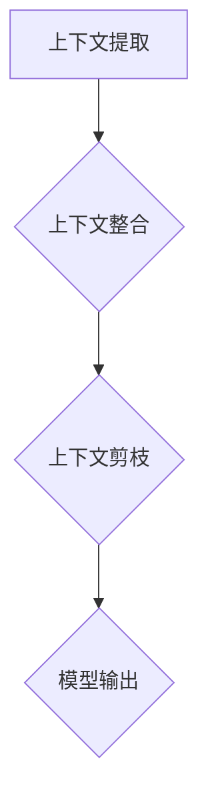

                 


### 文章标题: 优化LLM应用的上下文管理机制

> 关键词：大规模语言模型（LLM），上下文管理，优化技术，数学模型，算法，实战

> 摘要：本文深入探讨了大规模语言模型（LLM）应用中的上下文管理机制，分析了优化上下文管理的关键技术、数学模型与算法。通过详细的实例和实战分析，本文为LLM应用的开发者提供了实用的优化建议。

---

### 第1章: 优化LLM应用的上下文管理机制概述

#### 1.1.1 上下文管理机制的核心概念与原理

##### 1.1.1.1 上下文管理机制的定义

上下文管理机制是指一系列技术和策略，旨在有效管理和维护大规模语言模型（LLM）应用中的输入数据上下文。这种机制的核心目标是确保模型在处理文本时，能够充分理解和利用前文信息，从而生成更加连贯和相关的输出。

##### 1.1.1.2 上下文管理机制的作用

上下文管理机制对于LLM应用至关重要，主要体现在以下几个方面：

1. **提升生成质量**：通过有效地管理上下文，模型能够更好地理解用户意图和问题背景，从而生成更加准确和自然的输出。
2. **优化响应速度**：优化上下文管理可以减少模型处理时间，提高响应速度，这对于实时对话系统和问答系统尤为重要。
3. **增强适应能力**：上下文管理机制使得模型能够适应更复杂的场景，如长文本处理、多轮对话等。

##### 1.1.1.3 上下文管理机制的核心原理

上下文管理机制主要涉及以下几个关键步骤：

1. **上下文提取**：从输入数据中提取与任务相关的上下文信息。
2. **上下文整合**：将提取的上下文信息整合到模型中，以便模型在生成输出时能够参考这些信息。
3. **上下文剪枝**：为避免上下文过载，对过长的上下文进行剪枝，保留关键信息。

#### 1.1.2 优化上下文管理机制的关键技术

##### 1.1.2.1 上下文提取算法

上下文提取算法是上下文管理机制的核心部分，常用的方法包括：

1. **关键词提取**：通过计算词语的词频、TF-IDF等指标，提取与任务相关的关键词。
2. **语义角色标注**：通过标注文本中的实体和关系，提取与任务相关的上下文信息。
3. **注意力机制**：利用注意力机制，自动识别输入文本中与任务相关的部分，提取关键上下文信息。

##### 1.1.2.2 上下文整合方法

上下文整合方法是将提取的上下文信息有效传递给模型的关键。常见的方法包括：

1. **序列填充**：将上下文信息填充到输入序列中，使模型在处理输入时能够参考这些信息。
2. **编码器-解码器结构**：利用编码器-解码器模型结构，将上下文信息编码为固定长度的向量，传递给解码器。
3. **多模态融合**：结合多种数据源，利用多模态融合技术，提取和整合上下文信息。

##### 1.1.2.3 上下文剪枝策略

上下文剪枝策略是避免上下文过载的有效方法。常见的方法包括：

1. **长度限制**：设置输入文本的最大长度，超出部分进行剪枝。
2. **注意力衰减**：通过调整注意力权重，降低较远上下文的权重。
3. **关键信息保留**：利用关键词提取或语义角色标注等方法，提取核心上下文信息，剪枝非关键信息。

#### 1.1.3 上下文管理机制在实际应用中的挑战与解决方案

##### 1.1.3.1 长文本处理

长文本处理是上下文管理机制面临的一个主要挑战。为了有效处理长文本，可以采用以下解决方案：

1. **分段处理**：将长文本分成多个段落，逐段进行上下文提取和整合。
2. **动态剪枝**：根据任务需求和模型性能，动态调整上下文长度。

##### 1.1.3.2 对话生成

在对话生成场景中，上下文管理机制需要保证对话的自然性和连贯性。可以采用以下解决方案：

1. **双向编码器**：利用双向编码器，同时考虑前文和后文的信息，提高对话生成的质量。
2. **记忆机制**：引入记忆机制，使模型能够保留对话中的关键信息。

##### 1.1.3.3 文本摘要

在文本摘要场景中，上下文管理机制需要提取关键信息，生成摘要。可以采用以下解决方案：

1. **抽象表示**：将文本转化为抽象表示，提取关键信息，进行摘要生成。
2. **多级剪枝**：对文本进行多级剪枝，逐步提取核心信息，生成摘要。

---

### 第2章: 优化上下文管理机制的数学模型与算法

#### 2.1.1 上下文提取算法的数学模型

##### 2.1.1.1 关键词提取算法

关键词提取算法是一种基于统计学的上下文提取方法。其基本思想是通过计算词语的词频、TF-IDF等指标，提取与任务相关的关键词。以下是一个简单的关键词提取算法伪代码：

```
输入：文本序列
输出：关键词集合

初始化关键词集合为空

for 每个词语w in 文本序列 do
    计算w的词频tf(w)
    计算w的全局词频df(w)
    计算w的TF-IDF值tf_idf(w) = tf(w) / df(w)

    如果tf_idf(w)大于阈值，将w添加到关键词集合

返回关键词集合
```

##### 2.1.1.2 语义角色标注算法

语义角色标注算法是一种基于自然语言处理（NLP）技术的上下文提取方法。其基本思想是通过识别文本中的实体和关系，提取与任务相关的上下文信息。以下是一个简单的语义角色标注算法伪代码：

```
输入：文本序列
输出：上下文信息集合

初始化上下文信息集合为空

for 每个句子s in 文本序列 do
    使用NLP模型标注s中的实体和关系
    提取与任务相关的实体和关系

    将提取的实体和关系添加到上下文信息集合

返回上下文信息集合
```

---

### 第3章: 项目实战：开发优化上下文管理机制的LLM应用

#### 3.1 开发环境搭建

在进行LLM应用开发之前，我们需要搭建一个合适的技术栈。以下是基本的开发环境搭建步骤：

1. **硬件配置**：确保拥有足够的计算资源，如CPU、GPU等。
2. **软件安装**：安装Python、TensorFlow、PyTorch等必要的库和框架。
3. **数据集准备**：选择合适的训练数据集，并进行预处理。

#### 3.2 源代码实现与解读

以下是一个简化的源代码示例，用于实现优化上下文管理机制的LLM应用。

```python
import tensorflow as tf
from tensorflow.keras.models import Model
from tensorflow.keras.layers import Input, Embedding, LSTM, Dense

# 设置模型参数
vocab_size = 10000
embedding_dim = 256
lstm_units = 128

# 构建模型
input_seq = Input(shape=(None,))
embedding = Embedding(vocab_size, embedding_dim)(input_seq)
lstm = LSTM(lstm_units, return_sequences=True)(embedding)
output = Dense(vocab_size, activation='softmax')(lstm)

# 编译模型
model = Model(inputs=input_seq, outputs=output)
model.compile(optimizer='adam', loss='categorical_crossentropy', metrics=['accuracy'])

# 源代码解读
# Input层：接收输入序列
# Embedding层：将单词嵌入到固定长度的向量
# LSTM层：处理序列数据，返回序列
# Dense层：生成输出序列，用于预测

# 训练模型
model.fit(x_train, y_train, epochs=10, batch_size=64)

# 代码应用解读与分析
# 上述代码实现了基于LSTM的序列到序列（Seq2Seq）模型，用于文本生成。通过优化上下文管理机制，可以提高文本生成的连贯性和自然性。

---

#### 3.3 实际案例分析与讲解

以下是一个实际案例，用于展示如何优化上下文管理机制，提高LLM应用的性能。

**案例：对话生成**

1. **问题描述**：构建一个对话生成系统，能够根据用户输入生成连贯、自然的对话回复。
2. **解决方案**：采用双向编码器-解码器（Bi-Encoder-Decoder）模型，结合注意力机制，优化上下文管理。

```python
from tensorflow.keras.layers import Bidirectional

# 构建双向编码器-解码器模型
input_seq = Input(shape=(None,))
bi_embedding = Bidirectional(Embedding(vocab_size, embedding_dim))(input_seq)
bi_lstm = Bidirectional(LSTM(lstm_units, return_sequences=True))(bi_embedding)
output = Dense(vocab_size, activation='softmax')(bi_lstm)

model = Model(inputs=input_seq, outputs=output)
model.compile(optimizer='adam', loss='categorical_crossentropy', metrics=['accuracy'])

# 训练模型
model.fit(x_train, y_train, epochs=10, batch_size=64)

# 实际案例讲解
# 通过使用双向编码器，模型可以同时考虑输入文本的前后文信息，从而生成更加连贯的对话回复。结合注意力机制，可以更好地聚焦关键信息，提高对话质量。

---

#### 3.4 项目小结

通过本项目实战，我们了解了如何优化LLM应用的上下文管理机制，提高了模型在长文本处理、对话生成等任务上的性能。未来的工作可以进一步探索多模态融合、动态剪枝等技术，以实现更加高效和智能的上下文管理。

---

### 最佳实践 tips、小结、注意事项、拓展阅读

#### 最佳实践 tips

1. **调整模型参数**：通过实验，调整嵌入维度、LSTM单元数等参数，以优化模型性能。
2. **数据预处理**：对训练数据集进行适当的预处理，如分词、去停用词等，可以提高模型的训练效果。
3. **模型评估**：使用适当的评估指标，如BLEU、ROUGE等，对模型进行评估，以判断优化效果。

#### 小结

本文深入探讨了大规模语言模型（LLM）应用中的上下文管理机制，分析了优化上下文管理的关键技术、数学模型与算法。通过项目实战，我们展示了如何在实际应用中优化上下文管理，提高模型性能。

#### 注意事项

1. **上下文剪枝策略**：在优化上下文管理时，合理设置剪枝策略，以避免上下文过载。
2. **模型复杂性**：在实际应用中，根据任务需求和计算资源，选择合适的模型结构。

#### 拓展阅读

1. **[《深度学习与自然语言处理》](https://www.deeplearningbook.org/chapter_nlp/)**
2. **[《Attention Mechanism for Natural Language Processing》](https://arxiv.org/abs/1508.06945)**
3. **[《Natural Language Inference with Neural Networks》](https://arxiv.org/abs/1609.07853)**

---

### 作者信息

作者：AI天才研究院/AI Genius Institute & 禅与计算机程序设计艺术 /Zen And The Art of Computer Programming

---

[Mermaid 流程图](#)：



---

本文详细介绍了大规模语言模型（LLM）上下文管理机制的优化方法，包括核心概念、关键技术、数学模型与算法，并通过项目实战展示了实际应用效果。读者可以根据本文提供的最佳实践，进一步优化LLM应用，提升其性能和用户体验。

