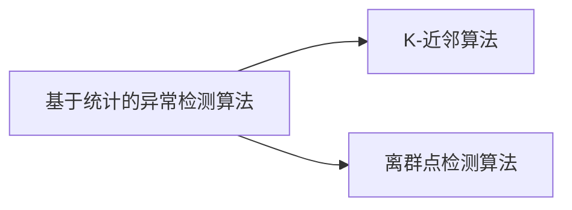
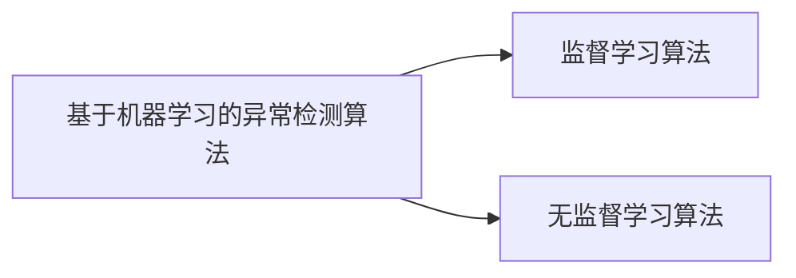
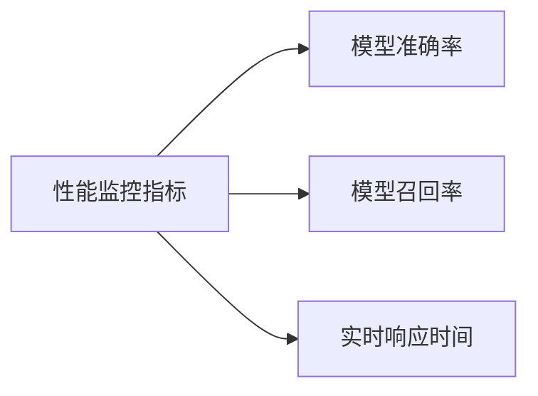
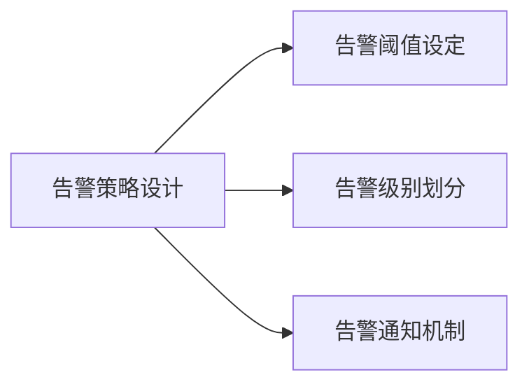
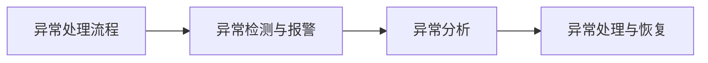
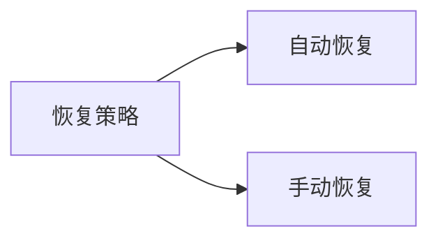

                 

### 文章标题：优化LLM应用的异常监控与告警

关键词：LLM、异常监控、告警机制、性能优化、算法实现、实践案例

摘要：随着大型语言模型（LLM）在自然语言处理、智能客服、智能推荐等领域的广泛应用，如何优化LLM应用的异常监控与告警机制成为关键问题。本文将系统地介绍LLM应用中的异常监控与告警机制，详细阐述核心概念、实现算法、实践案例，并探讨未来的研究方向。

### 第一部分：基础概念与原理

#### 第1章：语言模型介绍与优化目标

##### 1.1 语言模型概述

语言模型是自然语言处理领域的重要组成部分，用于预测文本中的下一个单词或字符。它通过学习大量文本数据，建立起词汇之间的概率分布关系。语言模型可以分为统计模型和基于深度学习的模型。统计模型如n-gram模型，基于统计语言模型中的历史信息进行预测；而基于深度学习的模型如Transformer，通过神经网络学习复杂的上下文关系。

##### 1.2 优化目标

在LLM应用中，优化目标主要包括以下几个方面：

1. 减少预测误差：提高模型的预测准确性，降低预测误差。
2. 提高模型稳定性：确保模型在各种环境下都能稳定运行。
3. 减少计算资源消耗：优化模型结构，降低模型训练和推理的复杂度。

##### 1.3 语言模型优化方法

1. **数据增强**：通过增加训练数据量和数据多样性，提高模型泛化能力。
2. **模型压缩**：采用模型剪枝、量化等技术，减少模型参数和计算复杂度。
3. **动态调整**：根据应用场景实时调整模型参数，实现自适应优化。

#### 第2章：异常监控与告警的基本概念

##### 2.1 异常监控的定义

异常监控是指对系统运行状态进行实时监测，及时发现并处理异常情况，以确保系统稳定运行。在LLM应用中，异常监控包括模型预测错误、资源消耗异常等。

##### 2.2 告警机制

告警机制是在异常监控过程中，对检测到的异常情况发出警报，通知相关人员进行处理。告警机制的设计原则包括：

1. **及时性**：快速发现并通知异常情况。
2. **准确性**：确保告警信息的准确性和可靠性。
3. **可扩展性**：支持不同类型的异常告警。

##### 2.3 异常监控与告警的关系

异常监控与告警机制相互关联，异常监控负责检测异常，而告警机制负责通知和反馈。二者共同构成了LLM应用的异常处理体系。

#### 第3章：LLM应用场景下的异常监控与告警

##### 3.1 LLM应用场景概述

LLM在自然语言处理、智能客服、智能推荐、机器翻译等领域的应用广泛。在不同应用场景下，异常监控与告警的需求和挑战也有所不同。

##### 3.2 异常监控与告警的挑战

1. **数据质量的影响**：数据质量直接影响模型的预测准确性，需要确保数据的清洁和多样性。
2. **模型复杂度的限制**：复杂的模型可能导致计算资源消耗增加，需要优化模型结构和算法。
3. **实时性的需求**：在实时应用场景下，要求异常监控和告警机制快速响应，以确保系统稳定运行。

### 第二部分：核心技术与实现

#### 第4章：LLM异常检测算法

##### 4.1 基于统计的异常检测算法

基于统计的异常检测算法通过计算数据分布的统计量，识别异常数据点。常见的算法包括K-近邻算法和离群点检测算法。

##### 4.2 基于机器学习的异常检测算法

基于机器学习的异常检测算法通过训练模型，学习正常数据的特征，从而识别异常数据。常见的算法包括监督学习和无监督学习算法。

#### 第5章：LLM性能监控与告警

##### 5.1 性能监控指标

LLM性能监控主要包括模型准确率、召回率、实时响应时间等指标。

##### 5.2 告警策略设计

告警策略设计包括告警阈值设定、告警级别划分和告警通知机制。

#### 第6章：LLM应用异常处理与恢复

##### 6.1 异常处理流程

LLM应用异常处理流程包括异常检测与报警、异常分析和异常处理与恢复。

##### 6.2 恢复策略

恢复策略包括自动恢复和手动恢复两种方式，根据实际情况选择合适的恢复策略。

### 第三部分：总结与展望

#### 第7章：实践案例与应用

##### 7.1 案例一：智能客服系统的异常监控与告警

- 案例背景
- 案例实施

##### 7.2 案例二：智能推荐系统的异常监控与告警

- 案例背景
- 案例实施

#### 第8章：总结与展望

##### 8.1 总结

- 主要内容回顾
- 技术发展趋势

##### 8.2 展望

- 未来研究方向
- 技术创新方向

### 结语

作者：AI天才研究院/AI Genius Institute & 禅与计算机程序设计艺术 /Zen And The Art of Computer Programming

本文系统地介绍了LLM应用的异常监控与告警机制，从基础概念、核心算法到实践案例进行了全面剖析。随着LLM技术的不断发展，如何优化异常监控与告警机制，提高模型稳定性和实时性，将成为未来研究的重点方向。希望本文能为读者在LLM应用领域提供有益的参考和启示。

