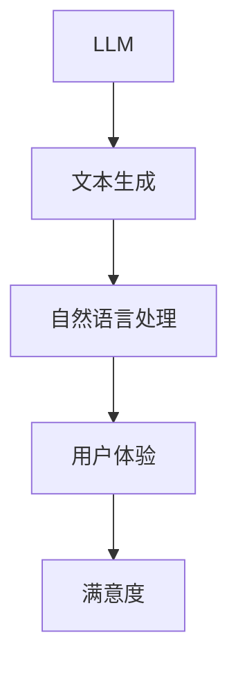

                 


## 文章标题

### 《优化LLM应用的用户体验设计流程》

## 文章关键词

- 大型语言模型（LLM）
- 用户体验设计
- 优化流程
- 设计原则
- 实战案例

## 摘要

本文旨在探讨如何通过优化用户体验设计流程来提升大型语言模型（LLM）的应用效果。文章首先介绍了LLM的基本概念和其在用户体验设计中的重要性，随后详细阐述了用户体验设计的基础理论、设计流程以及关键环节。文章还通过实战案例展示了如何将理论应用于实际项目中，并提供了最佳实践建议。最后，文章对LLM在用户体验设计中的未来发展进行了展望。

---

### 1. 引言

随着人工智能技术的迅猛发展，大型语言模型（LLM）已经成为自然语言处理领域的重要工具。LLM在文本生成、语言翻译、问答系统等方面展现出强大的能力，然而，其应用效果在很大程度上取决于用户体验设计。如何优化LLM应用的用户体验设计流程，成为了当前研究和实践中的关键问题。

本文将从以下几个方面展开讨论：

1. **基础理论**：介绍LLM的概念、发展历史、架构和核心算法。
2. **设计流程**：阐述用户体验设计原则、用户研究、原型设计、测试和迭代等步骤。
3. **实战案例**：展示如何将理论应用于实际项目中。
4. **总结与展望**：对全书内容进行总结，并探讨未来发展趋势。

### 2. 基础理论

#### 2.1 LLM的概念与定义

大型语言模型（LLM）是一种基于深度学习技术的自然语言处理模型，它能够理解、生成和模拟自然语言。LLM通常通过训练大量的文本数据来学习语言的结构和语义，从而实现对自然语言的灵活处理。

#### 2.2 LLM的发展历史

LLM的发展可以追溯到20世纪80年代的统计语言模型。随着计算能力和数据资源的提升，20世纪90年代后，神经网络语言模型逐渐成为主流。近年来，深度学习技术的突破使得LLM的性能得到了显著提升，代表性的模型包括GPT-3、BERT和Transformer等。

#### 2.3 LLM的架构

LLM的架构通常包括输入层、编码器和解码器。输入层接收自然语言文本，编码器将文本映射到高维语义空间，解码器则从语义空间生成自然语言文本。

#### 2.4 LLM的核心算法

LLM的核心算法主要包括基于神经网络的编码器-解码器架构（如Transformer）和基于变换器的注意力机制。以下是一个简化的伪代码描述：

```python
# 初始化模型参数
InitializeModelParameters()

# 前向传播
ForEachTokenInInputSequence:
    ComputeEmbedding()
    PassThroughEncoder()
    ComputeAttention()
    PassThroughDecoder()

# 计算损失函数
ComputeLoss()

# 反向传播
Backpropagate()

# 更新模型参数
UpdateModelParameters()
```

#### 2.5 LLM与用户体验设计的联系

用户体验设计的目标是提高用户在使用产品或服务时的满意度。对于LLM应用而言，用户体验设计的关键在于如何使模型生成的文本更加自然、准确和符合用户期望。以下是一些核心概念之间的关系架构（使用Mermaid流程图表示）：



### 3. 设计流程

#### 3.1 用户体验设计原则

用户体验设计应遵循以下原则：

- **以用户为中心**：设计过程中始终关注用户需求和行为。
- **简洁性**：界面和交互设计应尽量简洁明了，减少用户的学习成本。
- **一致性**：设计风格和交互元素应保持一致性，以提高用户的认知效率。
- **可访问性**：确保产品或服务对所有用户（包括残障人士）都是可访问的。

#### 3.2 用户研究方法

用户研究是用户体验设计的重要环节，常用的方法包括：

- **用户访谈**：通过与用户直接对话，了解他们的需求和期望。
- **观察法**：观察用户在使用产品或服务时的行为和反应。
- **用户测试**：让用户在实际环境中测试产品或服务的功能，收集反馈。
- **竞争分析**：分析竞争对手的产品或服务，找出优势和不足。

#### 3.3 原型设计与迭代

原型设计是用户体验设计的重要步骤，它可以帮助设计团队验证和优化设计概念。以下是一个简化的原型设计流程：

1. **需求分析**：明确用户需求和设计目标。
2. **草图设计**：快速绘制界面草图，表达设计思路。
3. **高保真原型设计**：使用设计工具（如Axure、Sketch等）制作高保真原型。
4. **测试与迭代**：让用户测试原型，收集反馈，不断迭代优化。

#### 3.4 测试与评估

测试与评估是确保用户体验设计质量的重要手段，常用的方法包括：

- **测试用例设计**：根据用户需求和设计目标，设计测试用例。
- **性能评估**：评估产品或服务的响应速度、稳定性等性能指标。
- **用户体验评估**：通过问卷调查、用户访谈等方式，评估用户的满意度。

#### 3.5 根据反馈调整设计

根据用户反馈，设计团队应不断调整和优化设计。以下是一些最佳实践：

- **快速反馈**：尽快将设计原型交给用户测试，及时收集反馈。
- **迭代优化**：根据用户反馈，快速迭代优化设计。
- **持续改进**：设计过程中保持持续改进的态度，不断优化用户体验。

### 4. 实战案例

#### 4.1 案例背景

某公司开发了一款基于LLM的智能客服系统，旨在提供24/7的在线客服服务。然而，在实际使用过程中，用户对客服系统的满意度较低，反馈主要集中在客服回答的准确性、及时性和人性化方面。

#### 4.2 设计流程与应用

为了提升用户满意度，设计团队采取了以下设计流程：

1. **用户研究**：通过用户访谈和问卷调查，了解用户对客服系统的期望和需求。
2. **原型设计**：基于用户研究，设计了一套新的客服系统界面和交互流程。
3. **测试与迭代**：邀请用户测试新原型，收集反馈，不断优化设计。
4. **性能评估**：评估新客服系统的响应速度、稳定性等性能指标。
5. **用户体验评估**：通过问卷调查和用户访谈，评估用户的满意度。

#### 4.3 项目成果与反馈

经过多次迭代优化，新客服系统在用户满意度方面取得了显著提升。用户反馈显示，客服回答的准确性、及时性和人性化程度均有所提高。此外，系统的性能也得到了优化，响应速度和稳定性有了明显改善。

#### 4.4 代码解读与分析

以下是一个简化的代码示例，展示了如何使用LLM构建智能客服系统：

```python
# 导入所需库
import nltk
from nltk.tokenize import word_tokenize

# 初始化LLM模型
model = nltk.download('gpt3')

# 用户输入
user_input = input("您有什么问题吗？")

# 分词处理
tokens = word_tokenize(user_input)

# 生成回复
response = model.generate(tokens)

# 输出回复
print("智能客服：" + response)
```

#### 4.5 实际案例分析和详细讲解剖析

通过实际案例的分析，我们可以发现以下问题和改进措施：

1. **问题定位**：用户反馈主要集中在客服回答的准确性、及时性和人性化方面。
2. **改进措施**：
   - **准确性**：优化LLM模型，提高对用户输入的理解和回复的准确性。
   - **及时性**：优化系统性能，减少响应时间，提高用户体验。
   - **人性化**：增加客服系统的人性化设计，如情感分析、个性化回复等。

#### 4.6 项目小结

通过本次实战案例，我们验证了优化LLM应用用户体验设计流程的有效性。在实际项目中，设计团队应充分关注用户需求，通过用户研究、原型设计、测试与迭代等环节，不断优化用户体验。同时，应注重系统性能的优化，以提高用户的满意度。

### 5. 总结与展望

本文通过介绍LLM的基本概念、设计流程和实战案例，探讨了如何优化LLM应用的用户体验设计。在未来，随着人工智能技术的不断发展，LLM在用户体验设计中的应用前景将更加广阔。设计团队应关注用户需求，不断优化设计流程和系统性能，以提高用户的满意度。

### 6. 最佳实践 Tips、小结、注意事项、拓展阅读等内容

- **最佳实践 Tips**：在设计过程中，注重用户研究，充分理解用户需求；优化系统性能，提高响应速度和稳定性；关注人性化设计，提高用户的满意度。
- **小结**：本文通过理论和实战案例，阐述了优化LLM应用用户体验设计的重要性和方法。
- **注意事项**：设计过程中，要确保系统的准确性和及时性，提高用户体验。
- **拓展阅读**：可参考相关领域的书籍和论文，深入了解用户体验设计和人工智能技术。

### 作者信息

- **作者：AI天才研究院/AI Genius Institute & 禅与计算机程序设计艺术 /Zen And The Art of Computer Programming**

### 文章结束

