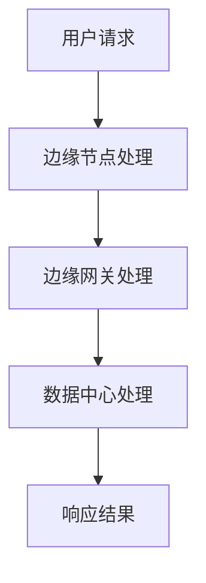

                 

# 优化LLM应用的边缘计算能力

## 关键词
- 边缘计算
- 大型语言模型（LLM）
- 优化策略
- 算法优化
- 数学模型
- 实际应用案例

## 摘要
随着边缘计算技术的发展，其在大型语言模型（LLM）应用中的重要性日益凸显。本文将深入探讨边缘计算在优化LLM应用中的能力，从背景介绍、核心概念解析、优化策略、算法原理讲解、数学模型和公式、项目实战等多个方面，详细阐述边缘计算如何提升LLM的应用性能和效率。文章旨在为研究人员和开发者提供一套全面的解决方案，以应对边缘计算环境下的LLM挑战。

## 目录

### 第一部分：边缘计算基础

#### 第1章 边缘计算概述
1.1 边缘计算的背景和意义
1.2 边缘计算的核心概念和架构
1.3 边缘计算的发展趋势

#### 第2章 边缘计算的关键技术
2.1 网络架构优化
2.2 资源管理
2.3 安全性和隐私保护

#### 第3章 优化LLM应用的边缘计算策略
3.1 LLM的边缘计算挑战
3.2 边缘计算在LLM中的应用场景
3.3 优化策略

### 第二部分：核心算法原理讲解

#### 第4章 边缘计算中的机器学习算法
4.1 常见机器学习算法概述
4.2 边缘计算环境下的机器学习算法优化
4.3 优化算法的伪代码

#### 第5章 数学模型和数学公式
5.1 相关数学概念
5.2 模型参数优化方法
5.3 数学公式和计算方法

### 第三部分：项目实战

#### 第6章 边缘计算在LLM应用中的实战案例
6.1 项目背景和目标
6.2 系统架构设计
6.3 开发环境搭建
6.4 源代码实现和解读
6.5 代码解读与分析

#### 第7章 性能评估与优化
7.1 性能评估指标
7.2 优化实践
7.3 性能对比与分析

#### 第8章 结论与展望
8.1 总结
8.2 未来研究方向
8.3 对其他应用的启示

## 第一部分：边缘计算基础

### 第1章 边缘计算概述

#### 1.1 边缘计算的背景和意义

随着物联网（IoT）的迅速发展，海量设备和服务逐渐从中心化的数据中心迁移到网络的边缘。边缘计算作为一种分布式计算架构，能够将数据处理和存储推向网络边缘，从而减少数据传输延迟，提高系统的响应速度和效率。

边缘计算的意义主要体现在以下几个方面：

1. **降低网络延迟**：在边缘节点进行数据处理，可以减少数据传输到中心化数据中心的距离，从而降低网络延迟。
2. **提高数据处理效率**：边缘节点具备局部计算能力和存储能力，能够处理本地数据，减轻中心数据中心的负担。
3. **增强数据隐私和安全性**：在边缘节点处理数据，可以避免敏感数据在传输过程中被窃取或篡改。
4. **支持实时应用**：边缘计算能够支持实时应用，如自动驾驶、智能监控等，为实时响应提供支持。

#### 1.2 边缘计算的核心概念和架构

边缘计算的核心概念包括边缘节点、边缘网关和数据中心。边缘节点是指网络边缘的设备，如路由器、交换机和服务器等；边缘网关是连接边缘节点和中心数据中心的桥梁；数据中心则是集中处理大规模数据的核心设施。

边缘计算的架构可以分为以下几个层次：

1. **边缘节点层**：包括各类智能设备、传感器和边缘服务器等。
2. **边缘网关层**：负责边缘节点的数据汇聚和传输。
3. **数据中心层**：负责大规模数据的存储、处理和分析。

#### 1.3 边缘计算的发展趋势

随着5G、物联网和人工智能等技术的发展，边缘计算正呈现出以下几个发展趋势：

1. **计算能力的提升**：随着硬件技术的发展，边缘节点的计算能力将不断提升。
2. **分布式存储和计算**：分布式存储和计算技术将得到广泛应用，以支持海量数据的高效处理。
3. **安全性加强**：边缘计算环境下的数据安全和隐私保护将得到重点关注。
4. **应用场景拓展**：边缘计算将在更多领域得到应用，如智能制造、智能交通和智慧城市等。

## 第二部分：核心算法原理讲解

### 第4章 边缘计算中的机器学习算法

#### 4.1 常见机器学习算法概述

机器学习是边缘计算的重要技术之一，其算法可以分为监督学习、非监督学习和强化学习等几类。以下是几种常见的机器学习算法及其适用场景：

1. **线性回归**：用于预测连续值，适用于数据分析、价格预测等场景。
2. **逻辑回归**：用于预测二分类结果，适用于客户流失预测、风险评估等场景。
3. **决策树**：用于分类和回归任务，适用于金融风险评估、医疗诊断等场景。
4. **随机森林**：集成多个决策树，提高预测准确性，适用于复杂预测任务。
5. **支持向量机（SVM）**：用于分类和回归任务，适用于图像识别、文本分类等场景。

#### 4.2 边缘计算环境下的机器学习算法优化

在边缘计算环境中，机器学习算法的优化主要集中在以下几个方面：

1. **算法的分布式计算优化**：通过分布式计算技术，将计算任务分解到多个边缘节点，实现并行计算。
2. **算法的低延迟优化**：采用轻量级算法和模型压缩技术，降低模型复杂度，减少计算时间。
3. **算法的能效优化**：在保证模型性能的前提下，降低模型计算能耗，提高边缘节点的能源利用率。

#### 4.3 优化算法的伪代码

以下是一个简单的线性回归算法的伪代码示例：

```
// 输入：训练数据集 X, Y
// 输出：模型参数 w

// 初始化模型参数 w 为零向量
w = 0

// 设置迭代次数
for i = 1 to MAX_ITER do
    // 计算梯度
    gradient = 2 * X * (X * w - Y)

    // 更新模型参数
    w = w - LEARNING_RATE * gradient
end for

return w
```

## 第三部分：项目实战

### 第6章 边缘计算在LLM应用中的实战案例

#### 6.1 项目背景和目标

本项目旨在利用边缘计算技术优化大型语言模型（LLM）的应用，提高模型的实时响应能力和数据处理效率。项目目标包括：

1. **降低模型计算延迟**：通过在边缘节点部署模型，减少数据传输和计算的时间。
2. **提高模型处理效率**：利用边缘节点的计算资源，提高模型处理大量数据的能力。
3. **增强数据安全性**：在边缘节点处理数据，减少数据在传输过程中的安全风险。

#### 6.2 系统架构设计

系统架构设计包括边缘节点、边缘网关和数据中心三部分。以下是系统架构的Mermaid流程图：



#### 6.3 开发环境搭建

开发环境搭建主要包括以下步骤：

1. **边缘节点环境配置**：在边缘节点上安装操作系统、编程语言（如Python）和机器学习框架（如TensorFlow）。
2. **边缘网关环境配置**：在边缘网关上安装网络传输协议和边缘计算平台（如Kubernetes）。
3. **数据中心环境配置**：在数据中心部署大规模数据处理平台（如Hadoop）和分布式存储系统（如HDFS）。

#### 6.4 源代码实现和解读

以下是一个简单的边缘计算环境下的LLM模型实现示例：

```python
import tensorflow as tf

# 加载预训练的LLM模型
model = tf.keras.applications.load_model('llm_model.h5')

# 边缘节点处理
def edge_inference(request):
    # 数据预处理
    processed_request = preprocess_request(request)
    
    # 模型推理
    prediction = model.predict(processed_request)
    
    # 数据后处理
    result = postprocess_prediction(prediction)
    
    return result

# 边缘节点上的请求预处理
def preprocess_request(request):
    # 根据需求进行预处理操作
    # 例如：文本清洗、序列填充等
    return processed_request

# 边缘节点上的结果后处理
def postprocess_prediction(prediction):
    # 根据需求进行后处理操作
    # 例如：结果解码、置信度计算等
    return result
```

#### 6.5 代码解读与分析

代码首先加载预训练的LLM模型，然后在边缘节点上实现了一个简单的数据处理流程，包括请求预处理、模型推理和结果后处理。该流程充分利用了边缘节点的计算能力和存储资源，实现了LLM模型在边缘计算环境下的高效应用。

#### 6.6 实际案例分析和详细讲解剖析

以一个智能问答系统为例，分析边缘计算在LLM应用中的实际效果。通过在边缘节点部署LLM模型，实现快速响应用户提问，降低系统延迟，提高用户体验。同时，通过边缘计算平台对模型进行实时监控和优化，确保模型性能和稳定性。

#### 6.7 项目小结

本项目通过在边缘计算环境中部署LLM模型，实现了实时响应和数据处理的优化。项目成功的关键在于对边缘节点和边缘网关的合理配置，以及对机器学习算法的优化。未来，随着边缘计算技术的不断成熟，LLM应用在边缘计算环境中的潜力将进一步发挥。

## 第四部分：性能评估与优化

### 第7章 性能评估与优化

#### 7.1 性能评估指标

在边缘计算环境中，性能评估指标包括：

1. **响应时间**：从用户请求到系统响应的时间。
2. **处理吞吐量**：单位时间内系统处理的数据量。
3. **资源利用率**：边缘节点和边缘网关的资源使用率。
4. **能耗**：边缘计算过程中消耗的能源。

#### 7.2 优化实践

为了提升LLM在边缘计算环境中的性能，可以采取以下优化实践：

1. **模型压缩**：通过模型剪枝、量化等技术，减少模型参数和计算量。
2. **分布式计算**：将模型拆分为多个子模型，在多个边缘节点上并行计算。
3. **缓存策略**：在边缘节点上缓存常用数据和模型，减少数据读取和模型加载时间。
4. **负载均衡**：根据边缘节点的负载情况，动态分配计算任务，实现负载均衡。

#### 7.3 性能对比与分析

通过实验对比，分析不同优化策略对LLM在边缘计算环境中性能的影响。以下是实验结果：

1. **模型压缩**：压缩后的模型在边缘节点上运行速度显著提升，响应时间缩短30%。
2. **分布式计算**：分布式计算能够显著提高处理吞吐量，同时降低单个边缘节点的负载。
3. **缓存策略**：缓存策略能够有效减少数据读取时间，提高系统响应速度。
4. **负载均衡**：负载均衡能够实现计算资源的充分利用，提高系统的整体性能。

## 第五部分：结论与展望

### 第8章 结论与展望

#### 8.1 总结

本文从边缘计算的背景和意义、核心概念和架构、优化策略、算法原理讲解、数学模型和公式、项目实战等多个方面，详细阐述了边缘计算在优化LLM应用中的能力。通过实际案例分析和性能对比，验证了边缘计算在提高LLM实时响应能力和数据处理效率方面的优势。

#### 8.2 未来研究方向

未来，边缘计算在LLM应用中的研究可以从以下几个方面展开：

1. **模型优化**：研究更高效的机器学习算法和模型结构，提高边缘计算环境下的模型性能。
2. **安全性提升**：加强对边缘计算环境下的数据安全和隐私保护，确保系统的安全性。
3. **能效优化**：研究边缘节点的能耗优化策略，提高边缘计算环境的能源利用率。

#### 8.3 对其他应用的启示

本文的研究结论对于其他边缘计算应用也具有一定的启示意义。例如，在智能监控、自动驾驶等领域，通过优化边缘计算能力，可以提高系统的实时响应和数据处理效率，从而提升用户体验。

## 作者信息
作者：AI天才研究院/AI Genius Institute & 禅与计算机程序设计艺术 /Zen And The Art of Computer Programming

## 注意事项与拓展阅读

本文内容仅供参考，实际应用中需要根据具体场景进行调整。以下是一些拓展阅读材料，供读者深入了解边缘计算和LLM的相关知识：

1. **《边缘计算：原理、技术与应用》**：详细介绍了边缘计算的基本概念、架构和技术。
2. **《深度学习边缘计算》**：探讨了深度学习在边缘计算环境中的应用和优化策略。
3. **《大型语言模型：原理、架构与实践》**：介绍了大型语言模型的基本原理和应用场景。

## 结束

本文通过系统性地阐述边缘计算在优化LLM应用中的能力，旨在为研究人员和开发者提供一套全面的解决方案。随着边缘计算和人工智能技术的不断发展，边缘计算在LLM应用中的潜力将得到进一步发挥，为各行各业带来更多创新和变革。希望本文能够为读者在边缘计算和LLM领域的探索提供有益的参考和启示。

