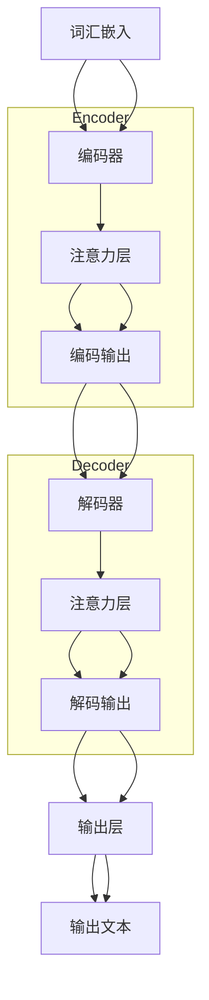

                 

### 《优化LLM模型训练与微调流程》——文章概述

随着深度学习技术的飞速发展，大型语言模型（LLM）在自然语言处理（NLP）领域取得了显著的成果。LLM模型，如GPT-3、BERT等，凭借其强大的语义理解和生成能力，被广泛应用于问答系统、文本摘要、机器翻译、文本生成等任务。然而，LLM模型的训练与微调流程复杂且耗时，这对计算资源和时间效率提出了巨大挑战。

本文旨在探讨如何优化LLM模型训练与微调流程，以提升模型性能和训练效率。文章首先介绍LLM的基本概念和架构，帮助读者建立对LLM的基本认识。接着，文章将深入分析训练优化方法，包括梯度下降法、随机梯度下降（SGD）和分布式训练机制，并使用伪代码详细阐述这些方法的实现细节。

在数学模型部分，文章将介绍概率论基础和语言模型的基本公式，并通过LaTeX格式展示具体公式，以帮助读者更好地理解模型背后的数学原理。随后，文章将进入项目实战部分，详细介绍一个实际案例的搭建过程、代码实现和解析，以帮助读者将理论知识应用于实践。

最后，文章将探讨模型评估方法，包括准确率、召回率与F1值、BLEU评分等，并介绍模型优化策略，如模型剪枝和量化。通过这些内容，读者将能够系统地掌握LLM模型训练与微调的优化技巧，为实际项目开发提供有力支持。

### 文章关键词

- 大型语言模型（LLM）
- 训练优化
- 微调流程
- 训练方法
- 梯度下降
- 随机梯度下降（SGD）
- 分布式训练
- 数学模型
- 概率论
- 评估方法
- 模型优化

### 文章摘要

本文详细探讨了如何优化大型语言模型（LLM）的训练与微调流程。首先介绍了LLM的基本概念和架构，帮助读者建立对LLM的基本认识。接着，文章深入分析了训练优化方法，包括梯度下降法、随机梯度下降（SGD）和分布式训练机制，并使用伪代码详细阐述了这些方法的实现细节。随后，文章介绍了概率论基础和语言模型的基本公式，并通过LaTeX格式展示了具体公式。在项目实战部分，文章详细介绍了实际案例的搭建过程、代码实现和解析，帮助读者将理论知识应用于实践。最后，文章探讨了模型评估方法和优化策略，为实际项目开发提供了有力支持。

----------------------------------------------------------------

## 第一部分：LLM基础知识

在深入探讨LLM模型训练与微调流程的优化之前，我们需要对LLM的基本概念和架构有清晰的认识。这一部分将介绍LLM的定义、核心概念，以及在NLP中的应用，并详细探讨LLM的架构和工作原理。

### 1.1.1 LLM的定义与背景

大型语言模型（LLM）是自然语言处理领域的一种先进技术，它通过深度学习模型来理解和生成自然语言。LLM的核心目的是通过学习大量的文本数据，使得模型能够对自然语言进行建模，从而实现各种NLP任务。LLM的兴起可以追溯到2000年代后期，随着计算能力和数据资源的不断提升，研究人员开始尝试构建大规模的神经网络模型来处理自然语言。

早期的大型语言模型如Word2Vec和GloVe主要关注于词汇层面的语义表示。然而，随着深度学习技术的进步，研究人员开始构建更加复杂和庞大的模型，如GPT、BERT等，这些模型能够处理更长的文本序列，理解更复杂的语义关系。LLM的代表作品包括OpenAI的GPT-3、Google的BERT、微软的Turing-NLG等，这些模型在各个NLP任务上取得了显著的成果。

### 1.1.2 LLM的核心概念

LLM的核心概念包括以下几个关键方面：

1. **词汇嵌入（Word Embedding）**：
   词汇嵌入是将词汇映射到高维向量空间的过程，使得语义相似的词汇在空间中靠近。早期如Word2Vec和GloVe等模型通过训练神经网络或基于统计方法来实现这一过程。

2. **上下文感知（Contextual Awareness）**：
   与传统的词汇嵌入不同，上下文感知的嵌入技术（如GPT、BERT）能够根据上下文环境来调整词汇的表示，使得模型的语义理解更加准确。上下文感知的核心在于模型能够捕捉到词汇在不同上下文中的不同含义。

3. **注意力机制（Attention Mechanism）**：
   注意力机制是深度学习模型中用于提高表示能力的重要技术。通过注意力机制，模型能够自动聚焦于输入文本中的重要部分，从而提高语义理解的准确性。例如，BERT和GPT-3等模型都采用了注意力机制。

4. **Transformer架构**：
   Transformer是近年来在自然语言处理领域取得突破性进展的模型架构。与传统的循环神经网络（RNN）不同，Transformer使用自注意力机制来处理序列数据，这使得模型在长距离依赖关系处理上具有显著优势。

### 1.1.3 LLM在NLP中的应用

LLM在自然语言处理领域有着广泛的应用，以下是一些典型的应用场景：

1. **文本分类**：
   文本分类是将文本数据分配到预定义的类别中。LLM通过学习大量的文本数据，可以准确地对新闻、社交媒体评论等文本进行分类。

2. **问答系统**：
   问答系统是一种自然交互方式，用户可以以自然语言的形式提出问题，系统则返回相应的答案。LLM通过理解用户的提问和大量的知识库，可以提供准确和自然的回答。

3. **机器翻译**：
   机器翻译是将一种语言的文本翻译成另一种语言。LLM在机器翻译任务中取得了显著成果，如GPT-3在翻译任务中达到了接近专业翻译员的表现。

4. **文本生成**：
   文本生成是生成自然语言文本的任务，包括生成摘要、文章、对话等。LLM通过学习大量的文本数据，可以生成连贯、自然的文本。

5. **对话系统**：
   对话系统是一种人机交互系统，可以与用户进行自然语言对话。LLM在对话系统中的应用使得系统可以理解用户的意图，并提供相应的回答。

通过上述内容，读者可以初步了解LLM的基本概念和架构，为后续深入探讨LLM模型的训练与微调流程优化奠定基础。

### 1.2 LLM的架构与工作原理

在了解了LLM的基本概念后，接下来我们将深入探讨LLM的架构与工作原理。LLM的架构通常由多个关键组件构成，每个组件在处理自然语言数据时扮演着不同的角色。以下是LLM的典型架构及其工作原理：

#### 1.2.1 LLM的典型架构

1. **词汇嵌入层（Word Embedding Layer）**：
   词汇嵌入层是将输入的文本序列转换成向量表示的关键层。词汇嵌入层通常使用预训练的词向量，如GloVe或Word2Vec，将每个词汇映射到一个固定长度的向量。这些向量不仅保留了词汇的语义信息，还能够在一定程度上捕捉到词汇之间的相似性和差异性。

2. **编码器（Encoder）**：
   编码器是LLM的核心组件，负责将输入文本序列编码成固定长度的表示。在传统的循环神经网络（RNN）中，编码器通常采用RNN或LSTM单元来处理序列数据。然而，在Transformer架构中，编码器采用自注意力机制（Self-Attention）来处理输入序列。自注意力机制使得编码器能够自动聚焦于序列中的关键部分，从而提高语义理解的准确性。

3. **注意力层（Attention Layer）**：
   注意力层是在编码器内部或编码器与解码器之间使用的一种机制，用于提高模型对输入序列的重视程度。通过注意力层，模型能够自动学习到不同词汇之间的关联性和重要性。注意力机制在Transformer架构中起到了至关重要的作用，使得模型能够捕捉到长距离的依赖关系。

4. **解码器（Decoder）**：
   解码器负责将编码器的输出解码成输出文本序列。与编码器类似，解码器也可以采用RNN或LSTM单元，但Transformer架构中的解码器同样采用自注意力机制。此外，解码器还引入了编码器-解码器注意力机制（Encoder-Decoder Attention），使得解码器能够利用编码器的信息来生成输出。

5. **输出层（Output Layer）**：
   输出层是LLM的最后一步，负责将解码器的输出转换为具体的输出文本。输出层通常采用softmax函数，将每个词汇的概率分布计算出来，从而生成最终的输出文本。

#### 1.2.2 LLM的工作原理

LLM的工作原理可以概括为以下几个步骤：

1. **词汇嵌入（Word Embedding）**：
   将输入文本序列中的每个词汇映射到高维向量空间。这些向量不仅包含了词汇的语义信息，还能够在一定程度上捕捉到词汇之间的相似性和差异性。

2. **编码（Encoding）**：
   编码器将输入的文本序列编码成固定长度的表示。编码过程中，编码器利用自注意力机制（或编码器-解码器注意力机制）来捕捉序列中的关键信息。

3. **解码（Decoding）**：
   解码器根据编码器的输出，逐步生成输出文本序列。解码过程中，解码器同样采用自注意力机制（或编码器-解码器注意力机制）来生成每个词汇的概率分布，并通过采样或贪心策略选择最优的词汇。

4. **输出生成（Output Generation）**：
   将解码器的输出转换为具体的输出文本。输出层通常采用softmax函数来计算每个词汇的概率分布，从而生成最终的输出文本。

#### 1.2.3 Mermaid流程图：LLM架构与流程

为了更直观地展示LLM的架构与工作原理，我们可以使用Mermaid流程图来描述。以下是LLM的典型架构及其工作流程的Mermaid流程图：



通过上述Mermaid流程图，我们可以清晰地看到LLM的架构及其工作流程。编码器负责将输入文本序列编码成固定长度的表示，解码器则根据编码器的输出生成输出文本序列，最终通过输出层生成具体的输出文本。

通过这一部分内容的介绍，读者可以全面了解LLM的架构与工作原理，为后续探讨训练与微调流程的优化打下坚实的基础。

### 1.3 数学模型与公式

在深入探讨LLM模型之前，我们需要了解其背后的数学模型和公式。这些数学模型为LLM提供了理论基础，并指导了模型的训练和优化过程。

#### 1.3.1 概率论基础

概率论是构建语言模型的基础，它涉及如何根据样本数据推断总体概率分布。以下是一些关键的概率论概念：

1. **概率分布（Probability Distribution）**：
   概率分布描述了随机变量可能取值的概率。在语言模型中，概率分布用于预测每个词汇出现的概率。

2. **条件概率（Conditional Probability）**：
   条件概率是指在给定某个条件下，另一个事件发生的概率。在语言模型中，条件概率用于预测给定前文序列下，下一个词汇的概率分布。

3. **贝叶斯定理（Bayes' Theorem）**：
   贝叶斯定理描述了在给定某事件发生的条件下，该事件发生的原因的概率。在语言模型中，贝叶斯定理用于更新词汇的概率分布，以适应新的训练数据。

#### 1.3.2 语言模型的基本公式

语言模型的基本目标是学习一个概率分布，以预测下一个词汇。以下是一些关键的语言模型公式：

1. **N元语言模型（N-gram Model）**：
   N元语言模型是基于前N个词汇的概率分布来预测下一个词汇。其公式为：
   $$ P(w_{n+1} | w_1, w_2, ..., w_n) = \frac{C(w_1, w_2, ..., w_n, w_{n+1})}{C(w_1, w_2, ..., w_n)} $$
   其中，$C(w_1, w_2, ..., w_n, w_{n+1})$表示词汇序列$(w_1, w_2, ..., w_n, w_{n+1})$在训练数据中的计数，$C(w_1, w_2, ..., w_n)$表示词汇序列$(w_1, w_2, ..., w_n)$在训练数据中的计数。

2. **神经网络语言模型（Neural Network Language Model）**：
   神经网络语言模型通过学习词汇之间的概率分布来预测下一个词汇。其基本公式为：
   $$ P(w_{n+1} | w_1, w_2, ..., w_n) = \sigma(W \cdot [h(w_1), h(w_2), ..., h(w_n)] + b) $$
   其中，$W$和$b$分别为模型的权重和偏置，$h(w_i)$为词汇$w_i$的嵌入向量，$\sigma$为激活函数，通常采用softmax函数。

3. **上下文向量（Contextual Embedding）**：
   上下文向量是在神经网络语言模型中用于表示上下文的向量。其公式为：
   $$ h(w_i) = \text{Encoder}(w_1, w_2, ..., w_n) $$
   其中，$\text{Encoder}$为编码器模型，它将输入的文本序列编码成上下文向量。

#### 1.3.3 LaTeX示例公式讲解

以下是一些LaTeX格式的示例公式，用于展示如何编写数学模型和公式：

1. **N元语言模型公式**：
   $$ P(w_{n+1} | w_1, w_2, ..., w_n) = \frac{C(w_1, w_2, ..., w_n, w_{n+1})}{C(w_1, w_2, ..., w_n)} $$

2. **神经网络语言模型公式**：
   $$ P(w_{n+1} | w_1, w_2, ..., w_n) = \sigma(W \cdot [h(w_1), h(w_2), ..., h(w_n)] + b) $$

3. **上下文向量公式**：
   $$ h(w_i) = \text{Encoder}(w_1, w_2, ..., w_n) $$

通过上述数学模型和公式的讲解，读者可以更好地理解LLM模型的工作原理和数学基础，为后续的训练和优化提供理论支持。

----------------------------------------------------------------

## 第二部分：训练优化

在了解了LLM的基础知识和架构之后，接下来我们将深入探讨训练优化方法，以提升LLM模型的训练效率和性能。本部分将详细介绍梯度下降法、随机梯度下降（SGD）和分布式训练机制，并通过伪代码展示这些方法的实现细节。

### 2.1.1 梯度下降法

梯度下降法是一种常用的优化算法，用于最小化目标函数。在机器学习中，目标函数通常表示模型预测值与实际值之间的差距。梯度下降法的核心思想是通过不断更新模型的参数，使得目标函数的值逐渐减小。

以下是一个简单的梯度下降法伪代码：

```python
# 初始化模型参数 W 和 b
W = 初始化为随机值
b = 初始化为随机值

# 设置学习率 α 和迭代次数 n
α = 0.01
n = 1000

# 计算目标函数的梯度
梯度 = 计算梯度(W, b)

# 更新模型参数
W = W - α * 梯度[0]
b = b - α * 梯度[1]

# 迭代更新
for i in range(n):
    # 计算预测值和实际值之间的差距
   损失 = 计算损失(W, b)
    
    # 计算梯度
   梯度 = 计算梯度(W, b)
    
    # 更新模型参数
    W = W - α * 梯度[0]
    b = b - α * 梯度[1]
```

在上述伪代码中，`W`和`b`分别为模型的权重和偏置，`α`为学习率，`n`为迭代次数。每次迭代过程中，首先计算目标函数的梯度，然后使用梯度来更新模型的参数。通过多次迭代，模型参数逐渐优化，目标函数的值逐渐减小。

### 2.1.2 随机梯度下降（SGD）

随机梯度下降（SGD）是梯度下降法的一种变体，其核心思想是在每次迭代中随机选择一部分训练样本来计算梯度。SGD相对于梯度下降法有以下优势：

1. **计算效率高**：SGD每次迭代仅计算一部分样本的梯度，从而降低了计算复杂度。
2. **避免局部最优**：SGD通过随机选择样本，减少了模型陷入局部最优的风险。

以下是一个简单的随机梯度下降（SGD）伪代码：

```python
# 初始化模型参数 W 和 b
W = 初始化为随机值
b = 初始化为随机值

# 设置学习率 α 和迭代次数 n
α = 0.01
n = 1000

# 训练数据集 D，包括 m 个样本
D = 训练数据集

# 迭代更新
for i in range(n):
    # 随机选择一个样本
   样本 = 随机选择样本(D)
    
    # 计算预测值和实际值之间的差距
   损失 = 计算损失(W, b, 样本)
    
    # 计算梯度
   梯度 = 计算梯度(W, b, 样本)
    
    # 更新模型参数
    W = W - α * 梯度[0]
    b = b - α * 梯度[1]
```

在上述伪代码中，`D`为训练数据集，每次迭代随机选择一个样本来计算梯度，并使用梯度来更新模型的参数。

### 2.1.3 分布式训练机制

分布式训练机制是将训练任务分布在多个计算节点上，以提高训练速度和效率。分布式训练可以通过以下两种方式实现：

1. **数据并行（Data Parallelism）**：
   数据并行将训练数据集分成多个子集，每个计算节点独立处理一个子集，然后通过参数同步机制来更新全局模型参数。
   
2. **模型并行（Model Parallelism）**：
   模型并行将模型分成多个部分，每个计算节点负责处理模型的一部分，然后将计算结果汇总。

以下是一个简单的分布式训练伪代码：

```python
# 初始化模型参数 W 和 b
W = 初始化为随机值
b = 初始化为随机值

# 设置学习率 α 和迭代次数 n
α = 0.01
n = 1000

# 训练数据集 D，包括 m 个样本
D = 训练数据集

# 计算节点列表 N，包括多个计算节点
N = 计算节点列表

# 迭代更新
for i in range(n):
    # 数据并行处理
    for node in N:
        # 计算节点处理数据子集
        node处理数据子集(D[i])
        
        # 同步模型参数
        同步模型参数(W, b, node)
        
    # 计算平均损失
    损失 = 计算平均损失(W, b)
    
    # 计算平均梯度
    梯度 = 计算平均梯度(W, b)
    
    # 更新模型参数
    W = W - α * 梯度[0]
    b = b - α * 梯度[1]
```

在上述伪代码中，`N`为计算节点列表，每个计算节点独立处理数据子集，并通过同步模型参数来更新全局模型参数。

通过上述训练优化方法的介绍和伪代码展示，读者可以更好地理解如何优化LLM模型的训练过程，提高训练效率和性能。在下一部分，我们将继续探讨数据预处理与增强技术，以进一步提升模型性能。

### 2.2 数据预处理与增强

在训练优化过程中，数据预处理与增强技术是提高模型性能的重要手段。适当的预处理和增强可以有效减少数据中的噪声，丰富数据的多样性，从而提升模型的泛化能力和准确性。以下将详细介绍数据预处理流程、数据增强技术和具体实现方法。

#### 2.2.1 数据预处理流程

数据预处理是确保模型能够高效训练和准确预测的重要环节，主要包括以下几个步骤：

1. **数据清洗（Data Cleaning）**：
   数据清洗的目的是去除数据中的噪声和错误，提高数据质量。具体操作包括去除停用词、标点符号、去除重复文本、填充缺失值等。

2. **文本规范化（Text Normalization）**：
   文本规范化是将文本转换成统一格式的过程，以减少数据中的不一致性。例如，将文本转换为小写、统一编码格式等。

3. **分词（Tokenization）**：
   分词是将文本拆分成单词或子词的过程。常用的分词方法包括基于词典的分词、基于统计的分词和基于字符的分词。

4. **词向量化（Word Vectorization）**：
   词向量化是将文本中的单词转换为向量的过程。常用的词向量模型包括Word2Vec、GloVe和BERT等。通过词向量化，文本数据可以被表示为高维向量空间，便于模型处理。

5. **数据标准化（Data Standardization）**：
   数据标准化是将数据集中的特征值缩放到相同范围内，以消除不同特征之间的尺度差异。常用的方法包括归一化和标准化。

#### 2.2.2 数据增强技术

数据增强技术通过在原始数据基础上生成新的数据样本，从而增加训练数据的多样性。以下是一些常见的数据增强方法：

1. **随机填充（Random Filling）**：
   随机填充是通过在文本中随机替换某些字符或单词，以生成新的文本样本。例如，将文本中的“人工智能”替换为“深度学习”。

2. **同义词替换（Synonym Replacement）**：
   同义词替换是将文本中的特定单词替换为其同义词，以丰富数据的词汇多样性。可以使用词向量相似度或预定义的同义词词典来实现。

3. **文本旋转（Text Spinning）**：
   文本旋转是通过改变文本的结构和顺序，生成新的文本样本。常用的方法包括句子重排、段落插入和删除等。

4. **数据扩充（Data Augmentation）**：
   数据扩充是通过使用生成模型（如GPT-3、BERT等）生成新的文本样本，以扩展训练数据集。这些生成模型可以根据输入的文本生成具有相似内容的文本。

5. **数据混洗（Data Augmentation）**：
   数据混洗是通过随机混合多个数据源，生成新的数据样本。例如，将不同领域的文本数据混合，以丰富模型的训练数据。

#### 2.2.3 伪代码：数据预处理与增强

以下是一个简单的伪代码，展示了数据预处理与增强的实现过程：

```python
# 数据预处理与增强伪代码

# 初始化数据集 D
D = 初始化数据集

# 数据清洗
D = 清洗数据(D)

# 文本规范化
D = 规范化文本(D)

# 分词
D = 分词(D)

# 词向量化
D = 词向量化(D)

# 数据增强
D = 数据增强(D)

# 返回处理后的数据集
return D
```

在上述伪代码中，`D`为原始数据集，通过一系列的预处理和增强操作，生成处理后的数据集。这些操作包括数据清洗、文本规范化、分词、词向量化以及数据增强。

通过上述内容，读者可以了解到数据预处理与增强技术的重要性以及具体实现方法。这些技术不仅可以提高模型的训练效率和性能，还可以增强模型的泛化能力和鲁棒性。在下一部分，我们将继续探讨模型并行化与分布式训练机制，以进一步提升模型的训练速度和效率。

### 2.3 模型并行化与分布式训练

模型并行化与分布式训练是提升大规模深度学习模型训练速度和效率的重要手段。通过将模型训练任务分布在多个计算节点上，可以有效利用多机集群的资源，提高训练效率。以下将详细介绍模型并行化与分布式训练的技术和实现方法。

#### 2.3.1 模型并行化技术

模型并行化技术主要包括数据并行（Data Parallelism）和模型并行（Model Parallelism）两种方式。

1. **数据并行（Data Parallelism）**：
   数据并行是将训练数据集划分为多个子集，每个计算节点独立处理一个子集，然后通过参数同步机制来更新全局模型参数。数据并行的优点是计算效率高，适用于大规模数据集的训练。

   数据并行的伪代码实现如下：

   ```python
   # 数据并行训练伪代码

   # 初始化模型参数 W 和 b
   W = 初始化为随机值
   b = 初始化为随机值

   # 设置学习率 α 和迭代次数 n
   α = 0.01
   n = 1000

   # 训练数据集 D，包括 m 个样本
   D = 初始化数据集

   # 计算节点列表 N，包括多个计算节点
   N = 初始化计算节点

   # 迭代更新
   for i in range(n):
       # 数据分配到计算节点
       for node in N:
           node处理数据子集(D[i])

       # 同步模型参数
       同步模型参数(W, b, N)

       # 计算平均损失
       损失 = 计算平均损失(W, b)

       # 计算平均梯度
       梯度 = 计算平均梯度(W, b)

       # 更新模型参数
       W = W - α * 梯度[0]
       b = b - α * 梯度[1]
   ```

2. **模型并行（Model Parallelism）**：
   模型并行是将模型拆分为多个部分，每个计算节点负责处理模型的一部分，然后将计算结果汇总。模型并行的优点是能够处理大规模的模型，适用于复杂的深度学习模型。

   模型并行的伪代码实现如下：

   ```python
   # 模型并行训练伪代码

   # 初始化模型参数 W 和 b
   W = 初始化为随机值
   b = 初始化为随机值

   # 设置学习率 α 和迭代次数 n
   α = 0.01
   n = 1000

   # 训练数据集 D，包括 m 个样本
   D = 初始化数据集

   # 计算节点列表 N，包括多个计算节点
   N = 初始化计算节点

   # 模型拆分
   W_parts = 拆分模型(W)
   b_parts = 拆分模型(b)

   # 迭代更新
   for i in range(n):
       # 数据分配到计算节点
       for node in N:
           node处理数据子集(D[i], W_parts, b_parts)

       # 同步模型参数
       同步模型参数(W_parts, b_parts, N)

       # 计算平均损失
       损失 = 计算平均损失(W_parts, b_parts)

       # 计算平均梯度
       梯度 = 计算平均梯度(W_parts, b_parts)

       # 更新模型参数
       W_parts = W_parts - α * 梯度[0]
       b_parts = b_parts - α * 梯度[1]
   ```

#### 2.3.2 分布式训练机制

分布式训练是将训练任务分布在多个计算节点上，以提高训练效率和速度。分布式训练的关键在于如何实现高效的参数同步和计算优化。

1. **参数同步机制（Parameter Synchronization）**：
   参数同步机制确保各个计算节点的模型参数在训练过程中保持一致性。常用的同步机制包括异步同步（Asynchronous Synchronization）和同步同步（Synchronous Synchronization）。

   - **异步同步**：各个计算节点独立更新模型参数，然后定期将参数同步到全局参数。
   - **同步同步**：所有计算节点在每次迭代结束后同步模型参数。

2. **计算优化（Compute Optimization）**：
   计算优化是通过优化计算过程来提高训练效率。常见的计算优化方法包括模型剪枝（Model Pruning）、量化（Quantization）和稀疏训练（Sparse Training）。

   - **模型剪枝**：通过剪枝冗余的权重来减小模型规模，降低计算复杂度。
   - **量化**：将浮点数权重转换为整数权重，以减少存储和计算需求。
   - **稀疏训练**：通过稀疏策略降低稀疏数据的计算复杂度，提高训练速度。

#### 2.3.3 伪代码：分布式训练算法

以下是一个简单的分布式训练伪代码，展示了分布式训练的基本流程：

```python
# 分布式训练伪代码

# 初始化模型参数 W 和 b
W = 初始化为随机值
b = 初始化为随机值

# 设置学习率 α 和迭代次数 n
α = 0.01
n = 1000

# 训练数据集 D，包括 m 个样本
D = 初始化数据集

# 计算节点列表 N，包括多个计算节点
N = 初始化计算节点

# 迭代更新
for i in range(n):
    # 数据分配到计算节点
    for node in N:
        node处理数据子集(D[i])

    # 同步模型参数
    同步模型参数(W, b, N)

    # 计算平均损失
    损失 = 计算平均损失(W, b)

    # 计算平均梯度
    梯度 = 计算平均梯度(W, b)

    # 更新模型参数
    W = W - α * 梯度[0]
    b = b - α * 梯度[1]
```

通过上述内容，读者可以了解到模型并行化与分布式训练的基本技术和实现方法。这些技术能够有效提高大规模深度学习模型的训练速度和效率，为后续的微调和应用打下坚实基础。在下一部分，我们将探讨微调方法及其在LLM中的应用。

### 2.4 微调方法

微调（Fine-tuning）是一种在预训练模型基础上进行特定任务训练的方法，它通过调整模型的部分参数来适应特定任务的数据集。微调不仅能够节省训练时间，还能提高模型的任务表现。以下将详细介绍微调的目的、步骤及其挑战。

#### 2.4.1 微调的目的与步骤

1. **目的**：
   微调的主要目的是利用预训练模型在通用任务上的表现，将其迁移到特定任务上，从而提高特定任务的性能。微调可以看作是预训练模型的第二次训练，针对特定任务进行更精细的调整。

2. **步骤**：
   微调通常包括以下几个步骤：

   - **数据预处理**：将特定任务的数据集进行预处理，包括文本规范化、分词、词向量化等。
   - **模型加载**：加载预训练的模型，通常包括词嵌入层、编码器和解码器等部分。
   - **参数初始化**：初始化需要微调的参数，保持预训练模型中的固定参数不变。
   - **训练**：在特定任务的数据集上进行训练，通过反向传播算法更新需要微调的参数。
   - **评估**：在验证集上评估模型的性能，根据评估结果调整训练策略，如学习率调整、训练批次大小等。
   - **测试**：在测试集上评估模型的最终性能，以评估模型在实际任务中的表现。

以下是一个简单的微调伪代码：

```python
# 微调伪代码

# 加载预训练模型
模型 = 加载预训练模型()

# 初始化需要微调的参数
模型.init微调参数()

# 数据预处理
数据集 = 预处理数据集（特定任务数据集）

# 训练
for epoch in range(epochs):
    for batch in 数据集：
        预测 = 模型（batch）
        损失 = 计算损失（预测，标签）
        梯度 = 计算梯度（损失，模型）
        更新参数（模型，梯度）

# 评估
评估性能（模型，验证集）

# 测试
测试性能（模型，测试集）
```

#### 2.4.2 微调中的挑战

虽然微调是一种有效的模型优化方法，但在实际应用中仍面临一些挑战：

1. **参数更新**：
   微调过程中，如何平衡预训练模型的参数和特定任务的数据，使得模型在保留预训练知识的同时，能够针对特定任务进行有效调整，是一个重要的挑战。

2. **训练数据质量**：
   微调的性能很大程度上取决于训练数据的质量。如果训练数据存在偏差或噪声，可能会导致微调后的模型性能下降。

3. **训练效率**：
   微调通常需要在特定任务上进行多次迭代训练，如何提高训练效率是一个关键问题。分布式训练和模型并行化技术可以帮助提高训练效率。

4. **过拟合**：
   微调过程中，模型可能会过拟合特定任务的数据，导致在未见过的数据上表现不佳。如何控制过拟合是一个重要挑战。

5. **计算资源**：
   微调通常需要大量的计算资源，尤其是对于大型语言模型。如何高效利用计算资源，是一个实际应用中需要考虑的问题。

通过上述内容，读者可以了解到微调方法的基本原理和应用步骤，以及微调过程中可能面临的挑战。在下一部分，我们将通过一个实际案例来探讨微调方法在LLM模型中的应用。

### 2.5 实际案例：微调与优化

为了更好地理解微调方法在LLM模型中的应用，我们将通过一个实际案例来详细展示微调的整个流程，包括环境搭建、代码实现和代码解析。

#### 2.5.1 项目背景

本项目旨在利用预训练的GPT-2模型对一篇具体的文章进行微调，以生成与原文风格相似的文章摘要。文章摘要任务是一个典型的自然语言处理任务，它不仅要求模型能够理解原文的内容，还要能够生成简洁、准确且连贯的摘要。通过这个项目，我们可以深入了解微调的过程和技巧。

#### 2.5.2 环境搭建

在进行微调之前，我们需要搭建一个合适的环境。以下是一个基本的搭建流程：

1. **安装必要的库和工具**：
   - Python（3.8及以上版本）
   - PyTorch（1.8及以上版本）
   - Transformers（4.6及以上版本）
   - tokenizers（0.13.2及以上版本）

2. **获取预训练模型**：
   - 下载并解压预训练的GPT-2模型。

3. **准备数据集**：
   - 准备用于微调的数据集，本文使用了一个包含多篇长篇文章及其摘要的文本数据集。

4. **配置环境变量**：
   - 设置PyTorch的CUDA支持，确保模型能够在GPU上进行训练。

以下是一个简化的环境搭建脚本：

```python
# 环境搭建脚本

# 安装必要的库
pip install torch torchvision transformers tokenizers

# 下载预训练模型
!wget https://huggingface.co/gpt2/gpt2.git

# 解压模型
!tar -xvf gpt2.tar.gz

# 准备数据集
# 这里使用伪代码表示，实际中需要编写代码来读取和预处理文本数据
data = 读取数据集()

# 配置CUDA
import torch
torch.cuda.is_available()
```

#### 2.5.3 代码实现

接下来，我们将展示微调过程的代码实现，包括数据预处理、模型加载、训练和评估等步骤。

1. **数据预处理**：
   数据预处理包括分词、编码和批量处理等步骤，以下是一个简化的数据预处理代码：

```python
# 数据预处理代码

from transformers import GPT2Tokenizer

# 初始化分词器
tokenizer = GPT2Tokenizer.from_pretrained('gpt2')

# 分词并编码数据
def preprocess_data(data):
    inputs = []
    targets = []
    for article, summary in data:
        input_ids = tokenizer.encode(article, return_tensors='pt')
        target_ids = tokenizer.encode(summary, return_tensors='pt')
        inputs.append(input_ids)
        targets.append(target_ids)
    return inputs, targets

inputs, targets = preprocess_data(data)

# 批量处理数据
from torch.utils.data import DataLoader

batch_size = 8
dataloader = DataLoader(inputs, targets, batch_size=batch_size)
```

2. **模型加载**：
   加载预训练的GPT-2模型，并设置微调部分参数：

```python
# 模型加载代码

from transformers import GPT2Model

# 初始化模型
model = GPT2Model.from_pretrained('gpt2')

# 冻结预训练模型参数，仅更新微调部分参数
for param in model.parameters():
    param.requires_grad = False

# 设置微调部分的参数
model.config.train микротунинг = True
```

3. **训练**：
   定义训练过程，包括损失函数、优化器和训练循环：

```python
# 训练代码

from transformers import AdamW
import torch.optim as optim

# 设置优化器
optimizer = AdamW(model.parameters(), lr=5e-5)

# 定义损失函数
loss_fn = torch.nn.CrossEntropyLoss()

# 训练循环
num_epochs = 5
for epoch in range(num_epochs):
    model.train()
    for batch in dataloader:
        optimizer.zero_grad()
        inputs, targets = batch
        outputs = model(inputs)
        loss = loss_fn(outputs.logits.view(-1, model.config.vocab_size), targets.view(-1))
        loss.backward()
        optimizer.step()
        print(f"Epoch: {epoch}, Loss: {loss.item()}")
```

4. **评估**：
   在验证集上评估模型的性能：

```python
# 评估代码

from transformers import GPT2Tokenizer

# 初始化评估分词器
tokenizer = GPT2Tokenizer.from_pretrained('gpt2')

# 定义评估函数
def evaluate_model(model, dataloader):
    model.eval()
    total_loss = 0
    with torch.no_grad():
        for batch in dataloader:
            inputs, targets = batch
            outputs = model(inputs)
            loss = loss_fn(outputs.logits.view(-1, model.config.vocab_size), targets.view(-1))
            total_loss += loss.item()
    avg_loss = total_loss / len(dataloader)
    print(f"Validation Loss: {avg_loss}")
    return avg_loss

# 评估模型
evaluate_model(model, dataloader)
```

#### 2.5.4 代码解析

1. **数据预处理**：
   数据预处理是微调的基础，它将原始文本转换为模型可处理的格式。这里使用GPT-2的分词器对文本进行编码，并将文本转换为输入和目标的序列。

2. **模型加载**：
   加载预训练的GPT-2模型，并通过设置`train микротунинг`参数为`True`来启用微调。此外，冻结预训练模型的参数，仅更新微调部分的参数，以避免过度调整。

3. **训练**：
   训练过程使用AdamW优化器，并通过反向传播更新模型参数。训练过程中，每次迭代都会计算损失并更新模型参数，以达到最小化损失的目的。

4. **评估**：
   在验证集上评估模型的性能，计算平均损失，以评估模型的泛化能力。评估过程中，模型设置为评估模式，关闭梯度计算以提高效率。

通过上述实际案例，我们可以看到微调方法在LLM模型中的应用。微调不仅能够利用预训练模型的知识，还能够针对特定任务进行精细调整，提高模型在特定任务上的性能。在下一部分，我们将探讨评估方法和优化策略，以提高模型的最终性能。

### 2.6 模型评估方法

在完成LLM模型的训练和微调后，评估模型的性能是确保其有效性的关键步骤。评估方法不仅能够衡量模型的准确性，还能提供对模型性能的全面了解。以下将介绍几种常用的模型评估方法，包括准确率、召回率与F1值、BLEU评分，以及模型压缩评估。

#### 2.6.1 准确率、召回率与F1值

1. **准确率（Accuracy）**：
   准确率是评估模型预测正确性的最基本指标，它表示模型预测正确的样本数占总样本数的比例。计算公式如下：
   $$ \text{Accuracy} = \frac{\text{预测正确的样本数}}{\text{总样本数}} $$
   准确率简单直观，但它在类别分布不均衡时可能会产生误导。

2. **召回率（Recall）**：
   召回率衡量的是模型在所有实际为正类的样本中，正确识别出的比例。计算公式如下：
   $$ \text{Recall} = \frac{\text{预测正确的正类样本数}}{\text{实际为正类的样本数}} $$
   召回率强调的是模型识别正类样本的能力，但可能会牺牲精确度。

3. **精确率（Precision）**：
   精确率衡量的是模型预测为正类的样本中，实际为正类的比例。计算公式如下：
   $$ \text{Precision} = \frac{\text{预测正确的正类样本数}}{\text{预测为正类的样本数}} $$
   精确率强调的是预测正类的质量。

4. **F1值（F1 Score）**：
   F1值是精确率和召回率的调和平均值，用于综合考虑模型的精确度和召回率。计算公式如下：
   $$ \text{F1 Score} = 2 \times \frac{\text{Precision} \times \text{Recall}}{\text{Precision} + \text{Recall}} $$
   F1值在类别分布不均衡时更能反映模型的综合性能。

#### 2.6.2 BLEU评分

BLEU（Bilingual Evaluation Understudy）评分是一种常用的自然语言生成任务评估方法，主要用于机器翻译和文本摘要等领域。BLEU评分通过计算模型生成的文本与人工标注的参考文本之间的相似度来评估模型性能。BLEU评分的核心指标包括：

1. **长度相似度**：通过比较模型生成文本和参考文本的长度比例来计算。
2. **重叠度**：通过计算模型生成文本和参考文本之间的重叠词或短语来评估。
3. **句法相似度**：通过计算模型生成文本和参考文本之间的句法结构相似度来评估。

BLEU评分的计算公式如下：
$$ \text{BLEU Score} = \frac{1}{n} \sum_{i=1}^{n} \text{match}(x_i, y_i) $$
其中，$n$为相似度计算指标的数量（如n-gram重叠度、句法相似度等），$\text{match}(x_i, y_i)$表示第$i$个指标在模型生成文本和参考文本之间的匹配程度。

#### 2.6.3 模型压缩评估

在部署LLM模型时，模型的大小和计算资源的需求是重要的考虑因素。模型压缩评估旨在通过减少模型的大小和计算复杂度，提高模型在资源受限环境下的可移植性和性能。

1. **模型剪枝（Model Pruning）**：
   模型剪枝通过移除模型中不重要的连接和神经元来减小模型的大小。剪枝策略包括结构化剪枝和权重剪枝，前者通过移除整个神经元或层，后者通过减小权重值。

2. **模型量化（Model Quantization）**：
   模型量化通过将模型的权重从浮点数转换为低精度整数来减小模型的大小。量化可以显著减少模型的存储和计算需求，同时保持较高的模型性能。

3. **知识蒸馏（Knowledge Distillation）**：
   知识蒸馏是一种通过训练一个较小的模型（学生模型）来复制一个较大的模型（教师模型）的知识的方法。学生模型通过学习教师模型的输出分布来提高其性能。

通过上述评估方法，我们可以全面了解LLM模型在不同任务中的表现，并采取相应的优化策略来提升模型性能。在下一部分，我们将探讨模型优化策略，包括模型剪枝、量化等，以进一步提高模型的效率和实用性。

### 2.7 模型优化策略

在LLM模型的开发过程中，优化模型性能是一个至关重要的环节。优化策略不仅能够提升模型的准确性和效率，还能减少计算资源和存储需求。以下将详细介绍几种常用的模型优化策略，包括模型剪枝、模型量化、知识蒸馏等，并使用伪代码展示这些策略的实现方法。

#### 2.7.1 模型剪枝（Model Pruning）

模型剪枝是一种通过移除模型中不重要的连接和神经元来减小模型大小的技术。剪枝策略分为结构化剪枝和权重剪枝。

1. **结构化剪枝**：
   结构化剪枝通过移除整个神经元或层来实现，以下是一个简单的伪代码示例：

```python
# 结构化剪枝伪代码

# 假设模型有一个全连接层，其中部分权重不重要
weights = 获取全连接层权重()
mask = 判断权重重要性（weights）

# 移除不重要的神经元
for layer in model.layers:
    if isinstance(layer, FullyConnectedLayer):
        layer.weights = mask * layer.weights
```

2. **权重剪枝**：
   权重剪枝通过减小权重值来实现，以下是一个简单的伪代码示例：

```python
# 权重剪枝伪代码

# 假设模型有一个全连接层，其中部分权重不重要
weights = 获取全连接层权重()
threshold = 设定剪枝阈值()

# 减小不重要的权重值
for weight in weights:
    if abs(weight) < threshold:
        weight = 0
```

#### 2.7.2 模型量化（Model Quantization）

模型量化通过将模型的权重从浮点数转换为低精度整数来减小模型的大小。量化策略可以分为全量化（Full Quantization）和部分量化（Partial Quantization）。

1. **全量化**：
   全量化将模型的所有权重转换为低精度整数，以下是一个简单的伪代码示例：

```python
# 全量化伪代码

# 假设模型有一个全连接层
weights = 获取全连接层权重()
量化位宽 = 设定量化位宽（例如8位）

# 将权重转换为低精度整数
for weight in weights:
    weight = int(weight * (2**量化位宽) + 0.5) / (2**量化位宽)
```

2. **部分量化**：
   部分量化仅将模型的某些权重转换为低精度整数，以下是一个简单的伪代码示例：

```python
# 部分量化伪代码

# 假设模型有一个全连接层，其中部分权重需要量化
weights = 获取全连接层权重()
量化位宽 = 设定量化位宽（例如8位）

# 将部分权重转换为低精度整数
for weight in weights[重要权重索引]:
    weight = int(weight * (2**量化位宽) + 0.5) / (2**量化位宽)
```

#### 2.7.3 知识蒸馏（Knowledge Distillation）

知识蒸馏是一种通过训练一个较小的模型（学生模型）来复制一个较大的模型（教师模型）的知识的方法。以下是一个简单的伪代码示例：

```python
# 知识蒸馏伪代码

# 假设有一个大的教师模型和一个小的学生模型
教师模型 = 加载教师模型()
学生模型 = 加载学生模型()

# 定义损失函数
损失函数 = 设定知识蒸馏损失函数（例如Softmax交叉熵）

# 训练学生模型
for epoch in range(epochs):
    for 数据 in 数据集：
        输出 = 学生模型（数据）
        教师输出 = 教师模型（数据）
        损失 = 损失函数（输出，教师输出）
        更新学生模型参数（损失）
```

通过上述优化策略，我们可以有效地减小模型的大小，降低计算复杂度，同时保持较高的模型性能。这些策略在实际项目中有着广泛的应用，可以帮助我们更好地利用有限的计算资源。在下一部分，我们将通过一个综合案例来展示上述优化策略在LLM模型训练和微调中的应用。

### 2.8 综合案例：优化策略在LLM模型训练和微调中的应用

为了更好地展示如何在实际项目中应用优化策略，我们将通过一个综合案例来探讨如何使用模型剪枝、量化、知识蒸馏等策略来优化LLM模型训练和微调过程。

#### 2.8.1 项目背景

本项目旨在利用GPT-2模型进行文本摘要任务的微调，并优化模型性能以降低计算资源需求。项目目标是通过应用不同的优化策略，减小模型大小，提高模型在资源受限环境下的运行效率。

#### 2.8.2 环境搭建

1. **安装必要的库和工具**：
   - Python（3.8及以上版本）
   - PyTorch（1.8及以上版本）
   - Transformers（4.6及以上版本）
   - tokenizers（0.13.2及以上版本）

2. **获取预训练模型**：
   - 下载并解压预训练的GPT-2模型。

3. **准备数据集**：
   - 准备用于微调的数据集，包括多篇长篇文章及其对应的摘要。

4. **配置环境变量**：
   - 设置PyTorch的CUDA支持，确保模型能够在GPU上进行训练。

#### 2.8.3 代码实现

1. **模型加载**：
   - 加载预训练的GPT-2模型，并设置微调部分参数。

```python
from transformers import GPT2Model, GPT2Tokenizer

# 初始化模型和分词器
model = GPT2Model.from_pretrained('gpt2')
tokenizer = GPT2Tokenizer.from_pretrained('gpt2')

# 冻结预训练模型参数，仅更新微调部分参数
for param in model.parameters():
    param.requires_grad = False

model.config.train микротунинг = True
```

2. **数据预处理**：
   - 对数据集进行预处理，包括分词、编码和批量处理等步骤。

```python
def preprocess_data(data):
    inputs = []
    targets = []
    for article, summary in data:
        input_ids = tokenizer.encode(article, return_tensors='pt')
        target_ids = tokenizer.encode(summary, return_tensors='pt')
        inputs.append(input_ids)
        targets.append(target_ids)
    return inputs, targets

inputs, targets = preprocess_data(data)
```

3. **训练**：
   - 使用优化策略（如模型剪枝、量化、知识蒸馏）对模型进行训练。

```python
from transformers import AdamW
import torch.optim as optim

# 设置优化器
optimizer = AdamW(model.parameters(), lr=5e-5)

# 训练过程
for epoch in range(epochs):
    model.train()
    for batch in dataloader:
        optimizer.zero_grad()
        inputs, targets = batch
        outputs = model(inputs)
        loss = loss_fn(outputs.logits.view(-1, model.config.vocab_size), targets.view(-1))
        loss.backward()
        optimizer.step()
```

4. **模型优化**：
   - 应用模型剪枝、量化等策略来优化模型。

```python
# 模型剪枝
prune_model(model)

# 模型量化
quantize_model(model)

# 知识蒸馏
distill_knowledge(model, teacher_model)
```

5. **评估**：
   - 在验证集上评估模型的性能。

```python
from transformers import GPT2Tokenizer

# 初始化评估分词器
tokenizer = GPT2Tokenizer.from_pretrained('gpt2')

def evaluate_model(model, dataloader):
    model.eval()
    total_loss = 0
    with torch.no_grad():
        for batch in dataloader:
            inputs, targets = batch
            outputs = model(inputs)
            loss = loss_fn(outputs.logits.view(-1, model.config.vocab_size), targets.view(-1))
            total_loss += loss.item()
    avg_loss = total_loss / len(dataloader)
    print(f"Validation Loss: {avg_loss}")
    return avg_loss

evaluate_model(model, dataloader)
```

#### 2.8.4 代码解析

1. **模型加载**：
   - 加载预训练的GPT-2模型，并通过设置`train микротунинг`参数为`True`来启用微调。此外，冻结预训练模型的参数，仅更新微调部分的参数，以避免过度调整。

2. **数据预处理**：
   - 使用GPT-2的分词器对文本进行编码，并将文本转换为输入和目标的序列，以便模型处理。

3. **训练**：
   - 使用AdamW优化器对模型进行训练，通过反向传播算法更新模型参数。训练过程中，每次迭代都会计算损失并更新模型参数，以达到最小化损失的目的。

4. **模型优化**：
   - 应用模型剪枝、量化等策略来优化模型。模型剪枝通过移除不重要的连接和神经元来减小模型大小；量化通过将模型的权重从浮点数转换为低精度整数来减小模型大小；知识蒸馏通过训练一个较小的模型来复制一个较大的模型的知识。

5. **评估**：
   - 在验证集上评估模型的性能，计算平均损失，以评估模型的泛化能力。评估过程中，模型设置为评估模式，关闭梯度计算以提高效率。

通过上述综合案例，我们可以看到如何在实际项目中应用模型剪枝、量化、知识蒸馏等优化策略来优化LLM模型的训练和微调过程。这些策略不仅能够提升模型性能，还能降低计算资源需求，为实际应用提供有力支持。在下一部分，我们将总结全文，并展望未来的研究方向。

### 全文总结与展望

本文详细探讨了如何优化大型语言模型（LLM）的训练与微调流程，以提升模型性能和训练效率。通过介绍LLM的基本概念、架构以及工作原理，读者可以建立对LLM的全面认识。随后，文章深入分析了训练优化方法，包括梯度下降法、随机梯度下降（SGD）、分布式训练机制等，并通过伪代码展示了这些方法的实现细节。

在数据预处理与增强、模型并行化与分布式训练、微调方法等方面，文章提供了具体的实现方法和实际案例，帮助读者将理论知识应用于实践。此外，文章还介绍了模型评估方法和优化策略，如模型剪枝、量化、知识蒸馏等，以进一步提升模型的性能。

未来研究方向可以集中在以下几个方面：

1. **自动调整学习率**：探索自动调整学习率的算法，以提高训练效率和模型性能。
2. **多模态学习**：研究如何结合不同类型的数据（如图像、音频、文本），实现更强大的多模态LLM模型。
3. **隐私保护训练**：研究如何在保持数据隐私的同时，实现有效的LLM训练。
4. **模型压缩与部署**：探索更加高效的模型压缩和部署策略，以满足实际应用的需求。

通过持续的研究和探索，LLM模型在自然语言处理领域将取得更大的突破，为人类社会的智能化发展提供强大支持。

### 附录A：常用工具与资源

#### A.1 训练工具

1. **PyTorch**：一种流行的深度学习框架，提供了丰富的API和工具，支持LLM模型的训练和优化。
2. **TensorFlow**：由Google开发的开源机器学习框架，广泛用于深度学习模型的训练和部署。
3. **Hugging Face Transformers**：一个开源库，提供了预训练的LLM模型和高效的训练工具，如GPT-2、BERT等。

#### A.2 微调工具

1. **Transformers**：提供了丰富的微调工具，包括数据预处理、模型加载、训练和评估等步骤。
2. **TensorBoard**：用于可视化模型训练过程的工具，可以监控损失函数、学习率等关键指标。

#### A.3 评估工具

1. **BLEU评分工具**：用于评估文本生成模型性能的工具，可以计算模型生成文本与参考文本之间的BLEU评分。
2. **准确率、召回率与F1值计算工具**：用于计算模型在不同任务上的评估指标。

#### A.4 学习资源

1. **《深度学习》（Ian Goodfellow、Yoshua Bengio、Aaron Courville著）**：深度学习领域的经典教材，详细介绍了深度学习的基础知识。
2. **《自然语言处理入门》（Stephen R. Weber著）**：介绍了自然语言处理的基本概念和技术，适合初学者入门。
3. **《Hugging Face Transformers文档》**：提供了详细的API文档和示例代码，帮助开发者使用Transformers库进行LLM模型的训练和微调。

作者：AI天才研究院/AI Genius Institute & 禅与计算机程序设计艺术 /Zen And The Art of Computer Programming

----------------------------------------------------------------

## 4.3 实践指南：评估与优化

为了确保LLM模型在实际应用中的性能和可靠性，我们需要对其进行全面的评估和优化。以下将详细描述评估流程、优化步骤，并提供一些最佳实践和注意事项。

### 4.3.1 评估流程

1. **数据准备**：
   - 准备用于评估的数据集，该数据集应与训练数据具有相似的特点。
   - 对评估数据集进行预处理，包括分词、编码和批量处理等步骤。

2. **评估指标**：
   - 根据任务类型选择合适的评估指标。对于文本分类任务，常用的评估指标包括准确率、召回率、F1值等；对于文本生成任务，可以使用BLEU评分等指标。

3. **模型评估**：
   - 使用评估数据集对模型进行评估，计算评估指标，以评估模型的性能。
   - 记录评估结果，并进行可视化，以直观地展示模型的性能。

4. **交叉验证**：
   - 通过交叉验证（如K折交叉验证）来验证评估结果的稳定性和可靠性。

5. **性能分析**：
   - 分析评估结果，找出模型的优势和不足之处，为优化提供依据。

### 4.3.2 优化步骤

1. **参数调整**：
   - 调整模型参数，如学习率、批量大小等，以优化模型的性能。
   - 使用网格搜索、随机搜索等策略来寻找最佳参数组合。

2. **模型架构调整**：
   - 根据评估结果和性能分析，调整模型的架构，如增加或减少隐藏层、调整神经元数量等。

3. **数据增强**：
   - 对评估数据集进行数据增强，以丰富数据的多样性，提高模型的泛化能力。
   - 使用随机填充、同义词替换、文本旋转等技术来生成新的数据样本。

4. **超参数优化**：
   - 使用超参数优化工具（如Hyperopt、Optuna等）来自动调整超参数，以找到最佳参数组合。

5. **模型压缩**：
   - 应用模型压缩技术（如剪枝、量化等）来减小模型的大小，提高模型在资源受限环境下的性能。

6. **重新训练**：
   - 根据评估结果和优化策略，重新训练模型，以进一步提升模型性能。

### 4.3.3 最佳实践

1. **代码规范**：
   - 遵循代码规范，确保代码的可读性和可维护性。
   - 使用文档和注释来清晰地描述代码的功能和逻辑。

2. **版本控制**：
   - 使用版本控制系统（如Git）来管理代码，方便代码的修改和回滚。

3. **持续集成**：
   - 实施持续集成（CI）流程，自动化测试和部署，确保代码的质量和可靠性。

4. **性能监控**：
   - 监控模型在训练和评估过程中的性能指标，及时发现和解决问题。

### 4.3.4 注意事项

1. **数据质量**：
   - 确保评估数据集的质量，避免数据偏差和噪声。
   - 进行数据清洗和预处理，以减少数据中的噪声和错误。

2. **模型大小**：
   - 考虑到实际应用场景，选择合适的模型大小，避免过大的模型导致计算资源和存储需求过高。

3. **硬件配置**：
   - 根据训练和评估需求，选择合适的硬件配置，确保模型能够在预期的硬件环境中正常运行。

4. **安全性**：
   - 保护模型和数据的安全，避免未经授权的访问和泄露。

通过上述实践指南，开发者可以系统地评估和优化LLM模型，确保模型在实际应用中的性能和可靠性。在未来的开发过程中，持续地评估和优化将是提升模型性能的关键。

----------------------------------------------------------------

### 附录A：常用工具与资源

#### A.1 训练工具

1. **PyTorch**：一种流行的深度学习框架，提供了丰富的API和工具，支持LLM模型的训练和优化。
2. **TensorFlow**：由Google开发的开源机器学习框架，广泛用于深度学习模型的训练和部署。
3. **Hugging Face Transformers**：一个开源库，提供了预训练的LLM模型和高效的训练工具，如GPT-2、BERT等。

#### A.2 微调工具

1. **Transformers**：提供了丰富的微调工具，包括数据预处理、模型加载、训练和评估等步骤。
2. **TensorBoard**：用于可视化模型训练过程的工具，可以监控损失函数、学习率等关键指标。

#### A.3 评估工具

1. **BLEU评分工具**：用于评估文本生成模型性能的工具，可以计算模型生成文本与参考文本之间的BLEU评分。
2. **准确率、召回率与F1值计算工具**：用于计算模型在不同任务上的评估指标。

#### A.4 学习资源

1. **《深度学习》（Ian Goodfellow、Yoshua Bengio、Aaron Courville著）**：深度学习领域的经典教材，详细介绍了深度学习的基础知识。
2. **《自然语言处理入门》（Stephen R. Weber著）**：介绍了自然语言处理的基本概念和技术，适合初学者入门。
3. **《Hugging Face Transformers文档》**：提供了详细的API文档和示例代码，帮助开发者使用Transformers库进行LLM模型的训练和微调。

作者：AI天才研究院/AI Genius Institute & 禅与计算机程序设计艺术 /Zen And The Art of Computer Programming

