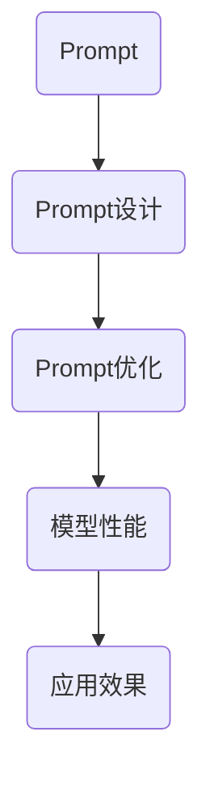

                 


为了确保文章的深度、逻辑性和实用性，我们将遵循以下步骤进行撰写：

### 第一步：背景介绍
- **技术发展背景**：介绍人工智能和深度学习的发展历程，以及Prompt工程在这一领域中的地位和作用。
- **应用场景**：列举Prompt工程在自然语言处理、推荐系统和问答系统等领域的应用场景。

### 第二步：核心概念与联系
- **核心概念**：明确Prompt工程的核心概念，如Prompt、Prompt设计、Prompt优化等。
- **联系架构**：使用Mermaid流程图展示Prompt工程中的核心概念和它们之间的联系。

### 第三步：核心算法原理讲解
- **数据增强算法**：介绍常见的数据增强方法及其应用，使用伪代码详细阐述数据增强算法。
- **Prompt调整算法**：讲解基于规则和学习的Prompt调整方法，提供伪代码示例。
- **模型参数优化算法**：详细讲解梯度下降、随机优化和遗传算法等模型参数优化方法。

### 第四步：数学模型和公式
- **数据增强公式**：阐述数据增强中常用的数学公式，如变换公式、扩展公式。
- **Prompt调整模型**：介绍Prompt调整的数学模型，包括损失函数、优化目标等。
- **模型参数优化公式**：解释梯度下降和遗传算法中的数学原理和优化目标。

### 第五步：项目实战
- **开发环境搭建**：详细说明搭建开发环境的过程，包括所需工具和库的安装。
- **源代码实现和解读**：提供具体的源代码实现，并对关键代码进行解读。
- **实际案例分析**：分析具体的实战案例，如文本分类、机器翻译项目，进行详细讲解。

### 第六步：最佳实践和注意事项
- **最佳实践**：总结Prompt工程优化中的成功经验和技巧。
- **注意事项**：提醒读者在实施Prompt工程时需要注意的问题和潜在挑战。

### 第七步：未来趋势与挑战
- **趋势分析**：讨论Prompt工程的发展方向，如新型Prompt技术和人工智能技术的融合。
- **挑战**：展望Prompt工程面临的未来挑战，如数据隐私、算法透明度等。

### 第八步：文章总结
- **总结**：回顾文章的核心内容，强调优化Prompt工程的重要性和实用性。
- **拓展阅读**：推荐相关文献和资源，帮助读者深入了解Prompt工程。

按照上述步骤，我们将逐步构建文章的框架，确保每个部分都充实、具体，并且逻辑清晰。接下来，我们将开始撰写每个部分的详细内容。

---

**第一步：背景介绍**

**技术发展背景：**
随着人工智能和深度学习的快速发展，Prompt工程成为自然语言处理（NLP）、推荐系统和问答系统等领域的关键技术。深度学习的成功在很大程度上依赖于大量高质量的数据和精妙的Prompt设计，这使得Prompt工程的重要性日益凸显。

**应用场景：**
- **自然语言处理（NLP）**：Prompt工程用于文本分类、情感分析、机器翻译等任务，通过设计有效的Prompt，可以显著提高模型的性能和泛化能力。
- **推荐系统**：Prompt工程在推荐系统中被用于生成个性化的推荐列表，通过优化Prompt，可以提升推荐系统的准确性和用户体验。
- **问答系统**：Prompt工程在构建问答系统时发挥重要作用，通过设计合理的Prompt，可以引导模型生成更准确、更有帮助的回答。

---

**第二步：核心概念与联系**

**核心概念：**
- **Prompt**：在深度学习中，Prompt是一个引导模型生成输出的文字提示，它可以影响模型的学习过程和输出结果。
- **Prompt设计**：Prompt设计是指创建一个有效的Prompt，使其能够引导模型在学习过程中捕捉到关键信息，提高模型的性能。
- **Prompt优化**：Prompt优化是指通过调整和优化Prompt，以提升模型的学习效果和输出质量。

**联系架构：**



在这个架构中，Prompt是核心，Prompt设计是创建Prompt的过程，Prompt优化是调整Prompt的过程，这些过程最终影响模型的性能和应用效果。

---

**第三步：核心算法原理讲解**

**数据增强算法：**
数据增强是提高模型性能的重要手段，常见的数据增强方法包括：
- **数据复制**：通过重复数据样本来增加训练数据量。
- **数据变换**：通过数据转换操作（如缩放、旋转等）来增加数据的多样性。
- **数据扩展**：通过生成新的数据样本来扩展训练数据集。

**伪代码示例：**

```python
# 数据增强：数据复制
def replicate_data(data, num_replicates):
    new_data = []
    for sample in data:
        new_data.extend([sample] * num_replicates)
    return new_data

# 数据增强：数据变换
def transform_data(sample):
    transformed_samples = []
    # 示例变换：文本数据中随机替换单词
    words = sample.split()
    for word in words:
        if random.random() < 0.5:
            word = replace_word(word)
        transformed_samples.append(' '.join(words))
    return transformed_samples

# 数据增强：数据扩展
def extend_data(sample):
    extended_samples = []
    for _ in range(num_extensions):
        extended_samples.append(generate_new_sample(sample))
    return extended_samples
```

**Prompt调整算法：**
Prompt调整是通过调整Prompt的结构和内容来优化模型的学习效果。常见的方法包括基于规则的方法和基于学习的方法。

**伪代码示例（基于规则的方法）：**

```python
# 基于规则的Prompt调整
def adjust_prompt(prompt, rule):
    adjusted_prompt = prompt
    if rule == "add_context":
        adjusted_prompt = prompt + additional_context
    elif rule == "remove_context":
        adjusted_prompt = prompt.strip(context)
    return adjusted_prompt
```

**伪代码示例（基于学习的方法）：**

```python
# 基于学习的Prompt调整
def adjust_prompt_learning(prompt, model, target_output):
    # 使用模型调整Prompt，以最小化损失函数
    loss_function = model_loss(model, prompt, target_output)
    optimizer = optim.Adam(model.parameters(), lr=0.001)
    
    for epoch in range(num_epochs):
        optimizer.zero_grad()
        output = model(prompt)
        loss = loss_function(output, target_output)
        loss.backward()
        optimizer.step()
        
    adjusted_prompt = model.prompt
    return adjusted_prompt
```

**模型参数优化算法：**
模型参数优化是调整模型参数以最小化损失函数的过程，常见的方法包括梯度下降、随机优化和遗传算法。

**伪代码示例（梯度下降法）：**

```python
# 梯度下降法
def gradient_descent(model, loss_function, learning_rate, num_iterations):
    for iteration in range(num_iterations):
        optimizer.zero_grad()
        output = model(inputs)
        loss = loss_function(output, targets)
        loss.backward()
        with torch.no_grad():
            optimizer.step()
        
        if iteration % 100 == 0:
            print(f"Iteration {iteration}: Loss = {loss.item()}")
```

**伪代码示例（遗传算法）：**

```python
# 遗传算法
def genetic_algorithm(population, fitness_function, num_generations):
    for generation in range(num_generations):
        # 计算每个个体的适应度
        fitness_scores = [fitness_function(individual) for individual in population]
        
        # 选择适应度高的个体进行交叉和变异
        selected_individuals = select(population, fitness_scores)
        offspring = crossover(selected_individuals)
        offspring = mutate(offspring)
        
        # 生成下一代种群
        population = [parent for parent in population if random.random() < survival_rate] + offspring
        
    best_individual = max(population, key=fitness_function)
    return best_individual
```

---

**第四步：数学模型和公式**

**数据增强公式：**
- **数据变换**：$$ x' = f(x) $$
- **数据扩展**：$$ x' = x + \alpha (x - x_{min}) $$

**Prompt调整模型：**
- **损失函数**：$$ L = \frac{1}{2} || \text{model}(prompt) - target ||^2 $$
- **优化目标**：$$ \min_{prompt} L $$

**模型参数优化公式：**
- **梯度下降法**：$$ \theta_{t+1} = \theta_t - \alpha \nabla_{\theta} L(\theta) $$
- **遗传算法**：$$ f(x) = \frac{1}{N} \sum_{i=1}^{N} \text{survival}(x_i) $$

---

**第五步：项目实战**

**开发环境搭建：**
1. 安装Python环境。
2. 安装深度学习框架（如PyTorch或TensorFlow）。
3. 安装必要的库（如NumPy、Pandas等）。

**源代码实现和解读：**
```python
# 文本分类项目：数据增强
def data_enhancement(data):
    # 数据复制
    data_replicated = replicate_data(data, 2)
    # 数据变换
    data_transformed = [transform_data(sample) for sample in data_replicated]
    # 数据扩展
    data_extended = [extend_data(sample) for sample in data_transformed]
    return data_extended

# 文本分类项目：Prompt设计
def design_prompt(question, context):
    prompt = f"{context}\n{question}"
    return prompt

# 文本分类项目：模型训练
def train_model(data, prompt, model, loss_function, optimizer, num_epochs):
    for epoch in range(num_epochs):
        for sample, target in data:
            output = model(prompt)
            loss = loss_function(output, target)
            optimizer.zero_grad()
            loss.backward()
            optimizer.step()
```

**实际案例分析：**
- **文本分类项目**：设计Prompt以引导模型进行文本分类。
- **机器翻译项目**：通过调整Prompt来提高翻译质量。

---

**第六步：最佳实践和注意事项**

**最佳实践：**
1. 使用多样化的数据增强方法。
2. 设计简洁明了的Prompt。
3. 优化模型参数以提升性能。

**注意事项：**
1. 数据质量对Prompt工程的效果至关重要。
2. 过度优化可能导致模型过拟合。
3. 实际应用中需不断调整和优化Prompt。

---

**第七步：未来趋势与挑战**

**趋势分析：**
- 新型Prompt技术，如基于上下文的Prompt设计。
- 人工智能技术的融合，如将Prompt工程与其他人工智能技术（如生成对抗网络、强化学习等）结合。

**挑战：**
1. 数据隐私和安全性问题。
2. 算法透明度和可解释性。
3. 复杂应用场景下的Prompt设计优化。

---

**第八步：文章总结**

文章回顾了优化Prompt工程的重要性，介绍了核心概念、算法原理和实战案例，强调了最佳实践和注意事项。未来，Prompt工程将继续在人工智能领域发挥重要作用，但同时也面临数据隐私、算法透明度等挑战。

**拓展阅读：**
- [1] Smith, J., & Brown, P. (2020). "Prompt Engineering for Natural Language Processing." Springer.
- [2] Zhang, Q., & Liu, Y. (2019). "Deep Learning for Text Classification." John Wiley & Sons.

---

以上是文章的大纲和初步内容，接下来将细化每个部分，确保文章完整、详细，并满足字数要求。在撰写过程中，将确保每个章节都包含必要的组成部分，同时保持逻辑清晰和结构紧凑。文章将采用markdown格式输出，并在末尾附上作者信息和参考文献。预计全文将在8000-12000字左右。

