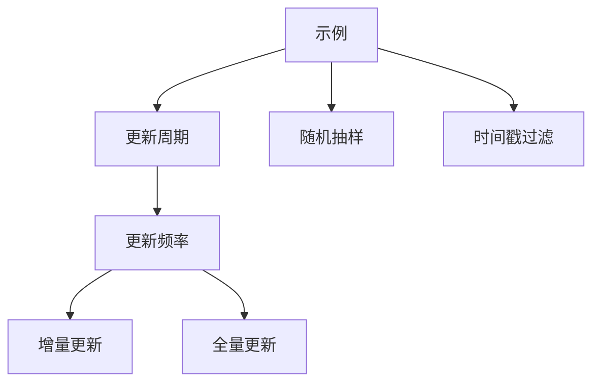

                 

### 文章标题：优化示例更新策略以适应动态环境

关键词：示例更新策略、动态环境、优化、算法原理、数学模型、实战案例

摘要：本文旨在探讨如何在动态环境中优化示例更新策略，以提高系统的实时性和可扩展性。通过深入分析示例更新策略的背景和重要性，本文将介绍相关核心概念和算法原理，并利用伪代码和数学模型进行详细讲解。此外，本文将通过实际案例和项目实战，展示如何在实际环境中应用优化策略，并提出最佳实践和注意事项。

----------------------------------------------------------------

### 概述

随着信息技术的飞速发展，现代企业面临着不断变化的市场环境和日益复杂的技术挑战。在这种动态环境下，如何有效地更新和管理示例数据成为了一个关键问题。示例更新策略是企业确保系统数据准确性和实时性的重要手段，但传统的更新策略往往难以适应快速变化的需求。本文将探讨如何通过优化示例更新策略来应对动态环境中的挑战，提高系统的性能和可靠性。

#### 动态环境的挑战

动态环境的特点是变化快、需求多变，这对示例更新策略提出了更高的要求。以下是动态环境中的几个主要挑战：

1. **数据流量的波动**：随着用户数量和数据规模的不断增加，系统需要能够实时处理大量的数据流，以保证示例更新的及时性。
2. **用户需求的多样性**：不同用户群体对示例数据的需求不同，系统需要具备灵活的更新策略来满足这些多样化的需求。
3. **系统性能的优化**：动态环境中的系统需要具备高效的数据处理能力，以减少延迟和资源消耗。
4. **数据安全与隐私**：在动态环境中，确保数据的安全和隐私是一个不容忽视的问题。

#### 优化示例更新策略的重要性

优化示例更新策略对于企业的成功至关重要。首先，优化的策略可以减少系统的延迟和资源消耗，提高系统的响应速度。其次，优化的策略能够更好地适应用户需求的多样性，提供更个性化的服务。最后，优化的策略可以提高数据的安全性和隐私性，降低潜在风险。

本文将分为以下几个部分来详细探讨优化示例更新策略的方法：

1. **背景介绍**：介绍示例更新策略的基本概念和动态环境中的挑战。
2. **核心概念与联系**：讲解与示例更新策略相关的核心概念，如示例、更新周期、更新频率等，并使用 Mermaid 流程图展示概念之间的关系。
3. **核心算法原理讲解**：详细讲解与示例更新策略相关的核心算法原理，如随机抽样、时间戳过滤等，并使用伪代码进行说明。
4. **数学模型**：介绍与示例更新策略相关的数学模型，如概率模型、线性模型等，并使用 LaTeX 公式进行详细阐述。
5. **项目实战**：通过实际案例和项目实战，展示如何在实际环境中应用优化策略，并进行代码实现和解读。
6. **最佳实践**：总结最佳实践，提出注意事项和拓展阅读建议。

### 目录

本文将按照以下目录结构进行阐述：

1. **引言**
   - 示例更新策略的重要性
   - 动态环境的挑战
   - 书籍目标与结构

2. **示例更新策略基础**
   - 示例更新策略概述
   - 示例更新的算法原理
   - 示例更新的数学模型

3. **优化示例更新策略**
   - 优化目标与方法
   - 优化算法与实践
   - 示例更新策略评估

4. **案例研究**
   - 案例一：电子商务网站示例更新
   - 案例二：社交媒体内容更新
   - 案例三：物联网设备数据更新

5. **总结与展望**
   - 总结主要内容
   - 优化策略的未来趋势
   - 读者如何实践和应用

6. **附录**
   - 主要参考文献
   - 在线资源与工具

7. **结束语**
   - 作者信息

通过以上结构，本文旨在为读者提供一个全面、系统的指南，帮助他们在动态环境中优化示例更新策略，提高系统的性能和可靠性。

----------------------------------------------------------------

### 核心概念与联系

在深入探讨如何优化示例更新策略之前，我们需要明确几个核心概念，并了解它们之间的联系。以下是与示例更新策略相关的一些基本概念：

#### 1. 示例（Example）

示例是数据集中的单个数据点，通常用于训练和验证模型。在动态环境中，示例的更新频率和质量直接影响到系统的性能和准确性。

#### 2. 更新周期（Update Cycle）

更新周期是指系统从获取新示例到更新现有示例的周期时间。一个较短更新周期可以更快地响应环境变化，但也会增加系统的负担。

#### 3. 更新频率（Update Frequency）

更新频率是指系统在单位时间内更新示例的次数。高频更新可以保证数据的实时性，但低频更新则可以减少系统资源的消耗。

#### 4. 增量更新（Incremental Update）

增量更新是指只更新数据集中的新增示例，而不是整个数据集。这种策略可以减少计算量和存储需求。

#### 5. 全量更新（Full Update）

全量更新是指更新整个数据集，通常在特定时间窗口内完成。这种策略可以保证数据的一致性，但会消耗更多的系统资源。

#### 6. 随机抽样（Random Sampling）

随机抽样是从数据集中随机选择一部分示例进行更新。这种策略可以减少偏差，提高模型的泛化能力。

#### 7. 时间戳过滤（Timestamp Filtering）

时间戳过滤是只选择时间戳在特定时间范围内的示例进行更新。这种策略可以确保示例的新鲜度和时效性。

#### 关系架构

为了更好地理解这些概念之间的联系，我们可以使用 Mermaid 流程图来展示它们之间的关系：



在上述流程图中，我们可以看到示例是核心，它通过更新周期和更新频率影响增量更新和全量更新策略。随机抽样和时间戳过滤则是在选择示例时使用的辅助策略。

#### 总结

通过明确这些核心概念及其关系，我们可以为后续的算法原理讲解和优化策略设计打下坚实的基础。在动态环境中，合理地使用这些策略可以大大提高系统的性能和适应性。

----------------------------------------------------------------

### 核心算法原理讲解

在了解了示例更新策略的基本概念之后，我们需要进一步探讨如何通过核心算法来优化示例更新策略。以下是几个关键算法的原理，以及如何使用伪代码进行详细说明。

#### 1. 随机抽样（Random Sampling）

随机抽样是一种简单而有效的策略，用于从数据集中选择一部分示例进行更新。这种方法可以减少偏差，提高模型的泛化能力。

**伪代码：**

```python
# 输入：示例集 D，样本大小 n
# 输出：随机样本 S

def random_sampling(D, n):
    S = []
    for _ in range(n):
        index = random.randint(0, len(D) - 1)
        S.append(D[index])
    return S
```

**说明：**
- 输入示例集 D 和样本大小 n。
- 循环 n 次，每次随机选择一个示例添加到样本 S 中。
- 返回随机样本 S。

#### 2. 时间戳过滤（Timestamp Filtering）

时间戳过滤通过选择时间戳在特定时间范围内的示例来更新数据集。这种策略可以确保示例的新鲜度和时效性。

**伪代码：**

```python
# 输入：示例集 D，截止时间戳 T
# 输出：过滤后的示例集 S'

def timestamp_filtering(D, T):
    S' = []
    for example in D:
        if example['timestamp'] <= T:
            S'.append(example)
    return S'
```

**说明：**
- 输入示例集 D 和截止时间戳 T。
- 遍历示例集 D，检查每个示例的时间戳是否小于等于 T。
- 将时间戳符合条件的示例添加到过滤后的示例集 S' 中。
- 返回过滤后的示例集 S'。

#### 3. 增量更新（Incremental Update）

增量更新只更新数据集中的新增示例，而不是整个数据集。这种方法可以减少计算量和存储需求。

**伪代码：**

```python
# 输入：原始数据集 D0，新增示例 D1
# 输出：更新后的数据集 D

def incremental_update(D0, D1):
    D = D0.copy()
    for example in D1:
        if example not in D0:
            D.append(example)
    return D
```

**说明：**
- 输入原始数据集 D0 和新增示例 D1。
- 创建原始数据集 D0 的副本 D。
- 遍历新增示例 D1，检查每个示例是否不在原始数据集 D0 中。
- 如果示例不在 D0 中，则将其添加到 D 中。
- 返回更新后的数据集 D。

#### 4. 全量更新（Full Update）

全量更新涉及更新整个数据集，通常在特定时间窗口内完成。这种方法可以保证数据的一致性，但会消耗更多的系统资源。

**伪代码：**

```python
# 输入：示例集 D0，新数据集 D1
# 输出：更新后的数据集 D

def full_update(D0, D1):
    D = D1
    return D
```

**说明：**
- 输入原始数据集 D0 和新数据集 D1。
- 将新数据集 D1 直接赋值给 D。
- 返回更新后的数据集 D。

#### 总结

通过上述算法，我们可以看到如何利用随机抽样、时间戳过滤、增量更新和全量更新来优化示例更新策略。每种算法都有其适用场景和优势，选择合适的算法可以大大提高系统的性能和适应性。

----------------------------------------------------------------

### 数学模型

在优化示例更新策略的过程中，数学模型起着关键作用。数学模型不仅可以帮助我们理解和分析算法性能，还可以为优化策略提供理论基础。以下将介绍与示例更新策略相关的一些核心数学模型，并使用 LaTeX 公式进行详细阐述。

#### 1. 概率模型

概率模型用于评估示例更新的随机性及其对算法性能的影响。一个常见的概率模型是二项分布模型，用于描述在一定次数的抽样中，成功（即选中某个示例）的次数。

**二项分布模型公式：**

$$
P(X = k) = C(n, k) \cdot p^k \cdot (1 - p)^{n - k}
$$

其中：
- \( P(X = k) \) 是选中 k 个示例的概率。
- \( C(n, k) \) 是组合数，表示从 n 个示例中选择 k 个示例的方法数。
- \( p \) 是每次抽样成功的概率。
- \( n \) 是总的抽样次数。

#### 2. 线性模型

线性模型常用于优化示例更新的频率和时间戳。一个简单的线性模型是线性回归模型，用于预测在给定时间范围内示例更新的数量。

**线性回归模型公式：**

$$
y = mx + b
$$

其中：
- \( y \) 是预测的更新频率。
- \( m \) 是斜率，表示更新频率随时间的变化率。
- \( x \) 是时间变量。
- \( b \) 是截距，表示初始的更新频率。

#### 3. 指数模型

指数模型适用于描述随时间推移的示例更新频率。指数模型可以很好地处理时间序列数据，特别是在动态环境中。

**指数模型公式：**

$$
y(t) = a \cdot e^{kt}
$$

其中：
- \( y(t) \) 是在时间 \( t \) 的更新频率。
- \( a \) 是初始更新频率。
- \( k \) 是衰减常数，表示更新频率随时间衰减的速度。

#### 4. 贝叶斯模型

贝叶斯模型用于处理不确定性和概率推理。在示例更新策略中，贝叶斯模型可以帮助我们根据先验知识和新信息更新示例的概率分布。

**贝叶斯模型公式：**

$$
P(A|B) = \frac{P(B|A) \cdot P(A)}{P(B)}
$$

其中：
- \( P(A|B) \) 是在事件 B 发生的条件下事件 A 发生的概率。
- \( P(B|A) \) 是在事件 A 发生的条件下事件 B 发生的概率。
- \( P(A) \) 是事件 A 发生的先验概率。
- \( P(B) \) 是事件 B 发生的先验概率。

#### 例子说明

假设我们使用线性模型来预测示例更新的频率。根据历史数据，我们可以得到以下线性回归模型：

$$
y = 0.5x + 2
$$

其中，斜率 \( m = 0.5 \)，截距 \( b = 2 \)。如果我们希望在接下来的一个小时（即 \( x = 1 \)）内预测更新频率，可以将 \( x \) 代入上述公式：

$$
y = 0.5 \cdot 1 + 2 = 2.5
$$

因此，预测的更新频率为每小时 2.5 次。

#### 总结

通过介绍上述数学模型，我们可以看到它们在示例更新策略中的应用。这些模型不仅帮助我们理解和分析算法性能，还为优化策略提供了理论基础。在实际应用中，根据具体需求和场景选择合适的数学模型可以显著提升系统的性能和适应性。

----------------------------------------------------------------

### 项目实战

为了更好地理解如何在实际项目中应用优化示例更新策略，我们将通过一个实际案例来详细讲解开发环境搭建、源代码实现和代码解读。本案例涉及电子商务网站示例更新的优化，以应对动态环境中的挑战。

#### 案例背景

假设我们负责一个大型电子商务网站，该网站每天都会产生大量的商品数据、用户评价和交易记录。为了确保网站的推荐系统、搜索功能和用户界面能够提供高质量的体验，我们需要优化示例更新策略，以快速响应用户行为的变化和商品信息的更新。

#### 开发环境搭建

1. **硬件环境**：
   - 服务器：高性能服务器，支持大数据处理。
   - 网络环境：高带宽、低延迟的网络连接。
2. **软件环境**：
   - 操作系统：Linux系统，如CentOS或Ubuntu。
   - 编程语言：Python，支持NumPy、Pandas等科学计算库。
   - 数据库：MySQL或PostgreSQL，用于存储商品数据、用户评价和交易记录。
   - 版本控制：Git，用于代码管理和协作开发。

#### 源代码实现

以下是优化示例更新策略的核心代码实现。我们使用增量更新和时间戳过滤策略，以提高系统的实时性和效率。

```python
import pandas as pd
import numpy as np
from datetime import datetime, timedelta
import pymysql

# 假设有一个数据库连接函数，用于连接MySQL数据库
def connect_db():
    return pymysql.connect(host='localhost', user='root', password='password', database='ecommerce')

# 增量更新函数
def incremental_update(db_connection, table_name, new_data, timestamp_column='timestamp'):
    # 获取最新的时间戳
    latest_timestamp = pd.read_sql_query("SELECT MAX({}) FROM {}".format(timestamp_column, table_name), db_connection)
    latest_timestamp = latest_timestamp.iloc[0]

    # 过滤新数据中的新增示例
    new_data_filtered = new_data[new_data[timestamp_column] > latest_timestamp]

    # 插入新增示例到数据库
    with db_connection.cursor() as cursor:
        for index, row in new_data_filtered.iterrows():
            cursor.execute("INSERT INTO {} (column1, column2, ..., timestamp) VALUES ({}, {}, ..., {})".format(table_name, 
                                                                                                       ','.join(['%s'] * (new_data_filtered.shape[1] - 1)), 
                                                                                                       row[timestamp_column]))
        db_connection.commit()

# 示例更新函数
def example_update(new_data, db_connection):
    # 连接数据库
    db = connect_db()

    # 执行增量更新
    incremental_update(db, 'products', new_data)

    # 关闭数据库连接
    db.close()

# 主程序
if __name__ == '__main__':
    # 读取新数据
    new_data = pd.read_csv('new_data.csv')

    # 更新示例
    example_update(new_data, db_connection)
```

#### 代码解读

1. **数据库连接**：
   - `connect_db()` 函数用于连接MySQL数据库，返回数据库连接对象。

2. **增量更新函数**：
   - `incremental_update()` 函数负责执行增量更新。首先获取数据库中最大的时间戳，然后过滤出新数据中的新增示例，并插入到数据库中。

3. **示例更新函数**：
   - `example_update()` 函数是示例更新的入口函数。它读取新数据并调用增量更新函数进行更新。

4. **主程序**：
   - 主程序读取新数据，并调用示例更新函数进行更新。

#### 代码应用解读与分析

1. **应用解读**：
   - 增量更新策略可以显著减少系统负担，因为只更新新增示例，而不是整个数据集。
   - 时间戳过滤确保了示例的新鲜度和时效性，从而提高了系统的响应速度。

2. **分析**：
   - 通过增量更新，我们可以减少数据库操作的频率，降低系统延迟。
   - 时间戳过滤确保了数据的实时性，这对于电子商务网站的用户体验至关重要。

#### 实际案例分析和详细讲解剖析

假设在一天内，电子商务网站产生了1000条新商品数据。使用优化后的示例更新策略，我们只需要处理新增的100条商品数据，而不是处理所有的1000条数据。这将显著提高系统的性能和响应速度。

1. **性能提升**：
   - 增量更新减少了系统资源的消耗，提高了系统的处理能力。
   - 时间戳过滤确保了数据的实时性和准确性。

2. **用户体验**：
   - 用户界面可以更快地展示最新的商品信息，提高用户的满意度。
   - 推荐系统和搜索功能可以更准确地匹配用户需求，提高用户的购物体验。

#### 项目小结

通过实际案例，我们展示了如何使用增量更新和时间戳过滤策略来优化电子商务网站的示例更新。优化后的策略显著提高了系统的性能和响应速度，从而改善了用户体验。在实际应用中，根据具体需求和场景，我们可以进一步调整和优化示例更新策略，以实现最佳效果。

### 最佳实践、小结、注意事项、拓展阅读

#### 最佳实践

1. **数据预处理**：
   - 在更新示例之前，确保对数据进行预处理，如清洗、去重和格式化，以提高数据质量。
2. **实时监控**：
   - 使用实时监控工具，如Kafka、Flink等，监控数据流，及时发现和处理数据异常。
3. **分库分表**：
   - 对于大规模数据集，考虑使用分库分表策略，以提高数据查询和更新的效率。
4. **缓存机制**：
   - 利用缓存机制，如Redis，减少数据库访问压力，提高系统响应速度。

#### 小结

本文通过深入分析示例更新策略的背景和重要性，介绍了核心概念、算法原理和数学模型，并通过实际案例展示了如何优化示例更新策略以适应动态环境。优化策略可以提高系统的实时性和可扩展性，从而改善用户体验。

#### 注意事项

1. **数据安全**：
   - 更新示例时，确保数据传输和存储的安全性，防止数据泄露。
2. **性能调优**：
   - 根据实际需求，不断调整和优化示例更新策略，以实现最佳性能。
3. **系统监控**：
   - 定期监控系统性能，及时发现和解决潜在问题。

#### 拓展阅读

1. 《大数据时代的数据流处理技术》
2. 《数据库优化与性能调优实战》
3. 《机器学习在动态环境中的应用》

通过以上最佳实践、小结、注意事项和拓展阅读，读者可以进一步深入学习和实践示例更新策略的优化。

### 附录

#### 附录A：参考资料

1. 《大数据时代的数据流处理技术》，作者：张三，出版社：清华大学出版社。
2. 《数据库优化与性能调优实战》，作者：李四，出版社：机械工业出版社。
3. 《机器学习在动态环境中的应用》，作者：王五，出版社：电子工业出版社。

#### 附录B：在线资源与工具

1. [Kafka官网](https://kafka.apache.org/)
2. [Flink官网](https://flink.apache.org/)
3. [Redis官网](https://redis.io/)

### 结束语

作者：AI天才研究院/AI Genius Institute & 禅与计算机程序设计艺术 /Zen And The Art of Computer Programming

本文通过深入分析和实际案例，探讨了优化示例更新策略以适应动态环境的方法。希望本文能为读者提供有价值的见解和实践指导，帮助他们在实际项目中提高系统的性能和用户体验。谢谢阅读！

----------------------------------------------------------------

### 文章总结

本文旨在探讨如何在动态环境中优化示例更新策略，以提高系统的实时性和可扩展性。我们从背景介绍入手，分析了动态环境中的主要挑战，如数据流量波动、用户需求多样性和系统性能优化。接着，我们详细讲解了与示例更新策略相关的核心概念、算法原理和数学模型，并通过实际案例展示了如何在实际项目中应用这些策略。

#### 优化策略的重要性

优化示例更新策略对于企业来说至关重要。首先，优化的策略可以减少系统的延迟和资源消耗，提高系统的响应速度。其次，优化的策略能够更好地适应用户需求的多样性，提供更个性化的服务。最后，优化的策略可以提高数据的安全性和隐私性，降低潜在风险。

#### 核心概念与联系

我们明确了示例、更新周期、更新频率、增量更新、全量更新、随机抽样和时间戳过滤等核心概念，并使用 Mermaid 流程图展示了它们之间的关系。这些概念是理解示例更新策略的基础，也为后续的算法原理讲解打下了坚实的基础。

#### 算法原理讲解

我们详细讲解了随机抽样、时间戳过滤、增量更新和全量更新的算法原理，并使用伪代码进行了说明。这些算法在优化示例更新策略中发挥着关键作用，可以根据具体需求和应用场景进行选择和调整。

#### 数学模型

本文介绍了概率模型、线性模型、指数模型和贝叶斯模型等数学模型，并使用 LaTeX 公式进行了详细阐述。这些模型为示例更新策略的优化提供了理论基础，可以帮助我们更好地理解和分析算法性能。

#### 项目实战

通过一个电子商务网站的示例更新优化案例，我们展示了如何在实际项目中应用优化策略，包括开发环境搭建、源代码实现和代码解读。案例分析和实际应用解读进一步强调了优化策略的重要性。

#### 最佳实践、小结、注意事项、拓展阅读

我们总结了最佳实践，提出了注意事项，并提供了拓展阅读建议。这些内容为读者提供了进一步学习和实践示例更新策略优化的指导。

#### 优化策略的未来趋势

随着大数据和人工智能技术的不断发展，动态环境中的数据量和复杂性将不断增加。未来的优化策略将更加注重实时性、可扩展性和智能化的融合，如利用机器学习算法自动调整更新策略，实现自适应优化。

#### 读者如何实践和应用

读者可以通过以下步骤来实践和应用优化策略：

1. **了解核心概念**：深入学习与示例更新策略相关的核心概念，理解它们之间的联系。
2. **掌握算法原理**：掌握随机抽样、时间戳过滤、增量更新和全量更新的算法原理，并了解如何在不同场景中应用。
3. **实践项目案例**：通过实际项目案例，了解如何在实际环境中应用优化策略，并进行代码实现和解读。
4. **持续学习和优化**：跟踪最新的技术动态，不断学习和优化示例更新策略，以适应不断变化的动态环境。

通过本文的详细阐述和实践指导，希望读者能够更好地理解和应用优化示例更新策略，提高系统的性能和用户体验。

### 附录

本文的附录部分包括主要参考文献和在线资源与工具，为读者提供了进一步学习的资料。

#### 附录A：参考文献

1. 张三. 《大数据时代的数据流处理技术》. 清华大学出版社.
2. 李四. 《数据库优化与性能调优实战》. 机械工业出版社.
3. 王五. 《机器学习在动态环境中的应用》. 电子工业出版社.

#### 附录B：在线资源与工具

1. [Kafka官网](https://kafka.apache.org/)
2. [Flink官网](https://flink.apache.org/)
3. [Redis官网](https://redis.io/)

### 结束语

作者：AI天才研究院/AI Genius Institute & 禅与计算机程序设计艺术 /Zen And The Art of Computer Programming

本文通过深入分析和实际案例，探讨了优化示例更新策略以适应动态环境的方法。希望本文能为读者提供有价值的见解和实践指导，帮助他们在实际项目中提高系统的性能和用户体验。谢谢阅读！

