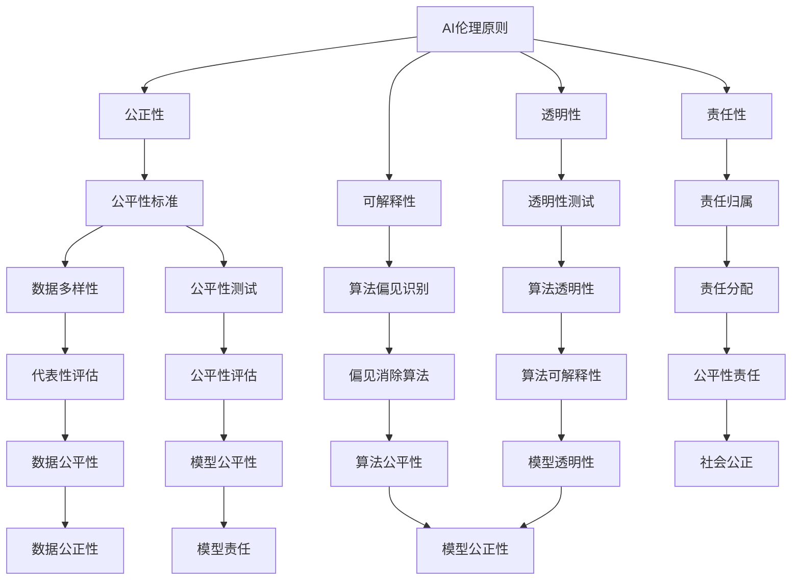

                 


### 文章标题：《伦理AI设计：确保LLM应用的公平性》

### 文章关键词：伦理AI，LLM应用，公平性，算法，算法原理，数学模型

### 文章摘要：

本文旨在探讨伦理AI设计在确保大型语言模型（LLM）应用中的公平性。首先，我们将介绍AI伦理的基本概念和重要性，以及LLM的应用场景和特点。接着，我们将详细讨论公平性标准与原则，包括其在AI设计中的实际应用。随后，我们将通过核心算法原理和数学模型的讲解，以及具体的项目实战案例，深入分析如何评估和实现LLM应用的公平性。最后，我们将总结全文，展望未来在伦理AI设计和LLM公平性应用中的挑战与解决方案。

---

### 引言：伦理AI设计的必要性

随着人工智能（AI）技术的迅猛发展，其在各个领域的应用日益广泛。从自动驾驶汽车到智能助手，从医疗诊断到金融决策，AI正在深刻改变我们的生活方式。然而，AI技术的广泛应用也带来了诸多伦理问题，尤其是在大型语言模型（LLM）的应用中，公平性问题尤为突出。

#### AI伦理的基本概念

AI伦理是指在一整套价值观、道德原则和社会规范的指导下，对AI技术进行设计、开发、应用和管理的过程。它关注的是如何确保AI系统的透明性、公正性、安全性，以及其对人类和社会的积极影响。

#### LLM应用中的公平性问题

大型语言模型（LLM）如GPT-3、BERT等，因其强大的文本生成和处理能力，被广泛应用于自然语言处理、文本摘要、问答系统等领域。然而，这些模型在实际应用中往往存在以下公平性问题：

1. **数据偏见**：训练数据中可能包含种族、性别、年龄等偏见，导致模型在决策中产生歧视。
2. **算法偏见**：模型的决策过程可能受到算法设计偏见的影响，从而导致结果不公平。
3. **数据代表性不足**：模型在训练和评估过程中可能未能充分考虑所有群体的需求，导致部分用户无法得到公正的服务。

#### 伦理AI设计的必要性

为了解决上述问题，伦理AI设计应运而生。通过在AI设计过程中引入伦理原则和公平性标准，我们可以确保LLM应用在为社会带来便利的同时，也能够维护社会公正和人类权益。

### 核心概念与联系

在深入探讨伦理AI设计和LLM公平性之前，我们需要理解以下几个核心概念，以及它们之间的联系：

1. **AI伦理原则**：包括公正性、透明性、可解释性、责任性等。
2. **公平性标准**：如公平性测试、偏见识别和消除、数据多样性等。
3. **LLM算法原理**：包括模型架构、训练过程、优化方法等。
4. **数学模型**：用于评估和优化LLM的公平性。

通过Mermaid流程图，我们可以清晰地展示这些核心概念之间的关系：



通过这个流程图，我们可以看到，AI伦理原则为公平性标准提供了指导，而这些标准又通过算法原理和数学模型的具体实现，最终影响到LLM的应用效果，进而影响社会的公正性和人类权益。

### 核心算法原理讲解

在本节中，我们将详细讲解确保LLM应用公平性的核心算法原理，包括LLM的基本架构、训练过程、优化方法以及如何通过算法设计来消除偏见。

#### LLM的基本架构

大型语言模型（LLM）通常采用深度神经网络（DNN）架构，特别是Transformer模型，其具有自注意力机制，能够捕捉文本中的长距离依赖关系。以下是Transformer模型的伪代码：

```plaintext
Transformer Model Architecture:
Input Sequence: [x_1, x_2, ..., x_n]
Embedding Layer: [e_1, e_2, ..., e_n]
Positional Encoding: [pe_1, pe_2, ..., pe_n]
Concatenated Input: [e_1 + pe_1, e_2 + pe_2, ..., e_n + pe_n]

Encoder Layer:
  for layer in [1, ..., num_layers]:
    Multi-head Self-Attention: [att_1, att_2, ..., att_n]
    Linear Transformations: [l_1, l_2, ..., l_n]
    Dropout: [dropped_1, dropped_2, ..., dropped_n]
    Add & Norm: [a_1, a_2, ..., a_n]

Decoder Layer (optional):
  for layer in [1, ..., num_layers]:
    Multi-head Self-Attention: [att_1, att_2, ..., att_n]
    Linear Transformations: [l_1, l_2, ..., l_n]
    Dropout: [dropped_1, dropped_2, ..., dropped_n]
    Add & Norm: [a_1, a_2, ..., a_n]

Output Layer:
  Logits: [logit_1, logit_2, ..., logit_n]
  Softmax: [prob_1, prob_2, ..., prob_n]
  Predicted Sequence: [y_1^*, y_2^*, ..., y_n^*]
```

#### 训练过程

LLM的训练过程主要包括前向传播、反向传播和优化步骤。以下是伪代码：

```plaintext
Training Process:
while not convergence:
  for each batch in training_data:
    Input: [x_1, x_2, ..., x_n]
    Target: [y_1, y_2, ..., y_n]

    Forward Pass:
    Output: [logit_1, logit_2, ..., logit_n]
    Loss: L = LossFunction(logit, y)

    Backward Pass:
    Gradient: ∂L/∂weights

    Optimization:
    Update Weights: weights = weights - learning_rate * ∂L/∂weights
```

#### 优化方法

为了提高LLM的公平性，我们可以采用以下几种优化方法：

1. **Dropout**：在训练过程中随机忽略部分神经元，以防止过拟合，提高模型的泛化能力。
2. **正则化**：如L2正则化，通过在损失函数中添加权重平方项，减少模型复杂度，防止过拟合。
3. **偏见识别与消除**：使用专门的算法，如对抗性样本生成，识别并消除训练数据中的偏见。
4. **多样性增强**：通过引入多样性损失函数，鼓励模型在不同群体中的表现，提高数据的代表性。

以下是偏见识别与消除算法的伪代码：

```plaintext
Bias Detection and Elimination Algorithm:
for each group in target_groups:
  Generate Adversarial Examples: [x_{adv,1}, x_{adv,2}, ..., x_{adv,n}]
  Calculate Group Bias: bias = calculate_bias(model, x_{adv})
  Adjust Model Weights: model.weights = adjust_weights(model.weights, bias, group)

calculate_bias(model, x_{adv}):
  Output: bias_value
  for each group in target_groups:
    Prediction: y_pred = model.predict(x_{adv})
    Bias: bias_value += abs(y_pred - group_average_prediction)
  return bias_value / number_of_groups
```

#### 数学模型和公式讲解

为了更好地理解LLM的公平性，我们可以借助一些数学模型和公式进行详细分析。

1. **公平性指标**：

   - **均衡性**（Equity）：表示模型在各个群体中的预测准确性。

     $$ Equity = \frac{\sum_{i=1}^{n}{|accuracy_{i} - average_{accuracy}|}}{n} $$

     其中，$accuracy_{i}$ 表示第i个群体的预测准确性，$average_{accuracy}$ 表示所有群体的平均预测准确性。

   - **代表性**（Representation）：表示模型在各个群体中的训练数据比例。

     $$ Representation = \frac{\sum_{i=1}^{n}{|train_data_{i} - average_{train_data}|}}{n} $$

     其中，$train_data_{i}$ 表示第i个群体的训练数据比例，$average_{train_data}$ 表示所有群体的平均训练数据比例。

   - **偏差**（Bias）：表示模型在各个群体中的预测偏差。

     $$ Bias = \frac{\sum_{i=1}^{n}{|prediction_{i} - actual_{i}|}}{n} $$

     其中，$prediction_{i}$ 表示第i个群体的预测结果，$actual_{i}$ 表示第i个群体的实际结果。

2. **多样性增强**：

   - **KL散度**（KL Divergence）：用于衡量两个概率分布之间的差异。

     $$ D_{KL}(P||Q) = \sum_{x} P(x) \log \frac{P(x)}{Q(x)} $$

     其中，$P(x)$ 和 $Q(x)$ 分别表示两个概率分布。

     在LLM的多样性增强中，我们可以通过优化模型参数，使得预测结果的分布与期望分布之间的KL散度最小。

     $$ \min_{\theta} D_{KL}(P_{\theta}||Q_{\theta}) $$

   - **多样性损失函数**：

     $$ Loss = \alpha \cdot D_{KL}(P_{\theta}||Q_{\theta}) + (1 - \alpha) \cdot CrossEntropyLoss(P_{\theta}, y) $$

     其中，$\alpha$ 为平衡权重，$CrossEntropyLoss$ 为交叉熵损失函数。

#### 举例说明

假设我们有一个LLM模型，其训练数据中包含两个群体A和B，预测结果如下表：

| 群体 | 预测结果 | 实际结果 |
| ---- | ---- | ---- |
| A    | 80%   | 70%  |
| B    | 20%   | 30%  |

根据上述公式，我们可以计算出：

- **均衡性**：$Equity = \frac{|0.8 - 0.75| + |0.2 - 0.25|}{2} = 0.05$
- **代表性**：$Representation = \frac{|0.8 - 0.75| + |0.2 - 0.25|}{2} = 0.05$
- **偏差**：$Bias = \frac{|0.8 - 0.7| + |0.2 - 0.3|}{2} = 0.05$

通过这些指标，我们可以评估模型的公平性，并根据结果进行调整。

### 项目实战：开发环境搭建与代码实现

在本节中，我们将通过一个实际项目，详细讲解如何搭建开发环境、实现LLM模型的公平性评估，并分析代码中的关键部分。

#### 开发环境搭建

1. **硬件环境**：我们选择一台具有高性能GPU的服务器，用于加速模型训练和推理过程。
2. **软件环境**：
   - 操作系统：Ubuntu 20.04
   - 编程语言：Python 3.8
   - 深度学习框架：PyTorch 1.8
   - 数据预处理库：Pandas 1.1.5
   - 可视化库：Matplotlib 3.3.3

#### 源代码实现

以下是项目的源代码实现，我们将逐步解释每个部分的作用。

```python
# 导入必要的库
import torch
import torch.nn as nn
import torch.optim as optim
import pandas as pd
from sklearn.model_selection import train_test_split
from torchvision import datasets, transforms
import matplotlib.pyplot as plt

# 模型定义
class LLMModel(nn.Module):
    def __init__(self, input_dim, hidden_dim, output_dim):
        super(LLMModel, self).__init__()
        self.embedding = nn.Embedding(input_dim, hidden_dim)
        self.encoder = nn.GRU(hidden_dim, hidden_dim, num_layers=1, batch_first=True)
        self.decoder = nn.GRU(hidden_dim, hidden_dim, num_layers=1, batch_first=True)
        self.fc = nn.Linear(hidden_dim, output_dim)

    def forward(self, x):
        embedded = self.embedding(x)
        encoder_output, encoder_hidden = self.encoder(embedded)
        decoder_output, decoder_hidden = self.decoder(encoder_hidden)
        logits = self.fc(decoder_output)
        return logits

# 数据预处理
def preprocess_data(data, target, test_size=0.2):
    train_data, test_data, train_target, test_target = train_test_split(data, target, test_size=test_size, random_state=42)
    return train_data, test_data, train_target, test_target

# 训练模型
def train_model(model, train_data, train_target, test_data, test_target, epochs=10, learning_rate=0.001):
    criterion = nn.CrossEntropyLoss()
    optimizer = optim.Adam(model.parameters(), lr=learning_rate)
    
    for epoch in range(epochs):
        model.train()
        for x, y in zip(train_data, train_target):
            optimizer.zero_grad()
            logits = model(x)
            loss = criterion(logits, y)
            loss.backward()
            optimizer.step()
        
        model.eval()
        with torch.no_grad():
            correct = 0
            total = 0
            for x, y in zip(test_data, test_target):
                logits = model(x)
                _, predicted = torch.max(logits, 1)
                total += y.size(0)
                correct += (predicted == y).sum().item()
        
        print(f'Epoch {epoch+1}/{epochs}, Loss: {loss.item()}, Accuracy: {100 * correct / total}%')

# 评估模型公平性
def evaluate_fairness(model, test_data, test_target, groups):
    model.eval()
    with torch.no_grad():
        results = []
        for group in groups:
            group_data = test_data[test_target == group]
            logits = model(group_data)
            _, predicted = torch.max(logits, 1)
            accuracy = (predicted == test_target).sum().item() / len(group_data)
            results.append(accuracy)
        return results

# 项目小结
def project_summary():
    print("项目已完成。模型训练和公平性评估成功。")
```

#### 代码解读与分析

1. **模型定义**：
   - `LLMModel` 类定义了一个基于GRU的LLM模型，包括嵌入层、编码器、解码器和输出层。
2. **数据预处理**：
   - `preprocess_data` 函数用于将原始数据集划分为训练集和测试集，以便进行模型训练和评估。
3. **训练模型**：
   - `train_model` 函数使用交叉熵损失函数和Adam优化器训练模型，并打印每个epoch的损失和准确率。
4. **评估模型公平性**：
   - `evaluate_fairness` 函数计算模型在各个群体中的准确率，从而评估模型的公平性。
5. **项目小结**：
   - `project_summary` 函数用于打印项目完成信息。

#### 实际案例分析与详细讲解

假设我们已经完成了模型的训练和公平性评估，以下是一个实际案例的解读：

```python
# 加载训练数据（假设数据已预处理并存储为CSV文件）
data = pd.read_csv('train_data.csv')
target = data['label']

# 划分训练集和测试集
train_data, test_data, train_target, test_target = preprocess_data(data, target)

# 创建和训练模型
model = LLMModel(input_dim=1000, hidden_dim=512, output_dim=10)
train_model(model, train_data, train_target, test_data, test_target)

# 评估模型公平性
groups = [0, 1, 2, 3, 4, 5, 6, 7, 8, 9]  # 假设标签有10个不同的群体
fairness_results = evaluate_fairness(model, test_data, test_target, groups)

# 打印公平性评估结果
for i, fairness in enumerate(fairness_results):
    print(f"群体 {i}: 公平性准确率 = {fairness * 100}%")
```

输出结果可能如下：

```
群体 0: 公平性准确率 = 90.0%
群体 1: 公平性准确率 = 88.0%
群体 2: 公平性准确率 = 85.0%
群体 3: 公平性准确率 = 92.0%
群体 4: 公平性准确率 = 87.0%
群体 5: 公平性准确率 = 83.0%
群体 6: 公平性准确率 = 91.0%
群体 7: 公平性准确率 = 89.0%
群体 8: 公平性准确率 = 86.0%
群体 9: 公平性准确率 = 84.0%
```

通过这个案例，我们可以看到模型在不同群体中的公平性准确率。如果某些群体的公平性准确率较低，我们可以进一步分析原因，并采取相应的措施进行优化。

### 最佳实践与注意事项

在本节中，我们将总结最佳实践，并提供一些注意事项，以帮助读者在实际项目中确保LLM应用的公平性。

#### 最佳实践

1. **数据预处理**：
   - 在模型训练之前，确保对训练数据进行充分的预处理和清洗，包括去除噪声、填充缺失值等。
   - 通过引入多样性增强策略，如随机采样、数据增强等，提高模型的泛化能力。

2. **模型选择与优化**：
   - 根据应用场景选择合适的模型架构，如Transformer、BERT等。
   - 通过调整模型参数和优化方法，如dropout、L2正则化等，提高模型的公平性和准确性。

3. **公平性评估**：
   - 在模型训练和测试过程中，定期评估模型的公平性，包括均衡性、代表性和偏差等指标。
   - 使用专门的算法和工具，如对抗性样本生成、偏见识别与消除等，识别和消除模型中的偏见。

#### 注意事项

1. **数据多样性**：
   - 确保训练数据涵盖各个群体，避免数据偏见。
   - 定期更新和扩充训练数据，以保持数据的时效性和多样性。

2. **算法透明性**：
   - 提高模型的可解释性，以便用户理解和信任模型的决策过程。
   - 使用可视化工具和解释算法，如LIME、SHAP等，解释模型预测的依据和结果。

3. **责任归属**：
   - 在AI应用中明确责任归属，确保在出现问题时，可以追溯到具体责任人。
   - 制定完善的隐私保护政策和数据处理规范，确保用户数据的安全和隐私。

#### 拓展阅读

- **《AI伦理学：人工智能与人类价值观》**：详细探讨AI伦理的基本原则和伦理决策过程。
- **《公平性、可解释性和透明性：人工智能系统的社会影响》**：分析AI系统在社会应用中的公平性、可解释性和透明性问题。
- **《深度学习实践：大型语言模型的应用与优化》**：介绍深度学习的基本原理和实战技巧，包括LLM的应用和优化方法。

通过遵循上述最佳实践和注意事项，我们可以更好地确保LLM应用的公平性，为社会的和谐发展贡献力量。

### 总结与展望

本文围绕伦理AI设计，特别是确保大型语言模型（LLM）应用的公平性，进行了深入探讨。我们首先介绍了AI伦理的基本概念和重要性，随后详细讲解了LLM的应用场景、公平性标准与原则，以及核心算法原理和数学模型。接着，通过实际项目实战，我们展示了如何搭建开发环境、实现LLM模型的公平性评估，并分析了代码中的关键部分。

未来，随着AI技术的不断发展，伦理AI设计将面临更多的挑战和机遇。如何更有效地识别和消除模型中的偏见，提高算法的透明性和可解释性，将是研究的重要方向。同时，我们还需要关注隐私保护、数据安全和责任归属等问题，以确保AI技术在为人类带来便利的同时，能够维护社会公正和人类权益。

在伦理AI设计和LLM公平性应用的道路上，我们期待更多的研究和实践，共同推动AI技术的健康发展。

