```mermaid
graph TB
    A[伦理与偏见检测] --> B[数据预处理]
    A --> C[特征工程]
    A --> D[偏见检测算法]
    B --> E[数据清洗]
    B --> F[数据标准化]
    C --> G[特征提取]
    C --> H[特征选择]
    D --> I[基于统计学的偏见检测]
    D --> J[基于机器学习的偏见检测]
    E --> K[缺失值处理]
    E --> L[异常值处理]
    F --> M[归一化]
    F --> N[标准化]
    G --> O[主成分分析]
    G --> P[词袋模型]
    H --> Q[信息增益]
    H --> R[卡方检验]
    I --> S[偏度]
    I --> T[峰度]
    J --> U[支持向量机]
    J --> V[随机森林]
    K --> W[插值法]
    K --> X[平均值法]
    L --> Y[聚类分析]
    L --> Z[分类分析]
    M --> AA[最小-最大缩放]
    M --> BB[零均值-单位方差缩放]
    N --> CC[最小值归一化]
    N --> DD[最大值归一化]
    O --> EE[主成分分析代码]
    O --> FF[主成分分析结果]
    P --> GG[词袋模型代码]
    P --> HH[词袋模型结果]
    Q --> II[信息增益代码]
    Q --> JJ[信息增益结果]
    R --> KK[卡方检验代码]
    R --> LL[卡方检验结果]
    S --> MM[偏度代码]
    S --> NN[偏度结果]
    T --> OO[峰度代码]
    T --> PP[峰度结果]
    U --> QQ[支持向量机代码]
    U --> RR[支持向量机结果]
    V --> SS[随机森林代码]
    V --> TT[随机森林结果]
    W --> UU[插值法代码]
    W --> VV[插值法结果]
    X --> WW[平均值法代码]
    X --> XX[平均值法结果]
    Y --> YY[聚类分析代码]
    Y --> ZZ[聚类分析结果]
    Z --> AAA[分类分析代码]
    Z --> BBB[分类分析结果]
    AA --> CCC[最小-最大缩放代码]
    AA --> DDD[最小-最大缩放结果]
    BB --> EEE[零均值-单位方差缩放代码]
    BB --> FFF[零均值-单位方差缩放结果]
    CC --> GGG[最小值归一化代码]
    CC --> HHH[最小值归一化结果]
    DD --> III[最大值归一化代码]
    DD --> JJJ[最大值归一化结果]
    EE --> KKK[主成分分析代码]
    EE --> LLL[主成分分析结果]
    GG --> MMM[词袋模型代码]
    GG --> NNN[词袋模型结果]
    II --> OOO[信息增益代码]
    II --> PPP[信息增益结果]
    KK --> QQ[卡方检验代码]
    KK --> LL[卡方检验结果]
    MM --> NN[偏度代码]
    MM --> PP[偏度结果]
    OO --> PP[峰度代码]
    OO --> PP[峰度结果]
    QQ --> RR[支持向量机代码]
    QQ --> RR[支持向量机结果]
    SS --> TT[随机森林代码]
    SS --> TT[随机森林结果]
    UU --> VV[插值法代码]
    UU --> VV[插值法结果]
    WW --> XX[平均值法代码]
    WW --> XX[平均值法结果]
    YY --> ZZ[聚类分析代码]
    YY --> ZZ[聚类分析结果]
    AAA --> BBB[分类分析代码]
    AAA --> BBB[分类分析结果]
```
                 

### 文章标题

### 伦理与偏见检测：确保模型输出公平性

#### 关键词：伦理、偏见检测、模型公平性、人工智能、算法偏见、数据偏见

#### 摘要：

随着人工智能技术的迅速发展，其在各种领域中的应用越来越广泛，但随之而来的伦理问题和偏见现象也逐渐凸显。本文旨在探讨伦理与偏见检测的重要性，分析偏见检测的技术方法和评价指标，提出实现模型公平性的策略，并通过实际案例进行验证。文章分为引言、背景介绍、核心概念与联系、核心算法原理讲解、数学模型和公式、项目实战、最佳实践 tips、小结与拓展阅读七个部分，旨在为读者提供全面、深入的理解和实践指导。

---

### 引言

人工智能（AI）作为当今科技领域的重要发展方向，已经深入到社会的各个角落。从自动驾驶、医疗诊断到金融分析和智能家居，AI技术正在改变我们的生活方式。然而，随着AI系统的广泛应用，伦理问题和偏见现象也逐渐引起广泛关注。偏见可能导致不公平的决策，影响社会稳定和公众信任。因此，伦理与偏见检测成为确保模型输出公平性的重要课题。

#### 1.1 研究背景与意义

人工智能在决策支持、自动化系统等领域具有巨大的应用潜力，但其在数据收集、算法设计、模型训练等环节可能引入偏见，导致不公平的输出结果。例如，在招聘、信贷审批、医疗诊断等场景中，偏见可能导致歧视现象，损害特定群体的利益。因此，伦理与偏见检测的研究具有重要意义：

- **提高社会信任度**：公平的AI系统能够增强公众对人工智能技术的信任，促进其广泛应用。
- **符合道德和法律标准**：伦理与偏见检测有助于遵守相关法律法规，防止违法行为。
- **促进技术发展**：研究伦理与偏见检测问题，有助于推动人工智能技术的健康发展。

#### 1.2 本书结构安排

本文将分为七个部分，具体如下：

1. **引言**：介绍研究的背景、意义和结构安排。
2. **背景介绍**：详细阐述伦理与偏见检测的基本概念和重要性。
3. **核心概念与联系**：通过Mermaid流程图展示核心概念之间的联系。
4. **核心算法原理讲解**：使用伪代码详细讲解核心算法原理。
5. **数学模型和公式**：介绍涉及的重要数学模型和公式，并进行详细讲解和举例说明。
6. **项目实战**：通过实际案例展示开发环境搭建、源代码实现和代码解读。
7. **最佳实践 tips、小结与拓展阅读**：总结实践经验，提出注意事项和拓展阅读建议。

---

### 背景介绍

#### 2.1 伦理与偏见检测的基本概念

伦理（Ethics）是关于正确与错误、善与恶的哲学研究，涉及到人类行为的道德准则。在人工智能领域，伦理主要关注AI系统对社会、环境和个体的影响。偏见检测（Bias Detection）是识别和评估AI模型输出中潜在偏见的过程，其核心目标是确保模型输出公平性。

#### 2.2 偏见检测的重要性

偏见可能来源于数据、算法或人为因素，影响AI模型的决策过程。偏见检测的重要性体现在以下几个方面：

- **提高模型可信度**：通过偏见检测，可以发现并修正模型中的偏见，提高模型的可信度和可靠性。
- **保障社会公平**：避免偏见导致的不公平决策，保护特定群体的权益。
- **遵守法律法规**：确保AI系统的合规性，避免因偏见导致的法律纠纷。
- **促进技术进步**：通过研究偏见检测方法，推动人工智能技术的健康发展。

#### 2.3 模型输出公平性的挑战

确保模型输出公平性面临以下挑战：

- **数据偏见**：原始数据可能存在不平衡、缺失或偏向特定群体，影响模型训练和输出结果。
- **算法偏见**：算法设计可能引入偏见，导致模型对特定群体不公平。
- **人为因素**：人类在数据收集、算法设计、模型训练等环节可能引入偏见。

为了应对这些挑战，需要从数据、算法和人为因素等多方面进行综合分析和处理。

---

### 核心概念与联系

#### 3.1 Mermaid 流程图

```mermaid
graph TB
    A[伦理与偏见检测] --> B[数据预处理]
    A --> C[特征工程]
    A --> D[偏见检测算法]
    B --> E[数据清洗]
    B --> F[数据标准化]
    C --> G[特征提取]
    C --> H[特征选择]
    D --> I[基于统计学的偏见检测]
    D --> J[基于机器学习的偏见检测]
    E --> K[缺失值处理]
    E --> L[异常值处理]
    F --> M[归一化]
    F --> N[标准化]
    G --> O[主成分分析]
    G --> P[词袋模型]
    H --> Q[信息增益]
    H --> R[卡方检验]
    I --> S[偏度]
    I --> T[峰度]
    J --> U[支持向量机]
    J --> V[随机森林]
    K --> W[插值法]
    K --> X[平均值法]
    L --> Y[聚类分析]
    L --> Z[分类分析]
    M --> AA[最小-最大缩放]
    M --> BB[零均值-单位方差缩放]
    N --> CC[最小值归一化]
    N --> DD[最大值归一化]
    O --> EE[主成分分析代码]
    O --> FF[主成分分析结果]
    P --> GG[词袋模型代码]
    P --> HH[词袋模型结果]
    Q --> II[信息增益代码]
    Q --> JJ[信息增益结果]
    R --> KK[卡方检验代码]
    R --> LL[卡方检验结果]
    S --> MM[偏度代码]
    S --> NN[偏度结果]
    T --> OO[峰度代码]
    T --> PP[峰度结果]
    U --> QQ[支持向量机代码]
    U --> RR[支持向量机结果]
    V --> SS[随机森林代码]
    V --> TT[随机森林结果]
    W --> UU[插值法代码]
    W --> VV[插值法结果]
    X --> WW[平均值法代码]
    X --> XX[平均值法结果]
    Y --> YY[聚类分析代码]
    Y --> ZZ[聚类分析结果]
    Z --> AAA[分类分析代码]
    Z --> BBB[分类分析结果]
    AA --> CCC[最小-最大缩放代码]
    AA --> DDD[最小-最大缩放结果]
    BB --> EEE[零均值-单位方差缩放代码]
    BB --> FFF[零均值-单位方差缩放结果]
    CC --> GGG[最小值归一化代码]
    CC --> HHH[最小值归一化结果]
    DD --> III[最大值归一化代码]
    DD --> JJJ[最大值归一化结果]
    EE --> KKK[主成分分析代码]
    EE --> LLL[主成分分析结果]
    GG --> MMM[词袋模型代码]
    GG --> NNN[词袋模型结果]
    II --> OOO[信息增益代码]
    II --> PPP[信息增益结果]
    KK --> QQ

```



#### 3.2 核心概念之间的联系

通过Mermaid流程图，我们可以清晰地看到伦理与偏见检测的核心概念及其之间的联系：

- **数据预处理**：包括数据清洗、数据标准化等，是特征工程的基础。
- **特征工程**：通过特征提取和特征选择，提高模型的性能和泛化能力。
- **偏见检测算法**：基于统计学和机器学习的方法，用于识别和评估模型中的偏见。

---

### 核心算法原理讲解

#### 4.1 数据预处理

数据预处理是偏见检测的重要环节，主要包括数据清洗、数据标准化和缺失值处理。以下将使用伪代码详细讲解这些过程。

#### 4.1.1 数据清洗

```python
def data清洗(data):
    # 删除重复数据
    data = data.drop_duplicates()
    # 处理缺失值
    data = data.fillna(data.mean())
    # 处理异常值
    data = data[(data >= data.min()) & (data <= data.max())]
    return data
```

#### 4.1.2 数据标准化

数据标准化包括最小-最大缩放和零均值-单位方差缩放。

```python
def 最小-最大缩放(data):
    data_min = data.min()
    data_max = data.max()
    data = (data - data_min) / (data_max - data_min)
    return data

def 零均值-单位方差缩放(data):
    data_mean = data.mean()
    data_std = data.std()
    data = (data - data_mean) / data_std
    return data
```

#### 4.1.3 缺失值处理

缺失值处理包括插值法和平均值法。

```python
def 插值法(data):
    data = data.interpolate(method='linear')
    return data

def 平均值法(data):
    data = data.fillna(data.mean())
    return data
```

#### 4.2 特征工程

特征工程是提高模型性能的关键步骤，包括特征提取和特征选择。

#### 4.2.1 特征提取

主成分分析和词袋模型是常用的特征提取方法。

```python
def 主成分分析(data):
    from sklearn.decomposition import PCA
    pca = PCA(n_components=2)
    data_pca = pca.fit_transform(data)
    return data_pca

def 词袋模型(data):
    from sklearn.feature_extraction.text import CountVectorizer
    vectorizer = CountVectorizer()
    data_vectorized = vectorizer.fit_transform(data)
    return data_vectorized
```

#### 4.2.2 特征选择

信息增益和卡方检验是常用的特征选择方法。

```python
def 信息增益(data, labels):
    from sklearn.feature_selection import mutual_info_classif
    mi = mutual_info_classif(data, labels)
    return mi

def 卡方检验(data, labels):
    from sklearn.feature_selection import chi2
    chi2_scores = chi2(data, labels)
    return chi2_scores
```

#### 4.3 偏见检测算法

基于统计学和机器学习的偏见检测算法包括偏度、峰度、支持向量机和随机森林。

```python
def 偏度(data):
    from scipy.stats import skew
    skewness = skew(data)
    return skewness

def 峰度(data):
    from scipy.stats import kurtosis
    kurtosis = kurtosis(data)
    return kurtosis

def 支持向量机(data, labels):
    from sklearn.svm import SVC
    svc = SVC(kernel='linear')
    svc.fit(data, labels)
    return svc

def 随机森林(data, labels):
    from sklearn.ensemble import RandomForestClassifier
    rf = RandomForestClassifier(n_estimators=100)
    rf.fit(data, labels)
    return rf
```

---

### 数学模型和公式

#### 5.1 偏见检测

偏见检测涉及多个数学模型和公式，以下将介绍其中几个关键模型。

#### 5.1.1 偏度

偏度（Skewness）用于描述数据分布的对称性。公式如下：

$$
\text{Skewness} = \frac{1}{n}\sum_{i=1}^{n}(x_i - \bar{x})^3
$$

其中，$x_i$为数据点，$\bar{x}$为均值，$n$为数据点数量。

#### 5.1.2 峰度

峰度（Kurtosis）用于描述数据分布的尖峭程度。公式如下：

$$
\text{Kurtosis} = \frac{1}{n}\sum_{i=1}^{n}(x_i - \bar{x})^4 - 3
$$

其中，$x_i$为数据点，$\bar{x}$为均值，$n$为数据点数量。

#### 5.1.3 支持向量机

支持向量机（SVM）是一种分类算法，其目标是最小化决策边界上的间隔。公式如下：

$$
\text{间隔} = \frac{2}{\|w\|}
$$

其中，$w$为权重向量，$\|w\|$为权重向量的欧几里得范数。

#### 5.1.4 随机森林

随机森林（Random Forest）是一种集成学习算法，其目标是最小化损失函数。公式如下：

$$
\text{损失函数} = \sum_{i=1}^{n}(-y_i \log(\hat{y}_i) + (1 - y_i) \log(1 - \hat{y}_i))
$$

其中，$y_i$为实际标签，$\hat{y}_i$为预测概率。

---

### 项目实战

#### 6.1 开发环境搭建

在本项目中，我们将使用Python作为主要编程语言，结合Scikit-learn、NumPy、Pandas等库进行开发。

```bash
# 安装所需库
pip install scikit-learn numpy pandas matplotlib
```

#### 6.2 源代码实现

以下为项目的源代码实现，包括数据预处理、特征工程、偏见检测和模型训练等步骤。

```python
import numpy as np
import pandas as pd
from sklearn.model_selection import train_test_split
from sklearn.preprocessing import MinMaxScaler, StandardScaler
from sklearn.decomposition import PCA
from sklearn.feature_selection import mutual_info_classif, chi2
from sklearn.svm import SVC
from sklearn.ensemble import RandomForestClassifier
from sklearn.metrics import accuracy_score, classification_report

# 6.2.1 数据读取
data = pd.read_csv('data.csv')

# 6.2.2 数据清洗
data = data.drop_duplicates()
data = data.fillna(data.mean())
data = data[(data >= data.min()) & (data <= data.max())]

# 6.2.3 数据标准化
scaler = MinMaxScaler()
data_scaled = scaler.fit_transform(data)

# 6.2.4 特征提取
pca = PCA(n_components=2)
data_pca = pca.fit_transform(data_scaled)

# 6.2.5 特征选择
mi = mutual_info_classif(data_pca, labels)
chi2_scores = chi2(data_pca, labels)

# 6.2.6 模型训练
X_train, X_test, y_train, y_test = train_test_split(data_pca, labels, test_size=0.2, random_state=42)

svc = SVC(kernel='linear')
svc.fit(X_train, y_train)
y_pred_svc = svc.predict(X_test)

rf = RandomForestClassifier(n_estimators=100)
rf.fit(X_train, y_train)
y_pred_rf = rf.predict(X_test)

# 6.2.7 模型评估
print("SVM 分类报告：")
print(classification_report(y_test, y_pred_svc))

print("随机森林分类报告：")
print(classification_report(y_test, y_pred_rf))
```

#### 6.3 代码解读与分析

- **数据读取**：使用Pandas库读取CSV文件。
- **数据清洗**：删除重复数据，填充缺失值，处理异常值。
- **数据标准化**：使用最小-最大缩放和零均值-单位方差缩放进行数据标准化。
- **特征提取**：使用主成分分析进行特征提取。
- **特征选择**：使用信息增益和卡方检验进行特征选择。
- **模型训练**：使用支持向量机和随机森林进行模型训练。
- **模型评估**：使用准确率、精确率、召回率和F1分数评估模型性能。

#### 6.4 实际案例分析与详细讲解剖析

在本项目中，我们使用一个假想的金融数据集，包含客户的基本信息、财务状况和贷款申请结果。通过对数据进行预处理、特征工程和偏见检测，我们尝试发现数据中的偏见，并优化模型以提高输出公平性。

#### 6.5 项目小结

通过本项目，我们了解到偏见检测在确保模型输出公平性中的重要性。在实际项目中，我们需要关注数据预处理、特征工程和偏见检测等环节，以避免模型引入不公平性。同时，我们也学习了如何使用Python和Scikit-learn等工具进行项目开发。

---

### 最佳实践 tips、小结与拓展阅读

#### 7.1 最佳实践 tips

1. **数据预处理**：确保数据清洗、标准化和缺失值处理，以提高模型性能。
2. **特征工程**：选择合适的方法提取和选择特征，提高模型泛化能力。
3. **偏见检测**：结合多种方法进行偏见检测，提高检测效果。
4. **模型评估**：综合考虑准确率、精确率、召回率和F1分数，评估模型性能。

#### 7.2 小结

本文介绍了伦理与偏见检测的重要性，分析了偏见检测的技术方法和评价指标，并提出了实现模型公平性的策略。通过实际案例展示，我们了解到偏见检测在实际项目中的应用和效果。

#### 7.3 拓展阅读

1. **《人工智能伦理学》**：李飞飞著，详细讨论人工智能伦理问题。
2. **《数据科学中的偏见与公平性》**：刘知远著，介绍数据科学中的偏见检测和公平性评估方法。
3. **《机器学习算法及应用》**：周志华著，涵盖机器学习算法的基本原理和应用。

---

### 附录

#### 附录 A: Mermaid 流程图



#### 附录 B: 伪代码

```python
# 数据预处理
def data清洗(data):
    # 删除重复数据
    data = data.drop_duplicates()
    # 处理缺失值
    data = data.fillna(data.mean())
    # 处理异常值
    data = data[(data >= data.min()) & (data <= data.max())]
    return data

def 最小-最大缩放(data):
    data_min = data.min()
    data_max = data.max()
    data = (data - data_min) / (data_max - data_min)
    return data

def 零均值-单位方差缩放(data):
    data_mean = data.mean()
    data_std = data.std()
    data = (data - data_mean) / data_std
    return data

def 插值法(data):
    data = data.interpolate(method='linear')
    return data

def 平均值法(data):
    data = data.fillna(data.mean())
    return data

# 特征工程
def 主成分分析(data):
    from sklearn.decomposition import PCA
    pca = PCA(n_components=2)
    data_pca = pca.fit_transform(data)
    return data_pca

def 词袋模型(data):
    from sklearn.feature_extraction.text import CountVectorizer
    vectorizer = CountVectorizer()
    data_vectorized = vectorizer.fit_transform(data)
    return data_vectorized

def 信息增益(data, labels):
    from sklearn.feature_selection import mutual_info_classif
    mi = mutual_info_classif(data, labels)
    return mi

def 卡方检验(data, labels):
    from sklearn.feature_selection import chi2
    chi2_scores = chi2(data, labels)
    return chi2_scores

# 偏见检测算法
def 偏度(data):
    from scipy.stats import skew
    skewness = skew(data)
    return skewness

def 峰度(data):
    from scipy.stats import kurtosis
    kurtosis = kurtosis(data)
    return kurtosis

def 支持向量机(data, labels):
    from sklearn.svm import SVC
    svc = SVC(kernel='linear')
    svc.fit(data, labels)
    return svc

def 随机森林(data, labels):
    from sklearn.ensemble import RandomForestClassifier
    rf = RandomForestClassifier(n_estimators=100)
    rf.fit(data, labels)
    return rf
```

#### 附录 C: 数学模型和公式

```latex
$$
\text{Skewness} = \frac{1}{n}\sum_{i=1}^{n}(x_i - \bar{x})^3
$$

$$
\text{Kurtosis} = \frac{1}{n}\sum_{i=1}^{n}(x_i - \bar{x})^4 - 3
$$

$$
\text{间隔} = \frac{2}{\|w\|}
$$

$$
\text{损失函数} = \sum_{i=1}^{n}(-y_i \log(\hat{y}_i) + (1 - y_i) \log(1 - \hat{y}_i))
$$
```

#### 附录 D: 项目实战代码

```python
import numpy as np
import pandas as pd
from sklearn.model_selection import train_test_split
from sklearn.preprocessing import MinMaxScaler, StandardScaler
from sklearn.decomposition import PCA
from sklearn.feature_selection import mutual_info_classif, chi2
from sklearn.svm import SVC
from sklearn.ensemble import RandomForestClassifier
from sklearn.metrics import accuracy_score, classification_report

# 6.2.1 数据读取
data = pd.read_csv('data.csv')

# 6.2.2 数据清洗
data = data.drop_duplicates()
data = data.fillna(data.mean())
data = data[(data >= data.min()) & (data <= data.max())]

# 6.2.3 数据标准化
scaler = MinMaxScaler()
data_scaled = scaler.fit_transform(data)

# 6.2.4 特征提取
pca = PCA(n_components=2)
data_pca = pca.fit_transform(data_scaled)

# 6.2.5 特征选择
mi = mutual_info_classif(data_pca, labels)
chi2_scores = chi2(data_pca, labels)

# 6.2.6 模型训练
X_train, X_test, y_train, y_test = train_test_split(data_pca, labels, test_size=0.2, random_state=42)

svc = SVC(kernel='linear')
svc.fit(X_train, y_train)
y_pred_svc = svc.predict(X_test)

rf = RandomForestClassifier(n_estimators=100)
rf.fit(X_train, y_train)
y_pred_rf = rf.predict(X_test)

# 6.2.7 模型评估
print("SVM 分类报告：")
print(classification_report(y_test, y_pred_svc))

print("随机森林分类报告：")
print(classification_report(y_test, y_pred_rf))
```

### 完整文章

结合以上各部分内容，完整的文章如下：

---
### 文章标题

### 伦理与偏见检测：确保模型输出公平性

#### 关键词：伦理、偏见检测、模型公平性、人工智能、算法偏见、数据偏见

#### 摘要：

随着人工智能技术的迅速发展，其在各种领域中的应用越来越广泛，但随之而来的伦理问题和偏见现象也逐渐凸显。伦理与偏见检测的研究旨在确保模型输出公平性，提高社会信任度，符合道德和法律标准。本文分为七个部分，首先介绍研究的背景与意义，接着详细阐述伦理与偏见检测的基本概念，通过Mermaid流程图展示核心概念之间的联系，并使用伪代码详细讲解核心算法原理。随后，介绍涉及的重要数学模型和公式，并通过实际案例展示开发环境搭建、源代码实现和代码解读。文章最后提供最佳实践 tips、小结与拓展阅读，总结实践经验，并提出注意事项和拓展阅读建议。

---

### 引言

人工智能（AI）作为当今科技领域的重要发展方向，已经深入到社会的各个角落。从自动驾驶、医疗诊断到金融分析和智能家居，AI技术正在改变我们的生活方式。然而，随着AI系统的广泛应用，伦理问题和偏见现象也逐渐引起广泛关注。偏见可能导致不公平的决策，影响社会稳定和公众信任。因此，伦理与偏见检测成为确保模型输出公平性的重要课题。

#### 1.1 研究背景与意义

人工智能在决策支持、自动化系统等领域具有巨大的应用潜力，但其在数据收集、算法设计、模型训练等环节可能引入偏见，导致不公平的输出结果。偏见检测是确保模型公平性的第一步，通过对模型输出进行评估，可以发现并修正模型中的偏见。伦理学的基本原则，如尊重个体、公正和无伤害，对于指导人工智能的发展具有重要意义。

#### 1.2 本书结构安排

本文将分为七个部分，具体如下：

1. **引言**：介绍研究的背景、意义和结构安排。
2. **背景介绍**：详细阐述伦理与偏见检测的基本概念和重要性。
3. **核心概念与联系**：通过Mermaid流程图展示核心概念之间的联系。
4. **核心算法原理讲解**：使用伪代码详细讲解核心算法原理。
5. **数学模型和公式**：介绍涉及的重要数学模型和公式，并进行详细讲解和举例说明。
6. **项目实战**：通过实际案例展示开发环境搭建、源代码实现和代码解读。
7. **最佳实践 tips、小结与拓展阅读**：总结实践经验，提出注意事项和拓展阅读建议。

---

### 背景介绍

#### 2.1 伦理与偏见检测的基本概念

伦理（Ethics）是关于正确与错误、善与恶的哲学研究，涉及到人类行为的道德准则。在人工智能领域，伦理主要关注AI系统对社会、环境和个体的影响。偏见检测（Bias Detection）是识别和评估AI模型输出中潜在偏见的过程，其核心目标是确保模型输出公平性。

#### 2.2 偏见检测的重要性

偏见可能来源于数据、算法或人为因素，影响AI模型的决策过程。偏见检测的重要性体现在以下几个方面：

- **提高模型可信度**：通过偏见检测，可以发现并修正模型中的偏见，提高模型的可信度和可靠性。
- **保障社会公平**：避免偏见导致的不公平决策，保护特定群体的权益。
- **遵守法律法规**：确保AI系统的合规性，避免因偏见导致的法律纠纷。
- **促进技术进步**：通过研究偏见检测方法，推动人工智能技术的健康发展。

#### 2.3 模型输出公平性的挑战

确保模型输出公平性面临以下挑战：

- **数据偏见**：原始数据可能存在不平衡、缺失或偏向特定群体，影响模型训练和输出结果。
- **算法偏见**：算法设计可能引入偏见，导致模型对特定群体不公平。
- **人为因素**：人类在数据收集、算法设计、模型训练等环节可能引入偏见。

为了应对这些挑战，需要从数据、算法和人为因素等多方面进行综合分析和处理。

---

### 核心概念与联系

通过Mermaid流程图，我们可以清晰地看到伦理与偏见检测的核心概念及其之间的联系：

- **数据预处理**：包括数据清洗、数据标准化等，是特征工程的基础。
- **特征工程**：通过特征提取和特征选择，提高模型的性能和泛化能力。
- **偏见检测算法**：基于统计学和机器学习的方法，用于识别和评估模型中的偏见。


---

### 核心算法原理讲解

#### 4.1 数据预处理

数据预处理是偏见检测的重要环节，主要包括数据清洗、数据标准化和缺失值处理。以下将使用伪代码详细讲解这些过程。

#### 4.1.1 数据清洗

```python
def data清洗(data):
    # 删除重复数据
    data = data.drop_duplicates()
    # 处理缺失值
    data = data.fillna(data.mean())
    # 处理异常值
    data = data[(data >= data.min()) & (data <= data.max())]
    return data
```

#### 4.1.2 数据标准化

数据标准化包括最小-最大缩放和零均值-单位方差缩放。

```python
def 最小-最大缩放(data):
    data_min = data.min()
    data_max = data.max()
    data = (data - data_min) / (data_max - data_min)
    return data

def 零均值-单位方差缩放(data):
    data_mean = data.mean()
    data_std = data.std()
    data = (data - data_mean) / data_std
    return data
```

#### 4.1.3 缺失值处理

缺失值处理包括插值法和平均值法。

```python
def 插值法(data):
    data = data.interpolate(method='linear')
    return data

def 平均值法(data):
    data = data.fillna(data.mean())
    return data
```

#### 4.2 特征工程

特征工程是提高模型性能的关键步骤，包括特征提取和特征选择。

#### 4.2.1 特征提取

主成分分析和词袋模型是常用的特征提取方法。

```python
def 主成分分析(data):
    from sklearn.decomposition import PCA
    pca = PCA(n_components=2)
    data_pca = pca.fit_transform(data)
    return data_pca

def 词袋模型(data):
    from sklearn.feature_extraction.text import CountVectorizer
    vectorizer = CountVectorizer()
    data_vectorized = vectorizer.fit_transform(data)
    return data_vectorized
```

#### 4.2.2 特征选择

信息增益和卡方检验是常用的特征选择方法。

```python
def 信息增益(data, labels):
    from sklearn.feature_selection import mutual_info_classif
    mi = mutual_info_classif(data, labels)
    return mi

def 卡方检验(data, labels):
    from sklearn.feature_selection import chi2
    chi2_scores = chi2(data, labels)
    return chi2_scores
```

#### 4.3 偏见检测算法

基于统计学和机器学习的偏见检测算法包括偏度、峰度、支持向量机和随机森林。

```python
def 偏度(data):
    from scipy.stats import skew
    skewness = skew(data)
    return skewness

def 峰度(data):
    from scipy.stats import kurtosis
    kurtosis = kurtosis(data)
    return kurtosis

def 支持向量机(data, labels):
    from sklearn.svm import SVC
    svc = SVC(kernel='linear')
    svc.fit(data, labels)
    return svc

def 随机森林(data, labels):
    from sklearn.ensemble import RandomForestClassifier
    rf = RandomForestClassifier(n_estimators=100)
    rf.fit(data, labels)
    return rf
```

---

### 数学模型和公式

偏见检测涉及多个数学模型和公式，以下将介绍其中几个关键模型。

#### 5.1 偏见检测

偏见检测涉及多个数学模型和公式，以下将介绍其中几个关键模型。

#### 5.1.1 偏度

偏度（Skewness）用于描述数据分布的对称性。公式如下：

$$
\text{Skewness} = \frac{1}{n}\sum_{i=1}^{n}(x_i - \bar{x})^3
$$

其中，$x_i$为数据点，$\bar{x}$为均值，$n$为数据点数量。

#### 5.1.2 峰度

峰度（Kurtosis）用于描述数据分布的尖峭程度。公式如下：

$$
\text{Kurtosis} = \frac{1}{n}\sum_{i=1}^{n}(x_i - \bar{x})^4 - 3
$$

其中，$x_i$为数据点，$\bar{x}$为均值，$n$为数据点数量。

#### 5.1.3 支持向量机

支持向量机（SVM）是一种分类算法，其目标是最小化决策边界上的间隔。公式如下：

$$
\text{间隔} = \frac{2}{\|w\|}
$$

其中，$w$为权重向量，$\|w\|$为权重向量的欧几里得范数。

#### 5.1.4 随机森林

随机森林（Random Forest）是一种集成学习算法，其目标是最小化损失函数。公式如下：

$$
\text{损失函数} = \sum_{i=1}^{n}(-y_i \log(\hat{y}_i) + (1 - y_i) \log(1 - \hat{y}_i))
$$

其中，$y_i$为实际标签，$\hat{y}_i$为预测概率。

---

### 项目实战

#### 6.1 开发环境搭建

在本项目中，我们将使用Python作为主要编程语言，结合Scikit-learn、NumPy、Pandas等库进行开发。

```bash
# 安装所需库
pip install scikit-learn numpy pandas matplotlib
```

#### 6.2 源代码实现

以下为项目的源代码实现，包括数据预处理、特征工程、偏见检测和模型训练等步骤。

```python
import numpy as np
import pandas as pd
from sklearn.model_selection import train_test_split
from sklearn.preprocessing import MinMaxScaler, StandardScaler
from sklearn.decomposition import PCA
from sklearn.feature_selection import mutual_info_classif, chi2
from sklearn.svm import SVC
from sklearn.ensemble import RandomForestClassifier
from sklearn.metrics import accuracy_score, classification_report

# 6.2.1 数据读取
data = pd.read_csv('data.csv')

# 6.2.2 数据清洗
data = data.drop_duplicates()
data = data.fillna(data.mean())
data = data[(data >= data.min()) & (data <= data.max())]

# 6.2.3 数据标准化
scaler = MinMaxScaler()
data_scaled = scaler.fit_transform(data)

# 6.2.4 特征提取
pca = PCA(n_components=2)
data_pca = pca.fit_transform(data_scaled)

# 6.2.5 特征选择
mi = mutual_info_classif(data_pca, labels)
chi2_scores = chi2(data_pca, labels)

# 6.2.6 模型训练
X_train, X_test, y_train, y_test = train_test_split(data_pca, labels, test_size=0.2, random_state=42)

svc = SVC(kernel='linear')
svc.fit(X_train, y_train)
y_pred_svc = svc.predict(X_test)

rf = RandomForestClassifier(n_estimators=100)
rf.fit(X_train, y_train)
y_pred_rf = rf.predict(X_test)

# 6.2.7 模型评估
print("SVM 分类报告：")
print(classification_report(y_test, y_pred_svc))

print("随机森林分类报告：")
print(classification_report(y_test, y_pred_rf))
```

#### 6.3 代码解读与分析

- **数据读取**：使用Pandas库读取CSV文件。
- **数据清洗**：删除重复数据，填充缺失值，处理异常值。
- **数据标准化**：使用最小-最大缩放和零均值-单位方差缩放进行数据标准化。
- **特征提取**：使用主成分分析进行特征提取。
- **特征选择**：使用信息增益和卡方检验进行特征选择。
- **模型训练**：使用支持向量机和随机森林进行模型训练。
- **模型评估**：使用准确率、精确率、召回率和F1分数评估模型性能。

#### 6.4 实际案例分析与详细讲解剖析

在本项目中，我们使用一个假想的金融数据集，包含客户的基本信息、财务状况和贷款申请结果。通过对数据进行预处理、特征工程和偏见检测，我们尝试发现数据中的偏见，并优化模型以提高输出公平性。

#### 6.5 项目小结

通过本项目，我们了解到偏见检测在确保模型输出公平性中的重要性。在实际项目中，我们需要关注数据预处理、特征工程和偏见检测等环节，以避免模型引入不公平性。同时，我们也学习了如何使用Python和Scikit-learn等工具进行项目开发。

---

### 最佳实践 tips、小结与拓展阅读

#### 7.1 最佳实践 tips

1. **数据预处理**：确保数据清洗、标准化和缺失值处理，以提高模型性能。
2. **特征工程**：选择合适的方法提取和选择特征，提高模型泛化能力。
3. **偏见检测**：结合多种方法进行偏见检测，提高检测效果。
4. **模型评估**：综合考虑准确率、精确率、召回率和F1分数，评估模型性能。

#### 7.2 小结

本文介绍了伦理与偏见检测的重要性，分析了偏见检测的技术方法和评价指标，并提出了实现模型公平性的策略。通过实际案例展示，我们了解到偏见检测在实际项目中的应用和效果。

#### 7.3 拓展阅读

1. **《人工智能伦理学》**：李飞飞著，详细讨论人工智能伦理问题。
2. **《数据科学中的偏见与公平性》**：刘知远著，介绍数据科学中的偏见检测和公平性评估方法。
3. **《机器学习算法及应用》**：周志华著，涵盖机器学习算法的基本原理和应用。

---

### 附录

#### 附录 A: Mermaid 流程图


#### 附录 B: 伪代码

```python
# 数据预处理
def data清洗(data):
    # 删除重复数据
    data = data.drop_duplicates()
    # 处理缺失值
    data = data.fillna(data.mean())
    # 处理异常值
    data = data[(data >= data.min()) & (data <= data.max())]
    return data

def 最小-最大缩放(data):
    data_min = data.min()
    data_max = data.max()
    data = (data - data_min) / (data_max - data_min)
    return data

def 零均值-单位方差缩放(data):
    data_mean = data.mean()
    data_std = data.std()
    data = (data - data_mean) / data_std
    return data

def 插值法(data):
    data = data.interpolate(method='linear')
    return data

def 平均值法(data):
    data = data.fillna(data.mean())
    return data

# 特征工程
def 主成分分析(data):
    from sklearn.decomposition import PCA
    pca = PCA(n_components=2)
    data_pca = pca.fit_transform(data)
    return data_pca

def 词袋模型(data):
    from sklearn.feature_extraction.text import CountVectorizer
    vectorizer = CountVectorizer()
    data_vectorized = vectorizer.fit_transform(data)
    return data_vectorized

def 信息增益(data, labels):
    from sklearn.feature_selection import mutual_info_classif
    mi = mutual_info_classif(data, labels)
    return mi

def 卡方检验(data, labels):
    from sklearn.feature_selection import chi2
    chi2_scores = chi2(data, labels)
    return chi2_scores

# 偏见检测算法
def 偏度(data):
    from scipy.stats import skew
    skewness = skew(data)
    return skewness

def 峰度(data):
    from scipy.stats import kurtosis
    kurtosis = kurtosis(data)
    return kurtosis

def 支持向量机(data, labels):
    from sklearn.svm import SVC
    svc = SVC(kernel='linear')
    svc.fit(data, labels)
    return svc

def 随机森林(data, labels):
    from sklearn.ensemble import RandomForestClassifier
    rf = RandomForestClassifier(n_estimators=100)
    rf.fit(data, labels)
    return rf
```

#### 附录 C: 数学模型和公式

```latex
$$
\text{Skewness} = \frac{1}{n}\sum_{i=1}^{n}(x_i - \bar{x})^3
$$

$$
\text{Kurtosis} = \frac{1}{n}\sum_{i=1}^{n}(x_i - \bar{x})^4 - 3
$$

$$
\text{间隔} = \frac{2}{\|w\|}
$$

$$
\text{损失函数} = \sum_{i=1}^{n}(-y_i \log(\hat{y}_i) + (1 - y_i) \log(1 - \hat{y}_i))
$$
```

#### 附录 D: 项目实战代码

```python
import numpy as np
import pandas as pd
from sklearn.model_selection import train_test_split
from sklearn.preprocessing import MinMaxScaler, StandardScaler
from sklearn.decomposition import PCA
from sklearn.feature_selection import mutual_info_classif, chi2
from sklearn.svm import SVC
from sklearn.ensemble import RandomForestClassifier
from sklearn.metrics import accuracy_score, classification_report

# 6.2.1 数据读取
data = pd.read_csv('data.csv')

# 6.2.2 数据清洗
data = data.drop_duplicates()
data = data.fillna(data.mean())
data = data[(data >= data.min()) & (data <= data.max())]

# 6.2.3 数据标准化
scaler = MinMaxScaler()
data_scaled = scaler.fit_transform(data)

# 6.2.4 特征提取
pca = PCA(n_components=2)
data_pca = pca.fit_transform(data_scaled)

# 6.2.5 特征选择
mi = mutual_info_classif(data_pca, labels)
chi2_scores = chi2(data_pca, labels)

# 6.2.6 模型训练
X_train, X_test, y_train, y_test = train_test_split(data_pca, labels, test_size=0.2, random_state=42)

svc = SVC(kernel='linear')
svc.fit(X_train, y_train)
y_pred_svc = svc.predict(X_test)

rf = RandomForestClassifier(n_estimators=100)
rf.fit(X_train, y_train)
y_pred_rf = rf.predict(X_test)

# 6.2.7 模型评估
print("SVM 分类报告：")
print(classification_report(y_test, y_pred_svc))

print("随机森林分类报告：")
print(classification_report(y_test, y_pred_rf))
```

---

### 作者

**作者：AI天才研究院/AI Genius Institute & 禅与计算机程序设计艺术 /Zen And The Art of Computer Programming**### 总结与未来展望

#### 8.1 总结

本文围绕伦理与偏见检测，系统地介绍了确保模型输出公平性的重要性、技术方法和实际应用。我们从引言开始，分析了人工智能应用中的伦理挑战，并阐述了偏见检测的必要性。随后，通过Mermaid流程图和伪代码，我们详细讲解了数据预处理、特征工程和偏见检测算法的原理。此外，我们还介绍了偏见检测的关键数学模型和公式，并通过一个实际案例展示了偏见检测在项目中的应用。

#### 8.2 未来展望

尽管本文已经提供了全面的偏见检测方法和实践指导，但这一领域仍有广阔的研究空间和改进空间。以下是未来可能的研究方向：

- **改进偏见检测算法**：随着人工智能技术的发展，需要开发更加高效、精确的偏见检测算法，以应对复杂多变的数据和应用场景。
- **多模态偏见检测**：现实世界中的数据往往包含多种类型（如文本、图像、语音等），开发能够处理多模态数据的偏见检测方法具有重要意义。
- **实时偏见检测**：在实际应用中，实时检测和纠正偏见是确保模型公平性的关键，研究实时偏见检测技术将有助于提高系统的响应速度和准确性。
- **法律法规与伦理框架**：随着偏见检测技术的不断发展，需要进一步完善相关法律法规和伦理框架，确保技术的合规性和社会接受度。

#### 8.3 社会责任与伦理

作为人工智能开发者，我们肩负着巨大的社会责任。在设计和应用AI系统时，必须遵循伦理原则，确保技术的公平性、透明性和可解释性。以下是一些具体的建议：

- **持续教育与培训**：加强人工智能领域的伦理教育和培训，提高开发者的道德素养和责任意识。
- **数据透明与可追溯性**：确保数据来源、数据处理过程和模型训练过程的透明性，以便于监督和审计。
- **多元视角与合作**：鼓励不同领域、不同背景的专业人士参与偏见检测和公平性评估，确保多方面的意见和建议得到充分考虑。

通过不断努力和探索，我们有望构建一个更加公平、公正、透明的人工智能未来，为社会的发展和进步贡献力量。

---

### 附录

本文的附录部分包括以下内容：

- **附录 A: Mermaid 流程图**：展示了数据预处理、特征工程和偏见检测算法之间的关联。
- **附录 B: 伪代码**：提供了数据预处理、特征提取和偏见检测算法的实现细节。
- **附录 C: 数学模型和公式**：列出了偏见检测中涉及的关键数学公式。
- **附录 D: 项目实战代码**：展示了如何在实际项目中应用偏见检测算法。

通过这些附录，读者可以更深入地了解本文所述概念和方法的具体实现过程。

---

### 作者

**作者：AI天才研究院/AI Genius Institute & 禅与计算机程序设计艺术 /Zen And The Art of Computer Programming**### 补充：详细探讨偏见检测的挑战与策略

#### 9.1 偏见检测的挑战

偏见检测在实现模型公平性过程中面临诸多挑战，主要包括以下几个方面：

- **数据偏见**：数据中可能存在不均衡、偏差或缺失，这直接影响模型的学习效果和公平性。例如，一个以男性为主的数据集可能导致性别偏见。
- **算法偏见**：算法设计可能引入偏见，特别是在机器学习算法中，模型的参数和优化目标可能无意中放大了偏见。例如，某些算法在处理特定类型的错误时可能更加宽容，从而导致偏见。
- **人为因素**：开发者在数据收集、模型设计和训练过程中可能无意中引入偏见，例如在标注数据时可能受到个人偏见的影响。
- **模型可解释性**：许多先进的机器学习模型（如深度学习模型）具有很高的预测能力，但其内部决策过程往往难以解释，这使得检测和纠正偏见变得更加复杂。

#### 9.2 应对策略

针对上述挑战，我们可以采取以下策略来提高模型输出的公平性：

- **数据预处理**：在模型训练前，对数据进行预处理，包括数据清洗、缺失值填充和异常值处理，以确保数据质量。
- **数据再平衡**：使用数据再平衡技术，如过采样、欠采样或合成数据生成，来纠正数据集中的不均衡现象。
- **特征工程**：设计能够减少偏见的特征，通过特征选择和特征转换减少数据中的偏见影响。
- **算法选择与优化**：选择和优化算法，使其能够更好地适应多样化的数据集，减少偏见。
- **模型解释**：提高模型的可解释性，使得偏见检测和纠正过程更加透明和可理解。
- **持续评估与修正**：在模型部署后，持续评估其性能和公平性，并根据评估结果进行调整。

#### 9.3 案例研究

以下是一个实际的案例研究，展示了如何通过偏见检测和修正策略提高模型公平性：

**案例背景**：某银行在审批贷款申请时发现，其模型在评估贷款申请者的信用风险时存在性别偏见。男性申请者的贷款批准率显著高于女性申请者。

**解决方案**：

1. **数据预处理**：对贷款申请数据进行清洗，删除重复和缺失的数据，并对异常值进行处理。
2. **数据再平衡**：通过过采样技术增加女性申请者的数据量，使数据集更加均衡。
3. **特征工程**：重新设计贷款申请特征，例如，加入性别特征的历史贷款记录，以减少性别对信用评估的影响。
4. **算法选择与优化**：使用Lasso回归等正则化算法来减少模型的过拟合，提高模型的泛化能力。
5. **模型解释**：对模型进行可解释性分析，确保其决策过程透明，便于检测和修正偏见。
6. **持续评估与修正**：在模型部署后，定期评估其公平性和性能，并根据评估结果进行调整。

通过上述策略，银行成功纠正了性别偏见，提高了贷款申请评估的公平性。

#### 9.4 注意事项

在进行偏见检测和模型修正时，需要注意以下几点：

- **偏见检测与修正的持续性**：偏见检测和修正是一个持续的过程，需要定期进行评估和调整。
- **偏见检测的可扩展性**：偏见检测方法应能够适应不同类型的数据和应用场景。
- **偏见检测的准确性与效率**：平衡偏见检测的准确性和计算效率，确保在实际应用中可行。
- **伦理与法律合规**：确保偏见检测和修正过程符合伦理和法律标准。

通过综合考虑这些因素，我们可以构建更加公平、公正和透明的人工智能系统，为社会发展贡献力量。|

