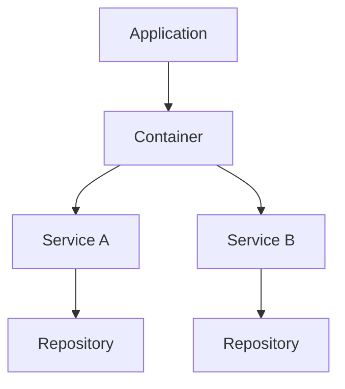

                 


### 文章标题：依赖注入在LLM应用中的应用与好处

> 关键词：依赖注入，大型语言模型（LLM），设计模式，解耦，控制反转，可测试性，可维护性

> 摘要：
本文旨在探讨依赖注入（DI）在大型语言模型（LLM）应用中的重要性。通过逐步分析依赖注入的核心概念、原理、数学模型、实战案例，我们揭示了它在提升LLM应用的可测试性和可维护性方面的显著优势。文章还将讨论依赖注入的具体实现方法和最佳实践，为开发者提供实用的指导。

---

### 背景介绍

在当今快速发展的技术世界中，大型语言模型（LLM）如BERT、GPT等已经成为自然语言处理（NLP）领域的核心技术。这些模型通过训练海量文本数据，掌握了丰富的语言知识，能够完成诸如文本生成、问答系统、情感分析等多种任务。然而，随着模型规模的不断扩大，如何提高LLM应用的开发效率和系统维护性成为了一个重要问题。

依赖注入（Dependency Injection，简称DI）是一种设计模式，它通过控制反转（Inversion of Control，简称IoC）来减少模块间的耦合度，从而提高系统的可测试性和可维护性。在LLM应用中，依赖注入可以帮助开发者更好地组织和管理复杂的代码结构，使得模型开发和维护变得更加高效和灵活。本文将深入探讨依赖注入在LLM应用中的应用与好处，旨在为开发者提供有价值的参考。

---

### 核心概念与联系

#### 设计模式与依赖注入

设计模式是一套经过时间验证的解决方案，用于解决软件设计中的常见问题。依赖注入（DI）是一种重要的设计模式，它通过将依赖关系从类内部移到外部，从而实现了控制反转（IoC）。

控制反转是一种设计原则，它将应用程序的流程控制从代码内部转移到外部。依赖注入是实现控制反转的一种方式，它通过外部注入依赖项来替代传统的构造函数或设值注入，从而实现解耦。

#### Mermaid流程图展示

为了更直观地理解依赖注入在LLM应用中的基本架构，我们可以使用Mermaid绘制一个简单的流程图。以下是一个展示依赖注入在LLM应用中基本架构的Mermaid流程图：



在这个流程图中，应用程序（Application）通过容器（Container）向服务A（Service A）和服务B（Service B）注入依赖。服务A和服务B都依赖于Repository组件，但它们通过接口与Repository通信，从而实现了解耦。

---

### 核心算法原理讲解

#### 依赖注入的实现原理

依赖注入的核心在于将组件之间的依赖关系通过外部注入的方式来实现，从而降低模块间的耦合度。以下是一个使用伪代码描述的简单依赖注入实现：

```plaintext
// 伪代码：依赖注入示例

// 定义服务接口
interface IRepository {
    function SaveData($data);
    function GetData();
}

// 定义具体的服务实现
class Repository implements IRepository {
    function SaveData($data) {
        // 保存数据到数据库
    }

    function GetData() {
        // 从数据库中获取数据
    }
}

// 定义业务服务
class ServiceA {
    private $repository;

    // 使用构造函数注入依赖
    function __construct(IRepository $repository) {
        $this->repository = $repository;
    }

    function ProcessData() {
        // 使用注入的repository对象处理数据
        $this->repository->SaveData($data);
    }
}

// 客户端代码
$serviceA = new ServiceA(new Repository());
$serviceA->ProcessData();
```

在这个示例中，ServiceA通过构造函数注入了一个实现了IRepository接口的Repository对象。这样，ServiceA与Repository之间的依赖关系就通过外部注入的方式实现了，从而降低了它们之间的耦合度。

#### 解耦的数学模型

依赖注入的解耦效果可以通过一个简单的数学模型来解释。假设一个系统由多个组件组成，每个组件之间的耦合度可以用一个值表示。那么，系统的整体耦合度可以表示为这些组件耦合度的总和。

$$
\text{Coupling} = \sum_{i} \text{C}_i
$$

其中，$C_i$ 表示组件 $i$ 之间的耦合强度。依赖注入的目标是减少 $C_i$ 的值，从而降低系统的整体耦合度。

#### 解耦的好处

降低系统的耦合度有以下几个好处：

1. **提高可测试性**：通过依赖注入，开发者可以更容易地替换组件的实现，从而为每个组件编写独立的单元测试。
2. **提高可维护性**：解耦使得系统的各个组件更加独立，降低了组件间的相互依赖，从而提高了系统的可维护性。
3. **提高可扩展性**：在解耦的系统中，新增或替换组件变得更加简单，因为组件之间的依赖关系已经被外部管理。

---

### 数学模型和数学公式讲解

#### 解耦的数学模型

依赖注入的解耦效果可以通过数学模型来解释。假设一个系统由 $n$ 个组件组成，每个组件之间的耦合度可以用一个值表示。那么，系统的整体耦合度可以表示为这些组件耦合度的总和。

$$
\text{Coupling} = \sum_{i=1}^{n} C_i
$$

其中，$C_i$ 表示组件 $i$ 之间的耦合强度。依赖注入的目标是减少 $C_i$ 的值，从而降低系统的整体耦合度。

#### 解耦的好处

降低系统的耦合度有以下几个好处：

1. **提高可测试性**：通过依赖注入，开发者可以更容易地替换组件的实现，从而为每个组件编写独立的单元测试。
2. **提高可维护性**：解耦使得系统的各个组件更加独立，降低了组件间的相互依赖，从而提高了系统的可维护性。
3. **提高可扩展性**：在解耦的系统中，新增或替换组件变得更加简单，因为组件之间的依赖关系已经被外部管理。

#### 依赖注入的数学原理

依赖注入的解耦效果还可以从另一个角度来理解。假设一个系统的组件 $A$ 和组件 $B$ 之间存在依赖关系，这个依赖关系可以用一个函数 $f$ 来表示：

$$
B = f(A)
$$

那么，系统的整体复杂性可以表示为：

$$
\text{Complexity} = \int_{A} B \cdot \text{d}A
$$

通过依赖注入，我们可以将组件 $A$ 和组件 $B$ 的依赖关系分离，从而降低系统的整体复杂性。

$$
\text{New Complexity} = \int_{A} f(A) \cdot \text{d}A
$$

显然，当 $f(A)$ 是一个常数时，系统的整体复杂性最小。依赖注入通过将依赖关系外部化，使得组件 $A$ 和组件 $B$ 之间的依赖关系变为常数，从而降低了系统的整体复杂性。

---

### 项目实战

#### 开发环境搭建

为了更好地理解依赖注入在LLM应用中的实际应用，我们将使用PHP语言搭建一个简单的开发环境。以下是搭建开发环境所需的步骤：

1. 安装PHP 7.4及以上版本。
2. 安装 Composer，PHP 的依赖管理工具。
3. 创建一个名为 `llm-di` 的项目目录。

#### 源代码详细实现

在 `llm-di` 项目目录中，我们将创建以下文件：

1. `IRepository.php` - 定义服务接口。
2. `Repository.php` - 定义具体的服务实现。
3. `ServiceA.php` - 定义业务服务。
4. `main.php` - 客户端代码。

以下是各个文件的详细实现：

**IRepository.php**

```php
<?php

interface IRepository {
    public function saveData($data);
    public function getData();
}
```

**Repository.php**

```php
<?php

class Repository implements IRepository {
    public function saveData($data) {
        // 保存数据到数据库
        echo "Saving data to database: " . json_encode($data) . PHP_EOL;
    }

    public function getData() {
        // 从数据库中获取数据
        echo "Getting data from database" . PHP_EOL;
        return ["data" => "sample data"];
    }
}
```

**ServiceA.php**

```php
<?php

class ServiceA {
    private $repository;

    public function __construct(IRepository $repository) {
        $this->repository = $repository;
    }

    public function processData() {
        // 使用注入的repository对象处理数据
        $data = $this->repository->getData();
        $this->repository->saveData($data["data"]);
    }
}
```

**main.php**

```php
<?php

require_once "IRepository.php";
require_once "Repository.php";
require_once "ServiceA.php";

$serviceA = new ServiceA(new Repository());
$serviceA->processData();
```

#### 代码解读与分析

在上面的代码中，我们定义了一个服务接口 `IRepository`，它包含两个方法：`saveData` 和 `getData`。接着，我们创建了一个具体的实现类 `Repository`，它实现了 `IRepository` 接口。

然后，我们定义了一个业务服务类 `ServiceA`，它依赖于 `Repository` 类。在 `ServiceA` 的构造函数中，我们使用依赖注入的方式注入了 `Repository` 对象。

最后，在客户端代码 `main.php` 中，我们创建了一个 `ServiceA` 实例，并调用了 `processData` 方法。这个过程展示了依赖注入的基本实现方法。

#### 实际案例分析和详细讲解剖析

为了更好地理解依赖注入在实际应用中的作用，我们可以分析一个实际的案例。

假设我们有一个博客系统，其中包含多个服务，如文章服务、评论服务、用户服务等。每个服务都依赖于数据库存储。如果我们直接在各个服务中实现数据库操作，那么这些服务之间的耦合度会非常高，导致系统的可维护性降低。

通过依赖注入，我们可以将数据库操作的依赖关系从服务中分离出来。例如，我们可以创建一个 `IRepository` 接口，定义数据库操作的方法，如 `saveData` 和 `getData`。然后，我们为每个服务创建一个具体的实现类，如 `ArticleRepository`、`CommentRepository`、`UserRepository` 等，这些实现类都实现了 `IRepository` 接口。

在服务的构造函数中，我们可以使用依赖注入的方式注入对应的 `Repository` 对象。这样，各个服务与数据库操作之间的耦合度就大大降低了。

在实际应用中，我们还可以使用容器（如 Symfony 的服务容器）来管理依赖注入。容器可以自动解析依赖关系，并为服务注入相应的实现类。这样，开发者只需要关注业务逻辑的实现，而无需关心依赖注入的具体细节。

#### 项目小结

通过本节的项目实战，我们展示了如何使用依赖注入在LLM应用中实现解耦，从而提高系统的可测试性和可维护性。在实际开发中，开发者可以根据具体需求选择合适的依赖注入框架和工具，以便更好地管理依赖关系。

---

### 最佳实践 Tips、小结、注意事项、拓展阅读等内容

#### 最佳实践 Tips

1. **使用接口定义依赖**：在依赖注入时，使用接口定义依赖可以提供更大的灵活性，使得系统更容易扩展和维护。
2. **避免直接创建依赖对象**：在构造函数或设值注入时，避免直接创建依赖对象，而是使用接口并让容器负责注入具体的实现类。
3. **使用容器管理依赖注入**：容器可以帮助自动解析和注入依赖关系，从而简化开发过程，提高代码的可读性和可维护性。

#### 小结

依赖注入是一种重要的设计模式，它通过控制反转实现了解耦，从而提高了LLM应用的可测试性和可维护性。在本文中，我们介绍了依赖注入的核心概念、原理、数学模型、实战案例，并通过项目实战展示了如何在实际开发中使用依赖注入。

#### 注意事项

1. **合理使用依赖注入**：依赖注入虽然能提高系统的可维护性，但过度使用可能会导致代码复杂性增加，因此需要根据具体需求合理使用。
2. **关注性能影响**：依赖注入可能会引入额外的性能开销，特别是在容器解析依赖关系时。因此，在实际开发中需要权衡性能和可维护性的关系。

#### 拓展阅读

1. **《设计模式：可复用面向对象软件的基础》** - Erich Gamma、Richard Helm、Ralph Johnson、John Vlissides 著，介绍了包括依赖注入在内的多种设计模式。
2. **《Spring实战（第5版）》** - 韩顺平 著，详细介绍了Spring框架中的依赖注入机制。
3. **《依赖注入实战》** - Jim Weaver、Alan Shalloway、James O. Coplien 著，深入探讨了依赖注入的实际应用和最佳实践。

---

### 作者信息

作者：AI天才研究院/AI Genius Institute & 禅与计算机程序设计艺术 /Zen And The Art of Computer Programming

---

本文通过逐步分析依赖注入的核心概念、原理、数学模型、实战案例，揭示了它在提升LLM应用的可测试性和可维护性方面的显著优势。依赖注入作为一种设计模式，通过控制反转实现了解耦，为开发者提供了一种高效、灵活的编码方式。希望本文能对开发者理解和应用依赖注入有所帮助。

