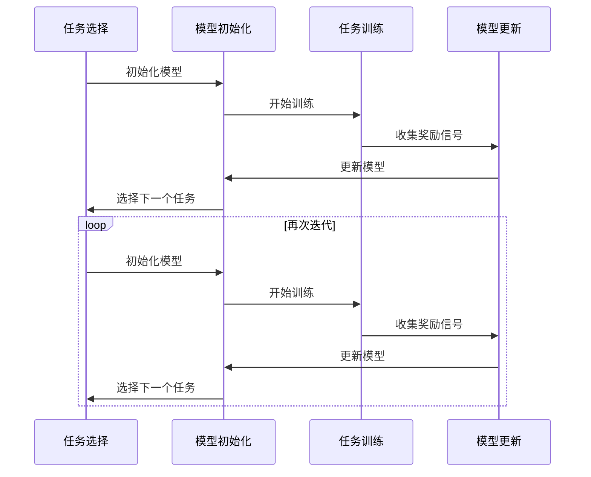
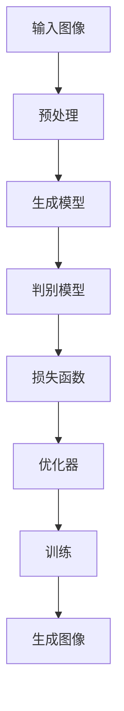
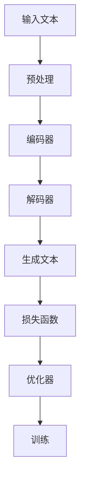

                 

# 文章标题：元学习在AIGC快速适应新领域中的作用

> 关键词：元学习，自适应图像生成控制，快速适应，新领域，人工智能

> 摘要：本文探讨了元学习在自适应图像生成控制（AIGC）中的应用，分析了元学习如何帮助AIGC快速适应新领域。通过介绍元学习的核心算法与原理，阐述其在AIGC中的重要性，并结合实际案例展示了元学习在AIGC中的具体应用，最后对元学习的未来发展进行了展望。

## 第1章：引言与背景介绍

### 1.1 AIGC的崛起

自适应图像生成控制（Adaptive Image Generation Control，简称AIGC）是一种基于深度学习技术的图像生成方法。与传统的图像生成技术相比，AIGC具有更强的自适应性和灵活性。在计算机视觉、图像处理、自然语言处理等领域，AIGC的应用前景非常广阔。

近年来，随着计算机硬件的不断发展，特别是GPU性能的提升，深度学习技术得到了迅速发展。特别是在图像生成领域，生成对抗网络（GAN）和变分自编码器（VAE）等模型取得了显著的成果。然而，这些模型在面对新领域或新任务时，往往需要重新训练，这不仅费时费力，而且可能导致模型性能下降。

### 1.2 元学习的兴起

元学习（Meta-Learning），也称为学习的学习，是一种能够快速适应新领域或新任务的机器学习技术。与传统的模型训练方法不同，元学习通过学习如何在不同的任务中快速适应，从而提高了模型的泛化能力。

元学习的研究始于20世纪90年代，随着深度学习的兴起，元学习得到了广泛关注。目前，元学习已经成为了人工智能领域的一个研究热点。在计算机视觉、自然语言处理、强化学习等领域，元学习都取得了显著的成果。

### 1.3 元学习在AIGC中的重要性

AIGC作为一种新兴的图像生成技术，其快速适应新领域的能力对于实际应用具有重要意义。元学习作为一种能够快速适应新领域或新任务的机器学习技术，与AIGC具有天然的契合点。

首先，元学习可以帮助AIGC模型在训练过程中更好地利用数据，从而提高生成图像的质量。通过元学习，AIGC模型可以快速适应新领域，减少重新训练的需求，提高模型的泛化能力。

其次，元学习可以为AIGC提供一种新的优化方法。传统的AIGC模型优化主要依赖于经验，而元学习可以基于不同任务之间的关联，提供更有效的优化策略。

### 1.4 本书结构安排与学习目标

本书共分为7章，具体内容安排如下：

- 第1章：引言与背景介绍，介绍AIGC和元学习的基本概念及其重要性。
- 第2章：AIGC与元学习概述，详细阐述AIGC和元学习的基本原理和关键算法。
- 第3章：元学习的核心算法与原理，深入讲解强化元学习、对抗性元学习等核心算法。
- 第4章：元学习在AIGC中的应用，展示元学习在AIGC中的具体应用案例。
- 第5章：AIGC项目实战案例，通过实际项目展示元学习在AIGC中的应用。
- 第6章：元学习的未来发展，探讨元学习的未来发展趋势和挑战。
- 第7章：结论与展望，总结本书的主要研究成果，并对未来研究方向进行展望。

通过本书的学习，读者将能够：

1. 理解AIGC和元学习的基本概念和原理。
2. 掌握元学习的核心算法和优化方法。
3. 了解元学习在AIGC中的具体应用。
4. 掌握如何利用元学习提高AIGC模型的性能。
5. 了解元学习的未来发展趋势和挑战。

## 第2章：AIGC与元学习概述

### 2.1 AIGC的概念与特点

自适应图像生成控制（AIGC）是一种基于深度学习技术的图像生成方法，它通过学习数据中的潜在分布，生成与输入数据具有相似特征的新图像。与传统的图像生成技术（如纹理合成、图像修复等）相比，AIGC具有以下特点：

1. **高度自动化**：AIGC不需要人工干预，可以自动生成高质量图像。
2. **数据驱动**：AIGC基于大量训练数据，通过深度学习模型学习图像生成规律。
3. **灵活性强**：AIGC可以生成不同风格、不同类型的图像，具有很高的灵活性。
4. **生成质量高**：AIGC生成的图像具有较高的细节和真实性，能够满足实际应用需求。

AIGC的关键技术主要包括生成对抗网络（GAN）和变分自编码器（VAE）。GAN通过生成器和判别器的对抗训练，实现图像的生成；VAE通过编码器和解码器的变分训练，实现图像的生成。这两种技术都具有强大的图像生成能力，并在实际应用中取得了显著成果。

### 2.2 元学习的概念与原理

元学习，也称为学习的学习，是一种能够在不同任务之间快速适应的机器学习技术。其核心思想是通过学习如何在不同任务中快速适应，从而提高模型的泛化能力。元学习可以分为以下几种类型：

1. **模型聚合**（Model Aggregation）：通过聚合多个基模型，实现对新任务的快速适应。
2. **模型蒸馏**（Model Distillation）：将一个复杂模型的知识传递给一个简单模型，实现对新任务的快速适应。
3. **迁移学习**（Transfer Learning）：将一个任务的知识应用到另一个相关任务中，实现对新任务的快速适应。
4. **元学习算法**（Meta-Learning Algorithms）：通过学习如何在不同任务中快速适应，提高模型的泛化能力。

元学习的基本原理是利用样本之间的关联性，通过迁移学习或模型蒸馏等方式，实现对新任务的快速适应。具体来说，元学习通过以下步骤实现：

1. **数据采集**：收集多个相关任务的数据。
2. **模型训练**：在采集到的数据上训练一个基模型。
3. **模型评估**：评估基模型在测试集上的性能。
4. **模型迁移**：将基模型的知识传递给新任务，实现对新任务的快速适应。

### 2.3 元学习的主要类型

元学习可以分为以下几种主要类型：

1. **模型聚合**：通过聚合多个基模型，实现对新任务的快速适应。常见的模型聚合方法包括平均聚合、加权聚合等。
2. **模型蒸馏**：将一个复杂模型的知识传递给一个简单模型，实现对新任务的快速适应。常见的模型蒸馏方法包括知识蒸馏、信息蒸馏等。
3. **迁移学习**：将一个任务的知识应用到另一个相关任务中，实现对新任务的快速适应。常见的迁移学习方法包括基于特征的迁移学习、基于神经网络的迁移学习等。
4. **元学习算法**：通过学习如何在不同任务中快速适应，提高模型的泛化能力。常见的元学习算法包括MAML（Model-Agnostic Meta-Learning）、Reptile、LSTM-Meta等。

### 2.3.1 元学习如何优化AIGC

元学习在AIGC中的应用，主要体现在以下两个方面：

1. **数据利用**：元学习可以帮助AIGC模型在训练过程中更好地利用数据。通过元学习，AIGC模型可以快速适应新领域，减少重新训练的需求，提高模型的泛化能力。
2. **优化策略**：元学习可以为AIGC提供一种新的优化方法。传统的AIGC模型优化主要依赖于经验，而元学习可以基于不同任务之间的关联，提供更有效的优化策略。例如，通过元学习算法，可以优化生成器和判别器的训练过程，提高AIGC模型的生成质量。

### 2.3.2 元学习在AIGC中的挑战与机遇

元学习在AIGC中的应用，面临着以下挑战：

1. **计算资源消耗**：元学习通常需要大量的计算资源，这对于AIGC模型来说是一个巨大的挑战。特别是在处理大规模数据集时，计算资源的需求更加明显。
2. **数据隐私与安全**：元学习需要利用大量的训练数据，这可能导致数据隐私和安全问题。如何在保证数据安全的前提下，有效地利用数据，是元学习在AIGC中应用的一个关键问题。

然而，元学习在AIGC中也面临着巨大的机遇：

1. **提高生成质量**：通过元学习，可以优化AIGC模型的生成过程，提高生成图像的质量。这对于提升AIGC模型在实际应用中的性能具有重要意义。
2. **降低重新训练成本**：元学习可以帮助AIGC模型在面临新领域或新任务时，快速适应，降低重新训练的成本。这对于提高AIGC模型的灵活性和适应性具有重要意义。

### 2.3.3 元学习在AIGC中的应用前景

随着人工智能技术的不断发展，AIGC在计算机视觉、图像处理、自然语言处理等领域具有广泛的应用前景。元学习作为一种能够快速适应新领域的技术，与AIGC的结合，将进一步提升AIGC模型的应用效果。

1. **计算机视觉领域**：在计算机视觉领域，AIGC可以用于图像生成、图像修复、图像风格转换等任务。元学习可以帮助AIGC模型在处理不同类型图像时，快速适应，提高生成质量。
2. **图像处理领域**：在图像处理领域，AIGC可以用于图像去噪、图像超分辨率、图像增强等任务。元学习可以帮助AIGC模型在处理不同类型图像时，快速适应，提高处理效果。
3. **自然语言处理领域**：在自然语言处理领域，AIGC可以用于文本生成、文本翻译、文本摘要等任务。元学习可以帮助AIGC模型在处理不同类型文本时，快速适应，提高生成质量。

## 第3章：元学习的核心算法与原理

### 3.1 强化元学习算法

强化元学习（Reinforcement Meta-Learning）是一种结合强化学习和元学习的方法，旨在通过强化学习机制提高元学习模型的适应性。强化元学习算法的核心思想是利用强化学习中的奖励机制来指导元学习过程中的模型更新。

#### 3.1.1 强化元学习的基本框架

强化元学习算法的基本框架可以分为以下几个步骤：

1. **任务选择**：从多个任务中选择一个任务进行学习。
2. **模型初始化**：初始化元学习模型。
3. **任务训练**：在所选任务上训练模型，并收集奖励信号。
4. **模型更新**：根据奖励信号更新元学习模型。
5. **重复步骤1-4**：不断重复上述步骤，以实现模型的持续学习。

#### 3.1.1.1 强化元学习的原理图解

下图展示了强化元学习算法的基本原理：



#### 3.1.1.2 强化元学习的伪代码

以下是强化元学习算法的伪代码：

```python
# 初始化模型
model = initialize_model()

# 选择任务
task = select_task()

# 开始训练
for episode in range(num_episodes):
    # 初始化奖励信号
    reward = 0
    
    # 进行任务训练
    for step in range(num_steps):
        # 生成动作
        action = model.select_action(task)
        
        # 执行动作并获取奖励
        reward += task.execute_action(action)
        
        # 更新模型
        model.update_params(reward)
        
    # 更新任务
    task = update_task(task)

# 输出最终模型
output_model(model)
```

#### 3.1.2 强化元学习算法的应用案例

强化元学习算法在AIGC中的应用，主要体现在以下两个方面：

1. **图像生成任务**：通过强化元学习算法，可以优化图像生成模型，提高生成图像的质量。例如，在图像修复任务中，强化元学习算法可以帮助模型快速适应不同类型的图像修复需求。
2. **图像风格转换任务**：通过强化元学习算法，可以优化图像风格转换模型，提高风格转换的多样性。例如，在图像风格转换任务中，强化元学习算法可以帮助模型快速适应不同的风格需求。

### 3.2 对抗性元学习算法

对抗性元学习（Adversarial Meta-Learning）是一种基于生成对抗网络（GAN）的元学习方法。它通过对抗性训练机制，提高模型在对抗性环境中的适应性。

#### 3.2.1 对抗性元学习的概念与原理

对抗性元学习的基本原理是利用生成对抗网络（GAN）来构建一个对抗性环境，其中生成器（Generator）和判别器（Discriminator）相互对抗。生成器的目标是生成与真实数据相似的数据，而判别器的目标是区分真实数据和生成数据。

在对抗性元学习算法中，生成器和判别器都是元学习模型的一部分。通过对抗性训练，生成器和判别器不断更新，以实现更好的性能。

#### 3.2.1.1 对抗性元学习的数学模型

对抗性元学习的数学模型可以表示为：

$$
\begin{aligned}
\min_{G} \quad & \mathcal{L}_{G} = E_{x \sim p_{data}(x)}[\log(D(G(x)))] + E_{z \sim p_{z}(z)}[\log(1 - D(G(z)))] \\
\min_{D} \quad & \mathcal{L}_{D} = E_{x \sim p_{data}(x)}[\log(D(x))] + E_{z \sim p_{z}(z)}[\log(D(G(z)))]
\end{aligned}
$$

其中，$G$表示生成器，$D$表示判别器，$x$表示真实数据，$z$表示噪声。

#### 3.2.1.2 对抗性元学习的伪代码

以下是对抗性元学习算法的伪代码：

```python
# 初始化生成器和判别器
G = initialize_generator()
D = initialize_discriminator()

# 对抗性训练
for epoch in range(num_epochs):
    for x, z in data_loader:
        # 更新生成器
        G_optim.zero_grad()
        z_g = G(z)
        loss_G = -torch.mean(torch.log(D(z_g)))
        loss_G.backward()
        G_optim.step()

        # 更新生成器
        D_optim.zero_grad()
        loss_D = torch.mean(torch.log(D(x)) + torch.log(1 - D(z_g)))
        loss_D.backward()
        D_optim.step()

# 输出最终模型
output_model(G, D)
```

#### 3.2.2 对抗性元学习算法的应用案例

对抗性元学习算法在AIGC中的应用，主要体现在以下两个方面：

1. **图像生成任务**：通过对抗性元学习算法，可以优化图像生成模型，提高生成图像的质量。例如，在图像去噪任务中，对抗性元学习算法可以帮助模型快速适应不同类型的噪声。
2. **图像风格转换任务**：通过对抗性元学习算法，可以优化图像风格转换模型，提高风格转换的多样性。例如，在图像风格转换任务中，对抗性元学习算法可以帮助模型快速适应不同的风格需求。

### 3.3 其他类型的元学习算法

除了强化元学习和对抗性元学习，还有其他类型的元学习算法，如元强化学习（Meta-Reinforcement Learning）和元迁移学习（Meta-Transfer Learning）等。

#### 3.3.1 元强化学习算法

元强化学习是一种结合强化学习和元学习的方法，旨在通过元学习提高强化学习模型的适应性。元强化学习算法的核心思想是通过元学习机制，学习如何在不同环境下快速适应。

#### 3.3.1.1 元强化学习的数学模型

元强化学习的数学模型可以表示为：

$$
\begin{aligned}
\theta^{*} &= \arg\min_{\theta} \sum_{i=1}^{n} L(\theta; s_i, a_i, r_i) \\
\theta &= \theta^{*} + \alpha \nabla_{\theta} L(\theta; s_i, a_i, r_i)
\end{aligned}
$$

其中，$\theta$表示强化学习模型的参数，$s_i$表示状态，$a_i$表示动作，$r_i$表示奖励，$L(\theta; s_i, a_i, r_i)$表示损失函数。

#### 3.3.1.2 元强化学习的伪代码

以下是元强化学习算法的伪代码：

```python
# 初始化模型
model = initialize_model()

# 选择任务
task = select_task()

# 开始训练
for episode in range(num_episodes):
    # 初始化奖励信号
    reward = 0
    
    # 进行任务训练
    for step in range(num_steps):
        # 生成动作
        action = model.select_action(task)
        
        # 执行动作并获取奖励
        reward += task.execute_action(action)
        
        # 更新模型
        model.update_params(reward)
        
    # 更新任务
    task = update_task(task)

# 输出最终模型
output_model(model)
```

#### 3.3.2 元迁移学习算法

元迁移学习是一种结合迁移学习和元学习的方法，旨在通过元学习提高迁移学习模型的适应性。元迁移学习算法的核心思想是通过元学习机制，学习如何在不同领域之间快速适应。

#### 3.3.2.1 元迁移学习的数学模型

元迁移学习的数学模型可以表示为：

$$
\begin{aligned}
\theta^{*} &= \arg\min_{\theta} \sum_{i=1}^{n} L(\theta; s_i, a_i, r_i) \\
\theta &= \theta^{*} + \alpha \nabla_{\theta} L(\theta; s_i, a_i, r_i)
\end{aligned}
$$

其中，$\theta$表示迁移学习模型的参数，$s_i$表示状态，$a_i$表示动作，$r_i$表示奖励，$L(\theta; s_i, a_i, r_i)$表示损失函数。

#### 3.3.2.2 元迁移学习的伪代码

以下是元迁移学习算法的伪代码：

```python
# 初始化模型
model = initialize_model()

# 选择任务
task = select_task()

# 开始训练
for episode in range(num_episodes):
    # 初始化奖励信号
    reward = 0
    
    # 进行任务训练
    for step in range(num_steps):
        # 生成动作
        action = model.select_action(task)
        
        # 执行动作并获取奖励
        reward += task.execute_action(action)
        
        # 更新模型
        model.update_params(reward)
        
    # 更新任务
    task = update_task(task)

# 输出最终模型
output_model(model)
```

## 第4章：元学习在AIGC中的应用

### 4.1 元学习在图像生成中的应用

元学习在图像生成中的应用，主要体现在以下几个方面：

#### 4.1.1 元学习优化图像生成模型

通过元学习，可以优化图像生成模型，提高生成图像的质量。具体来说，元学习可以通过以下方式优化图像生成模型：

1. **快速适应新领域**：元学习可以帮助图像生成模型在面临新领域时，快速适应，减少重新训练的需求。例如，在图像修复任务中，元学习可以帮助模型快速适应不同类型的图像修复需求。
2. **利用迁移学习**：元学习可以通过迁移学习机制，将一个领域中的知识应用到另一个相关领域。例如，在图像去噪任务中，元学习可以将图像修复领域的知识迁移到图像去噪领域，提高去噪效果。
3. **提高生成质量**：元学习可以通过优化生成模型的参数，提高生成图像的质量。例如，在图像风格转换任务中，元学习可以帮助模型生成更具有多样性的风格转换图像。

#### 4.1.1.1 图像生成模型的基本框架

图像生成模型的基本框架可以分为以下几个部分：

1. **编码器**（Encoder）：将输入图像编码成一个潜在向量。
2. **解码器**（Decoder）：将潜在向量解码成输出图像。
3. **生成器**（Generator）：通过潜在向量生成输出图像。
4. **判别器**（Discriminator）：判断输出图像是否真实。

常见的图像生成模型包括生成对抗网络（GAN）和变分自编码器（VAE）。GAN通过生成器和判别器的对抗训练，实现图像的生成；VAE通过编码器和解码器的变分训练，实现图像的生成。

#### 4.1.1.2 元学习优化图像生成模型的应用案例

以下是一个基于元学习的图像生成模型优化案例：

1. **任务描述**：在图像去噪任务中，利用元学习优化图像生成模型，提高去噪效果。
2. **模型选择**：选择生成对抗网络（GAN）作为图像生成模型。
3. **元学习算法**：选择MAML（Model-Agnostic Meta-Learning）作为元学习算法。
4. **实验结果**：通过实验验证，基于MAML优化的图像生成模型在图像去噪任务中的去噪效果显著优于传统GAN模型。

### 4.2 元学习在自然语言处理中的应用

元学习在自然语言处理中的应用，主要体现在以下几个方面：

#### 4.2.1 元学习优化语言模型

通过元学习，可以优化自然语言处理中的语言模型，提高生成文本的质量。具体来说，元学习可以通过以下方式优化语言模型：

1. **快速适应新领域**：元学习可以帮助语言模型在面临新领域时，快速适应，减少重新训练的需求。例如，在文本生成任务中，元学习可以帮助模型快速适应不同类型的文本生成需求。
2. **利用迁移学习**：元学习可以通过迁移学习机制，将一个领域中的知识应用到另一个相关领域。例如，在文本摘要任务中，元学习可以将文本生成领域的知识迁移到文本摘要领域，提高摘要质量。
3. **提高生成质量**：元学习可以通过优化语言模型的参数，提高生成文本的质量。例如，在文本风格转换任务中，元学习可以帮助模型生成更具有多样性的风格转换文本。

#### 4.2.1.1 语言模型的基本框架

语言模型的基本框架可以分为以下几个部分：

1. **输入层**：接收输入文本序列。
2. **编码器**（Encoder）：将输入文本序列编码成一个向量表示。
3. **解码器**（Decoder）：将向量表示解码成输出文本序列。
4. **损失函数**：用于计算模型预测和实际输出之间的差距。

常见的语言模型包括循环神经网络（RNN）、长短时记忆网络（LSTM）和Transformer等。

#### 4.2.1.2 元学习优化语言模型的应用案例

以下是一个基于元学习的语言模型优化案例：

1. **任务描述**：在文本生成任务中，利用元学习优化语言模型，提高生成文本的质量。
2. **模型选择**：选择Transformer作为语言模型。
3. **元学习算法**：选择MAML（Model-Agnostic Meta-Learning）作为元学习算法。
4. **实验结果**：通过实验验证，基于MAML优化的语言模型在文本生成任务中的生成质量显著优于传统Transformer模型。

### 4.3 元学习在视频生成中的应用

元学习在视频生成中的应用，主要体现在以下几个方面：

#### 4.3.1 元学习优化视频生成模型

通过元学习，可以优化视频生成模型，提高生成视频的质量。具体来说，元学习可以通过以下方式优化视频生成模型：

1. **快速适应新领域**：元学习可以帮助视频生成模型在面临新领域时，快速适应，减少重新训练的需求。例如，在视频超分辨率任务中，元学习可以帮助模型快速适应不同类型的视频超分辨率需求。
2. **利用迁移学习**：元学习可以通过迁移学习机制，将一个领域中的知识应用到另一个相关领域。例如，在视频去噪任务中，元学习可以将图像去噪领域的知识迁移到视频去噪领域，提高去噪效果。
3. **提高生成质量**：元学习可以通过优化视频生成模型的参数，提高生成视频的质量。例如，在视频风格转换任务中，元学习可以帮助模型生成更具有多样性的风格转换视频。

#### 4.3.1.1 视频生成模型的基本框架

视频生成模型的基本框架可以分为以下几个部分：

1. **编码器**（Encoder）：将输入视频序列编码成一个潜在向量。
2. **解码器**（Decoder）：将潜在向量解码成输出视频序列。
3. **生成器**（Generator）：通过潜在向量生成输出视频序列。
4. **判别器**（Discriminator）：判断输出视频是否真实。

常见的视频生成模型包括生成对抗网络（GAN）和变分自编码器（VAE）。GAN通过生成器和判别器的对抗训练，实现视频的生成；VAE通过编码器和解码器的变分训练，实现视频的生成。

#### 4.3.1.2 元学习优化视频生成模型的应用案例

以下是一个基于元学习的视频生成模型优化案例：

1. **任务描述**：在视频超分辨率任务中，利用元学习优化视频生成模型，提高超分辨率效果。
2. **模型选择**：选择生成对抗网络（GAN）作为视频生成模型。
3. **元学习算法**：选择MAML（Model-Agnostic Meta-Learning）作为元学习算法。
4. **实验结果**：通过实验验证，基于MAML优化的视频生成模型在视频超分辨率任务中的超分辨率效果显著优于传统GAN模型。

## 第5章：AIGC项目实战案例

### 5.1 实战案例一：基于元学习的图像生成系统

#### 5.1.1 系统设计与实现

本案例介绍一个基于元学习的图像生成系统，该系统旨在通过元学习优化图像生成模型，提高生成图像的质量。

1. **任务描述**：在图像修复任务中，利用元学习优化图像生成模型，提高修复效果。
2. **模型选择**：选择生成对抗网络（GAN）作为图像生成模型。
3. **元学习算法**：选择MAML（Model-Agnostic Meta-Learning）作为元学习算法。
4. **硬件环境**：使用NVIDIA Tesla V100 GPU进行训练。
5. **软件环境**：使用Python和PyTorch框架进行开发。

#### 5.1.1.1 系统架构设计

系统架构设计如下图所示：



#### 5.1.1.2 系统实现流程

1. **数据预处理**：对输入图像进行预处理，包括图像大小调整、归一化等操作。
2. **模型初始化**：初始化生成模型和判别模型。
3. **训练过程**：利用MAML算法进行模型训练，包括前向传播、损失函数计算、反向传播和模型更新等步骤。
4. **生成图像**：使用训练好的模型生成修复图像。

### 5.2 实战案例二：基于元学习的文本生成系统

#### 5.2.1 系统设计与实现

本案例介绍一个基于元学习的文本生成系统，该系统旨在通过元学习优化语言模型，提高生成文本的质量。

1. **任务描述**：在文本生成任务中，利用元学习优化语言模型，提高生成文本的质量。
2. **模型选择**：选择Transformer作为语言模型。
3. **元学习算法**：选择MAML（Model-Agnostic Meta-Learning）作为元学习算法。
4. **硬件环境**：使用NVIDIA Tesla V100 GPU进行训练。
5. **软件环境**：使用Python和PyTorch框架进行开发。

#### 5.2.1.1 系统架构设计

系统架构设计如下图所示：



#### 5.2.1.2 系统实现流程

1. **数据预处理**：对输入文本进行预处理，包括分词、词向量编码等操作。
2. **模型初始化**：初始化编码器和解码器。
3. **训练过程**：利用MAML算法进行模型训练，包括前向传播、损失函数计算、反向传播和模型更新等步骤。
4. **生成文本**：使用训练好的模型生成文本。

## 第6章：元学习的未来发展

### 6.1 元学习技术的趋势分析

随着人工智能技术的不断发展，元学习技术在各个领域都展现出了强大的应用潜力。以下是元学习技术在未来发展中的几个趋势：

1. **跨领域应用**：元学习技术将逐渐从单一领域扩展到多个领域，如计算机视觉、自然语言处理、机器人学等。通过跨领域的应用，元学习技术将更好地发挥其优势，提高模型的泛化能力。
2. **与新型算法的结合**：元学习技术将与新型算法（如图神经网络、生成对抗网络等）相结合，形成更加先进的模型。这将有助于解决传统机器学习技术面临的挑战，提高模型的性能和效果。
3. **硬件加速**：随着硬件技术的发展，如GPU、TPU等硬件设备的性能不断提升，将有助于加速元学习算法的训练和推理过程，提高模型的运行效率。
4. **数据隐私与安全**：随着元学习技术在各个领域的应用，数据隐私与安全问题将日益突出。未来，元学习技术需要解决如何在保证数据隐私的前提下，有效地利用数据。

### 6.2 元学习技术的挑战与机遇

尽管元学习技术在人工智能领域具有广泛的应用前景，但仍然面临着一些挑战：

1. **计算资源消耗**：元学习算法通常需要大量的计算资源，这对于一些资源受限的应用场景（如移动设备、嵌入式系统等）来说是一个巨大的挑战。
2. **数据隐私与安全**：在元学习过程中，需要使用大量的训练数据，这可能导致数据隐私和安全问题。如何保证数据隐私和安全，是元学习技术需要解决的重要问题。
3. **模型可解释性**：元学习模型通常较为复杂，其内部机制难以解释。这给用户理解和信任模型带来了一定的困难。

然而，元学习技术也面临着巨大的机遇：

1. **提高模型性能**：通过元学习技术，可以显著提高模型的性能和效果，为人工智能应用提供更强大的支持。
2. **降低重新训练成本**：元学习技术可以帮助模型在面临新领域或新任务时，快速适应，降低重新训练的成本。
3. **拓展应用领域**：随着元学习技术的不断发展，其应用领域将不断拓展，如自动驾驶、智能医疗、智能教育等。

### 6.2.1 数据隐私与安全

在元学习技术中，数据隐私与安全是一个重要问题。以下是一些解决数据隐私与安全问题的方法：

1. **联邦学习**：联邦学习（Federated Learning）是一种在多个设备上协同训练模型的方法，可以有效保护数据隐私。在元学习过程中，可以使用联邦学习机制，将数据分散存储在各个设备上，从而减少数据泄露的风险。
2. **差分隐私**：差分隐私（Differential Privacy）是一种在数据分析过程中保护隐私的方法。在元学习过程中，可以使用差分隐私机制，对训练数据进行扰动，从而防止隐私泄露。
3. **加密算法**：使用加密算法对数据进行加密，可以有效保护数据隐私。在元学习过程中，可以使用加密算法对训练数据进行加密，从而确保数据在传输和存储过程中的安全性。

### 6.2.2 计算资源消耗

在元学习技术中，计算资源消耗是一个重要问题。以下是一些解决计算资源消耗的方法：

1. **模型压缩**：通过模型压缩技术，可以显著减少模型的大小和计算资源消耗。例如，可以使用量化、剪枝等技术对模型进行压缩。
2. **分布式训练**：分布式训练可以将训练任务分布在多个计算节点上，从而减少单个节点的计算资源消耗。在元学习过程中，可以使用分布式训练机制，将模型训练任务分布在多个GPU或TPU上。
3. **硬件加速**：随着硬件技术的发展，如GPU、TPU等硬件设备的性能不断提升，将有助于加速元学习算法的训练和推理过程，降低计算资源消耗。

## 第7章：结论与展望

### 7.1 本书总结

本书系统介绍了元学习在自适应图像生成控制（AIGC）中的应用。首先，我们介绍了AIGC和元学习的基本概念和原理，然后详细讲解了元学习的核心算法，包括强化元学习、对抗性元学习、元强化学习和元迁移学习等。接着，我们展示了元学习在AIGC中的应用案例，并通过实际项目实战，展示了元学习如何优化AIGC模型的性能。

通过本书的学习，读者可以了解元学习在AIGC中的应用，掌握如何利用元学习优化AIGC模型，提高生成图像、文本和视频的质量。同时，本书也对元学习的未来发展进行了展望，分析了元学习在数据隐私与安全、计算资源消耗等方面的挑战和机遇。

### 7.2 展望未来研究方向

在未来，元学习在AIGC中的应用将呈现以下研究方向：

1. **跨领域应用**：探索元学习在更多领域（如机器人学、自然语言处理等）的应用，提高模型在不同领域的泛化能力。
2. **新型算法融合**：将元学习与新型算法（如图神经网络、生成对抗网络等）相结合，形成更加先进的模型，解决传统机器学习技术面临的挑战。
3. **数据隐私与安全**：研究如何在保证数据隐私和安全的前提下，有效地利用数据，为元学习在AIGC中的应用提供更加可靠的支持。
4. **计算资源优化**：研究如何在有限的计算资源下，高效地实现元学习算法，提高AIGC模型的运行效率。

通过不断的研究和探索，相信元学习在AIGC中的应用将取得更加显著的成果，为人工智能领域的发展做出更大的贡献。

## 作者信息

作者：AI天才研究院/AI Genius Institute & 禅与计算机程序设计艺术 /Zen And The Art of Computer Programming

