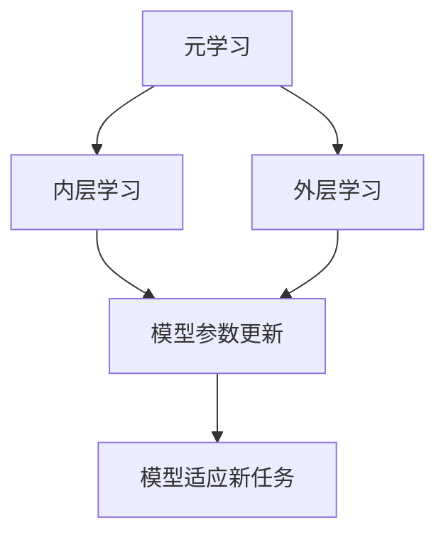

                 


### 文章标题

# 元学习：构建快速适应新任务的AI系统

### 文章关键词

- 元学习
- 快速适应
- AI系统
- 算法原理
- 数学模型
- 应用场景
- 项目实战

### 文章摘要

本文将深入探讨元学习这一前沿AI领域，解析其定义、分类及关键概念，详细讲解模型无关和模型依赖的元学习算法，阐述其数学模型和公式。同时，本文将探讨元学习在不同领域的应用，并通过实际项目实战，帮助读者理解并掌握元学习的技术原理和实践技巧。

### 引言

在人工智能领域，传统的机器学习算法依赖于大量标记数据进行训练，这使得它们在处理新任务时往往需要重新进行训练。然而，现实世界中，我们面临的任务种类繁多，且数据获取可能受限。因此，如何让AI系统能够快速适应新任务，成为了研究的热点。元学习（Meta-Learning）作为一种新兴的方法，致力于解决这一挑战。本文旨在介绍元学习的概念、原理和应用，帮助读者构建快速适应新任务的AI系统。

### 基础概念

#### 元学习的定义

元学习是指训练一个学习算法，使其能够快速适应新任务的过程。与传统机器学习不同，元学习算法不需要大量的新数据，而是通过从旧任务中提取知识，使得新任务的学习变得更加高效。

#### 元学习的分类

元学习可以分为模型无关的元学习（Model-Agnostic Meta-Learning，MAML）和模型依赖的元学习（Model-Aware Meta-Learning）。模型无关的元学习不依赖于特定的学习算法，而是通过优化模型参数的更新过程，使得模型能够快速适应新任务。而模型依赖的元学习则针对特定的学习算法，通过调整算法的参数，提高其对新任务的适应性。

#### 元学习的关键概念

1. **内层学习（Inner Learning）**：指在元学习过程中，模型在特定任务上的学习过程。
2. **外层学习（Outer Learning）**：指在元学习过程中，模型在任务集合上的学习过程。
3. **元梯度（Meta-Gradient）**：用于优化模型参数，使其能够快速适应新任务的梯度。

### Mermaid 流程图

下面是一个简单的 Mermaid 流程图，展示了元学习的基本概念之间的关系：



### 算法原理

#### 模型无关的元学习

模型无关的元学习算法不依赖于特定的学习算法，而是通过优化模型参数的更新过程，使得模型能够快速适应新任务。其中，MAML（Model-Agnostic Meta-Learning）是一种典型的模型无关的元学习算法。

**MAML算法的核心原理：**

MAML算法通过最小化模型在不同任务上的适应误差，优化模型参数的更新过程。其目标函数为：

$$
\min_{\theta} \sum_{i=1}^{N} \frac{1}{N} \sum_{t=1}^{T} \ell(\theta^{(i)}; x^{(i)}_{t}, y^{(i)}_{t})
$$

其中，$\ell(\theta^{(i)}; x^{(i)}_{t}, y^{(i)}_{t})$ 表示模型在任务 $i$ 上的损失函数，$N$ 表示任务数量，$T$ 表示任务 $i$ 的时间步数。

**MAML算法的伪代码：**

```
initialize parameters θ
for each task τ do
    perform inner-loop optimization to obtain θ^τ
    update global parameters θ using gradient descent:
        θ = θ - η * ∇θ L(θ^τ)
return θ
```

#### 模型依赖的元学习

模型依赖的元学习算法针对特定的学习算法，通过调整算法的参数，提高其对新任务的适应性。其中，REINFORCE算法和PEARL算法是两种常见的模型依赖的元学习算法。

**REINFORCE算法的核心原理：**

REINFORCE算法通过最大化模型的预期回报，优化模型参数。其目标函数为：

$$
J(\theta) = E_{\pi(\theta)}[R]
$$

其中，$R$ 表示回报函数，$\pi(\theta)$ 表示策略网络。

**REINFORCE算法的伪代码：**

```
initialize parameters θ
for each episode do
    sample actions a_t from policy π(θ)
    observe reward r_t
    update parameters θ using REINFORCE rule:
        θ = θ + α * ∇θ log π(θ)(a_t)
return θ
```

**PEARL算法的核心原理：**

PEARL算法通过最大化模型的预期回报，同时考虑模型的稳定性。其目标函数为：

$$
J(\theta) = E_{\pi(\theta)}[R - λ \cdot \frac{1}{T} \sum_{t=1}^{T} \ell(\theta; s_t, a_t, r_t)]
$$

其中，$λ$ 表示平衡回报和稳定性的权重。

**PEARL算法的伪代码：**

```
initialize parameters θ
for each episode do
    sample actions a_t from policy π(θ)
    observe reward r_t
    update parameters θ using PEARL rule:
        θ = θ + α * ∇θ [R - λ \cdot \ell(\theta; s_t, a_t, r_t)]
return θ
```

### 数学模型

在元学习算法中，数学模型和公式起着至关重要的作用。以下是对元学习中常用的一些数学模型和公式的详细讲解。

#### 概率模型

概率模型是元学习的基础，它用于描述数据分布和模型参数之间的关系。常见的概率模型包括贝叶斯网络、隐马尔可夫模型（HMM）和条件概率模型。

**贝叶斯网络：**

贝叶斯网络是一种图形模型，它用有向无环图（DAG）表示变量之间的概率关系。其核心公式为：

$$
P(X) = \prod_{i=1}^{n} P(X_i | parents(X_i))
$$

**隐马尔可夫模型（HMM）：**

隐马尔可夫模型是一种统计模型，用于描述隐藏状态序列和观察序列之间的关系。其核心公式为：

$$
P(O|λ) = \sum_{Q} P(O|λ, Q)P(Q)
$$

**条件概率模型：**

条件概率模型用于描述给定某个条件下，另一个事件发生的概率。其核心公式为：

$$
P(A|B) = \frac{P(A \cap B)}{P(B)}
$$

#### 信息论基础

信息论是元学习中的重要工具，它用于衡量数据的不确定性、有效性和复杂性。常见的信息论度量包括熵、信息增益和交叉熵。

**熵（Entropy）：**

熵用于衡量一个随机变量的不确定性。其公式为：

$$
H(X) = -\sum_{i=1}^{n} P(X_i) \log_2 P(X_i)
$$

**信息增益（Information Gain）：**

信息增益用于衡量一个特征对于分类的贡献。其公式为：

$$
IG(X, Y) = H(Y) - H(Y|X)
$$

**交叉熵（Cross-Entropy）：**

交叉熵用于衡量两个概率分布之间的差异。其公式为：

$$
H(Y, Y') = -\sum_{i=1}^{n} P(Y_i) \log_2 P(Y'_i)
$$

#### 对数损失函数

对数损失函数是元学习算法中常用的损失函数，它用于衡量模型预测结果与实际结果之间的差异。常见的对数损失函数包括对数似然损失和对数误差损失。

**对数似然损失（Log-Likelihood Loss）：**

对数似然损失用于衡量模型预测的概率分布与实际分布之间的差异。其公式为：

$$
L(\theta; X, Y) = -\sum_{i=1}^{n} \log P(Y_i | X_i; \theta)
$$

**对数误差损失（Log-Er

