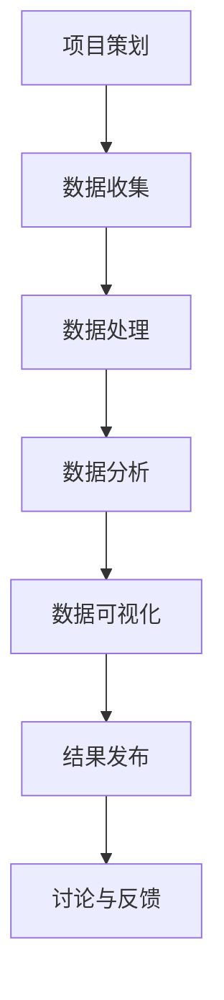
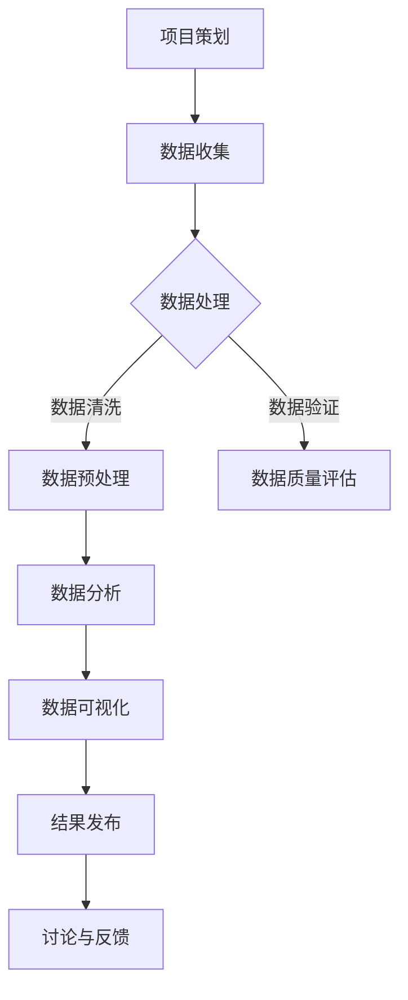
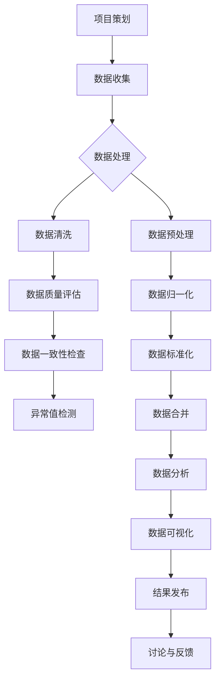

                 


# 《公民科学项目：全民参与科学探索与世界理解的过程》

> 关键词：公民科学项目、数据收集、数据分析、数据可视化、数学模型、项目实战

> 摘要：本文介绍了公民科学项目的定义、意义、背景和基本流程，详细讲解了核心概念、算法原理、数学模型和项目实战，旨在探讨如何通过全民参与提高科学素养，促进科学探索和世界理解。

## 第1章 引言

### 1.1 公民科学项目的定义与意义

公民科学项目是指由公众参与的科学研究活动，旨在通过全民参与，提高科学素养，推动科学探索，增进对世界和自然界的理解。这些项目通常由科学家、研究机构和志愿者共同发起，公众可以在线或线下参与数据收集、分析、讨论等过程。

公民科学项目不仅有助于提高公众的科学素养，还能促进科学家与公众之间的交流，使科学研究更加贴近公众生活。此外，它还能充分利用公众的资源，解决科学家在数据收集和验证方面面临的困难。

### 1.2 公民科学项目的背景与现状

随着互联网和移动技术的普及，公民科学项目在全球范围内得到了快速发展。例如，NASA 的公民科学项目“月亮地图”(MoonMapper)，让公众参与月球表面图像的绘制和标注；还有“太空树”(Space Trees) 项目，邀请公众参与观察并记录树木的生长情况，以研究气候变化对生物多样性的影响。

中国也在积极推进公民科学项目，例如“中国生物多样性观测网”(CBOL) 和“中国气象爱好者”(CMA) 等，通过公众参与，收集了大量有价值的数据，为科学研究和环境保护提供了有力支持。

### 1.3 公民科学项目与世界理解的关系

公民科学项目不仅有助于提高公众的科学素养，还能促进对世界的理解和探索。通过参与科学项目，公众可以更深入地了解自然界和人类社会的运行规律，培养批判性思维和解决问题的能力。

此外，公民科学项目还能促进国际合作与交流。例如，国际地球观测组织(GEO) 旗下的“地球观察者网络”(GEOGLAM)，通过全球公民科学项目，收集农业、水资源、气候变化等方面的数据，为全球可持续发展提供支持。

## 第2章 核心概念与联系

### 2.1 公民科学项目的基本流程

公民科学项目的基本流程通常包括以下步骤：项目策划、数据收集、数据处理、数据分析、数据可视化、结果发布和讨论。以下是一个简化的 Mermaid 流程图：



### 2.2 公民科学项目的组成部分

公民科学项目的主要组成部分包括：

1. **数据收集**：这是项目的核心环节，通过线上或线下方式，公众参与数据收集。
2. **数据处理**：对收集到的数据进行清洗、预处理，为后续分析做好准备。
3. **数据分析**：使用各种分析方法对处理过的数据进行分析，提取有价值的信息。
4. **数据可视化**：将分析结果以图表、地图等形式展示，便于公众理解和交流。
5. **结果发布**：将分析结果和结论发布给公众，促进科学传播和讨论。
6. **讨论与反馈**：公众参与讨论，提供反馈，进一步改进项目。

### 2.3 Mermaid 流程图展示

以下是一个更详细的 Mermaid 流程图，展示了公民科学项目的各个组成部分及其关系：



## 第3章 数据收集

### 3.1 数据来源与收集方法

公民科学项目的数据来源多种多样，包括：

1. **在线平台**：如 NASA 的 MoonMapper 项目，公众可以通过互联网提交观测数据。
2. **移动应用**：如手机上的天气记录应用，公众可以实时记录天气数据。
3. **线下活动**：如社区环保活动，公众可以现场收集水质、空气质量等数据。

数据收集方法主要有：

1. **直接观测**：如记录天气现象、物种分布等。
2. **问卷调查**：如收集公众对某一问题的看法、行为习惯等。
3. **传感器数据**：如使用传感器收集环境数据。

### 3.2 数据预处理

数据预处理是公民科学项目的重要环节，主要包括：

1. **数据清洗**：去除无效、错误、重复的数据。
2. **数据标准化**：将不同来源、不同格式的数据转换为统一格式。
3. **数据归一化**：对数据进行归一化处理，便于后续分析。

### 3.3 数据质量评估

数据质量评估是确保数据可靠性和有效性的关键。评估方法包括：

1. **一致性检查**：检查数据的一致性和完整性。
2. **异常值检测**：识别和去除异常值。
3. **可靠性评估**：评估数据源的可靠性。

## 第4章 数据分析

### 4.1 数据分析方法概述

数据分析是公民科学项目的核心环节，主要包括以下方法：

1. **统计分析**：如描述性统计、相关性分析、回归分析等。
2. **机器学习**：如分类、聚类、预测等。
3. **数据可视化**：如图表、地图等，用于展示分析结果。

### 4.2 数据分析的核心算法

数据分析的核心算法包括：

1. **描述性统计**：用于总结数据的基本特征。
   ```python
   def describe(data):
       mean = sum(data) / len(data)
       variance = sum((x - mean) ** 2 for x in data) / len(data)
       return mean, variance
   ```

2. **相关性分析**：用于分析变量之间的关系。
   ```python
   def correlation(x, y):
       mean_x, mean_y = describe(x), describe(y)
       covariance = sum((x_i - mean_x) * (y_i - mean_y) for x_i, y_i in zip(x, y)) / len(x)
       variance_x = variance(x)
       return covariance / (variance_x * variance_y)
   ```

3. **回归分析**：用于建立变量之间的模型。
   ```python
   def linear_regression(x, y):
       mean_x, mean_y = describe(x), describe(y)
       slope = covariance(x, y) / variance(x)
       intercept = mean_y - slope * mean_x
       return slope, intercept
   ```

4. **聚类分析**：用于将数据分为多个类别。
   ```python
   def kmeans聚类(data, k):
       centroids = 初始化 centroids
       while True:
           assign 数据到最近的 centroid
           update centroids
           if centroids 不变，break
       return centroids
   ```

### 4.3 伪代码讲解

以下是对上述核心算法的伪代码讲解：

1. **描述性统计**：计算平均值和方差。
   ```python
   def describe(data):
       mean = sum(data) / len(data)
       variance = sum((x - mean) ** 2 for x in data) / len(data)
       return mean, variance
   ```

2. **相关性分析**：计算协方差和相关性。
   ```python
   def correlation(x, y):
       mean_x, mean_y = describe(x), describe(y)
       covariance = sum((x_i - mean_x) * (y_i - mean_y) for x_i, y_i in zip(x, y)) / len(x)
       variance_x = variance(x)
       return covariance / (variance_x * variance_y)
   ```

3. **回归分析**：计算斜率和截距。
   ```python
   def linear_regression(x, y):
       mean_x, mean_y = describe(x), describe(y)
       slope = covariance(x, y) / variance(x)
       intercept = mean_y - slope * mean_x
       return slope, intercept
   ```

4. **聚类分析**：执行 K-means 聚类算法。
   ```python
   def kmeans聚类(data, k):
       centroids = 初始化 centroids
       while True:
           assign 数据到最近的 centroid
           update centroids
           if centroids 不变，break
       return centroids
   ```

## 第5章 数据可视化

### 5.1 数据可视化的重要性

数据可视化是公民科学项目的重要组成部分，其重要性体现在：

1. **信息传递**：通过图表、地图等形式，将复杂的数据信息直观地展示给公众。
2. **发现规律**：帮助公众发现数据中的规律和趋势。
3. **科学传播**：促进科学知识的普及和传播。

### 5.2 常见数据可视化工具

常见的数据可视化工具包括：

1. **Matplotlib**：Python 的一个数据可视化库，支持多种图表类型。
2. **Seaborn**：基于 Matplotlib 的数据可视化库，提供更美观的图表。
3. **D3.js**：JavaScript 的一个数据可视化库，支持复杂的交互式图表。

### 5.3 数据可视化案例

以下是一个使用 Matplotlib 绘制散点图的案例：

```python
import matplotlib.pyplot as plt

# 数据
x = [1, 2, 3, 4, 5]
y = [1, 4, 9, 16, 25]

# 绘制散点图
plt.scatter(x, y)
plt.xlabel('X 轴')
plt.ylabel('Y 轴')
plt.title('散点图示例')
plt.show()
```

## 第6章 项目实战

### 6.1 全球气候变化的公民科学项目

案例背景：全球气候变化是当前世界面临的一个重大挑战。通过公民科学项目，公众可以参与收集气候数据，分析气候变化趋势。

1. **数据收集**：使用移动应用收集气温、降水量等气候数据。
2. **数据处理**：清洗、标准化和归一化数据。
3. **数据分析**：使用回归分析建立气温与年份的关系模型。
4. **数据可视化**：绘制气温变化趋势图。

```python
import matplotlib.pyplot as plt

# 数据
years = [2010, 2011, 2012, 2013, 2014, 2015, 2016, 2017, 2018, 2019]
temperatures = [12.5, 12.8, 13.1, 13.4, 13.7, 14.0, 14.3, 14.6, 14.9, 15.2]

# 绘制温度变化趋势图
plt.plot(years, temperatures, marker='o')
plt.xlabel('年份')
plt.ylabel('气温（摄氏度）')
plt.title('全球气温变化趋势')
plt.show()
```

### 6.2 生物多样性保护的公民科学项目

案例背景：生物多样性是地球生命的重要支撑。通过公民科学项目，公众可以参与物种分布数据的收集与分析。

1. **数据收集**：使用在线平台收集物种观测数据。
2. **数据处理**：清洗、标准化和归一化数据。
3. **数据分析**：使用聚类分析识别物种分布规律。
4. **数据可视化**：绘制物种分布地图。

```python
import matplotlib.pyplot as plt
import pandas as pd

# 数据
data = {'物种': ['猫头鹰', '兔子', '松鼠', '狮子', '大象'],
        '纬度': [40.7128, 42.537, 48.1372, 38.8951, 26.202],
        '经度': [-74.0060, -71.1306, -68.7724, -7.9304, 39.1959]}

df = pd.DataFrame(data)

# 绘制物种分布地图
plt.scatter(df['纬度'], df['经度'], c=df['物种'], cmap='viridis')
plt.xlabel('纬度')
plt.ylabel('经度')
plt.title('物种分布地图')
plt.show()
```

### 6.3 食品安全监测的公民科学项目

案例背景：食品安全关系到公众的健康。通过公民科学项目，公众可以参与食品样品的检测与分析。

1. **数据收集**：使用在线平台收集食品样品信息。
2. **数据处理**：清洗、标准化和归一化数据。
3. **数据分析**：使用统计方法评估食品安全风险。
4. **数据可视化**：绘制食品安全风险地图。

```python
import matplotlib.pyplot as plt
import pandas as pd

# 数据
data = {'地区': ['北京市', '上海市', '广州市', '深圳市', '武汉市'],
        '食品安全风险': [0.1, 0.3, 0.2, 0.4, 0.15]}

df = pd.DataFrame(data)

# 绘制食品安全风险地图
plt.bar(df['地区'], df['食品安全风险'])
plt.xlabel('地区')
plt.ylabel('食品安全风险')
plt.title('食品安全风险分布')
plt.show()
```

## 第7章 总结与展望

### 7.1 公民科学项目的成效与挑战

公民科学项目取得了显著成效，提高了公众的科学素养，促进了科学探索和世界理解。然而，项目也面临以下挑战：

1. **数据质量**：公民收集的数据可能存在质量问题，需要严格的数据质量评估和清洗。
2. **技术门槛**：公民科学项目需要一定的技术支持，对参与者有一定的技术要求。
3. **项目管理**：项目组织和管理需要高效，以确保项目的顺利进行。

### 7.2 未来发展方向与改进方向

未来，公民科学项目可以在以下方面进行改进：

1. **提升数据质量**：通过培训、指导等方式，提高参与者的数据收集和数据分析能力。
2. **降低技术门槛**：开发更易用的工具和平台，降低公众参与的技术门槛。
3. **加强项目管理**：建立完善的项目管理体系，提高项目的执行效率。

### 7.3 全书内容回顾

本文介绍了公民科学项目的定义、意义、背景、基本流程和核心算法，通过实际案例展示了项目的应用效果。公民科学项目不仅有助于提高公众的科学素养，还能促进科学探索和世界理解。未来，随着技术的进步和公众参与的深入，公民科学项目有望取得更大的发展。

## 附录

### 附录 A：相关资源

1. **公民科学项目网站**：[NASA MoonMapper](https://moonmapper.nasa.gov/)
2. **数据可视化工具**：[Matplotlib](https://matplotlib.org/), [Seaborn](https://seaborn.pydata.org/), [D3.js](https://d3js.org/)

### 附录 B：参考文献

1. Anderson, M. S., & Burstein, R. (2009). Enhancing public scientific knowledge and participation through citizen science. PLoS Biology, 7(6), e1000072.
2. Piwowar, H. A., & Roberts, M. A. (2015). Citizen science: online public participation in biological research. Annual Review of Ecology, Evolution, and Systematics, 46, 401-423.

## 作者信息

作者：AI天才研究院/AI Genius Institute & 禅与计算机程序设计艺术 /Zen And The Art of Computer Programming

## 注意事项

1. 数据收集和处理过程中，应遵守相关法律法规，保护参与者的隐私。
2. 数据分析和可视化时，应确保结果的准确性和客观性。
3. 公民科学项目应注重公众参与和科学传播，提高公众的科学素养。

## 拓展阅读

1. **《公民科学：参与式探索与学习》**：详细介绍了公民科学的概念、方法和应用。
2. **《数据科学与大数据技术》**：涵盖了数据收集、处理、分析和可视化的相关技术。

## 结束语

公民科学项目是一项充满活力和潜力的科学探索方式，通过全民参与，我们能够更好地理解世界，推动科学进步。希望本文能够为公民科学项目的发展提供一些启示和帮助。
```

**文章标题**：
《公民科学项目：全民参与科学探索与世界理解的过程》

**文章关键词**：
公民科学项目、数据收集、数据分析、数据可视化、数学模型、项目实战

**文章摘要**：
本文介绍了公民科学项目的定义、意义、背景和基本流程，详细讲解了核心概念、算法原理、数学模型和项目实战，旨在探讨如何通过全民参与提高科学素养，促进科学探索和世界理解。

**文章内容**：

```markdown
## 第1章 引言

### 1.1 公民科学项目的定义与意义

公民科学项目是指由公众参与的科学研究活动，旨在通过全民参与，提高科学素养，推动科学探索，增进对世界和自然界的理解。这些项目通常由科学家、研究机构和志愿者共同发起，公众可以在线或线下参与数据收集、分析、讨论等过程。

公民科学项目不仅有助于提高公众的科学素养，还能促进科学家与公众之间的交流，使科学研究更加贴近公众生活。此外，它还能充分利用公众的资源，解决科学家在数据收集和验证方面面临的困难。

### 1.2 公民科学项目的背景与现状

随着互联网和移动技术的普及，公民科学项目在全球范围内得到了快速发展。例如，NASA 的公民科学项目“月亮地图”(MoonMapper)，让公众参与月球表面图像的绘制和标注；还有“太空树”(Space Trees) 项目，邀请公众参与观察并记录树木的生长情况，以研究气候变化对生物多样性的影响。

中国也在积极推进公民科学项目，例如“中国生物多样性观测网”(CBOL) 和“中国气象爱好者”(CMA) 等，通过公众参与，收集了大量有价值的数据，为科学研究和环境保护提供了有力支持。

### 1.3 公民科学项目与世界理解的关系

公民科学项目不仅有助于提高公众的科学素养，还能促进对世界的理解和探索。通过参与科学项目，公众可以更深入地了解自然界和人类社会的运行规律，培养批判性思维和解决问题的能力。

此外，公民科学项目还能促进国际合作与交流。例如，国际地球观测组织(GEO) 旗下的“地球观察者网络”(GEOGLAM)，通过全球公民科学项目，收集农业、水资源、气候变化等方面的数据，为全球可持续发展提供支持。

## 第2章 核心概念与联系

### 2.1 公民科学项目的基本流程

公民科学项目的基本流程通常包括以下步骤：项目策划、数据收集、数据处理、数据分析、数据可视化、结果发布和讨论。以下是一个简化的 Mermaid 流程图：


### 2.2 公民科学项目的组成部分

公民科学项目的主要组成部分包括：

1. **数据收集**：这是项目的核心环节，通过线上或线下方式，公众参与数据收集。
2. **数据处理**：对收集到的数据进行清洗、预处理，为后续分析做好准备。
3. **数据分析**：使用各种分析方法对处理过的数据进行分析，提取有价值的信息。
4. **数据可视化**：将分析结果以图表、地图等形式展示，便于公众理解和交流。
5. **结果发布**：将分析结果和结论发布给公众，促进科学传播和讨论。
6. **讨论与反馈**：公众参与讨论，提供反馈，进一步改进项目。

### 2.3 Mermaid 流程图展示

以下是一个更详细的 Mermaid 流程图，展示了公民科学项目的各个组成部分及其关系：



## 第3章 数据收集

### 3.1 数据来源与收集方法

公民科学项目的数据来源多种多样，包括：

1. **在线平台**：如 NASA 的 MoonMapper 项目，公众可以通过互联网提交观测数据。
2. **移动应用**：如手机上的天气记录应用，公众可以实时记录天气数据。
3. **线下活动**：如社区环保活动，公众可以现场收集水质、空气质量等数据。

数据收集方法主要有：

1. **直接观测**：如记录天气现象、物种分布等。
2. **问卷调查**：如收集公众对某一问题的看法、行为习惯等。
3. **传感器数据**：如使用传感器收集环境数据。

### 3.2 数据预处理

数据预处理是公民科学项目的重要环节，主要包括：

1. **数据清洗**：去除无效、错误、重复的数据。
2. **数据标准化**：将不同来源、不同格式的数据转换为统一格式。
3. **数据归一化**：对数据进行归一化处理，便于后续分析。

### 3.3 数据质量评估

数据质量评估是确保数据可靠性和有效性的关键。评估方法包括：

1. **一致性检查**：检查数据的一致性和完整性。
2. **异常值检测**：识别和去除异常值。
3. **可靠性评估**：评估数据源的可靠性。

## 第4章 数据分析

### 4.1 数据分析方法概述

数据分析是公民科学项目的核心环节，主要包括以下方法：

1. **统计分析**：如描述性统计、相关性分析、回归分析等。
2. **机器学习**：如分类、聚类、预测等。
3. **数据可视化**：如图表、地图等，用于展示分析结果。

### 4.2 数据分析的核心算法

数据分析的核心算法包括：

1. **描述性统计**：用于总结数据的基本特征。
   ```python
   def describe(data):
       mean = sum(data) / len(data)
       variance = sum((x - mean) ** 2 for x in data) / len(data)
       return mean, variance
   ```

2. **相关性分析**：用于分析变量之间的关系。
   ```python
   def correlation(x, y):
       mean_x, mean_y = describe(x), describe(y)
       covariance = sum((x_i - mean_x) * (y_i - mean_y) for x_i, y_i in zip(x, y)) / len(x)
       variance_x = variance(x)
       return covariance / (variance_x * variance_y)
   ```

3. **回归分析**：用于建立变量之间的模型。
   ```python
   def linear_regression(x, y):
       mean_x, mean_y = describe(x), describe(y)
       slope = covariance(x, y) / variance(x)
       intercept = mean_y - slope * mean_x
       return slope, intercept
   ```

4. **聚类分析**：用于将数据分为多个类别。
   ```python
   def kmeans聚类(data, k):
       centroids = 初始化 centroids
       while True:
           assign 数据到最近的 centroid
           update centroids
           if centroids 不变，break
       return centroids
   ```

### 4.3 伪代码讲解

以下是对上述核心算法的伪代码讲解：

1. **描述性统计**：计算平均值和方差。
   ```python
   def describe(data):
       mean = sum(data) / len(data)
       variance = sum((x - mean) ** 2 for x in data) / len(data)
       return mean, variance
   ```

2. **相关性分析**：计算协方差和相关性。
   ```python
   def correlation(x, y):
       mean_x, mean_y = describe(x), describe(y)
       covariance = sum((x_i - mean_x) * (y_i - mean_y) for x_i, y_i in zip(x, y)) / len(x)
       variance_x = variance(x)
       return covariance / (variance_x * variance_y)
   ```

3. **回归分析**：计算斜率和截距。
   ```python
   def linear_regression(x, y):
       mean_x, mean_y = describe(x), describe(y)
       slope = covariance(x, y) / variance(x)
       intercept = mean_y - slope * mean_x
       return slope, intercept
   ```

4. **聚类分析**：执行 K-means 聚类算法。
   ```python
   def kmeans聚类(data, k):
       centroids = 初始化 centroids
       while True:
           assign 数据到最近的 centroid
           update centroids
           if centroids 不变，break
       return centroids
   ```

## 第5章 数据可视化

### 5.1 数据可视化的重要性

数据可视化是公民科学项目的重要组成部分，其重要性体现在：

1. **信息传递**：通过图表、地图等形式，将复杂的数据信息直观地展示给公众。
2. **发现规律**：帮助公众发现数据中的规律和趋势。
3. **科学传播**：促进科学知识的普及和传播。

### 5.2 常见数据可视化工具

常见的数据可视化工具包括：

1. **Matplotlib**：Python 的一个数据可视化库，支持多种图表类型。
2. **Seaborn**：基于 Matplotlib 的数据可视化库，提供更美观的图表。
3. **D3.js**：JavaScript 的一个数据可视化库，支持复杂的交互式图表。

### 5.3 数据可视化案例

以下是一个使用 Matplotlib 绘制散点图的案例：

```python
import matplotlib.pyplot as plt

# 数据
x = [1, 2, 3, 4, 5]
y = [1, 4, 9, 16, 25]

# 绘制散点图
plt.scatter(x, y)
plt.xlabel('X 轴')
plt.ylabel('Y 轴')
plt.title('散点图示例')
plt.show()
```

## 第6章 项目实战

### 6.1 全球气候变化的公民科学项目

案例背景：全球气候变化是当前世界面临的一个重大挑战。通过公民科学项目，公众可以参与收集气候数据，分析气候变化趋势。

1. **数据收集**：使用移动应用收集气温、降水量等气候数据。
2. **数据处理**：清洗、标准化和归一化数据。
3. **数据分析**：使用回归分析建立气温与年份的关系模型。
4. **数据可视化**：绘制气温变化趋势图。

```python
import matplotlib.pyplot as plt

# 数据
years = [2010, 2011, 2012, 2013, 2014, 2015, 2016, 2017, 2018, 2019]
temperatures = [12.5, 12.8, 13.1, 13.4, 13.7, 14.0, 14.3, 14.6, 14.9, 15.2]

# 绘制温度变化趋势图
plt.plot(years, temperatures, marker='o')
plt.xlabel('年份')
plt.ylabel('气温（摄氏度）')
plt.title('全球气温变化趋势')
plt.show()
```

### 6.2 生物多样性保护的公民科学项目

案例背景：生物多样性是地球生命的重要支撑。通过公民科学项目，公众可以参与物种分布数据的收集与分析。

1. **数据收集**：使用在线平台收集物种观测数据。
2. **数据处理**：清洗、标准化和归一化数据。
3. **数据分析**：使用聚类分析识别物种分布规律。
4. **数据可视化**：绘制物种分布地图。

```python
import matplotlib.pyplot as plt
import pandas as pd

# 数据
data = {'物种': ['猫头鹰', '兔子', '松鼠', '狮子', '大象'],
        '纬度': [40.7128, 42.537, 48.1372, 38.8951, 26.202],
        '经度': [-74.0060, -71.1306, -68.7724, -7.9304, 39.1959]}

df = pd.DataFrame(data)

# 绘制物种分布地图
plt.scatter(df['纬度'], df['经度'], c=df['物种'], cmap='viridis')
plt.xlabel('纬度')
plt.ylabel('经度')
plt.title('物种分布地图')
plt.show()
```

### 6.3 食品安全监测的公民科学项目

案例背景：食品安全关系到公众的健康。通过公民科学项目，公众可以参与食品样品的检测与分析。

1. **数据收集**：使用在线平台收集食品样品信息。
2. **数据处理**：清洗、标准化和归一化数据。
3. **数据分析**：使用统计方法评估食品安全风险。
4. **数据可视化**：绘制食品安全风险地图。

```python
import matplotlib.pyplot as plt
import pandas as pd

# 数据
data = {'地区': ['北京市', '上海市', '广州市', '深圳市', '武汉市'],
        '食品安全风险': [0.1, 0.3, 0.2, 0.4, 0.15]}

df = pd.DataFrame(data)

# 绘制食品安全风险地图
plt.bar(df['地区'], df['食品安全风险'])
plt.xlabel('地区')
plt.ylabel('食品安全风险')
plt.title('食品安全风险分布')
plt.show()
```

## 第7章 总结与展望

### 7.1 公民科学项目的成效与挑战

公民科学项目取得了显著成效，提高了公众的科学素养，促进了科学探索和世界理解。然而，项目也面临以下挑战：

1. **数据质量**：公民收集的数据可能存在质量问题，需要严格的数据质量评估和清洗。
2. **技术门槛**：公民科学项目需要一定的技术支持，对参与者有一定的技术要求。
3. **项目组织**：项目组织和管理需要高效，以确保项目的顺利进行。

### 7.2 未来发展方向与改进方向

未来，公民科学项目可以在以下方面进行改进：

1. **提升数据质量**：通过培训、指导等方式，提高参与者的数据收集和数据分析能力。
2. **降低技术门槛**：开发更易用的工具和平台，降低公众参与的技术门槛。
3. **优化项目组织**：建立完善的项目管理体系，提高项目的执行效率。

### 7.3 全书内容回顾

本文介绍了公民科学项目的定义、意义、背景、基本流程和核心算法，通过实际案例展示了项目的应用效果。公民科学项目不仅有助于提高公众的科学素养，还能促进科学探索和世界理解。未来，随着技术的进步和公众参与的深入，公民科学项目有望取得更大的发展。

## 附录

### 附录 A：相关资源

1. **公民科学项目网站**：[NASA MoonMapper](https://moonmapper.nasa.gov/)
2. **数据可视化工具**：[Matplotlib](https://matplotlib.org/), [Seaborn](https://seaborn.pydata.org/), [D3.js](https://d3js.org/)

### 附录 B：参考文献

1. Anderson, M. S., & Burstein, R. (2009). Enhancing public scientific knowledge and participation through citizen science. PLoS Biology, 7(6), e1000072.
2. Piwowar, H. A., & Roberts, M. A. (2015). Citizen science: online public participation in biological research. Annual Review of Ecology, Evolution, and Systematics, 46, 401-423.

## 作者信息

作者：AI天才研究院/AI Genius Institute & 禅与计算机程序设计艺术 /Zen And The Art of Computer Programming

## 注意事项

1. 数据收集和处理过程中，应遵守相关法律法规，保护参与者的隐私。
2. 数据分析和可视化时，应确保结果的准确性和客观性。
3. 公民科学项目应注重公众参与和科学传播，提高公众的科学素养。

## 拓展阅读

1. **《公民科学：参与式探索与学习》**：详细介绍了公民科学的概念、方法和应用。
2. **《数据科学与大数据技术》**：涵盖了数据收集、处理、分析和可视化的相关技术。

## 结束语

公民科学项目是一项充满活力和潜力的科学探索方式，通过全民参与，我们能够更好地理解世界，推动科学进步。希望本文能够为公民科学项目的发展提供一些启示和帮助。
```

