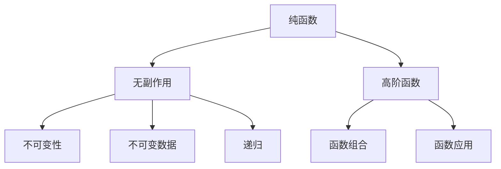
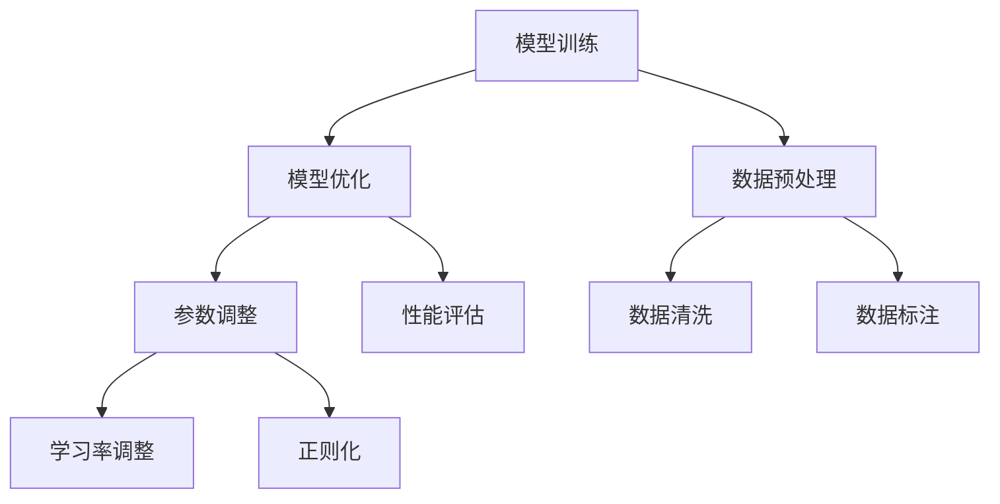

                 

基于您的要求，以下是一个详细的解题思路和步骤，我们将以此为指导来撰写文章：

### 第一步：理解函数式编程范式

**背景介绍：**
首先，我们需要对函数式编程范式有一个全面的理解。函数式编程是一种编程范式，它将计算视为一系列函数的执行，而不是通过修改状态和变量的值来改变程序的行为。这种范式强调函数的纯性和无状态性，以及表达式的不可变性。

**核心概念与联系：**
- **纯函数：** 纯函数是指对于相同的输入始终返回相同输出的函数，没有副作用。
- **不可变性：** 数据在函数式编程中是不可变的，一旦创建就不会改变。
- **高阶函数：** 高阶函数是可以接受其他函数作为参数或将函数作为返回值的函数。

使用Mermaid流程图展示概念关系：



### 第二步：理解大型语言模型（LLM）工程

**背景介绍：**
大型语言模型（LLM）是一种复杂的机器学习模型，用于理解和生成自然语言。LLM工程涉及模型的训练、优化、部署和维护。

**核心概念与联系：**
- **模型训练：** 使用大量数据对模型进行训练，使其能够理解和生成自然语言。
- **模型优化：** 通过调整模型参数来提高模型的性能。
- **模型部署：** 将训练好的模型部署到实际应用环境中，使其能够为用户提供服务。

使用Mermaid流程图展示概念关系：



### 第三步：探讨函数式编程范式在LLM工程中的应用

**核心算法原理讲解：**
- **数据预处理：** 使用函数式编程范式进行数据处理，如过滤、映射、折叠等。
- **模型架构设计：** 使用函数式编程范式设计模型的组件，如网络层、注意力机制等。
- **模型训练与优化：** 使用函数式编程范式进行模型训练和优化，如梯度下降、反向传播等。

伪代码示例：

```python
# 数据预处理
def preprocess_data(data):
    return list(map(clean, data))

# 模型架构设计
def build_model():
    model = Model()
    model.add_layer(Layer())
    model.add_layer(Attention())
    return model

# 模型训练与优化
def train_model(model, data, epochs):
    for epoch in range(epochs):
        model.train(data)
        model.optimize()
```

**数学模型和公式详细讲解：**
- **损失函数：** 使用函数式编程范式定义损失函数，如交叉熵损失函数。
- **优化算法：** 使用函数式编程范式实现优化算法，如梯度下降算法。

LaTeX公式示例：

```latex
\section{损失函数}
\label{sec:loss_function}

\begin{equation}
\begin{aligned}
    J(\theta) &= -\frac{1}{m} \sum_{i=1}^{m} \left[ y^{(i)} \log(a^{(i)}_{y^{(i)}}) + (1 - y^{(i)}) \log(1 - a^{(i)}_{y^{(i)}) \right] \\
    \frac{\partial J}{\partial \theta} &= \frac{1}{m} \sum_{i=1}^{m} \left[ (a^{(i)}_{y^{(i)}} - y^{(i)}) \cdot \delta^{(i)}_{y^{(i)}} - (1 - a^{(i)}_{y^{(i)}}) \cdot \delta^{(i)}_{1-y^{(i)}} \right] \\
    \delta^{(i)}_{j} &= a^{(i)}_{j} \cdot (1 - a^{(i)}_{j}) \cdot \frac{\partial}{\partial a^{(i)}_{j}} L(a^{(i)}; y^{(i)})
\end{aligned}
\end{equation}
```

### 第四步：项目实战

**开发环境搭建：** 
介绍如何搭建一个函数式编程环境，包括安装必要的编程语言和开发工具。

**源代码详细实现和代码解读：** 
提供一个具体的LLM工程示例，详细解读代码实现和逻辑。

**代码应用解读与分析：** 
分析代码的实际应用场景，评估其性能和优势。

**实际案例分析和详细讲解剖析：** 
选择一个或多个实际案例，对其进行分析和讲解。

**项目小结：** 
总结项目的主要收获和不足，提出改进建议。

### 第五步：最佳实践 tips、小结、注意事项、拓展阅读

**最佳实践 tips：** 
提供一些实用的编程技巧和实践经验。

**小结：** 
回顾文章的主要内容和观点，强调函数式编程范式在LLM工程中的应用价值。

**注意事项：** 
提醒读者在实践过程中需要注意的事项。

**拓展阅读：** 
推荐一些相关的书籍、论文和资源，以供进一步学习。

### 文章结构

- **标题：** 《函数式编程范式在LLM工程中的应用》
- **关键词：** 函数式编程、LLM工程、机器学习、数据预处理、模型训练、性能优化
- **摘要：** 本文探讨了函数式编程范式在大型语言模型（LLM）工程中的应用，包括核心概念、算法原理、项目实战和最佳实践。

### 文章字数

根据上述内容，预计文章字数在 8000～12000 字左右。

### 最后的提示

在撰写文章时，确保内容连贯、逻辑清晰，同时注重实际应用和理论结合。每一步都要深入浅出，使读者能够轻松理解并掌握相关知识和技能。

